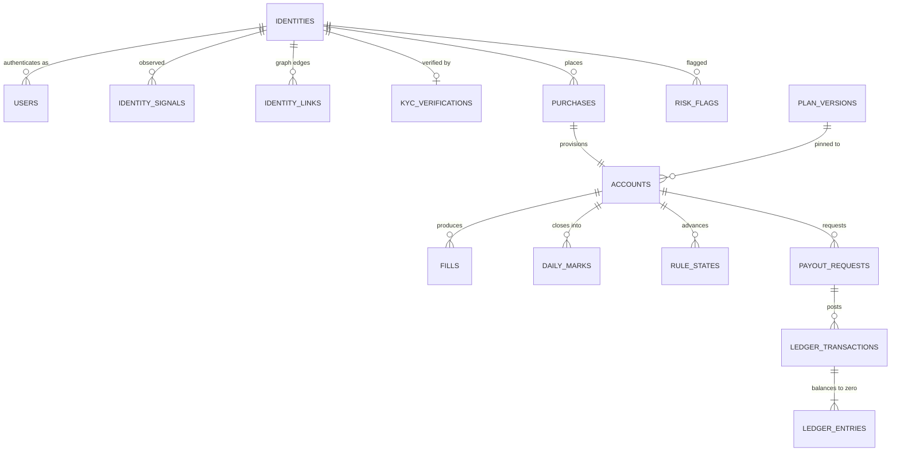

# Data Model (Constitution §3, B1)

Every table, every column, with type, constraints, indexes, retention, and the reason it exists. Terms are defined in [GLOSSARY.md](../GLOSSARY.md). Migrations are sacred: once merged, a migration is never edited, only superseded.

> **Amended under [ADR-026](../DECISIONS.md), 2026-08-14. The schema-delta reconciliation has landed.**
>
> All **94** approved schema changes are folded into one reviewed migration set at [`packages/db/migrations`](../../packages/db/migrations), 27 files, verified to apply in order against PostgreSQL 16. Every delta is traced to the document that proposed it in [`packages/db/DELTA_MANIFEST.md`](../../packages/db/DELTA_MANIFEST.md), which is the file the completeness gate reads. **No delta was rejected.**
>
> **Where the two disagree, the migrations are the truth and this document is the design record.** The tables below are written as they were approved and are being brought to post-migration truth section by section; the sections amended so far are §3 (`kyc_verifications`), §8 (`payout_requests`, `ledger_accounts`), §11, §13, and the new §17. Anything not yet rewritten should be read together with the manifest, exactly as §11 previously said of M01's ten deltas.
>
> **Four rulings changed a column or a value rather than adding one**, and each is folded rather than merely recorded: [ADR-027](../DECISIONS.md) (two distinct per-identity ledger classes, seven in total), [ADR-028](../DECISIONS.md) (`payout_requests.status` and **both** of its index predicates), [ADR-029](../DECISIONS.md) (`dedupe_matched_identity_id` dropped), and [ADR-030](../DECISIONS.md) (`max_payouts`, `kyc.triggers`). The sentence read "three" against a list of four and is corrected here.

> **Further amended, 2026-08-14, by two rulings on `published_statistics`.** [ADR-031](../DECISIONS.md): `value_numeric numeric` becomes **`value bigint`** with a mandatory **`value_unit`**, retiring its no-floats exemption and leaving **two** columns on that list, none of them money. [ADR-032](../DECISIONS.md): **`measure`** joins the table and the window unique key, `statistic_definitions` gains **`measures`**, and **STAT-C1** in `0027` makes "neither figure of a pair is published alone" a database constraint rather than prose. Both amend approved `SD-M12-02`; the second touches the immutability contract on a public surface. Sections amended: §13 (invariants) and §17 (the no-floats exemption list, and the verification record), plus this header.

## 1. Conventions (binding across every table)

**Types**
- Money: `bigint`, always **integer cents**, always non-negative unless the column explicitly represents a signed movement (`ledger_entries.amount_cents`, `daily_marks.realized_pnl_cents`). Never `numeric`, never `float`.
- Ratios: `integer` **basis points**. Never a float, never a percentage string.
- Timestamps: `timestamptz`, stored UTC. Trading dates: `date`, and always the exchange trading day, never a UTC calendar date derived from a timestamp.
- Enums: Postgres native `enum` types for closed sets that change rarely (phases, statuses), `text` with a `check` constraint for sets expected to grow. Each choice is noted per column.
- JSON: `jsonb` only, always with a documented shape, always validated by zod at the write boundary. `jsonb` is used for vendor payloads, rule configs, and evidence, never as a way to avoid designing columns.

**Keys**
- `uuid` (v7, time-ordered) primary keys for anything referenced in a URL or by an external system: `users`, `identities`, `accounts`, `payout_requests`, `purchases`, `risk_flags`, `affiliates`. Time-ordered so index locality is preserved; opaque so a compromised or curious client cannot enumerate neighbours. Enumeration protection is a defence in depth measure and never a substitute for identity scoping.
- `bigint generated always as identity` for high-volume internal rows never exposed by URL: `fills`, `events`, `ledger_entries`, `daily_marks`, `raw_ingest_rows`.
- Foreign keys are always declared with an explicit `on delete` action, and that action is `restrict` for every financial or evidentiary relationship. We do not cascade deletes anywhere in a money path.

**Mutability**
- Append-only tables (`events`, `ledger_entries`, `ledger_transactions`, `admin_actions`, `fills`, `raw_ingest_rows`, `daily_marks`, `rule_states`, `eligibility` snapshots, `identity_merges`): the application role holds `INSERT` and `SELECT` only. No `UPDATE`, no `DELETE`, enforced by grants in the database, not by convention ([VG-8](../../research/VIBE_FAILURE_POSTMORTEMS.md)).
- Mutable tables carry `updated_at` and emit an event on every meaningful transition, so the trail exists even where the row is overwritten.
- Nothing is ever soft-deleted with a boolean. Lifecycle is a status enum with an event trail.

**Naming**: `snake_case`, plural table names, `_cents` and `_bp` suffixes are mandatory on money and ratio columns, `_at` on timestamps, `_on` on dates. A column named `amount` without a unit suffix is a review reject.

**Every table** carries `created_at timestamptz not null default now()`. Mutable tables also carry `updated_at timestamptz not null default now()`.

## 2. The spine

Everything radiates from [trader identity](../GLOSSARY.md#trader-identity), never from email and never from account.



## 3. Identity and authentication

### identities
The resolved human. Account caps, aggregate liability, and ring detection all key here.

| Column | Type | Constraints | Why |
|---|---|---|---|
| `id` | uuid | pk, v7 | external reference |
| `display_name` | text | null | reserved for future leaderboards; nullable because v1 never shows it |
| `leaderboard_opt_in` | boolean | not null default false | reserved per Wave 1 schema list, cheap now, migration later otherwise |
| `status` | enum(`active`,`restricted`,`closed`) | not null default `active` | restriction and closure are identity-level, not account-level |
| `status_reason` | text | null | required by app logic when status is not `active`; the human-readable half of an audited decision |
| `max_accounts_override` | integer | null, check > 0 | per-entity cap override for legitimate edge cases (grandfathered merges, B4 #17) |
| `payouts_frozen` | boolean | not null default false | investigation freeze, set before request time only |
| `frozen_reason` | text | null | ToS citation shown to the trader |
| `frozen_at` | timestamptz | null | drives the freeze-duration alert |
| `first_seen_at` | timestamptz | not null default now() | cohort analysis |
| `created_at`, `updated_at` | timestamptz | not null | |

Indexes: `(status)` partial where status <> 'active'; `(payouts_frozen)` partial where true.
Retention: forever (financial counterparty record).
Invariant: an identity with `payouts_frozen = true` must have `frozen_reason` and `frozen_at` non-null (check constraint).

### users
The authentication principal. One identity may own several users only through a merge; the normal case is one to one.

| Column | Type | Constraints | Why |
|---|---|---|---|
| `id` | uuid | pk | |
| `identity_id` | uuid | fk identities, not null, on delete restrict | every user belongs to a resolved identity |
| `email` | citext | not null, unique | citext so casing never creates a duplicate human |
| `email_normalized` | citext | not null | dots and plus-tags stripped; the entity-resolution key. Indexed but **not** unique: two people can legitimately share a normalized form, so it is a signal, not a constraint |
| `email_verified_at` | timestamptz | null | |
| `country_code` | char(2) | null, check ISO-3166 | geo-block and KYC triangle |
| `timezone` | text | null | display only; never used in rule math |
| `marketing_consent` | boolean | not null default false | |
| `last_login_at` | timestamptz | null | |
| `created_at`, `updated_at` | timestamptz | not null | |

Indexes: unique `(email)`; `(email_normalized)`; `(identity_id)`.
Retention: forever, subject to the deletion runbook (privacy requests redact PII columns and retain the financial spine).

### passkeys
WebAuthn credentials. Merit is [passwordless only](../../research/SECURITY_LANDSCAPE.md), so there is no password table anywhere in this schema, by design.

| Column | Type | Constraints | Why |
|---|---|---|---|
| `id` | uuid | pk | |
| `user_id` | uuid | fk users, not null | |
| `credential_id` | bytea | not null, unique | WebAuthn identifier |
| `public_key` | bytea | not null | |
| `sign_count` | bigint | not null default 0 | clone detection |
| `transports` | text[] | null | |
| `label` | text | null | user-facing device name |
| `last_used_at` | timestamptz | null | |
| `created_at` | timestamptz | not null | |

### otp_challenges
| Column | Type | Constraints | Why |
|---|---|---|---|
| `id` | uuid | pk | |
| `email_normalized` | citext | not null | issued before a user may exist |
| `code_hash` | bytea | not null | never store the code itself |
| `expires_at` | timestamptz | not null | short TTL (10 minutes) |
| `consumed_at` | timestamptz | null | single use enforced by partial unique index |
| `attempts` | smallint | not null default 0, check <= 5 | lockout without enabling user enumeration |
| `request_ip` | inet | null | rate limiting and abuse signal |
| `created_at` | timestamptz | not null | |

Indexes: `(email_normalized, created_at desc)`; partial unique on `(id)` where `consumed_at is null`.
Retention: 30 days.

### sessions
| Column | Type | Constraints | Why |
|---|---|---|---|
| `id` | uuid | pk | |
| `user_id` | uuid | fk users, not null | |
| `refresh_token_hash` | bytea | not null, unique | rotation on every refresh |
| `issued_at` | timestamptz | not null | |
| `expires_at` | timestamptz | not null | short-lived access, rotating refresh |
| `revoked_at` | timestamptz | null | logout, password-less re-auth, admin action |
| `ip` | inet | null | |
| `user_agent` | text | null | |
| `device_fingerprint_id` | uuid | fk identity_signals, null | ties a session to the entity graph |

Retention: 90 days after expiry.

### identity_signals
Observed entity-resolution signals. One row per observation type per value per identity.

| Column | Type | Constraints | Why |
|---|---|---|---|
| `id` | uuid | pk | |
| `identity_id` | uuid | fk identities, not null | |
| `kind` | text | not null, check in (`device`,`ip`,`asn`,`email_normalized`,`payment`,`kyc_identity`,`rise_identity`) | text plus check because this set will grow |
| `value_hash` | bytea | not null | **hashed, never raw**: card BIN plus last four, device id, IP. Minimizes what a breach yields |
| `value_preview` | text | null | non-identifying display fragment for admin (for example `visa ****4242`) |
| `first_seen_at` | timestamptz | not null | |
| `last_seen_at` | timestamptz | not null | |
| `observation_count` | integer | not null default 1 | weak-signal weighting |

Indexes: unique `(identity_id, kind, value_hash)`; `(kind, value_hash)` for reverse lookup (the join that finds every identity sharing a device).
Retention: 24 months rolling for `ip`; forever for `payment` and `kyc_identity` (fraud history).

### identity_links
Graph edges between identities, produced by resolution and by detectors.

| Column | Type | Constraints | Why |
|---|---|---|---|
| `id` | uuid | pk | |
| `identity_a` | uuid | fk identities, not null | |
| `identity_b` | uuid | fk identities, not null, check a <> b | |
| `link_kind` | text | not null | shared device, shared payment, biometric match, behavioural correlation |
| `confidence_bp` | integer | not null, check 0 to 10000 | evidence strength, never a boolean |
| `evidence` | jsonb | not null | the specific observations behind the edge |
| `created_by` | text | not null | detector name or `admin` |
| `created_at` | timestamptz | not null | |

Indexes: unique `(identity_a, identity_b, link_kind)` with a canonical ordering constraint (`identity_a < identity_b`) so an edge is stored once.
Append-only.

### identity_merges
| Column | Type | Constraints | Why |
|---|---|---|---|
| `id` | uuid | pk | |
| `surviving_identity_id` | uuid | fk identities, not null | |
| `merged_identity_id` | uuid | fk identities, not null | |
| `reason` | text | not null | |
| `evidence` | jsonb | not null | |
| `accounts_at_merge` | integer | not null | supports the B4 #17 grandfather policy: over-cap after merge is grandfathered, new purchases blocked |
| `actor` | text | not null | admin or detector |
| `created_at` | timestamptz | not null | |

Append-only. Merging never deletes the merged identity row; it repoints ownership and records this row.

### kyc_verifications
Merit stores **status and references only**. Documents, images, and biometric templates never touch Merit storage ([VG-10](../../research/VIBE_FAILURE_POSTMORTEMS.md)).

| Column | Type | Constraints | Why |
|---|---|---|---|
| `id` | uuid | pk | |
| `identity_id` | uuid | fk identities, not null | |
| `provider` | text | not null | Sumsub, Veriff, Persona class |
| `provider_applicant_id` | text | not null | the only pointer we keep |
| `state` | enum(`kyc_required`,`pending`,`verified`,`rejected`,`expired`) | not null | mirrors the provider lifecycle |
| `placement` | text | not null, check in (`first_purchase`,`second_distinct_account_purchase`,`second_purchase_any`,`eval_pass`,`pre_funded`,`direct_purchase`,`payout_request`) | **Widened by `U-05` under [ADR-021](../DECISIONS.md).** Records **which trigger fired**, not which set was configured. `pre_eval` is retired into `first_purchase`; `payout_request` is invalid as a sole trigger and exists only as a backstop. The frozen `kyc.triggers` value is `['second_distinct_account_purchase','pre_funded']` |
| `document_country` | char(2) | null | geo-consistency triangle |
| `ip_country` | char(2) | null | |
| `payment_country` | char(2) | null | |
| `biometric_dedupe_hit` | boolean | not null default false | the fleet-killer signal. Survives [ADR-029](../DECISIONS.md) because **a boolean cannot contradict a set; it can only be stale, and staleness is detectable** |
| ~~`dedupe_matched_identity_id`~~ | ~~uuid~~ | **DROPPED by [ADR-029](../DECISIONS.md)** | `dedupe_matches` (`SD-M19-04`) is authoritative. A dedupe hit is an **auto-enforcement input**: it bans an account without human review, and a system with two sources for that decision will eventually enforce on whichever is read first. The column is never created, because no row exists to migrate |
| `rejection_reason` | text | null | |
| `verified_at` | timestamptz | null | |
| `expires_at` | timestamptz | null | re-verification triggers |
| `raw_result` | jsonb | not null default '{}' | provider decision metadata only, **never document data** |
| `created_at`, `updated_at` | timestamptz | not null | |

Indexes: `(identity_id, state)`; partial `(biometric_dedupe_hit)` where true.
Retention: forever (AML obligation), PII minimal by construction.

## 4. Catalog and configuration

### plans
| Column | Type | Constraints | Why |
|---|---|---|---|
| `id` | uuid | pk | |
| `code` | text | not null, unique | `core_eod`, `merit_rapid`, `direct` (renamed from `rapid_daily` at the M1 gate, [ADR-013](../DECISIONS.md)) |
| `name` | text | not null | display |
| `is_active` | boolean | not null default true | delisting never deletes |
| `sort_order` | integer | not null default 0 | |
| `created_at`, `updated_at` | timestamptz | not null | |

### plan_versions
The immutable rule contract. This is the single source of truth the engine executes **and** the site renders.

| Column | Type | Constraints | Why |
|---|---|---|---|
| `id` | uuid | pk | |
| `plan_id` | uuid | fk plans, not null | |
| `version` | integer | not null | monotonic per plan |
| `status` | enum(`draft`,`published`,`retired`) | not null default `draft` | only `published` can be sold |
| `rules` | jsonb | not null | the full config, schema in §11 |
| `copy_blocks` | jsonb | not null | published rule text keyed by rule path, so marketing copy and engine parameters ship together |
| `published_at` | timestamptz | null | |
| `retired_at` | timestamptz | null | retirement stops new sales, never touches live accounts |
| `created_by` | text | not null | |
| `created_at` | timestamptz | not null | |

Constraints: unique `(plan_id, version)`. **Rows with `status = 'published'` are immutable**: enforced by a trigger that rejects any update other than `status` moving `published` to `retired` and setting `retired_at`. Publishing a change means creating a new version. This is what makes "the rules at the time" provable (B4 #12).
Retention: forever. A retired version is still needed to explain a 2027 payout in 2031.

### plan_version_sizes
Materialized per-size thresholds. Percentages scale, but the published number must be exact, so it is computed once at publish and never recomputed at runtime.

| Column | Type | Constraints | Why |
|---|---|---|---|
| `id` | uuid | pk | |
| `plan_version_id` | uuid | fk plan_versions, not null | |
| `size_cents` | bigint | not null, check > 0 | 2500000, 5000000, 10000000 |
| `price_cents` | bigint | not null, check > 0 | list price |
| `reset_price_cents` | bigint | not null, check > 0 | |
| `drawdown_cents` | bigint | not null, check > 0 | derived from `drawdown.amount_bp` |
| `profit_target_cents` | bigint | null, check > 0 | null on Direct (no eval) |
| `buffer_cents` | bigint | not null, check >= 0 | |
| `win_day_floor_cents` | bigint | not null, check > 0 | |
| `payout_cap_schedule_cents` | jsonb | not null | ordered steps keyed by payout ordinal; v1 publishes one flat step |
| `daily_loss_limit_cents` | bigint | null | null when the plan has none |
| `floor_lock_at_profit_cents` | bigint | null | |
| `floor_lock_floor_at_cents` | bigint | null | |
| `created_at` | timestamptz | not null | |

Constraints: unique `(plan_version_id, size_cents)`. Immutable once the parent version is published (same trigger).
Justification for existing at all: rounding a percentage at runtime is how a marketing page and an engine end up one cent apart, and one cent is a review-page headline.

### coupons
| Column | Type | Constraints | Why |
|---|---|---|---|
| `id` | uuid | pk | |
| `code` | citext | not null, unique | case-insensitive redemption |
| `discount_kind` | text | not null, check in (`percent`,`fixed`) | |
| `discount_bp` | integer | null, check 0 to 10000 | set when kind is percent |
| `discount_cents` | bigint | null, check > 0 | set when kind is fixed |
| `affiliate_id` | uuid | fk affiliates, null | per-affiliate codes |
| `max_redemptions` | integer | null, check > 0 | null means unlimited |
| `redemption_count` | integer | not null default 0 | maintained transactionally |
| `per_identity_limit` | integer | not null default 1 | blocks one person farming a code |
| `starts_at`, `expires_at` | timestamptz | null | |
| `is_active` | boolean | not null default true | |
| `created_at`, `updated_at` | timestamptz | not null | |

Constraints: check that exactly one of `discount_bp` / `discount_cents` is non-null.
Concurrency: redemption is an atomic claim (see `coupon_redemptions`), never a read-then-write. B4 #11.

### coupon_redemptions
| Column | Type | Constraints | Why |
|---|---|---|---|
| `id` | uuid | pk | |
| `coupon_id` | uuid | fk coupons, not null | |
| `identity_id` | uuid | fk identities, not null | limits are per identity, not per email |
| `purchase_id` | uuid | fk purchases, null | null while the claim is held and the payment is in flight |
| `claimed_at` | timestamptz | not null default now() | |
| `released_at` | timestamptz | null | claim released if payment fails |

Indexes: unique partial `(coupon_id, identity_id)` where `released_at is null` (enforces per-identity limit of one at the database level when the limit is 1); `(coupon_id)` for counting.
This table is why two tabs cannot both win a single-use code: the claim insert is the race, and the unique index decides it.

### tos_versions / tos_acceptances
| tos_versions | Type | Constraints |
|---|---|---|
| `id` | uuid | pk |
| `document` | text | not null, check in (`tos`,`privacy`,`risk_disclosure`,`affiliate_tos`) |
| `version` | integer | not null |
| `body_md` | text | not null |
| `effective_at` | timestamptz | not null |
Unique `(document, version)`. Immutable once `effective_at` has passed.

| tos_acceptances | Type | Constraints |
|---|---|---|
| `id` | uuid | pk |
| `identity_id` | uuid | fk identities, not null |
| `tos_version_id` | uuid | fk tos_versions, not null |
| `accepted_at` | timestamptz | not null |
| `ip` | inet | not null |
| `user_agent` | text | null |
Append-only. Unique `(identity_id, tos_version_id)`. This is the row that proves what a trader agreed to and when, which is the first thing any enforcement dispute asks for.

### geo_restrictions
| Column | Type | Constraints | Why |
|---|---|---|---|
| `country_code` | char(2) | pk | |
| `rule` | text | not null, check in (`block_purchase`,`block_all`,`warn`) | checkout and login behave differently |
| `reason` | text | not null | counsel's rationale, versioned by row history in events |
| `effective_from` | date | not null | |

## 5. Commerce

### purchases
| Column | Type | Constraints | Why |
|---|---|---|---|
| `id` | uuid | pk | |
| `identity_id` | uuid | fk identities, not null | |
| `user_id` | uuid | fk users, not null | who clicked, versus who they are |
| `plan_version_id` | uuid | fk plan_versions, not null | pins the contract at purchase time (B4 #12) |
| `size_cents` | bigint | not null | |
| `kind` | text | not null, check in (`new`,`reset`) | resets reuse the same pipeline |
| `parent_account_id` | uuid | fk accounts, null | set for resets |
| `list_price_cents` | bigint | not null | |
| `discount_cents` | bigint | not null default 0, check >= 0 | |
| `amount_paid_cents` | bigint | not null, check >= 0 | |
| `currency` | char(3) | not null default 'USD' | reserved for multi-currency, never used in v1 math |
| `coupon_id` | uuid | fk coupons, null | |
| `affiliate_id` | uuid | fk affiliates, null | attribution resolved at purchase |
| `psp` | text | not null, check in (`psp_a`,`psp_b`) | which MID took it |
| `psp_reference` | text | not null | |
| `mid_reference` | text | null | the specific merchant account, for MID health |
| `status` | enum(`pending`,`paid`,`failed`,`refunded`,`charged_back`) | not null default `pending` | |
| `paid_at` | timestamptz | null | |
| `ip` | inet | null | geo triangle and velocity |
| `created_at`, `updated_at` | timestamptz | not null | |

Indexes: unique `(psp, psp_reference)` (the idempotency anchor for webhooks); `(identity_id, created_at desc)`; `(status)` partial where status = 'pending' (the paid-not-provisioned alarm query).

### psp_webhook_events
Raw, signed, immutable inbound payment events. Kept separately from `events` because these are third-party assertions, not facts we generated.

| Column | Type | Constraints | Why |
|---|---|---|---|
| `id` | bigint | pk identity | |
| `psp` | text | not null | |
| `provider_event_id` | text | not null | |
| `event_type` | text | not null | |
| `signature_verified` | boolean | not null | recorded, not assumed |
| `payload` | jsonb | not null | as received |
| `received_at` | timestamptz | not null default now() | |
| `processed_at` | timestamptz | null | |
| `processing_result` | text | null | `applied`, `duplicate_ignored`, `out_of_order_deferred`, `rejected_signature` |

Indexes: unique `(psp, provider_event_id)`. That unique index **is** the idempotency guarantee for B4 #9 (duplicate and out-of-order delivery).
Retention: 24 months, then archive.

### payment_disputes
| Column | Type | Constraints | Why |
|---|---|---|---|
| `id` | uuid | pk | |
| `purchase_id` | uuid | fk purchases, not null | |
| `kind` | text | not null, check in (`chargeback`,`refund`) | |
| `amount_cents` | bigint | not null, check > 0 | |
| `reason_code` | text | null | |
| `opened_at` | timestamptz | not null | |
| `resolved_at` | timestamptz | null | |
| `outcome` | text | null, check in (`lost`,`won`,`refunded`) | |
| `ledger_transaction_id` | uuid | fk ledger_transactions, null | the compensating reversal |

Policy encoded elsewhere (M3): a chargeback closes the account, flags the identity, and posts a reversal. Even when the payout already settled and the identity nets negative, the ledger shows the loss honestly (B4 #10).

## 6. Accounts and platform

### accounts
| Column | Type | Constraints | Why |
|---|---|---|---|
| `id` | uuid | pk | |
| `identity_id` | uuid | fk identities, not null | |
| `user_id` | uuid | fk users, not null | |
| `purchase_id` | uuid | fk purchases, not null, unique | one account per purchase |
| `plan_version_id` | uuid | fk plan_versions, not null | **never changes**, for the life of the account |
| `size_cents` | bigint | not null | |
| `phase` | enum(`eval`,`funded`,`closed`,`graduated`) | not null | the lifecycle in [STATE_MACHINES](STATE_MACHINES.md) |
| `status` | enum(`provisioning_pending`,`active`,`breached`,`expired`,`closed_admin`,`closed_chargeback`,`graduated`) | not null | operational state, distinct from phase |
| `platform` | text | not null default `rithmic`, check in (`rithmic`,`tradovate`,`cqg`) | **B3 reservation.** v1 always rithmic |
| `platform_account_ref` | text | null, unique per platform | the Rithmic User ID today, generic tomorrow |
| `feed` | text | null, check in (`rithmic`,`cqg`,`dxfeed`) | **B3 reservation.** Marketing needs it even when ingest does not |
| `front_end_permissions` | jsonb | not null default '[]' | NinjaTrader, Quantower, ATAS and friends; a provisioning input |
| `opened_on` | date | not null | trading day, not a timestamp |
| `funded_on` | date | null | set at eval pass |
| `closed_on` | date | null | |
| `close_reason` | text | null | |
| `payouts_frozen` | boolean | not null default false | account-level freeze, in addition to the identity-level flag |
| `recon_blocked` | boolean | not null default false | set by a failed [reconciliation](../GLOSSARY.md#reconciliation); blocks eligibility until cleared |
| `expires_on` | date | null | eval expiry when configured (v1 unlimited) |
| `created_at`, `updated_at` | timestamptz | not null | |

Indexes: `(identity_id, status)`; unique `(platform, platform_account_ref)` where not null; `(phase)` partial where phase = 'funded' (the open-liability scan); `(status)` partial where status = 'provisioning_pending'.
Retention: forever.
Invariant: `phase = 'funded'` requires `funded_on is not null`; `status in ('breached','closed_admin','closed_chargeback','graduated')` requires `closed_on is not null`.

### account_status_history
Materialized transition log. The `events` table is the canonical trail; this table exists because "was this account active during month M" is a billing-provability question asked often enough to deserve an index rather than an event scan.

| Column | Type | Constraints |
|---|---|---|
| `id` | bigint | pk identity |
| `account_id` | uuid | fk accounts, not null |
| `from_status`, `to_status` | text | to_status not null |
| `from_phase`, `to_phase` | text | |
| `reason` | text | null |
| `changed_at` | timestamptz | not null |
Append-only. Index `(account_id, changed_at desc)`.

### provisioning_queue
| Column | Type | Constraints | Why |
|---|---|---|---|
| `id` | uuid | pk | |
| `account_id` | uuid | fk accounts, not null | |
| `operation` | text | not null, check in (`create_user`,`create_account`,`set_risk`,`set_entitlement`,`set_permissions`,`disable_account`,`disable_entitlement`) | one row per intent, so partial success is legible |
| `payload` | jsonb | not null | the exact field values rendered into CSV |
| `file_name` | text | null | idempotent name, assigned at batch build |
| `status` | enum(`queued`,`written`,`delivered`,`confirmed`,`failed`) | not null default `queued` | |
| `attempts` | integer | not null default 0 | |
| `last_error` | text | null | |
| `queued_at`, `delivered_at`, `confirmed_at` | timestamptz | | |

Indexes: `(status, queued_at)`; unique `(account_id, operation, payload_hash)` where status <> 'failed' to prevent duplicate intents.
**Provisional ([ADR-005](../DECISIONS.md)):** the operation set and payload fields follow the public CSV/SFTP description and must be confirmed against the real provisioning spec.

### platform_entitlements
The hygiene ledger behind real monthly cost.

| Column | Type | Constraints | Why |
|---|---|---|---|
| `id` | uuid | pk | |
| `account_id` | uuid | fk accounts, not null | |
| `entitlement` | text | not null, check in (`market_data_cme`,`platform_access`,`api_tier`) | |
| `active` | boolean | not null default true | |
| `activated_on` | date | not null | |
| `deactivated_on` | date | null | |
| `monthly_cost_cents` | bigint | not null default 0 | makes the cost of forgetting visible in a query |

Indexes: `(active, account_id)`; partial index on accounts joined where account is closed and entitlement active (the nightly alarm: any closed account still entitled after 24 hours).
**B3 reservation, now a real table.**

### contract_specs
Tick values per contract. B4 #14 exists because someone always hardcodes a multiplier.

| Column | Type | Constraints |
|---|---|---|
| `symbol` | text | pk (for example `ES`, `MES`, `NQ`, `MNQ`, `CL`, `GC`) |
| `exchange` | text | not null |
| `tick_size_numerator`, `tick_size_denominator` | bigint | not null, check > 0 (exact rational, never a float) |
| `tick_value_cents` | bigint | not null, check > 0 |
| `currency` | char(3) | not null default 'USD' |
| `is_micro` | boolean | not null default false |
| `effective_from`, `effective_to` | date | versioned because specs change |

## 7. Ingest and marks

### ingest_files
**B3 reservation, now a real table.** The quarantine machine for B4 #4.

| Column | Type | Constraints | Why |
|---|---|---|---|
| `id` | uuid | pk | |
| `file_name` | text | not null | |
| `sha256` | bytea | not null | |
| `kind` | text | not null, check in (`eod_report`,`fills`,`positions`,`unknown`) | **provisional**: the real set depends on what Rithmic delivers |
| `trading_day` | date | null | parsed from content, null until known |
| `byte_size` | bigint | not null | |
| `received_at` | timestamptz | not null | |
| `status` | enum(`received`,`parsing`,`parsed`,`quarantined`,`applied`) | not null | |
| `row_count` | integer | null | |
| `quarantine_reason` | text | null | |
| `applied_at` | timestamptz | null | |

Indexes: unique `(sha256)` (re-delivery of an identical file is a no-op, which is what makes retries safe); `(status)`; `(trading_day)`.
Invariant: a file in `quarantined` has committed **no** downstream rows. Enforced by processing the whole file in one transaction.

### raw_ingest_rows
Immutable landing zone. We keep the vendor's bytes because our normalization can be wrong and their file is the evidence.

| Column | Type | Constraints |
|---|---|---|
| `id` | bigint | pk identity |
| `ingest_file_id` | uuid | fk ingest_files, not null |
| `line_number` | integer | not null |
| `raw` | jsonb | not null (parsed columns, verbatim values) |
Append-only. Unique `(ingest_file_id, line_number)`. Retention: 24 months hot, then archived to object storage with the file digest.

### fills
| Column | Type | Constraints | Why |
|---|---|---|---|
| `id` | bigint | pk identity | high volume, never in a URL |
| `account_id` | uuid | fk accounts, not null | |
| `platform` | text | not null default `rithmic` | **B3 reservation** |
| `platform_fill_id` | text | not null | vendor identifier |
| `order_id` | text | null | **B3 reservation** |
| `venue` | text | null | **B3 reservation**, exchange MIC |
| `symbol` | text | not null | joins `contract_specs` |
| `side` | text | not null, check in (`buy`,`sell`) | |
| `quantity` | integer | not null, check > 0 | contracts, never fractional |
| `price_numerator`, `price_denominator` | bigint | not null | exact rational price, never a float |
| `executed_at` | timestamptz | not null | vendor execution time |
| `trading_day` | date | not null | resolved through the calendar, not from the timestamp's UTC date |
| `correction_of` | bigint | fk fills, null | **B3 reservation.** A correction references the original |
| `is_corrected` | boolean | not null default false | set on the original when a correction arrives |
| `ingest_file_id` | uuid | fk ingest_files, not null | provenance |
| `raw_row_id` | bigint | fk raw_ingest_rows, not null | provenance |
| `recorded_at` | timestamptz | not null default now() | **arrival** time, which differs from `executed_at` on corrections |

Indexes: unique `(platform, platform_fill_id)`; `(account_id, trading_day)`; `(trading_day)`; `(account_id, executed_at)`; partial `(correction_of)` where not null.
Append-only, including corrections. Retention: forever.
**Provisional:** correction arrival semantics ([ADR-005](../DECISIONS.md)). The design assumes corrections arrive as new rows referencing the original. If the vendor instead restates in place, the ingest layer converts a restatement into a correction row so that this table's contract holds regardless.

### daily_marks
The only input the rules engine reads.

| Column | Type | Constraints | Why |
|---|---|---|---|
| `id` | bigint | pk identity | |
| `account_id` | uuid | fk accounts, not null | |
| `trading_day` | date | not null | |
| `opening_balance_cents` | bigint | not null | |
| `closing_balance_cents` | bigint | not null | |
| `high_balance_cents` | bigint | not null | |
| `low_balance_cents` | bigint | not null | the breach comparison input |
| `realized_pnl_cents` | bigint | not null | signed |
| `fill_count` | integer | not null default 0 | |
| `traded_day` | boolean | not null | `fill_count > 0` |
| `win_day` | boolean | not null | `realized_pnl_cents >= win_day_floor_cents` at the account's plan version |
| `source_hash` | bytea | not null | digest of the exact input rows |
| `source` | text | not null, check in (`report`,`api`,`recomputed`,`simulated`) | **B3 reservation** |
| `ingest_file_id` | uuid | fk ingest_files, null | **B3 reservation** (`report_file_id`), null when recomputed |
| `superseded_by` | bigint | fk daily_marks, null | a correction produces a **new** mark row and points the old one here |
| `computed_at` | timestamptz | not null | |

Indexes: unique `(account_id, trading_day)` where `superseded_by is null` (exactly one live mark per account per day); `(trading_day)`; `(account_id, trading_day desc)`.
Append-only, including supersession. Retention: forever.
Justification for supersession rather than update: replay must be able to show what we believed on the day and what we believe now. An `UPDATE` erases the first answer, and the first answer is what a settled payout was based on.

### rule_states
Per account **per trading day**, not a single current row. The constitution allows storing state for speed; storing it per day costs almost nothing at our volume and buys the account timeline, the replay comparison, and the eligibility snapshot's provenance.

| Column | Type | Constraints | Why |
|---|---|---|---|
| `id` | bigint | pk identity | |
| `account_id` | uuid | fk accounts, not null | |
| `trading_day` | date | not null | |
| `phase` | text | not null | phase as of end of this day |
| `floor_cents` | bigint | not null | the [floor](../GLOSSARY.md#floor) after this day |
| `floor_locked` | boolean | not null default false | |
| `high_water_balance_cents` | bigint | not null | drives trailing |
| `balance_cents` | bigint | not null | end-of-day balance |
| `withdrawable_cents` | bigint | not null, check >= 0 | derived, stored for query speed |
| `traded_days_count` | integer | not null | |
| `win_days_count` | integer | not null | resets to 0 after a settled payout |
| `consistency_best_day_cents` | bigint | not null default 0 | numerator |
| `consistency_period_profit_cents` | bigint | not null default 0 | denominator; the gate is skipped when this is <= 0 |
| `payouts_settled_count` | integer | not null | drives the [ladder](../GLOSSARY.md#payout-ladder) and the cap schedule |
| `last_payout_trading_day` | date | null | drives the [cadence gap](../GLOSSARY.md#cadence-gap) |
| `eligible` | boolean | not null | the engine's verdict for this day |
| `gate_results` | jsonb | not null | gate-by-gate booleans plus the numbers behind them, so the portal renders truth rather than recomputing |
| `engine_version` | text | not null | which build produced this row, required for replay comparison |
| `computed_at` | timestamptz | not null | |

Indexes: unique `(account_id, trading_day)`; `(account_id, trading_day desc)`; partial `(eligible)` where true (the eligible-next-7-days forecast source).
Append-only. Retention: forever.

### reconciliations
| Column | Type | Constraints |
|---|---|---|
| `id` | bigint | pk identity |
| `account_id` | uuid | fk accounts, not null |
| `trading_day` | date | not null |
| `our_balance_cents` | bigint | not null |
| `platform_balance_cents` | bigint | not null |
| `delta_cents` | bigint | not null (generated) |
| `status` | text | not null, check in (`match`,`mismatch`,`resolved`) |
| `resolved_by`, `resolution_note` | text | null |
Unique `(account_id, trading_day)`. A `mismatch` sets `accounts.recon_blocked = true` and blocks eligibility until a human resolves it.

### trading_calendar
| Column | Type | Constraints | Why |
|---|---|---|---|
| `trading_day` | date | pk | |
| `session_open_at`, `session_close_at` | timestamptz | not null | UTC instants derived from CT session definitions, so DST is data and never arithmetic (B4 #1) |
| `is_half_day` | boolean | not null default false | counts as a full day (B4 #3) |
| `is_holiday` | boolean | not null default false | not a trading day at all |
| `halted` | boolean | not null default false | day counters advance, win days do not (B4 #2) |
| `notes` | text | null | |

Seeded years ahead, maintained as data, reviewed annually.

## 8. Payouts and ledger

### payout_requests
| Column | Type | Constraints | Why |
|---|---|---|---|
| `id` | uuid | pk | |
| `account_id` | uuid | fk accounts, not null | |
| `identity_id` | uuid | fk identities, not null | denormalized deliberately: aggregate exposure queries and race-safety checks are identity-level (B4 #7) |
| `requested_cents` | bigint | not null, check > 0 | what the trader asked for |
| `approved_cents` | bigint | not null, check >= 0 | after [clamp](../GLOSSARY.md#clamp) |
| `trader_cents` | bigint | not null, check >= 0 | split leg |
| `firm_cents` | bigint | not null, check >= 0 | split leg; trader + firm = approved, enforced by check |
| `basis_trading_day` | date | not null | the [last closed day](../GLOSSARY.md#last-closed-day) the decision used |
| `plan_version_id` | uuid | fk plan_versions, not null | the contract in force, copied for provability |
| `eligibility_snapshot` | jsonb | not null | full gate-by-gate evaluation and inputs, immutable |
| `status` | enum(`approved`,`settled`,`failed`,`frozen`) | not null | there is no `pending_review` and no `denied` **by design**, and no addition may be made without an ADR against the zero-denial policy. `transferring` was retired to `wallet_withdrawals` by [ADR-028](../DECISIONS.md) |
| `idempotency_key` | text | not null | client-supplied |
| `payout_ordinal` | integer | not null | 1-based per account; drives ladder and cap schedule |
| `approved_at` | timestamptz | not null default now() | |
| `settled_at` | timestamptz | null | |
| `created_at`, `updated_at` | timestamptz | not null | |

Indexes: unique `(account_id, idempotency_key)`; unique `(account_id, payout_ordinal)`; `(identity_id, approved_at desc)`; `(status)` partial where status in ('approved','frozen') ([ADR-028](../DECISIONS.md): the predicate moved with the enum. **A predicate fixed in one of two places is a uniqueness guarantee that holds on Tuesdays.**).
Check: `trader_cents + firm_cents = approved_cents`; `approved_cents <= requested_cents`.
Retention: forever.
Design note for the founder: `eligibility_snapshot` is a `jsonb` column rather than a separate table because it is written exactly once, always read with its parent, and must never drift from it. A join here would add a way for the proof and the decision to disagree.

### payout_transfers
Separates "we approved" from "the rail moved money", so a Rise outage never looks like a payout problem.

| Column | Type | Constraints |
|---|---|---|
| `id` | uuid | pk |
| `payout_request_id` | uuid | fk payout_requests, not null |
| `provider` | text | not null default `rise` |
| `provider_transfer_id` | text | null, unique where not null |
| `idempotency_key` | text | not null, unique |
| `amount_cents` | bigint | not null, check > 0 |
| `destination_ref` | text | not null (provider-side destination id, never bank details) |
| `destination_name_match` | boolean | null (Rise identity versus KYC identity; false freezes and flags) |
| `status` | text | not null, check in (`queued`,`sent`,`settled`,`failed`,`retrying`) |
| `attempts` | integer | not null default 0 |
| `last_error` | text | null |
| `sent_at`, `settled_at` | timestamptz | null |

### ledger_accounts
| Column | Type | Constraints |
|---|---|---|
| `id` | uuid | pk |
| `code` | text | not null, unique |
| `kind` | text | not null, check in (`asset`,`liability`,`revenue`,`expense`,`equity`) |
| `scope` | text | not null, check in (`firm`,`identity`) |
| `identity_id` | uuid | fk identities, null (set when scope is identity) |
v1 codes, **seven**: `firm_treasury`, `psp_clearing`, `fees_revenue`, `reserve`, `trader_withdrawable` (per identity), **`trader_wallet` (per identity, added by `SD-M5-07`)**, `promotional_credit` (activated by [ADR-019](../DECISIONS.md), never withdrawable).

**The two per-identity classes are distinct positions and neither supersedes the other** ([ADR-027](../DECISIONS.md)). Withdrawable is what the engine says the trader may draw; wallet is what Merit already owes them. A payout approval moves the full `approved_cents` out of the first and `trader_cents` into the second, the difference being `fees_revenue`.

### ledger_transactions
| Column | Type | Constraints |
|---|---|---|
| `id` | uuid | pk |
| `kind` | text | not null (purchase, payout_approval, payout_settlement, chargeback_reversal, adjustment, affiliate_commission) |
| `reference_kind`, `reference_id` | text, uuid | not null (what caused it) |
| `idempotency_key` | text | not null, unique |
| `posted_at` | timestamptz | not null default now() |
Append-only.

### ledger_entries
| Column | Type | Constraints | Why |
|---|---|---|---|
| `id` | bigint | pk identity | |
| `transaction_id` | uuid | fk ledger_transactions, not null | |
| `ledger_account_id` | uuid | fk ledger_accounts, not null | |
| `amount_cents` | bigint | not null, check <> 0 | signed: positive debit, negative credit |
| `currency` | char(3) | not null default 'USD' | **reserved for multi-currency**, never used in v1 math |
| `memo` | text | null | |
| `created_at` | timestamptz | not null | |

Indexes: `(transaction_id)`; `(ledger_account_id, created_at)`.
**Invariants (both tested and enforced):** the sum of `amount_cents` within a transaction is exactly zero (deferred constraint trigger at commit), and the sum across the entire table is zero (nightly assertion). Append-only; no `UPDATE`, no `DELETE` grant.

### liability_snapshots
| Column | Type | Constraints |
|---|---|---|
| `id` | bigint | pk identity |
| `snapshot_on` | date | not null, unique |
| `open_liability_cents` | bigint | not null |
| `funded_accounts` | integer | not null |
| `eligible_next_7d_cents` | bigint | not null |
| `reserve_cents` | bigint | not null |
| `cvar99_cents` | bigint | not null |
| `rcr_bp` | integer | not null |
| `per_plan` | jsonb | not null (loss ratios, pass-rate CUSUM state per plan) |
Daily history so the founder can see the trend, not just today's number.

## 9. Risk and evidence

### risk_flags
| Column | Type | Constraints | Why |
|---|---|---|---|
| `id` | uuid | pk | |
| `identity_id` | uuid | fk identities, not null | flags attach to humans |
| `account_id` | uuid | fk accounts, null | when account-specific |
| `flag_type` | text | not null | `inverse_pair`, `copy_cluster`, `news_window`, `martingale`, `velocity`, `entity_cap`, `payment_velocity`, `name_mismatch`, `reset_velocity`, `affiliate_self_deal` |
| `severity` | smallint | not null, check 1 to 5 | scored queue, not a boolean |
| `status` | enum(`open`,`investigating`,`dismissed`,`enforced`) | not null default `open` | |
| `source` | text | not null default `internal` | **reserved**: `internal` or `vendor:<name>` so a QuantSentry-class detector plugs in without a migration |
| `detector_run_id` | uuid | fk detector_runs, null | provenance |
| `evidence` | jsonb | not null | the numbers behind the accusation, never a bare label |
| `first_detected_on` | date | not null | |
| `resolved_at` | timestamptz | null | |
| `resolved_by`, `resolution_note` | text | null | |

Indexes: `(status, severity desc, first_detected_on)`; `(identity_id)`; `(flag_type)`.
Retention: forever.

### detector_runs
| Column | Type | Constraints |
|---|---|---|
| `id` | uuid | pk |
| `detector` | text | not null |
| `detector_version` | text | not null |
| `trading_day` | date | not null |
| `started_at`, `finished_at` | timestamptz | |
| `rows_scanned` | integer | not null default 0 |
| `flags_raised` | integer | not null default 0 |
| `status` | text | not null, check in (`ok`,`failed`) |
Provenance for every flag, so "why did this not fire in March" is answerable.

### evidence_packs
| Column | Type | Constraints |
|---|---|---|
| `id` | uuid | pk |
| `account_id` | uuid | fk accounts, not null |
| `requested_by` | text | not null |
| `reason` | text | not null |
| `content_sha256` | bytea | not null |
| `storage_ref` | text | not null (private object storage, signed URL only) |
| `generated_at` | timestamptz | not null |
Export is itself an audited act, because an evidence pack contains everything about a trader.

## 10. Affiliate, system, and notifications

### affiliates
| Column | Type | Constraints |
|---|---|---|
| `id` | uuid | pk |
| `identity_id` | uuid | fk identities, not null |
| `code` | citext | not null, unique |
| `parent_id` | uuid | fk affiliates, null | **reserved** for sub-IB trees, unused in v1 |
| `level` | smallint | not null default 0 | **reserved** |
| `commission_bp` | integer | not null, check 0 to 10000 |
| `status` | text | not null, check in (`active`,`suspended`,`closed`) |
| `tos_version_id` | uuid | fk tos_versions, not null | NFA I-26-12: acceptance is versioned |
| `creative_approved` | boolean | not null default false | per-affiliate creative approval flag |
| `chargeback_rate_bp` | integer | not null default 0 | maintained on dispute webhooks; the affiliate-coordinated fraud signal from the dossier |

### affiliate_clicks / attributions / affiliate_commissions / affiliate_statements
| Table | Key columns | Notes |
|---|---|---|
| `affiliate_clicks` | `id bigint`, `affiliate_id`, `click_token uuid`, `ip inet`, `user_agent`, `landing_path`, `clicked_at` | 30-day cookie window; retention 12 months |
| `attributions` | `id uuid`, `purchase_id unique`, `affiliate_id`, `model text check ('last_touch','code_override')`, `click_id`, `voided boolean`, `void_reason` | self-purchase voids attribution and raises a flag (B4 #16) |
| `affiliate_commissions` | `id uuid`, `attribution_id`, `amount_cents`, `status check ('accrued','payable','paid','clawed_back')`, `payable_after date` | payable only after the refund window |
| `affiliate_statements` | `id uuid`, `affiliate_id`, `period_start`, `period_end`, `total_cents`, `status`, `paid_transfer_ref` | monthly, immutable once issued |

### events
The append-only spine that drives the admin feed, analytics, messaging, and audit. Full catalogue in [EVENTS.md](EVENTS.md).

| Column | Type | Constraints | Why |
|---|---|---|---|
| `id` | bigint | pk identity | ordering |
| `event_name` | text | not null | dotted name, versioned by `schema_version` |
| `schema_version` | smallint | not null default 1 | payloads evolve; consumers must know which shape they hold |
| `occurred_at` | timestamptz | not null | when the fact happened |
| `recorded_at` | timestamptz | not null default now() | when we learned it |
| `identity_id` | uuid | fk identities, null | |
| `account_id` | uuid | fk accounts, null | |
| `subject_kind`, `subject_id` | text, uuid | not null | polymorphic subject |
| `payload` | jsonb | not null | validated against the event's zod schema at write time |
| `actor_kind` | text | not null, check in (`system`,`trader`,`admin`,`vendor`) | |
| `actor_id` | text | null | |
| `correlation_id` | uuid | null | ties a saga's events together |

Indexes: `(account_id, occurred_at desc)`; `(identity_id, occurred_at desc)`; `(event_name, occurred_at desc)`; `(correlation_id)`.
Append-only, no `UPDATE`, no `DELETE`. Retention: forever.

### admin_actions
| Column | Type | Constraints |
|---|---|---|
| `id` | bigint | pk identity |
| `actor` | text | not null |
| `action` | text | not null |
| `subject_kind`, `subject_id` | text, uuid | not null |
| `reason` | text | not null (no unexplained admin action, ever) |
| `before`, `after` | jsonb | not null |
| `evidence_refs` | jsonb | not null default '[]' |
| `ip` | inet | null |
| `created_at` | timestamptz | not null |
Append-only. Every row also emits an event; this table exists so the audit query never depends on event-payload shape.

### idempotency_keys
| Column | Type | Constraints |
|---|---|---|
| `key` | text | pk (scoped by endpoint prefix) |
| `identity_id` | uuid | fk identities, null |
| `endpoint` | text | not null |
| `request_hash` | bytea | not null (same key with a different body is a client bug and returns 409) |
| `response_status` | integer | null |
| `response_body` | jsonb | null |
| `created_at` | timestamptz | not null |
Retention: 30 days. Replaying a key returns the stored response verbatim.

### notifications / notification_preferences
| Table | Key columns | Notes |
|---|---|---|
| `notifications` | `id uuid`, `identity_id`, `kind`, `channel check ('in_app','email','push')`, `payload jsonb`, `read_at`, `sent_at` | **`push` reserved now** so the future mobile surface needs no migration |
| `notification_preferences` | `identity_id`, `kind`, `channel`, `enabled boolean` | unique `(identity_id, kind, channel)` |

## 11. Plan config schema (the contract the engine executes)

`plan_versions.rules` shape. Every ratio is bp, every amount is cents, and every field name here is the canonical one used in [GLOSSARY](../GLOSSARY.md) and the engine.

```jsonc
{
  "schema_version": 1,
  "phase_eval": {
    "enabled": true,
    "profit_target_bp": 600,
    "drawdown": {
      "type": "trailing_eod",
      "amount_bp": 500,
      "lock": { "enabled": false, "at_profit_cents": null, "floor_at_cents": null }
    },
    "daily_loss_limit": { "type": "none", "amount_bp": null },
    "min_trading_days": 1,
    "consistency": { "enabled": false, "max_day_share_bp": null, "mode": "pass_time_dilutable" },
    "max_days": null
  },
  "phase_funded": {
    "drawdown": {
      "type": "trailing_eod",
      "amount_bp": 500,
      "lock": { "enabled": true, "at_profit_cents": null, "floor_at_cents": null }
    },
    "daily_loss_limit": { "type": "none", "amount_bp": null },
    "min_trading_days": 0,
    "win_days": { "required_count": 5, "floor_bp": 30, "reset_on_payout": true },
    "consistency": { "enabled": true, "max_day_share_bp": 3000, "mode": "payout_gated" },
    "buffer_bp": 200,
    "cadence_gap_trading_days": 5,
    "payout_cap_schedule": [ { "from_ordinal": 1, "cap_bp": 300 } ],
    "min_payout_cents": 10000,
    "split_bp": 9000,
    "max_payouts": 5,
    "post_payout_floor_rule": { "mode": "none" }
  },
  "limits": { "max_accounts_per_entity": 10 },
  "kyc": { "triggers": ["second_distinct_account_purchase", "pre_funded"] }
}
```

**Re-materialized at the frozen configuration under [ADR-026](../DECISIONS.md), and [ADR-030](../DECISIONS.md)'s two key names are folded.** The example above is **Core EOD** (`core_eod`), which is what its `cadence_gap_trading_days: 5`, `cap_bp: 300` and `split_bp: 9000` have always been. Two changes and one correction:

| Was | Now | Why |
|---|---|---|
| `"ladder": { "payouts_to_graduate": 8 }` | `"max_payouts": 5` | **[ADR-030](../DECISIONS.md)** rules the canonical name, matching [ADR-024](../DECISIONS.md) and every Appendix A table. The value is [ADR-024](../DECISIONS.md)'s **5** (Direct is **4**). The zod schema and the CV publish validations key off this name |
| `"kyc": { "placement": "pre_funded" }` | `"kyc": { "triggers": [...] }` | **[ADR-030](../DECISIONS.md)**. Under [ADR-021](../DECISIONS.md) placement is a **set** firing at whichever trigger is reached first, and one fact cannot be split across two shapes. `U-05` widens the stored `kyc_verifications.placement` check to the same vocabulary in the same migration |

**A correction to ADR-030's own stale list, recorded rather than applied silently.** That ADR also named `win_days.required_count: 5` and `phase_eval.min_trading_days: 1` as stale in this example. **They are not.** Both are Core EOD's frozen values per [M01 Appendix A.1](../plans/M01-rules-engine.md), sourced to constitution 0.4. **`w = 3` is Merit Rapid's win-day count** ([ADR-018](../DECISIONS.md)), not Core EOD's, and the example was never a Merit Rapid example. The two key names were the real content of C-06 and they are folded; the two parameter values needed no change.

**Every value here is a launch candidate re-confirmed at launch, never a constant.** There is no plan parameter anywhere in application code: these are rows in `plan_versions.rules` and `plan_version_sizes`.

Notes that matter: `payout_cap_schedule` is an **array from day one** even though v1 has one step, because progressive cap release is a known v1.1 candidate and turning a scalar into a schedule later is a migration plus a config rewrite. `mode` on consistency is explicit so nobody has to remember which phase behaves how. `max_days: null` means unlimited.

**Amended at the M1 gate (2026-08-13).** Two fields above changed and are called out because this document is `approved` and a silent edit to a money-path contract is exactly what the corpus exists to prevent. `phase_funded.min_trading_days` is **0** on all three plans, which disables the gate rather than setting it low ([ADR-015](../DECISIONS.md), CV-19). `post_payout_floor_rule.mode` is **`none`** and `amount_cents` is dropped, because settlement no longer touches the floor at all ([ADR-014](../DECISIONS.md), CV-18). The funded `lock` block is populated on all three plans, at `floor_at_cents = size_cents + 10000` and `at_profit_cents = drawdown_cents + 10000`.

**M1's ten schema deltas are folded.** SD-01 through SD-10 in [M01 section 2.3](../plans/M01-rules-engine.md) landed in the migration set under [ADR-026](../DECISIONS.md): `daily_marks.adjustment_cents` (`0014`); `rule_states.payout_anchor_day` and `cadence_anchor_day` replacing `last_payout_trading_day`, `floor_open_cents`, `engine_eligible` with the `engine_gates` / `context_gates` split, `consistency_period_start_day` and `state_hash` (all `0015`); `payout_requests.settled_trading_day` and `effective_trading_day`, the partial unique on `(account_id, payout_ordinal) where status <> 'failed'`, and the partial unique on `(account_id) where status in ('approved','frozen')` ([ADR-028](../DECISIONS.md)) (all `0010`); and the conditional not-null on the two `floor_lock_*` columns (`0004`).

**Two of those needed a shape decision that the delta did not specify, and both are written down where they land rather than inferred at build time.** `SD-08`'s hash input list is [ADR-026](../DECISIONS.md) C-07, reproduced in full in `0015`. `SD-10`'s conditional not-null cannot be a CHECK over the parent's `rules` jsonb, so `floor_lock_enabled` is **materialized on `plan_version_sizes` at publish** alongside every other value that table materializes, and the reasoning is in `0004`.

## 12. Reserved-now fields, and what each buys

| Reservation | Where | Cost now | Migration avoided later |
|---|---|---|---|
| `platform`, `platform_account_ref`, `feed`, `front_end_permissions` | accounts | one enum, three columns | second platform adapter (Tradovate) |
| `platform`, `order_id`, `venue`, `correction_of`, `recorded_at` | fills | five columns | correction handling and any second venue |
| `ingest_files`, `platform_entitlements` | new tables | two small tables | quarantine machinery and entitlement cost hygiene retrofitted onto live data |
| `payout_cap_schedule` array | plan config | array instead of scalar | progressive cap release (M14) |
| `affiliates.parent_id`, `.level` | affiliates | two columns | sub-IB trees |
| `identities.display_name`, `.leaderboard_opt_in` | identities | two columns | leaderboards and contests |
| `notifications.channel = push` | notifications | one enum value | mobile push |
| `risk_flags.source` | risk_flags | one column | vendor risk network bolt-on |
| `ledger_entries.currency`, `purchases.currency` | ledger, purchases | two columns | multi-currency payouts |
| `promotional_credit` ledger account class | ledger_accounts | one row | bonus/vault mechanics |
| `graduated` phase plus invitation event | accounts, events | already present | live-program pipeline (M18) |

## 13. Invariants, and the test that enforces each

| Invariant | Enforcement |
|---|---|
| Ledger sums to zero per transaction and globally | deferred constraint trigger; property test; nightly assertion |
| `withdrawable_cents >= 0` always | check constraint; property test over generated day sequences |
| One live mark per account per trading day | partial unique index |
| Replay reproduces stored rule_states byte-identically | nightly self-audit job; CI golden replay |
| A published plan_version never changes | update trigger; golden test attempting mutation |
| Win-day count never decreases except on payout reset | property test |
| `approved_cents <= min(requested, withdrawable, cap)` | check constraint plus engine property test |
| An account's plan_version_id never changes | update trigger |
| No account exceeds its entity's account cap | transactional check at purchase against resolved identity |
| Quarantined file commits nothing | whole-file transaction; chaos test with a corrupt row |
| **Neither figure of a paired statistic is published alone** (ST-04 mean and median, ST-05 and ST-06 p50 and p95) | **STAT-C1**, a deferred constraint trigger ([ADR-032](../DECISIONS.md)): a publish run emitting one `measure` for a `stat_code` must emit every measure its definition declares. Probed against the database, both ways |

## 14. Migration policy

Migrations are forward-only, reviewed on `main`, and never edited after merge. The application role has no DDL. Every migration that touches a money table requires the founder's line-by-line read (constitution E2). Every new table ships in the same pull request as its negative-authz test ([VG-5](../../research/VIBE_FAILURE_POSTMORTEMS.md)), or it does not merge.

## 15. Retention summary

| Class | Retention |
|---|---|
| Financial spine (ledger, payouts, purchases, accounts, marks, rule_states, fills, events, admin_actions, tos_acceptances) | forever |
| Raw ingest rows and vendor webhook payloads | 24 months hot, then object-storage archive with digest |
| Sessions, OTP challenges, idempotency keys | 90 / 30 / 30 days |
| Affiliate clicks, notifications | 12 months |
| IP-kind identity signals | 24 months rolling |
| KYC status and refs | forever (AML), documents never stored |

Privacy deletion requests redact PII columns (`users.email`, `country_code`, signal previews) and retain the financial spine with the identity pseudonymized, because the ledger cannot lie about money that moved.

## 16. Founder rulings (Wave 2 gate, 2026-08-13)

Walked line by line at the gate. All five confirmed as written; recorded in [DECISIONS.md](../DECISIONS.md#wave-2-gate-closure-2026-08-13).

1. **`rule_states` stored per day rather than per account: confirmed.** It is the difference between an account timeline that reconstructs itself and one that has to be recomputed on demand. Costs roughly 250 rows per funded account per year.
2. **Marks and corrections use supersession, never update: confirmed.** This is what makes "what did we believe when we approved that payout" answerable, and it is the mechanism behind the never-claw-back promise (B4 #5).
3. **`payout_requests.status` has no `denied` value and no review state: confirmed.** That is the zero-denial policy expressed as a schema constraint rather than a process promise.
4. **`identity_id` is denormalized onto `payout_requests`: confirmed.** Deliberate, for identity-level race safety and aggregate exposure.
5. **The `promotional_credit` ledger class and the `currency` columns are reserved now: confirmed.** Both stay in the v1 schema and out of v1 math. `currency` defaults to `USD` on `ledger_entries` and `purchases` and is never read by any computation; `promotional_credit` exists as a `ledger_accounts` row with no entries. The cost is two columns and one row. The migration avoided is a multi-currency or bonus-mechanics retrofit onto a live, append-only ledger, which is the one table in the system where a retrofit cannot be rehearsed.

## 17. Delta provenance (added under [ADR-026](../DECISIONS.md))

**Every schema change in the migration set traces to the document that proposed it, and the trace lives in one file.** [`packages/db/DELTA_MANIFEST.md`](../../packages/db/DELTA_MANIFEST.md) carries all 94 with a disposition, plus the migration sequence, the rejection table, and the reference cycles. **The completeness gate reads it**: every `SD-nn` and `U-nn` appearing anywhere in `docs/` must appear exactly once there. A count nobody can drift is better than a count someone remembers to update.

**Inside the SQL, every folded column, index, constraint and table carries an inline `-- SD-nn` or `-- U-nn` marker.** A reader looking at a column does not have to leave the file to learn why it exists.

### The 27 files, and which of them are money path

`0001` extensions and enums, `0002` identity, `0003` kyc, `0004` catalog, `0005` affiliate program, `0006` commerce, `0007` accounts, `0008` risk, `0009` ledger, `0010` payouts, `0011` wallet, `0012` disputes and affiliate settlement, `0013` ingest, `0014` marks, `0015` rule states, `0016` treasury controls, `0017` events and audit, `0018` integrations, `0019` notifications and community, `0020` public surface, `0021` transparency, `0022` analytics journal, `0023` loyalty and graduation, `0024` offers, `0025` reserved sequence, `0026` roles and grants, `0027` triggers and invariants.

**Sixteen carry an `E2 READ: MONEY PATH` header** naming what in the file needs the founder's line-by-line read and why. Money-path files carry their reasoning in comments, not only in DDL, because the constitution E2 read is on the diff and a diff that requires four other documents to interpret is one that gets skimmed.

### The three tables that are created and deliberately empty

`0025_reserved_sequence` holds `identity_signal_weights` (`U-01`), `graduation_invitations` (`SD-M18-03`) and `certificate_verifications` (`SD-M11-04`). **Marked, not deferred.** [ADR-026](../DECISIONS.md) rejected no delta, and a table that quietly failed to appear is indistinguishable from one that was dropped.

### What §1's Mutability section now means operationally

Append-only is a **grant**, not a convention. `0026_roles_and_grants` revokes `UPDATE` and `DELETE` on eighteen tables from the application role **and from `PUBLIC`**, revokes `CREATE` on the schema from the application role, and makes the plan configuration unreadable by the analytics role at all ([M13](../plans/M13-trader-analytics-journal.md)). **A second rulebook is prevented by permission rather than by care.** The two legitimate single-column updates on append-only tables (`daily_marks.superseded_by`, `identity_links.suppressed`) are performed by `SECURITY DEFINER` functions that arrive with the module that owns the transition, each with its negative-authz test ([VG-5](../../research/VIBE_FAILURE_POSTMORTEMS.md), §14).

### The no-floats exemption list

**Money is `bigint` integer cents and ratios are integer basis points, never `numeric` and never a float (§1).** Exactly two columns in the schema are non-integer, each a **ruled exemption**: `correlation_groups.statistic` and `correlation_groups.threshold`. A correlation coefficient is not money and is not a ratio of two integers Merit controls, and the threshold must share the type of the statistic it is compared against. **A plain integer `rho` of `0.30` is `0`, and `rho = 0.30` is the reserve-critical figure** (§8, `correlation_groups`): CVaR99 nearly doubles across that range while mean monthly payouts stay flat.

**No money-bearing column is on the list.** That, rather than its length, is the property it exists to hold.

**The list is asserted, not documented.** `0027` carries a `DO` block that reads `information_schema.columns` and fails the migration if the set of `numeric`, `real` or `double precision` columns in `public` is anything other than exactly those two, **in both directions**: an unlisted column fails, and so does a stale entry naming a column that no longer exists. **Verified to bite in both directions**, not merely to run. Full per-column ruling in [DELTA_MANIFEST section 9](../../packages/db/DELTA_MANIFEST.md).

**The third entry was retired by [ADR-031](../DECISIONS.md).** `published_statistics.value_numeric` was authorized and did not survive inspection: all seven ruled statistics are exactly representable as integers under this document's own conventions (ST-01/02/07 rates in **integer basis points**, ST-03/04 money in **integer cents**, ST-05/06 durations in **whole seconds**), and for ST-03 and ST-04 the column held **money on a public surface**, which is the case §1 names directly. It is now **`value bigint`** with a mandatory **`value_unit`**, and it is renamed because a column called `value_numeric` holding a `bigint` is a lie that survives every grep. **An authorized exemption covering a money column is not an exemption; it is a hole with a ruling attached.**

**Two further columns shipped outside that authorization and are corrected.** `published_statistics.numerator` and `.denominator` were `numeric` and are now `bigint` with a `numerator_unit` discriminator. The denominator is a count in all six statistics that have one and is compared against an integer `min_sample`; the numerator is a count, **integer cents**, or a whole-second duration, and for ST-03 and ST-04 it is a sum of `trader_cents`, which is money and does not stop being money because it is being published.

**`value_unit` and `numerator_unit` share one type, `statistic_unit`** (`count`, `bp`, `cents`, `duration_seconds`), declared in `0001`. Two `text` columns with two `CHECK` lists would be two vocabularies for one concept, and that is how they drift.

### Verification performed

**All 27 files apply in order against PostgreSQL 16 with `ON_ERROR_STOP`**, producing 96 tables, 326 indexes, **347** check constraints and **6** triggers. No file was edited to make that pass. **This is a syntax and dependency check, not a semantic one**: it proves the set is installable and proves nothing at all about whether a delta was folded correctly, which is what the E2 read is for. **Every constraint that carries a ruling is separately probed against the database**, one perturbation per assertion, tabulated in [DELTA_MANIFEST section 10](../../packages/db/DELTA_MANIFEST.md). That testing found a live defect a reading had passed: a `CHECK` written with `array_length` admitted the empty array, because `array_length` returns `NULL` there and **a `CHECK` evaluating to `NULL` passes**.
