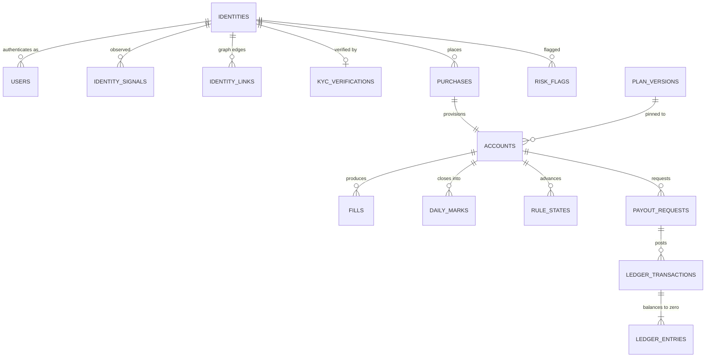

# Data Model (Constitution §3, B1)

Every table, every column, with type, constraints, indexes, retention, and the reason it exists. Terms are defined in [GLOSSARY.md](../GLOSSARY.md). Migrations are sacred: once merged, a migration is never edited, only superseded.

> **Amended under [ADR-026](../DECISIONS.md), 2026-08-14. The schema-delta reconciliation has landed.**
>
> All **94** approved schema changes are folded into one reviewed migration set at [`packages/db/migrations`](../../packages/db/migrations), 27 files, verified to apply in order against PostgreSQL 16. Every delta is traced to the document that proposed it in [`packages/db/DELTA_MANIFEST.md`](../../packages/db/DELTA_MANIFEST.md), which is the file the completeness gate reads. **No delta was rejected.**
>
> **Where the two disagree, the migrations are the truth and this document is the design record.**
>
> **This document is at post-migration truth as of 2026-08-15.** §3 through §10 were rewritten table by table against the `.sql` rather than against the plan documents that proposed them: every table the migrations create has a `### <table>` section, and every section resolves to a `CREATE TABLE`. The reconciliation runs **in both directions** as [CI-06i](../testing/STRATEGY.md), so the next table added without a design record is caught by a robot rather than by counting.
>
> **Two things found in the rewrite are open and are not reconciled quietly.** [ADR-035](../DECISIONS.md) records a defect in `0027`'s published-plan-version immutability trigger, proven by execution: plan retirement is currently impossible. `OI-01` records that `liability_snapshots` exists in one shape here and carried another in the approved design, with a recommendation in §8 and no ruling yet.
>
> **Four rulings changed a column or a value rather than adding one**, and each is folded rather than merely recorded: [ADR-027](../DECISIONS.md) (two distinct per-identity ledger classes, seven in total), [ADR-028](../DECISIONS.md) (`payout_requests.status` and **both** of its index predicates), [ADR-029](../DECISIONS.md) (`dedupe_matched_identity_id` dropped), and [ADR-030](../DECISIONS.md) (`max_payouts`, `kyc.triggers`). The sentence read "three" against a list of four and is corrected here.

> **Further amended, 2026-08-14, by two rulings on `published_statistics`.** [ADR-031](../DECISIONS.md): `value_numeric numeric` becomes **`value bigint`** with a mandatory **`value_unit`**, retiring its no-floats exemption and leaving **two** columns on that list, none of them money. [ADR-032](../DECISIONS.md): **`measure`** joins the table and the window unique key, `statistic_definitions` gains **`measures`**, and **STAT-C1** in `0027` makes "neither figure of a pair is published alone" a database constraint rather than prose. Both amend approved `SD-M12-02`; the second touches the immutability contract on a public surface. Sections amended: §13 (invariants) and §17 (the no-floats exemption list, and the verification record), plus this header.

## 1. Conventions (binding across every table)

**Types**
- Money: `bigint`, always **integer cents**, always non-negative unless the column explicitly represents a signed movement (`ledger_entries.amount_cents`, `daily_marks.realized_pnl_cents`). Never `numeric`, never `float`.
- Ratios: `integer` **basis points**. Never a float, never a percentage string.
- Timestamps: `timestamptz`, stored UTC. Trading dates: `date`, and always the exchange trading day, never a UTC calendar date derived from a timestamp.
- Enums: Postgres native `enum` types for closed sets that change rarely (phases, statuses), `text` with a `check` constraint for sets expected to grow. Each choice is noted per column.
- JSON: `jsonb` only, always with a documented shape, always validated by zod at the write boundary. `jsonb` is used for vendor payloads, rule configs, and evidence, never as a way to avoid designing columns.

**Keys**
- `uuid` (v7, time-ordered) primary keys for anything referenced in a URL or by an external system: `users`, `identities`, `accounts`, `payout_requests`, `purchases`, `risk_flags`, `affiliates`. Time-ordered so index locality is preserved; opaque so a compromised or curious client cannot enumerate neighbours. Enumeration protection is a defence in depth measure and never a substitute for identity scoping.
- `bigint generated always as identity` for high-volume internal rows never exposed by URL: `fills`, `events`, `ledger_entries`, `daily_marks`, `raw_ingest_rows`.
- Foreign keys are always declared with an explicit `on delete` action, and that action is `restrict` for every financial or evidentiary relationship. We do not cascade deletes anywhere in a money path.

**Mutability**
- **The append-only set is these eighteen tables**, and the list is exact rather than illustrative because [`0026_roles_and_grants`](../../packages/db/migrations/0026_roles_and_grants.sql) revokes `UPDATE` and `DELETE` on exactly this set, from the application role **and from `PUBLIC`**: `ledger_entries`, `ledger_transactions`, `events`, `admin_actions`, `fills`, `raw_ingest_rows`, `daily_marks`, `rule_states`, `identity_merges`, `identity_links`, `tos_acceptances`, `account_status_history`, `wallet_entries`, `published_statistics`, `kyc_funnel_events`, `integration_dispatches`, `support_context_views`, `certificate_verifications`. The application role holds `INSERT` and `SELECT` only. Enforced by grants in the database, not by convention ([VG-8](../../research/VIBE_FAILURE_POSTMORTEMS.md)).
  - The approved list read `events`, `ledger_entries`, `ledger_transactions`, `admin_actions`, `fills`, `raw_ingest_rows`, `daily_marks`, `rule_states`, `eligibility` snapshots, `identity_merges`. **`eligibility` snapshots is not a table** (the eligibility snapshot is a `jsonb` column on `payout_requests`, §8), and the other nine tables above were added by the fold. This paragraph is the document half of `OI-03`: the CI check asserts `0026`'s revoke list against **this list**, so the two cannot drift apart in either direction.
  - **Two single-column updates on append-only tables are legitimate and ruled** (`daily_marks.superseded_by`, `identity_links.suppressed`). They are performed by `SECURITY DEFINER` functions owned by the migrator role, each arriving with the module that owns the transition and with its negative-authz test. Those functions do not exist yet, so a naive first implementation of either transition fails at the grant, which is the correct failure and will look like a bug.
- Mutable tables carry `updated_at` and emit an event on every meaningful transition, so the trail exists even where the row is overwritten. **Thirty of the 96 tables carry `updated_at`**; the rest are either append-only or written once.
- Nothing is ever soft-deleted with a boolean. Lifecycle is a status enum with an event trail. The one soft delete in the schema is `journal_entries.deleted_at`, and it is a **tombstone for a hard-delete job** rather than an end state (§10).

**Naming**: `snake_case`, plural table names, `_cents` and `_bp` suffixes are mandatory on money and ratio columns, `_at` on timestamps, `_on` on dates. A column named `amount` without a unit suffix is a review reject.

**Every table** carries `created_at timestamptz not null default now()`, **with exactly three ruled exceptions**, each of which carries a more specific timestamp instead and would gain nothing from a second one: `ledger_transactions` (`posted_at`), `treasury_balances` (`recorded_at`), and `liability_snapshots` (`computed_at`). Posting time, attestation time and computation time are the facts those rows exist to record, and a creation timestamp beside them would be a second answer to the same question. Mutable tables also carry `updated_at timestamptz not null default now()`.

## 2. The spine

Everything radiates from [trader identity](../GLOSSARY.md#trader-identity), never from email and never from account.



## 3. Identity, authentication and KYC

Created by [`0002_identity`](../../packages/db/migrations/0002_identity.sql) and [`0003_kyc`](../../packages/db/migrations/0003_kyc.sql). Twelve tables. Both files are money path: identity is the row every cap and every aggregate liability figure keys off, and KYC is what stands between the payout rail and a fleet.

### identities
The resolved human. Account caps, aggregate liability, and ring detection all key here.

| Column | Type | Constraints | Why |
|---|---|---|---|
| `id` | uuid | pk, default `gen_random_uuid()` | external reference |
| `display_name` | text | null | reserved for future leaderboards; nullable because v1 never shows it |
| `leaderboard_opt_in` | boolean | not null default false | reserved per the Wave 1 schema list, cheap now, migration later otherwise |
| `status` | `identity_status` enum(`active`,`restricted`,`closed`) | not null default `active` | restriction and closure are identity-level, not account-level |
| `status_reason` | text | null | the human-readable half of an audited decision; **required by check when status is not `active`** |
| `max_accounts_override` | integer | null, check > 0 | per-entity cap override for legitimate edge cases (grandfathered merges, B4 #17) |
| `payouts_frozen` | boolean | not null default false | investigation freeze, set before request time only |
| `frozen_reason` | text | null | ToS citation shown to the trader |
| `frozen_at` | timestamptz | null | drives the freeze-duration alert |
| `support_contact_ref` | text | null | **`SD-M10-04`.** The Chatwoot contact pointer, so a support conversation resolves to an identity without Merit storing transcripts. One column instead of a conversation table is the point: Merit is not a second copy of the support system |
| `first_seen_at` | timestamptz | not null default now() | cohort analysis |
| `created_at`, `updated_at` | timestamptz | not null default now() | |

Indexes: `identities_status_idx (status)` where `status <> 'active'`; `identities_payouts_frozen_idx (payouts_frozen)` where true.
Constraints: `identities_freeze_is_explained` (a freeze carries both `frozen_reason` and `frozen_at`); `identities_status_is_explained` (a non-active status carries `status_reason`).
Retention: forever (financial counterparty record).
Why the freeze check exists: a freeze with no reason and no clock is an indefinite hold nobody owns, and `frozen_at` is what drives the alert that binds on Merit rather than on the trader.

### users
The authentication principal. One identity may own several users only through a merge; the normal case is one to one.

| Column | Type | Constraints | Why |
|---|---|---|---|
| `id` | uuid | pk | |
| `identity_id` | uuid | fk identities, not null, on delete restrict | every user belongs to a resolved identity |
| `email` | citext | not null, unique | citext so casing never creates a duplicate human |
| `email_normalized` | citext | not null | dots and plus-tags stripped; the entity-resolution key. Indexed but **not** unique: two people can legitimately share a normalized form, so it is a signal, not a constraint, and making it unique would refuse service to the second of them |
| `email_verified_at` | timestamptz | null | |
| `country_code` | char(2) | null, check `~ '^[A-Z]{2}$'` | geo-block and KYC triangle. The check is a shape check, not an ISO-3166 membership test; membership belongs to the application's country table |
| `timezone` | text | null | display only; never used in rule math, because the trading day comes from the exchange session calendar (B4 #1) |
| `marketing_consent` | boolean | not null default false | |
| `last_login_at` | timestamptz | null | |
| `created_at`, `updated_at` | timestamptz | not null default now() | |

Indexes: unique on `(email)` (inline); `users_email_normalized_idx (email_normalized)`; `users_identity_idx (identity_id)`.
Retention: forever, subject to the deletion runbook (privacy requests redact PII columns and retain the financial spine).

### passkeys
WebAuthn credentials. Merit is [passwordless only](../../research/SECURITY_LANDSCAPE.md), so there is no password table anywhere in this schema, by design. Adding one is a security architecture change requiring an ADR, not a convenience.

| Column | Type | Constraints | Why |
|---|---|---|---|
| `id` | uuid | pk | |
| `user_id` | uuid | fk users, not null, on delete restrict | |
| `credential_id` | bytea | not null, unique | WebAuthn identifier |
| `public_key` | bytea | not null | |
| `sign_count` | bigint | not null default 0, check >= 0 | clone detection: a counter that goes backwards means the credential exists in two places |
| `transports` | text[] | null | |
| `label` | text | null | user-facing device name |
| `last_used_at` | timestamptz | null | |
| `created_at` | timestamptz | not null default now() | |

Indexes: `passkeys_user_idx (user_id)`.
Retention: for the life of the user record.

### otp_challenges
The email fallback for the passwordless flow.

| Column | Type | Constraints | Why |
|---|---|---|---|
| `id` | uuid | pk | |
| `email_normalized` | citext | not null | issued before a user may exist, so this keys off the normalized email rather than a `user_id` |
| `code_hash` | bytea | not null | never store the code itself |
| `expires_at` | timestamptz | not null | short TTL (10 minutes) |
| `consumed_at` | timestamptz | null | single use, enforced by partial unique index |
| `attempts` | smallint | not null default 0, check between 0 and 5 | lockout without enabling user enumeration: the counter is on the challenge, not on the account, so a locked-out attacker learns nothing about whether the address exists |
| `request_ip` | inet | null | rate limiting and abuse signal |
| `created_at` | timestamptz | not null default now() | |

Indexes: `otp_challenges_email_created_idx (email_normalized, created_at desc)`; unique `otp_challenges_unconsumed_uq (id)` where `consumed_at is null`.
Retention: 30 days.

### sessions
| Column | Type | Constraints | Why |
|---|---|---|---|
| `id` | uuid | pk | |
| `user_id` | uuid | fk users, not null, on delete restrict | |
| `refresh_token_hash` | bytea | not null, unique | rotation on every refresh; the hash, never the token |
| `issued_at` | timestamptz | not null default now() | |
| `expires_at` | timestamptz | not null | short-lived access, rotating refresh |
| `revoked_at` | timestamptz | null | logout, re-auth, admin action |
| `ip` | inet | null | |
| `user_agent` | text | null | |
| `device_fingerprint_id` | uuid | fk identity_signals, null, on delete restrict | ties a session to the entity graph |
| `created_ip` | inet | null | **`SD-M4-03`** |
| `created_user_agent` | text | null | **`SD-M4-03`** |
| `last_seen_at` | timestamptz | null | **`SD-M4-03`** |
| `last_seen_ip` | inet | null | **`SD-M4-03`** |
| `created_at` | timestamptz | not null default now() | |

Indexes: `sessions_user_idx (user_id)`; `sessions_live_idx (user_id, expires_at desc)` where `revoked_at is null`.
Retention: 90 days after expiry.
Why the four `SD-M4-03` columns are four and not two: account takeover leading to payout redirection is the highest-value attack on a trader account ([SECURITY section 2.6](SECURITY.md)). The trader-visible active-sessions list, single-session revocation, and the anomaly signal that a session **moved country mid-life** (AS-M4-05) all need them, and the last is only expressible if the creation values and the last-seen values are separate columns rather than one overwritten pair.

### identity_signals
Observed entity-resolution signals. One row per observation type per value per identity. Values are hashed, never raw, which bounds what a breach yields to "these two accounts shared something" rather than to the card number they shared.

| Column | Type | Constraints | Why |
|---|---|---|---|
| `id` | uuid | pk | |
| `identity_id` | uuid | fk identities, not null, on delete restrict | |
| `kind` | text | not null, check in (`device`,`ip`,`asn`,`email_normalized`,`payment`,`kyc_identity`,`rise_identity`,**`footprint_enrichment`**) | text plus check because this set grows with every detector that observes a new kind of thing. **`footprint_enrichment` is `U-04`**: [ADR-023](../DECISIONS.md)'s SEON-class checkout enrichment vendor feeding M07's D-15. Observe mode at launch, fail-open on timeout, never a silent decline |
| `value_hash` | bytea | not null | **hashed, never raw**: card BIN plus last four, device id, IP |
| `value_preview` | text | null | non-identifying display fragment for admin (for example `visa ****4242`), deliberately not enough to reconstruct what it previews |
| `first_seen_at` | timestamptz | not null default now() | |
| `last_seen_at` | timestamptz | not null default now() | |
| `observation_count` | integer | not null default 1, check > 0 | weak-signal weighting |
| `created_at` | timestamptz | not null default now() | |

Indexes: unique `identity_signals_identity_kind_value_uq (identity_id, kind, value_hash)`; `identity_signals_kind_value_idx (kind, value_hash)` for reverse lookup, which **is** the entity graph's read path (the join that finds every identity sharing a device).
Retention: 24 months rolling for `ip`; forever for `payment` and `kyc_identity` (fraud history).

### identity_links
Graph edges between identities, produced by resolution and by detectors. Append-only except for the dispute columns.

| Column | Type | Constraints | Why |
|---|---|---|---|
| `id` | uuid | pk | |
| `identity_a` | uuid | fk identities, not null, on delete restrict | |
| `identity_b` | uuid | fk identities, not null, on delete restrict | |
| `link_kind` | text | not null | `shared_device`, `shared_payment`, `biometric_match`, `behavioural_correlation` |
| `confidence_bp` | integer | not null, check between 0 and 10000 | evidence strength, never a boolean. [ADR-022](../DECISIONS.md) made the graph **scored**: hard links auto-enforce, soft clusters queue a pre-funding review, and a boolean edge cannot carry that distinction |
| `evidence` | jsonb | not null | the specific observations behind the edge. An edge without its evidence is an accusation without a reason |
| `created_by` | text | not null | detector name or `admin` |
| `created_at` | timestamptz | not null default now() | |
| `disputed_at` | timestamptz | null | **`SD-M7-04`** |
| `dispute_note` | text | null | **`SD-M7-04`** |
| `suppressed` | boolean | not null default false | **`SD-M7-04`.** The operative field: a suppressed edge stays visible as history and stops contributing to enforcement |
| `suppressed_by` | text | null | **`SD-M7-04`** |

Indexes: unique `identity_links_edge_uq (identity_a, identity_b, link_kind)`; `identity_links_a_idx (identity_a)`; `identity_links_b_idx (identity_b)`; `identity_links_live_idx (identity_a, identity_b)` where `not suppressed`, which is the enforcement read path.
Constraints: `identity_links_canonical_order` (`identity_a < identity_b`, so an edge is stored once and cannot answer differently depending on argument order); `identity_links_suppression_has_author` (a suppression with no author is a suppression nobody owns).
Append-only, and `suppressed` is one of the two ruled single-column exceptions in §17: the `UPDATE` is performed by a `SECURITY DEFINER` function that arrives with M07, never by the application role.
Why the dispute path exists at all (INV-M7-09): two housemates, a married couple sharing a card, and a father funding a son's evaluation all produce **genuine** edges between **genuinely different** humans. Without a dispute path the graph's errors are permanent and invisible to the person they harm, and [ADR-022](../DECISIONS.md)'s soft-link queue makes the wrongly-linked-but-legitimate population larger, not smaller. The edge is never deleted, because "we decided this edge was wrong" is itself evidence.

### identity_merges
| Column | Type | Constraints | Why |
|---|---|---|---|
| `id` | uuid | pk | |
| `surviving_identity_id` | uuid | fk identities, not null, on delete restrict | |
| `merged_identity_id` | uuid | fk identities, not null, on delete restrict | |
| `reason` | text | not null | |
| `evidence` | jsonb | not null | |
| `accounts_at_merge` | integer | not null, check >= 0 | supports the B4 #17 grandfather policy: over-cap after merge is grandfathered, new purchases blocked. Recording the count **at merge time** is what makes the policy applicable years later, when the account count has moved for unrelated reasons |
| `actor` | text | not null | admin or detector |
| `created_at` | timestamptz | not null default now() | |

Indexes: `identity_merges_surviving_idx (surviving_identity_id)`; `identity_merges_merged_idx (merged_identity_id)`.
Constraints: `identity_merges_distinct` (an identity cannot be merged into itself).
Append-only. Merging never deletes the merged identity row; it repoints ownership and records this row, because the pre-merge history is what a dispute about a grandfathered cap is argued from.

### kyc_verifications
Merit stores **status and references only**. Documents, images, and biometric templates never touch Merit storage ([VG-10](../../research/VIBE_FAILURE_POSTMORTEMS.md)).

| Column | Type | Constraints | Why |
|---|---|---|---|
| `id` | uuid | pk | |
| `identity_id` | uuid | fk identities, not null, on delete restrict | |
| `provider` | text | not null | Sumsub, Veriff, Persona class. The adapter is vendor-agnostic (M19 section 1.1) and the selected provider is named in the privacy policy at selection time, which makes provider choice a disclosure event and not only a procurement one ([ADR-021](../DECISIONS.md)) |
| `provider_applicant_id` | text | not null | the only pointer we keep |
| `state` | `kyc_status` enum(`kyc_required`,`pending`,`verified`,`rejected`,`expired`) | not null | mirrors the provider lifecycle |
| `placement` | text | not null, check in (`first_purchase`,`second_distinct_account_purchase`,`second_purchase_any`,`eval_pass`,`pre_funded`,`direct_purchase`,`payout_request`) | **Widened by `U-05` under [ADR-021](../DECISIONS.md).** Records **which trigger fired**, not which set was configured. `pre_eval` is retired into `first_purchase`; `payout_request` is invalid as a sole trigger and exists only as a backstop. The frozen `kyc.triggers` value is `['second_distinct_account_purchase','pre_funded']` |
| `document_country` | char(2) | null | geo-consistency triangle, recorded as three columns so a disagreement is visible rather than resolved silently |
| `ip_country` | char(2) | null | |
| `payment_country` | char(2) | null | |
| `biometric_dedupe_hit` | boolean | not null default false | the fleet-killer signal. Survives [ADR-029](../DECISIONS.md) because **a boolean cannot contradict a set; it can only be stale, and staleness is detectable** |
| `rejection_reason` | text | null | |
| `verified_at` | timestamptz | null | |
| `expires_at` | timestamptz | null | drives re-verification |
| `raw_result` | jsonb | not null default `'{}'` | provider decision metadata only, **never document data** |
| `verification_purpose` | text | not null, check in (`initial`,`reverify_destination`,`reverify_flag`,`reverify_dormant`,`reverify_expiry`) | **`SD-M19-01`.** A re-verification is a new row, or the system cannot distinguish "we checked again today" from "we looked at what we already had" (INV-M19-06) |
| `supersedes` | uuid | fk kyc_verifications, null, on delete restrict | **`SD-M19-01`** |
| `liveness_passed` | boolean | null | **`SD-M19-01`** |
| `liveness_method` | text | null | **`SD-M19-01`.** Recorded because liveness techniques and their defeat rates move quickly: an enforcement decided on a 2027 liveness check needs to know which technique produced it (AS-M19-06), and a boolean alone ages into an assertion nobody can re-evaluate |
| `created_at`, `updated_at` | timestamptz | not null default now() | |
| ~~`dedupe_matched_identity_id`~~ | ~~uuid~~ | **never created, by [ADR-029](../DECISIONS.md)** | `dedupe_matches` (`SD-M19-04`) is authoritative. A dedupe hit is an **auto-enforcement input**: it bans an account without human review, and a system with two sources for that decision will eventually enforce on whichever is read first. Greenfield means the column is never created rather than created and dropped |

Indexes: `kyc_verifications_identity_state_idx (identity_id, state)`; `kyc_verifications_dedupe_hit_idx (biometric_dedupe_hit)` where true; `kyc_verifications_supersedes_idx (supersedes)` where not null; `kyc_verifications_placement_idx (placement, created_at desc)`, which is the per-placement funnel telemetry [ADR-021](../DECISIONS.md) made a condition of its acceptance.
Constraints: `kyc_verifications_supersession_matches_purpose` (an `initial` supersedes nothing and every other purpose supersedes something, so the chain has no holes); `kyc_verifications_no_self_supersede`.
Retention: forever (AML obligation), PII minimal by construction.

### sanctions_screenings
**`SD-M19-02`**, INV-M19-05, AS-M19-04. Its own object rather than a value in `kyc_verifications.rejection_reason`, because folding it in would put a legally mandatory refusal in the same field as a blurry-photo rejection. They are not the same kind of fact and they do not get the same review path.

| Column | Type | Constraints | Why |
|---|---|---|---|
| `id` | uuid | pk | |
| `identity_id` | uuid | fk identities, not null, on delete restrict | |
| `provider` | text | not null | |
| `list_refs` | text[] | not null default `'{}'` | which lists were screened |
| `match_strength` | integer | null, check between 0 and 10000 | basis points, like every other confidence in this schema |
| `status` | text | not null, check in (`clear`,`possible_match`,`confirmed_match`,`cleared_on_review`) | `cleared_on_review` is a distinct terminal state from `clear` on purpose: "we looked and it was not them" is a different fact from "nothing matched", and only the first needs a reviewer's name attached |
| `reviewed_by` | text | null | |
| `reviewed_at` | timestamptz | null | |
| `review_note` | text | null | |
| `screened_at` | timestamptz | not null default now() | |
| `created_at` | timestamptz | not null default now() | |

Indexes: `sanctions_screenings_identity_idx (identity_id, screened_at desc)`; `sanctions_screenings_open_idx (screened_at)` where `status = 'possible_match' and reviewed_at is null`, which is the action queue.
Constraints: `sanctions_screenings_review_has_author` (a review outcome with no reviewer is not a review).
Retention: forever (AML obligation).

### kyc_funnel_events
**`SD-M19-03`**, constitution (g), INV-M19-11. Append-only.

| Column | Type | Constraints | Why |
|---|---|---|---|
| `id` | bigint | pk, generated always as identity | high volume, never in a URL |
| `identity_id` | uuid | fk identities, not null, on delete restrict | |
| `placement` | text | not null, check in the same seven values as `kyc_verifications.placement` | **widened at the reconciliation**: this column records **which trigger fired**, not which placement was configured. Under [ADR-021](../DECISIONS.md) the placement is a set and the triggers race, so recording the configured set would answer a question nobody asked and lose the one that decides the adjudication |
| `plan_code` | text | not null | per-plan escalation is pre-agreed rather than lineup-wide ([ADR-021](../DECISIONS.md) condition 3) |
| `step` | text | not null, check in (`gate_reached`,`session_created`,`provider_opened`,`submitted`,`decided`,`abandoned`) | |
| `occurred_at` | timestamptz | not null default now() | |
| `attempt_number` | integer | not null default 1, check > 0 | |
| `cost_cents` | bigint | null, check >= 0 when present | the per-check cost in integer cents, which turns "a $2 identity check in front of a $79 impulse purchase" from a rhetorical figure into a measured one |
| `created_at` | timestamptz | not null default now() | |

Indexes: `kyc_funnel_events_identity_idx (identity_id, occurred_at)`; `kyc_funnel_events_funnel_idx (placement, plan_code, step, occurred_at)`.
Retention: forever (it is the measurement series).
Why it exists: drop-off per placement **cannot** be reconstructed from `kyc_verifications`, because the traders who matter most are the ones who never created a verification row at all. The abandonment is the measurement (AS-M19-08). This is the table that settles the post-beta KYC trigger adjudication, which is one of the nine items that survived FREEZE and is a config array decided on this data.

### dedupe_matches
**`SD-M19-04`**, [ADR-029](../DECISIONS.md), finding C-05. The authoritative hard link.

| Column | Type | Constraints | Why |
|---|---|---|---|
| `id` | uuid | pk | |
| `identity_a` | uuid | fk identities, not null, on delete restrict | |
| `identity_b` | uuid | fk identities, not null, on delete restrict | |
| `match_strength` | integer | not null, check between 0 and 10000 | |
| `provider_ref` | text | not null | |
| `observed_at` | timestamptz | not null default now() | |
| `disposition` | text | not null default `open`, check in (`open`,`confirmed_same_person`,`distinct_persons`,`inconclusive`) | `open` is first in the list because it is the default, and a disposition list whose first value is a conclusion invites defaulting to one |
| `disposition_note` | text | null | |
| `evidence_snapshot` | jsonb | not null default `'{}'` | the provider's scores, method and timestamps. **Never images.** This is what makes an enforcement survive the provider relationship ending (AS-M19-07), which is the difference between evidence Merit holds and evidence Merit rents |
| `created_at` | timestamptz | not null default now() | |

Indexes: unique `dedupe_matches_pair_uq (identity_a, identity_b, provider_ref)`, so a re-screen returning the same pair updates the disposition rather than stacking a second opinion; `dedupe_matches_a_idx`; `dedupe_matches_b_idx`; `dedupe_matches_open_idx (observed_at)` where `disposition = 'open'`, which is both the review queue and the auto-enforcement read path.
Constraints: `dedupe_matches_canonical_order` (`identity_a < identity_b`); `dedupe_matches_resolution_is_explained` (a resolved disposition carries its reasoning, and `inconclusive` counts as resolved because deciding not to decide is a decision).
Retention: forever.
Why it is a table and not a column: a match is a **relationship between two identities**, not a property of one. The approved single column could not express a face matching three identities, and "first match" is not a property of a set. Under [ADR-022](../DECISIONS.md) a dedupe hit is a hard link that auto-enforces, so two sources that can disagree is an enforcement defect rather than a redundancy.

## 4. Catalog and configuration

Created by [`0004_catalog`](../../packages/db/migrations/0004_catalog.sql). Eight tables, money path. `plan_versions` **is** the rule contract: the single source of truth the engine executes and the site renders, and the artifact behind the most valuable promise Merit can make in a market whose live case study is a firm destroyed by a retroactive rule change.

### plans
| Column | Type | Constraints | Why |
|---|---|---|---|
| `id` | uuid | pk | |
| `code` | text | not null, unique | `core_eod`, `merit_rapid`, `direct` (renamed from `rapid_daily` at the M1 gate, [ADR-013](../DECISIONS.md)). The old code is not carried forward: no row exists to migrate, and a retired alias is a second name for one thing |
| `name` | text | not null | display |
| `is_active` | boolean | not null default true | delisting never deletes. A plan nobody can buy still has to explain the accounts sold under it |
| `sort_order` | integer | not null default 0 | |
| `created_at`, `updated_at` | timestamptz | not null default now() | |

Indexes: unique on `(code)` (inline).
Retention: forever.

### plan_versions
The immutable rule contract. Shape of `rules` in §11.

| Column | Type | Constraints | Why |
|---|---|---|---|
| `id` | uuid | pk | |
| `plan_id` | uuid | fk plans, not null, on delete restrict | |
| `version` | integer | not null, check > 0 | monotonic per plan |
| `status` | `plan_version_status` enum(`draft`,`published`,`retired`) | not null default `draft` | only `published` can be sold |
| `rules` | jsonb | not null | the full config, shape in §11, validated by zod at the write boundary. **[ADR-030](../DECISIONS.md)'s two key names are load bearing**: the ladder length is `phase_funded.max_payouts` (frozen at 5 / 5 / 4) and `kyc.triggers` is an array |
| `copy_blocks` | jsonb | not null default `'{}'` | published rule text keyed by rule path, so marketing copy and engine parameters ship together. A version cannot be published with copy that describes a different number |
| `public_slug` | text | not null | **`SD-M9-01`.** A stable, permanent public URL that survives being superseded (INV-M9-11). Deriving the URL from the version number would make the archive URL change whenever numbering does, which breaks the link AS-M9-07 depends on: the trader who wants to show someone the rules their account was sold under |
| `public_visible` | boolean | not null default false | **`SD-M9-01`.** A version can be published-for-engine while not yet being the one on sale. Two facts, and one boolean cannot hold both |
| `published_at` | timestamptz | null | |
| `retired_at` | timestamptz | null | retirement stops new sales and never touches live accounts. That distinction is the whole of the retroactive-change protection |
| `created_by` | text | not null | |
| `created_at` | timestamptz | not null default now() | |

Indexes: unique `plan_versions_plan_version_uq (plan_id, version)`; unique `plan_versions_public_slug_uq (public_slug)`, unique across every version of every plan rather than within a plan, because the slug is the permanent public URL; `plan_versions_on_sale_idx (plan_id)` where `public_visible`, which is the site's read path.
Constraints: `plan_versions_published_has_timestamp`; `plan_versions_retired_has_timestamp`; `plan_versions_visible_implies_published` (a draft is never on sale, because public visibility on an unpublished version would put an unexecutable contract on the pricing page).
**Rows with `status = 'published'` are immutable**, enforced by `plan_versions_immutable_when_published` in `0027`, which rejects any update other than `published` moving to `retired` with `retired_at` set. Publishing a change means creating a new version. This is what makes "the rules at the time" provable (B4 #12).
Retention: forever. A retired version is still needed to explain a 2027 payout in 2031.

### plan_version_sizes
Materialized per-size thresholds. Percentages scale, but the published number must be exact, so it is computed once at publish and never recomputed at runtime.

| Column | Type | Constraints | Why |
|---|---|---|---|
| `id` | uuid | pk | |
| `plan_version_id` | uuid | fk plan_versions, not null, on delete restrict | |
| `size_cents` | bigint | not null, check > 0 | the v1 sizes the file names are 2500000, 5000000, 10000000 and 15000000 |
| `price_cents` | bigint | not null, check > 0 | list price |
| `reset_price_cents` | bigint | not null, check > 0 | |
| `drawdown_cents` | bigint | not null, check > 0 | derived from `drawdown.amount_bp` |
| `profit_target_cents` | bigint | null, check > 0 | null on Direct: there is no evaluation, so there is no profit target. A zero here would be a target of zero, which is a different and reachable thing |
| `buffer_cents` | bigint | not null, check >= 0 | |
| `win_day_floor_cents` | bigint | not null, check > 0 | |
| `payout_cap_schedule_cents` | jsonb | not null | ordered steps keyed by payout ordinal; an array from day one even though v1 publishes one flat step. [ADR-025](../DECISIONS.md) rejected progressive cap release for v1 and the **shape** stays, because the reservation costs nothing and the retrofit does not |
| `daily_loss_limit_cents` | bigint | null, check > 0 | null when the plan has none, which is all three in v1 |
| `floor_lock_enabled` | boolean | not null | **`SD-10`.** Materialized from the parent's `rules` jsonb at publish, because a CHECK cannot read another table (see below) |
| `floor_lock_at_profit_cents` | bigint | null, check > 0 | **`SD-10`** |
| `floor_lock_floor_at_cents` | bigint | null, check > 0 | **`SD-10`** |
| `created_at` | timestamptz | not null default now() | |

Indexes: unique `plan_version_sizes_version_size_uq (plan_version_id, size_cents)`.
Constraints: `plan_version_sizes_floor_lock_complete` (**`SD-10`**: both lock values present when enabled, both absent when not); `plan_version_sizes_buffer_clears_lock` (CV-11: `size_cents + buffer_cents > floor_lock_floor_at_cents` whenever the lock is enabled).
Immutable once the parent version is published (same trigger).
Why `SD-10` is a materialized column rather than a trigger: the enabling flag lives in the parent's `rules` jsonb at `phase_funded.drawdown.lock.enabled`, and a CHECK constraint cannot read another table. A trigger is the weaker control, because it can be disabled and it fires per row rather than per constraint, so the flag is materialized here alongside every other value this table materializes at publish. The publish path writes both and CV-publish validation asserts the materialized flag matches the parent's jsonb.
Why the second half of the lock constraint matters as much as the first: an enabled lock published without its values does not fail, it **silently never locks**; and a disabled lock carrying stale values is a lock that turns on with the wrong numbers the day someone flips the flag.
Why `buffer_clears_lock` is here: together with R-48 it is INV-21, a settled payout can never breach the account that earned it.

### tos_versions
| Column | Type | Constraints | Why |
|---|---|---|---|
| `id` | uuid | pk | |
| `document` | text | not null, check in (`tos`,`privacy`,`risk_disclosure`,`affiliate_tos`) | |
| `version` | integer | not null, check > 0 | |
| `body_md` | text | not null | |
| `effective_at` | timestamptz | not null | |
| `created_at` | timestamptz | not null default now() | |

Indexes: unique `tos_versions_document_version_uq (document, version)`.
Immutable once `effective_at` has passed: a document a trader accepted cannot be edited into one they did not.
Retention: forever.

### tos_acceptances
| Column | Type | Constraints | Why |
|---|---|---|---|
| `id` | uuid | pk | |
| `identity_id` | uuid | fk identities, not null, on delete restrict | |
| `tos_version_id` | uuid | fk tos_versions, not null, on delete restrict | |
| `accepted_at` | timestamptz | not null default now() | |
| `ip` | inet | not null | |
| `user_agent` | text | null | |
| `created_at` | timestamptz | not null default now() | |

Indexes: unique `tos_acceptances_identity_version_uq (identity_id, tos_version_id)`.
Append-only. Retention: forever.
This is the row that proves what a trader agreed to and when, which is the first thing any enforcement dispute asks for.

### geo_restrictions
| Column | Type | Constraints | Why |
|---|---|---|---|
| `country_code` | char(2) | pk | |
| `rule` | text | not null, check in (`block_purchase`,`block_all`,`warn`) | checkout and login behave differently, which is why this is a three-value rule rather than a boolean |
| `reason` | text | not null | counsel's rationale, versioned by row history in `events`, because "why is this country blocked" is a question with a legal answer |
| `effective_from` | date | not null | |
| `created_at`, `updated_at` | timestamptz | not null default now() | |

Retention: forever.

### contract_specs
Tick values per contract. B4 #14 exists because someone always hardcodes a multiplier.

| Column | Type | Constraints | Why |
|---|---|---|---|
| `symbol` | text | not null, pk part | for example `ES`, `MES`, `NQ`, `MNQ`, `CL`, `GC` |
| `exchange` | text | not null | |
| `tick_size_numerator` | bigint | not null, check > 0 | exact rational, never a float, for the same reason money is integer cents |
| `tick_size_denominator` | bigint | not null, check > 0 | |
| `tick_value_cents` | bigint | not null, check > 0 | |
| `currency` | char(3) | not null default `'USD'` | |
| `is_micro` | boolean | not null default false | |
| `effective_from` | date | not null, pk part | |
| `effective_to` | date | null | null means current |
| `created_at` | timestamptz | not null default now() | |

Primary key: composite `(symbol, effective_from)`, not `symbol` alone. A spec is versioned, so the symbol cannot be the key.
Indexes: `contract_specs_current_idx (symbol)` where `effective_to is null`.
Constraints: `contract_specs_effective_range` (`effective_to > effective_from` when set).
Retention: forever.

### trading_calendar
The trading day is data, never arithmetic.

| Column | Type | Constraints | Why |
|---|---|---|---|
| `trading_day` | date | pk | |
| `session_open_at`, `session_close_at` | timestamptz | not null | UTC instants derived from CT session definitions, so DST is a row rather than a calculation (B4 #1). No engine rule ever derives a trading day from a timestamp's UTC date |
| `is_half_day` | boolean | not null default false | counts as a **full day** (B4 #3). A half day counting as half a day would make the minimum-trading-days gate a different promise in November |
| `is_holiday` | boolean | not null default false | not a trading day at all |
| `halted` | boolean | not null default false | day counters advance, win days do not (B4 #2). A trader cannot earn a win day on a session the exchange halted, and cannot be penalised for one either |
| `notes` | text | null | |
| `created_at`, `updated_at` | timestamptz | not null default now() | |

Constraints: `trading_calendar_session_ordered`; `trading_calendar_holiday_not_half_day` (a holiday has no session to contain fills in).
Seeded years ahead, maintained as data, reviewed annually. Retention: forever.

## 5. Commerce

Created by [`0006_commerce`](../../packages/db/migrations/0006_commerce.sql), [`0012_disputes_and_affiliate_settlement`](../../packages/db/migrations/0012_disputes_and_affiliate_settlement.sql) (`payment_disputes`) and [`0024_offers`](../../packages/db/migrations/0024_offers.sql). Ten tables, money path. This is where money first enters the system.

### coupons
| Column | Type | Constraints | Why |
|---|---|---|---|
| `id` | uuid | pk | |
| `code` | citext | not null, unique | case-insensitive redemption |
| `discount_kind` | text | not null, check in (`percent`,`fixed`) | |
| `discount_bp` | integer | null, check between 0 and 10000 | set when kind is percent |
| `discount_cents` | bigint | null, check > 0 | set when kind is fixed |
| `affiliate_id` | uuid | fk affiliates, null, on delete restrict | per-affiliate codes |
| `max_redemptions` | integer | null, check > 0 | null means unlimited |
| `redemption_count` | integer | not null default 0, check >= 0 | maintained transactionally |
| `per_identity_limit` | integer | not null default 1, check > 0 | blocks one person farming a code. Per **identity**, not per email: an email limit is a limit on typing, not on people |
| `starts_at`, `expires_at` | timestamptz | null | |
| `is_active` | boolean | not null default true | |
| `applies_to_kind` | text | not null default `any`, check in (`new`,`reset`,`any`) | **`SD-M3-04`.** Reset pricing and new-purchase pricing are different products with different margins. Without this, one leaked launch code discounts resets forever, which is the highest-volume repeat purchase in the business (AS-M3-04). M03 requires the value stated explicitly at creation rather than defaulted, because a default of `any` is exactly the leak; the column default exists only so the constraint is total |
| `first_purchase_only` | boolean | not null default false | **`SD-M3-04`** |
| `created_at`, `updated_at` | timestamptz | not null default now() | |

Indexes: unique on `(code)` (inline); `coupons_affiliate_idx (affiliate_id)` where not null.
Constraints: `coupons_one_discount_form` (exactly one discount form, because a coupon that is both is a coupon whose price depends on which branch the code reads first); `coupons_window_ordered`; `coupons_redemptions_within_max`.
Concurrency: redemption is an atomic claim (see `coupon_redemptions`), never a read-then-write. B4 #11.

### purchases
| Column | Type | Constraints | Why |
|---|---|---|---|
| `id` | uuid | pk | |
| `identity_id` | uuid | fk identities, not null, on delete restrict | |
| `user_id` | uuid | fk users, not null, on delete restrict | who clicked, versus who they are. Both, because they can differ after a merge and the difference is evidence |
| `plan_version_id` | uuid | fk plan_versions, not null, on delete restrict | pins the contract at purchase time (B4 #12). The account's rules are the rules on the day it was bought, forever |
| `size_cents` | bigint | not null, check > 0 | |
| `kind` | text | not null, check in (`new`,`reset`) | resets reuse the same pipeline |
| `parent_account_id` | uuid | null, **fk added in `0007`** | set for resets. One of the three ruled reference cycles (§17) |
| `list_price_cents` | bigint | not null, check >= 0 | |
| `discount_cents` | bigint | not null default 0, check >= 0 | |
| `amount_paid_cents` | bigint | not null, check >= 0 | |
| `currency` | char(3) | not null default `'USD'` | reserved for multi-currency, never used in v1 math (Wave 2 gate ruling 5) |
| `coupon_id` | uuid | fk coupons, null, on delete restrict | |
| `affiliate_id` | uuid | fk affiliates, null, on delete restrict | attribution resolved at purchase |
| `psp` | text | not null, check in (`psp_a`,`psp_b`) | which MID took it |
| `psp_reference` | text | not null | |
| `mid_reference` | text | null | the specific merchant account, for MID health |
| `status` | `purchase_status` enum(`pending`,`paid`,`failed`,`refunded`,`charged_back`) | not null default `pending` | |
| `paid_at` | timestamptz | null | |
| `ip` | inet | null | geo triangle and velocity |
| `refundable_until` | timestamptz | null | **`SD-M3-02`** |
| `first_trade_at` | timestamptz | null | **`SD-M3-02`.** The refund window is "pre-first-trade only", which is a fact about **trading**, so it has to be recorded on the purchase when M02 sees the first fill. Otherwise the refund policy is unenforceable and becomes a support argument (FM-M3-10) |
| `checkout_ip_country` | char(2) | null | **`SD-M3-05`** |
| `card_country` | char(2) | null | **`SD-M3-05`** |
| `geo_decision` | text | null, check in (`allowed`,`warned`,`blocked`) | **`SD-M3-05`.** The decision Merit made at checkout is recorded at checkout. Reconstructing it later from an IP log is not the same artifact: it tells you where they were, not what we decided |
| `payment_method` | text | not null default `psp`, check in (`psp`,`wallet`,`mixed`) | **`SD-M3-06`, [ADR-019](../DECISIONS.md).** `mixed` exists because a trader with $60 in the wallet buying a $99 evaluation is the common case, not an edge one |
| `wallet_debit_cents` | bigint | not null default 0, check >= 0 | **`SD-M3-06`.** Server-computed from the identity's balance, never supplied by the client, for the same reason no price is |
| `wallet_ledger_transaction_id` | uuid | null, **fk added in `0011`** | **`SD-M3-06`.** One of the three ruled reference cycles (§17) |
| `rule_diff_acknowledged_at` | timestamptz | null | **`SD-M4-02`.** A reset onto a changed plan version must be explicitly acknowledged (AS-M3-05). A reset is a new contract, and a trader who did not notice is a trader who was not told |
| `created_at`, `updated_at` | timestamptz | not null default now() | |

Indexes: unique `purchases_psp_reference_uq (psp, psp_reference)`, the idempotency anchor for webhooks; `purchases_identity_created_idx (identity_id, created_at desc)`; `purchases_pending_idx (created_at)` where `status = 'pending'` (the paid-not-provisioned alarm query); `purchases_refundable_idx (refundable_until)` where `first_trade_at is null and refundable_until is not null` (the refund-window closer); `purchases_parent_account_idx (parent_account_id)` where not null.
Constraints: `purchases_price_arithmetic` (`amount_paid_cents = list_price_cents - discount_cents`); `purchases_discount_within_list`; `purchases_wallet_leg_matches_method`; `purchases_wallet_debit_is_posted` (a wallet debit that posted no ledger transaction is money that moved outside the ledger); `purchases_reset_has_parent`; `purchases_paid_has_timestamp`.
Retention: forever.
Why the wallet constraints are three and not one: together they make "a wallet purchase that looks like a stalled PSP purchase" **unrepresentable**, which is the whole point of `SD-M3-06`. Without an explicit method the wallet path is indistinguishable from a PSP purchase whose webhook never arrived, which is exactly the state FM-M3-01 pages on.

### coupon_redemptions
| Column | Type | Constraints | Why |
|---|---|---|---|
| `id` | uuid | pk | |
| `coupon_id` | uuid | fk coupons, not null, on delete restrict | |
| `identity_id` | uuid | fk identities, not null, on delete restrict | limits are per identity, not per email |
| `purchase_id` | uuid | fk purchases, null, on delete restrict | null while the claim is held and the payment is in flight |
| `claimed_at` | timestamptz | not null default now() | |
| `released_at` | timestamptz | null | claim released if payment fails. The row survives, so a pattern of claim-and-abandon is visible rather than erased |
| `created_at` | timestamptz | not null default now() | |

Indexes: unique `coupon_redemptions_live_claim_uq (coupon_id, identity_id)` where `released_at is null`; `coupon_redemptions_coupon_idx (coupon_id)`.
This table is why two tabs cannot both win a single-use code: the claim insert is the race, and the partial unique index decides it (B4 #11). Limits above 1 are checked transactionally against `redemption_count` in the same statement.

### psp_webhook_events
Raw, signed, immutable inbound payment events. Kept separately from `events` because these are third-party assertions, not facts we generated, and the distinction matters the day one of them turns out to be wrong.

| Column | Type | Constraints | Why |
|---|---|---|---|
| `id` | bigint | pk, generated always as identity | |
| `psp` | text | not null | |
| `provider_event_id` | text | not null | |
| `event_type` | text | not null | |
| `signature_verified` | boolean | not null | recorded, not assumed. A payload whose signature did not verify is still stored, and stored with the fact that it did not verify |
| `payload` | jsonb | not null | as received |
| `received_at` | timestamptz | not null default now() | |
| `processed_at` | timestamptz | null | |
| `processing_result` | text | null, check in (`applied`,`duplicate_ignored`,`out_of_order_deferred`,`rejected_signature`) | |
| `purchase_id` | uuid | fk purchases, null, on delete restrict | **`SD-M3-01`** |
| `deferred_until` | timestamptz | null | **`SD-M3-01`** |
| `defer_attempts` | integer | not null default 0, check >= 0 | **`SD-M3-01`.** INV-M3-04 needs somewhere to park a deferred event and something to drive its re-evaluation; without these three columns "deferred" means "dropped and hoped for". The canonical case is a refund arriving before its payment (FM-M3-03): applying it would record a refund against nothing, so it is deferred, re-driven, and warned on after 3 attempts |
| `created_at` | timestamptz | not null default now() | |

Indexes: unique `psp_webhook_events_provider_event_uq (psp, provider_event_id)`, which **is** the idempotency guarantee for B4 #9 rather than a helper for one; `psp_webhook_events_deferred_idx (deferred_until)` where `deferred_until is not null and processed_at is null` (the re-drive queue); `psp_webhook_events_purchase_idx (purchase_id)` where not null.
Retention: 24 months, then archive.

### mid_health
**`SD-M3-03`.** Failover needs a decision record, not a live computation.

| Column | Type | Constraints | Why |
|---|---|---|---|
| `psp` | text | not null, pk part | |
| `window_start` | timestamptz | not null, pk part | |
| `window_end` | timestamptz | not null | |
| `attempts` | integer | not null default 0, check >= 0 | card-volume denominator for `decline_rate_bp` |
| `declines` | integer | not null default 0, check >= 0 | |
| `card_settled_count` | integer | not null default 0, check >= 0 | card-volume denominator for `chargeback_rate_bp` |
| `chargebacks` | integer | not null default 0, check >= 0 | |
| `decline_rate_bp` | integer | not null, check between 0 and 10000 | |
| `chargeback_rate_bp` | integer | not null, check between 0 and 10000 | the 65bp threshold that threatens the processor relationship needs to be a tracked series rather than a query someone remembers to run |
| `state` | text | not null, check in (`healthy`,`degraded`,`unhealthy`) | |
| `state_changed_at` | timestamptz | not null | |
| `created_at` | timestamptz | not null default now() | |

Primary key: composite `(psp, window_start)`.
Indexes: `mid_health_state_idx (psp, window_start desc)`.
Constraints: `mid_health_window_ordered`; `mid_health_declines_within_attempts`; `mid_health_chargebacks_within_settled`.
**The denominator rule, and it is the dangerous part of this table.** Both rates are computed against **card volume**, never total volume. Wallet-funded purchases carry no chargeback exposure whatsoever, so as wallet adoption grows the denominator of a total-volume ratio shrinks while the numerator does not: a **healthy** shift toward wallet funding would look like a deteriorating chargeback ratio and trip failover in AS-M3-02's direction for no reason at all. The columns are named to make the mistake hard to make silently. "Firms die from PSP freezes" is a named risk in constitution section 0, and a firm with one MID has no working version of [RB-03](../ops/runbooks/RB-03-mid-freeze.md).

### payment_disputes
| Column | Type | Constraints | Why |
|---|---|---|---|
| `id` | uuid | pk | |
| `purchase_id` | uuid | fk purchases, not null, on delete restrict | |
| `kind` | text | not null, check in (`chargeback`,`refund`) | |
| `amount_cents` | bigint | not null, check > 0 | |
| `reason_code` | text | null | |
| `opened_at` | timestamptz | not null default now() | |
| `resolved_at` | timestamptz | null | |
| `outcome` | text | null, check in (`lost`,`won`,`refunded`) | |
| `ledger_transaction_id` | uuid | fk ledger_transactions, null, on delete restrict | the compensating reversal. Corrections are compensating entries, never updates (`SD-M5-05`), and this pointer makes "which reversal answered which dispute" instant at exactly the moment it must be |
| `created_at`, `updated_at` | timestamptz | not null default now() | |

Indexes: `payment_disputes_purchase_idx (purchase_id)`; `payment_disputes_open_idx (opened_at)` where `resolved_at is null`.
Constraints: `payment_disputes_resolved_has_outcome`; `payment_disputes_loss_is_posted` (a dispute Merit lost or refunded moved money and must name the transaction that recorded it; a dispute Merit won moved nothing).
Policy encoded in M03: a chargeback closes the account, flags the identity, and posts a reversal. **Even when the payout already settled and the identity nets negative, the ledger shows the loss honestly** (B4 #10). It does not net, hide, or defer it.

### offer_experiments
**`SD-M17-04`**, INV-M17-07. Created before `offers` because `offers.experiment_id` references it.

| Column | Type | Constraints | Why |
|---|---|---|---|
| `id` | uuid | pk | |
| `name` | text | not null, unique | |
| `hypothesis` | text | not null | |
| `arms` | jsonb | not null | |
| `varies` | text | not null, check in (`price`,`presentation`,`bundle_contents`) | **the rule, in DDL.** An experiment may vary what a thing costs, how it is shown, or what is in it. It may never vary a rule, a gate, or a plan parameter, and the check has no value that would let it try |
| `started_at` | timestamptz | not null default now() | |
| `ended_at` | timestamptz | null | |
| `winner_arm` | text | null | |
| `created_at` | timestamptz | not null default now() | |

Indexes: unique on `(name)` (inline); `offer_experiments_live_idx (started_at)` where `ended_at is null`.
Constraints: `offer_experiments_winner_needs_end`.
Why the check is the delta: it makes "we do not A/B test the rulebook" a structural fact rather than a policy someone has to remember under conversion pressure. An experiment that varies a rule **cannot be written down**, let alone run (AS-M17-07). Adding a fourth value is an ADR.

### price_floors
**`SD-M17-02`**, INV-M17-05, INV-M17-12. Set through the dual-controlled publish path (`0016`'s `dual_control_approvals`).

| Column | Type | Constraints | Why |
|---|---|---|---|
| `product_ref` | text | not null, pk part | |
| `floor_cents` | bigint | not null, check >= 0 | |
| `reason` | text | **not null** | for a Direct plan this is a liability decision, and a liability decision with no written rationale is one nobody can defend at the next review |
| `effective_from` | timestamptz | not null, pk part | |
| `approved_by` | text | **not null** | |
| `created_at` | timestamptz | not null default now() | |

Primary key: composite `(product_ref, effective_from)`.
Indexes: `price_floors_current_idx (product_ref, effective_from desc)`.
Why it exists: stacking arithmetic needs a hard stop that is **not** "the sum of the discounts we happened to configure". A Direct account is funded on purchase, so its price is the only thing standing between the firm and immediate exposure.

### offers
**`SD-M17-01`**, INV-M17-02, INV-M17-03. An offer changes the price of a known thing and may never change the thing.

| Column | Type | Constraints | Why |
|---|---|---|---|
| `id` | uuid | pk | |
| `offer_type` | text | not null | |
| `scope` | text | not null, check in (`identity`,`segment`,`public`) | |
| `identity_id` | uuid | fk identities, null, on delete restrict | |
| `product_ref` | text | not null | |
| `contents` | jsonb | not null | **stated contents before payment** (ADR-019a). Explicit, never derived at redemption: a bundle whose contents are computed at redemption is a bundle whose contents were not stated |
| `price_cents` | bigint | not null, check >= 0 | |
| `list_price_cents` | bigint | not null, check >= 0 | stored beside `price_cents` so the discount is a **fact** rather than a comparison against a value that may since have moved |
| `currency` | char(3) | not null default `'USD'` | |
| `max_redemptions` | integer | null, check > 0 | |
| `redemptions_used` | integer | not null default 0, check >= 0 | |
| `expires_at` | timestamptz | null | |
| `criteria_version` | integer | null | which loyalty criteria version produced this offer |
| `loyalty_grant_id` | uuid | fk loyalty_benefit_grants, null, on delete restrict | |
| `experiment_arm` | text | null | |
| `experiment_id` | uuid | fk offer_experiments, null, on delete restrict | |
| `created_by` | text | not null | |
| `revoked_at` | timestamptz | null | |
| `created_at`, `updated_at` | timestamptz | not null default now() | |

Indexes: `offers_identity_idx (identity_id, expires_at)` where not null; `offers_live_idx (product_ref, expires_at)` where `revoked_at is null`; `offers_experiment_idx (experiment_id)` where not null; unique `offers_loyalty_grant_uq (loyalty_grant_id)` where not null.
Constraints: `offers_identity_scope_matches`; `offers_price_within_list` (an offer may discount and may not mark up: a price above list is not an offer, it is a different product wearing one's clothes); `offers_redemptions_within_max`; `offers_arm_has_experiment`.
The unique on `loyalty_grant_id` and the grant's own single-spend guarantee (`0023`) are the two halves of "a benefit cannot be spent twice".

### promotional_credit_grants
**`SD-M17-03`**, INV-M17-08, INV-M17-11.

| Column | Type | Constraints | Why |
|---|---|---|---|
| `id` | uuid | pk | |
| `identity_id` | uuid | fk identities, not null, on delete restrict | |
| `amount_cents` | bigint | not null, check > 0 | |
| `source_offer_id` | uuid | fk offers, null, on delete restrict | |
| `funding_purchase_id` | uuid | fk purchases, null, on delete restrict | **the delta's real content.** A credit needs to know what funded it, or a chargeback cannot claw back the credit it paid for (AS-M17-06): the purchase reverses, the credit stays, and the trader spends money the firm never received |
| `expires_at` | timestamptz | **not null** | promotional credit expires; that is what distinguishes it from a payable. An unexpiring promotional balance is a liability wearing a marketing label, and it is also an escheatment question nobody wants |
| `consumed_cents` | bigint | not null default 0, check >= 0 | |
| `revoked_at` | timestamptz | null | |
| `revoked_reason` | text | null | |
| `created_at`, `updated_at` | timestamptz | not null default now() | |

Indexes: `promotional_credit_grants_identity_idx (identity_id, expires_at)`; `promotional_credit_grants_funding_idx (funding_purchase_id)` where not null (the query a chargeback runs); `promotional_credit_grants_live_idx (identity_id, expires_at)` where `revoked_at is null and consumed_cents < amount_cents`.
Constraints: `promotional_credit_grants_consumed_within_amount`; `promotional_credit_grants_revocation_is_explained`.
**Never withdrawable** (OQ-FREEZE-01, which overruled [ADR-025](../DECISIONS.md)'s literal wording and confirmed the implementation). Promotional credit is rendered inside the wallet screen and is **not** wallet value: it has its own ledger class (`promotional_credit`, `0009`) and no `wallet_entries.provenance` value (`0011`). The ledger records the money; this table records the entitlement's provenance and expiry.

## 6. Accounts and platform

Created by [`0007_accounts`](../../packages/db/migrations/0007_accounts.sql). Five tables, money path. `accounts` is the object every rule runs against and every liability figure sums over.

### accounts
| Column | Type | Constraints | Why |
|---|---|---|---|
| `id` | uuid | pk | |
| `identity_id` | uuid | fk identities, not null, on delete restrict | |
| `user_id` | uuid | fk users, not null, on delete restrict | |
| `purchase_id` | uuid | fk purchases, not null, unique, on delete restrict | one account per purchase. The unique index is what makes a duplicate provisioning run impossible to complete rather than merely unlikely |
| `plan_version_id` | uuid | fk plan_versions, not null, on delete restrict | **never changes**, for the life of the account (ToS clause 12, B4 #12, GS-041). Enforced by trigger in `0027` |
| `size_cents` | bigint | not null, check > 0 | |
| `phase` | `account_phase` enum(`eval`,`funded`,`closed`,`graduated`) | not null | the lifecycle the engine executes ([STATE_MACHINES](STATE_MACHINES.md)) |
| `status` | `account_status` enum(`provisioning_pending`,`active`,`breached`,`expired`,`closed_admin`,`closed_chargeback`,`graduated`) | not null | operational state, distinct from phase. An account can be phase `funded` and status `breached`; collapsing the two loses which fact is being asserted |
| `platform` | text | not null default `rithmic`, check in (`rithmic`,`tradovate`,`cqg`) | **B3 reservation.** v1 is always rithmic; the column is what makes a second platform adapter a config change rather than a migration against live accounts |
| `platform_account_ref` | text | null | unique among **live** accounts only (see `platform_account_refs`) |
| `feed` | text | null, check in (`rithmic`,`cqg`,`dxfeed`) | **B3 reservation.** Marketing needs it even when ingest does not |
| `front_end_permissions` | jsonb | not null default `'[]'` | NinjaTrader, Quantower, ATAS and friends; a provisioning input |
| `opened_on` | date | not null | trading day, not a timestamp. The calendar is authoritative (B4 #1) |
| `funded_on` | date | null | set at eval pass |
| `closed_on` | date | null | |
| `close_reason` | text | null | |
| `payouts_frozen` | boolean | not null default false | account-level freeze, in addition to the identity-level flag. Both exist because an investigation can be about one account or about a person |
| `recon_blocked` | boolean | not null default false | set by a failed [reconciliation](../GLOSSARY.md#reconciliation); a **context gate**, never part of the replayed state (INV-23) |
| `expires_on` | date | null | eval expiry when configured (v1 unlimited on all three) |
| `graduated_at` | timestamptz | null | **`SD-M18-01`** |
| `graduation_path` | text | null, check in (`continuation`,`third_party_intro`,`live_program`) | **`SD-M18-01`.** `live_program` is in the vocabulary and **no live program exists at launch** (OQ-M18-01 as ruled at the FREEZE gate). The value is present so the shape is decided before commercial pressure decides it, and zero live-program copy ships until counsel rules |
| `terminal_settlement_id` | uuid | null, **fk added in `0010`** | **`SD-M18-01`.** Without it, a graduated account holding a balance is indistinguishable from one that paid out fully (INV-M18-05). One of the three ruled reference cycles (§17) |
| `graduation_eligible` | boolean | not null default false | **`U-02`.** [ADR-024](../DECISIONS.md), M01 R-49: the engine sets phase `graduated` plus this review-pool flag and emits **no** invitation event. An engine that emits an invitation on ladder completion has already made the promise, and the promise commits Merit rather than the program |
| `created_at`, `updated_at` | timestamptz | not null default now() | |

Indexes: `accounts_identity_status_idx (identity_id, status)`; unique `accounts_platform_ref_uq (platform, platform_account_ref)` where not null; `accounts_funded_idx (phase)` where `phase = 'funded'` (the open-liability scan); `accounts_provisioning_idx (created_at)` where `status = 'provisioning_pending'`; `accounts_graduation_pool_idx (identity_id)` where `graduation_eligible`.
Constraints: `accounts_funded_has_date`; `accounts_terminal_has_close_date`; `accounts_graduation_is_complete` (**`SD-M18-01`**: a graduation is dated and has a path, or it did not happen); `accounts_closed_is_explained`.
Retention: forever.
Trader-facing exposure of the graduation pool is forbidden: it is an admin queue, and a pool a trader can see is a promise. The ladder is "the maximum payout level, not a guaranteed minimum for live eligibility" (ToS clause 8).

### account_status_history
Materialized transition log. Append-only.

| Column | Type | Constraints | Why |
|---|---|---|---|
| `id` | bigint | pk, generated always as identity | |
| `account_id` | uuid | fk accounts, not null, on delete restrict | |
| `from_status` | text | null | null on the first transition |
| `to_status` | text | not null | |
| `from_phase` | text | null | |
| `to_phase` | text | null | |
| `reason` | text | null | |
| `changed_at` | timestamptz | not null default now() | |
| `created_at` | timestamptz | not null default now() | |

Indexes: `account_status_history_account_idx (account_id, changed_at desc)`.
Retention: forever.
`events` is the canonical trail; this table exists because "was this account active during month M" is a billing-provability question asked often enough to deserve an index rather than an event scan.

### platform_account_refs
**`SD-M2-02`**, INV-M2-10: a platform ref is never reused across accounts, for any reason.

| Column | Type | Constraints | Why |
|---|---|---|---|
| `platform` | text | not null, check in (`rithmic`,`tradovate`,`cqg`), pk part | |
| `platform_account_ref` | text | not null, pk part | |
| `account_id` | uuid | fk accounts, not null, on delete restrict | |
| `assigned_at` | timestamptz | not null default now() | |
| `retired_at` | timestamptz | null | |
| `retired_reason` | text | null | |
| `created_at` | timestamptz | not null default now() | |

Primary key: composite `(platform, platform_account_ref)`. **The primary key is the burn**: a second row for the same pair cannot exist, so reassignment fails at insert rather than being detected later.
Indexes: `platform_account_refs_account_idx (account_id)`; `platform_account_refs_retired_idx (platform, platform_account_ref)` where `retired_at is not null`, which is the ingest guard's read path.
Constraints: `platform_account_refs_retirement_is_explained`.
Retention: forever. A burned ref stops being burned only if the row is deleted, which the grants forbid.
Why it exists as a second table: `accounts.platform_account_ref` is unique among **live** accounts, which does not stop a vendor recycling a retired identifier onto a new account. A recycled ref silently routes one trader's fills onto another trader's account, corrupts two accounts, one of which may be funded, and is invisible until reconciliation (FM-M2-05). An inbound row citing a retired ref **quarantines the whole file** rather than being routed anywhere. That is the one case in the system where Merit would rather lose a day of data than accept it (AS-M2-05).
Open, and not decided by assumption: if the vendor's identifier space is genuinely finite and reuse is forced (`V-M2-10`, a vendor-call question), the only safe design is a Merit-side surrogate with an explicit epoch.

### provisioning_queue
One row per **intent**, so partial success is legible. A batch that half-applied is the normal failure and it has to be readable operation by operation.

| Column | Type | Constraints | Why |
|---|---|---|---|
| `id` | uuid | pk | |
| `account_id` | uuid | fk accounts, not null, on delete restrict | |
| `operation` | text | not null, check in (`create_user`,`create_account`,`set_risk`,`set_entitlement`,`set_permissions`,`disable_account`,`disable_entitlement`) | |
| `payload` | jsonb | not null | the exact field values rendered into CSV |
| `payload_hash` | bytea | not null | **`SD-M2-01`.** The approved model declared the duplicate-intent index and **the column itself was missing from the table definition**, so the guard did not exist. Written by the enqueue path over a canonical serialization, deliberately **not** a generated column: a generated column would need an immutable cast of `jsonb`, whose immutability is a Postgres version question, and the duplicate-intent guard must not rest on that |
| `file_name` | text | null | idempotent name, assigned at batch build |
| `status` | `provisioning_status` enum(`queued`,`written`,`delivered`,`confirmed`,**`confirmed_inferred`**,`failed`) | not null default `queued` | **`U-06`** adds `confirmed_inferred` |
| `attempts` | integer | not null default 0, check >= 0 | |
| `last_error` | text | null | |
| `queued_at` | timestamptz | not null default now() | |
| `delivered_at`, `confirmed_at` | timestamptz | null | |
| `created_at`, `updated_at` | timestamptz | not null default now() | |

Indexes: `provisioning_queue_status_idx (status, queued_at)`; unique `provisioning_queue_intent_uq (account_id, operation, payload_hash)` where `status <> 'failed'`, so a genuine retry after a failure is permitted and a second live intent is not.
Constraints: `provisioning_queue_set_risk_never_inferred` (**`U-06`**, AS-M2-03: a `set_risk` operation may never reach `confirmed_inferred`); `provisioning_queue_delivered_has_timestamp`.
Why `U-06` is a CHECK rather than a convention: an inferred confirmation means we believe the account exists because the vendor reported on it. That is strong evidence for `create_account` and **worthless** for `set_risk`, because you cannot infer that a risk setting applied from an account appearing in a report. The failure is silent, and an account trading with no working auto-liquidator is a liability the firm is carrying without knowing.
**Provisional ([ADR-005](../DECISIONS.md)):** the operation set and payload fields follow the public CSV/SFTP description and must be confirmed against the real provisioning spec at the vendor call.

### platform_entitlements
The hygiene ledger behind real monthly cost. B3 reservation, now a real table.

| Column | Type | Constraints | Why |
|---|---|---|---|
| `id` | uuid | pk | |
| `account_id` | uuid | fk accounts, not null, on delete restrict | |
| `entitlement` | text | not null, check in (`market_data_cme`,`platform_access`,`api_tier`) | |
| `active` | boolean | not null default true | |
| `activated_on` | date | not null | |
| `deactivated_on` | date | null | |
| `monthly_cost_cents` | bigint | not null default 0, check >= 0 | makes the cost of forgetting visible in a query, which is the only reason an entitlement leak gets closed |
| `platform_user_ref` | text | null | **`SD-M2-05`** |
| `billing_unit` | text | null, check in (`per_login_month`,`per_account_month`,`per_api_id_month`) | **`SD-M2-05`.** Rithmic bills per login-month per user, and separately for API tier, **not per account**. Modelling entitlements only per account makes the monthly bill unreconcilable against our own records, which is how a cost leak survives for months (`V-M2-09`) |
| `created_at`, `updated_at` | timestamptz | not null default now() | |

Indexes: `platform_entitlements_active_idx (active, account_id)`; `platform_entitlements_billing_idx (billing_unit, platform_user_ref)` where `active`, which groups by the unit the vendor bills in rather than the unit we happen to model in; `platform_entitlements_live_by_account_idx (account_id)` where `active`, which is the nightly alarm's source.
Constraints: `platform_entitlements_active_matches_dates`; `platform_entitlements_dates_ordered`.
The nightly alarm (any closed account still entitled after 24 hours) evaluates **the query**, not the job (FM-M2-11), because a job that stopped running looks exactly like a clean night.

## 7. Ingest, marks and rule state

Created by [`0013_ingest`](../../packages/db/migrations/0013_ingest.sql), [`0014_marks`](../../packages/db/migrations/0014_marks.sql) and [`0015_rule_states`](../../packages/db/migrations/0015_rule_states.sql). Six tables. `0013` is not a money-path file by table and it is the file every money number is computed from; `0014` and `0015` are money path outright.

### ingest_files
The quarantine machine for B4 #4.

| Column | Type | Constraints | Why |
|---|---|---|---|
| `id` | uuid | pk | |
| `file_name` | text | not null | |
| `sha256` | bytea | not null | |
| `kind` | text | not null, check in (`eod_report`,`fills`,`positions`,`unknown`) | **provisional**: the real set depends on what Rithmic delivers |
| `trading_day` | date | null | parsed from content, null until known |
| `byte_size` | bigint | not null, check >= 0 | |
| `received_at` | timestamptz | not null default now() | |
| `status` | `ingest_file_status` enum(`received`,`parsing`,`parsed`,`quarantined`,`applied`) | not null default `received` | |
| `row_count` | integer | null, check >= 0 | |
| `quarantine_reason` | text | null | |
| `applied_at` | timestamptz | null | |
| `replaces_ingest_file_id` | uuid | fk ingest_files, null, on delete restrict | **`SD-M2-03`** |
| `disposition` | text | null, check in (`new`,`duplicate_ignored`,`full_replacement`,`correction_set`) | **`SD-M2-03`.** A vendor redelivery that is not byte-identical is otherwise indistinguishable from a new file, and a corrected redelivery treated as a new file **double-applies a day**. This is the most dangerous branch in M02 |
| `created_at`, `updated_at` | timestamptz | not null default now() | |

Indexes: unique `ingest_files_sha256_uq (sha256)`, which **is** the guarantee that re-delivery of an identical file is a no-op rather than a helper for one; `ingest_files_status_idx (status)`; `ingest_files_trading_day_idx (trading_day)`; `ingest_files_replaces_idx (replaces_ingest_file_id)` where not null.
Constraints: `ingest_files_replacement_names_target`; `ingest_files_no_self_replace`; `ingest_files_quarantine_is_explained`; `ingest_files_applied_has_disposition`, which is the constraint that makes the four-way decision explicit rather than default.
Invariant: a file in `quarantined` has committed **no** downstream rows, enforced by processing the whole file in one transaction.
A row touching an already-applied day **without** a `correction_of` quarantines the whole file (AS-M2-02, GS-086). Merit would rather lose a day of data than double-apply one.

### raw_ingest_rows
Immutable landing zone. We keep the vendor's bytes because our normalization can be wrong and their file is the evidence.

| Column | Type | Constraints | Why |
|---|---|---|---|
| `id` | bigint | pk, generated always as identity | |
| `ingest_file_id` | uuid | fk ingest_files, not null, on delete restrict | |
| `line_number` | integer | not null, check > 0 | |
| `raw` | jsonb | not null | parsed columns, verbatim values |
| `created_at` | timestamptz | not null default now() | |

Indexes: unique `raw_ingest_rows_file_line_uq (ingest_file_id, line_number)`.
Append-only. Retention: 24 months hot, then archived to object storage with the file digest.

### fills
| Column | Type | Constraints | Why |
|---|---|---|---|
| `id` | bigint | pk, generated always as identity | high volume, never in a URL |
| `account_id` | uuid | fk accounts, not null, on delete restrict | |
| `platform` | text | not null default `rithmic` | **B3 reservation** |
| `platform_fill_id` | text | not null | vendor identifier |
| `order_id` | text | null | **B3 reservation** |
| `venue` | text | null | **B3 reservation**, exchange MIC |
| `symbol` | text | not null | joins `contract_specs` |
| `side` | text | not null, check in (`buy`,`sell`) | |
| `quantity` | integer | not null, check > 0 | contracts, never fractional |
| `price_numerator` | bigint | not null | exact rational price, never a float, for the same reason money is integer cents: a price that rounds is a P&L that disagrees with the vendor's |
| `price_denominator` | bigint | not null, check > 0 | |
| `executed_at` | timestamptz | not null | vendor execution time |
| `trading_day` | date | not null | resolved through the calendar, never from the timestamp's UTC date. **Our** answer, because the engine must be deterministic |
| `correction_of` | bigint | fk fills, null, on delete restrict | **B3 reservation.** A correction references the original |
| `is_corrected` | boolean | not null default false | set on the original when a correction arrives |
| `ingest_file_id` | uuid | fk ingest_files, not null, on delete restrict | provenance |
| `raw_row_id` | bigint | fk raw_ingest_rows, not null, on delete restrict | provenance |
| `recorded_at` | timestamptz | not null default now() | **arrival** time, which differs from `executed_at` on corrections. Both, because "when did it happen" and "when did we learn it" are different questions and a correction is exactly where they diverge |
| `trading_day_vendor` | date | null | **`SD-M2-04`** |
| `trading_day_source` | text | not null default `calendar`, check in (`calendar`,`vendor`,`agreed`) | **`SD-M2-04`.** When the vendor states a session date and our calendar containment disagrees, that disagreement is the single most valuable ingest signal available, and it is invisible if we overwrite with our own answer. Divergence alarms rather than being silently resolved in our favour (AS-M2-06, FM-M2-04) |
| `created_at` | timestamptz | not null default now() | |

Indexes: unique `fills_platform_fill_uq (platform, platform_fill_id)`; `fills_account_day_idx (account_id, trading_day)`; `fills_trading_day_idx (trading_day)`; `fills_account_executed_idx (account_id, executed_at)`; `fills_correction_idx (correction_of)` where not null; `fills_day_divergence_idx (trading_day, account_id)` where the vendor day is present and differs, which is the divergence alarm's read path.
Constraints: `fills_vendor_day_present_when_claimed`; `fills_agreed_means_equal`; `fills_no_self_correction`.
Append-only, including corrections. Retention: forever.
**Provisional ([ADR-005](../DECISIONS.md)):** correction arrival semantics. The design assumes corrections arrive as new rows referencing the original. If the vendor restates in place, the ingest layer converts a restatement into a correction row so this table's contract holds regardless.
Why a wrong trading day matters: it shifts win-day counts, minimum days, and the breach comparison for that account.

### daily_marks
The only input the rules engine reads.

| Column | Type | Constraints | Why |
|---|---|---|---|
| `id` | bigint | pk, generated always as identity | |
| `account_id` | uuid | fk accounts, not null, on delete restrict | |
| `trading_day` | date | not null | |
| `opening_balance_cents` | bigint | not null | |
| `closing_balance_cents` | bigint | not null | |
| `high_balance_cents` | bigint | not null | |
| `low_balance_cents` | bigint | not null | the breach comparison input: the day's low against `rule_states.floor_open_cents` |
| `realized_pnl_cents` | bigint | not null | signed, because it is a movement |
| `fill_count` | integer | not null default 0, check >= 0 | |
| `traded_day` | boolean | not null | `fill_count > 0`. Stored rather than derived because the engine reads it on every day of every account |
| `win_day` | boolean | not null | `realized_pnl_cents >= win_day_floor_cents` at the account's **pinned** plan version, never against a current parameter |
| `adjustment_cents` | bigint | not null default 0 | **`SD-01`.** Signed non-trading movement (a settled withdrawal today, a promotional credit later), applied at the **open** of the effective trading day (R-10, `payout_requests.effective_trading_day`), never inside a session |
| `source_hash` | bytea | not null | digest of the exact input rows; what makes a recomputation provably the same computation |
| `source` | text | not null, check in (`report`,`api`,`recomputed`,`simulated`) | **B3 reservation** |
| `ingest_file_id` | uuid | fk ingest_files, null, on delete restrict | **B3 reservation** (`report_file_id`), null when recomputed |
| `superseded_by` | bigint | fk daily_marks, null, on delete restrict | a correction produces a **new** mark row and points the old one here |
| `computed_at` | timestamptz | not null default now() | |
| `created_at` | timestamptz | not null default now() | |

Indexes: unique `daily_marks_live_per_account_day_uq (account_id, trading_day)` where `superseded_by is null` (exactly one live mark per account per day, §13's invariant enforced by an index rather than by a job); `daily_marks_trading_day_idx (trading_day)`; `daily_marks_account_day_desc_idx (account_id, trading_day desc)`; `daily_marks_superseded_idx (superseded_by)` where not null.
Constraints: `daily_marks_balance_arithmetic` (**INV-18**: `closing = opening + realized_pnl + adjustment`, checkable only because `SD-01` exists); `daily_marks_high_bounds_day`; `daily_marks_low_bounds_day`; `daily_marks_traded_day_matches_fills`; `daily_marks_win_day_implies_traded` (a win day recorded on an untraded day is a counter that advanced for free); `daily_marks_no_self_supersede`.
Append-only, including supersession, and `superseded_by` is one of the two ruled single-column exceptions in §17. Retention: forever.
Why `SD-01` is a money-path column rather than bookkeeping: without it a settled payout of $2,500 leaving the platform balance is **indistinguishable from a $2,500 trading loss**. The breach check would compare a balance reduced by the trader's own earnings against a floor that has not moved, and breach the account that earned the payout (EC-034). The floor is recomputed in the same step as the balance drop so the two move together (R-48); those two plus CV-11's buffer clearance are INV-21, which GS-065 asserts directly.
Why supersession rather than update: replay must be able to show what we believed on the day and what we believe now. An `UPDATE` erases the first answer, and the first answer is what a settled payout was based on (B4 #5).
Carried risk: `V-M2-05`. If non-trading movements are **not** applied between sessions and are not distinguishable in the vendor's report, this table needs an intraday adjustment timestamp and M01's breach comparison changes shape. The column assumes the between-sessions answer, which is what the corpus assumes everywhere, and the vendor call is what confirms it.

### reconciliations
| Column | Type | Constraints | Why |
|---|---|---|---|
| `id` | bigint | pk, generated always as identity | |
| `account_id` | uuid | fk accounts, not null, on delete restrict | |
| `trading_day` | date | not null | |
| `our_balance_cents` | bigint | not null | |
| `platform_balance_cents` | bigint | not null | |
| `delta_cents` | bigint | **generated always as** `our_balance_cents - platform_balance_cents` **stored** | generated, so the two sides and their difference can never disagree |
| `status` | text | not null, check in (`match`,`mismatch`,`resolved`) | |
| `resolved_by`, `resolution_note` | text | null | |
| `source_ingest_file_id` | uuid | fk ingest_files, null, on delete restrict | **`SD-M2-06`.** Which file carried the vendor's number |
| `our_source` | text | null, check in (`rule_state`,`ledger`) | **`SD-M2-06`.** Which of our two internal balance derivations was compared. They can disagree with each other as well as with the vendor, and a nightly alarm that does not say which pair diverged is a five-hour diagnosis instead of a five-minute one (FM-M2-08) |
| `created_at`, `updated_at` | timestamptz | not null default now() | |

Indexes: unique `reconciliations_account_day_uq (account_id, trading_day)`; `reconciliations_open_mismatch_idx (trading_day)` where `status = 'mismatch'`, which is the set excluded from eligibility this morning.
Constraints: `reconciliations_resolution_is_explained`; `reconciliations_mismatch_names_sources`; `reconciliations_status_matches_delta` (a match has a zero delta and a mismatch does not, by construction rather than by the writer's care).
A `mismatch` sets `accounts.recon_blocked = true` and blocks eligibility until a human resolves it. Recon is a **context** gate, never part of the replayed state (INV-23, `SD-06`).

### rule_states
Per account **per trading day**, not a single current row. Roughly 250 rows per funded account per year, confirmed at the Wave 2 gate.

| Column | Type | Constraints | Why |
|---|---|---|---|
| `id` | bigint | pk, generated always as identity | |
| `account_id` | uuid | fk accounts, not null, on delete restrict | |
| `trading_day` | date | not null | |
| `phase` | text | not null | phase as of end of this day |
| `floor_cents` | bigint | not null | the [floor](../GLOSSARY.md#floor) that **survived** this day |
| `floor_locked` | boolean | not null default false | |
| `floor_open_cents` | bigint | not null | **`SD-04`.** The floor the day was **judged against**. On any day where the floor moved the two differ, and the evidence pack must be able to show which one produced a breach decision (EC-035). Without it, a breach explanation reads "your low was below the floor" while showing a floor the low was never compared to |
| `high_water_balance_cents` | bigint | not null | drives trailing |
| `balance_cents` | bigint | not null | end-of-day balance |
| `withdrawable_cents` | bigint | not null, check >= 0 | derived, stored for query speed. §13's invariant, as a CHECK |
| `traded_days_count` | integer | not null, check >= 0 | |
| `win_days_count` | integer | not null, check >= 0 | resets to 0 after a settled payout, anchored on `payout_anchor_day` |
| `consistency_best_day_cents` | bigint | not null default 0 | numerator |
| `consistency_period_profit_cents` | bigint | not null default 0 | denominator; the gate is skipped when this is <= 0, which is why it is stored rather than inferred from a sign |
| `consistency_period_start_day` | date | null | **`SD-07`.** Derivable and stored anyway: it makes `engine_gates` self-describing in the portal and the evidence pack, and turns a class of off-by-one bugs into a visible field (EC-045, GS-068) |
| `payouts_settled_count` | integer | not null, check >= 0 | drives the [ladder](../GLOSSARY.md#payout-ladder) and the cap schedule. **Settlements, not attempts** (R-45, `SD-05`) |
| `payout_anchor_day` | date | null | **`SD-02`.** The last settled payout's **basis** day. Resets win days and starts the consistency period |
| `cadence_anchor_day` | date | null | **`SD-02`.** That payout's **effective** day. Drives the [cadence gap](../GLOSSARY.md#cadence-gap) |
| `engine_eligible` | boolean | not null | **`SD-06`.** The engine's verdict from **engine gates only**, replayable by construction |
| `engine_gates` | jsonb | not null | **`SD-06`.** Profit target, drawdown, win days, minimum days, consistency, cadence, cap, minimum payout. Replayable, **in the hash** |
| `context_gates` | jsonb | not null | **`SD-06`.** Freeze, recon, KYC, in-flight. Not replayable, **not in the hash** (INV-23) |
| `state_hash` | bytea | not null, check `length = 32` | **`SD-08`.** SHA-256 over a canonical serialization of the state |
| `engine_version` | text | not null | which build produced this row. Required for replay **comparison** and deliberately excluded from the hash it is compared with |
| `computed_at` | timestamptz | not null default now() | |
| `created_at` | timestamptz | not null default now() | |

Indexes: unique `rule_states_account_day_uq (account_id, trading_day)`, total rather than partial because unlike `daily_marks` a rule state is never superseded (a correction to the inputs produces a **replay**, and the replay's divergence is the finding); `rule_states_account_day_desc_idx (account_id, trading_day desc)`; `rule_states_engine_eligible_idx (trading_day)` where `engine_eligible`, the eligible-next-7-days forecast source; `rule_states_day_hash_idx (trading_day, account_id) include (state_hash)`, the nightly replay audit's comparison read.
Constraints: `rule_states_anchors_move_together`; `rule_states_cadence_anchor_not_before_payout_anchor`; `rule_states_settlements_imply_anchors`; `rule_states_consistency_period_started`; `rule_states_consistency_numerator_within_denominator`; `rule_states_high_water_bounds_balance`; `rule_states_win_days_within_traded_days`; `rule_states_hash_is_sha256`.
Append-only. Retention: forever.

**The `state_hash` input list ([ADR-026](../DECISIONS.md) C-07), reproduced here because a hash whose input set is implicit is a hash that changes meaning when a column is added.** Nineteen fields in this exact declared order, bigint rendered base-10, null as an explicit sentinel, no whitespace:

| | | | |
|---|---|---|---|
| 1 `account_id` | 6 `floor_open_cents` | 11 `win_days_count` | 16 `payout_anchor_day` |
| 2 `trading_day` | 7 `high_water_balance_cents` | 12 `consistency_best_day_cents` | 17 `cadence_anchor_day` |
| 3 `phase` | 8 `balance_cents` | 13 `consistency_period_profit_cents` | 18 `engine_eligible` |
| 4 `floor_cents` | 9 `withdrawable_cents` | 14 `consistency_period_start_day` | 19 `engine_gates` |
| 5 `floor_locked` | 10 `traded_days_count` | 15 `payouts_settled_count` | |

Excluded, each for a stated reason: `context_gates` (the whole reason `SD-06` split them, INV-23); `engine_version` (a build identifier is not state, and including it makes every engine upgrade a universal divergence); `computed_at` (wall clock, not state); `id` and `state_hash` themselves.

**Why the two anchors stay two columns (`SD-02`, finding C-09).** They are genuinely different dates and conflating them is a silent liability change of 40 percent (EC-039). Under [ADR-019](../DECISIONS.md)'s current configuration they coincide, and that is precisely the trap: a single column would work perfectly until the anchor moved back, at which point the gap between payouts changes and nothing in the schema records that two facts had been merged. `rule_states_settlements_imply_anchors` is the constraint that would have failed loudly if they had been collapsed and half-populated.

**Why the gate split matters operationally (`SD-06`).** Freeze, recon, KYC and in-flight were true on the day and may not be true now. Mixing them into the replayed state guarantees nightly false divergences, and FM-17 is what happens next: a self-audit that becomes noisy becomes a self-audit that gets disabled. The trader's actual eligibility is `engine_eligible` **and** every context gate, and that combined answer is deliberately not stored here, because it is not a property of the day; it is a property of the moment it was asked.

## 8. Payouts, ledger, wallet and treasury controls

Created by [`0009_ledger`](../../packages/db/migrations/0009_ledger.sql), [`0010_payouts`](../../packages/db/migrations/0010_payouts.sql), [`0011_wallet`](../../packages/db/migrations/0011_wallet.sql) and [`0016_treasury_controls`](../../packages/db/migrations/0016_treasury_controls.sql). Fifteen tables, all money path. `0010` is the file where money leaves.

**Money movement is three objects, not one.** A [payout request](../GLOSSARY.md) is a claim against an account evaluated by the engine. A wallet entry is what the trader is owed. A wallet withdrawal is the external rail moving it. Conflating any two of them makes the engine's gates and the rail's gates share a status column, and the first person to add a state breaks the other one.

### ledger_accounts
The chart of accounts. Seven v1 classes ([ADR-027](../DECISIONS.md)).

| Column | Type | Constraints | Why |
|---|---|---|---|
| `id` | uuid | pk | |
| `code` | text | not null, check in the seven declared codes | the vocabulary is closed in DDL. A class appearing first in a migration is a class nobody defined, and the first draft of [ADR-027](../DECISIONS.md) invented `firm_payable`, which is why this is a constraint and not a convention |
| `kind` | text | not null, check in (`asset`,`liability`,`revenue`,`expense`,`equity`) | |
| `scope` | text | not null, check in (`firm`,`identity`) | |
| `identity_id` | uuid | fk identities, null | set when scope is identity |
| `created_at` | timestamptz | not null default now() | |

The seven v1 codes: `firm_treasury`, `psp_clearing`, `fees_revenue`, `reserve`, `trader_withdrawable` (per identity), **`trader_wallet`** (per identity, added by `SD-M5-07`), `promotional_credit` (activated by [ADR-019](../DECISIONS.md), never withdrawable).
Indexes: unique `ledger_accounts_firm_code_uq (code)` where `scope = 'firm'`; unique `ledger_accounts_identity_code_uq (code, identity_id)` where `scope = 'identity'`. Two partial uniques rather than one, because the firm case has a `NULL` `identity_id` and NULLs do not collide.
Constraints: `ledger_accounts_code_is_declared`; `ledger_accounts_scope_identity` (the two must agree in both directions).
Retention: forever.

**The two per-identity classes are distinct positions and neither supersedes the other** ([ADR-027](../DECISIONS.md), finding C-01). Withdrawable is what the engine says the trader may draw; wallet is what Merit already owes them. A payout approval moves the full `approved_cents` out of the first and `trader_cents` into the second, the difference being `fees_revenue`. `approved_cents <> trader_cents`, so **the two positions move by different magnitudes in one transaction, which one class cannot do.** Collapsing them passes the zero-sum trigger and net-debits the trader's position by `firm_cents` on every approval: the ledger reconciles perfectly and the balance is wrong. LEDGER-C1 in `0027` makes that shape unrepresentable.

### ledger_transactions
| Column | Type | Constraints | Why |
|---|---|---|---|
| `id` | uuid | pk | |
| `kind` | text | not null | `purchase`, `payout_approval`, `payout_settlement`, `chargeback_reversal`, `adjustment`, `affiliate_commission` |
| `reference_kind` | text | not null | what caused it |
| `reference_id` | uuid | not null | |
| `idempotency_key` | text | not null, unique | |
| `reversal_of` | uuid | fk ledger_transactions, null | **`SD-M5-05`.** Corrections are compensating entries, never updates. Without the link a reversal is a transaction that happens to be equal and opposite, and reconstructing which reversal answered which original becomes archaeology at exactly the moment (a chargeback dispute, an audit) when it must be instant |
| `posted_at` | timestamptz | not null default now() | |

Indexes: unique on `(idempotency_key)` (inline); `ledger_transactions_reversal_of_idx (reversal_of)` where not null; `ledger_transactions_reference_idx (reference_kind, reference_id)`.
Constraints: `ledger_transactions_no_self_reversal`. A reversal may not reverse itself, and a reversal of a reversal is an adjustment and should be posted as one.
Append-only. Retention: forever.
**Deviation from §1 recorded rather than smoothed:** this table carries `posted_at` and no `created_at`. Posting time is the fact; a second creation timestamp would be a second answer to the same question.

### ledger_entries
| Column | Type | Constraints | Why |
|---|---|---|---|
| `id` | bigint | pk, generated always as identity | |
| `transaction_id` | uuid | fk ledger_transactions, not null | |
| `ledger_account_id` | uuid | fk ledger_accounts, not null | |
| `amount_cents` | bigint | not null, check `<> 0` | **signed: positive is debit, negative is credit.** The convention is load bearing and is stated in three places (here, the migration, [M05 section 4](../plans/M05-payout-system.md)) because getting it backwards is the error that landed four times in one day on LT-01 |
| `currency` | char(3) | not null default `'USD'` | **reserved for multi-currency**, never used in v1 math |
| `memo` | text | null | |
| `created_at` | timestamptz | not null default now() | |

Indexes: `ledger_entries_transaction_idx (transaction_id)`; `ledger_entries_account_created_idx (ledger_account_id, created_at)`.
Append-only; no `UPDATE`, no `DELETE` grant (`0026`). Retention: forever.
**Three enforcements in `0027`, all failing at insert rather than in a later job:**

| Name | Shape | What it catches |
|---|---|---|
| `ledger_entries_zero_sum` | deferred constraint trigger, INV-M5-04 | a transaction whose entries do not sum to exactly zero. Deferred to commit because entries arrive one at a time and a transaction is only balanced once all its legs exist |
| **LEDGER-C1** `ledger_entries_no_opposite_signs` | deferred constraint trigger, [ADR-027](../DECISIONS.md) | a transaction posting **opposite signs against one ledger account**. This is the C-01 collapse mechanized: it passed zero-sum (100,000 against 90,000 plus 10,000) while net-debiting the trader by `firm_cents`. A flat prohibition rather than a threshold, because that shape has no legitimate use in this chart of accounts |
| **LEDGER-C2** `ledger_entries_class_declared` | `BEFORE INSERT` trigger, [ADR-027](../DECISIONS.md) | an entry against an undeclared class. The CHECK on `ledger_accounts.code` is the primary guard; this is the second line, because a FK to a table whose own CHECK could be dropped in a later migration is a guarantee with a dependency |

The global sum is a nightly assertion. It is proportionate for [ADR-016](../DECISIONS.md)'s global halt precisely because an unbalanced transaction cannot be written in the first place, so a global mismatch implies data corruption or a direct write.

### treasury_balances
**`SD-M5-03`**, INV-M5-11. The reserve coverage ratio's anchor.

| Column | Type | Constraints | Why |
|---|---|---|---|
| `account_code` | text | not null, pk part | |
| `as_of` | timestamptz | not null, pk part | |
| `balance_cents` | bigint | not null | |
| `source` | text | not null, check in (`provider_api`,`manual_attestation`) | |
| `recorded_by` | uuid | fk users, null | |
| `recorded_at` | timestamptz | not null default now() | |

Primary key: composite `(account_code, as_of)`.
Constraints: `treasury_balances_attestation_has_author` (an attestation with no human attached is not an attestation).
Retention: forever.
Why it is anchored outside our own ledger: the RCR decides whether sales pause, and computing it from our own ledger makes it a number that agrees with itself. It is anchored to the **rail's** reported balance; when the rail cannot be queried, to a dated manual attestation that is visibly stale rather than silently wrong.
**Deviation from §1 recorded rather than smoothed:** `recorded_at` and no `created_at`, for the same reason as `ledger_transactions`.

### liability_snapshots
**`SD-M6-01`**, EC-095: three named numbers, never one, each printed with its own definition. Showing one and calling it "liability" is how the FTT quote happens.

| Column | Type | Constraints | Why |
|---|---|---|---|
| `id` | bigint | pk, generated always as identity | |
| `as_of` | timestamptz | not null, unique | |
| `open_liability_cents` | bigint | not null | **1.** The sum of withdrawable across funded accounts |
| `bounded_near_term_cents` | bigint | not null | **2.** Sum of `min(withdrawable, cap for next ordinal)` over accounts eligible now or inside 7 trading days. The figure the payout wallet is funded against, and the one [ADR-011](../DECISIONS.md)'s top-up trigger reads |
| `remaining_ladder_exposure_cents` | bigint | not null | **3.** Sum of `(ladder - payouts_settled) * cap`. The upper bound on lifetime commitment; INV-17 asserts it. Read from the pinned plan version, never from a constant. [ADR-024](../DECISIONS.md) shortened the ladder to 5 / 5 / 4, so this number fell |
| `wallet_balances_cents` | bigint | not null | [ADR-019](../DECISIONS.md) made wallet balances part of Open Liability (INV-M5-15) |
| `absorbed_corrections_cents` | bigint | not null default 0 | signed. The absorbed-corrections line (OQ-10 ruling, M02 AS-M2-07) |
| `computed_at` | timestamptz | not null default now() | |

Indexes: unique `liability_snapshots_as_of_uq (as_of)`.
Retention: forever.
**Deviation from §1 recorded rather than smoothed:** `computed_at` and no `created_at`.

> **OI-01 is open and this section is the reason it stays open.** The approved design carried a different shape: keyed on `snapshot_on date`, with `funded_accounts`, `reserve_cents`, `cvar99_cents`, `rcr_bp` and `per_plan`. **The migration is the truth and the table above is what exists.** The four reserve-coverage fields have **no home in the folded shape**, and the reserve coverage ratio is the number that decides whether sales pause, so they need one before [M06](../plans/M06-admin-ops-console.md) is built.
>
> **Recommendation, for a ruling rather than a quiet reconciliation: give them their own table rather than widening this one.** Three reasons, in order of weight. **This table's whole purpose is EC-095**, three named liability numbers that are never collapsed into one, and a coverage ratio is a fourth kind of fact that re-collapses the distinction the table exists to enforce. **The cadences differ**: coverage is a ratio of `treasury_balances` (the rail's clock, `SD-M5-03`) to `bounded_near_term_cents` (ours), and one row forces one `as_of` on two sources that do not move together. **And a ratio stored beside its own numerator invites recomputation drift**, where the stored `rcr_bp` and the stored `bounded_near_term_cents` disagree with each other in the same row. The alternative, widening `liability_snapshots` with five nullable columns, is cheaper today and makes every historical row carry five nulls that mean "not measured" and "zero" indistinguishably.

### payout_requests
| Column | Type | Constraints | Why |
|---|---|---|---|
| `id` | uuid | pk | |
| `account_id` | uuid | fk accounts, not null, on delete restrict | |
| `identity_id` | uuid | fk identities, not null, on delete restrict | denormalized deliberately (Wave 2 gate ruling 4): "how much is this human extracting right now" cannot be a join if it is being asked inside the race it is protecting against (B4 #7) |
| `requested_cents` | bigint | not null, check > 0 | what the trader asked for |
| `approved_cents` | bigint | not null, check >= 0 | after the [clamp](../GLOSSARY.md#clamp), `min(requested, withdrawable, cap)` |
| `trader_cents` | bigint | not null, check >= 0 | split leg; becomes the **wallet** payable |
| `firm_cents` | bigint | not null, check >= 0 | split leg; becomes revenue |
| `basis_trading_day` | date | not null | the [last closed day](../GLOSSARY.md#last-closed-day) the decision used. Not a wall clock |
| `plan_version_id` | uuid | fk plan_versions, not null, on delete restrict | the contract in force, copied for provability. The account pins it too; this copy is what makes the payout explicable without reading the account |
| `eligibility_snapshot` | jsonb | not null | full gate-by-gate evaluation and inputs, immutable |
| `status` | `payout_status` enum(`approved`,`settled`,`failed`,`frozen`) | not null | **the ruled enum ([ADR-028](../DECISIONS.md)).** There is no `denied` and no review state **by design**; `transferring` was retired to `wallet_withdrawals`. Adding a value requires an ADR against the zero-denial policy |
| `idempotency_key` | text | not null | client-supplied |
| `payout_ordinal` | integer | not null, check > 0 | 1-based per account; drives the ladder and the cap schedule. R-45 defines it as `payouts_settled_count + 1`, so it is derived from **settlements** rather than attempts |
| `approved_at` | timestamptz | not null default now() | |
| `settled_at` | timestamptz | null | |
| `settled_trading_day` | date | null | **`SD-03`.** When the settlement happened |
| `effective_trading_day` | date | null | **`SD-03`.** The **first trading day whose opening balance reflects the withdrawal**. The adjustment is applied at the open of this day, never inside a session (R-10, `SD-01`), which is half of why a settled payout can never breach the account that earned it (INV-21). Replay must not depend on a wall clock, and storing both days makes the fold deterministic years later |
| `frozen_at` | timestamptz | null | **`SD-M5-01`** |
| `freeze_flag_id` | uuid | fk risk_flags, null, on delete restrict | **`SD-M5-01`** |
| `freeze_expires_at` | timestamptz | null | **`SD-M5-01`.** A freeze with a cited flag but no clock is an indefinite hold, which is a denial with extra steps and is exactly what a zero-denial policy must not permit itself (AS-M5-04). The expiry is what makes the control bind on **Merit** rather than on the trader |
| `balance_reflection_status` | text | not null default `pending`, check in (`pending`,`observed`,`missing`) | **`SD-M5-04`**, INV-M5-13. A settled payout whose withdrawal never appears in the platform balance leaves the trader able to withdraw the same money twice. `missing` is a real state, not an error: the money left our ledger and did not arrive in theirs, and somebody has to be told |
| `reflected_on_trading_day` | date | null | **`SD-M5-04`** |
| `created_at`, `updated_at` | timestamptz | not null default now() | |

Indexes: unique `payout_requests_account_idempotency_uq (account_id, idempotency_key)`; unique `payout_requests_account_ordinal_uq (account_id, payout_ordinal)` where `status <> 'failed'` (**`SD-05`**); unique `payout_requests_no_in_flight_uq (account_id)` where `status in ('approved','frozen')` (**`SD-09`**, predicate per [ADR-028](../DECISIONS.md)); `payout_requests_outstanding_idx (status)` where the **same** predicate; `payout_requests_identity_approved_idx (identity_id, approved_at desc)`; `payout_requests_freeze_expiry_idx (freeze_expires_at)` where `status = 'frozen'`; `payout_requests_reflection_pending_idx (settled_trading_day)` where settled and not observed.
Constraints: `payout_requests_split_sums` (`trader_cents + firm_cents = approved_cents`); `payout_requests_approved_within_requested`; `payout_requests_freeze_is_complete`; `payout_requests_settled_has_days`; `payout_requests_effective_after_settled`; `payout_requests_reflection_needs_settlement`; `payout_requests_observed_has_day`.
Retention: forever.
Design note for the founder: `eligibility_snapshot` is a `jsonb` column rather than a separate table because it is written exactly once, always read with its parent, and must never drift from it. A join here would add a way for the proof and the decision to disagree.
**Why `SD-05`'s ordinal index is partial.** A failed transfer must not consume a ladder rung or advance the cap schedule (EC-037). With a total unique index a failure would burn the ordinal and the retry would need a new one, which silently shortens a finite ladder (5 / 5 / 4).
**Why the `SD-09` predicate is the dangerous half, and why the two indexes sit adjacent.** The partial unique enforces G-NO-IN-FLIGHT in the database because the engine is not the only writer (FM-11, EC-040, GS-052). If `transferring` had stayed in the predicate after [ADR-028](../DECISIONS.md) retired the value, the index would still exist, still be valid, and enforce **nothing**, because no row would ever match, and no test would fail. **A predicate fixed in one of two places is a uniqueness guarantee that holds on Tuesdays**, so both are written in one file, adjacent, with the same predicate, precisely so a future change to one is visibly a change to one of two.

### payout_transfers
Separates "we approved" from "the rail moved money", so a Rise outage never looks like a payout problem.

| Column | Type | Constraints | Why |
|---|---|---|---|
| `id` | uuid | pk | |
| `payout_request_id` | uuid | fk payout_requests, not null, on delete restrict | |
| `provider` | text | not null default `rise` | |
| `provider_transfer_id` | text | null | |
| `idempotency_key` | text | not null, unique | |
| `amount_cents` | bigint | not null, check > 0 | |
| `destination_ref` | text | not null | provider-side destination id, **never bank details**. Merit does not hold them, which is the point |
| `destination_name_match` | boolean | null | Rise identity versus KYC identity |
| `status` | text | not null, check in (`queued`,`sent`,`settled`,`failed`,`retrying`) | |
| `attempts` | integer | not null default 0, check >= 0 | |
| `last_error` | text | null | |
| `sent_at`, `settled_at` | timestamptz | null | |
| `name_match_score` | integer | null, check between 0 and 10000 | **`SD-M5-02`** |
| `name_match_method` | text | null | **`SD-M5-02`** |
| `name_match_reviewed_by` | text | null | **`SD-M5-02`** |
| `created_at`, `updated_at` | timestamptz | not null default now() | |

Indexes: unique `payout_transfers_provider_transfer_uq (provider, provider_transfer_id)` where not null; `payout_transfers_request_idx (payout_request_id)`; `payout_transfers_open_idx (status, created_at)` where in flight.
Constraints: `payout_transfers_score_has_method` (a score with no method is a number nobody can re-derive when the matcher is replaced); `payout_transfers_settled_has_timestamp`.
**Why `SD-M5-02` exists: real name matching is not boolean.** Transliteration, married names, and common names make a strict comparison produce false freezes on legitimate traders, which under a zero-denial policy is a brand cost paid by the people least deserving of it. Merit refuses the market norm of payout-time fraud friction (Apex's screen-recording requirement, refused on the record), and that refusal only holds if the identity friction lands upstream of funding, which is what [ADR-021](../DECISIONS.md)'s triggers are for. These three columns are what keep the name check from becoming the friction that reappears here.

### wallet_entries
**`SD-M20-01`**, INV-M20-03, INV-M20-04. Append-only.

| Column | Type | Constraints | Why |
|---|---|---|---|
| `id` | bigint | pk, generated always as identity | |
| `identity_id` | uuid | fk identities, not null, on delete restrict | |
| `direction` | text | not null, check in (`credit`,`debit`) | |
| `amount_cents` | bigint | not null, check > 0 | magnitude, always positive; `direction` carries the sign. Deliberately **not** the ledger's signed convention: the ledger's sign means debit or credit against a chart of accounts, and reusing one convention for two different questions is the shape of error [ADR-027](../DECISIONS.md) was reversed over |
| `provenance` | text | not null, check in (`payout`,`refund_wallet_funded`,`correction`) | **the closed list.** The ledger records the money; this records **what kind of money it is** |
| `cause` | text | not null | the business event, human readable |
| `reference_id` | uuid | not null | polymorphic: payout request, purchase, or the corrected entry |
| `ledger_transaction_id` | uuid | fk ledger_transactions, not null, on delete restrict | a wallet entry with no ledger transaction is money that moved outside the ledger |
| `balance_after_cents` | bigint | not null, check >= 0 | the running balance after this entry. Stored so a statement renders without a window function over an append-only table, and so a divergence between the stored balance and the recomputed one is a **detectable** tamper indication rather than an invisible one |
| `occurred_at` | timestamptz | not null default now() | |
| `created_at` | timestamptz | not null default now() | |

Indexes: `wallet_entries_identity_idx (identity_id, occurred_at desc)`; `wallet_entries_transaction_idx (ledger_transaction_id)`; `wallet_entries_reference_idx (reference_id)`; `wallet_entries_credits_idx (identity_id, occurred_at)` where `direction = 'credit'`.
Retention: forever.
**INV-WALLET-NO-DEPOSITS. The wallet never takes a deposit, and there is no `deposit` provenance value.** This is excluded **explicitly** rather than merely omitted (OQ-M20-03 as ruled), because "we did not build deposits" and "deposits are forbidden" are different promises and only the second one survives a product meeting. Adding one is a regulatory question about stored value, not a feature, and it requires counsel and an ADR.
**`promotional_credit` is not in the list and must not be** (OQ-FREEZE-01). It has its own ledger class and its own table (`promotional_credit_grants`, `0024`), and it is never wallet value.
Why provenance is a wallet fact and not a ledger fact: the ledger knows an amount moved into `trader_wallet`, and only this table knows it arrived as a payout rather than as a refund of a wallet-funded purchase. Without it every rule in M20 section 3.4 is unenforceable, because the system cannot tell a payout credit from a refund credit once both are in the same integer.

### wallet_withdrawals
**`SD-M5-06`**, **`SD-M20-03`**. The external leg as its own object.

| Column | Type | Constraints | Why |
|---|---|---|---|
| `id` | uuid | pk | |
| `identity_id` | uuid | fk identities, not null, on delete restrict | |
| `amount_cents` | bigint | not null, check > 0 | |
| `destination_ref` | text | not null | provider-side destination id, never bank details |
| `status` | `wallet_withdrawal_status` enum(`requested`,`cooling`,`approved`,**`transferring`**,`settled`,`failed`,`cancelled`) | not null default `requested` | this table **owns** `transferring` ([ADR-028](../DECISIONS.md)), along with `cooling` and `cancelled`, which the internal leg has no use for at all |
| `idempotency_key` | text | not null | |
| `requested_at` | timestamptz | not null default now() | |
| `settled_at` | timestamptz | null | |
| `frozen_at`, `freeze_flag_id`, `freeze_expires_at` | timestamptz, uuid fk risk_flags, timestamptz | null | **`SD-M5-06`**, the same freeze clock as `payout_requests` and for the same reason: the zero-denial policy must not permit itself an indefinite hold on either leg |
| `destination_name_match` | boolean | null | **`SD-M5-06`** |
| `name_match_score` | integer | null, check between 0 and 10000 | **`SD-M5-06`.** This is where the destination name actually gets compared, because this is the leg with a destination |
| `name_match_method`, `name_match_reviewed_by` | text | null | **`SD-M5-06`** |
| `source_provenance_summary` | jsonb | not null default `'{}'` | **`SD-M20-03`.** The provenance rule cannot be evaluated against a balance, only against a **composition**: a wallet holding $500 of settled payout and $99 of `refund_wallet_funded` is not the same object as one holding $599 of payout, and only the second is fully withdrawable on the day it arrives |
| `earliest_credit_at` | timestamptz | null | **`SD-M20-03`.** The chargeback-window hold's input. A refund credit three days old is still inside the window in which the funding purchase can be charged back, and paying it out is how a wallet becomes a cash-out rail for a stolen card |
| `created_at`, `updated_at` | timestamptz | not null default now() | |

Indexes: unique `wallet_withdrawals_identity_idempotency_uq (identity_id, idempotency_key)`; `wallet_withdrawals_identity_idx (identity_id, requested_at desc)`; `wallet_withdrawals_open_idx (status, requested_at)` where in flight; `wallet_withdrawals_freeze_expiry_idx (freeze_expires_at)` where not null.
Constraints: `wallet_withdrawals_freeze_is_complete`; `wallet_withdrawals_score_has_method`; `wallet_withdrawals_settled_has_timestamp`; `wallet_withdrawals_approved_has_provenance` (before approval the summary may still be empty; after it, never).
Retention: forever.
Why it is not a payout request: a payout request is a claim against an **account** evaluated by the engine; a withdrawal is a movement of an **already-settled balance** evaluated against KYC and destination rules.

### wallet_spend_limits
**`SD-M20-02`**, INV-M20-07, [SECURITY](SECURITY.md) C-23.

| Column | Type | Constraints | Why |
|---|---|---|---|
| `identity_id` | uuid | fk identities, not null, on delete restrict, pk part | |
| `daily_cents` | bigint | not null, check >= 0 | |
| `rolling_7d_cents` | bigint | not null, check >= 0 | |
| `reason` | text | not null | |
| `set_by` | text | not null | |
| `effective_from` | timestamptz | not null, pk part | |
| `created_at` | timestamptz | not null default now() | |

Primary key: composite `(identity_id, effective_from)`.
Indexes: `wallet_spend_limits_current_idx (identity_id, effective_from desc)`.
Constraints: `wallet_spend_limits_weekly_exceeds_daily` (a rolling weekly limit below the daily limit is a daily limit with a confusing name).
Per identity rather than global, and the reason is the whole design: the limit that matters is the one on **the compromised session**. A global limit either throttles legitimate traders or is set so high it does nothing, and in practice it is set so high it does nothing.

### wallet_dormancy
**`SD-M20-04`**, INV-M20-09, AS-M20-07.

| Column | Type | Constraints | Why |
|---|---|---|---|
| `identity_id` | uuid | pk, fk identities, on delete restrict | |
| `last_activity_at` | timestamptz | not null | |
| `notified_at` | timestamptz[] | not null default `'{}'` | an array because the notification schedule is a **sequence**, and "did we notify them" is answered by the whole sequence rather than by the last one. A single timestamp would make the second notice overwrite the proof of the first |
| `state` | text | not null default `active`, check in (`active`,`dormant`,`escheat_review`) | |
| `jurisdiction_hint` | text | null | a **hint**, not a determination. The jurisdiction governing an unclaimed balance is a legal question, and this column records our best guess so counsel has something to correct rather than nothing to look at |
| `created_at`, `updated_at` | timestamptz | not null default now() | |

Indexes: `wallet_dormancy_state_idx (state, last_activity_at)` where `state <> 'active'`.
Constraints: `wallet_dormancy_review_was_noticed` (reaching `escheat_review` without ever having notified the trader is the failure this table exists to prevent).
Unclaimed-property obligations are jurisdictional and real, and the alternative to a state machine is **discovering the obligation during an audit**. Dormancy is designed now; escheatment itself is a counsel question (OQ-M20-04 as ruled), which is why the dormancy calendar is blocked on the counsel sitting. The state machine can be built and exercised without the calendar; the calendar cannot be retrofitted onto balances nobody tracked.

### ledger_halts
**`U-03`**, [ADR-016](../DECISIONS.md), M05 INV-M5-16. An identity-scoped halt with an escalation clock.

| Column | Type | Constraints | Why |
|---|---|---|---|
| `id` | uuid | pk | |
| `identity_id` | uuid | fk identities, **not null**, on delete restrict | the **subject**. Null is not permitted, because a halt with no subject is the global halt, and the global halt is not a row, it is an incident |
| `reason_code` | text | not null, check in (`position_mismatch`,`reflection_missing`,`wallet_balance_divergence`,`manual`) | named rather than free text at the top level so the runbook can key off it |
| `reason_note` | text | not null | |
| `evidence` | jsonb | not null default `'{}'` | |
| `halted_at` | timestamptz | not null default now() | the **start** |
| `halted_by` | text | not null | detector name, or an operator |
| `escalate_at` | timestamptz | **not null** | the **deadline**. When it passes with `released_at` still null, the halt pages and escalates. Not null because a halt without a deadline is the failure mode the ruling exists to prevent: a quiet flag on one trader that survives because it inconveniences nobody with authority to clear it |
| `escalated_at` | timestamptz | null | recorded when the page fires, so a second page is a second decision rather than a repeat of the first |
| `released_at`, `released_by`, `release_note` | timestamptz, text, text | null | |
| `created_at` | timestamptz | not null default now() | |

Indexes: unique `ledger_halts_live_per_identity_uq (identity_id)` where `released_at is null` (a second halt on an already-halted subject is new evidence on the existing one, not a second outage); `ledger_halts_escalation_idx (escalate_at)` where `released_at is null`, which is both the escalation sweep and the read every payout and withdrawal path makes before it moves money for this identity.
Constraints: `ledger_halts_deadline_after_start`; `ledger_halts_release_is_explained`.
Why scoped rather than global: the global halt is proportionate for a global ledger sum mismatch, because an unbalanced transaction cannot be written in the first place, so a global mismatch implies corruption. A single identity's position failing a check is not that. Halting the firm for it is an outage; ignoring it is a leak.

### plan_breaker_state
**`SD-M6-02`**, INV-M6-07. The breaker that pauses sales on a plan.

| Column | Type | Constraints | Why |
|---|---|---|---|
| `plan_id` | uuid | fk plans, not null, on delete restrict, pk part | |
| `evaluated_on` | date | not null, pk part | |
| `metric` | text | not null | |
| `numerator_cents` | bigint | not null | |
| `denominator_cents` | bigint | not null | |
| `sample_size` | integer | not null, check >= 0 | **`SD-M6-02`** |
| `ratio_bp` | integer | not null | |
| `threshold_bp` | integer | not null | |
| `min_sample` | integer | not null, check > 0 | **`SD-M6-02`** |
| `state` | text | not null, check in (`armed`,`paused`,`insufficient_data`,`manually_overridden`) | `insufficient_data` is a **first-class state**, not an error. It is what the breaker says during launch week, and saying it is the correct behaviour |
| `override_reason` | text | null | |
| `override_expires_at` | timestamptz | null | an indefinite override is a disabled breaker with a nicer name |
| `changed_by` | text | null | |
| `created_at` | timestamptz | not null default now() | |

Primary key: composite `(plan_id, evaluated_on)`.
Indexes: `plan_breaker_state_current_idx (plan_id, evaluated_on desc)`; `plan_breaker_state_override_expiry_idx (override_expires_at)` where overridden.
Constraints: `plan_breaker_state_respects_min_sample` (the breaker may not be armed or paused below its own minimum sample); `plan_breaker_state_override_is_complete`.
Why the sample size is the delta's real content: a loss-ratio breaker with no minimum sample fires on a two-transaction denominator, which means it fires during launch week on every new plan, every time. That is an outage Merit inflicts on itself, and worse, it is the outage that teaches everyone to override the breaker (AS-M6-02).

### alarm_suppressions
**`SD-M6-03`**, INV-M6-06. A mandatory expiry, which is the whole delta.

| Column | Type | Constraints | Why |
|---|---|---|---|
| `id` | uuid | pk | |
| `alarm_key` | text | not null | |
| `scope` | jsonb | not null default `'{}'` | what the suppression covers: an account, an identity, a plan, a detector. `jsonb` because the scope shape differs per alarm and inventing a column per alarm class is how this table becomes unmaintainable |
| `reason` | text | **not null** | a suppression nobody explained is one nobody can review |
| `suppressed_by` | text | not null | |
| `suppressed_at` | timestamptz | not null default now() | |
| `expires_at` | timestamptz | **not null** | **and there is no sentinel for "never".** The only way to suppress an alarm indefinitely is to keep renewing the suppression, which is a repeated, dated, attributed act rather than a single forgotten one |
| `released_at` | timestamptz | null | |
| `created_at` | timestamptz | not null default now() | |

Indexes: `alarm_suppressions_live_idx (alarm_key, expires_at)` where `released_at is null`.
Constraints: `alarm_suppressions_expiry_after_start`.
Constitution M1's own FM-17 names the failure this prevents: a self-audit that becomes slow becomes a self-audit that gets disabled. A mandatory expiry converts "temporarily off" from a lie people tell themselves into a dated fact.

### dual_control_approvals
**`SD-M6-05`**. [ADR-010](../DECISIONS.md) requires a second approval within a window, and that needs a row.

| Column | Type | Constraints | Why |
|---|---|---|---|
| `id` | uuid | pk | |
| `subject_kind` | text | not null | |
| `subject_id` | uuid | not null | |
| `requested_by` | text | not null | |
| `requested_at` | timestamptz | not null default now() | |
| `payload_hash` | bytea | not null | **`SD-M6-05`.** Pins **what** is being approved. An approval that does not pin the payload approves whatever the request happens to say when it executes, which is a control that can be edited after it is passed |
| `approved_by`, `approved_at` | text, timestamptz | null | |
| `expires_at` | timestamptz | **not null** | [ADR-010](../DECISIONS.md)'s "within a window", not null for the same reason `alarm_suppressions.expires_at` is |
| `status` | text | not null default `pending`, check in (`pending`,`approved`,`expired`,`withdrawn`) | |
| `created_at` | timestamptz | not null default now() | |

Indexes: `dual_control_approvals_subject_idx (subject_kind, subject_id)`; `dual_control_approvals_pending_idx (expires_at)` where `status = 'pending'`.
Constraints: **`dual_control_approvals_second_person`** (`approved_by <> requested_by`, the control itself in DDL); `dual_control_approvals_approval_is_complete`; `dual_control_approvals_within_window`; `dual_control_approvals_window_after_request`.
Without the second-person check the table records two clicks by the same session and calls it dual control, which Appendix D names as **worse than nothing**, because it reads as a control in an audit.

## 9. Risk and evidence

Created by [`0008_risk`](../../packages/db/migrations/0008_risk.sql). Five tables. Not a money-path file, because nothing here holds an amount, and it is read line by line for a different reason: every table below is **evidence**. A flag is an accusation, and an accusation without the numbers behind it is one Merit cannot defend in a dispute or act on with confidence.

`risk_flags` is created in this file rather than later because `payout_requests.freeze_flag_id` (`SD-M5-01`) references it, and `0010` must have it. A freeze that cites no flag is an indefinite hold with a citation nobody can look up.

### detector_definitions
**`SD-M7-03`**, INV-M7-04.

| Column | Type | Constraints | Why |
|---|---|---|---|
| `detector` | text | not null, pk part | |
| `version` | text | not null, pk part | |
| `parameters` | jsonb | not null | |
| `description` | text | not null | |
| `effective_from` | date | not null | |
| `effective_to` | date | null | null means current |
| `is_sensitive` | boolean | not null default **true** | marks parameters that must never reach a trader. Default true, because a detector parameter that leaks tells the adversary exactly where the line is, and defaulting to safe means a new detector is protected before anyone remembers to protect it |
| `created_at` | timestamptz | not null default now() | |

Primary key: composite `(detector, version)`.
Indexes: `detector_definitions_current_idx (detector)` where `effective_to is null`.
Constraints: `detector_definitions_range_ordered`.
Retention: forever.
Three needs at once: provenance, M06's redaction strip list (DEP-M6-03), and the ability to **tune a threshold as a data change with a recorded effective date** rather than as a deploy. The last is the one that matters operationally: a threshold tuned by deploy is a threshold whose history lives in git and whose "why did this not fire in March" answer is an archaeology exercise.

### detector_runs
| Column | Type | Constraints | Why |
|---|---|---|---|
| `id` | uuid | pk | |
| `detector` | text | not null | |
| `detector_version` | text | not null | |
| `trading_day` | date | not null | |
| `started_at`, `finished_at` | timestamptz | null | |
| `rows_scanned` | integer | not null default 0, check >= 0 | |
| `flags_raised` | integer | not null default 0, check >= 0 | |
| `synthetic_expected` | integer | not null default 0, check >= 0 | **`SD-M7-01`** |
| `synthetic_found` | integer | not null default 0, check >= 0 | **`SD-M7-01`** |
| `status` | text | not null, check in (`ok`,`failed`,**`degraded`**) | **`SD-M7-01`** adds `degraded`. It is distinct from `failed` because a detector that ran, completed, and found fewer synthetics than it seeded did not fail: it produced an answer that must not be trusted. Those need different handling, and a single failure state hides one inside the other |
| `created_at` | timestamptz | not null default now() | |

Indexes: `detector_runs_detector_day_idx (detector, trading_day desc)`; `detector_runs_unhealthy_idx (trading_day desc)` where `status <> 'ok'`, the morning read.
Constraints: `detector_runs_synthetics_match_status` (a run that missed a seeded positive cannot claim `ok`).
Retention: forever.
Why the synthetic battery is a constraint rather than a dashboard (INV-M7-07, AS-M7-05): **a detector whose query silently returns nothing looks exactly like a clean night.** A schema change, a null-handling bug, or a threshold that no longer matches the data's shape all produce zero rows and zero alarms. Seeded synthetic positives are the only way to tell the difference, and their absence must be a failure state rather than a metric nobody reads.

### risk_flags
Flags attach to **humans**, not to accounts. `account_id` is set when a flag is account-specific, and the identity is always there because that is the level enforcement acts at.

| Column | Type | Constraints | Why |
|---|---|---|---|
| `id` | uuid | pk | |
| `identity_id` | uuid | fk identities, not null, on delete restrict | |
| `account_id` | uuid | fk accounts, null, on delete restrict | when account-specific |
| `flag_type` | text | not null | `inverse_pair`, `copy_cluster`, `news_window`, `martingale`, `velocity`, `entity_cap`, `payment_velocity`, `name_mismatch`, `reset_velocity`, `affiliate_self_deal` |
| `severity` | smallint | not null, check between 1 and 5 | a scored queue, not a boolean. Severity is what makes an SLA meaningful and what stops a queue being worked in arrival order |
| `status` | `risk_flag_status` enum(`open`,`investigating`,`dismissed`,`enforced`) | not null default `open` | |
| `source` | text | not null default `internal` | **reserved**: `internal` or `vendor:<name>`, so a QuantSentry-class detector plugs in without a migration |
| `detector_run_id` | uuid | fk detector_runs, null, on delete restrict | provenance |
| `evidence` | jsonb | not null | the numbers behind the accusation, never a bare label |
| `first_detected_on` | date | not null | |
| `resolved_at` | timestamptz | null | |
| `resolved_by`, `resolution_note` | text | null | |
| `sla_due_at` | timestamptz | null | **`SD-M7-02`** |
| `first_touched_at` | timestamptz | null | **`SD-M7-02`.** Separate from `resolved_at` on purpose: "someone looked" and "someone decided" are different service levels and only the first can be promised in hours |
| `created_at`, `updated_at` | timestamptz | not null default now() | |

Indexes: `risk_flags_queue_idx (status, severity desc, first_detected_on)`, worst first and oldest first within a severity; `risk_flags_identity_idx (identity_id)`; `risk_flags_type_idx (flag_type)`; `risk_flags_sla_breached_idx (sla_due_at)` where untouched and open, the breach query.
Constraints: `risk_flags_high_severity_has_sla` (severity 4 and 5 carry a clock; without this the column exists and the promise does not); `risk_flags_resolution_is_explained`.
Retention: forever.
Why `SD-M7-02` exists: a severity-scored queue with no clock is a queue that grows, and detection that produces evidence nobody acts on is worse than no detection, because it is **documented negligence**.

### correlation_groups
**`SD-M7-05`**, AS-M7-02. Pairwise correlation is defeated by rotating a third leg.

| Column | Type | Constraints | Why |
|---|---|---|---|
| `id` | uuid | pk | |
| `trading_day` | date | not null | |
| `member_account_ids` | uuid[] | not null | the group **as a set**. An array rather than a join table because the group is the finding: decomposing it into rows makes "which accounts did this result cover" a query rather than a fact |
| `method` | text | not null | |
| `statistic` | **numeric** | not null | **one of the two ruled no-floats exemptions (§17).** A correlation coefficient is not money and is not a ratio of two integers Merit controls |
| `threshold` | **numeric** | not null | the second exemption, and it must share the type of the statistic it is compared against |
| `detector_run_id` | uuid | fk detector_runs, null, on delete restrict | |
| `evidence` | jsonb | not null | |
| `created_at` | timestamptz | not null default now() | |

Indexes: `correlation_groups_day_idx (trading_day desc)`; `correlation_groups_members_idx` using **gin** on `member_account_ids`.
Constraints: `correlation_groups_is_a_group` (`array_length(member_account_ids, 1) >= 3`: a group of one is a pair detector with extra steps, and a group of two is `identity_links`' job).
Retention: forever.
Why this is a reserve control and not only an abuse control, which is the strongest argument in the corpus for funding it: the risk engine shows mean monthly payouts flat near $45.3K across every correlation level while CVaR99 nearly doubles from $84.8K at `rho = 0.05` to $132.9K at `rho = 0.30`. **The tail is all correlation**, and that is also why these two columns keep their exemption: a plain integer `rho` of `0.30` is `0`.

> **Carried forward from the `array_length` defect found in `0021`.** This table's group-size check is written `array_length(member_account_ids, 1) >= 3` and is **correct as written**, because `member_account_ids` is `NOT NULL` with no default and the failure mode is different: an empty array yields `NULL >= 3`, which is `NULL`, and a `CHECK` evaluating to `NULL` passes. An empty group would therefore be admitted. It cannot arrive from the detector, which only writes groups it found, but the same trap that bit `statistic_definitions_measures_nonempty` is live here. **Recorded rather than edited**: the migration is merged and sacred, and `cardinality()` on this column is a candidate for the same superseding migration as the [ADR-035](../DECISIONS.md) fix.

### evidence_packs
Export is itself an audited act, because an evidence pack contains everything about a trader.

| Column | Type | Constraints | Why |
|---|---|---|---|
| `id` | uuid | pk | |
| `account_id` | uuid | fk accounts, not null, on delete restrict | |
| `requested_by` | text | not null | |
| `reason` | text | not null | |
| `content_sha256` | bytea | not null | |
| `storage_ref` | text | not null | private object storage, signed URL only. Never a public path |
| `generated_at` | timestamptz | not null default now() | |
| `audience` | text | not null, check in (`internal`,`trader`,`counsel`,`regulator`) | **`SD-M6-04`** |
| `redaction_profile` | text | not null | **`SD-M6-04`** |
| `includes_detector_detail` | boolean | not null | **`SD-M6-04`** |
| `created_at` | timestamptz | not null default now() | |

Indexes: `evidence_packs_account_idx (account_id, generated_at desc)`; `evidence_packs_audience_idx (audience, generated_at desc)`.
Constraints: **`evidence_packs_trader_gets_no_detector_detail`** (`audience <> 'trader' OR includes_detector_detail = false`).
Retention: forever.
Why the disclosure rule is DDL rather than a handler (AS-M6-01): a pack given to a trader in a dispute is a channel that discloses detector thresholds **to the adversary who triggered them**. The audience must be a declared, audited property of the export rather than a judgment made in the moment by whoever is answering the ticket. Detector internals are internal-tier always ([ADR-022](../DECISIONS.md)): the richer the graph, the more a leak is worth. That one combination must be unrepresentable, and it is the combination a hurried export would produce.

## 10. Affiliate, system, and the module surfaces

Thirty-five tables, created by [`0005`](../../packages/db/migrations/0005_affiliate_program.sql), [`0012`](../../packages/db/migrations/0012_disputes_and_affiliate_settlement.sql), [`0017`](../../packages/db/migrations/0017_events_and_audit.sql), [`0018`](../../packages/db/migrations/0018_integrations.sql), [`0019`](../../packages/db/migrations/0019_notifications_and_community.sql), [`0020`](../../packages/db/migrations/0020_public_surface.sql), [`0021`](../../packages/db/migrations/0021_transparency.sql), [`0022`](../../packages/db/migrations/0022_analytics_journal.sql), [`0023`](../../packages/db/migrations/0023_loyalty_and_graduation.sql) and [`0025`](../../packages/db/migrations/0025_reserved_sequence.sql). They are grouped below by the migration that creates them, which is also how they group by module.

**Affiliate program (`0005`, `0012`).** The module is split across two migrations for a dependency reason rather than a design one: `coupons.affiliate_id` needs `affiliates`, `purchases` needs `coupons`, and `attributions` needs `purchases`. The settlement half lands in `0012` alongside `payment_disputes`, which is also where it belongs semantically, because a chargeback is what triggers a clawback.

### affiliates
| Column | Type | Constraints | Why |
|---|---|---|---|
| `id` | uuid | pk | |
| `identity_id` | uuid | fk identities, not null, on delete restrict | an affiliate **is** an identity. That is what makes the self-deal check possible at all (B4 #16): the buyer and the referrer resolve to the same graph |
| `code` | citext | not null, unique | |
| `parent_id` | uuid | fk affiliates, null, on delete restrict | **reserved** for sub-IB trees, unused in v1 |
| `level` | smallint | not null default 0, check >= 0 | **reserved** |
| `commission_bp` | integer | not null, check between 0 and 10000 | |
| `status` | text | not null default `active`, check in (`active`,`suspended`,`closed`) | |
| `tos_version_id` | uuid | fk tos_versions, not null, on delete restrict | NFA I-26-12: acceptance is versioned. An affiliate's obligations are the ones they accepted, on the day they accepted them |
| `creative_approved` | boolean | not null default false | the fast gate; `affiliate_creatives` holds the record of **what** was approved |
| `chargeback_rate_bp` | integer | not null default 0, check between 0 and 10000 | maintained on dispute webhooks. An affiliate whose referrals charge back is a different problem from one whose referrals refund |
| `balance_cents` | bigint | not null default 0 | **`SD-M8-04`**, INV-M8-06. **Signed**: negative is owed to Merit, which is the case this column exists for. Without a carried balance the only options after a paid clawback are chasing a refund or writing it off, and an affiliate who learns that clawbacks are unenforceable is an affiliate with a business model |
| `negative_balance_since` | date | null | **`SD-M8-04`.** The clock on a negative balance. A carried debt with no start date is one nobody escalates, and the escalation is the enforcement |
| `created_at`, `updated_at` | timestamptz | not null default now() | |

Indexes: unique on `(code)` (inline); `affiliates_identity_idx (identity_id)`; `affiliates_status_idx (status)` where `status <> 'active'`; `affiliates_in_debt_idx (negative_balance_since)` where `balance_cents < 0`, the collections queue, oldest first.
Constraints: `affiliates_negative_balance_has_clock` (both directions: a negative balance with no start date has no clock, and a start date with a cleared balance is a debt that was settled and left an alarm behind); `affiliates_no_self_parent`.
Retention: forever.

### affiliate_creatives
**`SD-M8-03`**, INV-M8-08.

| Column | Type | Constraints | Why |
|---|---|---|---|
| `id` | uuid | pk | |
| `affiliate_id` | uuid | fk affiliates, not null, on delete restrict | |
| `kind` | text | not null, check in (`landing`,`video`,`post`,`email`,`other`) | |
| `url_or_ref` | text | not null | the URL, or a storage reference for something that has none. Merit reviews what it can reach |
| `submitted_at` | timestamptz | not null default now() | |
| `status` | text | not null default `pending`, check in (`pending`,`approved`,`rejected`,`withdrawn`) | |
| `reviewed_by`, `reviewed_at` | text, timestamptz | null | |
| `disclosure_version_id` | uuid | fk tos_versions, null, on delete restrict | which disclosure version accompanied this claim. The disclosure is the compliance artifact and it moves; pinning it per creative is what makes a 2027 review of a 2026 post answerable |
| `notes` | text | null | |
| `created_at`, `updated_at` | timestamptz | not null default now() | |

Indexes: `affiliate_creatives_affiliate_idx (affiliate_id, submitted_at desc)`; `affiliate_creatives_pending_idx (submitted_at)` where `status = 'pending'`, the review queue.
Constraints: `affiliate_creatives_decision_has_author`; `affiliate_creatives_approved_has_disclosure`, which is what makes INV-M8-08 hold rather than merely be asserted.
Why the boolean was not enough: `affiliates.creative_approved` has no record of **what** was approved, which is worthless in a compliance conversation. NFA I-26-12 requires the disclosure to accompany the claim, and that is a **per-creative** fact: one approved landing page says nothing about the video posted three months later.

### affiliate_clicks
| Column | Type | Constraints | Why |
|---|---|---|---|
| `id` | bigint | pk, generated always as identity | high volume, never in a URL |
| `affiliate_id` | uuid | fk affiliates, not null, on delete restrict | |
| `click_token` | uuid | not null default `gen_random_uuid()` | |
| `ip` | inet | null | |
| `user_agent` | text | null | |
| `landing_path` | text | null | |
| `clicked_at` | timestamptz | not null default now() | |
| `referrer_host` | text | null | **`SD-M8-02`**, and the highest-value one: a click with no referrer arriving at a deep product path is the signature of an injected pixel rather than a person who read something and followed a link |
| `landing_is_direct` | boolean | not null default false | **`SD-M8-02`** |
| `click_fingerprint` | bytea | null | **`SD-M8-02`** |
| `suspicious_reason` | text | null | **`SD-M8-02`.** Set by the detector, not by the click handler. Null means "not examined", which is a different state from "examined and clean" |
| `created_at` | timestamptz | not null default now() | |

Indexes: unique `affiliate_clicks_token_uq (click_token)`; `affiliate_clicks_affiliate_time_idx (affiliate_id, clicked_at desc)`; `affiliate_clicks_referrer_idx (affiliate_id, referrer_host, clicked_at desc)`, the stuffing detector's read path; `affiliate_clicks_suspicious_idx (clicked_at)` where flagged.
Retention: 12 months. 30-day cookie window.
Last-touch attribution with a 30 day window is stealable by volume, and the theft is invisible without knowing where a click came from. These four fields are the difference between detecting cookie stuffing and paying for it (AS-M8-03).

### attributions
| Column | Type | Constraints | Why |
|---|---|---|---|
| `id` | uuid | pk | |
| `purchase_id` | uuid | fk purchases, not null, **unique**, on delete restrict | one attribution per purchase. The unique is what stops two affiliates being paid for one sale |
| `affiliate_id` | uuid | fk affiliates, not null, on delete restrict | |
| `model` | text | not null, check in (`last_touch`,`code_override`) | |
| `click_id` | bigint | fk affiliate_clicks, null, on delete restrict | |
| `voided` | boolean | not null default false | self-purchase voids attribution and raises a flag (B4 #16). Voiding rather than deleting, because the attempt is the signal |
| `void_reason` | text | null | |
| `buyer_identity_id` | uuid | fk identities, not null, on delete restrict | **`SD-M8-05`** |
| `affiliate_identity_id` | uuid | fk identities, not null, on delete restrict | **`SD-M8-05`.** Both identities are stored rather than joined, because the check is a statement about the two of them **at the moment of purchase**, and an affiliate can be reassigned or an identity merged afterwards |
| `self_deal_link_confidence_bp` | integer | null, check between 0 and 10000 | **`SD-M8-05`.** The link-graph score ([ADR-022](../DECISIONS.md)) that produced the verdict. Null when the two identities are literally the same row, because that case needs no score |
| `created_at`, `updated_at` | timestamptz | not null default now() | |

Indexes: unique on `(purchase_id)` (inline); `attributions_affiliate_idx (affiliate_id, created_at desc)`; `attributions_buyer_idx (buyer_identity_id)`; `attributions_self_deal_review_idx (self_deal_link_confidence_bp desc)` where scored and not yet voided.
Constraints: `attributions_void_is_explained`; **`attributions_literal_self_deal_is_void`** (`buyer_identity_id <> affiliate_identity_id OR voided = true`).
The literal self-deal cannot be attributed at all, and that one is arithmetic. A graph-score self-deal is a judgment, voided by the detector with its confidence recorded. INV-M8-03: the check must record **what it found**, not only its verdict, or an argument about a voided commission has no evidence on either side.

### affiliate_commissions
| Column | Type | Constraints | Why |
|---|---|---|---|
| `id` | uuid | pk | |
| `attribution_id` | uuid | fk attributions, not null, on delete restrict | |
| `amount_cents` | bigint | not null, check `<> 0` | **signed**: a clawback row is negative. The clawback is a compensating row, never an update to the original, for the same reason a ledger reversal is |
| `status` | text | not null default `accrued`, check in (`accrued`,`payable`,`paid`,`clawed_back`) | |
| `payable_after` | date | not null | the **refund** window. Merit's own clock |
| `chargeback_window_ends_on` | date | not null | **`SD-M8-01`.** The second clock, and it is the card networks' rather than ours |
| `clawback_of` | uuid | fk affiliate_commissions, null, on delete restrict | **`SD-M8-01`.** Null on an accrual |
| `paid_in_statement_id` | uuid | fk affiliate_statements, null, on delete restrict | **`SD-M8-01`.** Makes "when did we pay this, and on what statement" a lookup rather than a reconstruction |
| `created_at`, `updated_at` | timestamptz | not null default now() | |

Indexes: `affiliate_commissions_attribution_idx (attribution_id)`; `affiliate_commissions_statement_idx (paid_in_statement_id)` where not null; `affiliate_commissions_clawback_idx (clawback_of)` where not null; `affiliate_commissions_payable_sweep_idx (chargeback_window_ends_on, payable_after)` where `status = 'accrued'`, which reads **both** clocks and is the whole content of the delta.
Constraints: `affiliate_commissions_chargeback_window_is_later` (if the chargeback window ever closed first, the later clock would be the one that does not bind, which is the defect the delta exists to fix); `affiliate_commissions_clawback_sign` (a clawback is negative and an accrual is positive, which stops a clawback being written as a second accrual); `affiliate_commissions_no_self_clawback`; `affiliate_commissions_paid_has_statement`.
Retention: forever.
Why two clocks (AS-M8-01): chargebacks arrive months after the sale, on the card networks' clock. Paying commission on `payable_after` alone pays it long before the sale is final, and the money is then in someone else's bank account when the chargeback lands.

### affiliate_statements
| Column | Type | Constraints | Why |
|---|---|---|---|
| `id` | uuid | pk | |
| `affiliate_id` | uuid | fk affiliates, not null, on delete restrict | |
| `period_start`, `period_end` | date | not null | |
| `total_cents` | bigint | not null | **signed**: a clawback-heavy month is negative |
| `status` | text | not null default `draft`, check in (`draft`,`issued`,`paid`,`void`) | |
| `paid_transfer_ref` | text | null | |
| `issued_at` | timestamptz | null | |
| `created_at`, `updated_at` | timestamptz | not null default now() | |

Indexes: unique `affiliate_statements_period_uq (affiliate_id, period_start)`.
Constraints: `affiliate_statements_period_ordered`; `affiliate_statements_issued_has_date`.
Monthly, immutable once issued. Retention: forever. Created before `affiliate_commissions` in `0012` because `SD-M8-01`'s `paid_in_statement_id` references it.

**System spine (`0017`).** No deltas land here. All three tables are the approved design, and the file exists because they are the append-only spine the admin feed, analytics, messaging and audit all read.

### events
The append-only spine. Full catalogue in [EVENTS.md](EVENTS.md).

| Column | Type | Constraints | Why |
|---|---|---|---|
| `id` | bigint | pk, generated always as identity | ordering |
| `event_name` | text | not null | dotted name, versioned by `schema_version` |
| `schema_version` | smallint | not null default 1, check > 0 | payloads evolve and consumers must know which shape they hold. A consumer that infers the shape from the fields present is one that breaks silently when a field becomes optional |
| `occurred_at` | timestamptz | not null | when the fact happened |
| `recorded_at` | timestamptz | not null default now() | when we learned it. Both, because they diverge on exactly the events where the difference matters: vendor corrections, late webhooks, backfills |
| `identity_id` | uuid | fk identities, null, on delete restrict | |
| `account_id` | uuid | fk accounts, null, on delete restrict | |
| `subject_kind` | text | not null | polymorphic subject, **not** a foreign key, because the subject can be any of a dozen kinds and a nullable column per kind is worse than a pair |
| `subject_id` | uuid | not null | |
| `payload` | jsonb | not null | validated against the event's zod schema at write time |
| `actor_kind` | text | not null, check in (`system`,`trader`,`admin`,`vendor`) | |
| `actor_id` | text | null | |
| `correlation_id` | uuid | null | ties a saga's events together, which makes "show me everything that happened because of this purchase" one query |
| `created_at` | timestamptz | not null default now() | |

Indexes: `events_account_time_idx (account_id, occurred_at desc)`; `events_identity_time_idx (identity_id, occurred_at desc)`; `events_name_time_idx (event_name, occurred_at desc)`; `events_correlation_idx (correlation_id)` where not null; `events_subject_idx (subject_kind, subject_id)`.
Append-only, no `UPDATE`, no `DELETE`. Retention: forever.

### admin_actions
| Column | Type | Constraints | Why |
|---|---|---|---|
| `id` | bigint | pk, generated always as identity | |
| `actor` | text | not null | |
| `action` | text | not null | |
| `subject_kind` | text | not null | |
| `subject_id` | uuid | not null | |
| `reason` | text | **not null** | **no unexplained admin action, ever.** The `NOT NULL` is the whole control, and it is the first thing any enforcement dispute asks for |
| `before`, `after` | jsonb | not null | so the action is reconstructable without replaying the system that produced it |
| `evidence_refs` | jsonb | not null default `'[]'` | |
| `ip` | inet | null | |
| `created_at` | timestamptz | not null default now() | |

Indexes: `admin_actions_subject_idx (subject_kind, subject_id, created_at desc)`; `admin_actions_actor_idx (actor, created_at desc)`; `admin_actions_action_idx (action, created_at desc)`.
Append-only. Retention: forever.
Every row also emits an event; this table exists **alongside** `events` rather than instead of it, so the audit query never depends on event-payload shape. The duplication is the point.

### idempotency_keys
| Column | Type | Constraints | Why |
|---|---|---|---|
| `key` | text | pk | scoped by endpoint prefix |
| `identity_id` | uuid | fk identities, null, on delete restrict | |
| `endpoint` | text | not null | |
| `request_hash` | bytea | not null | the same key with a different body is a client bug and returns 409. Not a new request, and not a silent overwrite of the first: those are the two ways an idempotency layer becomes a duplicate-payment machine |
| `response_status` | integer | null | |
| `response_body` | jsonb | null | |
| `created_at` | timestamptz | not null default now() | |

Indexes: `idempotency_keys_created_idx (created_at)`; `idempotency_keys_identity_idx (identity_id)` where not null.
Retention: 30 days. Replaying a key returns the stored response verbatim.

**Integrations (`0018`).** Not a money-path file. It is a **disclosure**-path file, and the three tables answer three questions asked under pressure: what are we sending this vendor, what did we send about this person, and who at support looked at this identity. One outbound bus and one field-allowlist contract per vendor, so "what did we tell that vendor about this trader" has exactly one answer.

### integration_contracts
**`SD-M10-01`**, INV-M10-02.

| Column | Type | Constraints | Why |
|---|---|---|---|
| `id` | uuid | pk | |
| `integration` | text | not null | |
| `event_name` | text | not null | |
| `field_allowlist` | text[] | not null | **an allowlist, not a denylist**, because a denylist defaults to sending |
| `enabled` | boolean | not null default false | |
| `guard_expression` | text | null | an optional predicate that must hold before this event is dispatched at all, evaluated over the allowlisted fields only |
| `version` | integer | not null default 1, check > 0 | |
| `approved_by` | text | **not null** | an enabled contract with no approver is a disclosure nobody authorised |
| `approved_at` | timestamptz | **not null** | |
| `created_at` | timestamptz | not null default now() | |

Indexes: unique `integration_contracts_version_uq (integration, event_name, version)`; unique `integration_contracts_live_uq (integration, event_name)` where `enabled`, the dispatcher's read.
Constraints: `integration_contracts_enabled_has_fields` (an enabled contract with an empty allowlist would dispatch an event with no fields, which is either a bug or a signal channel, and neither should be silent).
Why it is a row rather than code: without a declared per-vendor field allowlist, the payload sent to a vendor is whatever the event happened to contain on the day it was serialized, **which means a schema addition silently becomes a disclosure**. Nobody decides to leak the new column: someone adds a column to an event payload for an unrelated reason, and the vendor starts receiving it that afternoon. A row is also reviewable by someone who does not read the repository, which is the founder.

### integration_dispatches
**`SD-M10-02`**, INV-M10-03. Append-only.

| Column | Type | Constraints | Why |
|---|---|---|---|
| `id` | uuid | pk | |
| `integration` | text | not null | |
| `event_id` | bigint | fk events, null, on delete restrict | |
| `identity_id` | uuid | fk identities, null, on delete restrict | nullable because not every dispatch is about a person, and the ones that are not must not be findable by an identity search that returns them anyway |
| `fields_sent` | text[] | not null | **what actually went**, not what the contract permitted. The two differ when a field is absent from a particular event, and the breach question is about what left the building rather than about what was allowed to |
| `status` | text | not null, check in (`queued`,`sent`,`failed`,`dropped_by_guard`) | |
| `attempts` | integer | not null default 0, check >= 0 | |
| `response_code` | integer | null | |
| `dispatched_at` | timestamptz | null | |
| `idempotency_key` | text | not null | |
| `created_at` | timestamptz | not null default now() | |

Indexes: unique `integration_dispatches_idempotency_uq (integration, idempotency_key)`; `integration_dispatches_identity_idx (identity_id, created_at desc)` where not null, the deletion-request and breach query; `integration_dispatches_integration_idx (integration, created_at desc)`; `integration_dispatches_retry_idx (created_at)` where queued or failed.
Constraints: `integration_dispatches_sent_has_timestamp`.
Retention: **long, deliberately**, and the only table in this module with a retention longer than a quarter. A privacy deletion request and a vendor breach ask the identical question, and a 30-day log cannot answer either.

### support_context_views
**`SD-M10-03`**, INV-M10-05, AS-M10-01.

| Column | Type | Constraints | Why |
|---|---|---|---|
| `id` | uuid | pk | |
| `agent_ref` | text | not null | |
| `identity_id` | uuid | fk identities, not null, on delete restrict | |
| `fields_returned` | text[] | not null | **what was returned**, not what was requested. A view that logs the request cannot answer what the agent actually saw |
| `conversation_ref` | text | null | |
| `viewed_at` | timestamptz | not null default now() | |
| `ip_hash` | bytea | null | hashed rather than raw: this is an audit of Merit's own staff, and the audit should not itself become a second store of personal data about them |
| `created_at` | timestamptz | not null default now() | |

Indexes: `support_context_views_identity_idx (identity_id, viewed_at desc)`; `support_context_views_agent_idx (agent_ref, viewed_at desc)`.
Social engineering through support is item 9 in the adversary dossier, and a support agent reading the identity graph is a privileged read happening **outside** the admin origin's IP allowlist and hardware-key SSO. An unaudited support surface is an unmonitored back door into the crown jewel.

**Notifications and community (`0019`).** Two modules share the file because they are the same surface seen twice: everything Merit says to a trader, and everything Merit says about a trader in public.

### notification_kinds
**`SD-M16-01`**, INV-M16-01, INV-M16-02, INV-M16-08.

| Column | Type | Constraints | Why |
|---|---|---|---|
| `kind` | text | pk | |
| `class` | text | not null, check in (`security`,`money`,`account_state`,`marketing`) | **the policy.** `security` and `money` are never silenceable; `account_state` is silenceable; `marketing` is silenceable and requires consent to send at all |
| `title` | text | not null | |
| `template_code` | text | not null | |
| `template_version` | integer | not null default 1, check > 0 | |
| `default_channels` | text[] | not null default `'{in_app}'` | |
| `mutable` | boolean | **generated always as** `class IN ('account_state','marketing')` **stored** | **`SD-M16-01`.** Generated, never written independently. As an ordinary column a money notification could be marked mutable by a single careless insert and nothing would object |
| `coalesce_key_spec` | text | null | how to collapse a burst into one message. Null means never coalesce, which is correct for security and money: three payout events are three facts |
| `created_at`, `updated_at` | timestamptz | not null default now() | |

Indexes: `notification_kinds_class_idx (class)`.
Constraints: `notification_kinds_immutable_never_coalesced`; `notification_kinds_has_channels`.
The class is the module's entire policy, and it belongs in data where it can be reviewed in one query rather than distributed across handlers. The generated `mutable` column is what stops the sort of drift that produces a silenceable money notification eighteen months from now.

### notifications
| Column | Type | Constraints | Why |
|---|---|---|---|
| `id` | uuid | pk | |
| `identity_id` | uuid | fk identities, not null, on delete restrict | |
| `kind` | text | fk notification_kinds, not null, on delete restrict | |
| `channel` | text | not null, check in (`in_app`,`email`,`push`) | **`push` reserved now** so the future mobile surface needs no migration |
| `payload` | jsonb | not null default `'{}'` | |
| `read_at` | timestamptz | null | |
| `sent_at` | timestamptz | null | |
| `class` | text | not null, check in the four classes | **`SD-M16-02`.** Denormalized from `notification_kinds` **at send time**. The class a message was sent under is a historical fact; the kind's class today is a current policy, and reclassifying a kind must not rewrite what was already sent under the old one |
| `template_version` | integer | not null, check > 0 | **`SD-M16-02`** |
| `rendered_body` | text | null | **`SD-M16-02`.** What makes a message reproducible years later. A template plus a payload is reproducible only while the template still exists in the shape it had; the rendered body is the artifact |
| `coalesce_key` | text | null | **`SD-M16-02`** |
| `dispatch_ref` | uuid | fk integration_dispatches, null, on delete restrict | **`SD-M16-02`.** The vendor dispatch that carried it, when one did |
| `delivery_status` | text | not null default `pending`, check in (`pending`,`delivered`,`bounced`,`suppressed`,`failed`) | **`SD-M16-02`** |
| `delivered_at` | timestamptz | null | **`SD-M16-02`** |
| `created_at` | timestamptz | not null default now() | |

Indexes: `notifications_identity_idx (identity_id, created_at desc)`; `notifications_unread_idx` same key where `read_at is null`; `notifications_coalesce_idx (identity_id, coalesce_key, created_at desc)` where keyed; `notifications_undelivered_idx (created_at)` where pending or failed.
Constraints: `notifications_delivered_has_timestamp`; `notifications_read_implies_sent`.
Three different facts, and AS-M16-05's distinction is not expressible without all three: `sent_at` is when Merit handed it over, `delivery_status` and `delivered_at` are what the channel reported back, `read_at` is what the trader did. **"We notified you" is a claim that needs the middle one to be true.**

### notification_preferences
| Column | Type | Constraints | Why |
|---|---|---|---|
| `identity_id` | uuid | fk identities, not null, on delete restrict, pk part | |
| `kind` | text | fk notification_kinds, not null, on delete restrict, pk part | |
| `channel` | text | not null, check in (`in_app`,`email`,`push`), pk part | |
| `enabled` | boolean | not null default true | |
| `created_at`, `updated_at` | timestamptz | not null default now() | |

Primary key: composite `(identity_id, kind, channel)`.
What a preference may silence is decided by `notification_kinds.mutable` and enforced in the send path. A preference row against an immutable kind is permitted to exist and is ignored, because refusing to store it produces a settings screen that lies about what it saved.

### contact_channels
**`SD-M16-03`**, INV-M16-03.

| Column | Type | Constraints | Why |
|---|---|---|---|
| `id` | uuid | pk | |
| `identity_id` | uuid | fk identities, not null, on delete restrict | |
| `kind` | text | not null, check in (`email`,`push`) | |
| `value_hash` | bytea | not null | hashed rather than the value: this table exists to notify a prior address and the sending path holds the address. A second plaintext copy of every address a trader has ever used buys nothing and costs a breach |
| `verified_at` | timestamptz | null | |
| `superseded_at` | timestamptz | null | |
| `superseded_by` | uuid | fk contact_channels, null, on delete restrict | |
| `created_at` | timestamptz | not null default now() | |

Indexes: unique `contact_channels_live_uq (identity_id, kind)` where `superseded_at is null`; `contact_channels_recently_superseded_idx (superseded_at)` where not null, which is the countermeasure's read.
Constraints: `contact_channels_supersession_is_complete`; `contact_channels_no_self_supersede`.
**The previous contact must exist as a row.** The account-takeover countermeasure is: when a contact changes, notify the **prior** contacts for a window. That is impossible if the contact is a column that was overwritten, which is why the countermeasure is so often missing. Supersession rather than update, for the same reason `daily_marks` supersedes.

### discord_links
**`SD-M15-01`**, INV-M15-01, INV-M15-03.

| Column | Type | Constraints | Why |
|---|---|---|---|
| `identity_id` | uuid | fk identities, not null, on delete restrict, pk part | |
| `discord_user_id` | text | not null, pk part | |
| `linked_at` | timestamptz | not null default now() | |
| `revoked_at` | timestamptz | null | |
| `role_opt_ins` | text[] | not null default `'{}'` | **an array because consent is per role.** A trader may be happy to be publicly "Funded" and not at all happy to be publicly "Recently Paid", and a single boolean would force one answer onto both |
| `link_nonce_hash` | bytea | not null | stored hashed so a stolen database yields no live link tokens, and it is what makes the link flow resistant to a replayed link request |
| `created_at` | timestamptz | not null default now() | |

Primary key: composite `(identity_id, discord_user_id)`.
Indexes: unique `discord_links_live_discord_user_uq (discord_user_id)` where `revoked_at is null`; `discord_links_identity_idx (identity_id)`.
A Discord account links to at most one live identity. A link is never a credential and must not become one by accident of multiplicity.

### discord_announcements
**`SD-M15-02`**, INV-M15-04, INV-M15-05.

| Column | Type | Constraints | Why |
|---|---|---|---|
| `id` | uuid | pk | |
| `event_id` | bigint | fk events, null, on delete restrict | the event that caused it |
| `template_code` | text | **not null** | announcements are **template-only**, so there is no path by which a free-text post reaches the channel through this system |
| `channel_id` | text | not null | |
| `rendered_body` | text | not null | |
| `posted_at` | timestamptz | null | |
| `provider_message_ref` | text | null | |
| `created_at` | timestamptz | not null default now() | |

Indexes: `discord_announcements_posted_idx (posted_at desc)`; `discord_announcements_event_idx (event_id)` where not null.
Constraints: `discord_announcements_posted_has_ref`.
Every message Merit has ever posted in its own community, reproducible, with the event that caused it. In a market where one announcement destroyed a firm, being able to prove exactly what was said and when is worth a table.

**Public surface (`0020`).** Not a money-path file, and it is the file the outside world reads.

### content_documents
**`SD-M9-02`**.

| Column | Type | Constraints | Why |
|---|---|---|---|
| `id` | uuid | pk | |
| `kind` | text | not null, check in (`page`,`post`,`faq`,`legal`) | |
| `slug` | text | not null | |
| `locale` | text | not null default `'en'` | |
| `title` | text | not null | |
| `body_mdx` | text | not null | |
| `version` | integer | not null default 1, check > 0 | |
| `published_at` | timestamptz | null | |
| `superseded_by` | uuid | fk content_documents, null, on delete restrict | supersession rather than update, the same discipline as `daily_marks` and `contact_channels` and for the same reason: the previous answer is evidence |
| `author` | text | not null | |
| `checksum` | bytea | not null | **`SD-M9-02`.** What makes "the page a trader accepted" a provable artifact rather than a git blame |
| `created_at` | timestamptz | not null default now() | |

Indexes: unique `content_documents_slug_version_uq (kind, slug, locale, version)`; unique `content_documents_live_uq (kind, slug, locale)` where live and published, the site's read path.
Constraints: `content_documents_no_self_supersede`.
Why legal pages and blog posts share one table: legal pages are versioned documents **with acceptance consequences**, and once they need version history, giving blog posts a different storage mechanism means two content systems and one of them without an audit trail.

### page_revalidations
**`SD-M9-03`**, INV-M9-04.

| Column | Type | Constraints | Why |
|---|---|---|---|
| `id` | uuid | pk | |
| `trigger` | text | not null | `plan_version_published`, `content_published`, and so on |
| `reference_id` | uuid | null | |
| `paths` | text[] | not null | |
| `requested_at` | timestamptz | not null default now() | |
| `completed_at` | timestamptz | null | |
| `status` | text | not null default `pending`, check in (`pending`,`ok`,`failed`) | |
| `created_at` | timestamptz | not null default now() | |

Indexes: `page_revalidations_open_idx (requested_at)` where `status <> 'ok'`, which the publish path waits on and the alarm reads.
Constraints: `page_revalidations_has_paths`; `page_revalidations_settled_has_timestamp`.
Revalidation is part of the publish transaction's **definition of done**, so it needs a row with a completion state. A fire-and-forget invalidation cannot be waited on, retried, or alarmed on, and a stale price page is the one cache miss Merit cannot absorb (AS-M9-01).

### certificates
**`SD-M4-01`**, **`SD-M11-01`**, **`SD-M11-02`**, **`SD-M11-03`**. The card is a rendering; the certificate is the row.

| Column | Type | Constraints | Why |
|---|---|---|---|
| `id` | uuid | pk | |
| `account_id` | uuid | fk accounts, not null, on delete restrict | |
| `identity_id` | uuid | fk identities, not null, on delete restrict | |
| `kind` | text | not null, check in (`pass`,`payout`) | |
| `payout_request_id` | uuid | fk payout_requests, null, on delete restrict | |
| `claims` | jsonb | not null | what Merit actually issued: plan, size, trading day, and amount for a payout card. The public verification page states these **from the signed row**, never from the image |
| `signature` | bytea | not null | |
| `signing_key_id` | text | not null | **`SD-M11-01`**, INV-M11-06. Without a key id, the first rotation makes every historical signature unverifiable, which means either the key is never rotated or the history is discarded. Both are worse than the column |
| `code` | text | not null | **`SD-M11-01`.** The short unguessable token in the image. **Distinct from `id`** so the public token can be rotated after an incident without rewriting the primary key or breaking every foreign key pointing at it |
| `claims_schema_version` | integer | not null default 1, check > 0 | **`SD-M11-01`**, INV-M11-05. Lets the claim shape evolve without making old cards unreadable |
| `issued_at` | timestamptz | not null default now() | |
| `revoked_at` | timestamptz | null | |
| `revoked_reason` | text | null | **internal** free text |
| `revocation_class` | text | null, check in (`fact_untrue`,`account_enforced`,`issued_in_error`,`trader_request`) | **`SD-M11-02`**, INV-M11-07. The class drives the **published** sentence; the free text stays internal (AS-M11-05). Free text on a public page is how an enforcement gets described inconsistently twice |
| `deferred_until` | timestamptz | null | **`SD-M11-03`** |
| `deferred_reason` | text | null | **`SD-M11-03`**, INV-M11-09. An achievement earned while a flag is open is still an achievement. Deferral needs a state, or the alternative is issuing a card Merit may have to revoke publicly within the week, and a public revocation costs more than a private delay |
| `created_at` | timestamptz | not null default now() | |

Indexes: unique `certificates_code_uq (code)`, the verify page's only lookup key; `certificates_account_idx (account_id, issued_at desc)`; `certificates_identity_idx (identity_id, issued_at desc)`; `certificates_deferred_idx (deferred_until)` where not null.
Constraints: `certificates_payout_kind_has_request`; `certificates_revocation_is_complete`; `certificates_deferral_is_explained`.
Retention: forever.
Why the table exists at all (`SD-M4-01`): [API_CONTRACT section 6](API_CONTRACT.md) returns a `certificate_id` and a `verify_url`, and the approved design had **no table behind either**. Without a row there is nothing to verify against, and a "verifiable" share card that verifies nothing is worse than no card at all (AS-M4-03), because the transparency moat inverts: forged proof of payouts damages the thing it imitates. An unverifiable card is reported as unverifiable, never as false.

**Transparency (`0021`).** Not a money-path file, and the one whose output is hardest to take back. `0021` also creates the helper function `measures_are_distinct(statistic_measure[])`, which exists because a `CHECK` may not contain a subquery and duplicate detection over an array needs one; it is `IMMUTABLE` because it reads nothing outside its argument, which is what makes it legal in a `CHECK` rather than merely accepted there.

### statistic_definitions
**`SD-M12-01`**, amended by [ADR-032](../DECISIONS.md).

| Column | Type | Constraints | Why |
|---|---|---|---|
| `id` | uuid | pk | |
| `stat_code` | text | not null | |
| `version` | integer | not null, check > 0 | |
| `title` | text | not null | |
| `numerator_spec` | text | not null | **the two specs are the statistic.** Both required, both prose-precise, and the denominator is always on the surface |
| `denominator_spec` | text | not null | |
| `exclusions` | text[] | not null default `'{}'` | |
| `window_spec` | text | not null | trailing window and lifetime forms |
| `grain` | text | not null | |
| `min_sample` | integer | not null, check > 0 | **`SD-M12-01`.** A publication policy, not an implementation detail. Below it the statistic is suppressed rather than published with a wide error bar nobody reads |
| `measures` | `statistic_measure[]` | not null | **[ADR-032](../DECISIONS.md).** The declared measure set, and what STAT-C1 checks a publish run against. ST-01/02/07 `{rate}`; ST-03 `{total}`; ST-04 `{mean, median}`; ST-05/06 `{p50, p95}` |
| `method_body_mdx` | text | not null | the published methodology page |
| `adr_ref` | text | null | the ruling that fixed this definition |
| `effective_from` | date | not null | **always in the future at write time** (INV-M12-07). A definition that takes effect retroactively is a definition chosen after seeing the number it produces |
| `superseded_by` | uuid | fk statistic_definitions, null, on delete restrict | |
| `created_at` | timestamptz | not null default now() | |

Indexes: unique `statistic_definitions_code_version_uq (stat_code, version)`; unique `statistic_definitions_live_uq (stat_code)` where `superseded_by is null`.
Constraints: `statistic_definitions_no_self_supersede`; **`statistic_definitions_measures_nonempty`** (`cardinality(measures) >= 1`); `statistic_definitions_measures_distinct`.
Why `measures` lives on the definition rather than in code: it is part of what the statistic **is**. ST-04 is not "average payout, and median as a nice extra"; it is a definition whose published form is two figures, and a version of it that published one would be a different definition. Changing the set on a live statistic is a new definition **version**, by the same rule that governs the specs.
**Why the nonempty check says `cardinality` and not `array_length`.** Written the obvious way, `array_length(measures, 1) >= 1` evaluates to `NULL` on the empty array, and **a `CHECK` evaluating to `NULL` passes**, so the constraint admitted the single value it existed to reject. An empty declared set makes STAT-C1 vacuous: a statistic could publish nothing at all and satisfy "every measure it declares". It was caught by **executing** the constraint, not by reading it.

### published_statistics
**`SD-M12-02`**, amended by [ADR-031](../DECISIONS.md) and [ADR-032](../DECISIONS.md). Append-only, never updated.

| Column | Type | Constraints | Why |
|---|---|---|---|
| `id` | uuid | pk | |
| `stat_code` | text | not null | |
| `definition_version` | integer | not null, check > 0 | |
| `window_start_day`, `window_end_day` | date | not null | |
| `as_of_trading_day` | date | not null | |
| `measure` | `statistic_measure` | not null | **[ADR-032](../DECISIONS.md).** Which figure this row carries. Without it ST-04's mean and median, and ST-05's and ST-06's p50 and p95, collide on the window unique index and the second is unwritable |
| `value` | bigint | null | **[ADR-031](../DECISIONS.md).** Renamed from `value_numeric numeric`, and its no-floats exemption is retired |
| `value_unit` | `statistic_unit` | null | **[ADR-031](../DECISIONS.md).** 1470 is 14.70 percent or $14.70 depending on a column nobody made mandatory |
| `numerator` | bigint | null | **`SD-M12-02`.** A count, integer cents, or a whole-second duration across the seven definitions |
| `numerator_unit` | `statistic_unit` | null | **`SD-M12-02`**, forced by the type rather than added alongside it |
| `denominator` | bigint | null, check >= 0 when present | **`SD-M12-02`.** A count in all six statistics that have one; ST-03 has none, because it is a total rather than a rate |
| `sample_size` | integer | not null, check >= 0 | |
| `grain_key` | text | null | per plan, per size, or null for global |
| `suppressed_reason` | text | null | a suppressed row **exists**, which is what makes suppression visible rather than a gap in a series |
| `restatement_of` | uuid | fk published_statistics, null, on delete restrict | a correction is a new row pointing at what it restates |
| `computed_at` | timestamptz | not null default now() | |
| `input_digest` | bytea | not null | **`SD-M12-02`.** Makes reproduction verifiable rather than merely possible |
| `created_at` | timestamptz | not null default now() | |

Indexes: `published_statistics_code_idx (stat_code, as_of_trading_day desc)`; `published_statistics_restatement_idx (restatement_of)` where not null; unique **`published_statistics_window_uq (stat_code, definition_version, window_start_day, window_end_day, coalesce(grain_key,''), measure)`** where `restatement_of is null`.
Constraints: `published_statistics_window_ordered`; `published_statistics_value_or_suppression` (a row either publishes a value with its components or states why it did not, never neither; the **denominator is deliberately not required**, because requiring one made ST-03 unpublishable); `published_statistics_numerator_has_unit`; `published_statistics_value_has_unit`; `published_statistics_no_self_restatement`.
Enforced in `0027`: **STAT-C1** (`published_statistics_measures_complete`), a deferred constraint trigger asserting that a publish run emitting one measure emits **every** measure its definition declares, that the measure is declared, and that the definition exists. Scoped to `restatement_of IS NULL`, so correcting one figure of a published pair stays legal.
Why the unique key was not enough: adding `measure` made the second row **writable** and did nothing to make it **required**. A run that emits ST-04's mean and never emits its median satisfies every constraint on this table and publishes exactly what M12 forbids. On an append-only, publicly restated surface a missing median is not a bug you fix, it is a number Merit published and must now restate in public.
The rejected alternative is recorded because it is the one that looks cheaper: separate `stat_code`s per figure need **no schema change at all** and are worse, because they make the pair independently publishable and delete the invariant by making it unstateable.
There is no approval step between computation and publication, on purpose: an approval step is a place where an inconvenient number stops.

### review_requests
**`SD-M12-03`**, INV-M12-09.

| Column | Type | Constraints | Why |
|---|---|---|---|
| `id` | uuid | pk | |
| `identity_id` | uuid | fk identities, not null, on delete restrict | |
| `trigger_event` | text | not null | |
| `trigger_class` | text | not null, check in (`favorable`,`unfavorable`,`neutral`) | **the whole delta.** `unfavorable` rows are the ones that make the set representative, and they are the ones a review-farming design would omit |
| `sent_at` | timestamptz | null | |
| `suppressed_reason` | text | null | |
| `provider_ref` | text | null | |
| `created_at` | timestamptz | not null default now() | |

Indexes: `review_requests_identity_idx (identity_id)`; `review_requests_class_idx (trigger_class, created_at desc)`, the representativeness query.
Constraints: `review_requests_sent_or_suppressed`.
The compliance question a regulator or Trustpilot asks is not "did you incentivize" but **"who did you invite, and were they a representative set"**. That is answerable only from a table recording the trigger class of every invitation, including the unfavourable ones (AS-M12-03).

### proof_links
**`SD-M12-04`**, INV-M12-11, AS-M12-02.

| Column | Type | Constraints | Why |
|---|---|---|---|
| `id` | uuid | pk | |
| `kind` | text | not null, check in (`onchain_address`,`onchain_tx`,`third_party_tracker`,`certificate_verify`) | |
| `label` | text | not null | |
| `url` | text | not null | |
| `scope_note` | text | **not null** | what this link does and does not prove. A proof link with no stated scope is a claim the reader gets to interpret |
| `enabled` | boolean | not null default false | |
| `added_by` | text | not null | |
| `added_at` | timestamptz | not null default now() | |
| `created_at` | timestamptz | not null default now() | |

Indexes: unique `proof_links_url_uq (url)`; `proof_links_enabled_idx (kind)` where `enabled`.
An on-chain address published as proof is a permanent, irrevocable disclosure. It cannot be unpublished, it cannot be scoped after the fact, and everything that address ever does becomes public commentary on Merit. The decision to publish one needs an audited row with a written scope note rather than a link somebody added to a template.

**Analytics and journal (`0022`).** Not a money-path file, and one line in it is load bearing anyway: `round_trips.net_result_cents` is **presentational and never reconciles the account**. `daily_marks` does that (INV-M13-02). Two numbers that both look like "what this account made" is exactly how a second rulebook appears, which is also why the analytics database role cannot read plan config at all (`0026`). The separation is enforced by permission rather than by care.

### round_trips
**`SD-M13-01`**.

| Column | Type | Constraints | Why |
|---|---|---|---|
| `id` | uuid | pk | |
| `account_id` | uuid | fk accounts, not null, on delete restrict | |
| `instrument` | text | not null | |
| `opened_at` | timestamptz | not null | |
| `closed_at` | timestamptz | null | null while the position is open |
| `trading_day` | date | not null | |
| `direction` | text | not null, check in (`long`,`short`) | |
| `max_size` | integer | not null, check > 0 | |
| `entry_fills` | bigint[] | not null | arrays rather than a join table because the grouping **is** the finding: which fills belong together is precisely what `derivation_version` pins |
| `exit_fills` | bigint[] | not null default `'{}'` | |
| `gross_result_cents` | bigint | not null | |
| `fee_cents` | bigint | not null default 0, check >= 0 | |
| `net_result_cents` | bigint | not null | **presentational.** Never reconciles the account |
| `derivation_version` | integer | not null, check > 0 | **`SD-M13-01`**, INV-M13-10 |
| `created_at` | timestamptz | not null default now() | |

Indexes: `round_trips_account_day_idx (account_id, trading_day desc)`; `round_trips_open_idx (account_id)` where `closed_at is null`.
Constraints: `round_trips_net_arithmetic`; `round_trips_has_entry`; `round_trips_closed_has_exit`; `round_trips_ordered`.
Why the version column: grouping fills into round trips is genuinely ambiguous once scaling in and out, reversals and overnight positions exist. Doing it at read time means the answer depends on which query ran; doing it once, versioned, means **a trader's trade count is stable** and a change to the grouping rule is a visible, dated event.

### journal_entries
**`SD-M13-02`**. The trader's own notes. Merit reads them for nothing.

| Column | Type | Constraints | Why |
|---|---|---|---|
| `id` | uuid | pk | |
| `identity_id` | uuid | fk identities, not null, on delete restrict | |
| `account_id` | uuid | fk accounts, null, on delete restrict | |
| `scope` | text | not null, check in (`day`,`round_trip`) | |
| `reference_id` | uuid | null | the round trip, when scope is `round_trip` |
| `body` | text | not null | |
| `tags` | text[] | not null default `'{}'` | |
| `deleted_at` | timestamptz | null | **`SD-M13-02`**, INV-M13-07. The **tombstone**, not the end state |
| `created_at`, `updated_at` | timestamptz | not null default now() | |

Indexes: `journal_entries_identity_idx (identity_id, created_at desc)` where live; `journal_entries_reference_idx (reference_id)` where not null; `journal_entries_pending_purge_idx (deleted_at)` where not null, the hard-delete job's queue.
Constraints: `journal_entries_round_trip_has_reference`.
A trader who deletes a note expects it gone, and a note that survives deletion in a backup is the difference between a promise and a claim. A hard-delete job removes the row afterwards; the soft phase exists only so the delete is undoable inside a short window and so the job has something to find.

### analytics_snapshots
**`SD-M13-03`**, INV-M13-06, AS-M13-07.

| Column | Type | Constraints | Why |
|---|---|---|---|
| `account_id` | uuid | fk accounts, not null, on delete restrict, pk part | |
| `as_of_trading_day` | date | not null, pk part | |
| `payload` | jsonb | not null | |
| `inputs_digest` | bytea | not null | **`SD-M13-03`.** What makes INV-M13-10 checkable: if the digest changed, the marks changed, and the trader is told why. Without it, a corrected mark silently changes a trader's historical statistics and the only evidence is that they remember a different number |
| `computed_at` | timestamptz | not null default now() | |
| `created_at` | timestamptz | not null default now() | |

Primary key: composite `(account_id, as_of_trading_day)`.
Indexes: `analytics_snapshots_day_idx (as_of_trading_day)`.
The expensive shapes are computed once per account per closed day in the batch, not per page load.

**Loyalty and graduation (`0023`).** Not a money-path file by table, and it sits directly beside one, so the boundary is stated hard: **[ADR-025](../DECISIONS.md) rejected progressive cap release for v1 rather than deferring it, and no loyalty benefit moves a per-account bound** (INV-M14-11, INV-M14-12). There is no `benefit_code` here that can raise a cap, lengthen a ladder, or change a gate, and there is no column for one. A cap edit is a cap edit regardless of the word "loyalty", and it goes through the dual-controlled publish path or it does not happen. What loyalty may do instead is cross-account: reset discounts, promotional credit (never withdrawable), and review-pool priority.

### loyalty_criteria
**`SD-M14-03`**, INV-M14-07.

| Column | Type | Constraints | Why |
|---|---|---|---|
| `benefit_code` | text | not null, pk part | |
| `version` | integer | not null, check > 0, pk part | |
| `title` | text | not null | |
| `criteria_spec` | jsonb | not null | no `criteria_spec` may reference a per-account bound |
| `terms_body_mdx` | text | not null | |
| `expiry_rule` | text | not null | |
| `breaks_on` | text[] | not null default `'{}'` | **`SD-M14-03`.** Enumerated, not implied. "What breaks my streak" is the question a trader asks **after** it breaks, and answering it then is too late (AS-M14-07) |
| `effective_from` | date | not null | |
| `superseded_by` | text | null | the `benefit_code` of the successor, when renamed |
| `created_at` | timestamptz | not null default now() | |

Primary key: composite `(benefit_code, version)`.
Indexes: `loyalty_criteria_effective_idx (benefit_code, effective_from desc)`.
The same versioned-definition discipline M12 uses for statistics, applied to **promises**.

### loyalty_states
**`SD-M14-01`**, INV-M14-03. Derived per day, never a mutable balance.

| Column | Type | Constraints | Why |
|---|---|---|---|
| `identity_id` | uuid | fk identities, not null, on delete restrict, pk part | |
| `as_of_trading_day` | date | not null, pk part | |
| `payouts_lifetime` | integer | not null, check >= 0 | |
| `consecutive_payout_cycles` | integer | not null, check >= 0 | |
| `accounts_funded_lifetime` | integer | not null, check >= 0 | |
| `ladders_completed_lifetime` | integer | not null default 0, check >= 0 | already inside `SD-M14-01`'s column list and **not a separate delta** (manifest section 7). This is the counter the cross-account programme keys off: the Nth **completed ladder** earns reset discounts, promotional credit and review-pool priority |
| `resets_lifetime` | integer | not null, check >= 0 | |
| `tenure_days` | integer | not null, check >= 0 | |
| `derivation_version` | integer | not null, check > 0 | |
| `inputs_digest` | bytea | not null | the tamper indication. Recompute, compare, and a mismatch is a finding |
| `created_at` | timestamptz | not null default now() | |

Primary key: composite `(identity_id, as_of_trading_day)`.
Indexes: `loyalty_states_identity_idx (identity_id, as_of_trading_day desc)`.
Constraints: `loyalty_states_ladders_within_accounts`; `loyalty_states_cycles_within_payouts`. Both bounds are arithmetic rather than policy.
A mutable counter cannot be explained to a trader and cannot be audited: it says what it says. A derived state reproduces from the event stream, so a tier change is explicable and a hand edit is visible as a divergence.

### loyalty_benefit_grants
**`SD-M14-02`**, INV-M14-07, INV-M14-09.

| Column | Type | Constraints | Why |
|---|---|---|---|
| `id` | uuid | pk | |
| `identity_id` | uuid | fk identities, not null, on delete restrict | |
| `benefit_code` | text | not null | |
| `criteria_version` | integer | not null | **`SD-M14-02`.** Which published criteria version earned it. Composite FK to `loyalty_criteria (benefit_code, version)`, so a grant can never cite a version that was never published |
| `earned_on_trading_day` | date | not null | |
| `expires_at` | timestamptz | null | |
| `consumed_at` | timestamptz | null | |
| `consumed_ref` | uuid | null | **`SD-M14-02`.** Polymorphic: an offer id or a purchase id. Not a foreign key because it is two kinds; the single-spend guarantee is the partial unique index |
| `revoked_at`, `revoked_reason` | timestamptz, text | null | |
| `created_at` | timestamptz | not null default now() | |

Indexes: unique `loyalty_benefit_grants_consumed_ref_uq (consumed_ref)` where not null; `loyalty_benefit_grants_identity_idx (identity_id, earned_on_trading_day desc)`; `loyalty_benefit_grants_live_idx (identity_id, expires_at)` where unconsumed and unrevoked.
Constraints: `loyalty_benefit_grants_criteria_fk`; `loyalty_benefit_grants_consumption_is_complete`; `loyalty_benefit_grants_revocation_is_explained`; `loyalty_benefit_grants_not_both_consumed_and_revoked` (if both happened, one of them is wrong and the write should fail rather than the accounting).
`criteria_version` is what stops a criteria change silently rewriting what past traders were promised. That is the FundingTicks failure, and it is the one this schema is built to make impossible.

### graduation_benefits
**`SD-M18-02`**, INV-M18-06, INV-M18-10.

| Column | Type | Constraints | Why |
|---|---|---|---|
| `id` | uuid | pk | |
| `identity_id` | uuid | fk identities, not null, on delete restrict | |
| `account_id` | uuid | fk accounts, not null, on delete restrict | |
| `benefit_code` | text | not null | |
| `accrued_cents` | bigint | not null, check >= 0 | |
| `basis` | text | **not null** | **`SD-M18-02`.** How `accrued_cents` was derived, in words a trader can check. A number on a screen with no stated derivation is read as a promise, and the trader is not wrong to read it that way |
| `conferred_at` | timestamptz | null | |
| `withheld_reason` | text | null | **`SD-M18-02`.** Lets the risk review hold a benefit without silently dropping it, which is the difference between a decision and a disappearance |
| `criteria_version` | integer | not null, check > 0 | |
| `created_at`, `updated_at` | timestamptz | not null default now() | |

Indexes: `graduation_benefits_identity_idx (identity_id)`; `graduation_benefits_account_idx (account_id)`; `graduation_benefits_pending_idx (created_at)` where neither conferred nor withheld, the review queue.
Constraints: `graduation_benefits_not_both_conferred_and_withheld`.

**The reserved sequence (`0025`).** Three tables, **created and deliberately empty at launch**. Marked rather than deferred, because [ADR-026](../DECISIONS.md) rejected no delta: a rejected delta is rejected in writing in an ADR, never by omission, and a table that quietly failed to appear is indistinguishable from one that was dropped. Each costs an empty table now and avoids a migration against live data later, which is the same trade §12 documents for every other reservation.

### identity_signal_weights
**`U-01`**, [ADR-022](../DECISIONS.md), M07 D-16. Reserved.

| Column | Type | Constraints | Why |
|---|---|---|---|
| `signal_kind` | text | not null, pk part | |
| `link_kind` | text | not null, pk part | |
| `version` | integer | not null, check > 0, pk part | |
| `weight_bp` | integer | not null, check between 0 and 10000 | basis points, like every ratio in this schema |
| `tier` | text | not null, check in (`v1`,`v1x`,`post_launch`) | so a v1.x weight cannot be switched on by a config edit that predates the data it needs |
| `rationale` | text | not null | |
| `effective_from` | date | not null | |
| `effective_to` | date | null | |
| `approved_by` | text | not null | |
| `created_at` | timestamptz | not null default now() | |

Primary key: composite `(signal_kind, link_kind, version)`.
Indexes: `identity_signal_weights_live_idx (signal_kind, link_kind)` where `effective_to is null`.
Constraints: `identity_signal_weights_range_ordered`.
Why it stays empty at launch, stated so a future reader does not "fix" it: [ADR-022](../DECISIONS.md)'s tier ordering is forced by **data availability, not by ambition**. The v1 tier is deliberately only the facts. Weights tuned on no data are guesses wearing a number, and a scored graph running on guessed weights produces confident wrong answers about which humans are the same human. The weights are configuration, tuned through a reviewed diff, and they are detector internals that M06's evidence packs keep internal-tier always.

### graduation_invitations
**`SD-M18-03`**. Reserved. Only if GP-M18-01 or GP-M18-02 ever ships; no live program exists at launch (OQ-M18-01) and zero live-program copy ships until counsel rules.

| Column | Type | Constraints | Why |
|---|---|---|---|
| `id` | uuid | pk | |
| `identity_id` | uuid | fk identities, not null, on delete restrict | |
| `program_ref` | text | not null | |
| `issued_at` | timestamptz | not null default now() | |
| `accepted_at`, `declined_at` | timestamptz | null | |
| `expires_at` | timestamptz | not null | |
| `terms_version` | integer | not null, check > 0 | **`SD-M18-03`.** Present from the first invitation, never added after the first dispute |
| `created_at` | timestamptz | not null default now() | |

Indexes: `graduation_invitations_identity_idx (identity_id, issued_at desc)`; `graduation_invitations_open_idx (expires_at)` where unanswered.
Constraints: `graduation_invitations_one_response`; `graduation_invitations_expiry_after_issue`.
The decoupling this table sits behind matters even though the program does not exist: [ADR-024](../DECISIONS.md) removed the invitation from R-49 because **an engine that emits an invitation on ladder completion has already made the promise**, and the promise commits Merit rather than the program. Invitation is a discretionary operator action taken from the `accounts.graduation_eligible` pool (`U-02`). Retrofitting discretion onto a population that already believes the ladder leads somewhere is far more expensive than designing it in now, while the population is zero. Topstep's live selectivity is 0.71 percent, and that is the number that settles the argument.

### certificate_verifications
**`SD-M11-04`**, AS-M11-04. Reserved.

| Column | Type | Constraints | Why |
|---|---|---|---|
| `id` | uuid | pk | |
| `code_hash` | bytea | not null | **hashed.** Storing the attempted codes in the clear would make this table a list of valid tokens for anyone who reached it |
| `result` | text | not null, check in (`valid`,`unknown`,`revoked`,`deferred`) | |
| `ip_hash` | bytea | null | |
| `user_agent_class` | text | null | a class, never the string |
| `verified_at` | timestamptz | not null default now() | |
| `created_at` | timestamptz | not null default now() | |

Indexes: `certificate_verifications_time_idx (verified_at desc)`; `certificate_verifications_unknown_idx (verified_at, ip_hash)` where `result = 'unknown'`.
Retention: 90 days.
The verify endpoint is the only public oracle Merit operates about its own payout book, and an enumeration campaign against it is invisible without this table. **The rate of `unknown` is itself the signal**: a verifier looking up codes they were given resolves them, and a verifier guessing codes does not, so a rising unknown rate is an enumeration campaign in progress rather than a usability problem.

## 11. Plan config schema (the contract the engine executes)

`plan_versions.rules` shape. Every ratio is bp, every amount is cents, and every field name here is the canonical one used in [GLOSSARY](../GLOSSARY.md) and the engine.

```jsonc
{
  "schema_version": 1,
  "phase_eval": {
    "enabled": true,
    "profit_target_bp": 600,
    "drawdown": {
      "type": "trailing_eod",
      "amount_bp": 500,
      "lock": { "enabled": false, "at_profit_cents": null, "floor_at_cents": null }
    },
    "daily_loss_limit": { "type": "none", "amount_bp": null },
    "min_trading_days": 1,
    "consistency": { "enabled": false, "max_day_share_bp": null, "mode": "pass_time_dilutable" },
    "max_days": null
  },
  "phase_funded": {
    "drawdown": {
      "type": "trailing_eod",
      "amount_bp": 500,
      "lock": { "enabled": true, "at_profit_cents": null, "floor_at_cents": null }
    },
    "daily_loss_limit": { "type": "none", "amount_bp": null },
    "min_trading_days": 0,
    "win_days": { "required_count": 5, "floor_bp": 30, "reset_on_payout": true },
    "consistency": { "enabled": true, "max_day_share_bp": 3000, "mode": "payout_gated" },
    "buffer_bp": 200,
    "cadence_gap_trading_days": 5,
    "payout_cap_schedule": [ { "from_ordinal": 1, "cap_bp": 300 } ],
    "min_payout_cents": 10000,
    "split_bp": 9000,
    "max_payouts": 5,
    "post_payout_floor_rule": { "mode": "none" }
  },
  "limits": { "max_accounts_per_entity": 10 },
  "kyc": { "triggers": ["second_distinct_account_purchase", "pre_funded"] }
}
```

**Re-materialized at the frozen configuration under [ADR-026](../DECISIONS.md), and [ADR-030](../DECISIONS.md)'s two key names are folded.** The example above is **Core EOD** (`core_eod`), which is what its `cadence_gap_trading_days: 5`, `cap_bp: 300` and `split_bp: 9000` have always been. Two changes and one correction:

| Was | Now | Why |
|---|---|---|
| `"ladder": { "payouts_to_graduate": 8 }` | `"max_payouts": 5` | **[ADR-030](../DECISIONS.md)** rules the canonical name, matching [ADR-024](../DECISIONS.md) and every Appendix A table. The value is [ADR-024](../DECISIONS.md)'s **5** (Direct is **4**). The zod schema and the CV publish validations key off this name |
| `"kyc": { "placement": "pre_funded" }` | `"kyc": { "triggers": [...] }` | **[ADR-030](../DECISIONS.md)**. Under [ADR-021](../DECISIONS.md) placement is a **set** firing at whichever trigger is reached first, and one fact cannot be split across two shapes. `U-05` widens the stored `kyc_verifications.placement` check to the same vocabulary in the same migration |

**A correction to ADR-030's own stale list, recorded rather than applied silently.** That ADR also named `win_days.required_count: 5` and `phase_eval.min_trading_days: 1` as stale in this example. **They are not.** Both are Core EOD's frozen values per [M01 Appendix A.1](../plans/M01-rules-engine.md), sourced to constitution 0.4. **`w = 3` is Merit Rapid's win-day count** ([ADR-018](../DECISIONS.md)), not Core EOD's, and the example was never a Merit Rapid example. The two key names were the real content of C-06 and they are folded; the two parameter values needed no change.

**Every value here is a launch candidate re-confirmed at launch, never a constant.** There is no plan parameter anywhere in application code: these are rows in `plan_versions.rules` and `plan_version_sizes`.

Notes that matter: `payout_cap_schedule` is an **array from day one** even though v1 has one step, because progressive cap release is a known v1.1 candidate and turning a scalar into a schedule later is a migration plus a config rewrite. `mode` on consistency is explicit so nobody has to remember which phase behaves how. `max_days: null` means unlimited.

**Amended at the M1 gate (2026-08-13).** Two fields above changed and are called out because this document is `approved` and a silent edit to a money-path contract is exactly what the corpus exists to prevent. `phase_funded.min_trading_days` is **0** on all three plans, which disables the gate rather than setting it low ([ADR-015](../DECISIONS.md), CV-19). `post_payout_floor_rule.mode` is **`none`** and `amount_cents` is dropped, because settlement no longer touches the floor at all ([ADR-014](../DECISIONS.md), CV-18). The funded `lock` block is populated on all three plans, at `floor_at_cents = size_cents + 10000` and `at_profit_cents = drawdown_cents + 10000`.

**M1's ten schema deltas are folded.** SD-01 through SD-10 in [M01 section 2.3](../plans/M01-rules-engine.md) landed in the migration set under [ADR-026](../DECISIONS.md): `daily_marks.adjustment_cents` (`0014`); `rule_states.payout_anchor_day` and `cadence_anchor_day` replacing `last_payout_trading_day`, `floor_open_cents`, `engine_eligible` with the `engine_gates` / `context_gates` split, `consistency_period_start_day` and `state_hash` (all `0015`); `payout_requests.settled_trading_day` and `effective_trading_day`, the partial unique on `(account_id, payout_ordinal) where status <> 'failed'`, and the partial unique on `(account_id) where status in ('approved','frozen')` ([ADR-028](../DECISIONS.md)) (all `0010`); and the conditional not-null on the two `floor_lock_*` columns (`0004`).

**Two of those needed a shape decision that the delta did not specify, and both are written down where they land rather than inferred at build time.** `SD-08`'s hash input list is [ADR-026](../DECISIONS.md) C-07, reproduced in full in `0015`. `SD-10`'s conditional not-null cannot be a CHECK over the parent's `rules` jsonb, so `floor_lock_enabled` is **materialized on `plan_version_sizes` at publish** alongside every other value that table materializes, and the reasoning is in `0004`.

## 12. Reserved-now fields, and what each buys

| Reservation | Where | Cost now | Migration avoided later |
|---|---|---|---|
| `platform`, `platform_account_ref`, `feed`, `front_end_permissions` | accounts | one enum, three columns | second platform adapter (Tradovate) |
| `platform`, `order_id`, `venue`, `correction_of`, `recorded_at` | fills | five columns | correction handling and any second venue |
| `ingest_files`, `platform_entitlements` | new tables | two small tables | quarantine machinery and entitlement cost hygiene retrofitted onto live data |
| `payout_cap_schedule` array | plan config | array instead of scalar | progressive cap release (M14) |
| `affiliates.parent_id`, `.level` | affiliates | two columns | sub-IB trees |
| `identities.display_name`, `.leaderboard_opt_in` | identities | two columns | leaderboards and contests |
| `notifications.channel = push` | notifications | one enum value | mobile push |
| `risk_flags.source` | risk_flags | one column | vendor risk network bolt-on |
| `ledger_entries.currency`, `purchases.currency` | ledger, purchases | two columns | multi-currency payouts |
| `promotional_credit` ledger account class | ledger_accounts | one row | bonus/vault mechanics |
| `graduated` phase plus invitation event | accounts, events | already present | live-program pipeline (M18) |
| `identity_signal_weights`, `graduation_invitations`, `certificate_verifications` | three tables in `0025` | three empty tables | scored entity resolution, a live program, and the verify endpoint's abuse log, each retrofitted onto live data (§17) |
| `feed`, `platform` value sets | accounts | two `check` lists | a second data feed or venue |
| `wallet_withdrawal_status = transferring` | wallet_withdrawals | one enum value | the external rail growing a state the internal leg never had ([ADR-028](../DECISIONS.md)) |

## 13. Invariants, and the test that enforces each

| Invariant | Enforcement |
|---|---|
| Ledger sums to zero per transaction and globally | `ledger_entries_zero_sum`, a deferred constraint trigger in `0027`; property test; nightly assertion |
| **No transaction debits and credits the same ledger account** | **LEDGER-C1** `ledger_entries_no_opposite_signs`, a deferred constraint trigger ([ADR-027](../DECISIONS.md)). The collapse it catches **passes** the zero-sum check |
| **Every entry resolves to one of the seven declared classes** | **LEDGER-C2** `ledger_entries_class_declared`, a `BEFORE INSERT` trigger, plus the `CHECK` on `ledger_accounts.code` |
| `withdrawable_cents >= 0` always | check constraint; property test over generated day sequences |
| One live mark per account per trading day | partial unique index `daily_marks_live_per_account_day_uq` |
| Replay reproduces stored rule_states byte-identically | nightly self-audit job; CI golden replay; `state_hash` (`SD-08`) is the comparison key |
| A published plan_version never changes | `plan_versions_published_immutable`, an update trigger in `0027`. **DEFECTIVE AS MERGED, see [ADR-035](../DECISIONS.md).** The promise holds by accident (every update to a published row raises) and the ruled `published -> retired` transition is **also** refused, so plan retirement is currently impossible. A golden test attempting mutation would have passed; a golden test attempting **retirement** is what was missing |
| Win-day count never decreases except on payout reset | property test |
| `approved_cents <= min(requested, withdrawable, cap)` | check constraint plus engine property test |
| An account's plan_version_id never changes | `accounts_plan_version_pinned`, an update trigger in `0027`. Verified to fire |
| No account exceeds its entity's account cap | transactional check at purchase against resolved identity |
| Quarantined file commits nothing | whole-file transaction; chaos test with a corrupt row |
| **A `set_risk` provisioning operation never reaches `confirmed_inferred`** | `provisioning_queue_set_risk_never_inferred`, a check constraint (`U-06`, AS-M2-03) |
| **A trader-audience evidence pack never carries detector detail** | `evidence_packs_trader_gets_no_detector_detail`, a check constraint (`SD-M6-04`) |
| **A dual-control approver is not the requester** | `dual_control_approvals_second_person`, a check constraint (`SD-M6-05`) |
| **`closing = opening + realized_pnl + adjustment`** (INV-18) | `daily_marks_balance_arithmetic`, checkable only because `SD-01` exists |
| **No non-integer column exists outside the two ruled exemptions** | a `DO` block in `0027` reading `information_schema.columns`, asserted in both directions (§17) |
| **Neither figure of a paired statistic is published alone** (ST-04 mean and median, ST-05 and ST-06 p50 and p95) | **STAT-C1**, a deferred constraint trigger ([ADR-032](../DECISIONS.md)): a publish run emitting one `measure` for a `stat_code` must emit every measure its definition declares. Probed against the database, both ways |

## 14. Migration policy

Migrations are forward-only, reviewed on `main`, and never edited after merge. The application role has no DDL. Every migration that touches a money table requires the founder's line-by-line read (constitution E2). Every new table ships in the same pull request as its negative-authz test ([VG-5](../../research/VIBE_FAILURE_POSTMORTEMS.md)), or it does not merge.

## 15. Retention summary

| Class | Retention |
|---|---|
| Financial spine (ledger, payouts, purchases, accounts, marks, rule_states, fills, events, admin_actions, tos_acceptances) | forever |
| Raw ingest rows and vendor webhook payloads | 24 months hot, then object-storage archive with digest |
| Sessions, OTP challenges, idempotency keys | 90 / 30 / 30 days |
| Affiliate clicks, notifications | 12 months |
| IP-kind identity signals | 24 months rolling |
| KYC status and refs | forever (AML), documents never stored |
| `integration_dispatches` | **long, deliberately.** A privacy deletion request and a vendor breach ask the same question and a 30-day log answers neither (§10) |
| `certificate_verifications` | 90 days, hashed inputs only |
| `journal_entries` | the trader's own, deleted on request. `deleted_at` is a tombstone for a hard-delete job, never the end state |

Privacy deletion requests redact PII columns (`users.email`, `country_code`, signal previews) and retain the financial spine with the identity pseudonymized, because the ledger cannot lie about money that moved.

## 16. Founder rulings (Wave 2 gate, 2026-08-13)

Walked line by line at the gate. All five confirmed as written; recorded in [DECISIONS.md](../DECISIONS.md).

1. **`rule_states` stored per day rather than per account: confirmed.** It is the difference between an account timeline that reconstructs itself and one that has to be recomputed on demand. Costs roughly 250 rows per funded account per year.
2. **Marks and corrections use supersession, never update: confirmed.** This is what makes "what did we believe when we approved that payout" answerable, and it is the mechanism behind the never-claw-back promise (B4 #5).
3. **`payout_requests.status` has no `denied` value and no review state: confirmed.** That is the zero-denial policy expressed as a schema constraint rather than a process promise.
4. **`identity_id` is denormalized onto `payout_requests`: confirmed.** Deliberate, for identity-level race safety and aggregate exposure.
5. **The `promotional_credit` ledger class and the `currency` columns are reserved now: confirmed.** Both stay in the v1 schema and out of v1 math. `currency` defaults to `USD` on `ledger_entries` and `purchases` and is never read by any computation; `promotional_credit` exists as a `ledger_accounts` row with no entries. The cost is two columns and one row. The migration avoided is a multi-currency or bonus-mechanics retrofit onto a live, append-only ledger, which is the one table in the system where a retrofit cannot be rehearsed.

## 17. Delta provenance (added under [ADR-026](../DECISIONS.md))

**Every schema change in the migration set traces to the document that proposed it, and the trace lives in one file.** [`packages/db/DELTA_MANIFEST.md`](../../packages/db/DELTA_MANIFEST.md) carries all 94 with a disposition, plus the migration sequence, the rejection table, and the reference cycles. **The completeness gate reads it**: every `SD-nn` and `U-nn` appearing anywhere in `docs/` must appear exactly once there. A count nobody can drift is better than a count someone remembers to update.

**Inside the SQL, every folded column, index, constraint and table carries an inline `-- SD-nn` or `-- U-nn` marker.** A reader looking at a column does not have to leave the file to learn why it exists.

### The 27 files, and which of them are money path

`0001` extensions and enums, `0002` identity, `0003` kyc, `0004` catalog, `0005` affiliate program, `0006` commerce, `0007` accounts, `0008` risk, `0009` ledger, `0010` payouts, `0011` wallet, `0012` disputes and affiliate settlement, `0013` ingest, `0014` marks, `0015` rule states, `0016` treasury controls, `0017` events and audit, `0018` integrations, `0019` notifications and community, `0020` public surface, `0021` transparency, `0022` analytics journal, `0023` loyalty and graduation, `0024` offers, `0025` reserved sequence, `0026` roles and grants, `0027` triggers and invariants.

**Sixteen carry an `E2 READ: MONEY PATH` header** naming what in the file needs the founder's line-by-line read and why. Money-path files carry their reasoning in comments, not only in DDL, because the constitution E2 read is on the diff and a diff that requires four other documents to interpret is one that gets skimmed.

### The three tables that are created and deliberately empty

`0025_reserved_sequence` holds `identity_signal_weights` (`U-01`), `graduation_invitations` (`SD-M18-03`) and `certificate_verifications` (`SD-M11-04`). **Marked, not deferred.** [ADR-026](../DECISIONS.md) rejected no delta, and a table that quietly failed to appear is indistinguishable from one that was dropped.

### What §1's Mutability section now means operationally

Append-only is a **grant**, not a convention. `0026_roles_and_grants` revokes `UPDATE` and `DELETE` on eighteen tables from the application role **and from `PUBLIC`**, revokes `CREATE` on the schema from the application role, and makes the plan configuration unreadable by the analytics role at all ([M13](../plans/M13-trader-analytics-journal.md)). **A second rulebook is prevented by permission rather than by care.** The two legitimate single-column updates on append-only tables (`daily_marks.superseded_by`, `identity_links.suppressed`) are performed by `SECURITY DEFINER` functions that arrive with the module that owns the transition, each with its negative-authz test ([VG-5](../../research/VIBE_FAILURE_POSTMORTEMS.md), §14).

### The no-floats exemption list

**Money is `bigint` integer cents and ratios are integer basis points, never `numeric` and never a float (§1).** Exactly two columns in the schema are non-integer, each a **ruled exemption**: `correlation_groups.statistic` and `correlation_groups.threshold`. A correlation coefficient is not money and is not a ratio of two integers Merit controls, and the threshold must share the type of the statistic it is compared against. **A plain integer `rho` of `0.30` is `0`, and `rho = 0.30` is the reserve-critical figure** (§8, `correlation_groups`): CVaR99 nearly doubles across that range while mean monthly payouts stay flat.

**No money-bearing column is on the list.** That, rather than its length, is the property it exists to hold.

**The list is asserted, not documented.** `0027` carries a `DO` block that reads `information_schema.columns` and fails the migration if the set of `numeric`, `real` or `double precision` columns in `public` is anything other than exactly those two, **in both directions**: an unlisted column fails, and so does a stale entry naming a column that no longer exists. **Verified to bite in both directions**, not merely to run. Full per-column ruling in [DELTA_MANIFEST section 9](../../packages/db/DELTA_MANIFEST.md).

**The third entry was retired by [ADR-031](../DECISIONS.md).** `published_statistics.value_numeric` was authorized and did not survive inspection: all seven ruled statistics are exactly representable as integers under this document's own conventions (ST-01/02/07 rates in **integer basis points**, ST-03/04 money in **integer cents**, ST-05/06 durations in **whole seconds**), and for ST-03 and ST-04 the column held **money on a public surface**, which is the case §1 names directly. It is now **`value bigint`** with a mandatory **`value_unit`**, and it is renamed because a column called `value_numeric` holding a `bigint` is a lie that survives every grep. **An authorized exemption covering a money column is not an exemption; it is a hole with a ruling attached.**

**Two further columns shipped outside that authorization and are corrected.** `published_statistics.numerator` and `.denominator` were `numeric` and are now `bigint` with a `numerator_unit` discriminator. The denominator is a count in all six statistics that have one and is compared against an integer `min_sample`; the numerator is a count, **integer cents**, or a whole-second duration, and for ST-03 and ST-04 it is a sum of `trader_cents`, which is money and does not stop being money because it is being published.

**`value_unit` and `numerator_unit` share one type, `statistic_unit`** (`count`, `bp`, `cents`, `duration_seconds`), declared in `0001`. Two `text` columns with two `CHECK` lists would be two vocabularies for one concept, and that is how they drift.

### Verification performed

**All 27 files apply in order against PostgreSQL 16 with `ON_ERROR_STOP`**, producing 96 tables, 326 indexes, **347** check constraints and **6** triggers. No file was edited to make that pass. **This is a syntax and dependency check, not a semantic one**: it proves the set is installable and proves nothing at all about whether a delta was folded correctly, which is what the E2 read is for. **Every constraint that carries a ruling is separately probed against the database**, one perturbation per assertion, tabulated in [DELTA_MANIFEST section 10](../../packages/db/DELTA_MANIFEST.md). That testing found a live defect a reading had passed: a `CHECK` written with `array_length` admitted the empty array, because `array_length` returns `NULL` there and **a `CHECK` evaluating to `NULL` passes**.

### Verification performed on this rewrite (2026-08-15)

**The migration set was re-installed from scratch against PostgreSQL 16 and reproduced the figures above exactly**: 96 tables, 326 indexes, 347 check constraints, 6 triggers. The rewrite was then checked against that live catalogue rather than against the plan documents:

| Check | Method | Result |
|---|---|---|
| Every `CREATE TABLE` has a `### <table>` section, and every section has a `CREATE TABLE` | [CI-06i](../testing/STRATEGY.md), both directions | **96 / 96, no orphan in either direction** |
| Every column of every table appears in its section's column table | generated diff of the document against `information_schema.columns` | **zero undocumented columns, zero documented columns that do not exist** |
| The no-floats exemption set | `0027`'s own `DO` block, on a clean install | **passes; the only two non-integer columns are the two named above** |
| `plan_versions` published-row immutability | **executed**, not read: insert a published version, attempt the ruled `published -> retired` transition | **FAILS. See [ADR-035](../DECISIONS.md)** |

**The last row is why this section exists in this form.** The trigger reads `NEW.config` and `OLD.config`, and `plan_versions` has no `config` column: the rule contract is `rules`. Every `UPDATE` against a published row therefore raises `record "new" has no field "config"`. The promise "a published plan version never changes" survives by accident, because the error rejects the write; **the permitted retirement transition is refused too, so a plan version cannot be retired at all**. A draft row updates normally, which is why an install check and every existing probe missed it. **An invariant that was reviewed and not executed has not been checked**, which is the same lesson the `array_length` defect taught one file over, found the same way.
