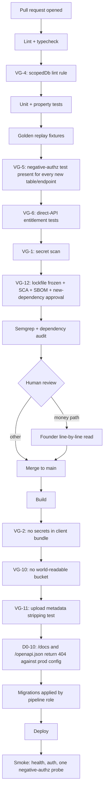

# Infrastructure (Constitution §2, D3, Appendix E doctrine)

Environments, the deploy pipeline with every [VG gate](../../research/VIBE_FAILURE_POSTMORTEMS.md) wired in, database roles, backups and drills, secrets, observability, cost guards, and the Claude Code hook set. Controls referenced as `C-nn` are defined in [SECURITY.md §1](SECURITY.md#1-control-catalogue).

## 1. Principles

**Keep the boring parts aggressively boring.** Managed Postgres, managed platform, object storage, platform environment variables, basic CI, and almost no custom infrastructure until a module spec proves the managed option fails a requirement. Every piece of infrastructure we own is a thing that can page us at 3am and a thing an agent could break.

**The agent never holds production write credentials** (VG-7). This is not a preference. It is the control that separates Merit from the Replit post-mortem.

**Everything restorable is better than everything clever.** The measure of this infrastructure is the quarterly restore drill, not the deploy speed.

## 2. Hosting and platform choices

Proposed as [ADR-007](../DECISIONS.md): **Neon (managed Postgres) plus Railway (apps and worker) plus Cloudflare (edge, WAF, DNS) plus S3-compatible object storage.**

| Concern | Choice | Why this over the alternative |
|---|---|---|
| Database | Neon, dedicated project per environment | Point-in-time recovery, branching for preview environments, and backups are the vendor's job. The alternative (Postgres on a single Hetzner box) makes PITR, patching, and restore bespoke scripts we own and rarely test |
| Apps and worker | Railway services: `site`, `portal-api`, `admin`, `worker` | One platform, per-service environment variables, private networking between services, no OS to patch. Vercel would be marginally better for the static site and would add a second platform for no gain at this size |
| Edge | Cloudflare in front of every origin | WAF, bot rules, rate limiting, DDoS, and the admin-origin IP allowlist all land in one place |
| Object storage | S3-compatible bucket, private by default | certificates and evidence packs only; signed time-limited URLs (VG-10) |
| Queue | pg-boss inside the same Postgres ([ADR-006](../DECISIONS.md)) | one datastore to back up and restore; enqueue joins the same transaction as the state change |
| ORM | Drizzle ([ADR-008](../DECISIONS.md)) | migrations are plain reviewable SQL, which matters because the founder reads every money-path migration line by line |

Rejected for v1: Kubernetes, a self-managed database, a service mesh, multi-region anything, and any custom deployment tooling.

## 3. Environments

| Environment | Purpose | Database | Credentials | Who can write |
|---|---|---|---|---|
| `prod` | The real thing | Neon prod project, PITR on | Vault-held, never printed, never in a repo | Deploy pipeline only |
| `staging` | Pre-production rehearsal, restore-drill target | Neon staging project | Separate set, no overlap with prod | Pipeline, founder |
| `preview` | Per-pull-request ephemeral | Neon branch from staging, seeded | Ephemeral, auto-expiring | Pipeline |
| `dev` | Local | Local Postgres in Docker, seeded | Local only | Founder, coding agent |

**Hard rules:**
1. Production credentials exist in exactly one place: the platform vault. They are never in `.env`, never in a preview environment, never in an agent's session.
2. Preview and dev databases contain **synthetic data only**, produced by the seed script and the [synthetic Rithmic simulator](../GLOSSARY.md#platform-adapter). No production dump ever lands in a lower environment.
3. The admin app is deployed as its own service with its own hostname, its own Cloudflare rules, and its own IP allowlist (C-08).

## 4. Deploy pipeline and the VG gates

Every gate is a merge blocker or a deploy blocker. A gate that can be skipped is not a gate.

| Gate | Enforcement | Blocks |
|---|---|---|
| VG-1 secret scan | gitleaks on the full history and the diff | merge |
| VG-2 no secrets in client output | grep of the built bundle for key-shaped strings | deploy |
| VG-3 server-side authz | review plus VG-6 tests | merge |
| VG-4 `scopedDb` accessor | custom ESLint rule banning raw client import in app paths | merge |
| VG-5 negative-authz test per resource | CI script diffs new tables and endpoints against the test matrix in [API_CONTRACT §12](API_CONTRACT.md#12-negative-authz-test-matrix-d5-required-in-ci) | merge |
| VG-6 entitlement tested via direct API | integration suite calling endpoints without the UI | merge |
| VG-7 agent holds no prod creds | platform permissions; agent sessions get dev credentials only | always |
| VG-8 no DDL or DELETE for the app role; dangerous shell blocked | database grants plus PreToolUse hook | always |
| VG-9 PITR and tested restore | quarterly drill with a written result | ops calendar |
| VG-10 no world-readable bucket | infra test against the live bucket policy | deploy |
| VG-11 metadata stripped on upload | unit test on the upload path | merge |
| VG-12 dependency admission | `--frozen-lockfile`, SCA, SBOM, human approval required for any new package | merge |

**VG-12 is wired in the very first CI setup**, not deferred: the build method is AI-assisted, hallucinated package names recur predictably, and the cost of the gate is one approval step.

## 5. Database roles and grants

| Role | Grants | Held by |
|---|---|---|
| `merit_app` | `SELECT`, `INSERT` on all tables; `UPDATE` only on mutable tables; **no `DELETE` anywhere**; **no `DELETE` or `UPDATE` on append-only tables**; no DDL | API and worker at runtime |
| `merit_migrate` | DDL plus data migration rights | Deploy pipeline only, never a human session |
| `merit_readonly` | `SELECT` on a read replica | Metabase, ad-hoc analysis |
| `merit_admin` | Full | Break-glass only, credential in the vault, use is alerted (C-20) |

Append-only enforcement is a grant, not a convention: `events`, `ledger_entries`, `ledger_transactions`, `fills`, `raw_ingest_rows`, `daily_marks`, `rule_states`, `admin_actions`, `identity_links`, `identity_merges`, `tos_acceptances`, `account_status_history`. The application literally cannot rewrite history.

## 6. Backups, restore, and drills

| Layer | Mechanism | Target |
|---|---|---|
| Continuous | Neon PITR | Recovery point under 1 minute |
| Nightly | Logical dump to object storage, immutable bucket with object-lock, encrypted | 35 day retention |
| Quarterly | **Restore drill** into staging, including payouts mid-queue | Documented recovery time, written result |

The drill is the gate, not the backup. It restores to staging, replays the [nightly batch](../GLOSSARY.md#nightly-batch), verifies the [ledger zero-sum invariant](../GLOSSARY.md#zero-sum-invariant), confirms `rule_states` reproduce byte-identically, and confirms that queued Rise transfers do not double-send because idempotency keys survived (B4 #19). A drill that has not been run in a quarter is treated as a failing test.

## 7. Secrets

- Stored only in the platform vault, injected as environment variables at runtime, scoped per service. The worker holds the SFTP keypair and the Rise key; the web services never see either.
- **90 day rotation calendar** for every credential: SFTP keypair, Rise API key, PSP keys, KYC provider key, webhook signing secrets, database roles.
- Rotation is a runbook with a dual-control requirement on treasury-adjacent credentials (C-10) and a delay window before the old credential is revoked, so a rotation cannot itself become an outage.
- `.env` files are gitignored and CI verifies it rather than trusting it (VG-1).

## 8. Observability

**Metrics that matter (and their alarms):**

| Signal | Alarm |
|---|---|
| Nightly batch completion | Dead-man switch: no `batch.completed` by the expected window pages |
| Batch duration | Over 10 minutes for 5,000 accounts warns |
| Ingest file arrival | `ingest.file_late` warns, extended lateness pages |
| Quarantines | Any `ingest.file_quarantined` pages |
| Reconciliation | Any open mismatch over 24 hours pages |
| Replay self-audit | Any `replay.divergence_detected` pages immediately |
| Ledger invariant | `ledger.invariant_violated` pages and halts payouts |
| Payout velocity | Over 2.5 times the 30 day average pages |
| Reserve coverage | RCR under 1.0 pauses new sales and pages |
| Plan loss ratio | Over 60% pauses that plan's sales and pages |
| MID health | Decline-rate or chargeback-ratio drift warns |
| Rise transfer failures | Any retry-budget exhaustion pages |
| Entitlement hygiene | Closed account still entitled after 24 hours warns (real money) |
| Auth | Failed-auth burst, admin login, out-of-hours admin action all alert (C-20) |
| Canary tokens | Any access pages (C-19) |

**Cron inventory** is maintained as data with a dead-man switch per job: nightly batch, reconciliation, replay self-audit, detector suite, entitlement hygiene, liability snapshot, affiliate accrual, backup dump, KYC expiry sweep. Silent non-execution is the failure mode that hurts most, so absence is alerted, not just failure.

**Logs** are structured JSON with PII and token redaction at the logger, shipped off-box, with the audit trail separate from debug logging (C-17). No debug logging in production builds.

**Error tracking** through Sentry, uptime monitoring on the public surfaces, a public status page, and a Discord webhook for internal alerts.

## 9. Cost guards

Bill creep is the quiet vibe-infra tax, and in Merit's case the platform charges for things we forget to turn off.

1. **Entitlement hygiene job** disables market data and platform access for closed and expired accounts nightly. This is a real line item: Rithmic bills per entitled User ID per month.
2. **Preview environments auto-expire** with their pull request; Neon branches are deleted on merge.
3. **Egress and storage alarms** from day one.
4. **One monthly cost line in the C8 retro**, reviewed against the previous month.
5. **Simulation output** (Monte Carlo runs, 10K trader populations) writes to `test-results/` artifacts, never to the production database and never into an agent's context.

## 10. Claude Code hook set (C10, with the playbook refinement)

Configured in `.claude/settings.json`. Hooks are deterministic; CLAUDE.md is advisory. Anything that must always happen is here.

| Hook | Action | Notes |
|---|---|---|
| `SessionStart` | Echo `docs/STATE.md` and the last `SESSION_LOG` entry | The start ritual, automated |
| `PreToolUse` | Block dangerous shell patterns (`rm -rf`, production connection strings, force-push) and any write into `payout/` or `ledger/` paths without the confirm flag | The Replit lesson, enforced |
| `PostToolUse` | Run the module's test command after every file edit | Highest-value hook in community consensus |
| `Stop` | Completion gate: lint, typecheck, tests must pass before the turn can end | Deterministic definition of done |
| `PreCompact` | Preserve schema and API decisions with rationale, error messages and their fixes, the modified-file list, and the current plan step; summarize exploration | Compact policy also stated in CLAUDE.md |

**Output discipline (from the [playbook](../../research/CLAUDE_CODE_PLAYBOOK.md)):** hooks emit pass or fail plus the first failing line only. Full formatter and test dumps go to `test-results/` and are read on demand. A hook that floods the context defeats the purpose of having one.

## 11. Local development

- `docker compose up` provides Postgres and MinIO. No cloud credentials are needed to develop.
- The **seed script** creates a full demo world: plans and versions, a trading calendar, 50 synthetic traders with histories, breached and funded accounts, flags, payouts, and affiliate data, so every surface is developable offline.
- The **synthetic Rithmic simulator** emits realistic fills for the fake population and writes report files into a local SFTP drop, so the entire pipeline (ingest, marks, engine, eligibility, payouts) runs end to end with zero real accounts. This is why the deferred vendor call does not block engineering.
- Local runs use `merit_app`-equivalent grants so a permission bug surfaces in development rather than production.

## 12. Provisional items (ADR-005)

The SFTP mechanics below are designed from the public description and must be confirmed by the vendor call: file naming conventions and any required prefixes, delivery acknowledgement mechanism, expected arrival window, retention of files on the vendor side, and whether a distinct sandbox endpoint exists before contract. The worker's ingest is arrival-triggered and digest-idempotent precisely so that wrong assumptions here degrade to a delay and an alert rather than data corruption.

## 13. Open questions

1. **ADR-007 (hosting) and ADR-008 (ORM)** need your confirmation. Both are proposed, neither is acted on.
2. **Domain and origin split:** proposed `meritfutures.com` (site), `app.meritfutures.com` (portal and API), `ops.meritfutures.com` (admin, allowlisted). Confirm the third name, since it appears in DNS and should not be guessable-adjacent to the brand.
3. **Status page** hosting: managed (Statuspage class) or a static page on Cloudflare. Recommend managed, because the one time you need it is the one time your platform is down.
