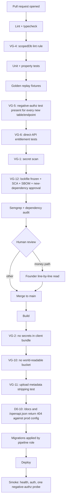

# Infrastructure (Constitution §2, D3, Appendix E doctrine)

Environments, the deploy pipeline with every [VG gate](../../research/VIBE_FAILURE_POSTMORTEMS.md) wired in, database roles, backups and drills, secrets, observability, cost guards, and the Claude Code hook set. Controls referenced as `C-nn` are defined in [SECURITY.md §1](SECURITY.md#1-control-catalogue).

## 1. Principles

**Keep the boring parts aggressively boring.** Managed Postgres, managed platform, object storage, platform environment variables, basic CI, and almost no custom infrastructure until a module spec proves the managed option fails a requirement. Every piece of infrastructure we own is a thing that can page us at 3am and a thing an agent could break.

**The agent never holds production write credentials** (VG-7). This is not a preference. It is the control that separates Merit from the Replit post-mortem.

**Everything restorable is better than everything clever.** The measure of this infrastructure is the quarterly restore drill, not the deploy speed.

## 2. Hosting and platform choices

Proposed as [ADR-007](../decisions/ADR-007.md): **Neon (managed Postgres) plus Railway (apps and worker) plus Cloudflare (edge, WAF, DNS) plus S3-compatible object storage.**

| Concern | Choice | Why this over the alternative |
|---|---|---|
| Database | Neon, dedicated project per environment | Point-in-time recovery, branching for preview environments, and backups are the vendor's job. The alternative (Postgres on a single Hetzner box) makes PITR, patching, and restore bespoke scripts we own and rarely test |
| Apps and worker | Railway services: `site`, `portal`, `api`, `admin`, `api-admin`, `worker`. **Six, and section 2.1 is the table** ([ADR-089](../decisions/ADR-089.md)) | One platform, per-service environment variables, private networking between services, no OS to patch. Vercel would be marginally better for the static site and would add a second platform for no gain at this size |
| Edge | Cloudflare in front of every origin | WAF, bot rules, rate limiting, DDoS, and the admin-origin IP allowlist all land in one place |
| Object storage | S3-compatible bucket, private by default | certificates and evidence packs only; signed time-limited URLs (VG-10) |
| Queue | pg-boss inside the same Postgres ([ADR-006](../decisions/ADR-006.md)) | one datastore to back up and restore; enqueue joins the same transaction as the state change |
| ORM | Drizzle ([ADR-008](../decisions/ADR-008.md)) | migrations are plain reviewable SQL, which matters because the founder reads every money-path migration line by line |

Rejected for v1: Kubernetes, a self-managed database, a service mesh, multi-region anything, and any custom deployment tooling.

## 2.1 The six services ([ADR-089](../decisions/ADR-089.md))

**Five deployables, one of which ships twice.** [ADR-083](../decisions/ADR-083.md) made the API its own deployable and ruled it **one codebase deployed twice**: a `public` surface serving [API_CONTRACT](API_CONTRACT.md) sections 3 to 7 and 10, and an `operator` surface serving sections 8 and 9, with a deployment registering **no route belonging to the other surface**.

| Railway service | Codebase | `MERIT_API_SURFACE` | Origin | Serves |
|---|---|---|---|---|
| `site` | `apps/site` | not set | `meritfutures.com` | Marketing, plans, rules pages, stats, legal |
| `portal` | `apps/portal` | not set | `app.meritfutures.com` | The authenticated trader surface |
| `api` | `apps/api` | `public` | `app.meritfutures.com`, under `/api/v1` | API_CONTRACT sections 3 to 7 and 10, plus `GET /health`, plus the trader's tier-2 live channel ([ADR-163](../decisions/ADR-163.md)) |
| `admin` | `apps/admin` | not set | `ADMIN_ORIGIN` | The operator console |
| `api-admin` | `apps/api` | `operator` | `ADMIN_ORIGIN`, under `/api/v1` | API_CONTRACT sections 8 and 9, selected by the `/admin` and `/internal` path prefixes, plus `GET /health`, plus the operator's tier-2 live delivery, which carries one of those two prefixes for exactly that reason ([ADR-161](../decisions/ADR-161.md) clause 2, [ADR-163](../decisions/ADR-163.md)) |
| `worker` | `apps/worker` | not set | **none, no ingress** | Nightly batch, provisioning delivery, Rise transfers, detectors, hygiene jobs, and the tier-2 **streaming ingest**, which is write-only into the live cache and serves nothing ([ADR-163](../decisions/ADR-163.md), `INV-M2-14`) |

**TIER 2 ADDS NO SERVICE AND THIS TABLE STILL ROWS SIX** ([ADR-163](../decisions/ADR-163.md)). The live channel is served by `api` and by `api-admin`, the two deployments of the one codebase that already resolves `MERIT_API_SURFACE`, so the trader's frames leave the portal's origin and the founder's leave `ADMIN_ORIGIN` with **no new origin, no new service and no change to the routing rule below**: both live paths sit under `/api/v1`, which is where Cloudflare already sends them. **That is the whole reason a sixth deployable was refused rather than merely not needed.** The C-08 IP allowlist and the admin origin's Cloudflare rules are scoped to the ORIGIN and not to a service (section 3, hard rule 3), so an operator live channel running where `api-admin` already runs inherits them, and one running anywhere else would not, while every check in the repository stayed green. `RI-04` and `RI-09` each iterate a hand-written list of five application directories and neither reads `apps/`, so a sixth service's directory is invisible to both.

**`worker`'s `none, no ingress` is a FORECLOSURE from [ADR-163](../decisions/ADR-163.md) and not only a description.** The worker already runs long and already consumes the feed, which is what makes it the tempting home for a socket. Giving it ingress would put a request path on the one service whose row exists to say there is not one, and would put the trader's audience and the operator's in a single process with no `MERIT_API_SURFACE` to separate them. **It keeps the ingest and never the channel.**

**`api` and `api-admin` are two SERVICES and not one service running two instances.** The two deployments differ in exactly one value, `MERIT_API_SURFACE`, which [`surface.ts`](../../apps/api/src/surface.ts) resolves with **no default** and refuses when unset. This document scopes environment variables **per service**, in the row above and again in section 7, so a single service hands both of its instances the same value and there is no second surface at all. The failure is silent: both processes start cleanly and serve a coherent route set, and if the shared value is `operator` the public origin answers **200** where [API_CONTRACT section 12](API_CONTRACT.md#12-negative-authz-test-matrix-d5-required-in-ci) requires **404**.

**Two services share each public-facing origin, so Cloudflare routes by path.** `/api/v1/*` reaches `api` on `app.meritfutures.com` and `api-admin` on `ADMIN_ORIGIN`; everything else reaches `portal` and `admin` respectively. That routing rule is new work created by [ADR-083](../decisions/ADR-083.md) rather than by the naming, and the old fused name is what hid it.

**`portal-api` was a name for a fused PROCESS and not a label for the shared origin**, which is why this list changed rather than merely being extended. Origins are section 13.2's subject and no row of this section's table has ever held a hostname. [ADR-089](../decisions/ADR-089.md) sections 3 and 4 carry the derivation, and [ADR-007](../decisions/ADR-007.md)'s `Decision:` enumeration of *"the four services"* is superseded in part by it, on the count and the names only; every hosting choice that entry made stands.

**`api-admin` is a service name and never a hostname.** [ADR-012](../decisions/ADR-012.md)'s placeholder convention is binding here more than anywhere: this is the table where a real admin domain gets written by helpfulness, and it does not get written.

## 3. Environments

| Environment | Purpose | Database | Credentials | Who can write |
|---|---|---|---|---|
| `prod` | The real thing | Neon prod project, PITR on | Vault-held, never printed, never in a repo | Deploy pipeline only |
| `staging` | Pre-production rehearsal, restore-drill target | Neon staging project | Separate set, no overlap with prod | Pipeline, founder |
| `preview` | Per-pull-request ephemeral | Neon branch from staging, seeded | Ephemeral, auto-expiring | Pipeline |
| `dev` | Local | Local Postgres in Docker, seeded | Local only | Founder, coding agent |

**Hard rules:**
1. Production credentials exist in exactly one place: the platform vault. They are never in `.env`, never in a preview environment, never in an agent's session.
2. Preview and dev databases contain **synthetic data only**, produced by the seed script and the [synthetic Rithmic simulator](../GLOSSARY.md#platform-adapter). No production dump ever lands in a lower environment.
3. **Two services run on `ADMIN_ORIGIN`, a separate apex domain** ([ADR-012](../decisions/ADR-012.md)): the admin console (`admin`) and the operator API (`api-admin`), per section 2.1. The origin has its own Cloudflare rules and its own IP allowlist (C-08), and **those are scoped to the origin rather than to a service**, so they covered `api-admin` from the day [ADR-083](../decisions/ADR-083.md) ruled it into existence; this sentence named one service where two run, which was an inventory error and never a gap in the control ([ADR-089](../decisions/ADR-089.md)). Cookie scope, CORS, and the CSP never span the two origins, so an XSS on the portal cannot reach the admin surface even in principle.

## 4. Deploy pipeline and the VG gates

Every gate is a merge blocker or a deploy blocker. A gate that can be skipped is not a gate.

| Gate | Enforcement | Blocks |
|---|---|---|
| VG-1 secret scan | gitleaks on the full history and the diff | merge |
| VG-2 no secrets in client output | grep of the built bundle for key-shaped strings | deploy |
| VG-3 server-side authz | review plus VG-6 tests | merge |
| VG-4 `scopedDb` accessor | custom ESLint rule banning raw client import in app paths | merge |
| VG-5 negative-authz test per resource | CI script diffs new tables and endpoints against the test matrix in [API_CONTRACT §12](API_CONTRACT.md#12-negative-authz-test-matrix-d5-required-in-ci) | merge |
| VG-6 entitlement tested via direct API | integration suite calling endpoints without the UI | merge |
| VG-7 agent holds no prod creds | platform permissions; agent sessions get dev credentials only | always |
| VG-8 no DDL or DELETE for the app role; dangerous shell blocked | database grants plus PreToolUse hook | always |
| VG-9 PITR and tested restore | quarterly drill with a written result | ops calendar |
| VG-10 no world-readable bucket | infra test against the live bucket policy | deploy |
| VG-11 metadata stripped on upload | unit test on the upload path | merge |
| VG-12 dependency admission | `--frozen-lockfile`, SCA, SBOM, human approval required for any new package | merge |

**VG-12 is wired in the very first CI setup**, not deferred: the build method is AI-assisted, hallucinated package names recur predictably, and the cost of the gate is one approval step.

## 5. Database roles and grants

| Role | Grants | Held by |
|---|---|---|
| `merit_app` | `SELECT`, `INSERT` on all tables; `UPDATE` only on mutable tables; **no `DELETE` anywhere**; **no `DELETE` or `UPDATE` on append-only tables**; no DDL | API and worker at runtime |
| `merit_migrate` | DDL plus data migration rights | Deploy pipeline only, never a human session |
| `merit_readonly` | `SELECT` on a read replica | Metabase, ad-hoc analysis |
| `merit_admin` | Full | Break-glass only, credential in the vault, use is alerted (C-20) |

Append-only enforcement is a grant, not a convention: `events`, `ledger_entries`, `ledger_transactions`, `fills`, `raw_ingest_rows`, `daily_marks`, `rule_states`, `admin_actions`, `identity_links`, `identity_merges`, `tos_acceptances`, `account_status_history`. The application literally cannot rewrite history.

## 6. Backups, restore, and drills

| Layer | Mechanism | Target |
|---|---|---|
| Continuous | Neon PITR | Recovery point under 1 minute |
| Nightly | Logical dump to object storage, immutable bucket with object-lock, encrypted | 35 day retention |
| Quarterly | **Restore drill** into staging, including payouts mid-queue | Documented recovery time, written result |

The drill is the gate, not the backup. It restores to staging, replays the [nightly batch](../GLOSSARY.md#nightly-batch), verifies the [ledger zero-sum invariant](../GLOSSARY.md#zero-sum-invariant), confirms `rule_states` reproduce byte-identically, and confirms that queued Rise transfers do not double-send because idempotency keys survived (B4 #19). A drill that has not been run in a quarter is treated as a failing test.

## 7. Secrets

- Stored only in the platform vault, injected as environment variables at runtime, scoped per service. The worker holds the SFTP keypair and the Rise key; the web services never see either.
- **90 day rotation calendar** for every credential: SFTP keypair, Rise API key, PSP keys, KYC provider key, webhook signing secrets, database roles.
- Rotation is a runbook with a dual-control requirement on treasury-adjacent credentials (C-10) and a delay window before the old credential is revoked, so a rotation cannot itself become an outage.
- **`.env` files are gitignored and a check proves the rule rather than trusting the entry ([ADR-224](../decisions/ADR-224.md)).** `.gitignore` ignores `.env` and `.env.*` by basename at any depth and re-includes `.env.example` alone, and `RI-21` in `packages/tooling/checks/repo-invariants.mjs` asks `git check-ignore` what that rule says about representative paths and `git ls-files` whether any such file is already tracked. It runs in **CI-01**, the lint-and-types stage, in the repository-invariants step. **`VG-1` does not verify this and never did**: gitleaks reads file content for secret-shaped strings and reads no `.gitignore`, so a `DATABASE_URL` or a vendor base URL would pass it. This line asserted both halves before that entry, and both were false.

## 8. Observability

**Metrics that matter (and their alarms):**

| Signal | Alarm |
|---|---|
| Nightly batch completion | Dead-man switch: no `batch.completed` by the expected window pages |
| Batch duration | Over 10 minutes for 5,000 accounts warns |
| Ingest file arrival | `ingest.file_late` warns, extended lateness pages |
| Quarantines | Any `ingest.file_quarantined` pages |
| Reconciliation | Any open mismatch over 24 hours pages |
| Replay self-audit | Any `replay.divergence_detected` pages immediately |
| Ledger invariant | `ledger.invariant_violated` pages and halts payouts |
| Payout velocity | Over 2.5 times the 30 day average pages |
| Reserve coverage | RCR under 1.0 pauses new sales and pages |
| Plan loss ratio | Over 60% pauses that plan's sales and pages |
| MID health | Decline-rate or chargeback-ratio drift warns |
| Rise transfer failures | Any retry-budget exhaustion pages |
| Entitlement hygiene | Closed account still entitled after 24 hours warns (real money) |
| Auth | Failed-auth burst, admin login, out-of-hours admin action all alert (C-20) |
| Canary tokens | Any access pages (C-19) |

**Cron inventory** is maintained as data with a dead-man switch per job: nightly batch, reconciliation, replay self-audit, detector suite, entitlement hygiene, liability snapshot, affiliate accrual, backup dump, KYC expiry sweep. Silent non-execution is the failure mode that hurts most, so absence is alerted, not just failure.

**Logs** are structured JSON with PII and token redaction at the logger, shipped off-box, with the audit trail separate from debug logging (C-17). No debug logging in production builds.

**Error tracking** through Sentry, uptime monitoring on the public surfaces, a public status page, and a Discord webhook for internal alerts.

## 9. Cost guards

Bill creep is the quiet vibe-infra tax, and in Merit's case the platform charges for things we forget to turn off.

1. **Entitlement hygiene job** disables market data and platform access for closed and expired accounts nightly. This is a real line item: Rithmic bills per entitled User ID per month.
2. **Preview environments auto-expire** with their pull request; Neon branches are deleted on merge.
3. **Egress and storage alarms** from day one.
4. **One monthly cost line in the C8 retro**, reviewed against the previous month.
5. **Simulation output** (Monte Carlo runs, 10K trader populations) writes to `test-results/` artifacts, never to the production database and never into an agent's context.

## 10. Claude Code hook set (C10, with the playbook refinement)

Configured in `.claude/settings.json`, **which now exists and is committed to the repository** ([ADR-D1](../decisions/ADR-D1.md)). Hooks are deterministic; CLAUDE.md is advisory. Anything that must always happen is here.

**The file currently carries the corpus-phase set only.** `SessionStart` (pull, then echo STATE) and `Stop` (push) are live today, because they are the two that matter while the deliverables are documents. The rest of the table below lands at FREEZE, when there is a test command to run and a `payout/` path to guard. Wiring `PostToolUse` to a test command that does not exist yet would be a hook that fails on every edit, and a hook everyone learns to ignore is worse than one that is not there.

| Hook | Action | Notes |
|---|---|---|
| `SessionStart` | **`git pull --ff-only`** ([ADR-D1](../decisions/ADR-D1.md)), then echo `docs/STATE.md` and the last `SESSION_LOG` entry | **Live.** The start ritual, automated. A session never begins on a stale tree |
| `Stop` | **`git push origin HEAD`** ([ADR-D1](../decisions/ADR-D1.md)) | **Live.** A session never ends with unpushed commits. Reports failure and exits zero rather than blocking, so a network outage cannot wedge a session; the softening is recorded in the ADR |
| `PreToolUse` | *(at FREEZE)* Block dangerous shell patterns (`rm -rf`, production connection strings, force-push) and any write into `payout/` or `ledger/` paths without the confirm flag | The Replit lesson, enforced |
| `PostToolUse` | *(at FREEZE)* Run the module's test command after every file edit | Highest-value hook in community consensus |
| `Stop` (extended) | *(at FREEZE)* Completion gate: lint, typecheck, tests must pass before the turn can end, in addition to the push above | Deterministic definition of done |
| `PreCompact` | Preserve schema and API decisions with rationale, error messages and their fixes, the modified-file list, and the current plan step; summarize exploration | Compact policy also stated in CLAUDE.md |

**Output discipline (from the [playbook](../../research/CLAUDE_CODE_PLAYBOOK.md)):** hooks emit pass or fail plus the first failing line only. Full formatter and test dumps go to `test-results/` and are read on demand. A hook that floods the context defeats the purpose of having one.

## 10.5 Scale targets, and the evolution path

**The architecture above is validated for 50,000 active traders.** That figure is recorded here rather than left implicit, because "will this scale" is a question that otherwise gets answered by anxiety instead of arithmetic, usually at the moment someone is proposing to replace something that works.

| Dimension | At 50,000 active traders |
|---|---|
| Fills | roughly **1,000,000 per day** |
| `fills` rows retained | roughly **250,000,000 per year** |
| Payout requests | **2,000 to 5,000 per day** |
| Nightly batch | 50,000 accounts, against the 10 minute budget written for 5,000 |

**Nothing in that table requires a different architecture.** Four changes cover it, and every one of them is a standard operation on the stack [ADR-007](../decisions/ADR-007.md) already chose:

1. **Table partitioning on `fills` and `daily_marks`**, by trading day or by month. These are the two append-only tables whose row counts grow without bound, and partitioning them is a migration plus a retention policy, not a redesign. Everything else in the schema is bounded by account count rather than by fill volume.
2. **The nightly batch fans out to a parallel worker pool.** The batch is already per-account and per-trading-day inside one transaction each ([M02](../plans/M02-rithmic-bridge.md) ST-M2-5), which means it is embarrassingly parallel by construction. This was a design property from the beginning and it is the reason a ten-times account count is a concurrency setting rather than a rewrite.
3. **Metabase moves to a read replica.** It already runs as `merit_readonly` (§5); the change is which host that role connects to.
4. **pg-boss stays.** [ADR-006](../decisions/ADR-006.md) chose it partly on the reasoning that Postgres handles this scale of job volume comfortably, and 5,000 payout requests a day is not close to the point where that stops being true. If it ever is, the job interface is deliberately narrow enough that the swap is contained, which was also part of that ADR's acceptance.

**All four are standard and non-architectural.** None changes a module boundary, a table's meaning, or a rule. They are things you do to a working system, in an afternoon each, when the numbers say to.

**The real constraint at that scale is ops headcount, not infrastructure, and pretending otherwise would be the expensive mistake.** At 50,000 active traders the flags queue, the evidence packs, the KYC exceptions, the destination-cooling reviews, the name-match false positives, the support conversations about a breach, and the daily liability read are all **human** work, and every one of them scales roughly linearly with trader count. [M07](../plans/M07-risk-abuse.md) FM-M7-04 already names the failure mode in miniature: a queue nobody works is documented negligence. At fifty times the volume that stops being a metric and becomes the binding constraint on the whole business.

The consequence for planning: **capacity questions at this scale should be asked about people first and about Postgres second.** The infrastructure evolution above is a known, cheap, written-down path. The operational one is not, and it is the one that needs a plan before the growth arrives rather than during it.

## 11. Local development

- `docker compose up` provides Postgres and MinIO. No cloud credentials are needed to develop.
- The **seed script** creates a full demo world: plans and versions, a trading calendar, 50 synthetic traders with histories, breached and funded accounts, flags, payouts, and affiliate data, so every surface is developable offline.
- The **synthetic Rithmic simulator** emits realistic fills for the fake population and writes report files into a local SFTP drop, so the entire pipeline (ingest, marks, engine, eligibility, payouts) runs end to end with zero real accounts. This is why the deferred vendor call does not block engineering.
- Local runs use `merit_app`-equivalent grants so a permission bug surfaces in development rather than production.

## 12. Provisional items (ADR-005)

The SFTP mechanics below are designed from the public description and must be confirmed by the vendor call: file naming conventions and any required prefixes, delivery acknowledgement mechanism, expected arrival window, retention of files on the vendor side, and whether a distinct sandbox endpoint exists before contract. The worker's ingest is arrival-triggered and digest-idempotent precisely so that wrong assumptions here degrade to a delay and an alert rather than data corruption.

## 13. Founder rulings (Wave 2 gate, 2026-08-13) and remaining questions

1. **ADR-007 (hosting) and ADR-008 (ORM): both ACCEPTED.** Neon plus Railway plus Cloudflare plus an S3-compatible private bucket; Drizzle with the `scopedDb(identity)` wrapper and the VG-4 lint rule. Recorded in [DECISIONS.md](../decisions/README.md).
2. **Domain and origin split: RULED.** `meritfutures.com` (site) and `app.meritfutures.com` (portal and API) stand. **That sentence is about ORIGINS and it is correct as written; it is not a service list.** *"Portal and API"* on one origin is **two Railway services**, `portal` and `api`, routed by path at Cloudflare, per section 2.1 and [ADR-089](../decisions/ADR-089.md). The distinction is recorded here because this is the sentence a later reader would otherwise use to fuse them back into one process, which is what the retired name `portal-api` did. The admin console does **not** live on a Merit subdomain: it is served from a **separate apex domain**, unrelated to the brand in name, chosen at infrastructure setup ([ADR-012](../decisions/ADR-012.md)). The reason is that a subdomain satisfies "separate origin" but not D3's "unlinked from public surfaces": `ops.meritfutures.com` is guessable and appears in certificate transparency logs beside the brand.
   **Placeholder convention, binding from here on:** every document, configuration file, and code reference uses **`ADMIN_ORIGIN`**, resolved from the platform vault at deploy time. The real hostname is never written into this corpus, the repository, or any public artifact. It gets its own registrar lock and its own renewal reminder, because a lapsed admin domain is an outage with a hostile finder.
3. **Status page** hosting: managed (Statuspage class) or a static page on Cloudflare. Recommend managed, because the one time you need it is the one time your platform is down. **Still open**; decide with M10.
