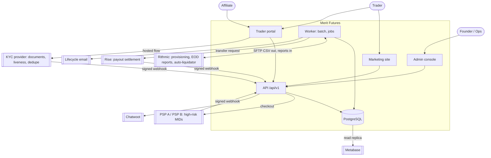
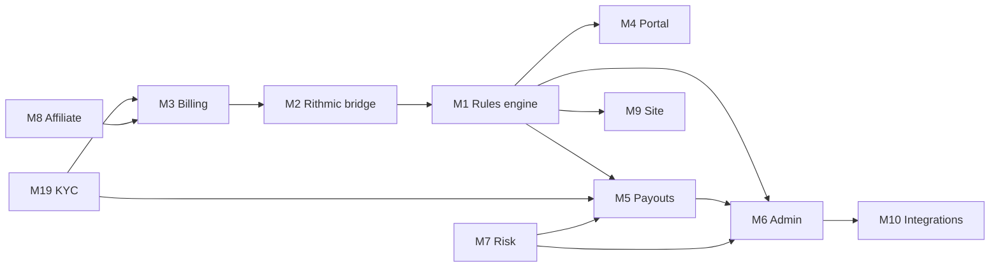
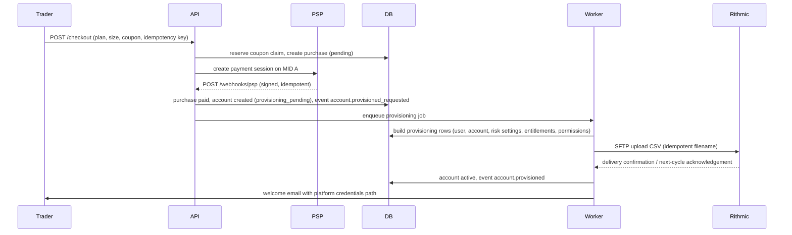
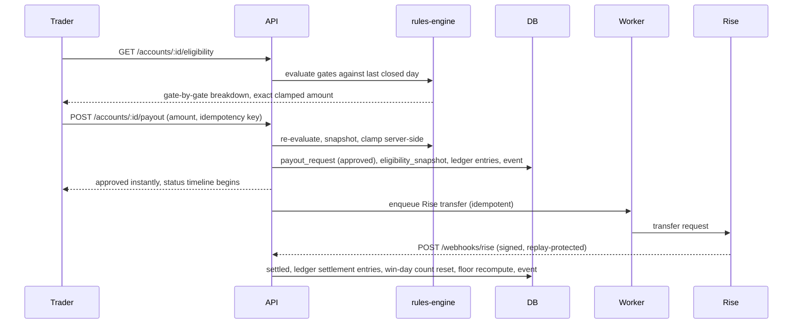
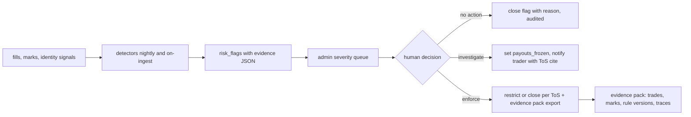
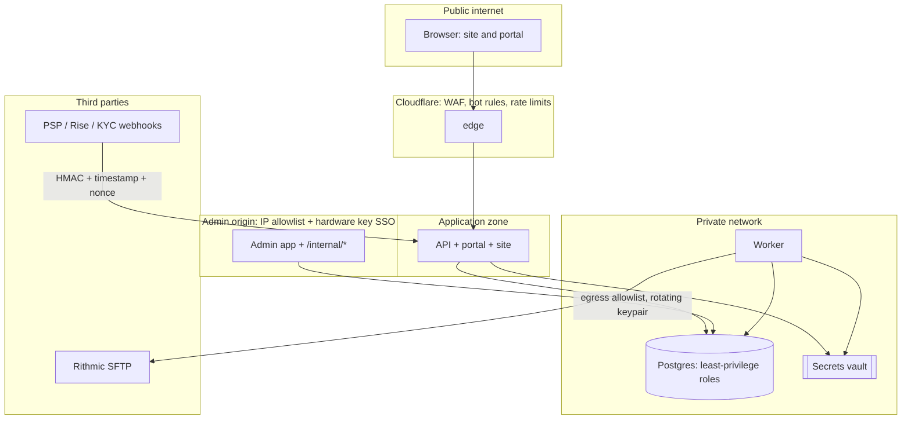

# Architecture Overview (Constitution §2, B1)

The system in one place: what the pieces are, how data moves end to end, where the trust boundaries sit, and what runs when. Every term used here is defined in [GLOSSARY.md](../GLOSSARY.md); this document never redefines one.

**Reading order for the Wave 2 gate:** this document, then [DATA_MODEL](data-model/README.md), then [API_CONTRACT](API_CONTRACT.md). [EVENTS](EVENTS.md), [STATE_MACHINES](STATE_MACHINES.md), [SECURITY](SECURITY.md), and [INFRA](INFRA.md) are the detail behind them.

## 1. The system in one paragraph

Merit sells simulated futures evaluation accounts, provisions them on Rithmic, ingests what happened each session as files, recomputes every account's rule position from those files in a nightly batch, and lets any account that mechanically clears every [gate](../GLOSSARY.md#gate) extract money instantly through Rise. There is no intraday risk system, because [intraday enforcement is delegated to Rithmic's auto-liquidator](../GLOSSARY.md#auto-liquidator) and all rules compute from [daily marks](../GLOSSARY.md#daily-mark). There is no discretionary payout review, because abuse is handled at [detection time](../GLOSSARY.md#detection-time-enforcement) with evidence, not at request time with a denial. Everything financial is an immutable [ledger entry](../GLOSSARY.md#ledger-entry); everything that happened is an immutable event; everything a trader relies on is a pinned [plan version](../GLOSSARY.md#plan-version).

## 2. Context: actors and external systems



Merit holds no trader documents (they stay at the [KYC provider](../GLOSSARY.md#kyc-state)), no card numbers (tokenized at the PSP), and no market data license (traders are entitled through the platform).

## 3. Containers and why each exists

| Container | Responsibility | Why separate |
|---|---|---|
| `apps/site` | Public marketing, plans, rules pages, stats, legal | Static and cacheable; renders rules **from** plan versions so marketing cannot drift from the engine |
| `apps/portal` | Trader dashboard, payout center, certificates, KYC status, referrals | Authenticated trader surface; the [BOLA](../../research/SECURITY_LANDSCAPE.md) blast radius, so it is identity-scoped everywhere |
| `apps/admin` | Liability dashboard, account drill-down, flags queue, evidence export | **Separate origin**, IP allowlisted, hardware-key SSO. One owned admin is total loss, so it never shares an origin with public surfaces |
| `apps/api` | Every endpoint [API_CONTRACT](API_CONTRACT.md) specifies, under the `/api/v1` base path: auth, catalog, commerce, accounts, KYC and affiliate, the operator and `/internal/*` surfaces, and the signed inbound webhooks | **Drawn in section 2 since 2026-08-13 and rowed here only on 2026-08-23**, by [ADR-083](../decisions/ADR-083.md), which is the ruling that created the deployable. It is separate from the three UI surfaces because API_CONTRACT section 1 makes them its **clients** with "no privileged back door", and a surface that contains the API has one by construction: a handler in the same package is an import away. **One codebase, two deployments.** The public one registers no `/admin/*` and no `/internal/*` route, so section 12's required **404** from the public origin is the router answering for a path that is not there rather than a per-request check that can be forgotten |
| `packages/rules-engine` | Pure rule computation, zero I/O | Determinism and testability. `(planConfigVersion, accountState, dayMarks[]) -> newState + events`. Runs headless in tests and in the replay self-audit |
| `packages/db` | Schema, migrations, `scopedDb(identity)` accessor | One access idiom, lint-enforced. Raw table access in app code is forbidden |
| `packages/ledger` | Double-entry posting: the chart of accounts, the transfer, the `ledger_transactions` and `ledger_entries` write, and the `ledger_halts` refusal. `PT-03`'s aggregate half | **A LIBRARY BECAUSE TWO DEPLOYABLES POST AND `RI-04` FORBIDS AN APP DEPENDING ON AN APP** ([ADR-104](../decisions/ADR-104.md)). M03's `INV-M3-10` chargeback reversal, M05's `DEP-M3-06`, M08's commission clock and the nightly batch all post through it, and the batch runs in `worker`. **THE IMBALANCE IS UNREPRESENTABLE**: an entry exists only as one half of a transfer, so the legs of any posting sum to exactly zero arithmetically. It declares no dependency and takes the caller's OPEN transaction as its first argument, so a movement commits with the state change that caused it ([ADR-006](../decisions/ADR-006.md)) and the library cannot open a pool |
| `packages/rithmic` | Platform adapter: provision, entitle, ingestFills, ingestEOD, reconcile | Isolates every vendor specific behind the interface so adapter #2 is additive |
| `worker` | Nightly batch, provisioning delivery, Rise transfers, detectors, hygiene jobs | Long-running and retryable work must never sit in a request path |

The queue runs on **pg-boss** (Postgres-only) rather than BullMQ plus Redis: one fewer stateful service to back up, restore, and reason about, and the job store participates in the same transactions and the same PITR as the money data. This resolves a §10 open item and is proposed as [ADR-006](../decisions/ADR-006.md).

## 4. Module map

Dependency order runs top to bottom; [M1](../plans/M01-rules-engine.md) is always first.



| Module | Surface it owns | Depends on |
|---|---|---|
| M1 rules engine | Pure rule library, replay, eligibility | nothing (by design) |
| M2 Rithmic bridge | Provisioning out, ingest in, reconciliation, simulator | M1 (consumes its state shape) |
| M3 billing and checkout | PSP abstraction, coupons, resets, chargebacks | M2, M19 |
| M4 trader portal | Dashboard, payout center, certificates | M1, M5, M19 |
| M5 payout system | Request, snapshot, clamp, approve, ledger, Rise | M1, M19, M7 (freeze state) |
| M6 admin console | Liability, drill-down, flags, evidence packs | M1, M5, M7 |
| M7 risk and abuse | Entity resolution, detectors, flags | M2 (fills), M1 (marks) |
| M8 affiliate | Codes, attribution, statements | M3 |
| M9 marketing site | Plans, rules, stats, legal | M1 (config rendering) |
| M10 integrations | Chatwoot, Metabase, email, alerts | M6 |
| M11 to M18 | Certificates, transparency, analytics, loyalty, Discord, notifications, offers, live ladder | per §4-addendum |
| M19 KYC and identity | Verification lifecycle, biometric dedupe | none (gates M3 and M5) |

## 5. End-to-end flows

### 5.1 Purchase to provisioned (the golden path saga)



Compensation: if payment succeeds and provisioning fails, the saga alerts within five minutes and retries; the account stays in `provisioning_pending` and is visible in admin as a paid-not-provisioned exception. If MID A errors abnormally, checkout routes to MID B; both webhook into the same idempotent pipeline.

### 5.2 Trading session to rule state (the nightly batch)

This is the core loop and the one that must be boring.

```mermaid
sequenceDiagram
    participant R as Rithmic
    participant W as Worker
    participant E as rules-engine
    participant DB

    R->>W: EOD report files land on SFTP (arrival triggered)
    W->>DB: record ingest_files (digest, status received)
    W->>W: validate whole file; on failure quarantine and alert, commit nothing
    W->>DB: insert raw rows, normalize to fills (immutable)
    W->>E: compute daily_marks per account for the trading day
    W->>E: breach check (day low vs floor) BEFORE progression
    W->>E: advance rule_state (phase, floor, win days, consistency, gaps)
    W->>DB: persist marks, rule_states, emit events
    W->>W: reconciliation: our EOD balance vs Rithmic stated
    W->>W: replay self-audit: recompute from day 1, compare byte-identical
    W->>W: detectors (correlation, clustering, velocity), entitlement hygiene
    W->>DB: flags, alerts, liability projections refreshed
```

Ordering is binding: **ingest, then breach, then progression.** A breach and a pass on the same day resolve to breach. Any stage failing leaves prior stages committed per account and the batch resumable at the account boundary, so a crash at account 2,341 of 5,000 resumes without double-applying a day.

### 5.3 Payout request to settled



The only path that stops a request is an account already carrying [payouts_frozen](../GLOSSARY.md#payouts-frozen) from an active investigation, or a failed [reconciliation](../GLOSSARY.md#reconciliation), or KYC not `verified`. All three are set **before** request time and all three are visible to the trader in advance.

### 5.4 Detection to enforcement



No detector ever enforces automatically, and no enforcement path denies a payment request. The [evidence pack](../GLOSSARY.md#evidence-pack) is generated at enforcement time because adversaries contest publicly.

## 6. The daily timeline

| When (exchange time) | What runs | Failure posture |
|---|---|---|
| Session close | Rithmic finalizes the session | n/a |
| Arrival of EOD files (no contractual time, [provisional](../STATE.md)) | Batch triggers on arrival | Late-file alarm if not received by the expected window; dead-man switch if the batch itself does not run |
| Batch stage 1 to 3 | Validate, ingest, normalize | Whole-file quarantine, no partial commit |
| Batch stage 4 to 6 | Marks, breach, progression | Per-account transaction, resumable |
| Batch stage 7 | Reconciliation | Mismatch quarantines the account from payouts and alerts |
| Batch stage 8 | Replay self-audit | Divergence halts eligibility for that account and pages |
| Batch stage 9 | Detectors, hygiene, projections | Non-blocking for eligibility; alerts on failure |
| Continuous | Payout requests, checkout, portal | Read the last closed day only |

## 7. Trust boundaries



Boundary rules that are architectural, not aspirational:
1. Every request crossing into the application zone is identity-scoped at the data layer via `scopedDb(identity)`; there is no code path that reads a table without an identity scope.
2. The admin zone is a different origin with its own auth and its own allowlist. `/internal/*` exists only there.
3. The worker is the only component that talks to Rithmic, and its egress is allowlisted.
4. All inbound webhooks are signature-verified before parsing, and replay-protected by timestamp and nonce.
5. Secrets live only in the platform vault. The coding agent never holds production write credentials.

Full threat model per asset is in [SECURITY.md](SECURITY.md).

## 8. Ingest architecture (ADR-002, SFTP-first)

Both directions are files over SFTP, which is Rithmic's own scriptable bulk interface for evaluators:

- **Outbound:** provisioning CSVs (users, accounts, risk settings, entitlements, permissions) written with idempotent filenames, queued with delivery states, and confirmed.
- **Inbound:** EOD report files (and fill detail, whichever shape the vendor delivers) parsed into immutable rows, then normalized.
- **Not in v1:** R|API+ admin pull. It costs about $100 per month per API User ID, and it would put standing admin credentials in a worker. Nothing in the [T+1](../GLOSSARY.md#t1) rule model needs it. It remains the enhancement path if operations later want faster breach visibility.

Consequences the founder should hold in mind: our own view of an account is one batch cycle behind live trading, so every trader-facing and admin-facing number is labeled "as of last closed session", and a trader who breaches at 10:00 is liquidated by Rithmic immediately but appears breached in Merit only after that night's batch.

**Provisional pending vendor confirmation ([ADR-005](../decisions/ADR-005.md)):** report file formats and field lists, delivery cadence and any timing guarantee, correction and backdated-fill semantics, sandbox availability, provisioning CSV schemas, and server-side copy configuration. The design absorbs either report shape because marks are always **computed** from ingested rows and never trusted from a vendor summary. The full provisional list lives in [STATE.md](../STATE.md).

## 9. What v1 deliberately does not build

Streaming or intraday risk; a no-code program editor; multi-tenancy or theming; multi-asset or MT4/MT5; a second platform adapter; native mobile apps; leaderboards and contests; sub-IB trees; an in-house KYC or document store; an in-house support desk or BI tool; live-capital trading (the [ladder](../GLOSSARY.md#payout-ladder) records the invitation and closes the simulated account).

## 10. Founder rulings (Wave 2 gate, 2026-08-13)

All three resolved at the gate. Recorded in [DECISIONS.md](../decisions/README.md).

1. **Queue: pg-boss, accepted** ([ADR-006](../decisions/ADR-006.md)). Closes the constitution §10 queue-tech item.
2. **ORM: Drizzle, accepted** ([ADR-008](../decisions/ADR-008.md)). **Hosting: Neon plus Railway plus Cloudflare, accepted** ([ADR-007](../decisions/ADR-007.md)). Both constitution §10 items are closed. The admin origin rides along and is settled separately as a **separate apex domain** with the placeholder `ADMIN_ORIGIN` ([ADR-012](../decisions/ADR-012.md)).
3. **Reserve funding cadence: weekly manual plus a same-day top-up trigger** ([ADR-011](../decisions/ADR-011.md)). The baseline stays a weekly manual transfer into the payout wallet. In addition, when the Eligible-Next-7-Days forecast crosses a configured share of the payout wallet balance, the admin home raises a same-day top-up task and alerts. The forecast exists precisely so a bad week is visible before it arrives, and this is what makes it operational rather than decorative. The threshold is configuration, reviewed monthly in the C8 retro; M5 sets its initial value against the CVaR99 estimate.
