# State Machines (Constitution B5 §3)

Every lifecycle in the system: states, transitions, and the exact guard on each transition. Guards are named (`G-*`) and defined once in §10 so the same condition is never written twice. Events emitted on transition are named from [EVENTS.md](EVENTS.md); terms from [GLOSSARY.md](../GLOSSARY.md).

**Universal rules for every machine below:**
1. A transition happens in one database transaction with its event write. No event without the fact, no fact without the event.
2. Transitions not drawn here do not exist. Anything else is a bug, and the engine rejects it rather than coercing it.
3. Every machine's terminal states are terminal. Nothing resurrects an account, a payout, or a purchase; a new one is created instead.

## 1. Account lifecycle

`accounts.status` is the operational machine; `accounts.phase` is annotated on the states because the two must move together and the pair is what traders see.

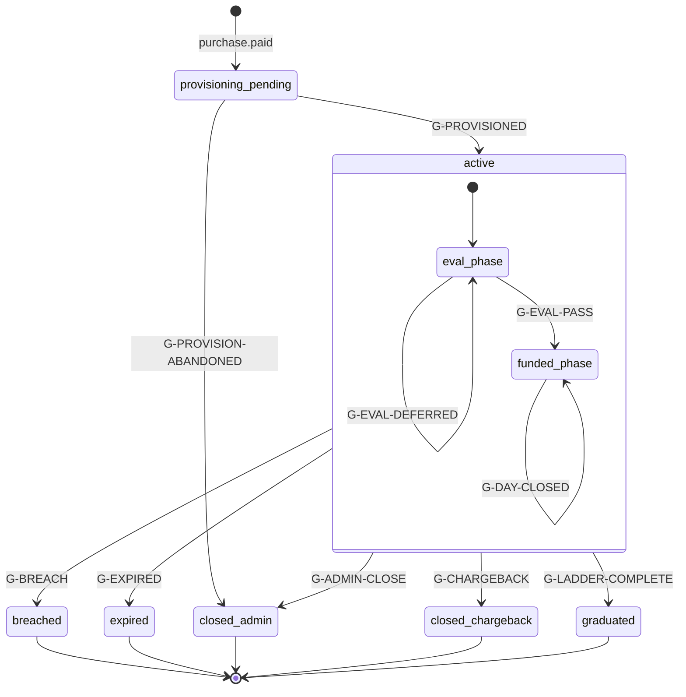

| State | Phase | Meaning | Trader can trade | Payout reachable |
|---|---|---|---|---|
| `provisioning_pending` | eval or funded | Paid, not yet live on the platform | no | no |
| `active` (eval) | `eval` | Working toward the target | yes | no |
| `active` (funded) | `funded` | Post-pass, gates accumulating | yes | when [eligible](../GLOSSARY.md#eligibility) |
| `breached` | `closed` | Terminal rule violation | no | no |
| `expired` | `closed` | Eval time limit reached (v1 unlimited, so unreachable by config) | no | no |
| `closed_admin` | `closed` | Enforcement or trader request | no | no |
| `closed_chargeback` | `closed` | Payment disputed | no | no |
| `graduated` | `graduated` | Ladder complete, live invitation issued | no | no (account is done) |

Transition detail:

| From | To | Guard | Events emitted |
|---|---|---|---|
| `provisioning_pending` | `active` | G-PROVISIONED | `account.provisioned` |
| `provisioning_pending` | `closed_admin` | G-PROVISION-ABANDONED | `account.provision_failed`, `account.closed` |
| eval | funded | G-EVAL-PASS | `phase.passed` |
| eval | eval | G-EVAL-DEFERRED | `phase.pass_deferred_consistency` |
| `active` | `breached` | G-BREACH | `breach.detected`, `account.closed` |
| `active` | `closed_chargeback` | G-CHARGEBACK | `purchase.charged_back`, `account.closed`, `ledger.transaction_posted` |
| `active` | `closed_admin` | G-ADMIN-CLOSE | `enforcement.applied` (when enforcement), `account.closed` |
| `active` | `graduated` | G-LADDER-COMPLETE | `account.graduated`, `account.live_invitation_issued` |

**Ordering law (binding).** Within a trading day the batch evaluates: ingest, then G-BREACH, then progression (G-EVAL-PASS or funded-day advance). If G-BREACH and G-EVAL-PASS are both satisfiable on the same day, breach wins and the account closes.

**Two orthogonal blockers** ride alongside this machine rather than inside it, because they gate payouts without changing the account's lifecycle: `payouts_frozen` (investigation) and `recon_blocked` (unresolved [reconciliation](../GLOSSARY.md#reconciliation)). An account can be `active`/`funded` and blocked from payouts by either; both are visible to the trader with a reason.

## 2. Payout request

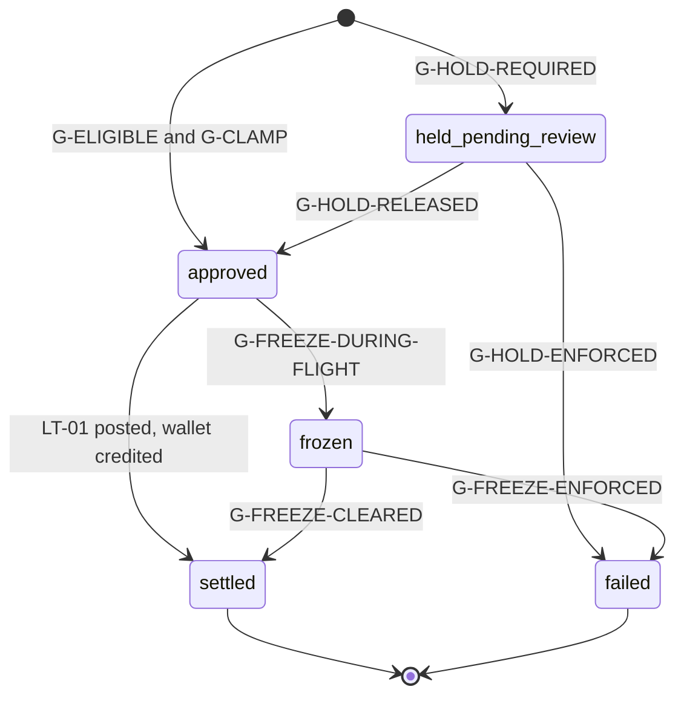

**`held_pending_review` sits BEFORE approval and is not reachable from any other state.** It is entered at request time or not at all, which is what makes it a pre-approval hold rather than a second freeze. The two paths out of it are the only two [ADR-040](../decisions/ADR-040.md) permits, and one of them is on a clock the trader can read.

**This machine carried `transferring` until 2026-08-15, and [ADR-028](../decisions/ADR-028.md) retired that value from `payout_requests` on 2026-08-14.** The enum is `approved, settled, failed, frozen, held_pending_review`; `transferring` is owned by `wallet_withdrawals`, whose machine is **section 3.2**.

> **That pointer said "section 3" and section 3 was `payout_transfers`, a different table with a different enum.** `wallet_withdrawals` had **no drawing anywhere in this document**, which is how [ADR-040](../decisions/ADR-040.md)'s halt came to land on a machine the authoritative drawing did not contain. The correction that retired `transferring` from this machine named where the value went and pointed one table off. Section 3 now holds both legs, as 3.1 and 3.2.

ADR-028 named two sites it corrected, [DATA_MODEL](data-model/README.md)'s second stale index predicate and [M05](../plans/M05-payout-system.md)'s freeze target, and **it missed this drawing, which is the authoritative one.** Corrected under [ADR-040](../decisions/ADR-040.md) on ADR-028's own remedy: `frozen` releases to `settled`, which is what a released freeze does under the wallet, and the three `transferring` transitions with their guards `G-TRANSFER-QUEUED`, `G-SETTLEMENT-CONFIRMED` and `G-TRANSFER-EXHAUSTED` belong to the external leg. **`approved --> settled` carries a ledger fact rather than a guard name, and the absence is deliberate**: under [ADR-019](../decisions/ADR-019.md) the internal leg is one transaction ([M05 section 1.1](../plans/M05-payout-system.md)), so no gate stands between the two states and no guard exists to name. The guard is named when the machine is folded, not invented here.

**There is still no `denied` state, and the review state is now `held_pending_review`.** This paragraph read "no `pending_review` state and no `denied` state" until [ADR-040](../decisions/ADR-040.md), and the half that moved is named rather than quietly deleted:

> **The substance survives.** No payout is denied. Every hold either pays inside 48 hours or produces a documented enforcement action carrying a cited flag, a ToS clause and an evidence pack.
>
> **The mechanism changes.** Zero denial was expressed as "no review state exists". It is now expressed as "a review state exists and it expires". A constraint aimed at the founder's own future self, quietly reinterpreted, is the failure it was built against, so the reinterpretation is recorded as an amendment rather than absorbed as a clarification.

**Ten sites carry the old sentence and two of them can never be edited**: `0001:73` and `0010:77` are `--` comments inside merged migrations and stay as written forever (constitution E2). `0030`'s header carries the amendment in full so a reader arriving from either lands somewhere, and `0031` re-states `0010`'s `COMMENT ON TABLE`, which is replaceable metadata rather than migration text.

A request that satisfies neither G-ELIGIBLE nor G-HOLD-REQUIRED is still never created: the API returns the gate breakdown and emits `payout.blocked`. **The hold is not that path.** A held request is one the engine would have approved, stopped by an unresolved high-severity flag rather than by a gate the trader failed.

**It is not `frozen` under a second name, and the discriminator is whether the ledger has moved.** Both carry a cited flag, both expire, both block settlement; they diverge on the only question that decides behavior.

| | `held_pending_review` | `frozen` |
|---|---|---|
| Entered | at request time, **before** approval | from `approved`, **after** LT-01 posted |
| Ledger | **nothing posted.** No wallet credit, nothing owed | LT-01 posted, `trader_wallet` credited, the money is already the trader's |
| Release means | **approve and pay** | let settlement proceed |
| Enforcement means | close the request. **Nothing to reverse** | LT-03 `payout_reversal` ([M05 section 2.1](../plans/M05-payout-system.md)) |
| Clock | 48 hours, hard | 10 business days proposed, [M05](../plans/M05-payout-system.md) OQ-M5-02 |

**A held request stores the full evaluated decision**, so release is mechanical and re-evaluates nothing. **A held request that reaches auto-release pays even if the account breached during the hold**, because the alternative is that Merit's own hold cost the trader money, which is the exact shape zero denial exists to make impossible.

| State | Meaning | Money moved | Trader sees |
|---|---|---|---|
| `held_pending_review` | An unresolved high-severity flag stood at request time. The decision is computed and stored; **only the posting is deferred** | **none.** Nothing posted, nothing owed | the fact, the ToS clause, and **the date it resolves**. Never worded as a rejection ([M04](../plans/M04-trader-portal.md) copy rule) |
| `approved` | Engine approved instantly; ledger entries posted | withdrawable moved to a payable position | "Approved" with the exact amount |
| `settled` | The internal leg completed: LT-01 posted and the identity's `trader_wallet` credited, in the same transaction | complete | "Paid" with the date. The rail belongs to the external leg |
| `failed` | Enforcement decided on a frozen request, with an exported evidence pack. **Rail exhaustion is not a path here**: it belongs to `wallet_withdrawals` with the rest of the external leg | reversed by compensating entries | honest status plus what happens next |
| `frozen` | Investigation opened after approval, before settlement | held | review status with ToS citation |

| From | To | Guard | Events |
|---|---|---|---|
| (start) | `held_pending_review` | G-HOLD-REQUIRED | `payout.requested`, `payout.held` |
| `held_pending_review` | `approved` | G-HOLD-RELEASED | `payout.hold_released`, `payout.approved`, `ledger.transaction_posted` |
| `held_pending_review` | `failed` | G-HOLD-ENFORCED | `enforcement.applied`, `payout.hold_enforced` |
| (start) | `approved` | G-ELIGIBLE and G-CLAMP | `payout.requested`, `payout.approved`, `ledger.transaction_posted` |
| `approved` | `settled` | **none.** The internal leg is one transaction ([ADR-019](../decisions/ADR-019.md), [M05 section 1.1](../plans/M05-payout-system.md)), so no gate stands between the two states | `payout.settled`, `payout.win_days_reset`, `payout.floor_recomputed`, `ledger.transaction_posted` |
| `approved` | `frozen` | G-FREEZE-DURING-FLIGHT | `identity.payouts_frozen`, `payout.blocked` |
| `frozen` | `settled` | G-FREEZE-CLEARED | `identity.payouts_unfrozen` |
| `frozen` | `failed` | G-FREEZE-ENFORCED | `enforcement.applied`, `payout.transfer_failed` |

**Win-day reset and floor recompute happen on settlement**, which under the wallet is the same transaction as approval, so there is no window in which a trader's progress is spent against a payout that has not landed.

**The 2 to 3 day settlement window is no longer this machine's investigation hook and the hook is not lost, it moved.** It describes the rail, which is the external leg, and the internal leg has no window at all: a freeze opened after wallet credit is halted on `wallet_withdrawals` under [ADR-040](../decisions/ADR-040.md), and a flag standing at request time holds the request **before** approval rather than during a flight that no longer exists. Freezes remain evidence-backed and are never a routine review step.

## 3. The external leg

Two machines, and neither is `payout_requests`. **The internal leg ends at `settled` with the wallet credited; everything below is money that is already the trader's**, which is why nothing here can un-pay it and why a halt on this side resumes the rail rather than re-paying.

### 3.1 Payout transfer (sub-machine)

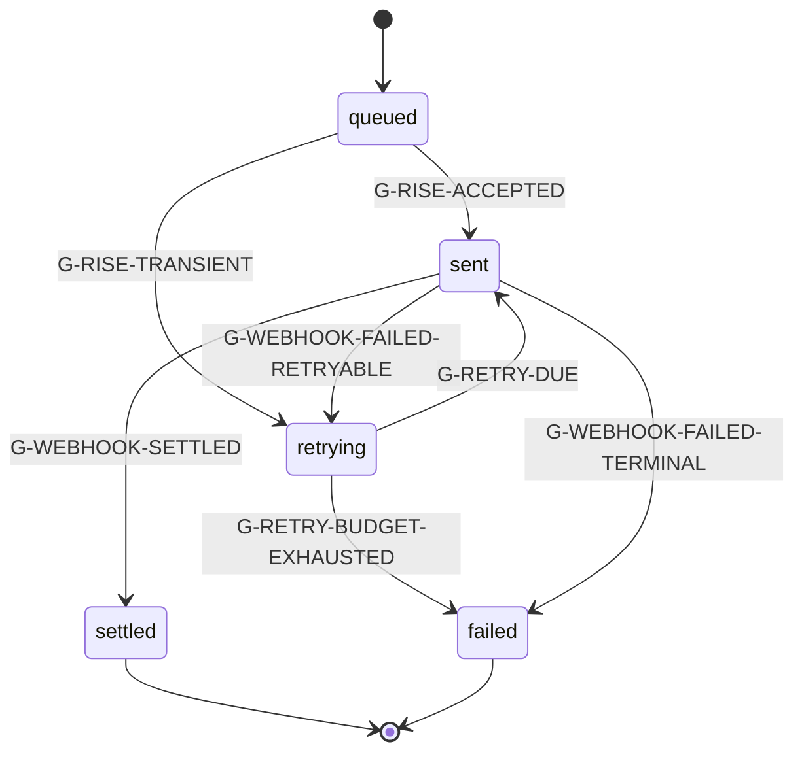

Every transition to `sent` reuses the **same** `idempotency_key`, so a retry after an ambiguous network failure can never double-pay. A replayed settlement webhook (50 times, B4 #8) resolves to exactly one `settled` because the provider event id is uniquely indexed.

### 3.2 Wallet withdrawal, and the halt that is not a state

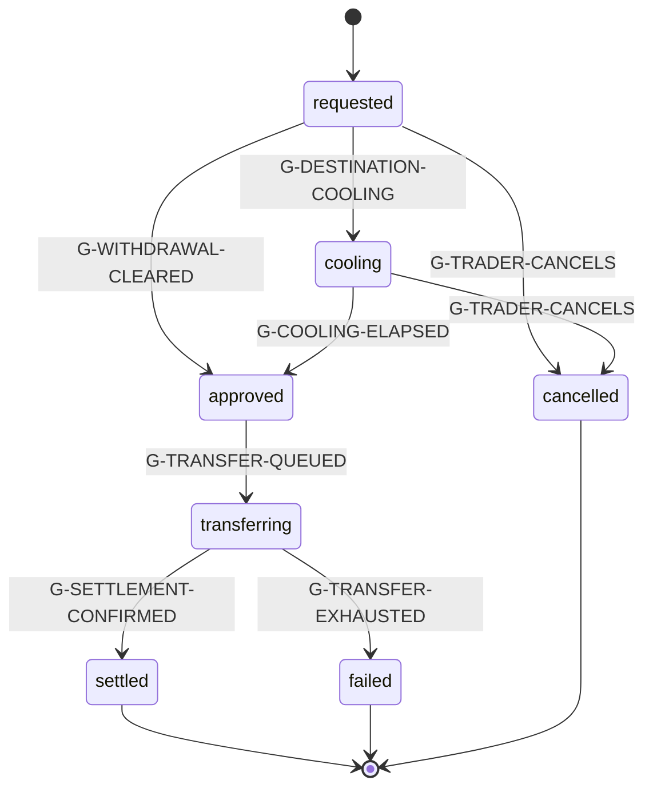

**The halt rides alongside this machine rather than inside it, and the asymmetry with `held_pending_review` is deliberate rather than an oversight.** On `payout_requests` the hold **replaces** approval: it is mutually exclusive with every other status, so it is a status. Here the halt is **orthogonal** to the rail state, because a halted withdrawal is still `approved` or `transferring` as far as the rail is concerned. Collapsing an orthogonal hold into the rail's status column is precisely `SD-M5-06`'s named mistake, where the engine's gates and the rail's gates sharing one column **is** the defect.

So the halt is `frozen_at`, `freeze_flag_id` and `freeze_expires_at` on the row, exactly as `payouts_frozen` and `recon_blocked` ride alongside the account machine in section 1, and it is **enforced by a constraint** rather than by a state: `wallet_withdrawals_live_freeze_blocks_settlement` in [`0031`](../../packages/db/migrations/0031_payout_hold_and_identity_restriction.sql) refuses `settled` while `frozen_at` is non-null.

> **`0011` made this halt representable and left it unenforced for four migrations.** The three freeze columns and a freeze-expiry index existed from `0011`, and `wallet_withdrawal_status` has never had a frozen value: **a halted withdrawal still matched the open index and nothing refused settlement.** Nobody wrote that defect. It arrived by writing half a mechanism and reading the other half as done, which is the failure mode a drawing exists to catch and this drawing did not exist.

The open index is re-created under the same name and the same predicate so a halted row **stays visible** to the operator and to the sweep, because a halt that removes the row from the only index anyone scans is a halt nobody can find. Release resumes the rail; **it does not re-pay**, because the money is already the trader's.

| From | To | Guard | Events |
|---|---|---|---|
| (start) | `requested` | trader requests against a wallet balance | `wallet.withdrawal_requested` |
| `requested` | `cooling` | G-DESTINATION-COOLING | `wallet.withdrawal_cooling` |
| `cooling` / `requested` | `approved` | G-COOLING-ELAPSED / G-WITHDRAWAL-CLEARED | `wallet.withdrawal_approved` |
| `approved` | `transferring` | G-TRANSFER-QUEUED | `wallet.withdrawal_sent` |
| `transferring` | `settled` | G-SETTLEMENT-CONFIRMED | `wallet.withdrawal_settled` |
| `transferring` | `failed` | G-TRANSFER-EXHAUSTED | `wallet.withdrawal_failed` |
| any pre-terminal | (halted in place) | G-WITHDRAWAL-HALTED. **No state change.** The row keeps its rail status and gains its freeze trio | `wallet.withdrawal_halted` |
| (halted) | (resumes in place) | G-WITHDRAWAL-HALT-CLEARED, at expiry or on dismissal | `wallet.withdrawal_halt_cleared` |

**Event names in the last three rows are proposed, not folded.** [EVENTS](EVENTS.md) is session 6's file and no name is claimed by appearing here; the drawing needs a column and the registry is what makes a name real.

## 4. Purchase and provisioning saga

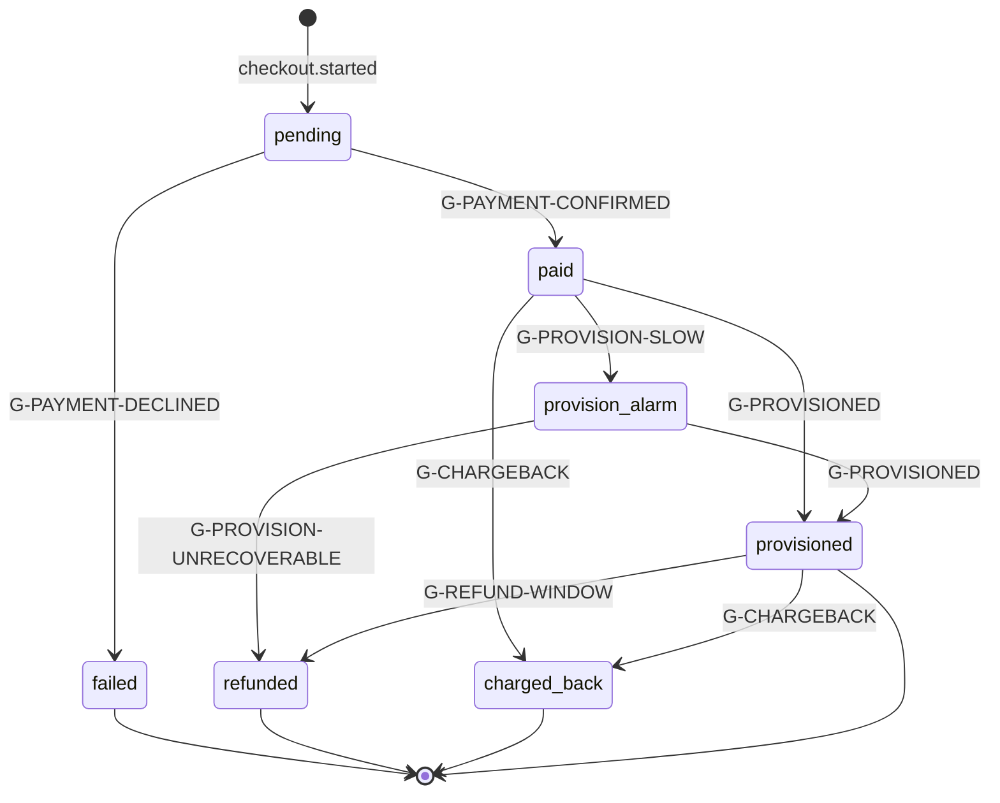

Compensations, explicitly:
- **Payment succeeded, provisioning failed:** `provision_alarm` fires within five minutes, the worker retries with the same idempotent filename, and the account stays visible in admin as a paid-not-provisioned exception until resolved. If unrecoverable, the purchase is refunded in full and the coupon claim released.
- **Coupon claim held, payment failed:** claim released (`coupon.claim_released`), so a failed card does not burn a single-use code.
- **Duplicate or out-of-order PSP webhooks:** the unique index on `(psp, provider_event_id)` makes redelivery a no-op, and a `refund` arriving before its `payment.success` is deferred and re-evaluated rather than applied out of order (B4 #9).

## 5. Provisioning queue item

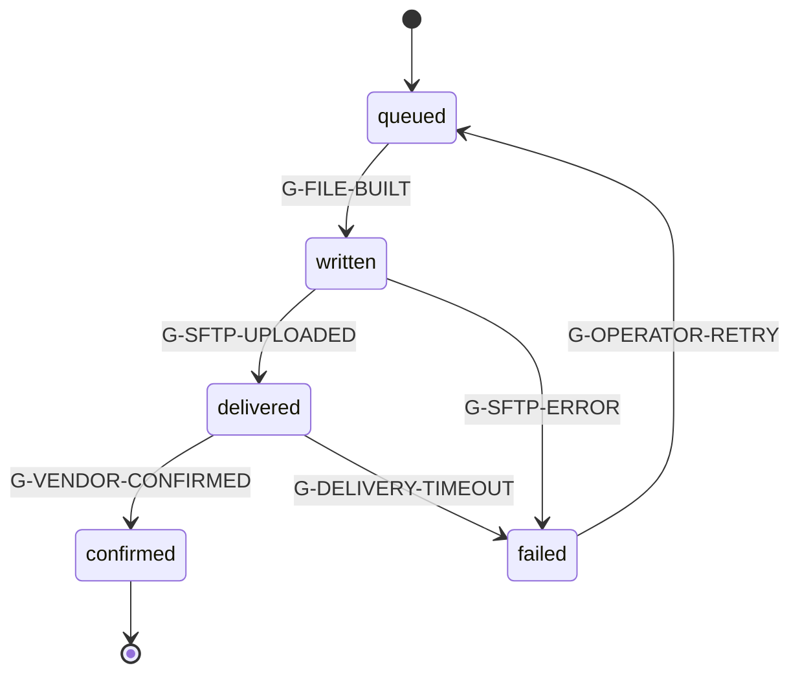

**Provisional ([ADR-005](../decisions/ADR-005.md)):** G-VENDOR-CONFIRMED depends on what Rithmic actually returns as acknowledgement. The design assumes a confirmation artifact (a response file or a next-cycle acknowledgement); if none exists, `delivered` becomes terminal-optimistic and confirmation is inferred from the next EOD report showing the account, which the vendor call must settle.

## 6. Ingest file

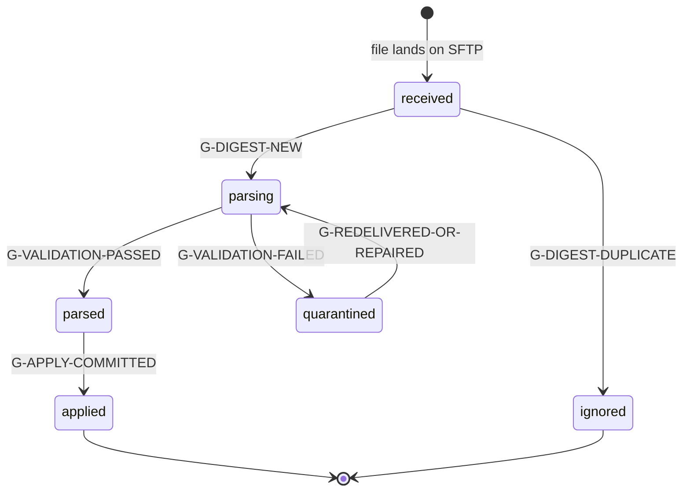

The whole file is one transaction. `quarantined` means **zero** rows were committed, yesterday's state is untouched, and an alert fired (B4 #4). A byte-identical redelivery is `ignored` rather than reprocessed, which is what makes vendor retries safe.

## 7. Risk flag

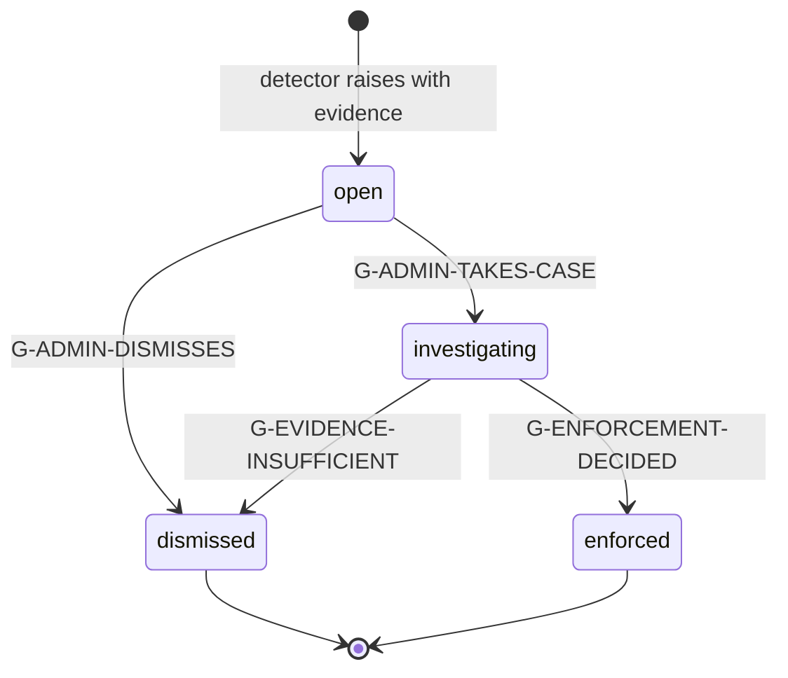

Binding: **no automatic transition into `enforced`.** Detectors only ever produce `open`. Entering `investigating` is what sets `payouts_frozen`, and it requires a written reason and a ToS clause. Entering `enforced` requires an exported [evidence pack](../GLOSSARY.md#evidence-pack) id on the transition.

## 8. Identity KYC

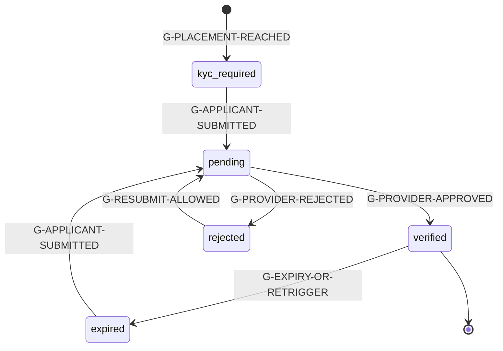

Placement is configuration, not code: `pre_eval` requires verification at purchase, `pre_funded` at eval pass, and Direct plans always verify at purchase because funding is immediate. Re-verification triggers (moving `verified` to `expired`): payout-destination change (with the 48 hour cooling window), an open severity 4+ flag, dormant-account reactivation, and provider-side document expiry.

A `kyc.dedupe_hit` does not itself change this machine. It raises a flag against both identities, because a biometric match is evidence about a human, not a verification failure.

## 9. Identity status and plan version (small machines)

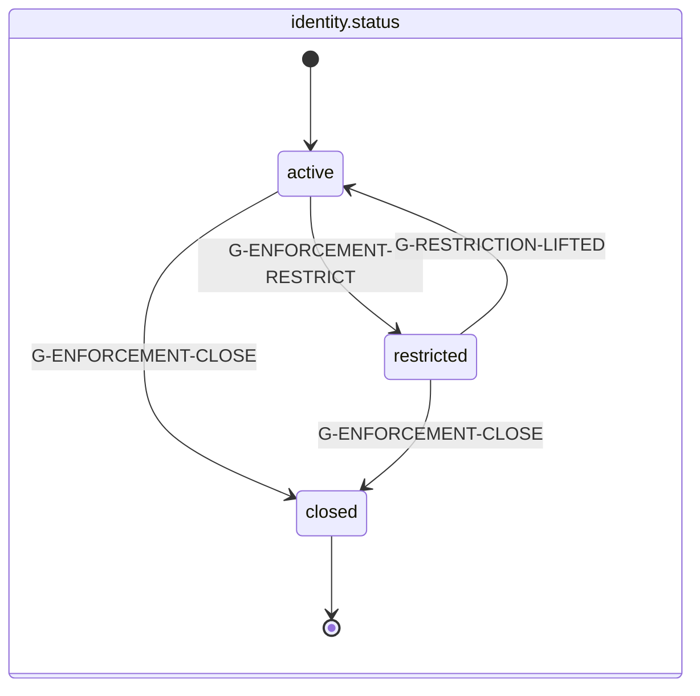

**`restricted` was already here, already reversible, already a distinct third value, and already on the trader's own `GET /me`. What was missing was never the state: it was the binding surface and the record** ([ADR-041](../decisions/ADR-041.md)). It is **not** renamed to `suspended`, because two expressions of one concept is this repository's most repeated defect and adding a second word for a state that exists would create one deliberately.

Distinct from its two neighbours: **closure for cause is terminal and per account; a freeze is per payment and expires; a restriction is per human, halts everything, and is reversed by a documented restore.**

**The transition is a row, not a column write.** `identities` carries `status` and `status_reason` and nothing else, while `accounts` has had `account_status_history` since `0007`, so a repeat restriction would overwrite its predecessor and **a restore would be unprovable at exactly the moment it is contested**. Each traversal of `active --> restricted` opens an [`identity_restriction_episodes`](data-model/identity_restriction_episodes.md) row (`0031`), and each traversal back closes it with its actor and its evidence. A partial unique gives at most one open episode per identity; a restore frees it, so the same human can be restricted again with the earlier episode intact.

**What the restriction binds, enumerated once rather than left to the word.** It is a layer over the account machine exactly as `payouts_frozen` and `recon_blocked` are in section 1: **no account status moves, no ladder rung is consumed, no entitlement history is rewritten.**

| Surface | Behavior |
|---|---|
| Purchases and resets | refused at checkout, **server side**, joining `geo_restricted` and `account_cap_reached` |
| Payout requests | blocked. **G-ELIGIBLE gains the identity status**, which it did not name before |
| Wallet spend and external withdrawal | blocked ([M20](../plans/M20-wallet.md) INV-M20-06) |
| Affiliate settlement | blocked. [ADR-017](../decisions/ADR-017.md) put every outbound payment on one rail, and **a restriction that stops one door and not the other is not a restriction** |
| Platform trading | revoked through the Rithmic bridge. **PROVISIONAL** under [ADR-005](../decisions/ADR-005.md), and the honest form is an asymmetry: suspension is always available, **restoration is contingent on `V-M2-15`** |
| Account state | **preserved intact** |

**The 48 hour SLA binds the restriction rather than the payout, and that is the property that stops Ruling B from becoming a route around Ruling A.** A restriction cannot hold a held payout past its own 48 hours.

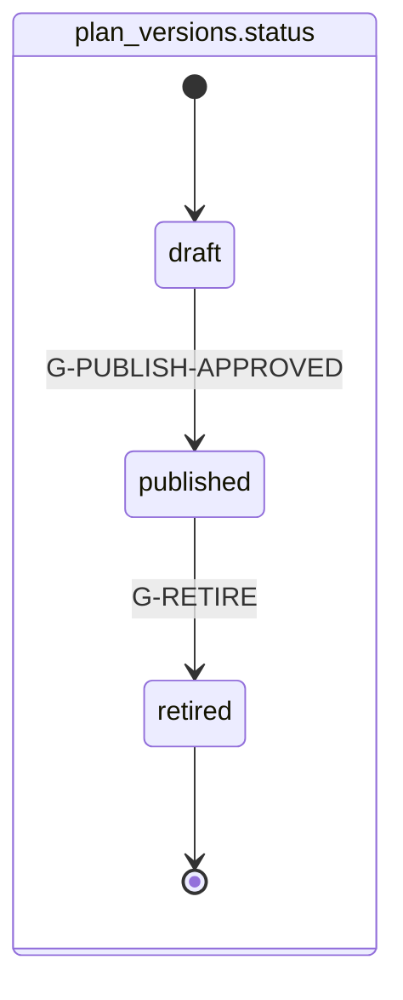

`published` is immutable (database trigger). Retiring stops new sales and touches **no** live account: every account keeps the version it was sold under, forever. This is the mechanism behind the promise the market does not make (see [TOP10_FIRMS](../../research/TOP10_FIRMS.md) gap 4).

## 10. Guard definitions

Each guard is evaluated against the [last closed day](../GLOSSARY.md#last-closed-day) unless stated otherwise. `pv` is the account's pinned plan version, `ps` its materialized size row.

| Guard | Condition |
|---|---|
| **G-PROVISIONED** | Vendor confirmation received for all required operations (`create_user`, `create_account`, `set_risk`, `set_entitlement`, `set_permissions`) for this account |
| **G-PROVISION-ABANDONED** | Provisioning unrecoverable after retry budget, and the purchase has been refunded |
| **G-PROVISION-SLOW** | `now() - purchase.paid_at > 5 minutes` and account still `provisioning_pending` |
| **G-BREACH** | `daily_marks.low_balance_cents < rule_states.floor_cents` (strict `<`), **or** `pv.daily_loss_limit.type = 'hard'` and `-realized_pnl_cents > ps.daily_loss_limit_cents` (**strict `>`, amended at the M1 gate**, OQ-6: exactly at the limit survives, matching the floor comparison, published as "more than"). The floor compared against is the floor **at the open of the day**, meaning the value carried by the previous closed day's rule state; trailing to a new high happens after the breach check, never before it. See the [auto-liquidation setpoint](../GLOSSARY.md#auto-liquidation-setpoint): the setpoint sits at that same floor, so a clean liquidation lands exactly on it and survives, and slippage below it breaches |
| **G-EVAL-PASS** | not G-BREACH on this day, **and** `closing_balance_cents - opening_balance_at_start_cents >= ps.profit_target_cents`, **and** `traded_days_count >= pv.phase_eval.min_trading_days`, **and** (`pv.phase_eval.consistency.enabled = false` **or** G-CONSISTENCY-OK) |
| **G-EVAL-DEFERRED** | Target and min days satisfied, but `pv.phase_eval.consistency.enabled = true` and not G-CONSISTENCY-OK. The account keeps trading; it never fails for this |
| **G-CONSISTENCY-OK** | `period_profit_cents <= 0` (gate skipped, the [denominator rule](../GLOSSARY.md#consistency-denominator-rule)) **or** `best_day_cents * 10000 <= max_day_share_bp * period_profit_cents` (integer arithmetic, no division, no float) |
| **G-DAY-CLOSED** | A mark exists for the account for this trading day and rule state has advanced |
| **G-EXPIRED** | `pv.phase_eval.max_days` is not null and elapsed trading days exceed it (unreachable in v1: all plans configure null) |
| **G-LADDER-COMPLETE** | `payouts_settled_count >= pv.phase_funded.ladder.payouts_to_graduate` evaluated **after** a settlement |
| **G-CHARGEBACK** | A `purchase.charged_back` fact exists for the account's purchase |
| **G-ADMIN-CLOSE** | Admin action with reason, plus an evidence pack id when the close is an enforcement |
| **G-ELIGIBLE** | All of: account `active` and phase `funded`; **`identities.status = 'active'`** ([ADR-041](../decisions/ADR-041.md); this guard named `payouts_frozen` and **not** the identity status, so a restricted human could still request a payout, which is the binding gap Ruling B was ruled against); `not payouts_frozen` (account and identity); `not recon_blocked`; KYC state `verified`; `traded_days_count >= pv.min_trading_days`; `win_days_count >= pv.win_days.required_count`; `withdrawable_cents > 0`; G-CONSISTENCY-OK; `trading_days_since_last_settled_payout >= pv.cadence_gap_trading_days` (no gap requirement on the first payout); G-NO-IN-FLIGHT; `min(withdrawable, cap) >= pv.min_payout_cents` |
| **G-CLAMP** | `approved_cents = min(effective_request_cents, withdrawable_cents, cap_cents_for_ordinal)` and `approved_cents >= min_payout_cents`, where `effective_request_cents` is the caller's optional `amount_cents` or, when omitted, `min(withdrawable_cents, cap_cents_for_ordinal)` ([ADR-009](../decisions/ADR-009.md)) |
| **G-NO-IN-FLIGHT** | No `payout_requests` row for this account in status `approved`, `frozen`, or `held_pending_review`. Part of G-ELIGIBLE. It is a liability control, not a convenience: win days and the consistency period reset on settlement, so concurrent requests would let one qualifying stretch fund several capped extractions. **This guard read `approved`, `transferring`, `frozen` until [ADR-040](../decisions/ADR-040.md)**, naming a value [ADR-028](../decisions/ADR-028.md) had retired from the table and omitting the one that replaced it, so it is one of the four sites that correction named and did not reach. **It is written here exactly as `payout_requests_no_in_flight_uq`'s predicate**, because the database enforces it too and a guard that disagrees with its own index is a gate that holds on Tuesdays |
| **G-TRANSFER-QUEUED** | Ledger transaction for the approval committed, and a transfer row created with a fresh idempotency key |
| **G-RISE-ACCEPTED** / **G-RISE-TRANSIENT** | Provider accepted the transfer / returned a retryable error |
| **G-WEBHOOK-SETTLED** | Signature-verified settlement webhook, within the replay window, matching an existing transfer by provider transfer id |
| **G-WEBHOOK-FAILED-RETRYABLE / TERMINAL** | Provider failure classified retryable or terminal |
| **G-RETRY-DUE** | Backoff elapsed and attempts below budget |
| **G-RETRY-BUDGET-EXHAUSTED** | Attempts at budget; operations paged |
| **G-FREEZE-DURING-FLIGHT** | An investigation opened (flag moved to `investigating`) while the payout was `approved`. **This guard read "`approved` or `transferring`" until [ADR-040](../decisions/ADR-040.md)**, the second of the four sites [ADR-028](../decisions/ADR-028.md) named and did not reach. A `payout_requests` row is never `transferring`; the equivalent halt on the external leg is **G-WITHDRAWAL-HALTED**, section 3.2, and it is not a state |
| **G-FREEZE-CLEARED / G-FREEZE-ENFORCED** | Investigation dismissed / enforcement decided with an evidence pack |
| **G-HOLD-REQUIRED** | Every other clause of G-ELIGIBLE is satisfied **and** an unresolved high-severity flag stands against the identity at request time. The decision is computed and stored in full; only the posting is deferred. **It is not a gate failure**: a request failing G-ELIGIBLE is never created at all ([ADR-040](../decisions/ADR-040.md)) |
| **G-HOLD-RELEASED** | The flag resolved without enforcement, **or** `now() >= hold_expires_at`. The hard 48 hour clock, and **the second disjunct is the whole control**: a hold with a cited flag but no expiry is an indefinite hold, which is a denial with extra steps. Release re-evaluates nothing and **pays even if the account breached during the hold**, because the alternative is that Merit's own hold cost the trader money |
| **G-HOLD-ENFORCED** | Enforcement decided **inside** the 48 hours, with a cited flag, a ToS clause and an exported evidence pack. Sends the request to `failed`, which **frees the ordinal** (EC-037): a hold must not consume a ladder rung |
| **G-WITHDRAWAL-HALTED / G-WITHDRAWAL-HALT-CLEARED** | An investigation opened against a wallet withdrawal already past approval / it was dismissed or the 48 hours elapsed. **Neither changes the rail status**, section 3.2 |
| **G-DESTINATION-COOLING / G-COOLING-ELAPSED** | Destination changed inside the 48 hour cooling window ([ADR-017](../decisions/ADR-017.md)) / the window elapsed |
| **G-WITHDRAWAL-CLEARED** | KYC `verified`, destination outside its cooling window, provenance summary present, and the identity **not `restricted`** |
| **G-TRADER-CANCELS** | The trader withdrew the request before it reached the rail |
| **G-SETTLEMENT-CONFIRMED / G-TRANSFER-EXHAUSTED** | Signature-verified settlement webhook / retry budget spent, operations paged |
| **G-ENFORCEMENT-RESTRICT** | Admin action from a flag at `investigating` or `enforced`, carrying a cited `risk_flags` id, a ToS clause and a written reason, opening an [`identity_restriction_episodes`](data-model/identity_restriction_episodes.md) row. **Named by section 9 since this document was written and defined nowhere until [ADR-041](../decisions/ADR-041.md)**, which is the defect §10's own opening sentence exists to prevent |
| **G-RESTRICTION-LIFTED** | A documented restore: the restoring actor and the restore evidence, both required by `identity_restriction_restore_is_complete`. On the platform leg, `set_risk` at the account's current floor **confirmed first**, then entitlement, then permissions, because re-enabling an entitlement against an unconfirmed setpoint is an unenforced funded account (INV-M2-13). **PROVISIONAL on `V-M2-15`** |
| **G-DIGEST-NEW / G-DIGEST-DUPLICATE** | `sha256` unseen / already present in `ingest_files` |
| **G-VALIDATION-PASSED / FAILED** | Every row parses, account refs resolve, totals internally consistent / any failure at all |
| **G-APPLY-COMMITTED** | Fills, marks, and rule states committed for every account in the file, in one transaction per account |
| **G-PLACEMENT-REACHED** | Config placement condition met: purchase (pre_eval or Direct) or eval pass (pre_funded) |
| **G-PROVIDER-APPROVED / REJECTED** | Signature-verified provider webhook |
| **G-EXPIRY-OR-RETRIGGER** | Document expiry, payout-destination change, severity 4+ open flag, or dormant reactivation |
| **G-PUBLISH-APPROVED** | Founder-approved publish; materializes `plan_version_sizes` in the same transaction |

## 11. Cross-machine scenarios (the ones that bite)

| Scenario | Resolution |
|---|---|
| Breach and eval pass on the same day (B4 ordering) | Breach wins; account closes; no `phase.passed` |
| Trader passes eval while payout-frozen (B4 #15) | Progression continues normally; `phase.passed` fires; payouts stay gated; the freeze comms template fires |
| Payout request at 23:59:59, batch at 00:05 (B4 #6) | Both evaluate against the same last closed day; the request is unaffected by the in-flight batch |
| Two accounts, same identity, payout in the same second (B4 #7) | Both valid and independent; row-level locks per account; admin sees identity-level aggregate exposure |
| Correction changes a settled payout's basis (B4 #5) | Never clawed back. New mark supersedes, replay recomputes forward, `ingest.correction_received` fires, a flag is raised for review, the difference is absorbed |
| Chargeback after a settled payout (B4 #10) | Account to `closed_chargeback`, identity flagged, ledger reversal posted, identity nets negative and the books say so |
| Identity merge after both identities were funded (B4 #17) | Existing accounts grandfathered, new purchases blocked at the cap, `identity.merged` records `accounts_at_merge` |
| Plan v2 published while a checkout is open on v1 (B4 #12) | The purchase pins the version resolved at checkout start; v1 is honored and provable |
| Batch crashes at account 2,341 of 5,000 (B4 #18) | Per-account transactions plus a cursor make the run resumable with no double-applied day |
| **A restriction opens while a payout is held** | The restriction's own `sla_due_at` carries the 48 hours, and **the payout's `hold_expires_at` is unchanged**. At expiry the hold releases and pays whether or not the restriction is still open. This is the property that stops Ruling B becoming a route around Ruling A, and it is a golden scenario rather than a paragraph |
| **The account breaches while its payout is held** | The hold releases at expiry and **pays**. INV-M5-09's first clause governs (the snapshot was true when it was taken); its second ("the money was already the trader's") does not apply, because nothing was posted. The alternative is that Merit's own hold cost the trader money |
| **Enforcement lands on a held request** | To `failed`, which **frees the ordinal** under `payout_requests_account_ordinal_uq`'s partial predicate. A hold that consumed a rung would silently shorten a finite ladder (5 / 5 / 4) |
| **A restriction is lifted while the platform leg cannot confirm** | The restore **does not complete**. `set_risk` must reach `confirmed` before entitlement, and `0007` makes `confirmed_inferred` unwritable for that operation. Under INV-M2-13 an unconfirmed account does not trade, so the honest statement is the asymmetry: **suspension is always available, restoration is contingent on `V-M2-15`** |
| **The hourly sweep stalls with holds outstanding** | The **S1 dead-man switch** fires, and separately the **nightly assertion on the query** fires: no request may sit past its hold expiry, evaluated independently of whether the sweep reported success. A job that reports success is not evidence that the work happened ([M02](../plans/M02-rithmic-bridge.md) FM-M2-11's idiom applied to the releaser) |
