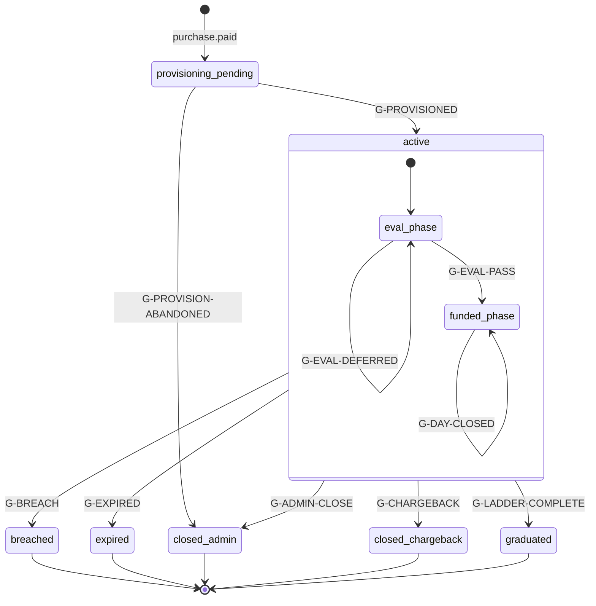
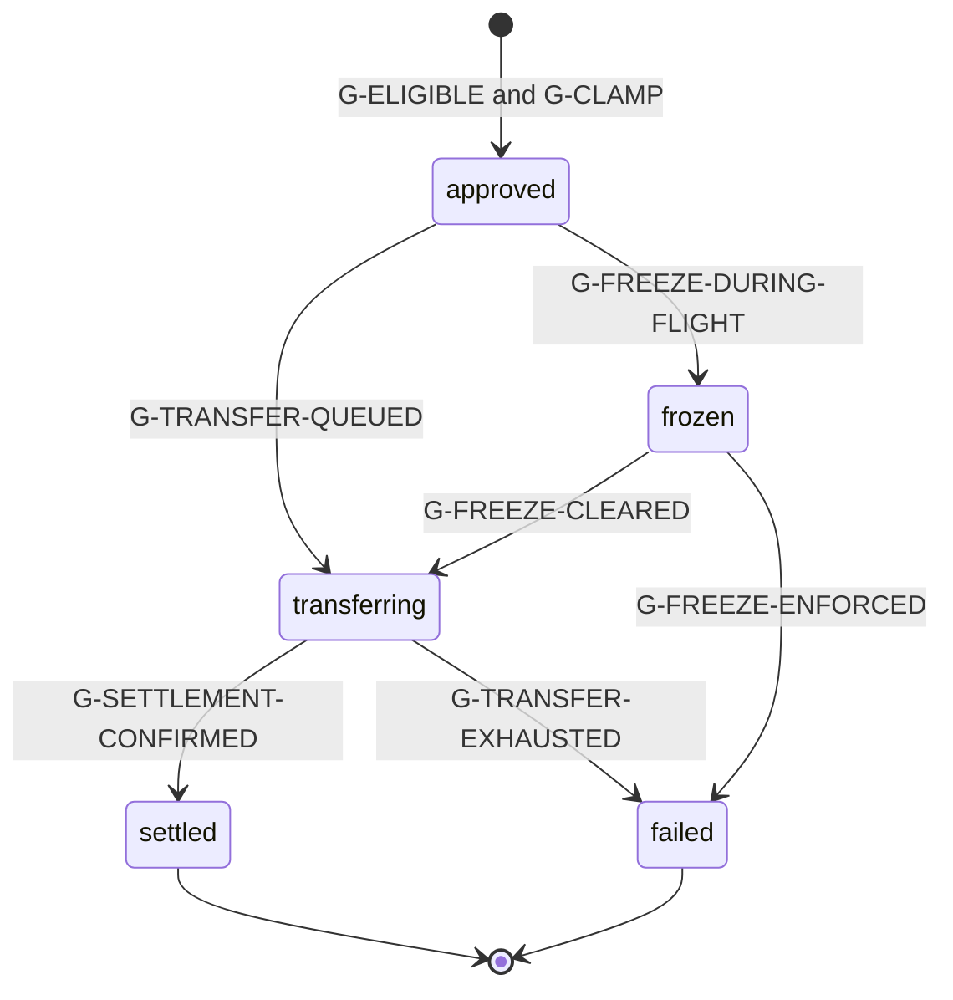
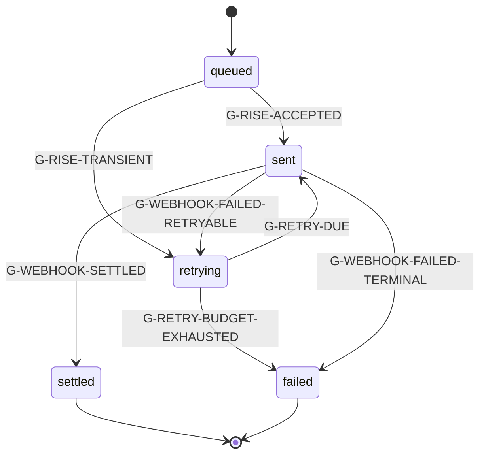
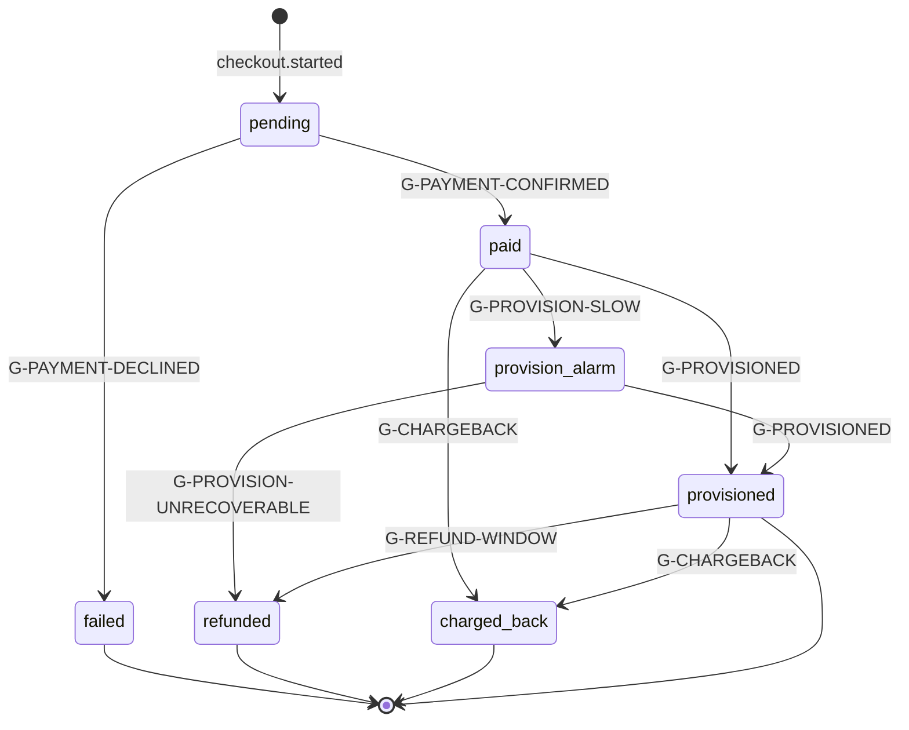
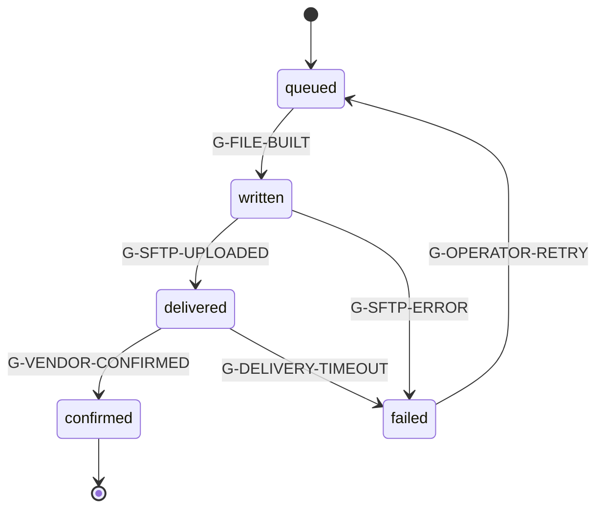
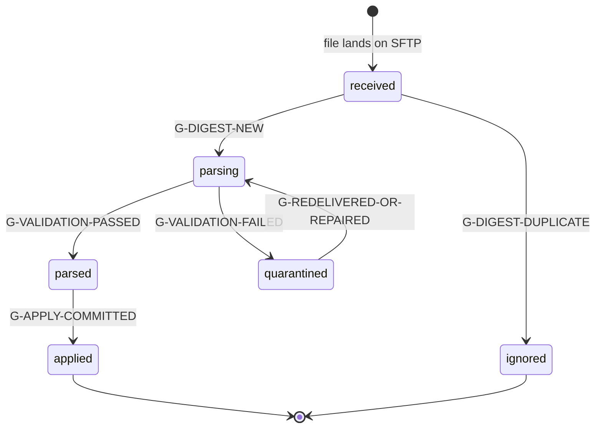
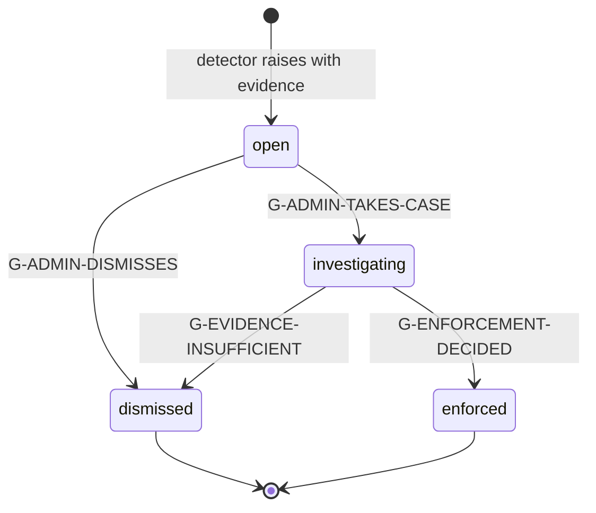
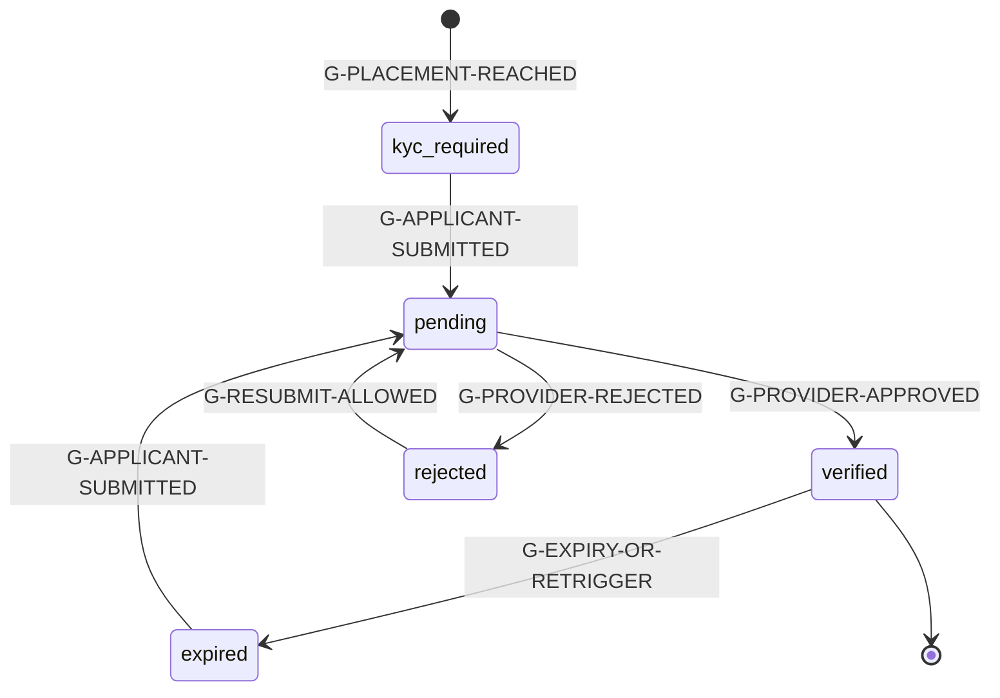
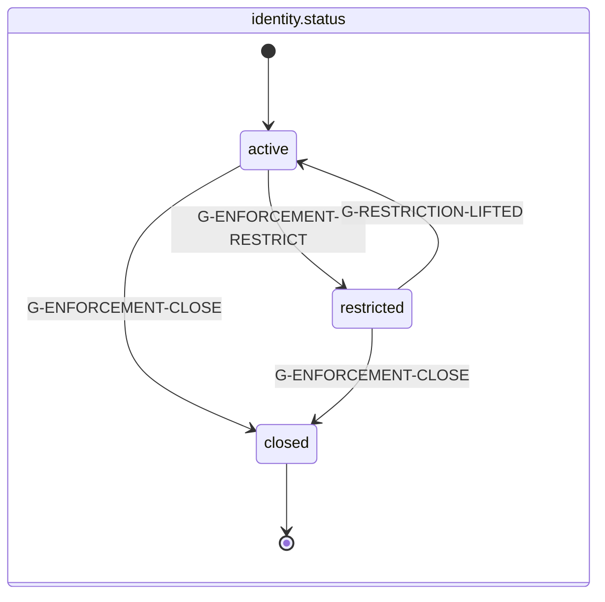
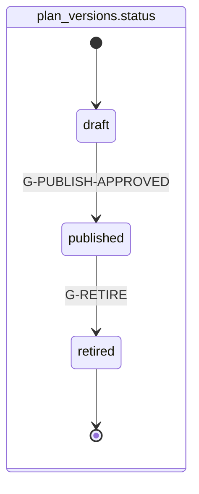

# State Machines (Constitution B5 §3)

Every lifecycle in the system: states, transitions, and the exact guard on each transition. Guards are named (`G-*`) and defined once in §10 so the same condition is never written twice. Events emitted on transition are named from [EVENTS.md](EVENTS.md); terms from [GLOSSARY.md](../GLOSSARY.md).

**Universal rules for every machine below:**
1. A transition happens in one database transaction with its event write. No event without the fact, no fact without the event.
2. Transitions not drawn here do not exist. Anything else is a bug, and the engine rejects it rather than coercing it.
3. Every machine's terminal states are terminal. Nothing resurrects an account, a payout, or a purchase; a new one is created instead.

## 1. Account lifecycle

`accounts.status` is the operational machine; `accounts.phase` is annotated on the states because the two must move together and the pair is what traders see.

| State | Phase | Meaning | Trader can trade | Payout reachable |
|---|---|---|---|---|
| `provisioning_pending` | eval or funded | Paid, not yet live on the platform | no | no |
| `active` (eval) | `eval` | Working toward the target | yes | no |
| `active` (funded) | `funded` | Post-pass, gates accumulating | yes | when [eligible](../GLOSSARY.md#eligibility) |
| `breached` | `closed` | Terminal rule violation | no | no |
| `expired` | `closed` | Eval time limit reached (v1 unlimited, so unreachable by config) | no | no |
| `closed_admin` | `closed` | Enforcement or trader request | no | no |
| `closed_chargeback` | `closed` | Payment disputed | no | no |
| `graduated` | `graduated` | Ladder complete, live invitation issued | no | no (account is done) |

Transition detail:

| From | To | Guard | Events emitted |
|---|---|---|---|
| `provisioning_pending` | `active` | G-PROVISIONED | `account.provisioned` |
| `provisioning_pending` | `closed_admin` | G-PROVISION-ABANDONED | `account.provision_failed`, `account.closed` |
| eval | funded | G-EVAL-PASS | `phase.passed` |
| eval | eval | G-EVAL-DEFERRED | `phase.pass_deferred_consistency` |
| `active` | `breached` | G-BREACH | `breach.detected`, `account.closed` |
| `active` | `closed_chargeback` | G-CHARGEBACK | `purchase.charged_back`, `account.closed`, `ledger.transaction_posted` |
| `active` | `closed_admin` | G-ADMIN-CLOSE | `enforcement.applied` (when enforcement), `account.closed` |
| `active` | `graduated` | G-LADDER-COMPLETE | `account.graduated`, `account.live_invitation_issued` |

**Ordering law (binding).** Within a trading day the batch evaluates: ingest, then G-BREACH, then progression (G-EVAL-PASS or funded-day advance). If G-BREACH and G-EVAL-PASS are both satisfiable on the same day, breach wins and the account closes.

**Two orthogonal blockers** ride alongside this machine rather than inside it, because they gate payouts without changing the account's lifecycle: `payouts_frozen` (investigation) and `recon_blocked` (unresolved [reconciliation](../GLOSSARY.md#reconciliation)). An account can be `active`/`funded` and blocked from payouts by either; both are visible to the trader with a reason.

## 2. Payout request

There is **no `pending_review` state and no `denied` state.** A request that does not satisfy G-ELIGIBLE is never created: the API returns the gate breakdown and emits `payout.blocked`, so the machine only ever starts from an approved fact.

| State | Meaning | Money moved | Trader sees |
|---|---|---|---|
| `approved` | Engine approved instantly; ledger entries posted | withdrawable moved to a payable position | "Approved" with the exact amount |
| `transferring` | Rise transfer queued or sent | funds in flight | "Sending, 2 to 3 business days" |
| `settled` | Settlement webhook confirmed | complete | "Paid" with the rail and date |
| `failed` | Retries exhausted, or enforcement during flight | reversed by compensating entries | honest status plus what happens next |
| `frozen` | Investigation opened after approval, before settlement | held | review status with ToS citation |

| From | To | Guard | Events |
|---|---|---|---|
| (start) | `approved` | G-ELIGIBLE and G-CLAMP | `payout.requested`, `payout.approved`, `ledger.transaction_posted` |
| `approved` | `transferring` | G-TRANSFER-QUEUED | `payout.transfer_queued`, `payout.transfer_sent` |
| `transferring` | `settled` | G-SETTLEMENT-CONFIRMED | `payout.settled`, `payout.win_days_reset`, `payout.floor_recomputed`, `ledger.transaction_posted` |
| `transferring` | `failed` | G-TRANSFER-EXHAUSTED | `payout.transfer_failed`, `ledger.transaction_posted` (reversal) |
| `approved` | `frozen` | G-FREEZE-DURING-FLIGHT | `identity.payouts_frozen`, `payout.blocked` |
| `frozen` | `transferring` | G-FREEZE-CLEARED | `identity.payouts_unfrozen` |
| `frozen` | `failed` | G-FREEZE-ENFORCED | `enforcement.applied`, `payout.transfer_failed` |

**The 2 to 3 day settlement window is the only investigation hook**, and it is used exclusively for freezes opened before or during flight on evidence, never as a routine review step. Win-day reset and floor recompute happen on **settlement**, not on approval, so a failed transfer does not cost the trader their progress.

## 3. Payout transfer (sub-machine)

Every transition to `sent` reuses the **same** `idempotency_key`, so a retry after an ambiguous network failure can never double-pay. A replayed settlement webhook (50 times, B4 #8) resolves to exactly one `settled` because the provider event id is uniquely indexed.

## 4. Purchase and provisioning saga

Compensations, explicitly:
- **Payment succeeded, provisioning failed:** `provision_alarm` fires within five minutes, the worker retries with the same idempotent filename, and the account stays visible in admin as a paid-not-provisioned exception until resolved. If unrecoverable, the purchase is refunded in full and the coupon claim released.
- **Coupon claim held, payment failed:** claim released (`coupon.claim_released`), so a failed card does not burn a single-use code.
- **Duplicate or out-of-order PSP webhooks:** the unique index on `(psp, provider_event_id)` makes redelivery a no-op, and a `refund` arriving before its `payment.success` is deferred and re-evaluated rather than applied out of order (B4 #9).

## 5. Provisioning queue item

**Provisional ([ADR-005](../DECISIONS.md)):** G-VENDOR-CONFIRMED depends on what Rithmic actually returns as acknowledgement. The design assumes a confirmation artifact (a response file or a next-cycle acknowledgement); if none exists, `delivered` becomes terminal-optimistic and confirmation is inferred from the next EOD report showing the account, which the vendor call must settle.

## 6. Ingest file

The whole file is one transaction. `quarantined` means **zero** rows were committed, yesterday's state is untouched, and an alert fired (B4 #4). A byte-identical redelivery is `ignored` rather than reprocessed, which is what makes vendor retries safe.

## 7. Risk flag

Binding: **no automatic transition into `enforced`.** Detectors only ever produce `open`. Entering `investigating` is what sets `payouts_frozen`, and it requires a written reason and a ToS clause. Entering `enforced` requires an exported [evidence pack](../GLOSSARY.md#evidence-pack) id on the transition.

## 8. Identity KYC

Placement is configuration, not code: `pre_eval` requires verification at purchase, `pre_funded` at eval pass, and Direct plans always verify at purchase because funding is immediate. Re-verification triggers (moving `verified` to `expired`): payout-destination change (with the 48 hour cooling window), an open severity 4+ flag, dormant-account reactivation, and provider-side document expiry.

A `kyc.dedupe_hit` does not itself change this machine. It raises a flag against both identities, because a biometric match is evidence about a human, not a verification failure.

## 9. Identity status and plan version (small machines)

`published` is immutable (database trigger). Retiring stops new sales and touches **no** live account: every account keeps the version it was sold under, forever. This is the mechanism behind the promise the market does not make (see [TOP10_FIRMS](../../research/TOP10_FIRMS.md) gap 4).

## 10. Guard definitions

Each guard is evaluated against the [last closed day](../GLOSSARY.md#last-closed-day) unless stated otherwise. `pv` is the account's pinned plan version, `ps` its materialized size row.

| Guard | Condition |
|---|---|
| **G-PROVISIONED** | Vendor confirmation received for all required operations (`create_user`, `create_account`, `set_risk`, `set_entitlement`, `set_permissions`) for this account |
| **G-PROVISION-ABANDONED** | Provisioning unrecoverable after retry budget, and the purchase has been refunded |
| **G-PROVISION-SLOW** | `now() - purchase.paid_at > 5 minutes` and account still `provisioning_pending` |
| **G-BREACH** | `daily_marks.low_balance_cents < rule_states.floor_cents` (strict `<`), **or** `pv.daily_loss_limit.type = 'hard'` and `-realized_pnl_cents > ps.daily_loss_limit_cents` (**strict `>`, amended at the M1 gate**, OQ-6: exactly at the limit survives, matching the floor comparison, published as "more than"). The floor compared against is the floor **at the open of the day**, meaning the value carried by the previous closed day's rule state; trailing to a new high happens after the breach check, never before it. See the [auto-liquidation setpoint](../GLOSSARY.md#auto-liquidation-setpoint): the setpoint sits at that same floor, so a clean liquidation lands exactly on it and survives, and slippage below it breaches |
| **G-EVAL-PASS** | not G-BREACH on this day, **and** `closing_balance_cents - opening_balance_at_start_cents >= ps.profit_target_cents`, **and** `traded_days_count >= pv.phase_eval.min_trading_days`, **and** (`pv.phase_eval.consistency.enabled = false` **or** G-CONSISTENCY-OK) |
| **G-EVAL-DEFERRED** | Target and min days satisfied, but `pv.phase_eval.consistency.enabled = true` and not G-CONSISTENCY-OK. The account keeps trading; it never fails for this |
| **G-CONSISTENCY-OK** | `period_profit_cents <= 0` (gate skipped, the [denominator rule](../GLOSSARY.md#consistency-denominator-rule)) **or** `best_day_cents * 10000 <= max_day_share_bp * period_profit_cents` (integer arithmetic, no division, no float) |
| **G-DAY-CLOSED** | A mark exists for the account for this trading day and rule state has advanced |
| **G-EXPIRED** | `pv.phase_eval.max_days` is not null and elapsed trading days exceed it (unreachable in v1: all plans configure null) |
| **G-LADDER-COMPLETE** | `payouts_settled_count >= pv.phase_funded.ladder.payouts_to_graduate` evaluated **after** a settlement |
| **G-CHARGEBACK** | A `purchase.charged_back` fact exists for the account's purchase |
| **G-ADMIN-CLOSE** | Admin action with reason, plus an evidence pack id when the close is an enforcement |
| **G-ELIGIBLE** | All of: account `active` and phase `funded`; `not payouts_frozen` (account and identity); `not recon_blocked`; KYC state `verified`; `traded_days_count >= pv.min_trading_days`; `win_days_count >= pv.win_days.required_count`; `withdrawable_cents > 0`; G-CONSISTENCY-OK; `trading_days_since_last_settled_payout >= pv.cadence_gap_trading_days` (no gap requirement on the first payout); G-NO-IN-FLIGHT; `min(withdrawable, cap) >= pv.min_payout_cents` |
| **G-CLAMP** | `approved_cents = min(effective_request_cents, withdrawable_cents, cap_cents_for_ordinal)` and `approved_cents >= min_payout_cents`, where `effective_request_cents` is the caller's optional `amount_cents` or, when omitted, `min(withdrawable_cents, cap_cents_for_ordinal)` ([ADR-009](../DECISIONS.md)) |
| **G-NO-IN-FLIGHT** | No `payout_requests` row for this account in status `approved`, `transferring`, or `frozen`. Part of G-ELIGIBLE. It is a liability control, not a convenience: win days and the consistency period reset on settlement, so concurrent requests would let one qualifying stretch fund several capped extractions |
| **G-TRANSFER-QUEUED** | Ledger transaction for the approval committed, and a transfer row created with a fresh idempotency key |
| **G-RISE-ACCEPTED** / **G-RISE-TRANSIENT** | Provider accepted the transfer / returned a retryable error |
| **G-WEBHOOK-SETTLED** | Signature-verified settlement webhook, within the replay window, matching an existing transfer by provider transfer id |
| **G-WEBHOOK-FAILED-RETRYABLE / TERMINAL** | Provider failure classified retryable or terminal |
| **G-RETRY-DUE** | Backoff elapsed and attempts below budget |
| **G-RETRY-BUDGET-EXHAUSTED** | Attempts at budget; operations paged |
| **G-FREEZE-DURING-FLIGHT** | An investigation opened (flag moved to `investigating`) while the payout was `approved` or `transferring` |
| **G-FREEZE-CLEARED / G-FREEZE-ENFORCED** | Investigation dismissed / enforcement decided with an evidence pack |
| **G-DIGEST-NEW / G-DIGEST-DUPLICATE** | `sha256` unseen / already present in `ingest_files` |
| **G-VALIDATION-PASSED / FAILED** | Every row parses, account refs resolve, totals internally consistent / any failure at all |
| **G-APPLY-COMMITTED** | Fills, marks, and rule states committed for every account in the file, in one transaction per account |
| **G-PLACEMENT-REACHED** | Config placement condition met: purchase (pre_eval or Direct) or eval pass (pre_funded) |
| **G-PROVIDER-APPROVED / REJECTED** | Signature-verified provider webhook |
| **G-EXPIRY-OR-RETRIGGER** | Document expiry, payout-destination change, severity 4+ open flag, or dormant reactivation |
| **G-PUBLISH-APPROVED** | Founder-approved publish; materializes `plan_version_sizes` in the same transaction |

## 11. Cross-machine scenarios (the ones that bite)

| Scenario | Resolution |
|---|---|
| Breach and eval pass on the same day (B4 ordering) | Breach wins; account closes; no `phase.passed` |
| Trader passes eval while payout-frozen (B4 #15) | Progression continues normally; `phase.passed` fires; payouts stay gated; the freeze comms template fires |
| Payout request at 23:59:59, batch at 00:05 (B4 #6) | Both evaluate against the same last closed day; the request is unaffected by the in-flight batch |
| Two accounts, same identity, payout in the same second (B4 #7) | Both valid and independent; row-level locks per account; admin sees identity-level aggregate exposure |
| Correction changes a settled payout's basis (B4 #5) | Never clawed back. New mark supersedes, replay recomputes forward, `ingest.correction_received` fires, a flag is raised for review, the difference is absorbed |
| Chargeback after a settled payout (B4 #10) | Account to `closed_chargeback`, identity flagged, ledger reversal posted, identity nets negative and the books say so |
| Identity merge after both identities were funded (B4 #17) | Existing accounts grandfathered, new purchases blocked at the cap, `identity.merged` records `accounts_at_merge` |
| Plan v2 published while a checkout is open on v1 (B4 #12) | The purchase pins the version resolved at checkout start; v1 is honored and provable |
| Batch crashes at account 2,341 of 5,000 (B4 #18) | Per-account transactions plus a cursor make the run resumable with no double-applied day |
