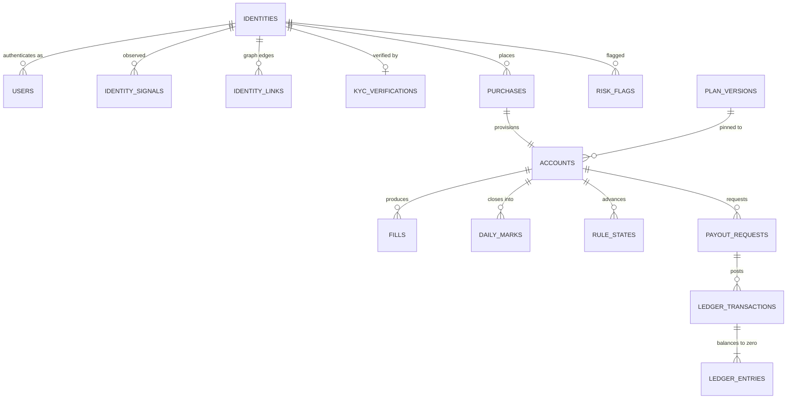

# DATA MODEL

# Data Model (Constitution §3, B1)

Every table, every column, with type, constraints, indexes, retention, and the reason it exists. Terms are defined in [GLOSSARY.md](../../GLOSSARY.md). Migrations are sacred: once merged, a migration is never edited, only superseded.

> **Amended under [ADR-026](../../decisions/ADR-026.md), 2026-08-14. The schema-delta reconciliation has landed.**
>

>
> **Where the two disagree, the migrations are the truth and this document is the design record.**
>
> **This document is at post-migration truth as of 2026-08-15.** §3 through §10 were rewritten table by table against the `.sql` rather than against the plan documents that proposed them: every table the migrations create has a `### <table>` section, and every section resolves to a `CREATE TABLE`. The reconciliation runs **in both directions** as [CI-06i](../../testing/STRATEGY.md), so the next table added without a design record is caught by a robot rather than by counting.
>
> **Two things found in the rewrite were not reconciled quietly. One is closed, one is still the founder's.** [ADR-035](../../decisions/ADR-035.md) recorded a defect in `0027`'s published-plan-version immutability trigger, proven by execution: plan retirement was impossible. **ACCEPTED and fixed 2026-08-15 by [`0028`](../../../packages/db/migrations/0028_supersede_plan_version_immutability.sql)**, which needs the founder's E2 read like every money-path file. **`OI-01` is OPEN and stays open**: `liability_snapshots` exists in one shape here and carried another in the approved design, with a recommendation in §8 and **no ruling, deliberately** — it is a founder call and no session takes it.
>
> **Four rulings changed a column or a value rather than adding one**, and each is folded rather than merely recorded: [ADR-027](../../decisions/ADR-027.md) (two distinct per-identity ledger classes, seven in total), [ADR-028](../../decisions/ADR-028.md) (`payout_requests.status` and **both** of its index predicates), [ADR-029](../../decisions/ADR-029.md) (`dedupe_matched_identity_id` dropped), and [ADR-030](../../decisions/ADR-030.md) (`max_payouts`, `kyc.triggers`). The sentence read "three" against a list of four and is corrected here.

> **Further amended, 2026-08-14, by two rulings on `published_statistics`.** [ADR-031](../../decisions/ADR-031.md): `value_numeric numeric` becomes **`value bigint`** with a mandatory **`value_unit`**, retiring its no-floats exemption and leaving **two** columns on that list, none of them money. [ADR-032](../../decisions/ADR-032.md): **`measure`** joins the table and the window unique key, `statistic_definitions` gains **`measures`**, and **STAT-C1** in `0027` makes "neither figure of a pair is published alone" a database constraint rather than prose. Both amend approved `SD-M12-02`; the second touches the immutability contract on a public surface. Sections amended: §13 (invariants) and §17 (the no-floats exemption list, and the verification record), plus this header.

> **Further amended, 2026-08-16, by [ADR-039](../../decisions/ADR-039.md) and [`0029`](../../../packages/db/migrations/0029_phone_identity_and_auth.sql).** Passwordless auth widens to three factors and **a verified phone becomes a first-class identity signal rather than a contact field**. **Three new tables** ([`identity_phones`](identity_phones.md), [`phone_change_requests`](phone_change_requests.md), [`otp_send_budget`](otp_send_budget.md)) and **amended columns on six existing ones** ([`otp_challenges`](otp_challenges.md), [`sessions`](sessions.md), [`contact_channels`](contact_channels.md), [`identity_signals`](identity_signals.md), [`notification_kinds`](notification_kinds.md), [`kyc_verifications`](kyc_verifications.md)). **[FOLD-01](../../plans/FOLD-01-phone-identity.md) section 6.2 said five existing tables above a list of six**, which is the same hand-maintained-count class the manifest has now recorded nine times; the count here is the one taken from the diff. Three things in the set are load bearing and are named at the top of `0029` for the E2 read: **the unique index on `phone_hash` is deliberately absent** (ADR-039 splits the hard link and only the identity-to-phone half is a constraint), **`otp_send_budget` has no stopping state** (the cost breaker degrades, because a breaker that stops registration is a denial of service on customer acquisition), and **`sessions.elevated_by_factor`'s check list is C-27** (`passkey` or `dual_channel`, so a SIM-swapped session can see everything and change nothing).

Split to a file per table on 2026-08-15 by [ADR-043](../../decisions/ADR-043.md).
Each `### <table>` design record is its own file; the conventions, the plan-config
schema, the invariant table, migration policy, retention, the founder rulings and
the delta provenance stay here, because they are about the whole model rather than
about a table.

## 1. Conventions (binding across every table)

**Types**
- Money: `bigint`, always **integer cents**, always non-negative unless the column explicitly represents a signed movement (`ledger_entries.amount_cents`, `daily_marks.realized_pnl_cents`). Never `numeric`, never `float`.
- Ratios: `integer` **basis points**. Never a float, never a percentage string.
- Timestamps: `timestamptz`, stored UTC. Trading dates: `date`, and always the exchange trading day, never a UTC calendar date derived from a timestamp.
- Enums: Postgres native `enum` types for closed sets that change rarely (phases, statuses), `text` with a `check` constraint for sets expected to grow. Each choice is noted per column.
- JSON: `jsonb` only, always with a documented shape, always validated by zod at the write boundary. `jsonb` is used for vendor payloads, rule configs, and evidence, never as a way to avoid designing columns.

**Keys**
- `uuid` (v7, time-ordered) primary keys for anything referenced in a URL or by an external system: `users`, `identities`, `accounts`, `payout_requests`, `purchases`, `risk_flags`, `affiliates`. Time-ordered so index locality is preserved; opaque so a compromised or curious client cannot enumerate neighbours. Enumeration protection is a defence in depth measure and never a substitute for identity scoping.
- `bigint generated always as identity` for high-volume internal rows never exposed by URL: `fills`, `events`, `ledger_entries`, `daily_marks`, `raw_ingest_rows`.
- Foreign keys are always declared with an explicit `on delete` action, and that action is `restrict` for every financial or evidentiary relationship. We do not cascade deletes anywhere in a money path.

**Mutability**
- **The append-only set is the block below, and there is deliberately no count in this sentence.** Every previous version of this paragraph opened with one and every one of them was wrong; a list a machine reads needs no number in front of it, and a number in front of it is one more thing to drift. Six migrations revoke `UPDATE` and `DELETE` on exactly this set, from the application role **and from `PUBLIC`**: [`0026`](../../../packages/db/migrations/0026_roles_and_grants.sql) on eighteen, [`0032`](../../../packages/db/migrations/0032_trading_calendar_holidays_coverage_revisions.sql) on `trading_calendar_revisions` and `trading_calendar_loads`, [`0038`](../../../packages/db/migrations/0038_account_adjustments.sql) on `account_adjustments`, [`0039`](../../../packages/db/migrations/0039_economic_calendar.sql) on `economic_calendar` and `economic_calendar_loads`, [`0040`](../../../packages/db/migrations/0040_report_schedules.sql) on `report_deliveries`, [`0042`](../../../packages/db/migrations/0042_impersonation_sessions.sql) on `impersonation_page_views`, and [`0049`](../../../packages/db/migrations/0049_reserve_coverage_snapshots.sql) on `reserve_coverage_snapshots`. Each **supersedes `0026`'s list rather than editing it**. The application role holds `INSERT` and `SELECT` only. Enforced by grants in the database, not by convention ([VG-8](../../../research/VIBE_FAILURE_POSTMORTEMS.md)).

  **THIS PARAGRAPH USED TO BE THREE PARAGRAPHS SAYING THREE DIFFERENT THINGS, AND THAT IS `OI-03` HAPPENING RATHER THAN `OI-03` BEING PREDICTED.** Three keep-both merges left three copies of this bullet in place, reading "twenty-three tables ... four migrations", "twenty-two ... three migrations" and "twenty-two ... three migrations", over three different migration lists, while the installed set was **twenty-five**. Every gate was green throughout, because no gate could read either side. [`ADR-128`](../../decisions/ADR-128.md) closes it, and the remedy is not a better paragraph: it is [`scripts/db/assert_append_only_grants.mjs`](../../../scripts/db/assert_append_only_grants.mjs), which reads the block below and the installed privileges and fails **in both directions**.

<!-- append-only:begin -->
```
account_adjustments
account_status_history
admin_actions
certificate_verifications
daily_marks
economic_calendar
economic_calendar_loads
events
fills
identity_links
identity_merges
impersonation_page_views
integration_dispatches
kyc_funnel_events
ledger_entries
ledger_transactions
published_statistics
raw_ingest_rows
report_deliveries
reserve_coverage_snapshots
rule_states
support_context_views
tos_acceptances
trading_calendar_loads
trading_calendar_revisions
wallet_entries
```
<!-- append-only:end -->

  **A SECOND SET IS DECLARED BESIDE IT, AND THE TWO ARE DIFFERENT PROPERTIES.** A table is unreachable when `merit_app` holds **no privilege on it at all**. That is not a stronger form of append-only and it does not imply it: another role may update the table freely, and on the one table in this set another role does.

<!-- unreachable:begin -->
```
live_account_state
```
<!-- unreachable:end -->

  **`live_account_state` is here rather than above because calling it append-only would be false in both directions.** [`0050:233`](../../../packages/db/migrations/0050_live_cache_and_role.sql) reads `REVOKE ALL ON live_account_state FROM merit_app, PUBLIC`, and the sentence it implements is `FM-M12-08`, *"the stats worker holds no read grant on the live cache"* -- a **confidentiality** sentence, not a mutability one. The stats run is [`apps/worker/src/batch/statistics.ts`](../../../apps/worker/src/batch/statistics.ts) and it runs as `merit_app`, so the verb that had to go was `SELECT`, and taking only `UPDATE` and `DELETE` would have left the sentence unimplemented. Meanwhile `0050:254` grants `SELECT, INSERT, UPDATE` to `merit_live`: **the row is updated, by the upsert the table exists for.**

  **The check read it as append-only and undeclared, and that finding was false.** Its derivation asked only whether `merit_app` lacked `UPDATE` and `DELETE`, which every table in the schema answered against the unstated premise that `merit_app` could reach it at all. `0050` created the first table it cannot. The derivation now asks for `INSERT` as well, and the second block above is why that is not a narrowing: **every table immutable to `merit_app` must appear in exactly one of these two blocks**, and one that appears in neither -- `INSERT` revoked and `SELECT` left -- fails on its own finding rather than dropping silently out of the check.

  **A table is on that list exactly when `merit_app` holds neither `UPDATE` nor `DELETE` on it**, which is the question the assertion asks of the database. `merit_app` inherits every privilege granted to `PUBLIC`, so testing that one role is what tests both, and a revoke that bound only the application role would show up here as a table that is not on the list.

- **`impersonation_sessions` is deliberately NOT in that set and is the first table to sit just outside it.** [`0042`](../../../packages/db/migrations/0042_impersonation_sessions.sql) revokes `DELETE` and **keeps `UPDATE`**, because recording the explicit exit is an update to a row that already exists. Listing it above would make the append-only set a list of tables that are *mostly* append-only, which is the kind of drift that makes an exact list worth less than no list. `IMPERSONATION-C1`'s trigger fires on `UPDATE OF token_hash`, so the one guarantee that matters survives the one update that is allowed. Enforced by grants in the database, not by convention ([VG-8](../../../research/VIBE_FAILURE_POSTMORTEMS.md)).
  - **A later migration that creates an append-only table must revoke, and `0026` is why.** Its closing `ALTER DEFAULT PRIVILEGES` grants the application role `SELECT, INSERT, UPDATE, DELETE` on every table a future migration creates, so a new table is fully mutable the instant it exists and the words "append-only" in its comment are false until somebody revokes. `0032` is the first migration to hit this, and the rule is stated here rather than left to be rediscovered.
  - The approved list read `events`, `ledger_entries`, `ledger_transactions`, `admin_actions`, `fills`, `raw_ingest_rows`, `daily_marks`, `rule_states`, `eligibility` snapshots, `identity_merges`. **`eligibility` snapshots is not a table** (the eligibility snapshot is a `jsonb` column on `payout_requests`, §8), and the rest were added by the fold. This paragraph was the document half of `OI-03` and it is now the historical half: the block above is what the check reads, and [`ADR-128`](../../decisions/ADR-128.md) is where the check landed.
  - **Three legitimate writes to append-only tables are ruled, and all three now have a path.** [`0048`](../../../packages/db/migrations/0048_audited_writes_on_append_only_tables.sql) creates `supersede_daily_mark`, `suppress_identity_link` and `rewrite_rule_state`, each `SECURITY DEFINER`, each owned by `merit_migrator`, each granted `EXECUTE` to `merit_app` and revoked from `PUBLIC`, each with its negative-authz test in [`scripts/db/probe_audited_writes.sql`](../../../scripts/db/probe_audited_writes.sql) (VG-5). That closes `OI-04` and `OI-13`.
    - **`identity_links` is FOUR columns and not one**, which `OI-04` called "a single-column update". `suppressed` is the operative field and `identity_links_suppression_has_author` makes `suppressed_by` mandatory, so `disputed_at`, `dispute_note`, `suppressed` and `suppressed_by` move together or the write is not a dispute resolution.
    - **`rule_states` is not a single column at all.** [M01 B.4](../../plans/M01-rules-engine.md) step 4 restores the whole computed state under a new version, so the assignment list is derived from `pg_attribute` minus `id`, `account_id`, `trading_day` and `created_at`, and those four are therefore unwritable through the function.
    - **The mark correction was not performable at all until `0048`**, and that is a defect in a merged money-path migration rather than a missing function. The ruled order refuses in both directions: inserting the replacement first trips `daily_marks_live_per_account_day_uq`, and pointing the old row first trips the `superseded_by` foreign key. `0048` makes the uniqueness a `DEFERRABLE INITIALLY DEFERRED` `EXCLUDE` constraint over the identical btree, keeping the name.
- Mutable tables carry `updated_at` and emit an event on every meaningful transition, so the trail exists even where the row is overwritten. **Thirty of the 97 tables carry `updated_at`**; the rest are either append-only or written once. (`identity_restriction_episodes`, added by `0031`, does not: an episode is opened once and closed once, and both transitions carry their own actor and timestamp.)
- Mutable tables carry `updated_at` and emit an event on every meaningful transition, so the trail exists even where the row is overwritten. **Thirty of the 98 tables carry `updated_at`**; the rest are either append-only or written once. (The figure was thirty of 96 until `0032` added two append-only tables, which is why the numerator did not move.)
- Nothing is ever soft-deleted with a boolean. Lifecycle is a status enum with an event trail. The one soft delete in the schema is `journal_entries.deleted_at`, and it is a **tombstone for a hard-delete job** rather than an end state (§10).

**Naming**: `snake_case`, plural table names, `_cents` and `_bp` suffixes are mandatory on money and ratio columns, `_at` on timestamps, `_on` on dates. A column named `amount` without a unit suffix is a review reject.

**Every table** carries `created_at timestamptz not null default now()`, **with exactly three ruled exceptions**, each of which carries a more specific timestamp instead and would gain nothing from a second one: `ledger_transactions` (`posted_at`), `treasury_balances` (`recorded_at`), and `liability_snapshots` (`computed_at`). Posting time, attestation time and computation time are the facts those rows exist to record, and a creation timestamp beside them would be a second answer to the same question. Mutable tables also carry `updated_at timestamptz not null default now()`.

## 2. The spine

Everything radiates from [trader identity](../../GLOSSARY.md#trader-identity), never from email and never from account.



## 3. Identity, authentication and KYC

Created by [`0002_identity`](../../../packages/db/migrations/0002_identity.sql), [`0003_kyc`](../../../packages/db/migrations/0003_kyc.sql), [`0029_phone_identity_and_auth`](../../../packages/db/migrations/0029_phone_identity_and_auth.sql) and [`0042_impersonation_sessions`](../../../packages/db/migrations/0042_impersonation_sessions.sql). Seventeen tables. All four files are money path: identity is the row every cap and every aggregate liability figure keys off, KYC is what stands between the payout rail and a fleet, `0029` is where [ADR-039](../../decisions/ADR-039.md)'s authority boundary stops being prose, and `0042` adds **a second kind of session to a system that has had exactly one**. The two `0042` tables are owned by [M06](../../plans/M06-admin-ops-console.md) as `SD-M6-10` and live here rather than in section 10 because the constraint that defines them, `IMPERSONATION-C1`, is a statement about [`sessions`](sessions.md).

| Table | |
|---|---|
| [`identities`](identities.md) | |
| [`users`](users.md) | |
| [`passkeys`](passkeys.md) | |
| [`otp_challenges`](otp_challenges.md) | |
| [`otp_send_budget`](otp_send_budget.md) | `0029` |
| [`sessions`](sessions.md) | |
| [`identity_signals`](identity_signals.md) | |
| [`identity_phones`](identity_phones.md) | `0029` |
| [`phone_change_requests`](phone_change_requests.md) | `0029` |
| [`identity_links`](identity_links.md) | |
| [`identity_merges`](identity_merges.md) | |
| [`kyc_verifications`](kyc_verifications.md) | |
| [`sanctions_screenings`](sanctions_screenings.md) | |
| [`kyc_funnel_events`](kyc_funnel_events.md) | |
| [`dedupe_matches`](dedupe_matches.md) | |
| [`impersonation_sessions`](impersonation_sessions.md) | `0042` |
| [`impersonation_page_views`](impersonation_page_views.md) | `0042` |

## 4. Catalog and configuration

Created by [`0004_catalog`](../../../packages/db/migrations/0004_catalog.sql), [`0032_trading_calendar_holidays_coverage_revisions`](../../../packages/db/migrations/0032_trading_calendar_holidays_coverage_revisions.sql) (the two trading-calendar tables, and the amendments to `trading_calendar` itself) and [`0039_economic_calendar`](../../../packages/db/migrations/0039_economic_calendar.sql), plus [`0045_simulation_runs`](../../../packages/db/migrations/0045_simulation_runs.sql). Thirteen tables. **Ten are money path and the two `economic_calendar` tables are not**, which is the first split in this section and is stated rather than left to the reader: they change no rule outcome, no balance and no eligibility. They are **evidence-bearing** instead, which is a different kind of dangerous and is argued at [`economic_calendar`](economic_calendar.md). `plan_versions` **is** the rule contract: the single source of truth the engine executes and the site renders, and the artifact behind the most valuable promise Merit can make in a market whose live case study is a firm destroyed by a retroactive rule change.

**The calendar is the second thing in this section that changes rule outcomes with no change to a line of engine code.** Every counter the engine keeps is counted in trading days (R-01, R-02, R-05, R-34, R-37, R-47), and the engine is a pure function of the calendar it is handed: `types: []`, `merit/engine-purity` and `RI-01` each guarantee it cannot go and check for itself. [ADR-042](../../decisions/ADR-042.md) is the ruling set, and `0032` carries F-1 through F-4.

| Table | |
|---|---|
| [`plans`](plans.md) | |
| [`plan_versions`](plan_versions.md) | |
| [`plan_version_sizes`](plan_version_sizes.md) | |
| [`tos_versions`](tos_versions.md) | |
| [`tos_acceptances`](tos_acceptances.md) | |
| [`geo_restrictions`](geo_restrictions.md) | |
| [`contract_specs`](contract_specs.md) | |
| [`trading_calendar`](trading_calendar.md) | |
| [`trading_calendar_revisions`](trading_calendar_revisions.md) | |
| [`trading_calendar_loads`](trading_calendar_loads.md) | |
| [`economic_calendar`](economic_calendar.md) | |
| [`economic_calendar_loads`](economic_calendar_loads.md) | |
| [`simulation_runs`](simulation_runs.md) | `0045`, [ADR-071](../../decisions/ADR-071.md). The persisted record one publish is traced back to ([M21](../../plans/M21-plan-designer.md) `SD-M21-01`). **Not money path and not append-only**: `status` and `completed_at` move as a run executes |

## 5. Commerce

Created by [`0006_commerce`](../../../packages/db/migrations/0006_commerce.sql), [`0012_disputes_and_affiliate_settlement`](../../../packages/db/migrations/0012_disputes_and_affiliate_settlement.sql) (`payment_disputes`) and [`0024_offers`](../../../packages/db/migrations/0024_offers.sql). Ten tables, money path. This is where money first enters the system.

| Table | |
|---|---|
| [`coupons`](coupons.md) | |
| [`purchases`](purchases.md) | |
| [`coupon_redemptions`](coupon_redemptions.md) | |
| [`psp_webhook_events`](psp_webhook_events.md) | |
| [`mid_health`](mid_health.md) | |
| [`payment_disputes`](payment_disputes.md) | |
| [`offer_experiments`](offer_experiments.md) | |
| [`price_floors`](price_floors.md) | |
| [`offers`](offers.md) | |
| [`promotional_credit_grants`](promotional_credit_grants.md) | |

## 6. Accounts and platform

Created by [`0007_accounts`](../../../packages/db/migrations/0007_accounts.sql). Five tables, money path. `accounts` is the object every rule runs against and every liability figure sums over.

| Table | |
|---|---|
| [`accounts`](accounts.md) | |
| [`account_status_history`](account_status_history.md) | |
| [`platform_account_refs`](platform_account_refs.md) | |
| [`provisioning_queue`](provisioning_queue.md) | |
| [`platform_entitlements`](platform_entitlements.md) | |

## 7. Ingest, marks and rule state

Created by [`0013_ingest`](../../../packages/db/migrations/0013_ingest.sql), [`0014_marks`](../../../packages/db/migrations/0014_marks.sql) and [`0015_rule_states`](../../../packages/db/migrations/0015_rule_states.sql). Six tables. `0013` is not a money-path file by table and it is the file every money number is computed from; `0014` and `0015` are money path outright.

| Table | |
|---|---|
| [`ingest_files`](ingest_files.md) | |
| [`raw_ingest_rows`](raw_ingest_rows.md) | |
| [`fills`](fills.md) | |
| [`daily_marks`](daily_marks.md) | |
| [`reconciliations`](reconciliations.md) | |
| [`rule_states`](rule_states.md) | |
| [`live_account_state`](live_account_state.md) | `0050`. **[ADR-020](../../decisions/ADR-020.md)'s tier 2 live cache, and the only table in this section the engine cannot read.** One row per account, upserted, discardable. [`0050`](../../../packages/db/migrations/0050_live_cache_and_role.sql) revokes **all four verbs** from `merit_app` and grants a fifth role `merit_live` instead, which is `INV-M2-14` and `FM-M12-08` as permissions rather than conventions ([ADR-164](../../decisions/ADR-164.md)) |

## 8. Payouts, ledger, wallet and treasury controls

Created by [`0009_ledger`](../../../packages/db/migrations/0009_ledger.sql), [`0010_payouts`](../../../packages/db/migrations/0010_payouts.sql), [`0011_wallet`](../../../packages/db/migrations/0011_wallet.sql) and [`0016_treasury_controls`](../../../packages/db/migrations/0016_treasury_controls.sql). Fifteen tables, all money path. `0010` is the file where money leaves.

**Money movement is three objects, not one.** A [payout request](../../GLOSSARY.md) is a claim against an account evaluated by the engine. A wallet entry is what the trader is owed. A wallet withdrawal is the external rail moving it. Conflating any two of them makes the engine's gates and the rail's gates share a status column, and the first person to add a state breaks the other one.

| Table | |
|---|---|
| [`ledger_accounts`](ledger_accounts.md) | |
| [`ledger_transactions`](ledger_transactions.md) | |
| [`ledger_entries`](ledger_entries.md) | |
| [`treasury_balances`](treasury_balances.md) | |
| [`liability_snapshots`](liability_snapshots.md) | |
| [`reserve_coverage_snapshots`](reserve_coverage_snapshots.md) | `0049` |
| [`payout_requests`](payout_requests.md) | |
| [`payout_transfers`](payout_transfers.md) | |
| [`payout_destinations`](payout_destinations.md) | `0051` |
| [`wallet_entries`](wallet_entries.md) | |
| [`wallet_withdrawals`](wallet_withdrawals.md) | |
| [`wallet_spend_limits`](wallet_spend_limits.md) | |
| [`wallet_dormancy`](wallet_dormancy.md) | |
| [`ledger_halts`](ledger_halts.md) | |
| [`plan_breaker_state`](plan_breaker_state.md) | |
| [`alarm_suppressions`](alarm_suppressions.md) | |
| [`dual_control_approvals`](dual_control_approvals.md) | |
| [`account_adjustments`](account_adjustments.md) | |

## 9. Risk and evidence

Created by [`0008_risk`](../../../packages/db/migrations/0008_risk.sql), plus one added by [`0031`](../../../packages/db/migrations/0031_payout_hold_and_identity_restriction.sql). Six tables. Not a money-path file, because nothing here holds an amount, and it is read line by line for a different reason: every table below is **evidence**. A flag is an accusation, and an accusation without the numbers behind it is one Merit cannot defend in a dispute or act on with confidence.

`risk_flags` is created in this file rather than later because `payout_requests.freeze_flag_id` (`SD-M5-01`) references it, and `0010` must have it. A freeze that cites no flag is an indefinite hold with a citation nobody can look up.

| Table | |
|---|---|
| [`detector_definitions`](detector_definitions.md) | |
| [`detector_runs`](detector_runs.md) | |
| [`risk_flags`](risk_flags.md) | |
| [`correlation_groups`](correlation_groups.md) | |
| [`evidence_packs`](evidence_packs.md) | |
| [`identity_restriction_episodes`](identity_restriction_episodes.md) | `0031`, [ADR-041](../../decisions/ADR-041.md). Grouped here rather than with identity because it is an **enforcement** record: it cites a `risk_flags` row, carries a ToS clause, and ends in either a documented restore or an evidence pack |

## 10. Affiliate, system, and the module surfaces

Thirty-seven tables, created by [`0005`](../../../packages/db/migrations/0005_affiliate_program.sql), [`0012`](../../../packages/db/migrations/0012_disputes_and_affiliate_settlement.sql), [`0017`](../../../packages/db/migrations/0017_events_and_audit.sql), [`0018`](../../../packages/db/migrations/0018_integrations.sql), [`0019`](../../../packages/db/migrations/0019_notifications_and_community.sql), [`0020`](../../../packages/db/migrations/0020_public_surface.sql), [`0021`](../../../packages/db/migrations/0021_transparency.sql), [`0022`](../../../packages/db/migrations/0022_analytics_journal.sql), [`0023`](../../../packages/db/migrations/0023_loyalty_and_graduation.sql), [`0025`](../../../packages/db/migrations/0025_reserved_sequence.sql) and [`0040`](../../../packages/db/migrations/0040_report_schedules.sql). They are grouped below by the migration that creates them, which is also how they group by module.

**Affiliate program (`0005`, `0012`).** The module is split across two migrations for a dependency reason rather than a design one: `coupons.affiliate_id` needs `affiliates`, `purchases` needs `coupons`, and `attributions` needs `purchases`. The settlement half lands in `0012` alongside `payment_disputes`, which is also where it belongs semantically, because a chargeback is what triggers a clawback.

| Table | |
|---|---|
| [`affiliates`](affiliates.md) | |
| [`affiliate_creatives`](affiliate_creatives.md) | |
| [`affiliate_clicks`](affiliate_clicks.md) | |
| [`attributions`](attributions.md) | |
| [`affiliate_commissions`](affiliate_commissions.md) | |
| [`affiliate_statements`](affiliate_statements.md) | |
| [`events`](events.md) | |
| [`admin_actions`](admin_actions.md) | `0017`, extended by [`0043`](../../../packages/db/migrations/0043_admin_attributed_actions.sql) with **`SD-M6-11`** ([ADR-069](../../decisions/ADR-069.md)). The audit surface every mutating admin endpoint writes to. **`reason` is `NOT NULL` and `initiative` is `NOT NULL` with no default**, so no row can omit why it was taken or on whose initiative |
| [`idempotency_keys`](idempotency_keys.md) | |
| [`integration_contracts`](integration_contracts.md) | |
| [`integration_dispatches`](integration_dispatches.md) | |
| [`support_context_views`](support_context_views.md) | |
| [`notification_kinds`](notification_kinds.md) | |
| [`notifications`](notifications.md) | |
| [`notification_preferences`](notification_preferences.md) | |
| [`contact_channels`](contact_channels.md) | |
| [`discord_links`](discord_links.md) | |
| [`discord_announcements`](discord_announcements.md) | |
| [`content_documents`](content_documents.md) | |
| [`page_revalidations`](page_revalidations.md) | |
| [`certificates`](certificates.md) | |
| [`statistic_definitions`](statistic_definitions.md) | |
| [`published_statistics`](published_statistics.md) | |
| [`review_requests`](review_requests.md) | |
| [`proof_links`](proof_links.md) | |
| [`round_trips`](round_trips.md) | |
| [`journal_entries`](journal_entries.md) | |
| [`analytics_snapshots`](analytics_snapshots.md) | |
| [`loyalty_criteria`](loyalty_criteria.md) | |
| [`loyalty_states`](loyalty_states.md) | |
| [`loyalty_benefit_grants`](loyalty_benefit_grants.md) | |
| [`graduation_benefits`](graduation_benefits.md) | |
| [`identity_signal_weights`](identity_signal_weights.md) | |
| [`graduation_invitations`](graduation_invitations.md) | |
| [`certificate_verifications`](certificate_verifications.md) | |
| [`plan_size_unlocks`](plan_size_unlocks.md) | **`SD-M18-04`**, [`0044`](../../../packages/db/migrations/0044_fee_back_and_ladder_unlock.sql). The ladder unlock, keyed to the hard-merged identity |
| [`report_schedules`](report_schedules.md) | `0040`, [ADR-066](../../decisions/ADR-066.md). The four named digests as a **closed vocabulary**, which is what makes "this is not a report builder" a schema fact ([M06](../../plans/M06-admin-ops-console.md) `SD-M6-07`) |
| [`report_deliveries`](report_deliveries.md) | `0040`. **One row per delivery attempt with its outcome**, append-only. The delivery-failure alarm reads this table and never the job's own report, which is [M05](../../plans/M05-payout-system.md) `INV-M5-18` on a second sweep |

## 11. Plan config schema (the contract the engine executes)

`plan_versions.rules` shape. Every ratio is bp, every amount is cents, and every field name here is the canonical one used in [GLOSSARY](../../GLOSSARY.md) and the engine.

```jsonc
{
  "schema_version": 1,
  "phase_eval": {
    "enabled": true,
    "profit_target_bp": 600,
    "drawdown": {
      "type": "trailing_eod",
      "amount_bp": 500,
      "lock": { "enabled": false, "at_profit_cents": null, "floor_at_cents": null }
    },
    "daily_loss_limit": { "type": "none", "amount_bp": null },
    "min_trading_days": 1,
    "consistency": { "enabled": false, "max_day_share_bp": null, "mode": "pass_time_dilutable" },
    "max_days": null
  },
  "phase_funded": {
    "drawdown": {
      "type": "trailing_eod",
      "amount_bp": 500,
      "lock": { "enabled": true, "at_profit_cents": null, "floor_at_cents": null }
    },
    "daily_loss_limit": { "type": "none", "amount_bp": null },
    "min_trading_days": 0,
    "win_days": { "required_count": 5, "floor_bp": 30, "reset_on_payout": true },
    "consistency": { "enabled": true, "max_day_share_bp": 3000, "mode": "payout_gated" },
    "buffer_bp": 200,
    "cadence_gap_trading_days": 5,
    "payout_cap_schedule": [ { "from_ordinal": 1, "cap_bp": 300 } ],
    "min_payout_cents": 10000,
    "split_bp": 9000,
    "max_payouts": 5,
    "post_payout_floor_rule": { "mode": "none" }
  },
  "limits": { "max_accounts_per_entity": 10 },
  "kyc": { "triggers": ["second_distinct_account_purchase", "pre_funded"] }
}
```

**Re-materialized at the frozen configuration under [ADR-026](../../decisions/ADR-026.md), and [ADR-030](../../decisions/ADR-030.md)'s two key names are folded.** The example above is **Core EOD** (`core_eod`), which is what its `cadence_gap_trading_days: 5`, `cap_bp: 300` and `split_bp: 9000` have always been. Two changes and one correction:

| Was | Now | Why |
|---|---|---|
| `"ladder": { "payouts_to_graduate": 8 }` | `"max_payouts": 5` | **[ADR-030](../../decisions/ADR-030.md)** rules the canonical name, matching [ADR-024](../../decisions/ADR-024.md) and every Appendix A table. The value is [ADR-024](../../decisions/ADR-024.md)'s **5** (Direct is **4**). The zod schema and the CV publish validations key off this name |
| `"kyc": { "placement": "pre_funded" }` | `"kyc": { "triggers": [...] }` | **[ADR-030](../../decisions/ADR-030.md)**. Under [ADR-021](../../decisions/ADR-021.md) placement is a **set** firing at whichever trigger is reached first, and one fact cannot be split across two shapes. `U-05` widens the stored `kyc_verifications.placement` check to the same vocabulary in the same migration |

**A correction to ADR-030's own stale list, recorded rather than applied silently.** That ADR also named `win_days.required_count: 5` and `phase_eval.min_trading_days: 1` as stale in this example. **They are not.** Both are Core EOD's frozen values per [M01 Appendix A.1](../../plans/M01-rules-engine.md), sourced to constitution 0.4. **`w = 3` is Merit Rapid's win-day count** ([ADR-018](../../decisions/ADR-018.md)), not Core EOD's, and the example was never a Merit Rapid example. The two key names were the real content of C-06 and they are folded; the two parameter values needed no change.

**Every value here is a launch candidate re-confirmed at launch, never a constant.** There is no plan parameter anywhere in application code: these are rows in `plan_versions.rules` and `plan_version_sizes`.

Notes that matter: `payout_cap_schedule` is an **array from day one** even though v1 has one step, because progressive cap release is a known v1.1 candidate and turning a scalar into a schedule later is a migration plus a config rewrite. `mode` on consistency is explicit so nobody has to remember which phase behaves how. `max_days: null` means unlimited.

**Amended at the M1 gate (2026-08-13).** Two fields above changed and are called out because this document is `approved` and a silent edit to a money-path contract is exactly what the corpus exists to prevent. `phase_funded.min_trading_days` is **0** on all three plans, which disables the gate rather than setting it low ([ADR-015](../../decisions/ADR-015.md), CV-19). `post_payout_floor_rule.mode` is **`none`** and `amount_cents` is dropped, because settlement no longer touches the floor at all ([ADR-014](../../decisions/ADR-014.md), CV-18). The funded `lock` block is populated on all three plans, at `floor_at_cents = size_cents + 10000` and `at_profit_cents = drawdown_cents + 10000`.

**M1's ten schema deltas are folded.** SD-01 through SD-10 in [M01 section 2.3](../../plans/M01-rules-engine.md) landed in the migration set under [ADR-026](../../decisions/ADR-026.md): `daily_marks.adjustment_cents` (`0014`); `rule_states.payout_anchor_day` and `cadence_anchor_day` replacing `last_payout_trading_day`, `floor_open_cents`, `engine_eligible` with the `engine_gates` / `context_gates` split, `consistency_period_start_day` and `state_hash` (all `0015`); `payout_requests.settled_trading_day` and `effective_trading_day`, the partial unique on `(account_id, payout_ordinal) where status <> 'failed'`, and the partial unique on `(account_id) where status in ('approved','frozen')` ([ADR-028](../../decisions/ADR-028.md)) (all `0010`); and the conditional not-null on the two `floor_lock_*` columns (`0004`).

**Two of those needed a shape decision that the delta did not specify, and both are written down where they land rather than inferred at build time.** `SD-08`'s hash input list is [ADR-026](../../decisions/ADR-026.md) C-07, reproduced in full in `0015`. `SD-10`'s conditional not-null cannot be a CHECK over the parent's `rules` jsonb, so `floor_lock_enabled` is **materialized on `plan_version_sizes` at publish** alongside every other value that table materializes, and the reasoning is in `0004`.

## 12. Reserved-now fields, and what each buys

| Reservation | Where | Cost now | Migration avoided later |
|---|---|---|---|
| `platform`, `platform_account_ref`, `feed`, `front_end_permissions` | accounts | one enum, three columns | second platform adapter (Tradovate) |
| `platform`, `order_id`, `venue`, `correction_of`, `recorded_at` | fills | five columns | correction handling and any second venue |
| `ingest_files`, `platform_entitlements` | new tables | two small tables | quarantine machinery and entitlement cost hygiene retrofitted onto live data |
| `payout_cap_schedule` array | plan config | array instead of scalar | progressive cap release (M14) |
| `affiliates.parent_id`, `.level` | affiliates | two columns | sub-IB trees |
| `identities.display_name`, `.leaderboard_opt_in` | identities | two columns | leaderboards and contests |
| `notifications.channel = push` | notifications | one enum value | mobile push |
| `risk_flags.source` | risk_flags | one column | vendor risk network bolt-on |
| `ledger_entries.currency`, `purchases.currency` | ledger, purchases | two columns | multi-currency payouts |
| `promotional_credit` ledger account class | ledger_accounts | one row | bonus/vault mechanics |
| `graduated` phase plus invitation event | accounts, events | already present | live-program pipeline (M18) |
| `identity_signal_weights`, `graduation_invitations`, `certificate_verifications` | three tables in `0025` | three empty tables | scored entity resolution, a live program, and the verify endpoint's abuse log, each retrofitted onto live data (§17) |
| `feed`, `platform` value sets | accounts | two `check` lists | a second data feed or venue |
| `wallet_withdrawal_status = transferring` | wallet_withdrawals | one enum value | the external rail growing a state the internal leg never had ([ADR-028](../../decisions/ADR-028.md)) |

## 13. Invariants, and the test that enforces each

| Invariant | Enforcement |
|---|---|
| Ledger sums to zero per transaction and globally | `ledger_entries_zero_sum`, a deferred constraint trigger in `0027`; property test; nightly assertion |
| **No transaction debits and credits the same ledger account** | **LEDGER-C1** `ledger_entries_no_opposite_signs`, a deferred constraint trigger ([ADR-027](../../decisions/ADR-027.md)). The collapse it catches **passes** the zero-sum check |
| **Every entry resolves to one of the seven declared classes** | **LEDGER-C2** `ledger_entries_class_declared`, a `BEFORE INSERT` trigger, plus the `CHECK` on `ledger_accounts.code` |
| `withdrawable_cents >= 0` always | check constraint; property test over generated day sequences |
| One live mark per account per trading day | partial unique index `daily_marks_live_per_account_day_uq` |
| Replay reproduces stored rule_states byte-identically | nightly self-audit job; CI golden replay; `state_hash` (`SD-08`) is the comparison key |
| A published plan_version never changes, and a retired one never changes again | `plan_versions_published_immutable`, an update trigger in `0027`. **DEFECTIVE AS MERGED, FIXED BY [`0028`](../../../packages/db/migrations/0028_supersede_plan_version_immutability.sql) under [ADR-035](../../decisions/ADR-035.md), accepted 2026-08-15.** As merged it read `NEW.config` on a table whose rule contract is `rules`, so the promise held by accident and the ruled `published -> retired` transition was refused too. `0028` pins the whole row rather than three columns, permits exactly `published -> retired` with `retired_at`, and makes retirement terminal. Probed by [`probe_plan_version_immutability.sql`](../../../scripts/db/probe_plan_version_immutability.sql), which **leads with the permitted transition succeeding**: a golden test attempting mutation would have passed against a guard that rejected everything, and that is precisely what happened |
| Win-day count never decreases except on payout reset | property test |
| `approved_cents <= min(requested, withdrawable, cap)` | check constraint plus engine property test |
| An account's plan_version_id never changes | `accounts_plan_version_pinned`, an update trigger in `0027`. Verified to fire |
| No account exceeds its entity's account cap | transactional check at purchase against resolved identity |
| Quarantined file commits nothing | whole-file transaction; chaos test with a corrupt row |
| **A `set_risk` provisioning operation never reaches `confirmed_inferred`** | `provisioning_queue_set_risk_never_inferred`, a check constraint (`U-06`, AS-M2-03) |
| **A trader-audience evidence pack never carries detector detail** | `evidence_packs_trader_gets_no_detector_detail`, a check constraint (`SD-M6-04`) |
| **A dual-control approver is not the requester** | `dual_control_approvals_second_person`, a check constraint (`SD-M6-05`) |
| **`closing = opening + realized_pnl + adjustment`** (INV-18) | `daily_marks_balance_arithmetic`, checkable only because `SD-01` exists |
| **No non-integer column exists outside the two ruled exemptions** | a `DO` block in `0027` reading `information_schema.columns`, asserted in both directions (§17) |
| **Neither figure of a paired statistic is published alone** (ST-04 mean and median, ST-05 and ST-06 p50 and p95) | **STAT-C1**, a deferred constraint trigger ([ADR-032](../../decisions/ADR-032.md)): a publish run emitting one `measure` for a `stat_code` must emit every measure its definition declares. Probed against the database, both ways |

## 14. Migration policy

Migrations are forward-only, reviewed on `main`, and never edited after merge. The application role has no DDL. Every migration that touches a money table requires the founder's line-by-line read (constitution E2). Every new table ships in the same pull request as its negative-authz test ([VG-5](../../../research/VIBE_FAILURE_POSTMORTEMS.md)), or it does not merge.

## 15. Retention summary

| Class | Retention |
|---|---|
| Financial spine (ledger, payouts, purchases, accounts, marks, rule_states, fills, events, admin_actions, tos_acceptances) | forever |
| Raw ingest rows and vendor webhook payloads | 24 months hot, then object-storage archive with digest |
| Sessions, OTP challenges, idempotency keys | 90 / 30 / 30 days |
| Affiliate clicks, notifications | 12 months |
| IP-kind identity signals | 24 months rolling |
| KYC status and refs | forever (AML), documents never stored |
| `integration_dispatches` | **long, deliberately.** A privacy deletion request and a vendor breach ask the same question and a 30-day log answers neither (§10) |
| `certificate_verifications` | 90 days, hashed inputs only |
| `journal_entries` | the trader's own, deleted on request. `deleted_at` is a tombstone for a hard-delete job, never the end state |

Privacy deletion requests redact PII columns (`users.email`, `country_code`, signal previews) and retain the financial spine with the identity pseudonymized, because the ledger cannot lie about money that moved.

## 16. Founder rulings (Wave 2 gate, 2026-08-13)

Walked line by line at the gate. All five confirmed as written; recorded in [DECISIONS.md](../../decisions/README.md).

1. **`rule_states` stored per day rather than per account: confirmed.** It is the difference between an account timeline that reconstructs itself and one that has to be recomputed on demand. Costs roughly 250 rows per funded account per year.
2. **Marks and corrections use supersession, never update: confirmed.** This is what makes "what did we believe when we approved that payout" answerable, and it is the mechanism behind the never-claw-back promise (B4 #5).
3. **`payout_requests.status` has no `denied` value and no review state: confirmed.** That is the zero-denial policy expressed as a schema constraint rather than a process promise.
4. **`identity_id` is denormalized onto `payout_requests`: confirmed.** Deliberate, for identity-level race safety and aggregate exposure.
5. **The `promotional_credit` ledger class and the `currency` columns are reserved now: confirmed.** Both stay in the v1 schema and out of v1 math. `currency` defaults to `USD` on `ledger_entries` and `purchases` and is never read by any computation; `promotional_credit` exists as a `ledger_accounts` row with no entries. The cost is two columns and one row. The migration avoided is a multi-currency or bonus-mechanics retrofit onto a live, append-only ledger, which is the one table in the system where a retrofit cannot be rehearsed.

## 17. Delta provenance (added under [ADR-026](../../decisions/ADR-026.md))

**Every schema change in the migration set traces to the document that proposed it, and the trace lives in one file.** [`packages/db/DELTA_MANIFEST.md`](../../../packages/db/DELTA_MANIFEST.md) carries all <!--gen:manifest_changes-->118<!--/gen--> with a disposition, plus the migration sequence, the rejection table, and the reference cycles. **The completeness gate reads it**: every `SD-nn` and `U-nn` appearing anywhere in `docs/` must appear exactly once there. A count nobody can drift is better than a count someone remembers to update.
**Every schema change in the migration set traces to the document that proposed it, and the trace lives in one file.** [`packages/db/DELTA_MANIFEST.md`](../../../packages/db/DELTA_MANIFEST.md) carries all <!--gen:manifest_changes-->118<!--/gen--> with a disposition, plus the migration sequence, the rejection table, and the reference cycles. **The completeness gate reads it**: every `SD-nn` and `U-nn` appearing anywhere in `docs/` must appear exactly once there. A count nobody can drift is better than a count someone remembers to update.
**Every schema change in the migration set traces to the document that proposed it, and the trace lives in one file.** [`packages/db/DELTA_MANIFEST.md`](../../../packages/db/DELTA_MANIFEST.md) carries all <!--gen:manifest_changes-->118<!--/gen--> with a disposition, plus the migration sequence, the rejection table, and the reference cycles. **The completeness gate reads it**: every `SD-nn` and `U-nn` appearing anywhere in `docs/` must appear exactly once there. A count nobody can drift is better than a count someone remembers to update.
**Every schema change in the migration set traces to the document that proposed it, and the trace lives in one file.** [`packages/db/DELTA_MANIFEST.md`](../../../packages/db/DELTA_MANIFEST.md) carries all <!--gen:manifest_changes-->118<!--/gen--> with a disposition, plus the migration sequence, the rejection table, and the reference cycles. **The completeness gate reads it**: every `SD-nn` and `U-nn` appearing anywhere in `docs/` must appear exactly once there. A count nobody can drift is better than a count someone remembers to update.

**Inside the SQL, every folded column, index, constraint and table carries an inline `-- SD-nn` or `-- U-nn` marker.** A reader looking at a column does not have to leave the file to learn why it exists.

### The <!--gen:migration_files-->53<!--/gen--> files, and which of them are money path
**Every schema change in the migration set traces to the document that proposed it, and the trace lives in one file.** [`packages/db/DELTA_MANIFEST.md`](../../../packages/db/DELTA_MANIFEST.md) carries all <!--gen:manifest_changes-->118<!--/gen--> with a disposition, plus the migration sequence, the rejection table, and the reference cycles. **The completeness gate reads it**: every `SD-nn` and `U-nn` appearing anywhere in `docs/` must appear exactly once there. A count nobody can drift is better than a count someone remembers to update.
### The <!--gen:migration_files-->53<!--/gen--> files, and which of them are money path
**Every schema change in the migration set traces to the document that proposed it, and the trace lives in one file.** [`packages/db/DELTA_MANIFEST.md`](../../../packages/db/DELTA_MANIFEST.md) carries all <!--gen:manifest_changes-->118<!--/gen--> with a disposition, plus the migration sequence, the rejection table, and the reference cycles. **The completeness gate reads it**: every `SD-nn` and `U-nn` appearing anywhere in `docs/` must appear exactly once there. A count nobody can drift is better than a count someone remembers to update.
### The <!--gen:migration_files-->53<!--/gen--> files, and which of them are money path

`0001` extensions and enums, `0002` identity, `0003` kyc, `0004` catalog, `0005` affiliate program, `0006` commerce, `0007` accounts, `0008` risk, `0009` ledger, `0010` payouts, `0011` wallet, `0012` disputes and affiliate settlement, `0013` ingest, `0014` marks, `0015` rule states, `0016` treasury controls, `0017` events and audit, `0018` integrations, `0019` notifications and community, `0020` public surface, `0021` transparency, `0022` analytics journal, `0023` loyalty and graduation, `0024` offers, `0025` reserved sequence, `0026` roles and grants, `0027` triggers and invariants, `0028` supersede plan version immutability, `0029` phone identity and auth.

<!--gen:e2_files-->39<!--/gen--> **carry an `E2 READ: MONEY PATH` header** naming what in the file needs the founder's line-by-line read and why. Money-path files carry their reasoning in comments, not only in DDL, because the constitution E2 read is on the diff and a diff that requires four other documents to interpret is one that gets skimmed.
**Every schema change in the migration set traces to the document that proposed it, and the trace lives in one file.** [`packages/db/DELTA_MANIFEST.md`](../../../packages/db/DELTA_MANIFEST.md) carries all <!--gen:manifest_changes-->118<!--/gen--> with a disposition, plus the migration sequence, the rejection table, and the reference cycles. **The completeness gate reads it**: every `SD-nn` and `U-nn` appearing anywhere in `docs/` must appear exactly once there. A count nobody can drift is better than a count someone remembers to update.
### The <!--gen:migration_files-->53<!--/gen--> files, and which of them are money path
<!--gen:e2_files-->39<!--/gen--> **carry an `E2 READ: MONEY PATH` header** naming what in the file needs the founder's line-by-line read and why. Money-path files carry their reasoning in comments, not only in DDL, because the constitution E2 read is on the diff and a diff that requires four other documents to interpret is one that gets skimmed.

**This heading read "The 27 files" and this paragraph read "Sixteen carry" until 2026-08-16.** `0028` had merged and neither moved; the E2 figure was already a span in [STATE](../../STATE.md) and [INDEX](../../INDEX.md) after it was found wrong there, and this third copy of it was not converted at the same time. Both are spans now.

### The three tables that are created and deliberately empty

`0025_reserved_sequence` holds `identity_signal_weights` (`U-01`), `graduation_invitations` (`SD-M18-03`) and `certificate_verifications` (`SD-M11-04`). **Marked, not deferred.** [ADR-026](../../decisions/ADR-026.md) rejected no delta, and a table that quietly failed to appear is indistinguishable from one that was dropped.

### What §1's Mutability section now means operationally

Append-only is a **grant**, not a convention. `0026_roles_and_grants` revokes `UPDATE` and `DELETE` on eighteen tables from the application role **and from `PUBLIC`**, revokes `CREATE` on the schema from the application role, and makes the plan configuration unreadable by the analytics role at all ([M13](../../plans/M13-trader-analytics-journal.md)). **A second rulebook is prevented by permission rather than by care.** The two legitimate single-column updates on append-only tables (`daily_marks.superseded_by`, `identity_links.suppressed`) are performed by `SECURITY DEFINER` functions that arrive with the module that owns the transition, each with its negative-authz test ([VG-5](../../../research/VIBE_FAILURE_POSTMORTEMS.md), §14).

### The no-floats exemption list

**Money is `bigint` integer cents and ratios are integer basis points, never `numeric` and never a float (§1).** Exactly two columns in the schema are non-integer, each a **ruled exemption**: `correlation_groups.statistic` and `correlation_groups.threshold`. A correlation coefficient is not money and is not a ratio of two integers Merit controls, and the threshold must share the type of the statistic it is compared against. **A plain integer `rho` of `0.30` is `0`, and `rho = 0.30` is the reserve-critical figure** (§8, `correlation_groups`): CVaR99 nearly doubles across that range while mean monthly payouts stay flat.

**No money-bearing column is on the list.** That, rather than its length, is the property it exists to hold.

**The list is asserted, not documented.** `0027` carries a `DO` block that reads `information_schema.columns` and fails the migration if the set of `numeric`, `real` or `double precision` columns in `public` is anything other than exactly those two, **in both directions**: an unlisted column fails, and so does a stale entry naming a column that no longer exists. **Verified to bite in both directions**, not merely to run. Full per-column ruling in [DELTA_MANIFEST section 9](../../../packages/db/DELTA_MANIFEST.md).

**The third entry was retired by [ADR-031](../../decisions/ADR-031.md).** `published_statistics.value_numeric` was authorized and did not survive inspection: all seven ruled statistics are exactly representable as integers under this document's own conventions (ST-01/02/07 rates in **integer basis points**, ST-03/04 money in **integer cents**, ST-05/06 durations in **whole seconds**), and for ST-03 and ST-04 the column held **money on a public surface**, which is the case §1 names directly. It is now **`value bigint`** with a mandatory **`value_unit`**, and it is renamed because a column called `value_numeric` holding a `bigint` is a lie that survives every grep. **An authorized exemption covering a money column is not an exemption; it is a hole with a ruling attached.**

**Two further columns shipped outside that authorization and are corrected.** `published_statistics.numerator` and `.denominator` were `numeric` and are now `bigint` with a `numerator_unit` discriminator. The denominator is a count in all six statistics that have one and is compared against an integer `min_sample`; the numerator is a count, **integer cents**, or a whole-second duration, and for ST-03 and ST-04 it is a sum of `trader_cents`, which is money and does not stop being money because it is being published.

**`value_unit` and `numerator_unit` share one type, `statistic_unit`** (`count`, `bp`, `cents`, `duration_seconds`), declared in `0001`. Two `text` columns with two `CHECK` lists would be two vocabularies for one concept, and that is how they drift.

### Verification performed

**All 27 files apply in order against PostgreSQL 16 with `ON_ERROR_STOP`**, producing 96 tables, 326 indexes, **347** check constraints and **6** triggers. No file was edited to make that pass. **This is a syntax and dependency check, not a semantic one**: it proves the set is installable and proves nothing at all about whether a delta was folded correctly, which is what the E2 read is for. **Every constraint that carries a ruling is separately probed against the database**, one perturbation per assertion, tabulated in [DELTA_MANIFEST section 10](../../../packages/db/DELTA_MANIFEST.md). That testing found a live defect a reading had passed: a `CHECK` written with `array_length` admitted the empty array, because `array_length` returns `NULL` there and **a `CHECK` evaluating to `NULL` passes**.

### Verification performed on this rewrite (2026-08-15)

**The migration set was re-installed from scratch against PostgreSQL 16 and reproduced the figures above exactly**: 96 tables, 326 indexes, 347 check constraints, 6 triggers. The rewrite was then checked against that live catalogue rather than against the plan documents:

| Check | Method | Result |
|---|---|---|
| Every `CREATE TABLE` has a `### <table>` section, and every section has a `CREATE TABLE` | [CI-06i](../../testing/STRATEGY.md), both directions | **96 / 96, no orphan in either direction** |
| Every column of every table appears in its section's column table | generated diff of the document against `information_schema.columns` | **zero undocumented columns, zero documented columns that do not exist** |
| The no-floats exemption set | `0027`'s own `DO` block, on a clean install | **passes; the only two non-integer columns are the two named above** |
| `plan_versions` published-row immutability, **against `0001` to `0027` only** | **executed**, not read: insert a published version, attempt the ruled `published -> retired` transition | **FAILED. [ADR-035](../../decisions/ADR-035.md)** |
| The same, **against `0001` to `0028`** | [`probe_plan_version_immutability.sql`](../../../scripts/db/probe_plan_version_immutability.sql), 14 assertions, leading with the permitted transition | **14 / 14 pass** |
| Every `NEW.`/`OLD.` column in every trigger body resolves | [CI-06j](../../testing/STRATEGY.md), from the tree, no database | **passes.** It found ADR-035 on its first run |
| The seven `array_length` `CHECK`s reject the empty array | one empty-array `INSERT` each, before and after `0028` | **7 accepted before, 7 rejected after** |

**The first row is why this section exists in this form.** The trigger read `NEW.config` and `OLD.config`, and `plan_versions` has no `config` column: the rule contract is `rules`. Every `UPDATE` against a published row therefore raised `record "new" has no field "config"`. The promise "a published plan version never changes" survived by accident, because the error rejects the write; **the permitted retirement transition was refused too, so a plan version could not be retired at all**. A draft row updates normally, which is why an install check and every existing probe missed it. **An invariant that was reviewed and not executed has not been checked**, which is the same lesson the `array_length` defect taught one file over, found the same way.

**And the deeper one, which is now a gate.** Every probe in this corpus attempted a forbidden thing and asserted a rejection. A guard that rejects **everything** passes all of them. `probe_plan_version_immutability.sql` therefore leads with the **permitted** transition, and `0028` ships with it, per [ADR-035](../../decisions/ADR-035.md)'s own words: the missing test is the finding as much as the missing column is.

### Verification performed on `0029` (2026-08-16)

**The full <!--gen:migration_files-->53<!--/gen--> file set applies forward-only from empty against PostgreSQL 16 with `ON_ERROR_STOP=1`**, re-applying it is rejected, and the database reports **<!--gen:sql_tables-->114<!--/gen--> tables, 340 indexes, 381 check constraints, <!--gen:sql_triggers-->21<!--/gen--> triggers**. `0029` adds three tables, fourteen indexes and thirty-four check constraints, and **no trigger and no function**, so the trigger count is unchanged. The index and check figures are **emitted by the install job**, not derived from the DDL, for the reason [section 11 of DELTA_MANIFEST](../../../packages/db/DELTA_MANIFEST.md) records: a grep of `CREATE INDEX` misses every index Postgres builds behind a primary key or a unique constraint.
**The full <!--gen:migration_files-->53<!--/gen--> file set applies forward-only from empty against PostgreSQL 16 with `ON_ERROR_STOP=1`**, re-applying it is rejected, and the database reports **<!--gen:sql_tables-->114<!--/gen--> tables, 340 indexes, 381 check constraints, <!--gen:sql_triggers-->21<!--/gen--> triggers**. `0029` adds three tables, fourteen indexes and thirty-four check constraints, and **no trigger and no function**, so the trigger count is unchanged. The index and check figures are **emitted by the install job**, not derived from the DDL, for the reason [section 11 of DELTA_MANIFEST](../../../packages/db/DELTA_MANIFEST.md) records: a grep of `CREATE INDEX` misses every index Postgres builds behind a primary key or a unique constraint.
**The full <!--gen:migration_files-->53<!--/gen--> file set applies forward-only from empty against PostgreSQL 16 with `ON_ERROR_STOP=1`**, re-applying it is rejected, and the database reports **<!--gen:sql_tables-->114<!--/gen--> tables, 340 indexes, 381 check constraints, <!--gen:sql_triggers-->21<!--/gen--> triggers**. `0029` adds three tables, fourteen indexes and thirty-four check constraints, and **no trigger and no function**, so the trigger count is unchanged. The index and check figures are **emitted by the install job**, not derived from the DDL, for the reason [section 11 of DELTA_MANIFEST](../../../packages/db/DELTA_MANIFEST.md) records: a grep of `CREATE INDEX` misses every index Postgres builds behind a primary key or a unique constraint.
**The full <!--gen:migration_files-->53<!--/gen--> file set applies forward-only from empty against PostgreSQL 16 with `ON_ERROR_STOP=1`**, re-applying it is rejected, and the database reports **<!--gen:sql_tables-->114<!--/gen--> tables, 340 indexes, 381 check constraints, <!--gen:sql_triggers-->21<!--/gen--> triggers**. `0029` adds three tables, fourteen indexes and thirty-four check constraints, and **no trigger and no function**, so the trigger count is unchanged. The index and check figures are **emitted by the install job**, not derived from the DDL, for the reason [section 11 of DELTA_MANIFEST](../../../packages/db/DELTA_MANIFEST.md) records: a grep of `CREATE INDEX` misses every index Postgres builds behind a primary key or a unique constraint.
**The full <!--gen:migration_files-->53<!--/gen--> file set applies forward-only from empty against PostgreSQL 16 with `ON_ERROR_STOP=1`**, re-applying it is rejected, and the database reports **<!--gen:sql_tables-->114<!--/gen--> tables, 340 indexes, 381 check constraints, <!--gen:sql_triggers-->21<!--/gen--> triggers**. `0029` adds three tables, fourteen indexes and thirty-four check constraints, and **no trigger and no function**, so the trigger count is unchanged. The index and check figures are **emitted by the install job**, not derived from the DDL, for the reason [section 11 of DELTA_MANIFEST](../../../packages/db/DELTA_MANIFEST.md) records: a grep of `CREATE INDEX` misses every index Postgres builds behind a primary key or a unique constraint.

**Forty-eight assertions, executed against the installed schema, one perturbation each. The probe leads with the success case**, which is `0028`'s transferable lesson: a probe that only ever attempts forbidden things passes against a guard that rejects everything.

| Assertion | Result |
|---|---|
| An identity verifies a phone | **permitted** |
| **A second identity verifies a number already live on the first** | **permitted, and this is the ruling.** [ADR-039](../../decisions/ADR-039.md)'s phone-to-identity half completes and flags; it does not refuse |
| The same identity verifies a second live phone | rejected: `identity_phones_live_per_identity_uq` |
| A release with no evidence | rejected: `identity_phones_release_is_evidenced` |
| **A released row frees the live index** | **permitted**: the identity verifies a new phone with no operator intervention |
| A row both superseded and released | rejected: `identity_phones_one_ending` |
| A port date with no port flag / a lookup time with no provider | rejected, each by its own constraint |
| **VoIP at capture** | **permitted.** Scored, never rejected |
| Applying a phone change with any one D4 control missing, or with an already-expired hold | rejected: `phone_change_requests_applied_is_complete`, three ways |
| Applying with all three and a running hold | **permitted** |
| A second open change request for one identity | rejected: `phone_change_requests_open_per_identity_uq` |
| **Elevating a session by SMS** | **rejected by the check list itself.** C-27 |
| Elevating the same SMS-established session by dual channel | **permitted** |
| A session with no `auth_factor` | rejected |
| An OTP challenge with both destinations, or with neither | rejected: `otp_challenges_exactly_one_destination` |
| **A budget row in a state named `paused`** | **rejected. There is no stopping state** |
| A breaker trip with no alarm raised | rejected: `otp_send_budget_degraded_is_alarmed` |
| Deferred registrations with no trip behind them | rejected: `otp_send_budget_deferrals_have_a_trip` |
| **`pre_identity_auth` is generated non-exempt and non-mutable** | **confirmed by reading the generated columns back** |
| The `security` class is still `rate_limit_exempt` | confirmed. `INV-M16-11` unchanged |
| Writing `rate_limit_exempt` directly, or coalescing a pre-identity kind | rejected |
| `reverify_phone_change` superseding nothing | rejected by `kyc_verifications_supersession_matches_purpose`, **a constraint written before the value existed** |

**Rejections are checked by message text, not by exception class**, per `0028`: a handler catching "any error" scores a wrong-reason failure as the constraint working, which is how ADR-035's defect stayed invisible through a founder-grade review.

**These forty-eight are [`scripts/db/probe_phone_identity.sql`](../../../scripts/db/probe_phone_identity.sql) as of 2026-08-16, run by CI-06h on every push** (`OI-07`, closed). In the file each rejection names the constraint it expects and the helper compares it against `GET STACKED DIAGNOSTICS`, so a write refused by the **wrong** constraint fails the probe rather than passing it.

**Grants were verified rather than assumed.** `0026`'s `ALTER DEFAULT PRIVILEGES` covers the three new tables: `merit_app` holds `SELECT, INSERT, UPDATE, DELETE` on each and `merit_analytics` holds nothing, which is the ruled default. None of the three is append-only, for [`contact_channels`](contact_channels.md)' reason: supersession is written by `UPDATE` on the superseded row.

**The no-floats set is unchanged and still exactly the two `correlation_groups` columns**, confirmed by querying `information_schema.columns` on the installed schema. It was confirmed by query rather than by the `DO` block, and the reason is `OI-08`: the block lives in `0027` and runs before `0028` and `0029` exist.

**`OI-08` closed on 2026-08-16** and the hand query is no longer the only thing checking. [`scripts/db/assert_no_floats.sql`](../../../scripts/db/assert_no_floats.sql) runs in the install job after every migration applies, so it is positionally last **by construction**: a migration numbered `0099` is inside it on the day it is written. The blind spot had reached `0028` through `0032` by the time it was fixed, five migrations rather than the two this paragraph was written against, because **a positional assertion does not fail when it goes blind. It keeps passing, against less.** `0027`'s block stays where it is, per E2.
### Verification performed on `0030` and `0031` (2026-08-16)

**The full 30-file set applies forward-only from empty against PostgreSQL 16 with `ON_ERROR_STOP=1`, zero errors**, producing **97 tables, 331 indexes, 351 check constraints and 6 triggers**. The four new check constraints and the one new table are enumerated against the previous figures in [DELTA_MANIFEST section 14](../../../packages/db/DELTA_MANIFEST.md), which also carries the probe table.

| Check | Method | Result |
|---|---|---|
| A **combined** `0030`+`0031` cannot run | executed, not cited | **`ERROR: unsafe use of new value "held_pending_review"`, exit 3.** The split form then applied cleanly to the same database |
| The hold, the widened `SD-09` predicates, the external-leg guard and the restriction episode | [`probe_payout_hold.sql`](../../../scripts/db/probe_payout_hold.sql), **six success cases first**, then five rejections | **11 / 11** |
| Re-application of either file | `psql -f` a second time against the installed database | **rejected, exit 3, both files** |

**The counterfactual's first harness reported the wrong verdict**, because `if psql ... | tee` tests `tee`'s exit status and never `psql`'s. The migration was correct throughout; only the thing measuring it was broken. That is the same finding as the row above about probes that only ever attempt forbidden things: **an assertion that cannot fail looks exactly like an assertion that passed.**
