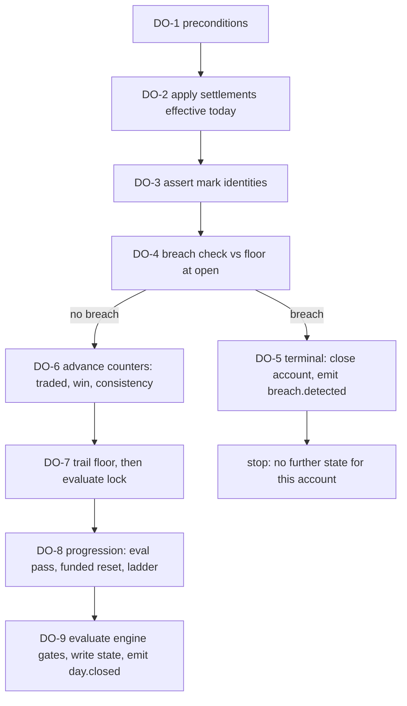
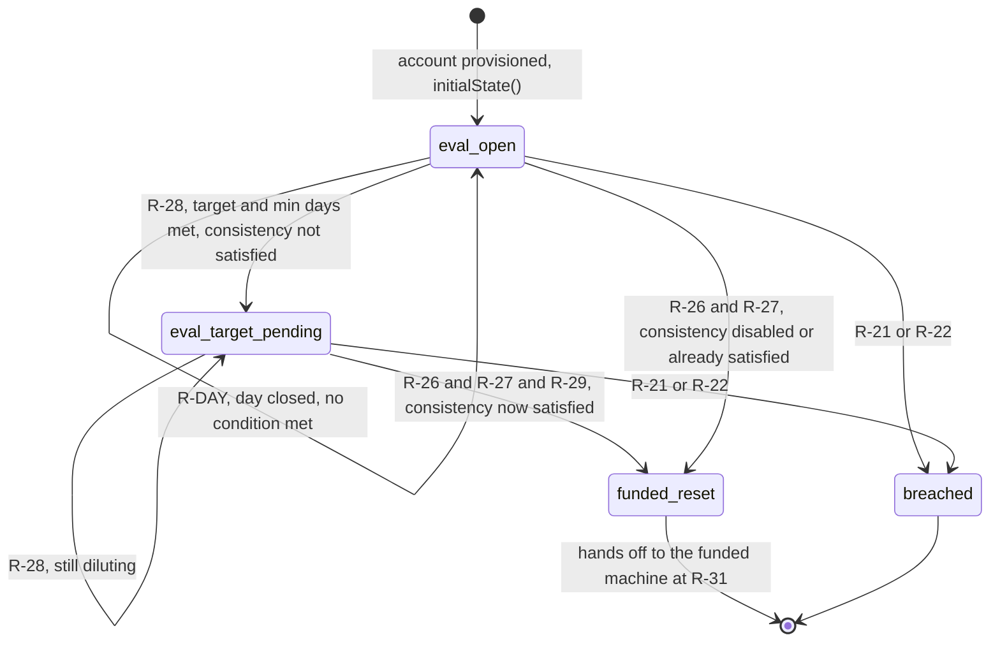
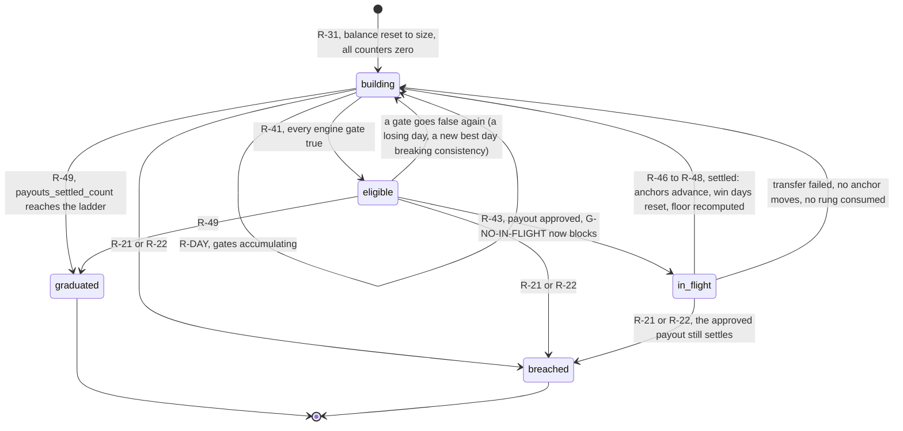
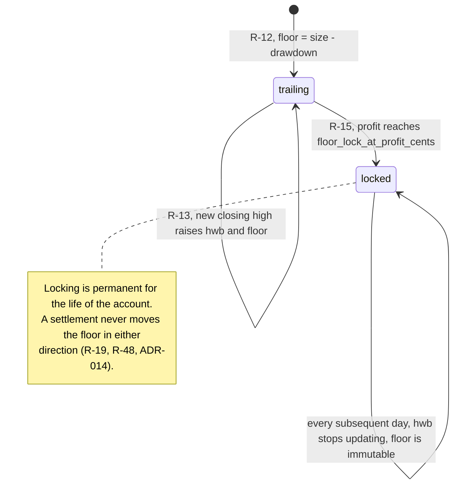

# M1: Rules Engine

**The crown jewel. Built first, with its test suite, before any UI.** Constitution section M1, Appendix B5 ten-section template, Appendix C5 escalation tier.

**Approved at the M1 gate on 2026-08-13.** All eleven open questions were ruled on; the rulings are recorded in [DECISIONS.md](../DECISIONS.md#m1-gate-closure-2026-08-13) and are folded into the body of this document rather than appended to it. Three of them changed the specification: [ADR-013](../DECISIONS.md) fixed the cadence anchor and renamed Rapid Daily to **Merit Rapid**, [ADR-014](../DECISIONS.md) removed the post-payout floor recompute and enabled the floor lock on all three plans, and [ADR-015](../DECISIONS.md) sourced the previously unspecified plan parameters and set funded minimum trading days to 0. Section 10 now records what was decided and the one question the rulings themselves raised.

This document exists to be implemented from, not interpreted from. The bar it is written to: a competent TypeScript engineer who has read [GLOSSARY.md](../GLOSSARY.md) and [DATA_MODEL.md](../architecture/DATA_MODEL.md) and nothing else about Merit can build the entire engine from this file without asking a question. Where a decision is genuinely still the founder's, it appears in section 10 and nowhere else, so the rest of the document contains no soft spots.

Every term is defined in [GLOSSARY.md](../GLOSSARY.md) and is never redefined here. Every comparison operator below is binding, is mirrored verbatim in the plan version's `copy_blocks`, and is pinned by a golden file.

**Identifier conventions used throughout:** `R-nn` rules, `INV-nn` invariants, `SD-nn` schema deltas, `CV-nn` config validation rules, `DO-n` day-order steps, `FM-nn` failure modes, `AS-nn` adversarial scenarios, `OQ-nn` open questions, `D-Mx-n` dependencies on another module. `EC-nnn` and `GS-nnn` refer to [EDGE_CASES.md](../EDGE_CASES.md) and [GOLDEN_SCENARIOS.md](../testing/GOLDEN_SCENARIOS.md).

---

## 1. Purpose and invariants

### 1.1 What this module is

`packages/rules-engine` is a **pure TypeScript library with zero I/O**. It is the only place in Merit where a rule is computed, and it is the reason the payout promise can be kept: eligibility is mechanical, so approval can be instant, so no human ever has to decide whether to pay someone.

Its whole job is one deterministic fold:

```
(pinned plan config, prior rule state, one trading day of marks, settlement facts) -> (new rule state, emitted events)
```

Run that fold over an account's whole life and you get every state the account was ever in. Run it again tomorrow and you get exactly the same states, which is what makes the [replay self-audit](../GLOSSARY.md#replay-determinism) possible and what makes an [evidence pack](../GLOSSARY.md#evidence-pack) court-grade rather than merely detailed.

### 1.2 What this module is not

Boundaries are stated as hard exclusions because every one of them is a place where the engine would stop being pure.

| Not M1 | Whose job | Why the boundary is here |
|---|---|---|
| Reading or writing the database | M2 batch, M5 API | Purity. The engine receives values and returns values |
| Deciding what a fill is worth | M2 | Tick math lives with `contract_specs`. The engine contains **no symbol-aware logic at all**, so a new contract can never be an engine change (EC-025) |
| Computing daily marks from fills | M2 | Marks are the engine's input, never its output |
| Moving money or posting ledger entries | M5 | The engine computes the split legs as numbers; posting them is M5's transaction |
| Talking to Rise, Rithmic, or a PSP | M2, M5 | Zero I/O |
| Deciding whether to freeze or enforce | M7, admin | The engine is told the account is frozen; it never decides it |
| Detecting abuse | M7 | The engine produces the signals a detector reads. It never raises a flag |
| Scheduling anything | worker | The engine has no clock. It cannot know what time it is |

### 1.3 Package layout and public surface

```
packages/rules-engine/
  src/
    index.ts                  # the public surface below, and nothing else is exported
    types.ts                  # every input and output type, all money as bigint
    plan/resolve.ts           # rules JSON + materialized size row -> ResolvedPlan
    plan/validate.ts          # CV-01..CV-16, run at publish time
    calendar.ts               # pure calendar queries over an injected calendar slice
    day/advance.ts            # DO-1..DO-9, the single day fold
    day/breach.ts             # R-21..R-25
    day/floor.ts              # R-12..R-20
    day/counters.ts           # R-33..R-36
    payout/gates.ts           # R-33..R-41
    payout/clamp.ts           # R-42..R-45
    payout/settle.ts          # R-46..R-50, also used by replay
    replay.ts                 # fold over a whole account life
    hash.ts                   # canonical serialization and state hashing
  fixtures/                   # golden files, see GOLDEN_SCENARIOS.md section 2
  test/
```

The public surface is six functions. Nothing else is exported, because every additional export is a way for a caller to reimplement a rule slightly differently.

```ts
export function resolvePlan(rules: PlanRulesJson, size: PlanVersionSizeRow): ResolvedPlan;
export function validatePlan(rules: PlanRulesJson, sizes: PlanVersionSizeRow[]): ValidationResult;
export function initialState(plan: ResolvedPlan, openedOn: TradingDay): RuleState;
export function advanceDay(input: DayInput): DayOutput;
export function applySettlement(state: RuleState, plan: ResolvedPlan, fact: SettlementFact): SettlementOutput;
export function evaluatePayout(state: RuleState, plan: ResolvedPlan, ctx: PayoutContext): PayoutEvaluation;
```

`evaluatePayout` is what both `GET /accounts/:id/eligibility` and `POST /accounts/:id/payout` call. They call the identical function with the identical inputs, which is why the number the trader is shown and the number they receive can never differ (R-43).

### 1.4 The determinism contract

Determinism is not a property we hope for. It is a property we enforce, because [replay](../GLOSSARY.md#replay-determinism) is a production job that pages, and a flaky engine would page nightly until someone disabled the alarm, at which point Merit would have a silent rules engine.

**Banned constructs inside `packages/rules-engine`, enforced by ESLint rules and a dependency check in CI:**

| Banned | Why | Replacement |
|---|---|---|
| `Date.now()`, `new Date()`, any wall-clock read | The engine has no clock. A rule that depends on "now" is not replayable | Trading days arrive as inputs |
| Any timezone-dependent date parsing or formatting | The same input would evaluate differently under a different `TZ` | `TradingDay` is an opaque `YYYY-MM-DD` string; ordering comes from the injected calendar |
| `Math.random()`, any entropy | Obvious | Nothing needs it |
| `number` for money, `float`, `numeric`, decimal libraries | IEEE 754 loses cents, and a decimal library hides the loss behind a type | `bigint`, everywhere, at every boundary |
| `Intl`, locale-sensitive `toLocaleString`, locale collation | Output would depend on the host | Formatting happens at the presentation layer, never here |
| `fs`, `net`, `http`, `crypto` beyond a pure hash, any import with side effects | Purity | Inputs are values |
| Iteration over an object's keys where the result affects output | Key order is insertion order and can drift with a refactor | Explicit ordered arrays, and canonical serialization in `hash.ts` |
| `Array.prototype.sort` without a total comparator | Sort stability differences change output | Every sort has an explicit total order, usually `trading_day` then `id` |
| Mutation of an input | Aliasing bugs are non-deterministic in practice | All functions return new values; inputs are `readonly` |

**Enforcement, not advice:** `RE-D-01` is a test that stubs `globalThis.fetch`, `Date`, and `Math.random` to throw and runs the entire golden suite. `RE-D-02` runs the suite under `TZ=Asia/Kolkata` with a non-English locale and diffs the output against the default run. `RE-D-03` is a dependency-graph assertion that the package's transitive imports contain no Node builtins. All three are merge blockers.

### 1.5 Invariants

Each is enforced somewhere real. "Enforced by review" is not an entry in this table.

| ID | Invariant | Enforcement |
|---|---|---|
| INV-01 | The engine performs no I/O and reads no clock | RE-D-01, RE-D-03, ESLint |
| INV-02 | All money is `bigint` integer cents at every boundary | Types plus a lint rule banning `number` in money-suffixed fields |
| INV-03 | All ratios are integer basis points, compared by cross-multiplication, never division | RE-U-029, code review against R-29 |
| INV-04 | Replaying every mark from day one reproduces stored state byte-identically | Nightly self-audit job, GS-071, Appendix B |
| INV-05 | `withdrawable_cents >= 0` always | Formula floors at zero (R-35), check constraint, property RE-P-05 |
| INV-06 | The floor never decreases. No exception, no phase qualifier, no settlement carve-out ([ADR-014](../DECISIONS.md)) | Property RE-P-01, GS-010, GS-081 |
| INV-07 | A locked floor never changes again for the life of the account | Property RE-P-02, GS-016 |
| INV-08 | The win-day count never decreases except when the payout anchor advances | Property RE-P-03 |
| INV-09 | The traded-day count never decreases | Property RE-P-04 |
| INV-10 | `approved_cents = min(effective_request, cap, withdrawable)` and `approved_cents >= min_payout_cents` | R-43, check constraint, property RE-P-07 |
| INV-11 | `trader_cents + firm_cents == approved_cents` exactly, no cents lost | R-44, check constraint, GS-029 |
| INV-12 | Breach is terminal: no state advances after it | Property RE-P-10, GS-063 |
| INV-13 | Phase moves only eval to funded to closed or graduated, never backwards | Property RE-P-11 |
| INV-14 | Applying the same trading day twice is a no-op on state | Property RE-P-13, GS-047 |
| INV-15 | `engine_eligible == AND(every engine gate)` with no shortcut path | Property RE-P-15 |
| INV-16 | An account's `plan_version_id` is an input and is never chosen by the engine | Type signature, update trigger on the table |
| INV-17 | Lifetime settled extraction per account `<= ladder_count * max cap in the schedule` | Property RE-P-17, the liability bound |
| INV-18 | `mark.opening_balance_cents == prior.balance_cents + mark.adjustment_cents` | Asserted at DO-3, violation raises reconciliation (EC-047) |
| INV-19 | `mark.closing_balance_cents == mark.opening_balance_cents + mark.realized_pnl_cents` | Asserted at DO-3 |
| INV-20 | The first funded mark opens at exactly `size_cents` | Asserted at DO-3 on the phase-transition boundary, GS-070 |
| INV-21 | A settled payout can never breach the account that earned it | Derived from CV-11 (lock enabled) and CV-17 (lock disabled), GS-065, GS-083 |
| INV-22 | No settled payout's `eligibility_snapshot` is ever rewritten, by replay, by correction, or by an engine upgrade | Append-only grant, Appendix B protocol, GS-074 |
| INV-23 | Context gates (frozen, recon, KYC, in flight) never enter the replayed state or its hash | SD-06, Appendix B |
| INV-24 | The engine emits events but never commands: nothing it returns moves money by itself | Output type carries facts only; M5 posts the ledger |

---

## 2. Entities and schema deltas

### 2.1 Inputs

```ts
type TradingDay = string;              // "YYYY-MM-DD", an exchange trading day, never a UTC date
type Cents = bigint;
type Bp = number;                      // integer basis points, 0..10000, safe as a JS number

interface CalendarDay {
  tradingDay: TradingDay;
  isHalfDay: boolean;
  halted: boolean;
  sequence: number;                    // dense index into the calendar; gap counting is subtraction, never date math
}

interface DailyMark {                  // exactly the live row from daily_marks
  tradingDay: TradingDay;
  openingBalanceCents: Cents;
  closingBalanceCents: Cents;
  highBalanceCents: Cents;
  lowBalanceCents: Cents;
  realizedPnlCents: Cents;             // signed, from fills only
  adjustmentCents: Cents;              // signed, non-trading movements, applied between sessions (SD-01)
  fillCount: number;
  sourceHash: string;
}

interface SettlementFact {
  payoutRequestId: string;
  ordinal: number;                     // = payouts_settled_count + 1 at request time (R-45)
  approvedCents: Cents;
  basisTradingDay: TradingDay;         // what the decision was computed against
  effectiveTradingDay: TradingDay;     // first trading day whose opening balance reflects the withdrawal (SD-03)
}

interface ExternalGates {              // context, never replayed (INV-23)
  accountStatus: 'active' | 'breached' | 'expired' | 'closed_admin' | 'closed_chargeback' | 'graduated';
  kycState: 'kyc_required' | 'pending' | 'verified' | 'rejected' | 'expired';
  payoutsFrozen: boolean;              // account level OR identity level, resolved by the caller
  reconBlocked: boolean;
  hasPayoutInFlight: boolean;          // approved | transferring | frozen exists for this account
}

interface DayInput {
  engineVersion: string;
  plan: ResolvedPlan;
  prior: RuleState | null;             // null only on the account's first trading day
  mark: DailyMark;
  calendar: CalendarDay;
  settlements: readonly SettlementFact[];   // those whose effectiveTradingDay == mark.tradingDay
}
```

### 2.2 Outputs

```ts
interface RuleState {                  // one row of rule_states, the whole fold accumulator
  tradingDay: TradingDay;
  phase: 'eval' | 'funded' | 'closed' | 'graduated';
  balanceCents: Cents;
  floorOpenCents: Cents;               // the floor this day's breach check compared against (SD-04)
  floorCents: Cents;                   // the floor carried into the next day
  floorLocked: boolean;
  highWaterBalanceCents: Cents;
  withdrawableCents: Cents;
  tradedDaysCount: number;             // phase scoped
  winDaysCount: number;                // anchor scoped
  consistencyBestDayCents: Cents;
  consistencyPeriodProfitCents: Cents;
  consistencyPeriodStartDay: TradingDay | null;   // SD-07
  payoutsSettledCount: number;
  payoutAnchorDay: TradingDay | null;             // basis day of the last settled payout (SD-02)
  cadenceAnchorDay: TradingDay | null;            // effective day of the last settled payout (SD-02)
  lifetimeSettledCents: Cents;
  engineEligible: boolean;                        // engine gates only (SD-06)
  engineGates: EngineGateResults;
  breached: boolean;
  breachKind: 'trailing_eod_floor' | 'static_floor' | 'hard_daily_loss_limit' | null;
  engineVersion: string;
  stateHash: string;                              // canonical hash of everything above except engineVersion (SD-08)
}

interface DayOutput {
  state: RuleState;
  events: readonly EngineEvent[];      // facts, in emission order, see section 5
  assertions: readonly AssertionFailure[];  // INV-18 to INV-20 breaches, raise reconciliation, do not throw
}

interface PayoutEvaluation {
  asOfTradingDay: TradingDay;
  engineEligible: boolean;
  contextEligible: boolean;
  eligible: boolean;                   // engineEligible && contextEligible
  gates: FullGateResults;              // engine gates plus context gates, the API_CONTRACT shape
  maxPayoutCents: Cents;               // min(withdrawable, cap), 0 when not eligible
  capCents: Cents;
  ordinal: number;
  clamp?: { effectiveRequestCents: Cents; approvedCents: Cents; reason: ClampReason;
            traderCents: Cents; firmCents: Cents; splitBp: Bp };
}
```

### 2.3 Schema deltas against the approved DATA_MODEL

[DATA_MODEL](../architecture/DATA_MODEL.md) is `approved` as of the Wave 2 gate, so these are proposed amendments, folded in as a reviewed migration when this plan is approved. Each one exists because a rule above cannot be computed or proved without it.

| ID | Table | Change | Why it is not optional |
|---|---|---|---|
| SD-01 | `daily_marks` | add `adjustment_cents bigint not null default 0` | Non-trading balance movements (a settled withdrawal today, a promotional credit later) must be distinguishable from trading P&L, or a payout looks like a catastrophic loss and breaches the account that earned it (EC-034). Also makes INV-18 checkable |
| SD-02 | `rule_states` | replace `last_payout_trading_day` with `payout_anchor_day date` **and** `cadence_anchor_day date` | The two anchors are genuinely different dates and conflating them is a silent liability change of 40 percent (EC-039). `payout_anchor_day` is the last settled payout's basis day and resets win days and the consistency period. `cadence_anchor_day` is that payout's effective day and drives the gap |
| SD-03 | `payout_requests` | add `settled_trading_day date` and `effective_trading_day date` | Replay must not depend on a wall clock. Storing the trading days the settlement attached to makes the fold deterministic years later |
| SD-04 | `rule_states` | add `floor_open_cents bigint not null` | The evidence pack must be able to show **which** floor a breach decision compared against, not just the floor that survived the day (EC-035) |
| SD-05 | `payout_requests` | change `unique (account_id, payout_ordinal)` to `unique (account_id, payout_ordinal) where status <> 'failed'` | A failed transfer must not consume a ladder rung or advance the cap schedule (EC-037) |
| SD-06 | `rule_states` | rename `eligible` to `engine_eligible`; split `gate_results` into `engine_gates jsonb` and `context_gates jsonb` | Freeze, recon, KYC, and in-flight are not replayable: they were true on the day and may not be true now. Mixing them into the replayed state guarantees nightly false divergences (INV-23) |
| SD-07 | `rule_states` | add `consistency_period_start_day date` | Derivable, but storing it makes `gate_results` self-describing in the portal and the evidence pack, and turns a class of off-by-one bugs into a visible field (EC-045) |
| SD-08 | `rule_states` | add `state_hash bytea not null` | Replay compares hashes first and diffs fields only on mismatch. Without it, the nightly audit is a full field-by-field comparison of roughly 1.25M rows |
| SD-09 | `payout_requests` | add unique partial index on `(account_id) where status in ('approved','transferring','frozen')` | Enforces G-NO-IN-FLIGHT in the database, because the engine is not the only writer (EC-040) |
| SD-10 | `plan_version_sizes` | add `floor_lock_at_profit_cents` and `floor_lock_floor_at_cents` as **not null when `drawdown.lock.enabled`** | Already present as nullable columns; the delta is the conditional not-null check, so an enabled lock can never be published without its values |

### 2.4 The plan config contract

The engine reads two things and never anything else: `plan_versions.rules` for structure and `plan_version_sizes` for every cents value. **No percentage is ever applied to a money value at runtime.** That single rule is what makes the marketing page and the engine agree to the cent, because both read the same materialized number.

**Publish-time validation.** `validatePlan` runs in `POST /admin/plans/versions/:id/publish` and blocks the publish. A config that reaches an account is a config that already passed all of these.

| ID | Rule | Rejected because |
|---|---|---|
| CV-01 | `drawdown.type` must be `trailing_eod` or `static` | `intraday_trailing` is config-supported and deliberately unimplemented in v1. Publishing it must fail loudly, never compute something plausible (GS-078) |
| CV-02 | `drawdown_cents > 0` | A zero drawdown means the floor is the balance and every losing tick breaches |
| CV-03 | `profit_target_cents > 0` when `phase_eval.enabled` | An eval with no target passes on day one |
| CV-04 | `phase_eval.min_trading_days >= 1` | |
| CV-05 | `win_days.required_count >= 1` and `win_day_floor_cents > 0` | A zero floor makes every traded day a win day, including losing ones, since `0 >= 0` |
| CV-06 | `0 < consistency.max_day_share_bp <= 10000` when enabled | 0 bp is unsatisfiable, above 10000 bp is meaningless (GS-077) |
| CV-07 | `buffer_cents >= 0` | |
| CV-08 | `cadence_gap_trading_days >= 0` | |
| CV-09 | `payout_cap_schedule` is non-empty, starts at `from_ordinal: 1`, ordinals strictly increase, every `cap_cents > 0` | A gap in the schedule leaves an ordinal with no cap |
| CV-10 | every `cap_cents >= min_payout_cents` | Otherwise no payout at that rung can ever satisfy the minimum, and the account is permanently ineligible while looking healthy (GS-076) |
| CV-11 | when `drawdown.lock.enabled`, `buffer_cents > (floor_lock_floor_at_cents - size_cents)` | Half of INV-21. Since the floor never exceeds `floor_lock_floor_at_cents` while the lock is enabled (pre-lock it is strictly below by CV-12, post-lock it equals it), and a post-payout balance is always at least `size + buffer`, this inequality is what stops a payout from breaching the account that earned it. Load bearing since [ADR-014](../DECISIONS.md) removed the post-payout reset |
| CV-12 | when `drawdown.lock.enabled`, `floor_lock_at_profit_cents == drawdown_cents + (floor_lock_floor_at_cents - size_cents)` | Forces the lock to engage exactly where the trailing floor already sits, so the floor never jumps. See R-15 |
| CV-13 | `0 < split_bp <= 10000` | |
| CV-14 | `ladder.payouts_to_graduate >= 1` | |
| CV-15 | `min_payout_cents == 10000` | Fixed by GLOSSARY and never scaled by size. Stated as validation so a well-meaning config edit cannot quietly move it |
| CV-16 | `daily_loss_limit.type` in `none`, `soft`, `hard`, and `daily_loss_limit_cents` present when not `none` | |
| CV-17 | when `drawdown.type = "trailing_eod"` and **not** `drawdown.lock.enabled`, every `cap_cents` in the schedule `< drawdown_cents` | The other half of INV-21, and it exists only because [ADR-014](../DECISIONS.md) removed the post-payout reset. Without a reset the floor stays put while a payout drops the balance, so a payout taken on a new closing high moves the balance down by `cap` against a floor sitting `drawdown` below the same high. If `cap >= drawdown`, **the payout breaches the account that earned it.** No v1 plan can reach this (all three enable the lock, and CV-11 covers that case), which is exactly why it has to be validated rather than remembered (GS-083) |
| CV-18 | `post_payout_floor_rule.mode == "none"` | The key is retired but retained, per [ADR-014](../DECISIONS.md). Stated as validation for the same reason as CV-15: a well-meaning config edit must not be able to quietly reintroduce a floor recompute that no rule, test, or published copy accounts for |
| CV-19 | `phase_funded.min_trading_days >= 0`, and **0 means the gate is disabled** and reports `pass: true, skipped: true` | [ADR-015](../DECISIONS.md) sets it to 0 on all three plans. A disabled gate must be visibly disabled in the eligibility breakdown, using the same `skipped` shape as the consistency denominator rule, so no trader or support agent ever sees a gate that reads as satisfied when it was never evaluated (GS-080) |

**Publish-diff messages are typed.** They do not block, and they are **not all the same kind of thing**, which matters because a diff whose every line says "warning" trains its reader to skim. Two severities:

| Severity | Meaning | Reader's job |
|---|---|---|
| `info` | The configuration is intentional and worth seeing | Note it |
| `warning` | A gate is present that cannot do anything | Confirm it is not published as a protection |

| ID | Condition | Severity | Message |
|---|---|---|---|
| PW-01 | `required_win_days >= min_trading_days` | `warning` | "The minimum-trading-days gate is dominated by the win-day gate and can never bind." EC-042. Fires on all three v1 plans by design |
| **PW-02a** | `min_settlement_lag + cadence_gap == required_win_days` | **`info`** | "**Cadence gap and win-day gate co-bind at N trading days.** Both are load bearing; changing either changes the plan's cadence." Fires on Core EOD and Direct |
| **PW-02b** | `min_settlement_lag + cadence_gap < required_win_days` | **`warning`** | "**The cadence gap is dominated by the win-day gate and can never bind.** It must not be published as a protection or as the reason the plan is fast." EC-049. Fires on Merit Rapid |
| PW-03 | `cap_cents > buffer_cents` | `info` | "The first payout leaves less cushion than the plan implies." Fires on Core EOD |
| PW-04 | `cadence_gap_trading_days == 0` and `required_win_days <= 1` | `warning` | "Approaching uncapped daily extraction." AS-01 |

**PW-02 was one message and is now two, ruled at the batch 1 gate.** [ADR-019](../DECISIONS.md) drove `min_settlement_lag_trading_days` to 0, which made the old single comparison fire on all three plans at once while meaning two genuinely different things. A tie is not a redundancy: on Core EOD and Direct the gap and the win-day gate both bind at 5 trading days and either one moving changes the cadence, which is information. On Merit Rapid the gap is 1 against 3 and can never bind, which is a defect in waiting the moment someone writes copy about it. **Emitting one message for both would produce three identical-looking warnings, two of them false positives, on every publish**, which is [AS-M6-02](M06-admin-ops-console.md)'s credibility failure arriving at a publish gate instead of a circuit breaker.

**The two anchors are why the cadence warning needs a settlement term, and [ADR-019](../DECISIONS.md) has now driven that term to zero.** Win days count from the payout's **basis** day (R-47) and the cadence gap counts from the **wallet-credit** day (R-37). Under the Merit Wallet the internal leg is instant, so the wallet-credit day *is* the basis day, the two gates are measured from the same origin, and **`min_settlement_lag_trading_days` takes the v1 value 0**. It remains a published configuration constant rather than a literal in engine code, for the same reason it always was: a future change to the settlement model re-runs this comparison instead of quietly invalidating it.

**The consequence, stated because it changes which plans carry the warning.** M01 previously recorded that "at an instant rail the constant is 0 and the warning correctly begins to fire on Core EOD as well". That is now the live case. The comparison is `0 + gap <= required_win_days`, so it fires on **Merit Rapid** (`0 + 1 <= 3`) and on **Core EOD** (`0 + 5 <= 5`), and on Direct identically to Core. On Core EOD and Direct the gap and the win-day gate co-bind at exactly 5 trading days rather than one dominating the other, which is a warning worth seeing in the publish diff but is not the EC-049 pathology: a gate that ties is not a gate that does nothing. On Merit Rapid the gap is genuinely dominated and EC-049 stands.

**Why these are warnings and not errors.** A dominated gate is not wrong, it is inert, and a future plan may want it inert. What is unacceptable is publishing it as a protection. The warning exists so the publish diff makes the founder look at it, and the rule that follows from it is a marketing rule rather than an engine rule: **copy may not describe a dominated gate as a constraint.**

---

## 3. State machines and the complete rule taxonomy

### 3.1 The day evaluation pipeline

Ordering is the single most load-bearing thing in this document. Constitution M1 fixes it as "mark ingest, then breach check, then progression", and the steps below are that sentence made unambiguous. **A day is evaluated exactly once, in exactly this order, and no step may be reordered for performance.**



| Step | What happens | Rules |
|---|---|---|
| DO-1 | Reject unless: the account is open, `mark.tradingDay` is a calendar trading day, no live state exists for that day already (idempotence, INV-14), and `mark.tradingDay > prior.tradingDay` | R-02, R-06 |
| DO-2 | For each settlement whose `effectiveTradingDay` equals today, call `applySettlement` in ordinal order. This reduces the balance, advances both anchors, increments `payoutsSettledCount`, resets win days and the consistency period, and may graduate the account. **It does not touch the floor** ([ADR-014](../DECISIONS.md), R-19, R-48) | R-46 to R-50 |
| DO-3 | Assert INV-18, INV-19, INV-20. A failure does not throw: it returns an `AssertionFailure`, the batch raises reconciliation, and **no state is written for the day** | R-07, R-10 |
| DO-4 | Compare `mark.lowBalanceCents` against `state.floorCents` carried from the previous day, which is written to `floorOpenCents`. Then the hard daily loss limit, if configured | R-18, R-21, R-22 |
| DO-5 | On breach: phase to `closed`, `breached = true`, emit `breach.detected`. Nothing after this runs. Breach beats every pass, target, and eligibility condition that the same day might also satisfy | R-24, R-25 |
| DO-6 | `tradedDaysCount += mark.fillCount > 0 ? 1 : 0`. `winDaysCount += win_day && !halted ? 1 : 0`. Consistency accumulators updated if the day is inside the current period | R-08, R-09, R-04 |
| DO-7 | `hwb = max(hwb, closingBalanceCents)`, then `floor = hwb - drawdownCents` for trailing, then the lock test. Order matters: trailing then locking, never the reverse | R-13, R-15 |
| DO-8 | Eval: test the pass condition and either pass (applying the funded reset in the same step) or defer. Funded: test the ladder, which can also fire here if a settlement graduated the account | R-26 to R-31, R-49 |
| DO-9 | Evaluate every engine gate, compute `engineEligible`, compute `stateHash`, emit `day.closed` with the full payload | R-33 to R-41 |

### 3.2 Eval phase machine



`eval_target_pending` is a real state and not a formality: it is the state a trader sits in while an [eval consistency](../GLOSSARY.md#eval-consistency) violation dilutes. **An eval consistency violation never fails an account.** It delays the pass, the trader keeps trading, and every day the engine re-tests. The account can move back to `eval_open` implicitly if a losing day drops it under the target, and can return again; this is not a state change worth drawing because the pass test is stateless and re-evaluated from scratch each day (R-26).

### 3.3 Funded phase machine



Two transitions deserve their own sentence because they are where money and fairness meet.

**`eligible` back to `building` is normal and must never be presented as a punishment.** Eligibility is a property of the current state, not a token that is earned and held. A trader who is eligible on Tuesday and has a losing Wednesday is not eligible on Wednesday, and the portal says exactly which gate moved.

**`in_flight` to `breached` still pays.** If an account breaches after a payout is approved but before it settles, the payout settles anyway. The eligibility snapshot was true when it was taken, the money was already the trader's under the rules as published, and clawing it back would be exactly the behavior that kills payout trust. The account closes; the transfer completes.

### 3.4 Floor machine



For a `static` drawdown the machine has one state: `floor = size - drawdown`, forever (R-16).

**The whole floor, in one expression** ([ADR-014](../DECISIONS.md)). Every rule in group C is a consequence of this and of the fact that `hwb` stops updating at the lock:

```
floor(d) = max( hwb(d) - drawdown_cents ,
                floorLocked ? floor_lock_floor_at_cents : size_cents - drawdown_cents )
```

The `max` is redundant given the update order (trailing only raises, and the lock freezes `hwb` exactly where the trailing floor already equals the locked value, by CV-12). It is written this way because it is the founder's binding formulation, because it makes INV-06 self-evident rather than derived, and because a reader who is trying to break the engine should be able to see in one line that **no term in the floor can ever go down.** A settlement appears nowhere in it, which is the entire content of the OQ-5 ruling.

### 3.5 The complete rule taxonomy

Fifty rules. Every one carries its config field, its exact arithmetic in integer cents, its comparison operator, and the golden file that pins its boundary. **The operator column is the contract**: it is what the engine executes, what `copy_blocks` publishes, and what the fixture asserts. All three or none.

#### Group A: time and calendar

| ID | Rule | Config | Arithmetic and operator | Pinned by |
|---|---|---|---|---|
| R-01 | A fill belongs to the trading day whose session contains its execution timestamp | `trading_calendar` | Session containment lookup. Never a UTC date cast | GS-001, GS-030 |
| R-02 | Counters advance only on trading days, and advance whether or not the trader traded | `trading_calendar` | Gap counting is `calendar.sequence` subtraction, never date arithmetic | GS-002 |
| R-03 | A half day is a full trading day for every counter | `is_half_day` | No effect on any comparison | GS-003, GS-032 |
| R-04 | On a halted session, day counters advance and win days do not | `halted` | `winDaysCount += (win_day && !halted) ? 1 : 0` | GS-004, GS-031 |
| R-05 | Session bounds are stored UTC instants derived from CT session definitions | `trading_calendar` | DST is data. No arithmetic anywhere converts a timezone | GS-030 |
| R-06 | Every evaluation is against the last closed day and nothing more recent | n/a | The engine only ever sees closed days | GS-035 |

#### Group B: marks

| ID | Rule | Config | Arithmetic and operator | Pinned by |
|---|---|---|---|---|
| R-07 | Mark identity, opening | n/a | `opening == prior.balance + adjustment` (INV-18). Failure raises reconciliation, never a computed guess | EC-047 |
| R-08 | Traded day | n/a | `fill_count > 0` (strict `>`) | GS-005 |
| R-09 | Win day | `win_days.floor_bp` to `win_day_floor_cents` | `realized_pnl_cents >= win_day_floor_cents` (`>=`, so exactly at the floor counts) | GS-006, GS-007 |
| R-10 | Non-trading balance movements are applied between sessions and carried in `adjustment_cents` | n/a | The withdrawal lands at the open of `effectiveTradingDay`, never inside a session | GS-065, D-M2-2 |
| R-11 | The engine reads only live marks | `superseded_by is null` | A correction supersedes and replay recomputes forward | GS-034 |

#### Group C: floor and drawdown

| ID | Rule | Config | Arithmetic and operator | Pinned by |
|---|---|---|---|---|
| R-12 | Initial floor | `drawdown.amount_bp` to `drawdown_cents` | `floor = size_cents - drawdown_cents` at account open, and again at the funded reset with the funded drawdown | GS-008 |
| R-13 | Trailing-EOD floor | `drawdown.type = "trailing_eod"` | `hwb' = max(hwb, closing_balance_cents)`; `floor' = hwb' - drawdown_cents`. Uses the **closing** balance only; the intraday high never raises it. `hwb` stops updating once `floorLocked` | GS-009, GS-011 |
| R-14 | The floor never retreats | n/a | Follows from `max`. Asserted separately because it is the property a future change is most likely to break, and since [ADR-014](../DECISIONS.md) it has **no exceptions at all** | GS-010, GS-081 |
| R-15 | Floor lock | `drawdown.lock.*` to `floor_lock_at_profit_cents`, `floor_lock_floor_at_cents` | Trigger: `closing_balance_cents - size_cents >= floor_lock_at_profit_cents` (`>=`). Effect: `floor = floor_lock_floor_at_cents`, `floorLocked = true`, `hwb` frozen, all permanently. CV-12 forces the trigger to sit exactly where the trailing floor already is, so **the floor never jumps**. Enabled on all three v1 plans at `floor_lock_floor_at_cents = size_cents + 10,000c` ([ADR-014](../DECISIONS.md)) | GS-015, GS-016 |
| R-16 | Static drawdown | `drawdown.type = "static"` | `floor = size_cents - drawdown_cents` for the life of the account | RE-U-016 |
| R-17 | Intraday trailing is config-supported and unimplemented | `drawdown.type = "intraday_trailing"` | Rejected at publish by CV-01 | GS-078 |
| R-18 | The breach comparator is the floor **at the open** | n/a | `floorOpenCents = prior.floorCents`. Trailing happens at DO-7, strictly after the breach check at DO-4 | GS-012 |
| R-19 | **There is no post-payout floor recompute** | `post_payout_floor_rule.mode = "none"`, CV-18 | A settled payout reduces `balanceCents` and changes nothing else about the floor: `floorCents`, `highWaterBalanceCents`, and `floorLocked` all carry through untouched. The trader's loss room after an extraction is therefore the [buffer](../GLOSSARY.md#buffer), or the buffer minus the lock offset once locked, and that is what the rules page must say ([ADR-014](../DECISIONS.md)) | GS-081, GS-065, RE-U-019 |
| R-20 | The auto-liquidation setpoint pushed to the platform equals the current floor | n/a | Re-pushed whenever the floor moves. A clean liquidation lands exactly on the floor and survives; slippage below it breaches. Since [ADR-014](../DECISIONS.md) the floor only ever moves **up**, so a stale setpoint is always too permissive rather than too strict, which is the safe direction for the trader and a bounded, measurable cost to the firm (D-M2-3) | GS-013, GS-014, D-M2-3 |

#### Group D: breach

| ID | Rule | Config | Arithmetic and operator | Pinned by |
|---|---|---|---|---|
| R-21 | Floor breach | n/a | `low_balance_cents < floorOpenCents` (**strict `<`**, touching the floor is not a breach) | GS-013, GS-014 |
| R-22 | Hard daily loss limit | `daily_loss_limit.type = "hard"` | `-realized_pnl_cents > daily_loss_limit_cents` (**strict `>`**, a loss exactly at the limit survives). Aligned with R-21's strict `<` at the M1 gate (OQ-6), **amending the approved STATE_MACHINES G-BREACH guard**, which carried `>=`. Published as "more than". No v1 plan configures a daily loss limit | RE-U-022, GS-079 |
| R-23 | Soft daily loss limit | `daily_loss_limit.type = "soft"` | Never a breach. The engine emits a fact; Rithmic performs any enforcement | RE-U-023 |
| R-24 | Breach is terminal and immediate | n/a | Phase to `closed`, no further state is ever written for the account | GS-063, INV-12 |
| R-25 | Breach beats everything on the same day | n/a | Ordering law DO-4 before DO-8. No `phase.passed`, no eligibility, no graduation | GS-063, GS-064 |

#### Group E: evaluation phase

| ID | Rule | Config | Arithmetic and operator | Pinned by |
|---|---|---|---|---|
| R-26 | Profit target | `phase_eval.profit_target_bp` to `profit_target_cents` | `closing_balance_cents - size_cents >= profit_target_cents` (`>=`) | GS-017, GS-018 |
| R-27 | Minimum trading days, eval | `phase_eval.min_trading_days` | `tradedDaysCount >= min_trading_days` (`>=`) | RE-U-027 |
| R-28 | Eval consistency is evaluated at pass time only and is dilutable | `phase_eval.consistency.*` | Tested only on days where R-26 and R-27 already hold. Failing defers the pass and emits `phase.pass_deferred_consistency`. **It never fails an account** | GS-020 |
| R-29 | Consistency arithmetic | `consistency.max_day_share_bp` | `best_day_cents * 10000 <= max_day_share_bp * period_profit_cents`. Integer cross-multiplication in `bigint`. **No division exists anywhere in the engine** | GS-023, GS-024 |
| R-30 | Consistency denominator rule | n/a | Skipped entirely unless `period_profit_cents > 0` (strict `>`). A skipped gate reports `pass: true, skipped: true` | GS-021, GS-022 |
| R-31 | Eval pass effects | n/a | Phase to `funded`; `balance = size_cents`; `hwb = size_cents`; `floor = size_cents - funded drawdown_cents`; traded days, win days, and consistency accumulators to zero; `consistencyPeriodStartDay = the day after the pass day`. **Eval profit is not carried into the funded phase** | GS-019, GS-070 |
| R-32 | Eval expiry | `phase_eval.max_days` | `null` in all v1 plans, so unreachable. When set, elapsed trading days `>` the limit expires the account | RE-U-032 |

**R-31 is the single largest trader-facing fact in this document.** A funded account starts at the account size and the eval profit is gone. It is why the [buffer](../GLOSSARY.md#buffer) gate has anything to work on, why the funded time gates can do their job of letting reversion happen before cash leaves, and why an eval pass is a qualification rather than a payday. It must be stated in plain language on the rules page, on the eval progress card, and in the pass email, because a trader who discovers it at the moment of passing will tell everyone. See OQ-2.

#### Group F: funded gates

Every gate is evaluated independently and reported gate by gate. `engineEligible` is the conjunction of the engine gates; the context gates are combined at read time (INV-23).

| ID | Gate | Config | Arithmetic and operator | Pinned by |
|---|---|---|---|---|
| R-33 | Minimum trading days | `phase_funded.min_trading_days` | `tradedDaysCount >= min_trading_days` (`>=`), counted from the funded reset, not from account open. **Configured 0 on all three v1 plans, which disables the gate**: it reports `pass: true, skipped: true` and is rendered as disabled rather than as satisfied (CV-19, [ADR-015](../DECISIONS.md)) | RE-U-033, GS-080 |
| R-34 | Win days | `win_days.required_count` | `winDaysCount >= required_count` (`>=`), counted over trading days strictly after `payoutAnchorDay` | GS-006, GS-053 |
| R-35 | Buffer and withdrawable | `buffer_bp` to `buffer_cents` | `withdrawable = max(0, balance_cents - size_cents - buffer_cents)`. The buffer is permanent and is never withdrawable | GS-025 |
| R-36 | Funded consistency | `phase_funded.consistency.*` | R-29 arithmetic over the period defined by R-47. Payout-gated: failing **delays** eligibility and never breaches, never denies retroactively | GS-024 |
| R-37 | Cadence gap | `cadence_gap_trading_days` | `count(trading days d : cadenceAnchorDay < d <= basisDay) >= cadence_gap_trading_days` (`>=`), computed by `calendar.sequence` subtraction. **`cadenceAnchorDay` is the last settled payout's wallet-credit day** ([ADR-019](../DECISIONS.md)), which is the same trading day as its basis day because the internal leg is instant. This **supersedes [ADR-013](../DECISIONS.md)'s effective-day anchor**; the two-anchor structure is unchanged and the two anchors now coincide. Passes trivially when it is null (no gap on the first payout). On any plan where `cadence_gap_trading_days <= required_win_days` this gate is **dominated** by R-34 and never binds (EC-049) | GS-059, GS-082, EC-039 |
| R-38 | One payout in flight | n/a | **Applies to the external leg only** ([ADR-019](../DECISIONS.md)): no wallet-to-rail withdrawal for this identity in `approved`, `transferring`, or `frozen`. The internal leg completes in one transaction, so there is no window for a second request to arrive inside and AS-01 is structurally resolved rather than gated. The rule survives on the external leg as the liability control it always was | GS-052, GS-053 |
| R-39 | Minimum payout | `min_payout_cents` | `min(withdrawable, cap) >= 10000` (`>=`, exactly 100.00 is eligible) | GS-042 |
| R-40 | Context gates | n/a | Account `active` and phase `funded`; KYC `verified`; not `payoutsFrozen` at account or identity level; not `reconBlocked`. Evaluated at read time, excluded from the replayed state | GS-044 |
| R-41 | Eligibility is the conjunction | n/a | `eligible = engineEligible && contextEligible`, with no shortcut path and no override anywhere in the codebase | INV-15 |

#### Group G: payout arithmetic

| ID | Rule | Config | Arithmetic and operator | Pinned by |
|---|---|---|---|---|
| R-42 | Cap resolution | `payout_cap_schedule` to `payout_cap_schedule_cents` | `ordinal = payoutsSettledCount + 1`; the cap is the `cap_cents` of the last schedule entry whose `from_ordinal <= ordinal` | RE-U-042 |
| R-43 | Clamp | n/a | `effective_request = amount_cents ?? min(withdrawable, cap)`; `approved = min(effective_request, cap, withdrawable)`; eligible only if `approved >= min_payout_cents`. `clamp_reason` is `cap`, `withdrawable`, `requested`, or `none` on an exact tie | GS-026 to GS-028, GS-042 |
| R-44 | Split, remainder to the trader | `split_bp` | `trader = (approved * split_bp + 9999) / 10000` in integer division (a ceiling); `firm = approved - trader`. The legs always sum exactly. Rounding favors the trader, by at most one cent, and the published copy says so | GS-029 |
| R-45 | Ordinal assignment | n/a | `ordinal = payoutsSettledCount + 1`. A failed attempt does not consume an ordinal (SD-05) | GS-066 |

#### Group H: settlement, post-payout, ladder

| ID | Rule | Config | Arithmetic and operator | Pinned by |
|---|---|---|---|---|
| R-46 | Settlement advances both anchors | n/a | `payoutAnchorDay = fact.basisTradingDay`; `cadenceAnchorDay = fact.effectiveTradingDay`. Both stored, both replayable. Confirmed at the gate, [ADR-013](../DECISIONS.md) | EC-039, GS-082 |
| R-47 | Win days and the consistency period reset on settlement, anchored to the basis day | `win_days.reset_on_payout` | `winDaysCount = count of win days d > payoutAnchorDay`; `consistencyPeriodStartDay = the next trading day after payoutAnchorDay`. Progress earned during the transfer window is **kept**, because it happened after the snapshot the payout was based on | GS-053, GS-068 |
| R-48 | **The floor is untouched by settlement** | `post_payout_floor_rule.mode = "none"` | R-19. The balance falls at the open of `effectiveTradingDay`; `floorCents`, `highWaterBalanceCents`, and `floorLocked` are carried through unchanged. INV-21 is guaranteed by config validation (CV-11, CV-17) rather than by a compensating recompute, which is the stronger arrangement because it fails at publish time instead of at settlement time | GS-065, GS-081, INV-21 |
| R-49 | Ladder graduation | `ladder.payouts_to_graduate` | `payoutsSettledCount >= payouts_to_graduate` (`>=`), evaluated immediately after a settlement. Phase to `graduated`, account closed, **and the `graduation_eligible` flag set**. **No live invitation is emitted** ([ADR-024](../DECISIONS.md)): eligibility is a review-pool flag, and invitation is a discretionary operator action taken from that pool, outside the engine | GS-067, GS-240 |
| R-50 | Lifetime accounting | n/a | `lifetimeSettledCents += approvedCents`. INV-17 bounds it at `ladder * max cap` | RE-P-17 |

### 3.6 Reference algorithm

Pseudocode close enough to real that the diff between it and the implementation should be mechanical. `bigint` literals are written with the `n` suffix.

```ts
export function advanceDay(input: DayInput): DayOutput {
  const { plan, mark, calendar, settlements, engineVersion } = input;
  const events: EngineEvent[] = [];
  const assertions: AssertionFailure[] = [];

  // DO-1 preconditions
  let s = input.prior ?? initialState(plan, mark.tradingDay);
  if (s.phase === 'closed' || s.phase === 'graduated') return refuse(s, 'account_closed');
  if (input.prior && mark.tradingDay <= input.prior.tradingDay) return refuse(s, 'not_forward');

  // DO-2 settlements effective today, in ordinal order
  for (const fact of [...settlements].sort((a, b) => a.ordinal - b.ordinal)) {
    const out = applySettlement(s, plan, fact);
    s = out.state;
    events.push(...out.events);
  }
  if (s.phase === 'graduated') return { state: s, events, assertions };   // R-49, no trading day follows

  // DO-3 mark identities. A failure writes nothing and raises reconciliation (INV-18..20)
  if (mark.openingBalanceCents !== s.balanceCents + mark.adjustmentCents)
    assertions.push({ kind: 'opening_mismatch', expected: s.balanceCents + mark.adjustmentCents, got: mark.openingBalanceCents });
  if (mark.closingBalanceCents !== mark.openingBalanceCents + mark.realizedPnlCents)
    assertions.push({ kind: 'closing_mismatch' });
  if (s.phase === 'funded' && s.tradedDaysCount === 0 && s.payoutsSettledCount === 0
      && mark.openingBalanceCents !== plan.sizeCents)
    assertions.push({ kind: 'funded_start_not_size', expected: plan.sizeCents, got: mark.openingBalanceCents });
  if (assertions.length > 0) return { state: s, events: [], assertions };

  const rules = s.phase === 'eval' ? plan.eval! : plan.funded;
  const floorOpen = s.floorCents;                       // R-18, captured before anything trails

  // DO-4 and DO-5 breach
  const floorBreach = mark.lowBalanceCents < floorOpen;  // R-21, strict
  const dllBreach = rules.dailyLossLimit.type === 'hard'
      && -mark.realizedPnlCents >= rules.dailyLossLimitCents!;   // R-22
  if (floorBreach || dllBreach) {
    const kind = floorBreach ? (rules.drawdown.type === 'static' ? 'static_floor' : 'trailing_eod_floor')
                             : 'hard_daily_loss_limit';
    s = { ...s, tradingDay: mark.tradingDay, phase: 'closed', breached: true, breachKind: kind,
          floorOpenCents: floorOpen, balanceCents: mark.closingBalanceCents,
          engineEligible: false, engineVersion };
    events.push(breachDetected(s, mark, floorOpen, kind));
    return { state: withHash(s), events, assertions };            // R-24, terminal
  }

  // DO-6 counters
  const isTraded = mark.fillCount > 0;                                            // R-08
  const isWin = mark.realizedPnlCents >= rules.winDayFloorCents && !calendar.halted; // R-09, R-04
  let tradedDaysCount = s.tradedDaysCount + (isTraded ? 1 : 0);
  let winDaysCount = s.winDaysCount + (isWin ? 1 : 0);

  const inPeriod = s.consistencyPeriodStartDay === null || mark.tradingDay >= s.consistencyPeriodStartDay;
  let bestDay = s.consistencyBestDayCents;
  let periodProfit = s.consistencyPeriodProfitCents;
  if (inPeriod) {
    bestDay = mark.realizedPnlCents > bestDay ? mark.realizedPnlCents : bestDay;
    periodProfit = periodProfit + mark.realizedPnlCents;
  }

  // DO-7 trail, then lock. Both guarded by !floorLocked, which is what freezes hwb at the lock
  // and makes the floor expression in section 3.4 resolve to the locked value forever after.
  let hwb = s.highWaterBalanceCents;
  let floor = s.floorCents;
  let floorLocked = s.floorLocked;
  if (!floorLocked && rules.drawdown.type === 'trailing_eod') {
    hwb = mark.closingBalanceCents > hwb ? mark.closingBalanceCents : hwb;        // R-13
    floor = hwb - rules.drawdownCents;
  }
  if (!floorLocked && rules.drawdown.lock.enabled
      && mark.closingBalanceCents - plan.sizeCents >= rules.floorLockAtProfitCents!) {   // R-15
    floor = rules.floorLockFloorAtCents!;
    floorLocked = true;
    events.push(floorLockedEvent(s, floor));
  }
  // R-14 tripwire. No input can reach this; only a future edit to the two blocks above can.
  // It throws rather than returning an AssertionFailure because it is not a data problem
  // (contrast DO-3, where the vendor's arithmetic is what failed).
  if (floor < s.floorCents) throw new EngineInvariantError('INV-06');

  s = { ...s, tradingDay: mark.tradingDay, balanceCents: mark.closingBalanceCents,
        floorOpenCents: floorOpen, floorCents: floor, floorLocked, highWaterBalanceCents: hwb,
        tradedDaysCount, winDaysCount, consistencyBestDayCents: bestDay,
        consistencyPeriodProfitCents: periodProfit, engineVersion };

  // DO-8 progression
  if (s.phase === 'eval') {
    const profit = mark.closingBalanceCents - plan.sizeCents;
    const targetMet = profit >= plan.eval!.profitTargetCents;                     // R-26
    const daysMet = tradedDaysCount >= plan.eval!.minTradingDays;                 // R-27
    if (targetMet && daysMet) {
      const c = consistencyOk(bestDay, periodProfit, plan.eval!.consistency);     // R-29, R-30
      if (c.ok) {
        s = applyFundedReset(s, plan, mark.tradingDay);                           // R-31
        events.push(phasePassed(s, mark, plan));
      } else {
        events.push(passDeferred(s, c));                                          // R-28
      }
    }
  }

  // DO-9 gates and state
  const gates = evaluateEngineGates(s, plan);                                     // R-33..R-39, R-42, R-43
  s = withHash({ ...s, engineGates: gates, engineEligible: allTrue(gates),
                 withdrawableCents: withdrawable(s, plan) });                     // R-35
  events.push(dayClosed(s, mark, calendar));
  return { state: s, events, assertions };
}

// R-29 and R-30 in one place, called by both phases, so the two variants can never drift apart
function consistencyOk(bestDayCents: bigint, periodProfitCents: bigint, cfg: ConsistencyCfg) {
  if (!cfg.enabled) return { ok: true, skipped: false };
  if (periodProfitCents <= 0n) return { ok: true, skipped: true };                // R-30, strict
  const ok = bestDayCents * 10000n <= BigInt(cfg.maxDayShareBp) * periodProfitCents;  // R-29
  const needed = ok ? 0n
    : ceilDiv(bestDayCents * 10000n - BigInt(cfg.maxDayShareBp) * periodProfitCents,
              BigInt(cfg.maxDayShareBp));                                          // profit_needed_to_dilute
  return { ok, skipped: false, profitNeededToDiluteCents: needed };
}

// R-35. Floors at zero. There is no path that produces a negative withdrawable (INV-05)
function withdrawable(s: RuleState, plan: ResolvedPlan): bigint {
  if (s.phase !== 'funded') return 0n;
  const w = s.balanceCents - plan.sizeCents - plan.funded.bufferCents;
  return w > 0n ? w : 0n;
}

// R-43 and R-44. The only place a payable amount is ever computed
export function clampPayout(state: RuleState, plan: ResolvedPlan, requested: bigint | null) {
  const cap = capForOrdinal(plan, state.payoutsSettledCount + 1);                  // R-42
  const w = state.withdrawableCents;
  const effective = requested ?? min(w, cap);                                      // ADR-009
  const approved = min(effective, cap, w);
  const reason = approved === effective && effective !== cap && effective !== w ? 'requested'
               : approved === cap && cap < w ? 'cap'
               : approved === w && w < cap ? 'withdrawable'
               : 'none';
  const trader = (approved * BigInt(plan.funded.splitBp) + 9999n) / 10000n;        // R-44, ceiling to trader
  return { capCents: cap, effectiveRequestCents: effective, approvedCents: approved,
           reason, traderCents: trader, firmCents: approved - trader };
}

// R-46 to R-49. Called by M5 at settlement AND by replay at DO-2, so both produce identical state
export function applySettlement(s: RuleState, plan: ResolvedPlan, fact: SettlementFact): SettlementOutput {
  const events: EngineEvent[] = [];
  const balance = s.balanceCents - fact.approvedCents;

  // R-19 and R-48, ADR-014: the floor, the high-water balance, and the lock are NOT touched.
  // CV-11 and CV-17 are what make this safe, and they are checked at publish, not here.
  // INV-21 is therefore a property of the config, which is where it can actually be enforced.

  const next: RuleState = { ...s, balanceCents: balance,
    payoutAnchorDay: fact.basisTradingDay,                                          // R-46
    cadenceAnchorDay: fact.effectiveTradingDay,                                     // R-46
    winDaysCount: 0, consistencyBestDayCents: 0n, consistencyPeriodProfitCents: 0n,  // R-47
    consistencyPeriodStartDay: nextTradingDayAfter(fact.basisTradingDay),            // R-47, strict
    payoutsSettledCount: s.payoutsSettledCount + 1,
    lifetimeSettledCents: s.lifetimeSettledCents + fact.approvedCents };
  events.push(winDaysReset(s, next, fact));

  if (next.payoutsSettledCount >= plan.funded.ladder.payoutsToGraduate) {           // R-49
    return { state: withHash({ ...next, phase: 'graduated' }), events: [...events, graduated(next)] };
  }
  return { state: withHash(next), events };
}
```

**Note on R-47 and the win-day recount.** The pseudocode sets `winDaysCount = 0` because the anchor moves to the basis day and, by construction, the only marks after the basis day are ones the fold has not yet seen at settlement time. During replay the same is true because settlements are applied at DO-2 before the day's counters advance at DO-6. The equivalent formulation, `count of win days strictly after payoutAnchorDay`, is what the property test asserts, and the two agreeing is `RE-P-18`. This is the fairness point in EC-039: win days earned during the transfer window are counted after the reset, not confiscated by it.

### 3.7 Replay is the same fold

```ts
export function replay(plan: ResolvedPlan, marks: readonly DailyMark[],
                       settlements: readonly SettlementFact[],
                       calendar: CalendarSlice, engineVersion: string): RuleState[] {
  const byDay = groupSettlementsByEffectiveDay(settlements);
  let state: RuleState | null = null;
  const out: RuleState[] = [];
  for (const mark of [...marks].sort(byTradingDayThenId)) {          // total order, no stable-sort dependence
    const r = advanceDay({ engineVersion, plan, prior: state, mark,
                           calendar: calendar.get(mark.tradingDay),
                           settlements: byDay.get(mark.tradingDay) ?? [] });
    if (r.assertions.length) throw new ReplayAssertionError(r.assertions);
    state = r.state; out.push(r.state);
    if (state.phase === 'closed' || state.phase === 'graduated') break;
  }
  return out;
}
```

There is no second code path. The nightly self-audit, the CI golden suite, the evidence pack's computation trace, and the live batch all call `advanceDay`. The full self-audit job design, including how an engine upgrade is handled without paging on every historical row, is **Appendix B**.

---

## 4. API endpoints touched

M1 owns no endpoint. It is the computation behind four of them, and the contract below is what M4, M5, and M6 may rely on.

| Endpoint | M1's role | Contract |
|---|---|---|
| `GET /accounts/:id/eligibility` | `evaluatePayout(state, plan, ctx)` | Returns the full gate-by-gate breakdown in the [API_CONTRACT](../architecture/API_CONTRACT.md) shape, including `profit_needed_to_dilute_cents` and `next_eligible_trading_day`. Read-only, no side effect, cheap enough to call on every dashboard render |
| `POST /accounts/:id/payout` | the same `evaluatePayout`, then `clampPayout` | **The identical function with the identical inputs.** This is why the displayed number and the paid number cannot differ. The evaluation result is serialized verbatim into `eligibility_snapshot` |
| `GET /accounts/:id` | reads `rule_states` for the last closed day | The `progress` block is a projection of `engine_gates`, never a recomputation in the API layer |
| `GET /admin/eligible-forecast` | `evaluatePayout` projected forward over the calendar | Projects which accounts clear their gates in the next 7 trading days, aggregated at identity level as well as account level (AS-09) |

**The gate-breakdown response is a product feature, not debug output.** Competitors show a progress bar; Merit shows the whole rule, including the exact amount of additional profit that would fix a consistency shortfall. That is only possible because the engine computes `profitNeededToDiluteCents` rather than a boolean.

**Two rules for every caller.** The client never recomputes a rule: if a number is needed, it comes from the engine through an endpoint. And no endpoint may evaluate eligibility against anything other than the last closed day, whatever the batch is doing at the time (R-06).

---

## 5. Events emitted and consumed

### 5.1 Consumed

The engine consumes nothing. It is a function. What the **batch** feeds it comes from `daily_marks`, `trading_calendar`, `plan_versions`, `plan_version_sizes`, and settled `payout_requests`.

### 5.2 Emitted

All exist in the approved [EVENTS.md](../architecture/EVENTS.md) catalogue except the two marked NEW, which are proposed deltas folded in when this plan is approved.

| Event | When | Notes |
|---|---|---|
| `day.closed` | DO-9, once per account per trading day | Carries the full mark payload plus `gate_results`, confirmed at the Wave 2 gate. The payload gains `floor_open_cents`, `adjustment_cents`, and `consistency_period_start_day` from SD-01, SD-04, SD-07 |
| `breach.detected` | DO-5 | `breach_kind`, `low_balance_cents`, `floor_cents` (which is `floor_open_cents`), `shortfall_cents` |
| `phase.passed` | DO-8 | Includes the funded reset values, so the trader's own timeline shows the balance returning to size and why |
| `phase.pass_deferred_consistency` | DO-8 | Carries `shortfall_cents`, throttled to once per account per week by M10 |
| `account.graduated`, `account.live_invitation_issued` | R-49 | |
| `payout.win_days_reset` | R-47 | Carries `previous_count`, `reset_to`, and now also `anchor_trading_day`, because "reset to zero" without the anchor is not enough to explain the next cycle |
| `payout.floor_recomputed` | **retired at the M1 gate** | The event exists in the approved [EVENTS.md](../architecture/EVENTS.md) catalogue and has no producer after [ADR-014](../DECISIONS.md), because settlement no longer moves the floor. It is marked retired rather than deleted: the catalogue is a contract other modules read, and a silently vanished event name is worse than a documented dead one. Nothing consumes it in v1 |
| `rule.floor_locked` **NEW** | R-15 | The lock is permanent and changes the trader's risk profile for the rest of the account's life. It belongs on the timeline and in the evidence pack. Payload `{ account_id, trading_day, at_profit_cents, locked_floor_cents }` |
| `rule.soft_dll_exceeded` **NEW** | R-23 | Only when a plan configures a soft daily loss limit, which no v1 plan does. Defined now so enabling one is a config change and not a code change. Payload `{ account_id, trading_day, realized_pnl_cents, limit_cents }`. Consumers: RISK, TL |
| `replay.divergence_detected` | Appendix B | Field-level, one per diverging field, so the alert says what moved |

**What the engine does not emit:** no flag, no enforcement, no notification, no ledger entry. It returns facts; other modules decide what to do about them (INV-24).

---

## 6. Failure modes

Blast radius is stated in terms of what a trader or the firm actually loses, not in terms of stack traces.

| ID | Failure | Blast radius | Detection | Recovery |
|---|---|---|---|---|
| FM-01 | Mark missing for a trading day the account was open | Counters silently stall; a trader's gap and win-day progress freeze without explanation | Batch completeness check: every `active` account has exactly one live mark per open trading day | `recon_blocked` on the account, which excludes it from eligibility, then re-ingest. Never synthesize a flat day (EC-047) |
| FM-02 | Mark arrives late for a day already passed | Replay would produce different state than stored | Arrival-order independence: the fold sorts by trading day, so a late day is simply inserted and the audit reports divergence from that day forward | Recompute forward, keep every settled snapshot, flag for review |
| FM-03 | Correction supersedes a mark under a settled payout | The payout's basis is no longer reproducible from live marks | `ingest.correction_received` plus replay divergence bounded to days after the correction | **Never claw back.** Absorb, flag, and report the absorbed amount. The snapshot stands (INV-22) |
| FM-04 | Vendor balance disagrees with our computed balance | Every downstream number is suspect for that account | Nightly reconciliation | `recon_blocked`, eligibility excluded, human resolves |
| FM-05 | INV-18 or INV-19 violated (mark arithmetic does not close) | Would corrupt floor and breach math from that day forward | Asserted at DO-3 on every single day | No state written for the day, reconciliation raised. This is the one place the engine refuses to compute rather than computing something plausible |
| FM-06 | Funded account does not start at size (INV-20) | Trader begins funded already in profit and can extract before any gate works | Asserted at DO-3 on the transition boundary | Refuse the day, page. See D-M2-1 |
| FM-07 | Plan config published with impossible values | Accounts permanently ineligible while looking healthy, or a gate that does nothing | CV-01 to CV-16 at publish | Publish blocked. A config that reached an account already passed validation |
| FM-08 | Engine version changes and historical output changes | Divergence storm buries the one real divergence | Version-scoped comparison plus the Appendix B upgrade protocol | Dry-run diff, founder approval, audited rewrite, settled snapshots untouched (EC-044) |
| FM-09 | Batch crashes mid-run | Partial day application, double-counted counters | Per-account transaction plus a resume cursor | Idempotent re-run. Applying the same day twice is a no-op (INV-14) |
| FM-10 | Settlement webhook and nightly batch race on the same account | Anchors advanced twice, or once with the wrong values | `applySettlement` is the only writer of anchors, is idempotent on `payout_request_id`, and the batch takes a per-account advisory lock | Re-run; the second application is a no-op |
| FM-11 | Payout stacking inside the settlement window | Several capped extractions from one qualifying stretch | G-NO-IN-FLIGHT plus the SD-09 partial unique index | Request refused with `conflict` (EC-040) |
| FM-12 | A `bigint` value is accidentally coerced to `number` | Silent precision loss above 2^53, which at cents is 90 trillion dollars, so not a live risk but a real code-path risk in JSON serialization | Lint ban plus a serialization test asserting `bigint` round-trips as a string, never as a JSON number | Fix at the boundary; the engine never sees `number` money |
| FM-13 | Calendar missing a day, or wrong about a half day | Every counter that day, for every account | Calendar is seeded years ahead and reviewed annually; a mark whose trading day is not in the calendar is refused at DO-1 | Fix the calendar data, replay affected accounts |
| FM-14 | DST transition handled by arithmetic instead of data | A duplicated or missing trading day at the boundary | Sessions are stored UTC instants; RE-D-02 runs the suite under a foreign timezone | GS-030 |
| FM-15 | Consistency division by zero | Crash, or worse, a `NaN` that compares false and silently blocks eligibility | R-30 skips before any arithmetic, and there is no division in the engine at all | Structurally impossible |
| FM-16 | A gate is evaluated in the API layer instead of the engine | Two implementations of one rule, which drift | `evaluatePayout` is the only exported evaluator, and the negative-authz and entitlement suites call the endpoints directly | Review reject. The engine is server-authoritative (VG-6) |
| FM-17 | Replay too slow to finish inside the batch window | The self-audit gets disabled "temporarily", which is how it dies | Batch duration alarm at 10 minutes for 5,000 accounts | The per-account fold is embarrassingly parallel and the work is partitioned by account. See Appendix B for the measured budget |
| FM-18 | An account breaches while a payout is in flight | Trader fear that an approved payout will be cancelled | Explicit design, not a failure to handle | The payout **settles**. The account closes. The snapshot was true when it was taken |

---

## 7. Adversarial scenarios

Constitution B5 requires at least five scenarios not found anywhere in the constitution. **Fourteen are listed, eleven of them novel.** The three marked "extends" are constitution scenarios taken further in a way that changes the engine's design rather than merely restating it.

Each carries the arithmetic, because a scenario without numbers is an anecdote.

### AS-01: Payout stacking inside the settlement window (NOVEL)

**Attack.** Win days and the consistency period reset on **settlement**, not on approval. Settlement takes two to three business days. A trader who is eligible on day D fires a second request on D+1 and a third on D+2, all evaluated against a state where the reset has not yet happened. On CORE-50K that converts one qualifying stretch into 3 x 150,000c of approved payouts, against a withdrawable that only ever supported one.

**Why it nearly works.** Each request is individually correct. Every gate passes. There is no rule in the constitution that stops it, and the withdrawable check does not stop it either if the ledger position for an approved-but-unsettled payout is not yet reflected.

**Counter, now designed in.** G-NO-IN-FLIGHT (R-38) is part of eligibility, backed by the SD-09 partial unique index so the engine is not the only line of defence. GS-052 asserts the refusal; GS-053 asserts that a request fired the instant the first settles fails the **win-day** gate rather than paying, which is the second line.

**Residual.** None at account level. At identity level, ten accounts can each hold one in-flight payout, which is AS-09.

### AS-02: Manufactured dilution from a hedged pair (NOVEL)

**Attack.** [Funded consistency](../GLOSSARY.md#funded-consistency) limits the best day to 30 percent of period profit. The denominator is the ring's to manufacture: account A takes a controlled 50,000c profit while linked account B takes the matching 50,000c loss. The pair is net flat before fees, but A's consistency ratio improves and A becomes eligible sooner. Consistency stops being a behavioral constraint and becomes a per-cycle fee paid in spread and commission.

**Numbers.** A has a best day of 100,000c against period profit of 200,000c, a 5000bp share against a 3000bp limit, and needs 133,334c more profit to dilute. Three manufactured days of roughly 45,000c each get there at a cost to the ring of spread plus commission on both legs, perhaps 2,000c, to unlock a 150,000c cap.

**Counter.** The engine is correct and does not change. What changes is that the pattern is a named detector input for M7: small positive P&L days that appear on an account precisely while consistency is its only failing gate, with an inverse-correlated sibling. The engine already publishes `profit_needed_to_dilute_cents` in `engine_gates`, which makes the detector's job arithmetic rather than inference. GS-054.

**Honest conclusion.** Consistency alone cannot stop a funded ring. It bounds the shape of extraction, not its existence.

### AS-03: The minimum-variance extraction path, and what the ceiling really is (NOVEL)

**Attack.** Rather than trading, compute the cheapest sequence of days that clears every gate, and execute it with minimum risk.

**Solution on CORE-50K.** First cycle needs `buffer + cap = 100,000c + 150,000c = 250,000c` of profit, at least 5 win days of at least 15,000c each, at least 5 traded days, and a best day of at most 30 percent of period profit. Five days at exactly 50,000c satisfies all of it: best-day share is 2000bp, comfortably inside 3000bp. **Five trading days to a full-cap first payout.**

Steady state afterwards is cheaper, because the buffer is one-time: balance sits at `size + buffer` after each payout, so each subsequent cycle needs only 150,000c of profit, 5 win days, and the cadence gap.

**The ceiling, computed both ways.** This is the number the whole liability model rests on, so it is worth being exact about which anchor produces it.

| Anchor | Cycle length | Trader receives per cycle | Per trading day |
|---|---|---|---|
| Cadence counted from the settlement's effective day ([ADR-013](../DECISIONS.md), superseded) | 2 to 3 settlement days plus 5 gap days = **7 to 8 trading days** | 135,000c | **16,875c to 19,286c** |
| Cadence counted from the basis day, which is the wallet-credit day ([ADR-019](../DECISIONS.md), **live**) | **5 trading days** | 135,000c | **27,000c** |

The constitution states a ceiling of "roughly 190,00 per day". That figure is reproducible **only** under the settlement anchor. It was ruled that way at the M1 gate, and **[ADR-019](../DECISIONS.md) has since moved the anchor to the wallet-credit day**, which is the basis day. **The binding row is now the second one**, and Core EOD's steady-state ceiling is **27,000 cents per trading day**. The first row is retained because it is the counterfactual, and because it records exactly what the wallet cost in liability terms.

**Why this does not blow up the reserve model, stated carefully because it is the obvious worry.** [ADR-013](../DECISIONS.md)'s own calibration note records that the founder's Monte Carlo lifecycle simulation was **basis anchored**, which is why settlement anchoring made realized liability *at most* the modeled figure. Returning to the basis anchor therefore **does not exceed the model; it removes a conservatism margin ADR-013 created accidentally.** Realized liability now tracks the model instead of sitting below it.

**That margin was relocated rather than lost, and where it now lives is a founder ruling** ([DECISIONS](../DECISIONS.md)). Calibration bands, including CVaR99 and RE-S-01's, are **central estimates**. Conservatism lives in three named places instead: the **correlation assumption `rho = 0.30`**, the **regime-stress ruin scenarios**, and the **Reserve Coverage Ratio breaker at 1.0**. **CVaR99 evaluated at `rho = 0.30` is the reserve floor, never the estimate**, and that distinction is the one to carry into any conversation about how much cash the payout wallet needs.

**The same arithmetic across the lineup**, at [ADR-018](../DECISIONS.md)'s `w=3` on Merit Rapid and [ADR-019](../DECISIONS.md)'s anchor. What binds a cycle is `max(required_win_days, cadence_gap)`, both now measured from the same basis day, because win days reset to that day and each one needs its own trading day:

| Plan (50K) | Cap to trader | Binding gate | Cycle | Per trading day |
|---|---|---|---|---|
| Core EOD | 135,000c | win days and the 5 day gap, **co-binding** | 5 trading days | 27,000c |
| Merit Rapid | 90,000c | **win days, 3** ([ADR-018](../DECISIONS.md)); the 1 day gap never binds | 3 trading days | 30,000c |
| Direct | 135,000c | win days and the 5 day gap, **co-binding** | 5 trading days | 27,000c |

**The lineup no longer lands on a single design ceiling, and that is the deliberate outcome of two rulings rather than a drift.** The constitution's approximately $190 per day figure belonged to the settlement anchor and does not survive the wallet. The three plans now sit between 27,000c and 30,000c per trading day, which is a tighter spread than before but at a materially higher level, and the founder's `w=3` recalibration ([ADR-018](../DECISIONS.md): firm dollars per funded account $889, funded-to-payout 48.1 percent, 2.09 payouts per payer, roughly 18 percent margin) is the evidence that the higher level is priced.

**The Merit Rapid row is the number of record and it is $300 per trading day** (30,000c), from the published parameters: a 100,000c cap, a 9000bp split, and a 3 trading day cycle. [ADR-018](../DECISIONS.md) briefly carried an alternative figure of about $240; that was settlement-anchored commentary predating [ADR-019](../DECISIONS.md) and it has been corrected. The `w=3` simulation calibration was **basis anchored and already modelled the 3 trading day cycle**, so nothing about the plan's economics moved when the annotation was fixed.

**Merit Rapid's ceiling nominally exceeds the benchmark that made a competitor a payout magnet, and the defense is not the per-day rate.** MyFundedFutures' Rapid plan, with 24 hour payout eligibility, is the market's reference point for a high-cadence product ([TOP10_FIRMS](../../research/TOP10_FIRMS.md)), and the [dossier](../../research/ADVERSARY_DOSSIER.md) is clear that such products draw disproportionate adversarial attention. Reading $300 per day as Merit's exposure would be the mistake, because the per-day rate is not what bounds this plan. Three things are:

1. **The win-day gate.** Three win days at or above the win-day floor, on three separate trading days, resetting to the basis day on every settlement (R-47). The cadence is a floor on effort, not a schedule anyone is handed.
2. **The 5-payout lifetime ladder.** A Merit Rapid account is capped at **5 x 90,000c = 450,000c, roughly $4,500 to the trader over its entire life** (INV-17), reached in at most 15 trading days. A per-day rate that terminates is a different object from one that does not, and the lifetime figure is the one that belongs in a liability conversation. **[ADR-024](../DECISIONS.md) shortened this ladder from 8 to 5, which tightens the bound rather than loosening it**: liability is monotone-decreasing in `max_payouts`, so the defense described here is now stronger than when it was first written.
3. **Detection that now attacks the first cycle**, not the second: D-12, D-13, and D-14 in [M07](M07-risk-abuse.md).

**A fast per-day rate on a hard-capped, gated, short-lived ladder is a marketing advantage. The same rate without the ladder would be a liability hole.** Merit has the ladder, and INV-17 is the assertion that keeps it.

**Lifetime bound.** 5 settled payouts at 135,000c is **675,000c ($6,750) to the trader**, over roughly 5 x 5 = **25 trading days** on Core EOD, about five calendar weeks. **Direct's ladder is 4**, giving **540,000c ($5,400)** over about 20 trading days. INV-17 asserts the bound; GS-055 pins the path. Both figures fell at [ADR-024](../DECISIONS.md), and they fell in the direction that reduces liability.

### AS-04: The locked floor as a free option (NOVEL)

**Attack.** Once R-15's lock engages, the account's downside is fixed at `size + 10,000c` while its upside is unbounded. A rational adversary who reaches the lock should immediately maximize variance: the worst case is a bounded, already-paid-for loss and the best case is another capped extraction. This is not cheating. It is the plan's own incentive structure, and it arrives exactly when the account has proven it can make money.

**Numbers.** After locking, the trader risks at most `balance - (size + 10,000c)` of their own progress and nothing of their capital. On a locked CORE-50K account sitting at `size + 250,000c`, a maximum-variance day risks 240,000c of paper progress for a chance at another 150,000c cap. Repeated across a fleet, the firm carries the variance.

**Ruled at the gate: the option is accepted, not defended against** ([ADR-014](../DECISIONS.md)). This plan's original recommendation was `reset_to_balance_minus_dd`, which keeps the floor trailing beneath the balance forever and never hands out the option. The founder overruled it and removed the post-payout recompute entirely, with a post-beta revisit on the record. The honest accounting of what that buys and costs:

- **What it costs.** The option is real and it is the strongest at exactly the moment the account is most capable. There is no rule-level counter, and inventing one after publication would be a rule change against live accounts, which is the thing Merit exists not to do.
- **What bounds it.** The only thing at risk post-lock is progress above `size + 10,000c`, which is the [buffer](../GLOSSARY.md#buffer), which was never withdrawable. Per-cycle firm exposure is the cap; lifetime exposure is `ladder * cap` (INV-17). The option therefore has bounded value per account and a hard lifetime stop.
- **What the founder's version buys.** No reset means the floor never falls, so after every extraction the trader's loss room is the buffer rather than the full drawdown: $1,000 instead of $2,500 on CORE-50K. That is materially tighter than the alternative and it moves realized liability **down**, not up. The free option and the tighter room are two halves of the same ruling.
- **What must be published.** "After a payout, your loss room is your buffer" belongs on the rules page in those words. A trader who works this out for themselves after their first extraction reads it as a hidden rule, and they will be right that it was never stated.

**Counter, as built.** Config validation, not runtime logic: CV-11 guarantees INV-21 while the lock is enabled, CV-17 covers the lock-disabled case that the removal of the reset newly exposed, and CV-12 keeps the lock from introducing a discontinuity. The lock's engagement is an event (`rule.floor_locked`), so M6 and M7 watch post-lock behavior as a named cohort from launch, which is what makes the post-beta revisit a data decision rather than an argument. GS-056, GS-081, GS-083.

### AS-05: The correction window as an extraction channel (NOVEL)

**Attack.** Merit never claws back (B4 #5). Corrections arrive T+n. An adversary who can influence which fills get restated, by trading contracts or sessions with a known restatement pattern, can arrange for a favorable mark to fund a settled payout and an unfavorable correction to land afterwards. The never-claw-back promise, which exists to protect trust, becomes a one-way ratchet in the adversary's favor.

**Counter.** The promise does not change, because the moment it does, every honest trader's payout becomes provisional and the brand is gone. What changes is that the exposure is measured rather than assumed: the engine reports `corrected_days_in_period` and the absorbed delta per correction, M7 gains a detector for identities whose corrections are systematically favorable (a signed sum that should hover near zero and does not), and the absorbed total is a line on the admin liability dashboard rather than an invisible leak. GS-057 and GS-058 assert symmetric treatment in both directions, which is what makes the policy defensible when the correction goes the other way.

### AS-06: Calendar arbitrage around holiday clusters (NOVEL)

**Attack.** The cadence gap counts trading days. Around the Christmas and Thanksgiving clusters, a fixed number of trading days spans a very different number of calendar days, and the sequencing of half days lets a trader place two payout cycles closer together in wall-clock time than the plan implies, or discover the gap has stretched when they were counting on cash.

**Numbers.** Five trading days is 7 calendar days in June and can be 9 to 10 across the year-end cluster. In the other direction, a trader who times a cycle to end just before a cluster gets paid, then waits nearly two weeks for the next window.

**Counter.** The engine reports `next_eligible_trading_day` as a resolved date through the calendar, so the trader never does the arithmetic and is never surprised. The published copy states the unit ("trading days") explicitly. GS-059. The deeper point: any counter published in trading days must be rendered as a date, or the firm has published a rule its own traders cannot evaluate.

### AS-07: Zero-risk day farming (NOVEL)

**Attack.** A [traded day](../GLOSSARY.md#traded-day) needs one fill. One micro round trip costs commission and advances the counter. Minimum-trading-day requirements are therefore a fee, not a constraint, and a rented fleet can keep twenty accounts' counters advancing while one directional account carries the ring's actual risk.

**Numbers.** The funded minimum-days gate was proposed at 5 while the win-day gate requires 5 win days. Since every win day is a traded day, the minimum-days gate was **structurally incapable of binding** (EC-042).

**Resolved at the gate by deletion rather than by defence.** [ADR-015](../DECISIONS.md) sets funded `min_trading_days` to **0** on all three plans, so the gate is explicitly disabled and reports `skipped` rather than sitting in the eligibility breakdown looking like a protection (CV-19, GS-080). This is the cheapest possible outcome: the exploit was never against the engine, it was against the marketing claim, and removing the claim removes it.

**Counter for the part that remains.** The traded-day definition does not change: inventing a minimum size or minimum hold time invites a public argument Merit would lose and would break legitimate small-size traders. The real gates are win days, the buffer, and consistency. The fleet pattern (many accounts, exactly one round trip per day, identical timing) is an M7 detector input, and the publish-time dominated-gate warning now covers the cadence gap as well as minimum days (EC-049). GS-060.

### AS-08: Peak picking (NOVEL)

**Attack.** Every request is evaluated against the last closed day, and the trader chooses which day to request on. A volatile account will systematically request on a local maximum. The firm therefore never pays the average of a trader's equity curve; it pays the trader's chosen peak, every time, across every account.

**Numbers.** The premium is the expected value of `max` over the window a trader is willing to wait, minus the mean. For an account with 50,000c daily standard deviation and a week of patience, the premium is on the order of tens of thousands of cents per payout, against a 150,000c cap. It is not exploitable beyond the cap, but it is a systematic bias in the liability model and it applies to every honest trader too.

**Counter.** None at the rule level, and none is wanted: waiting for a good day is not abuse. The counter is that the [simulation harness](../architecture/OVERVIEW.md) must model **request timing as a strategy**, not as a random draw, or the CVaR99 estimate that drives the reserve is biased low. This is a direct requirement on the Monte Carlo port. GS-061.

### AS-09: Identity-level correlated eligibility wave (extends B4 #7)

**Attack.** B4 #7 covers two accounts paying out in the same second and answers "independent, both valid". The engine-level extension: one identity holding the plan maximum of ten copy-traded accounts will have all ten cross the win-day gate on the **same** trading day, because they trade identically. Each payout is individually correct and individually capped at 150,000c. The aggregate is 1,500,000c in one day from one human, and AS-01's in-flight rule does not help because each account has its own.

**Counter.** The engine stays per-account, because cross-account state inside a pure fold would destroy replay. What M1 owes M6 is the **forecast**: `GET /admin/eligible-forecast` aggregates at identity level as well as account level, so a correlated wave is visible in the Eligible-Next-7-Days number before it lands, which is exactly the trigger ADR-011's same-day top-up was designed for.

**Ruled at the gate (OQ-7): no identity-level extraction ceiling in v1.** Visibility, not a rule. The consequence is worth stating rather than assuming: Merit accepts that a single identity can legitimately extract 1,500,000c in one day, and the control is that the money is reserved for before it is requested. That makes ADR-011's top-up trigger a **payout-trust control**, not a treasury convenience, and it means M6's forecast is a launch requirement rather than a dashboard nicety. If the trigger is late, the identity wave is what finds out. GS-062.

### AS-10: The payout that breaches the account that earned it (NOVEL)

**Attack.** Not an attacker, a bug, and the most expensive kind: a 150,000c withdrawal reduces the platform balance. If the engine reads that reduction as trading loss, an account can be breached by being paid. The trader loses the account on the day the firm honored its promise, and the support conversation that follows is unwinnable.

**Counter.** Three things at once. Non-trading movements are carried in `adjustment_cents` and applied at the open of the effective day, never inside a session (R-10, SD-01). The floor is recomputed in the same step as the balance drop, so balance and floor move together (R-48). And CV-11 guarantees `buffer_cents` exceeds the locked-floor offset, so a post-payout balance of `size + buffer` is always above any locked floor. Together these are INV-21, which GS-065 asserts directly: **a settled payout can never breach the account that earned it.**

### AS-11: The failed transfer that costs a ladder rung (NOVEL)

**Attack.** Also a bug, also expensive in trust. Under `unique (account_id, payout_ordinal)`, a failed transfer's ordinal is consumed, so the retry takes the next one, advancing the cap schedule and the graduation counter for money that never arrived. A trader could be graduated off the platform after seven payouts and one failure.

**Counter.** SD-05 makes the constraint partial, and R-45 defines the ordinal as `payouts_settled_count + 1` so it is derived from settlements rather than attempts. GS-066.

### AS-12: The consistency period off-by-one (NOVEL)

**Attack.** If the basis day is included in the new consistency period, the very day that funded a payout counts against the next cycle. On a plan where the payout day is usually the best day, this blocks the following cycle by exactly one large day, and it looks like the consistency rule working rather than a bug.

**Counter.** R-47 defines the period as trading days **strictly after** the anchor. The same rule applies at funded start, where the eval pass day is excluded. `consistency_period_start_day` is stored (SD-07) so the boundary is visible in the portal and the evidence pack rather than living in someone's head. GS-068.

### AS-13: Making money to become ineligible (extends constitution section 5.1)

**Attack.** A trader one day from eligibility has a very good day and becomes **less** eligible, because the new best day breaks consistency. From the trader's side this is indistinguishable from the firm moving the goalposts, and it is the single most likely source of a public complaint about the rules engine.

**Numbers.** Best day 30,000c on period profit 100,000c is exactly 3000bp and passes. One more 20,000c day on that same best day makes it 50,000c on 120,000c, which is 4166bp, and eligibility is lost. The trader made 20,000c and moved further from being paid.

**Counter.** The behavior is correct and intended, so the answer is disclosure rather than a rule change. The constitution's phrasing that "eligibility is monotone in its inputs" is imprecise and the property suite asserts the accurate version instead (EC-036, RE-P-06). The portal must show `profit_needed_to_dilute_cents` at all times, not only when the gate fails, so a trader can see the shape of the rule before it bites. GS-069.

### AS-14: The funded account that was never reset (NOVEL)

**Attack.** A provisioning miss, or a deliberate one. If the platform does not reset the funded account to `size_cents`, the trader carries eval profit into the funded phase, clears the buffer on day one, and can extract before a single funded gate has had time to work. On CORE-50K an eval passed at `size + 300,000c` would arrive funded with 200,000c already withdrawable.

**Counter.** INV-20 is asserted at DO-3 on the transition boundary. The engine refuses the day rather than computing on it, and reconciliation pages. This is one of only two places the engine refuses to compute (the other is FM-05), and both refuse for the same reason: the input contradicts something the engine is entitled to assume, and computing anyway would produce a confident wrong answer. GS-070.

---

## 8. Test plan

Every behavior above maps to a named test. Constitution section 5 is binding, and section C10's self-grading rule applies: **golden files derive from this document and the approved constitution scenarios, never from implementation output**, and the review pass runs in a fresh session that did not write the code.

### 8.1 Suites

| Suite | Prefix | Count | Runs | Blocks |
|---|---|---|---|---|
| Unit, one per rule | `RE-U-nn` | 50, one per rule R-01 to R-50 | every commit | merge |
| Property, fast-check | `RE-P-nn` | 18 | every commit | merge |
| Golden fixtures | `GS-nnn` | 67 owned by M1, plus 5 shared | every commit | merge |
| Determinism | `RE-D-nn` | 3 | every commit | merge |
| Config validation | `RE-C-nn` | 19, one per CV rule | every commit | merge |
| Simulation, 10K traders | `RE-S-nn` | 4 | nightly CI | nightly alarm |
| Replay self-audit rehearsal | `RE-R-nn` | 5 | nightly CI and in prod | page in prod |

### 8.2 Property tests

Written against generated day sequences. Each states the property in the form the test asserts, because a vague property is a test that passes for the wrong reason.

| ID | Property |
|---|---|
| RE-P-01 | `floor(d+1) >= floor(d)` for **every** generated day sequence, for both drawdown types, **including sequences containing settlements**. Since [ADR-014](../DECISIONS.md) the "no settlement" qualifier is gone, which strengthens the property and shrinks the generator's exclusion list to nothing |
| RE-P-02 | Once `floorLocked`, `floor` is constant for every subsequent day, including across settlements |
| RE-P-03 | `winDaysCount` is non-decreasing between settlements, and after a settlement equals the count of win days strictly after `payoutAnchorDay` |
| RE-P-04 | `tradedDaysCount` is non-decreasing within a phase |
| RE-P-05 | `withdrawableCents >= 0` for every generated sequence, including sequences that end below `size` |
| RE-P-06 | Eligibility is monotone non-decreasing in profit added to any day **other than the current best day**, in elapsed trading days, and in win-day count. The best-day case is asserted to be **non**-monotone, with GS-069 as the witness (EC-036) |
| RE-P-07 | `approved <= min(effective_request, cap, withdrawable)` and, when approved, `approved >= min_payout_cents` |
| RE-P-08 | `trader + firm == approved` for every amount from 1c to 10,000,000c at every split from 1bp to 10000bp, and `trader >= floor(approved * split / 10000)` (rounding never favors the firm) |
| RE-P-09 | `replay(marks) == storedStates` for any generated history, compared by `stateHash` then field by field |
| RE-P-10 | After a breach, no subsequent `advanceDay` produces a state change |
| RE-P-11 | Phase transitions form a DAG: eval to funded to closed or graduated. No sequence produces a backwards move |
| RE-P-12 | Output is invariant under process timezone, locale, and system clock |
| RE-P-13 | `advanceDay` applied twice with the same mark yields the same state as applying it once |
| RE-P-14 | `balance - size - buffer` is never treated as withdrawable when negative, and the buffer is never included in any payable amount |
| RE-P-15 | `engineEligible` equals the conjunction of `engineGates`, for every generated state |
| RE-P-16 | Cap resolution is monotone non-decreasing in ordinal for any valid schedule (CV-09) |
| RE-P-17 | `lifetimeSettledCents <= ladder * max(cap in schedule)` for any sequence of settlements. **The liability bound** |
| RE-P-18 | The two formulations of R-47 agree: setting the counter to zero at settlement and counting win days strictly after the anchor produce identical results for every sequence |

### 8.3 Simulation

Constitution section 5.3, ported to TypeScript and run against the **real** engine, never a model of it.

| ID | Assertion |
|---|---|
| RE-S-01 | 10,000 synthetic traders through the real engine land inside the calibrated funnel bands: pass rate 12 to 20 percent, funded to first payout 40 to 55 percent, firm dollars per funded account within the per-plan band |
| RE-S-02 | Aggregate extraction per account never exceeds INV-17's bound, across the whole population |
| RE-S-03 | The population includes a **peak-picking request policy** (AS-08), not a random request day, and the CVaR99 estimate is reported under both policies so the bias is measured rather than assumed |
| RE-S-04 | A seeded six-account hedged syndicate (GS-050) extracts no more than the AS-03 ceiling and is flagged by day 3 by M7's detectors |

Outputs go to `test-results/` and are read as summaries. A 10,000 trader dump never enters a session's context (constitution C4).

### 8.4 Coverage rule

Not a percentage. **Every rule R-01 to R-50 has at least one unit test asserting its operator at the boundary on both sides**, and every rule whose operator could plausibly be written the other way (`>` versus `>=`, `<` versus `<=`) has a fixture pair. Appendix C is the traceability matrix that makes a gap visible.

---

## 9. Observability

The engine itself emits no metrics (it has no I/O). Everything here is measured by the batch and the API around it, and every signal below exists because someone would otherwise find out from a trader.

### 9.1 Metrics

| Metric | Why it matters |
|---|---|
| `engine.day_eval_duration_ms` p50 and p95 per account-day | The batch budget is 10 minutes for 5,000 accounts (constitution 5.7) |
| `engine.replay_duration_ms` and accounts replayed | Appendix B's budget. Trending up means the self-audit will eventually be "temporarily" disabled, which is how it dies |
| `engine.replay_divergences` by field | Should be exactly zero. Any non-zero pages |
| `engine.gate_failure_distribution` by gate | **The most useful product metric in the system.** Which gate is stopping most funded traders tells you whether a plan is too tight, and it is the leading indicator of a support wave |
| `engine.breaches` by `breach_kind` and phase | Breach mix by plan feeds the CUSUM chart |
| `engine.consistency_deferrals` | A high eval-deferral rate means the marketing copy is not landing |
| `engine.floor_locks_engaged` | Post-lock cohort behavior is the AS-04 signal |
| `engine.clamp_reason_distribution` | A high `cap` share means traders routinely leave money behind, which is a product decision surfacing as data |
| `engine.assertion_failures` by kind | INV-18 to INV-20. Should be zero; non-zero means the vendor contract broke |
| `engine.version` on every `rule_states` row | Makes the upgrade protocol auditable |

### 9.2 Alerts

| Alert | Threshold | Severity |
|---|---|---|
| `replay.divergence_detected` | any | **page**, and eligibility halts for the affected account |
| Assertion failure (INV-18, INV-19, INV-20) | any | **page**, the day is not written |
| Batch duration | over 10 minutes at 5,000 accounts | warn, then page at 20 |
| Accounts with no mark on an open trading day | any | warn, `recon_blocked` applied automatically |
| Gate failure distribution shifts | more than 2 sigma week over week on any gate | warn. This is how a plan being beaten shows up before the funded wave (constitution M6) |
| `engine_version` mismatch between running build and stored rows | any outside an approved upgrade window | **page** |

### 9.3 Dashboard

One page, four panels: gate funnel (how many funded accounts sit at each failing gate), breach mix by plan and kind, replay health (last run, duration, divergences), and eligibility forecast for the next 7 trading days at both account and identity level. The identity-level series is there because of AS-09 and because it is the number ADR-011's top-up trigger reads.

---

## 10. Open questions, and what the founder ruled

**All eleven were answered at the M1 gate on 2026-08-13.** The rulings are recorded in full in [DECISIONS.md](../DECISIONS.md#m1-gate-closure-2026-08-13) and are already folded into sections 1 through 9 above; nothing in this document depends on reading section 10 to be implementable. What follows is the ruling summary, then the one question the rulings themselves opened, then the original text of each question preserved as the record of what was actually asked.

### 10.1 Ruling summary

| OQ | Ruling | Where it landed in this document |
|---|---|---|
| OQ-1 | Settlement anchored. Rapid Daily renamed **Merit Rapid**, cadence published honestly. **The anchor half is superseded by [ADR-019](../DECISIONS.md)**, which moved it to the wallet-credit day; the rename and the honesty requirement stand | R-37, R-46, AS-03, Appendix A |
| OQ-2 | Confirmed. Three plain-language placements are now requirements on M04 and M10 | R-31 and its following paragraph |
| OQ-3 | Confirmed from `mc_lifecycle.py OUR_PLANS`, matching every proposal. Funded min days 0 | Appendix A, R-33, CV-19 |
| OQ-4 | Approved. X = 10,000c, lock enabled on all three plans | R-15, Appendix A |
| OQ-5 | **Overruled.** No post-payout reset. `floor = max(trail minus DD, lock)` | section 3.4, R-19, R-48, AS-04, CV-17, CV-18 |
| OQ-6 | Aligned: exactly at the limit survives, so `>` | R-22, amends STATE_MACHINES G-BREACH |
| OQ-7 | No identity ceiling in v1 | AS-09 |
| OQ-8 | Resolved via OQ-3 | R-33, CV-19 |
| OQ-9 | Confirmed. The dilution number is displayed at all times | section 4, AS-13 |
| OQ-10 | Confirmed. Absorbed total is a named admin line; favorable patterns flag | AS-05 |
| OQ-11 | Confirmed, including trader-favorable bugfixes | Appendix B.4 |
| **OQ-12** | **Resolved at the batch 1 gate as [ADR-018](../DECISIONS.md): Merit Rapid `w=3`, a 3 trading day cycle** | section 10.2, AS-03, Appendix A.2 and A.4 |

### 10.2 The question the rulings raised, and how it was answered

**OQ-12 (RESOLVED at the batch 1 gate, 2026-08-14, as [ADR-018](../DECISIONS.md): `w=3`). Merit Rapid's cadence is set by its win-day gate, not by its cadence gap.**

*The finding, as originally recorded.* OQ-1 estimated Merit Rapid's practical cadence at 3 to 4 trading days from the settlement window plus the one-in-flight rule. That estimate was made before OQ-3 fixed the win-day count, and it was wrong. With `required_win_days = 5` and win days resetting to the **basis** day (R-47), the trader needed 5 trading days after the basis day before another request could qualify, and the 2 to 3 day settlement leg fitted entirely inside that window. The honest number was **about one payout per 5 trading days**, roughly weekly, and the 1 day cadence gap on that plan was a dominated gate that never binds (EC-049).

Two things followed, and both were the founder's call rather than the engine's:
1. **The published copy is computable**, and must not attribute the plan's speed to its 1 day gap.
2. **An instant settlement rail does not make this plan daily.** The settlement leg was already hidden behind the win-day gate. The only lever on Merit Rapid's cadence is `win_days.required_count`, and moving it is a liability decision.

*The ruling.* **`win_days.required_count = 3`**, giving a **3 trading day cycle**, with `min_trading_days` unchanged at 0. The founder re-ran the lifecycle simulation at `w=3` and recorded the unit economics that justify it: firm dollars per funded account $889, funded-to-payout conversion 48.1 percent, 2.09 payouts per paying account, and roughly 18 percent margin, at a per-day ceiling of **$300** (30,000c). Dropping to 1 win day was rejected on this document's own arithmetic; holding the old ceiling by cutting the cap to about 42,000c ($420) was rejected as a worse product than a slower cadence.

As predicted, no engine change was implied: the ruling is a single value in `plan_versions`, and Appendix A.2 and A.4 are re-materialized around it. **One consequence was not predicted here and is recorded where it belongs rather than left in a resolved question:** [ADR-019](../DECISIONS.md)'s wallet moved the cadence anchor to the basis day, which changed every plan's cycle and not only this one (see AS-03), and that compression was subsequently confirmed as intended lineup-wide.

A second figure briefly appeared and has been settled: an early annotation put the per-day ceiling near $240, which was **settlement-anchored commentary predating the wallet**. The `w=3` calibration was basis anchored and already contained the 3 trading day cycle, so **$300 is the number of record and no economic figure moved when the annotation was corrected.**

### 10.3 The questions as originally asked

Preserved verbatim, because the reasoning that produced a ruling is part of the record and because Appendix C's traceability rows point at these numbers.

**OQ-1 (RULED: settlement anchor, renamed Merit Rapid, option a). Which day does the cadence gap count from, and can Rapid Daily be published as daily?**
The gap can anchor on the payout's basis day or its settlement day. On CORE-50K the choice moves the steady-state extraction ceiling from 16,875 to 19,286 cents per trading day (settlement) to 27,000 cents per trading day (basis), a 40 percent change in the per-account liability rate. The constitution's own stated ceiling of roughly 19,000 cents per day is reproducible **only** under the settlement anchor, so this document specifies settlement anchoring, matching GLOSSARY's "counted from the last settled payout".
The consequence you need to rule on: **Rapid Daily cannot be daily under that anchor.** With a 1 trading day gap counted from settlement, plus the one-in-flight rule (R-38, which is a liability control we cannot drop), the practical cadence is one payout per settlement cycle, roughly every 3 to 4 trading days. Three options: (a) publish Rapid Daily's cadence honestly as "one payout per settlement cycle, typically every 3 to 4 trading days", which needs no engine change and is the recommendation; (b) anchor Rapid Daily's gap on the basis day and accept a materially higher extraction rate on that plan; (c) allow multiple in-flight payouts on Rapid Daily with an aggregate in-flight cap, which is the most engineering and the most risk. See AS-01, AS-03, EC-039.

**OQ-2 (RULED: confirmed, three placements required). Confirm that the funded phase starts at the account size and eval profit is not carried.** R-31 specifies it, the buffer gate and the whole funded time-gate design depend on it, and it is standard in the industry. It is also the fact a trader is most likely to discover at the worst possible moment. Confirm, and confirm it appears in plain language on the rules page, the eval progress card, and the pass email.

**OQ-3 (RULED: confirmed from the lifecycle simulation; funded min days 0). Rapid Daily's funded gates are not specified anywhere.** The constitution gives Rapid Daily its consistency thresholds, cap, gap, split, ladder, and account maximum, but not its drawdown, eval profit target, win-day count, win-day floor, buffer, or funded minimum days. Six numbers, all of which change the plan's economics and all of which must be published. Appendix A marks each as `RULING NEEDED` with a proposed default carried over from Core EOD.

**OQ-4 (RULED: approved, X = 10,000c, all three plans). Floor lock values.** The constitution says the trailing floor "locks at initial balance plus $X once buffer or profit threshold reached" without fixing X. This document proposes X = 10,000 cents with the lock engaging at `drawdown_cents + 10,000c` of profit, which is chosen so the trailing floor is already sitting exactly at the lock value when it engages and therefore never jumps (CV-12, R-15). Confirm the value, and confirm the lock is enabled on Core EOD and Direct.

**OQ-5 (RULED: OVERRULED, no post-payout reset at all, revisit post-beta). Post-payout floor rule per plan.** `reset_to_balance_minus_dd` or `lock_at_size_plus`. AS-04 argues for `reset_to_balance_minus_dd` on every v1 plan, because the locked variant hands the trader a free option exactly when they have proven they can make money. Recommendation: reset mode everywhere in v1.

**OQ-6 (RULED: aligned on "exactly at the limit survives", so `>`). Operator asymmetry on the hard daily loss limit.** The approved STATE_MACHINES G-BREACH uses `>=` for the daily loss limit (loss exactly at the limit breaches) while the floor uses strict `<` (a low exactly at the floor survives). No v1 plan configures a daily loss limit, so nothing turns on it today, but the two operators should not disagree by accident when one is eventually enabled. Recommendation: align on "exactly at the limit survives", making it `>` for the daily loss limit, published as "more than".

**OQ-7 (RULED: no identity ceiling in v1). Identity-level extraction ceiling.** AS-09: ten copy-traded accounts under one identity can produce 1,500,000 cents of correct, individually capped payouts on one day. v1 handles this with visibility (identity-level forecast plus ADR-011's top-up trigger) rather than a rule. Do you want an identity-level daily ceiling as a config in v1, accepting that it introduces the first cross-account rule and therefore the first thing the engine cannot decide from one account's state?

**OQ-8 (RULED: resolved via OQ-3, set to 0 on all three plans, field retained). Funded minimum trading days on Core EOD.** The DATA_MODEL example carries 5, the constitution does not state it. With 5 required win days it can never bind (EC-042). Keep it at 5 as a floor for future configs, or set it explicitly lower and stop implying a protection that does not exist?

**OQ-9 (RULED: confirmed as specified). What the trader sees when eligibility is lost by making money.** AS-13. The engine reports `profit_needed_to_dilute_cents` continuously. Confirm the portal shows the consistency meter and that number **at all times**, not only when the gate fails, so the shape of the rule is visible before it bites.

**OQ-10 (RULED: confirmed as specified). Absorbed corrections.** AS-05. When a post-settlement correction changes a settled payout's basis, the difference is absorbed and never clawed back. Confirm that the absorbed total appears as a named line on the admin liability dashboard rather than being invisible, and that a systematically favorable correction pattern per identity is a flag rather than only a number.

**OQ-11 (RULED: confirmed as specified, including trader-favorable bugfixes). Engine upgrade approval.** Appendix B requires founder approval of a diff report before any engine change that alters historical output is applied. Confirm you want that gate on **every** such change, including bugfixes that are unambiguously in the trader's favor.

---

## Appendix A: canonical plan parameters

Materialized values, in integer cents, for the three launch plans at three sizes. **Approved at the M1 gate; every `RULING NEEDED` marker is cleared.** The `Source` column is not decoration: every published number traces to the constitution, to the founder's lifecycle simulation, or to a numbered ADR, and a number with no source is a bug in this table.

### A.0 What kind of number these are (founder ruling, 2026-08-14)

**Every parameter in this appendix is a versioned-config launch candidate.** Prices, caps, win-day counts, consistency ratios, buffers, cadence gaps, splits, and ladder counts are **economically validated working values**: they are the output of the lifecycle simulation and they are what Merit intends to launch with. They are **formally confirmed by the founder at the FREEZE gate** and remain **tunable up to launch without an engine change**, because every one of them is a row in `plan_version_sizes` rather than a constant in code.

**What is not tunable, and the distinction is the whole point of stating this.** The **structural rulings** are fixed absent a new ADR:

| Fixed absent a new ADR | Where it is ruled |
|---|---|
| Universal per-payout caps exist on every plan and every ordinal | constitution 0.4, CV-10 |
| The payout ladder exists, is finite, and bounds lifetime extraction | INV-17, constitution 0.4 |
| EOD semantics: every rule, gate, breach, and money decision is computed from closed-session data | [ADR-002](../DECISIONS.md), [ADR-020](../DECISIONS.md)'s tier boundary |
| Zero denial: there is no code path that denies an eligible request | constitution M5, [M05 INV-M5-01](M05-payout-system.md) |
| The floor never resets on settlement; the lock is a permanent stop | [ADR-014](../DECISIONS.md) |
| The cadence anchor is the wallet-credit day | [ADR-019](../DECISIONS.md) |

**Why this needs saying in this document rather than only in the ADR registry.** Downstream modules render these numbers to the public. [M09](M09-marketing-site.md) publishes prices and rule text, [M12](M12-transparency-platform.md) publishes computed outcomes against them, and [M17](M17-offers-engine.md) prices offers relative to them. Each of those must treat a parameter as **a config value read at request time from the account's pinned plan version**, never as a literal copied into a template, a chart, or a price card. A parameter that is tunable in the engine and hardcoded in a marketing page is the marketing-versus-implementation gap constitution 0.5 exists to prevent, and it would appear the first time a value moves.

**And the converse, which matters equally.** A structural ruling may not be presented to the public as a tunable, a promotion, or a limited-time condition. "Caps exist" is not a campaign; the cap's *value* is a config. [M17](M17-offers-engine.md) is bound by this line as tightly as it is bound by [ADR-019a](../DECISIONS.md)'s gamification bright line.

Sizes: 25K is 2,500,000c, 50K is 5,000,000c, 100K is 10,000,000c, **150K is 15,000,000c**. Percentage-expressed rules scale by size; `min_payout_cents` never does.

**Percent-of-size scaling is confirmed across all four sizes** ([ADR-024](../DECISIONS.md)). **The bp figure is the source and the cents columns are derived**, which is what makes adding a size a row rather than a redesign. **Per-size overrides remain available config** for the case where a size needs to depart from its bp figure; none of the v1 sizes uses one.

Three parameters are now identical across all three plans and are stated once here rather than three times below: `min_payout_cents` is 10,000 at every size ([GLOSSARY](../GLOSSARY.md#minimum-payout), CV-15), `post_payout_floor_rule.mode` is `none` ([ADR-014](../DECISIONS.md), CV-18), and funded `min_trading_days` is `0`, which disables that gate ([ADR-015](../DECISIONS.md), CV-19).

### A.1 Core EOD (`core_eod`)

| Parameter | bp | 25K | 50K | 100K | **150K** | Source |
|---|---|---|---|---|---|---|
| Eval drawdown, trailing EOD | 500 | 125,000 | 250,000 | 500,000 | 750,000 | constitution 0.4 |
| Eval profit target | 600 | 150,000 | 300,000 | 600,000 | 900,000 | constitution 0.4 |
| Eval minimum trading days | n/a | 1 | 1 | 1 | 1 | constitution 0.4 |
| Eval consistency | n/a | disabled | disabled | disabled | disabled | constitution 0.4 |
| Funded drawdown, trailing EOD | 500 | 125,000 | 250,000 | 500,000 | 750,000 | constitution 0.4 |
| Floor lock enabled | n/a | true | true | true | true | [ADR-014](../DECISIONS.md), OQ-4 |
| Floor lock at profit | n/a | 135,000 | 260,000 | 510,000 | 760,000 | [ADR-014](../DECISIONS.md), = drawdown + 10,000 by CV-12 |
| Locked floor | n/a | size + 10,000 | size + 10,000 | size + 10,000 | size + 10,000 | [ADR-014](../DECISIONS.md), X = $100 |
| Win days required | n/a | 5 | 5 | 5 | 5 | constitution 0.4 |
| Win day floor | 30 | 7,500 | 15,000 | 30,000 | 45,000 | constitution 0.4 (150.00 at 50K) |
| Buffer | 200 | 50,000 | 100,000 | 200,000 | 300,000 | constitution 0.4 (1,000.00 at 50K) |
| Funded consistency | 3000 | 3000bp | 3000bp | 3000bp | 3000bp | constitution 0.4 |
| Funded minimum trading days | n/a | 0 | 0 | 0 | 0 | [ADR-015](../DECISIONS.md), gate disabled |
| Cadence gap, trading days | n/a | 5 | 5 | 5 | 5 | constitution 0.4 |
| Payout cap, ordinal 1 and up | 300 | 75,000 | 150,000 | 300,000 | 450,000 | constitution 0.4 (1,500.00 at 50K) |
| Split to trader | 9000 | 9000bp | 9000bp | 9000bp | 9000bp | constitution 0.4 |
| Ladder (`max_payouts`) | n/a | **5** | **5** | **5** | **5** | **[ADR-024](../DECISIONS.md)**, industry consensus (Lucid, Tradeify) |
| Maximum accounts per entity | n/a | 10 | 10 | 10 | 10 | constitution 0.4 |
| Daily loss limit | n/a | none | none | none | none | constitution 0.4 |

### A.2 Merit Rapid (`merit_rapid`)

**Renamed from "Rapid Daily" at the M1 gate** ([ADR-013](../DECISIONS.md)). The plan is fast relative to the lineup; it is not daily, and the name must not claim it is.

| Parameter | bp | 25K | 50K | 100K | **150K** | Source |
|---|---|---|---|---|---|---|
| Eval drawdown, trailing EOD | 500 | 125,000 | 250,000 | 500,000 | 750,000 | `mc_lifecycle.py OUR_PLANS`, [ADR-015](../DECISIONS.md) |
| Eval profit target | 600 | 150,000 | 300,000 | 600,000 | 900,000 | `mc_lifecycle.py OUR_PLANS`, [ADR-015](../DECISIONS.md) |
| Eval minimum trading days | n/a | 2 | 2 | 2 | 2 | constitution 0.4 |
| Eval consistency | 3000 | 3000bp | 3000bp | 3000bp | 3000bp | constitution 0.4 |
| Funded drawdown, trailing EOD | 500 | 125,000 | 250,000 | 500,000 | 750,000 | `mc_lifecycle.py OUR_PLANS`, [ADR-015](../DECISIONS.md) |
| Floor lock enabled | n/a | true | true | true | true | [ADR-014](../DECISIONS.md), OQ-4 |
| Floor lock at profit | n/a | 135,000 | 260,000 | 510,000 | 760,000 | [ADR-014](../DECISIONS.md), = drawdown + 10,000 by CV-12 |
| Locked floor | n/a | size + 10,000 | size + 10,000 | size + 10,000 | size + 10,000 | [ADR-014](../DECISIONS.md), X = $100 |
| Win days required | n/a | **3** | **3** | **3** | **3** | **[ADR-018](../DECISIONS.md)**, recalibrated `research/calibration/mc_lifecycle.py OUR_PLANS`. **This is the gate that sets the plan's cadence** |
| Win day floor | 30 | 7,500 | 15,000 | 30,000 | 45,000 | `mc_lifecycle.py OUR_PLANS`, [ADR-015](../DECISIONS.md) |
| Buffer | 200 | 50,000 | 100,000 | 200,000 | 300,000 | `mc_lifecycle.py OUR_PLANS`, [ADR-015](../DECISIONS.md) |
| Funded consistency | 4000 | 4000bp | 4000bp | 4000bp | 4000bp | constitution 0.4 |
| Funded minimum trading days | n/a | 0 | 0 | 0 | 0 | [ADR-015](../DECISIONS.md), gate disabled |
| Cadence gap, trading days | n/a | 1 | 1 | 1 | 1 | constitution 0.4. **Dominated by the win-day gate and never binds** (EC-049); publish-time warning fires by design, and fires more strongly at `w=3` because [ADR-019](../DECISIONS.md) drove the settlement term to 0 |
| Payout cap | 200 | 50,000 | 100,000 | 200,000 | 300,000 | constitution 0.4 (1,000.00 at 50K) |
| Split | 9000 | 9000bp | 9000bp | 9000bp | 9000bp | constitution 0.4 |
| Ladder (`max_payouts`) | n/a | **5** | **5** | **5** | **5** | **[ADR-024](../DECISIONS.md)**, industry consensus (Lucid, Tradeify) |
| Maximum accounts per entity | n/a | 5 | 5 | 5 | 5 | constitution 0.4 |
| Daily loss limit | n/a | none | none | none | none | constitution 0.4 |

**Published cadence copy for this plan, binding on M09 and M04:** one payout per cycle of about **3 trading days**, set by the 3 win-day requirement ([ADR-018](../DECISIONS.md)). Under [ADR-019](../DECISIONS.md) the payout lands in the trader's Merit Wallet the same day it is approved, so nothing in the cycle waits on a bank; the 2 to 3 business day window applies only to an external withdrawal from the wallet and is published as such. The 1 day cadence gap may not be described as the reason the plan is fast, because it never binds.

### A.3 Direct, instant funded (`direct`)

| Parameter | bp | 25K | 50K | 100K | **150K** | Source |
|---|---|---|---|---|---|---|
| Eval phase | n/a | disabled | disabled | disabled | disabled | constitution 0.4 |
| Funded drawdown, trailing EOD | 400 | 100,000 | 200,000 | 400,000 | 600,000 | constitution 0.4 |
| Floor lock enabled | n/a | true | true | true | true | [ADR-014](../DECISIONS.md), OQ-4 |
| Floor lock at profit | n/a | 110,000 | 210,000 | 410,000 | 610,000 | [ADR-014](../DECISIONS.md), = drawdown + 10,000 by CV-12 |
| Locked floor | n/a | size + 10,000 | size + 10,000 | size + 10,000 | size + 10,000 | [ADR-014](../DECISIONS.md), X = $100 |
| Win days required | n/a | 5 | 5 | 5 | 5 | constitution 0.4 |
| Win day floor | 30 | 7,500 | 15,000 | 30,000 | 45,000 | `mc_lifecycle.py OUR_PLANS`, [ADR-015](../DECISIONS.md) |
| Buffer | 300 | 75,000 | 150,000 | 300,000 | 450,000 | constitution 0.4 (1,500.00 at 50K) |
| Funded consistency | 2500 | 2500bp | 2500bp | 2500bp | 2500bp | constitution 0.4 |
| Funded minimum trading days | n/a | 0 | 0 | 0 | 0 | [ADR-015](../DECISIONS.md), gate disabled |
| Cadence gap, trading days | n/a | 5 | 5 | 5 | 5 | constitution 0.4 |
| Payout cap | 300 | 75,000 | 150,000 | 300,000 | 450,000 | constitution 0.4 |
| Split | 9000 | 9000bp | 9000bp | 9000bp | 9000bp | constitution 0.4 |
| Ladder (`max_payouts`) | n/a | **4** | **4** | **4** | **4** | **[ADR-024](../DECISIONS.md)**, set to **4 at the FREEZE gate**: Direct skips the eval filter, so its funded population carries the unselected base rate and the heaviest per-account tail. The shortest ladder belongs on the least-filtered plan |
| Maximum accounts per entity | n/a | 5 | 5 | 5 | 5 | constitution 0.4 |
| KYC placement | n/a | direct_purchase | same | same | same | constitution 0.4, GLOSSARY |
| Daily loss limit | n/a | none | none | none | none | constitution 0.4 |

### A.4 Validation walk of the approved lineup

Every CV rule that could plausibly fail on these numbers, checked at 50K. This exists so the first `validatePlan` run is a confirmation rather than a discovery.

| Check | Core EOD | Merit Rapid | Direct |
|---|---|---|---|
| CV-10, every `cap >= min_payout` | 150,000 >= 10,000 ✓ | 100,000 >= 10,000 ✓ | 150,000 >= 10,000 ✓ |
| CV-11, `buffer > lock offset` | 100,000 > 10,000 ✓ | 100,000 > 10,000 ✓ | 150,000 > 10,000 ✓ |
| CV-12, lock trigger equals drawdown plus offset | 260,000 = 250,000 + 10,000 ✓ | 260,000 = 250,000 + 10,000 ✓ | 210,000 = 200,000 + 10,000 ✓ |
| CV-17, only when the lock is disabled | not applicable ✓ | not applicable ✓ | not applicable ✓ |
| CV-05, `required_win_days >= 1` | 5 >= 1 ✓ | **3 >= 1 ✓** | 5 >= 1 ✓ |
| PW-01, min-days gate dominated | `warning` (0 <= 5) | `warning` (0 <= 3) | `warning` (0 <= 5) |
| PW-02, cadence gap versus win days, **lag now 0** | **PW-02a `info`** (0+5 = 5), co-binding | **PW-02b `warning`** (0+1 < 3), dominated | **PW-02a `info`** (0+5 = 5), co-binding |
| PW-03, `cap > buffer` | `info` (150,000 > 100,000) | not fired (100,000 = 100,000) | not fired (150,000 = 150,000) |
| INV-21 worst case: post-payout balance versus floor | size+100,000 vs at most size+10,000 ✓ | size+100,000 vs at most size+10,000 ✓ | size+150,000 vs at most size+10,000 ✓ |

Three rows deserve a sentence, and the cadence row changed meaning at this gate.

**The cadence check now fires on all three plans, which is why it was split into PW-02a and PW-02b** (section 2's publish-diff table, ruled at the batch 1 gate). [ADR-019](../DECISIONS.md) moved the cadence anchor to the wallet-credit day and drove `min_settlement_lag_trading_days` to 0, so the comparison lost the settlement term that used to keep Core EOD clear of it. On **Core EOD and Direct** the gap and the win-day gate tie at 5 trading days: they **co-bind**, neither is redundant, either one moving would change the plan's cadence, and that is `info`. On **Merit Rapid** at `w=3` the gap is genuinely dominated (1 against 3) and EC-049 stands: it can never bind and may not be published as a protection or as the reason the plan is fast, and that is a `warning`. Emitting one message for all three would have produced two false positives per publish and taught the reader to skim the diff.

And the `cap > buffer` warning firing on Core EOD alone is the plain statement that a Core trader's first extraction takes more out than the cushion the plan leaves behind, which is true, intended, and exactly the sort of thing that should appear in a publish diff rather than in a support ticket.

---

## Appendix B: the replay self-audit

### B.1 What it does

Nightly, after the batch closes the day, for **every** account that has ever existed: re-derive every `rule_states` row from day one out of live marks and settlement facts, and compare against what is stored. Any difference halts payout eligibility for that account and pages. This is a production job, not a test (constitution M1).

### B.2 Comparison

Compare `state_hash` first, then diff field by field only on mismatch. `state_hash` is SHA-256 over a canonical serialization: fields in a fixed declared order, `bigint` rendered as a base-10 string, `null` rendered as an explicit sentinel, no whitespace, and **`engine_version` and every context gate excluded** (INV-23). Excluding context is what stops a freeze applied last March from producing a divergence every night since.

Divergence emits one `replay.divergence_detected` per diverging field, so the page says which number moved, not merely that something did.

### B.3 Expected divergences, and what to do with them

| Cause | Legitimate | Response |
|---|---|---|
| A correction superseded a mark | yes | Divergence from the correction's day forward is expected. Stored states are rewritten, **settled snapshots are not** (INV-22), the delta is reported, and the payout is never clawed back |
| A backdated mark arrived | yes | Same as above |
| An engine upgrade changed a computation | yes, but only through B.4 | Never applied silently |
| Anything else | **no** | Page. This is a bug in the engine, the batch, or the data, and it is exactly the case the job exists to catch |

### B.4 The engine upgrade protocol

Without this, the first legitimate bugfix produces thousands of divergences, buries the one real one, and teaches everyone to ignore the alarm.

1. Divergence detection compares only rows whose stored `engine_version` equals the running version. Rows from an older version are out of scope until step 4 rewrites them.
2. A version change triggers a **dry-run replay** across the whole book, writing nothing, producing a diff report: accounts affected, fields changed, and specifically **whether any changed day underlies a settled payout**.
3. The founder approves the report. Approval is an `admin_actions` row with the report's digest, so what was approved is provable later.
4. An audited rewrite job restores historical `rule_states` under the new version, emitting `replay.divergence_detected` rows as an audit trail rather than as alerts, and recording the engine version on every rewritten row.
5. **No settled payout's `eligibility_snapshot` is ever rewritten** (INV-22). The snapshot is what was true when the money moved, and an upgrade cannot retroactively make a payment wrong.
6. If step 2 shows a changed day under a settled payout, the change is treated as a correction (AS-05, B4 #5): absorbed, flagged, reported, never clawed back.

OQ-11 asks whether this gate applies to every such change, including ones purely in the trader's favor. The recommendation is yes, because "it favors the trader" is a judgment and the whole point of the gate is that a human makes it deliberately.

### B.5 Cost

At 5,000 accounts averaging 250 trading days, a full replay is roughly 1.25M day evaluations. The fold is arithmetic on `bigint` with no allocation-heavy work, so the CPU cost is on the order of tens of seconds; the real cost is streaming 1.25M mark rows out of Postgres. Design: partition by account, stream marks in `(account_id, trading_day)` index order, hold one account's history in memory at a time, and run partitions in parallel across worker concurrency. The per-account fold shares no state, so this scales linearly (FM-17). Budget it inside the 10 minute batch window and alarm on the trend, not just the breach, because a self-audit that becomes slow becomes a self-audit that gets disabled.

---

## Appendix C: traceability

Every constitution M1 requirement, and where it is discharged. A blank cell in this table is a gap in the plan, which is the point of having it.

| Constitution M1 requirement | Specified at | Tested by |
|---|---|---|
| Trailing-EOD drawdown, floor from EOD highs | R-13 | RE-U-013, GS-009, GS-011, RE-P-01 |
| Floor locks at initial balance plus X | R-15, CV-12 | RE-U-015, GS-015, GS-016, RE-P-02 |
| Static drawdown | R-16 | RE-U-016 |
| Intraday trailing, config-supported and unused | R-17, CV-01 | RE-C-01, GS-078 |
| Breach uses the day's low versus the floor per type | R-18, R-21 | GS-012, GS-013, GS-014 |
| Daily loss limit, soft versus hard | R-22, R-23 | RE-U-022, RE-U-023 |
| Eval profit target | R-26 | GS-017, GS-018 |
| Eval minimum trading days, a day counts with 1 fill | R-08, R-27 | GS-005, RE-U-027 |
| Eval consistency at pass time, dilutable, never fails | R-28 | GS-020 |
| Eval max days and expiry | R-32 | RE-U-032 |
| Funded minimum days | R-33 | RE-U-033 |
| Win days with reset after every payout | R-09, R-34, R-47 | GS-006, GS-007, GS-053, RE-P-03, RE-P-18 |
| Buffer, withdrawable, buffer permanent | R-35 | GS-025, RE-P-05, RE-P-14 |
| Funded consistency, payout-gated | R-36 | GS-024, EC-036 |
| Cadence gap, denied or frozen requests do not reset it | R-37, R-46 | GS-059, GS-082, EC-039, [ADR-013](../DECISIONS.md) |
| Cap per request, minimum payout 100.00 | R-42, R-39 | GS-026 to GS-028, GS-042 |
| Split applied at ledger level | R-44 | GS-029, RE-P-08 |
| Payout ladder, auto-graduate, invitation event | R-49 | GS-067 |
| Post-payout floor recompute per config | R-19, R-48. **Superseded by [ADR-014](../DECISIONS.md): the constitution's two configured modes are replaced by no recompute at all.** The requirement is discharged by being deliberately removed, with the config key retained and pinned to `none` by CV-18 so the removal is enforced rather than remembered | GS-081, GS-065, RE-U-019, RE-C-18 |
| Daily loss limit operator agrees with the floor operator | R-21, R-22 | GS-013, GS-079 |
| Funded minimum days gate, and what a zero means | R-33, CV-19 | RE-U-033, GS-080, RE-C-19 |
| Rounding, integer cents, operators documented per rule | R-29, INV-02, section 3.5 | every unit test's boundary pair |
| Zero and negative consistency denominators | R-30 | GS-021, GS-022 |
| Win day exactly at the floor counts | R-09 | GS-006, GS-007 |
| Breach and pass on the same day, breach wins | R-24, R-25, DO-4 before DO-8 | GS-063, GS-064 |
| Half days count as days | R-03 | GS-003, GS-032 |
| Fills but flat P&L is a traded day, not a win day | R-08, R-09 | GS-005 |
| Payout request mid-batch, last closed day only | R-06 | GS-035 |
| Cap greater than withdrawable, auto-clamp | R-43 | GS-027 |
| Multiple accounts, same user, same day, independent | section 1.2, AS-09 | GS-036, GS-062 |
| Config migration never touches existing accounts | INV-16 | GS-041 |
| Replay determinism as a nightly production self-audit | section 3.7, Appendix B | GS-071 to GS-075, RE-P-09, RE-R-01 to RE-R-05 |

### Dependencies on other modules

| ID | Dependency | Owner | Consequence if unmet |
|---|---|---|---|
| D-M2-1 | The funded account's platform balance is reset to `size_cents` at the eval pass, by resetting the account or provisioning a new one | M2 | INV-20 fails, the day is refused, the trader cannot trade funded until it is fixed (AS-14) |
| D-M2-2 | All non-trading balance movements are applied **between sessions** and reported in `adjustment_cents` | M2, and a vendor-confirmation item | The breach arithmetic needs an intraday adjustment timestamp and EC-034's clean solution is lost. Now tracked in STATE.md's provisional list |
| D-M2-3 | The auto-liquidation setpoint pushed to Rithmic equals the current floor, and is re-pushed whenever the floor moves | M2 | Either the platform liquidates before the floor (traders lose accounts early) or after it (Merit carries losses below the floor) |
| D-M2-4 | Exactly one live mark per account per open trading day, with a completeness check | M2 | FM-01, counters stall silently |
| D-M5-1 | `applySettlement` is called exactly once per settled payout, with `basis` and `effective` trading days stored | M5 | Anchors drift and replay diverges |
| D-M5-2 | G-NO-IN-FLIGHT is enforced in the database (SD-09), not only by the engine | M5 | AS-01 becomes live |
| D-M19-1 | KYC state is supplied as a context gate at read time | M19 | Payouts reachable before verification |
