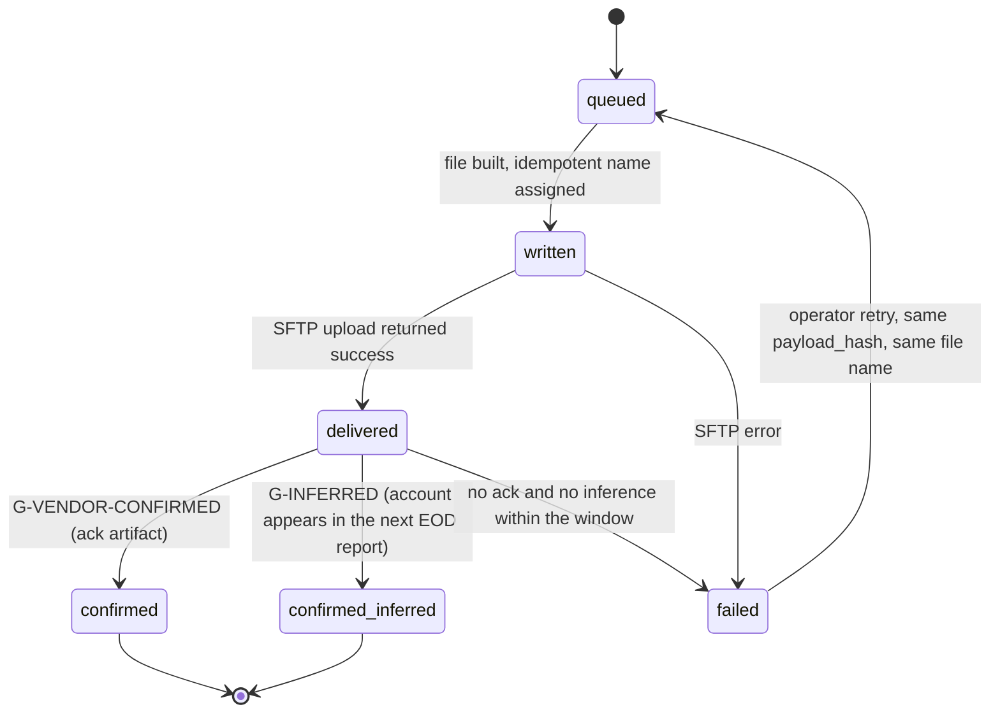

# M2: Rithmic Bridge

Constitution section M2, Appendix B3, Appendix B5 ten-section template, Appendix C5 escalation tier (money path).

**Everything in this module that touches the vendor's wire format is provisional under [ADR-005](../decisions/ADR-005.md).** The vendor call is deferred by the founder's choice. This document therefore designs the bridge **fully**, from the public CSV/SFTP description, and marks every single thing the call must confirm with a `V-M2-nn` identifier in section 11. There are **sixteen** of them. The design's whole shape is chosen so that all fourteen are bounded edits at the adapter boundary rather than redesigns, and section 11 states for each one what changes if the assumption is wrong.

**Amended at the Wave 3 batch 1 gate (2026-08-14).** Three rulings changed this module: **fail-closed provisioning is design law** (section 3.2 and the new INV-M2-13), **[ADR-020](../decisions/ADR-020.md)'s indicative realtime layer** adds a streaming path through this module's adapter (section 3.5), and **`V-M2-15` and `V-M2-16` join the vendor agenda**. The document stays at `status: review` because [ADR-005](../decisions/ADR-005.md) forbids it reaching `approved` while the vendor call is outstanding, which is by design rather than an oversight.

**Identifier conventions:** `INV-M2-nn` invariants, `SD-M2-nn` schema deltas, `ST-M2-n` stages of the batch, `FM-M2-nn` failure modes, `AS-M2-nn` adversarial scenarios, `OQ-M2-nn` open questions, `DEP-M2-nn` dependencies on other modules, `V-M2-nn` **vendor-confirmation dependencies**. `EC-nnn` and `GS-nnn` refer to [EDGE_CASES.md](../edge-cases/README.md) and [GOLDEN_SCENARIOS.md](../testing/golden-scenarios/README.md).

---

## 1. Purpose and invariants

### 1.1 What this module is

`packages/rithmic` plus the worker stages that call it. It is the **only** code in Merit that knows a vendor exists. Its job is to turn the platform into two narrow, boring interfaces:

```
outbound:  intent  -> idempotently named file -> SFTP -> confirmation -> queue row closed
inbound:   file    -> raw rows -> fills -> daily_marks -> handed to the pure engine
```

M2 is the module that makes [M01](M01-rules-engine.md) able to be pure. Every messy thing (a file that arrives late, a row that will not parse, a balance that disagrees, a symbol whose tick value changed last March) is absorbed here so that what reaches `advanceDay` is a clean `DailyMark` or nothing at all.

It implements the [platform adapter](../GLOSSARY.md#platform-adapter) interface (`provision`, `entitle`, `ingestFills`, `ingestEOD`, `reconcile`) named in constitution B3. v1 ships two implementations of that interface: **Rithmic** and the **synthetic simulator**. The simulator is not a convenience. With no vendor sandbox assumed available (V-M2-13), it is the only way the pipeline runs end to end before a contract exists, and it is a v1 requirement.

### 1.2 What this module is not

| Not M2 | Whose job | Why the boundary is here |
|---|---|---|
| Deciding whether a day is a breach | [M1](M01-rules-engine.md) | M2 produces marks. It never evaluates a rule, and it never reads a plan config except to compute `win_day` for the mark's convenience flag |
| Knowing what a floor is | M1 | M2 **pushes** a floor value to the vendor as a risk setting. It is told the number; it never derives it |
| Deciding to freeze, close, or flag | M6, M7 | M2 sets `recon_blocked`, which is a data-quality state, not an enforcement state. The distinction matters: `recon_blocked` says "we do not trust our own numbers here", not "we suspect this trader" |
| Charging anyone | M3 | |
| Moving money | M5 | The withdrawal that appears in `adjustment_cents` originates in M5. M2 only reports what the platform says happened |
| Owning the trading calendar | shared `TradingCalendar` | M2 is its heaviest consumer and its most likely source of a discovered gap |

### 1.3 Invariants

| ID | Invariant | Enforcement |
|---|---|---|
| INV-M2-01 | A quarantined file has committed **zero** downstream rows | Whole file in one transaction, [STATE_MACHINES section 6](../architecture/STATE_MACHINES.md). Test M2-I-01 injects a parse failure at the last row of a 5,000 row file and asserts an empty `fills` delta |
| INV-M2-02 | A byte-identical redelivery is a no-op | Unique `(sha256)` on `ingest_files`, status `ignored`. GS-084 |
| INV-M2-03 | `fills` is append-only, including corrections | No UPDATE grant on the table for the app role ([INFRA section 5](../architecture/INFRA.md)) |
| INV-M2-04 | Exactly one live `daily_marks` row per account per open trading day | Partial unique index, plus the completeness check in ST-M2-7 (M1's DEP D-M2-4) |
| INV-M2-05 | Every `fills.trading_day` comes from calendar session containment, never from a UTC date cast | Code review plus M2-U-011, which feeds a fill at 17:05 CT and asserts the next trading day (GS-001) |
| INV-M2-06 | Every mark satisfies M1's identities: `opening == prior_closing + adjustment` and `closing == opening + realized_pnl` | Asserted by M2 **before** handing the mark to the engine, so the engine's DO-3 assertion is a second line rather than the first (FM-M2-06) |
| INV-M2-07 | A funded account's first mark opens at exactly `size_cents` | M1's DEP D-M2-1. M2 owns making it true; the engine owns refusing when it is not (GS-070) |
| INV-M2-08 | The risk setting pushed to the vendor equals the account's current floor, and a floor change enqueues a push | M1 R-20. Reconciled nightly in ST-M2-8, because "we sent it" and "they applied it" are different claims (AS-M2-03) |
| INV-M2-09 | No closed or expired account holds an active entitlement for more than 24 hours | Nightly hygiene job plus an alarm that fires on the **query**, not on the job's own success (FM-M2-11) |
| INV-M2-10 | A `platform_account_ref` is never reused across accounts, for any reason | Unique index plus SD-M2-02's retirement table. This is the invariant behind AS-M2-05 |
| INV-M2-11 | Simulator output and vendor output are consumed by the **same** parser and the same normalizer | The simulator emits files, not objects. Enforced by architecture: the simulator writes to the ingest directory and nothing downstream can tell the difference (AS-M2-01) |
| INV-M2-12 | Non-trading balance movements never appear as `realized_pnl_cents` | The normalizer classifies every balance delta as trading or non-trading and refuses to guess. An unclassifiable delta quarantines (V-M2-05, EC-051) |
| INV-M2-13 | **No account trades until its risk settings are confirmed**, by acknowledgement artifact or by successful read-back | **Fail-closed provisioning, ruled design law at the batch 1 gate.** The account is held out of trading entirely; an unconfirmed setpoint is a hard block, never a dashboard marker. Enforced at the provisioning saga's exit rather than by the engine, because an account that cannot trade never produces a mark to evaluate. GS-138 |
| INV-M2-14 | Streaming ingest is **write-only into the live cache** and never into `fills`, `daily_marks`, or anything the engine reads | [ADR-020](../decisions/ADR-020.md)'s hard rule, made structural: the streaming path has no grant on the authoritative tables. Tier 2 cannot contaminate tier 1 even by mistake. GS-132 |

---

## 2. Entities and schema deltas

M2 consumes the tables in [DATA_MODEL sections 6 and 7](../architecture/data-model/README.md) as approved, plus M1's approved SD-01 (`daily_marks.adjustment_cents`). Six deltas are proposed here, each because a rule or a failure mode below cannot be satisfied without it.

| ID | Table | Change | Why it is not optional |
|---|---|---|---|
| SD-M2-01 | `provisioning_queue` | add `payload_hash bytea not null` (generated from `payload`) | The approved DATA_MODEL already declares the index `unique (account_id, operation, payload_hash) where status <> 'failed'` but the column itself is missing from the table definition. Without it the duplicate-intent guard does not exist, and duplicate intents are how an account gets provisioned twice |
| SD-M2-02 | new `platform_account_refs` | `(platform, platform_account_ref) pk`, `account_id`, `assigned_at`, `retired_at`, `retired_reason` | `accounts.platform_account_ref` is unique among **live** accounts, which does not stop a vendor from recycling a retired identifier onto a new account. A recycled ref silently routes one trader's fills onto another trader's account. This table makes a ref permanently burned (AS-M2-05, INV-M2-10) |
| SD-M2-03 | `ingest_files` | add `replaces_ingest_file_id uuid null` and `disposition text check in ('new','duplicate_ignored','full_replacement','correction_set')` | A vendor redelivery that is not byte-identical is currently indistinguishable from a new file. The disposition is a decision the parser must make **explicitly**, with the replaced file recorded, or a corrected redelivery double-applies a day (AS-M2-02, V-M2-03) |
| SD-M2-04 | `fills` | add `trading_day_vendor date null` and `trading_day_source text not null check in ('calendar','vendor','agreed')` | When the vendor states a session date and our calendar containment disagrees, that disagreement is the single most valuable ingest signal we can collect and it is invisible if we simply overwrite with our own answer. We keep both and alarm on divergence (AS-M2-06, V-M2-02) |
| SD-M2-05 | `platform_entitlements` | add `platform_user_ref text null` and `billing_unit text check in ('per_login_month','per_account_month','per_api_id_month')` | Rithmic bills per login-month per **user** and separately for API tier, not per account. Modelling entitlements only per account makes the monthly bill unreconcilable against our own records, which is how a cost leak survives for months (V-M2-09) |
| SD-M2-06 | `reconciliations` | add `source_ingest_file_id uuid null` and `our_source text check in ('rule_state','ledger')` | A mismatch is only actionable if you can name the two documents that disagreed. Recording which file carried the vendor's number, and which of our two internal balance derivations we compared, turns a nightly alarm into a five-minute diagnosis (FM-M2-08) |

### 2.1 The adapter interface

```ts
export interface PlatformAdapter {
  readonly platform: 'rithmic' | 'simulator';
  provision(ops: readonly ProvisioningOp[]): Promise<ProvisioningBatch>;   // returns the file(s) written
  entitle(changes: readonly EntitlementChange[]): Promise<ProvisioningBatch>;
  ingestFills(file: IngestFile): Promise<NormalizedFill[]>;
  ingestEOD(file: IngestFile): Promise<VendorEodRow[]>;
  reconcile(day: TradingDay, rows: readonly VendorEodRow[]): Promise<ReconResult[]>;
  streamLive(handler: (tick: LiveAccountTick) => void): Promise<Subscription>;  // ADR-020 tier 2, section 3.5
}
```

Three rules about this interface, the first two learned from B3's own warning that a second platform must be a new adapter and never a rewrite. **Nothing above returns a `DailyMark`.** Marks are computed by shared, adapter-independent code from `NormalizedFill[]` plus `VendorEodRow[]`, so a second platform inherits the mark logic instead of reimplementing it. And **nothing above takes a plan config.** An adapter that could read a plan config would eventually apply a rule.

The third rule arrives with [ADR-020](../decisions/ADR-020.md): **`streamLive` returns `LiveAccountTick`, a type that appears nowhere in the authoritative pipeline.** It is deliberately not a `NormalizedFill` and deliberately not convertible into one. The two tiers do not share a data type, which is what makes "the stream never feeds a money decision" a thing the compiler enforces rather than a thing a reviewer remembers (INV-M2-14).

---

## 3. State machines and the batch pipeline

### 3.1 Where M2 sits in the nightly batch

The batch stage list in [OVERVIEW section 6](../architecture/OVERVIEW.md) is authoritative. M2 owns stages 1 through 3 and 7 through 9; M1 owns 4 through 6 and the self-audit. Restated here only as the ownership boundary, with the stage identifiers this module's tests and alarms cite.

| Stage | Owner | What happens | On failure |
|---|---|---|---|
| ST-M2-1 | M2 | Discover files on SFTP, record `ingest_files`, digest, decide disposition (SD-M2-03) | Alarm, nothing committed |
| ST-M2-2 | M2 | Parse whole file to `raw_ingest_rows`, validate every row | Whole-file quarantine (INV-M2-01) |
| ST-M2-3 | M2 | Normalize to `fills`; resolve `trading_day` through the calendar; classify balance deltas | Quarantine; an unclassifiable delta never guesses (INV-M2-12) |
| ST-M2-4 | M2 | Compute `daily_marks`, assert INV-M2-06 before handing off | Mark not written, account `recon_blocked`, alarm |
| ST-M2-5 | M1 | `advanceDay` per account, per trading day, in one transaction per account | Per-account failure isolates; the batch continues and reports |
| ST-M2-6 | M1 | Persist `rule_states`, emit `day.closed` | |
| ST-M2-7 | M2 | **Completeness check**: every account that was `active` on this trading day has exactly one live mark | Missing mark sets `recon_blocked` and alarms; never synthesizes a flat day (EC-047) |
| ST-M2-8 | M2 | Reconciliation: our balance versus vendor's stated balance; **and** setpoint reconciliation (INV-M2-08) | Mismatch sets `recon_blocked`, alarms, excludes from eligibility |
| ST-M2-9 | M2 | Entitlement hygiene, provisioning queue drain, cost projection | Alarms; non-blocking for eligibility |

**Stage 4 comes before stage 5 and stage 7 comes after both.** That ordering is deliberate and is the answer to a question that will come up in implementation: why check completeness after the engine has already run rather than before? Because a missing mark must not stop the 4,999 accounts that have one. The batch computes what it can, then reports what it could not, then blocks eligibility on exactly the accounts affected.

### 3.2 Provisioning queue

The machine is [STATE_MACHINES section 5](../architecture/STATE_MACHINES.md), unchanged. What this plan adds is the **confirmation fallback**, because G-VENDOR-CONFIRMED is provisional (V-M2-06).



`confirmed_inferred` is a distinct state and not a synonym, because the two carry different evidential weight and the difference matters at exactly one moment: when a trader says "I paid and I cannot trade". An inferred confirmation means we believe the account exists because the vendor reported on it, which is strong for `create_account` and **worthless for `set_risk`** (you cannot infer that a risk setting applied from the account appearing in a report). Therefore:

**Binding: `set_risk` operations may never reach `confirmed_inferred`.** They are confirmed by an acknowledgement artifact or by a successful read-back of the platform's current setting. This is AS-M2-03, and it is the difference between believing an account is protected and knowing it.

**Ruled at the batch 1 gate, and this is a change of kind rather than of degree: fail-closed provisioning is design law.** Previously an account whose `set_risk` was never confirmed could trade, while `platform.setpoint_unconfirmed` surfaced it on M6's dashboard as carried liability. **It can no longer trade at all** (INV-M2-13). Entitlement is not enabled, and an account already trading whose setpoint confirmation is lost is disabled rather than flagged.

The cost is real and is accepted rather than argued away: a vendor-side confirmation gap becomes a **provisioning outage** for the affected accounts. That is a paid trader who cannot trade, which is FM-M3-01's territory and the thing this whole module works hardest to avoid. It is accepted because the alternative is worse in a way that is invisible: **a provisioning outage is visible, bounded, and recoverable, and an unenforced funded account is none of those three.** The behavioral fallback in ST-M2-8 does not change and remains the detector for a setpoint that was confirmed and later stopped working.

**This makes `V-M2-15` a commercial precondition rather than a technical question.** Merit needs either a provisioning acknowledgement artifact or a readable current-risk-setting endpoint. With neither, no account can be brought online under this rule at all, which is the strongest available form of what OQ-M2-04 recommended raising on the call.

### 3.3 File naming and idempotency

```
merit_<operation>_<yyyymmdd>_<hhmmss>_<batch_id_short>.csv
```

The name is derived from `batch_id`, which is derived from the ordered set of `payload_hash` values in the batch. **The same intents always produce the same filename.** A retry after an ambiguous SFTP failure re-uploads the identical name with identical bytes, which is the only safe behavior when you cannot tell whether the first upload landed. This is the outbound mirror of INV-M2-02 and it depends on V-M2-07 (whether the vendor treats a repeated filename as replace or as error).

### 3.4 Ingest file disposition

The decision SD-M2-03 records. This is the most dangerous branch in the module, because three of the four outcomes look identical in a directory listing.

| Digest | Vendor filename | Trading day already applied | Disposition | Action |
|---|---|---|---|---|
| seen | any | any | `duplicate_ignored` | Nothing. INV-M2-02 |
| new | new | no | `new` | Normal processing |
| new | **seen** | yes | `full_replacement` | **Requires explicit policy, V-M2-03.** Supersede every mark the prior file produced, replay forward, alarm, never delete |
| new | new | yes | `correction_set` | Rows carrying `correction_of` supersede individually; rows without it that touch an applied day are a **quarantine**, not a guess |

The last row is the one that earns its place. A file that silently restates a closed day without correction markers is the failure mode that would corrupt every downstream number quietly, and the only correct response is to refuse it and page a human (AS-M2-02).

### 3.5 The streaming path (ADR-020, tier 2)

[ADR-020](../decisions/ADR-020.md) adds an **indicative realtime layer** and it enters Merit through this module, because M2 is still the only code that knows a vendor exists. The adapter interface gains one method and the architecture gains one hard boundary.

```ts
  // added to PlatformAdapter
  streamLive(handler: (tick: LiveAccountTick) => void): Promise<Subscription>;
```

Mechanism is vendor-dependent and is `V-M2-16`: an **R|API+ admin connection** where one is available, or **high-frequency snapshot polling** where it is not. The adapter absorbs the difference, exactly as it already absorbs report shape, so the consumer sees one stream either way.

**Four rules, and the first is the one that keeps tier 1 safe.**

1. **The streaming path writes only to the live cache** (INV-M2-14). It has no grant on `fills`, `raw_ingest_rows`, `daily_marks`, or `rule_states`. A streaming bug can produce a wrong number on a dashboard and cannot produce a wrong number in a payout, and that separation is a permission rather than a convention.
2. **Nothing from the stream is ever reconciled into the authoritative pipeline.** The EOD file remains the only source of a mark. A live tick that disagrees with the closing file is not evidence of anything except that intraday and end-of-day are different measurements, and resolving the disagreement in the stream's favor is precisely what ADR-002 exists to prevent.
3. **Feed loss is a first-class state, not an error.** On loss the cache stops serving and every consumer falls back to last-closed values with its label changed to match (GS-133). A live surface that silently freezes at its last value is the failure mode here, because it looks exactly like a quiet market.
4. **The simulator streams too.** The synthetic simulator gains a streaming mode alongside its file output, so the live layer is developable and testable before any vendor agreement exists. This is INV-M2-11's discipline extended to tier 2, and it is what stops ADR-020 from becoming a second reason the vendor call blocks engineering.

---

## 4. API endpoints touched

M2 owns no trader-facing endpoint. It owns three internal ones, all on the admin origin behind [ADR-012](../decisions/ADR-012.md)'s `ADMIN_ORIGIN`, and it is a consumer of one.

| Endpoint | M2's role | Contract |
|---|---|---|
| `POST /internal/batch/run` | The manual trigger. Guarded, idempotency-keyed, accepts an optional `trading_day` and an optional `from_stage` | Re-running a completed stage is a no-op, which is what makes it safe to use during an incident. Never runs stages out of order |
| `GET /internal/recon/status` | Per-day summary: files received, applied, quarantined, accounts reconciled, mismatches open, setpoints unconfirmed | The single page an operator opens when something looks wrong. It answers "is our data trustworthy today" without a query |
| `POST /internal/provisioning/retry/:queueItemId` | Operator retry of a `failed` queue item | Re-enqueues with the **same** `payload_hash` and the same filename (section 3.3). Refuses to construct a new payload, because a retry that changes the payload is a new intent wearing a retry's clothes |
| `GET /admin/accounts/:accountId` | consumer | M6 renders the account drill-down; M2 supplies `recon_blocked`, setpoint confirmation state, entitlement rows, and the ingest provenance of every mark |

---

## 5. Events emitted and consumed

### 5.1 Emitted

All exist in the approved [EVENTS.md](../architecture/EVENTS.md) catalogue (sections 5.1 and 5.3) except the three marked NEW.

| Event | When | Notes |
|---|---|---|
| `ingest.file_received`, `ingest.file_applied`, `ingest.file_quarantined`, `ingest.file_late` | ST-M2-1, ST-M2-2 | `file_quarantined` carries `line_number` when the failure is row-local, which is what makes a vendor conversation possible |
| `ingest.correction_received` | ST-M2-3 | Carries `delta_cents`. Never quiet ([EVENTS section 5.3](../architecture/EVENTS.md)) |
| `recon.mismatch_detected`, `recon.resolved` | ST-M2-8 | |
| `account.provision_requested`, `account.provisioning_file_written`, `account.provisioned`, `account.provision_failed` | section 3.2 | |
| `account.entitlement_disabled` | ST-M2-9 | Consumed by BI for cost |
| `batch.started`, `batch.completed`, `batch.failed` | all stages | `batch.failed` carries `account_cursor` so a resume is exact |
| `ingest.file_replaced` **NEW** | ST-M2-1, `full_replacement` disposition | `{ ingest_file_id, replaces_ingest_file_id, trading_day, marks_superseded, accounts_touched }`. A full replacement rewrites history for a set of accounts, which is a thing the timeline and the evidence pack must both show. Consumers: ALERT, FEED, EVID, TL |
| `platform.setpoint_unconfirmed` **NEW** | ST-M2-8 | `{ account_id, floor_cents, pushed_at, hours_unconfirmed }`. The account may be trading with no working auto-liquidator, which is a liability the firm is carrying without knowing (AS-M2-03). Consumers: ALERT, RISK, FEED |
| `platform.account_ref_retired` **NEW** | account close | `{ platform, platform_account_ref, account_id, reason }`. Burns the identifier permanently (SD-M2-02). Consumers: FEED, EVID |

### 5.2 Consumed

| Event | Why M2 cares |
|---|---|
| `purchase.completed` (M3) | Enqueues the five provisioning operations |
| `phase.passed` (M1) | Enqueues the funded reset or the new funded account, and a `set_risk` at the new floor. **This is DEP-M2-01 and it is the highest-consequence thing M2 does**, because getting it wrong is AS-14 and the engine will refuse the day |
| `rule.floor_locked`, `day.closed` (M1) | A changed floor enqueues a `set_risk` push (INV-M2-08) |
| `breach.detected`, `account.closed`, `account.graduated` (M1, M6) | Enqueues `disable_account` and `disable_entitlement`, and retires the platform ref |
| `payout.settled` (M5) | Supplies the `effective_trading_day` and amount that must appear as `adjustment_cents` on a mark. M2 does not create the adjustment; it **verifies** that the vendor's balance movement matches one Merit knows about, and quarantines if it does not (INV-M2-12) |

---

## 6. Failure modes

| ID | Failure | Blast radius | Detection | Recovery |
|---|---|---|---|---|
| FM-M2-01 | EOD file arrives hours late or not at all | Every account's counters stall; no eligibility advances; traders see stale data | `ingest.file_late` on an expected-window timer, plus the batch dead-man switch | Batch is arrival-triggered, so late is late and not wrong. Trader surfaces already say "as of last closed session" ([ADR-002](../decisions/ADR-002.md)). Escalate to the vendor after the alarm window |
| FM-M2-02 | File corrupt mid-row | Would be partial state if committed | Whole-file validation before any write | Quarantine, alert, request redelivery. Zero rows committed (INV-M2-01, GS-033) |
| FM-M2-03 | Vendor redelivers a corrected file without correction markers | Silent double-application of a trading day, corrupting floors and counters from that day forward | Disposition table in section 3.4; a row touching an applied day without `correction_of` quarantines | Human decides `full_replacement` explicitly; replay recomputes forward; settled snapshots untouched (AS-M2-02) |
| FM-M2-04 | A fill lands on the wrong trading day | Win-day counts, minimum days, and the breach comparison all shift by a day for that account | SD-M2-04 keeps the vendor's stated day beside ours and alarms on divergence | Correct the calendar or the parser, supersede affected marks, replay (AS-M2-06) |
| FM-M2-05 | `platform_account_ref` recycled by the vendor | One trader's fills post to another trader's account. **The worst outcome in this module**: it corrupts two accounts, one of which may be funded, and it is invisible until reconciliation | SD-M2-02 makes the ref permanently burned; an inbound row referencing a retired ref quarantines the file | Quarantine, page, never process. This is the one case where we would rather lose a day of data than accept it (AS-M2-05) |
| FM-M2-06 | Mark identities do not close (INV-M2-06) | Would corrupt floor and breach arithmetic from that day forward | Asserted by M2 at ST-M2-4 and again by the engine at DO-3 | Mark not written, account `recon_blocked`, alarm. Two independent assertions of the same identity is deliberate redundancy on a money path (FM-05 in [M01](M01-rules-engine.md)) |
| FM-M2-07 | Funded account not reset to `size_cents` | Trader begins funded already in profit and can extract before any gate works | Engine refuses the day (INV-20, GS-070); M2's own post-condition on the reset operation fires first | Refuse, page, re-provision. DEP-M2-01 |
| FM-M2-08 | Our computed balance disagrees with the vendor's | Every downstream number for that account is suspect | Nightly reconciliation, ST-M2-8 | `recon_blocked`, excluded from eligibility, human resolves with SD-M2-06's provenance to work from |
| FM-M2-09 | Risk setpoint push silently not applied | The account trades with no auto-liquidator, or one set at a stale, more permissive value. Merit believes it is protected and is not | Setpoint reconciliation in ST-M2-8 plus `platform.setpoint_unconfirmed` | Re-push; if still unconfirmed past the window, M6 surfaces the account as unprotected liability (AS-M2-03) |
| FM-M2-10 | SFTP credentials expire or rotate badly | All provisioning stops; purchases become paid-not-provisioned within five minutes | `account.provision_failed`, plus the five-minute saga alarm from [STATE_MACHINES section 4](../architecture/STATE_MACHINES.md) | Rotate per [INFRA section 7](../architecture/INFRA.md); the queue drains on retry because filenames are idempotent |
| FM-M2-11 | Entitlement hygiene job silently stops running | Real money leaks monthly, invisibly | **The alarm fires on the query, not on the job.** "Any closed account entitled more than 24 hours" is evaluated independently of whether the hygiene job reported success | Disable, reconcile against the vendor invoice, and treat the gap as a cost-review line in the C8 retro (AS-M2-04) |
| FM-M2-12 | Simulator and vendor diverge | Every test passes and production breaks | The simulator emits **files** through the same parser (INV-M2-11), and a conformance suite runs both adapters over the same scenario | Update the simulator from real files the moment any exist; the conformance suite is the artifact the vendor call updates first (AS-M2-01) |
| FM-M2-13 | A balance delta cannot be classified as trading or non-trading | A payout looks like a loss, or a loss looks like a payout | INV-M2-12 refuses to guess | Quarantine the account's day, alarm, resolve against M5's settlement record (EC-051) |
| FM-M2-14 | Contract spec missing or stale for a traded symbol | Every P&L number on that account is wrong by a multiplier | Normalizer refuses a fill whose `symbol` has no `contract_specs` row effective on `trading_day` | Quarantine, add the spec with its effective date, reprocess. Never assume a multiplier (EC-025, GS-043) |

---

## 7. Adversarial scenarios

Constitution B5 requires at least five not found in the constitution. **Seven are listed, six novel.** The one marked "extends" takes a B4 item somewhere it changes the design.

### AS-M2-01: The simulator becomes the specification (NOVEL)

**Attack.** Not an attacker. Us. With no vendor sandbox (V-M2-13), every test, every fixture, and every developer's mental model comes from the simulator we wrote. The simulator was written from the same assumptions as the parser, by the same author, on the same day. It will agree with the parser about everything, including everything both get wrong. Constitution C10 names this exactly: high coverage that "reflects nothing more than the AI talking to itself", and here it extends past the tests into the data itself.

**Why it nearly works.** Every gate is green. The pipeline runs end to end. The Monte Carlo population flows through. The first real file arrives after the contract is signed, and the parser meets a field it has never seen in a shape nobody modelled.

**Counter, designed in.**
1. **The simulator emits files, not objects** (INV-M2-11). It writes CSV into the ingest directory and the pipeline cannot tell it apart. Everything downstream of the parser is therefore tested against the same code path production uses.
2. **The parser is written to be strict and loud, not tolerant.** Any unexpected column, missing field, or unparseable value quarantines. A tolerant parser is what turns a wrong assumption into silently wrong data; a strict one turns it into a phone call.
3. **A conformance suite is a first-class deliverable**, not a test file: a list of the fourteen `V-M2-nn` assumptions, each with the fixture that encodes it and the assertion that would fail if it is wrong. **The vendor call's output is a diff against that suite**, which is what makes the call a bounded edit rather than a rewrite.
4. The simulator deliberately emits **hostile-but-legal** files: rows in a different order, an extra trailing column, a day with zero accounts, a 200MB file, CRLF line endings, a BOM.

**Honest residual.** This reduces the blast radius; it does not eliminate it. The only real fix is a real file, and getting one is a founder action, not an engineering one. GS-084, GS-085.

### AS-M2-02: The redelivery that rewrites a settled day (NOVEL)

**Attack.** The vendor redelivers a file for a day already applied. The bytes differ (a fixed row, a re-run export), so the digest is new and INV-M2-02 does not catch it. The rows carry no correction markers. A naive pipeline processes it as a new file, and either collides on the unique mark index or, worse, produces a second set of fills that inflate the day's `realized_pnl_cents` on every account in it.

**Why it nearly works.** It looks exactly like a normal file. The only signal is that its trading day is already applied, and that is one comparison it is easy to omit.

**Numbers.** On a 5,000 account file, a silent double-apply doubles every account's realized P&L for a day. Win days flip on, consistency ratios change, floors trail to fictional highs, and the accounts that become eligible do so **correctly according to state that is wrong**. Payouts approved on that basis are instant and are never clawed back (B4 #5), so the loss is realized within the hour.

**Counter.** The disposition table in section 3.4 makes this an explicit four-way decision with a recorded outcome (SD-M2-03). A row touching an already-applied day without `correction_of` **quarantines the whole file**. A deliberate `full_replacement` supersedes rather than deletes, emits `ingest.file_replaced`, and triggers replay forward. GS-086.

### AS-M2-03: The setpoint that was never applied (NOVEL)

**Attack.** Merit's entire intraday risk posture is one number pushed to the vendor: the auto-liquidation setpoint at the account's floor (M1 R-20, the [Wave 2 gate ruling](../decisions/README.md)). If that push is accepted at the transport layer but not applied at the platform, or applied to the wrong account, or applied at a stale value, then Merit has **no intraday enforcement at all** for that account and does not know it. The EOD model is explicitly built on the assumption that the vendor stops the trader before the floor ([ADR-002](../decisions/ADR-002.md)'s T+1 tradeoff). An adversary who can detect an unenforced account, by probing a small excursion below the expected setpoint and observing no liquidation, has found an account with an unbounded loss and a bounded, already-paid-for cost.

**Why it nearly works.** Delivery confirms transport, not effect. Nothing in the outbound path proves the setting exists on the vendor's side, and the failure is silent by construction: an unenforced account looks exactly like an enforced account that never got close to its floor.

**Counter.** Three, because none alone is sufficient.
1. `set_risk` may never reach `confirmed_inferred` (section 3.2). Transport success is not confirmation for this operation and for no other reason than that this scenario exists.
2. **Setpoint reconciliation** in ST-M2-8: where the vendor's EOD report exposes the account's current risk setting (V-M2-08), compare it against our floor every night and alarm on any difference. Where it does not, the fallback is behavioral: any account whose day low went below its floor **without** an accompanying liquidation record is evidence the setpoint is not working, and that is a page.
3. `platform.setpoint_unconfirmed` puts unprotected accounts on M6's liability dashboard as a named number, because an unenforced funded account is carried liability whether or not anyone has noticed.

**Residual, stated plainly.** If the vendor exposes neither the current setting nor a liquidation record (V-M2-08 is the highest-value single question on the vendor call after correction semantics), the behavioral fallback is all we have and it only fires after an excursion has already happened. GS-087.

### AS-M2-04: Entitlement hygiene as a cost attack and as a trader attack (NOVEL)

**Attack, two directions.** Outward: entitlements cost real money per month per user ($30 per login-month, more for API tier). A breached account whose entitlement is never disabled is a small recurring leak; a systematic failure of the hygiene job across a breach wave is a large one, and it is invisible because nobody reads an invoice line item that has been drifting up slowly. Inward, and worse: an over-eager hygiene job that disables an entitlement on an account that is still legitimately trading takes a paying trader offline mid-session. In a firm whose brand is payout trust, "the platform cut me off in a position" is a Trustpilot review that costs more than a year of the leak.

**Numbers.** 200 breached accounts left entitled for one month at $30 is $6,000, which is real for a firm at this scale and roughly the cost of the entire hosting stack. In the other direction, one wrongly disabled funded account during a session is unquantifiable.

**Counter.** The two directions need different controls and they are genuinely asymmetric.
- Leak side: the alarm evaluates the **query**, not the job (FM-M2-11), and the monthly vendor invoice is reconciled against `platform_entitlements` with `monthly_cost_cents` as a named line in the C8 cost review. SD-M2-05's `billing_unit` is what makes that reconciliation possible at all, since the vendor bills per user and per API ID rather than per account.
- Trader side: disable is driven **only** by a terminal account status (`breached`, `expired`, `closed_*`, `graduated`) with `closed_on` set, never by inactivity, never by a heuristic, and never by the absence of a mark. It runs with a 24 hour lag by design, and the alarm threshold is set at the same 24 hours so the job has a full window before anyone is woken up. A disable operation on an account whose status is `active` is a hard error, not a warning.

GS-088.

### AS-M2-05: The recycled account reference (NOVEL)

**Attack.** The vendor recycles a User ID or account reference after an account is closed, which is ordinary practice in systems with a finite identifier space and no reason to think it matters. Merit's `accounts.platform_account_ref` is unique only among live rows. A new account receives a ref that a closed account previously held. Then either historical files referencing the old account post onto the new one, or a late correction for the old account lands on the new one.

**Why it is the worst one here.** It corrupts **two** accounts, in a way that reconciliation may not catch (the fills are internally consistent, they are just on the wrong account), and one of them may be funded and eligible. It also breaks replay determinism, because the account's own history now contains days that were never its own, and the nightly self-audit will diverge on an account that did nothing wrong.

**Counter.** SD-M2-02 makes a platform ref **permanently burned**: assigned once, retired on close, never reissued to another account, and an inbound row citing a retired ref quarantines the file rather than being routed anywhere. `platform.account_ref_retired` records the burn. If the vendor's identifier space is genuinely finite and reuse is forced (V-M2-10), the only safe design is a Merit-side surrogate mapping with an explicit epoch, and that is a vendor-call question rather than a thing to decide by assumption. GS-089.

### AS-M2-06: Session-boundary fill placement (NOVEL)

**Attack.** The CME session boundary is the moment a trading day ends. A trader who understands the boundary better than the firm's calendar does can choose which trading day a fill belongs to, and both directions are valuable. Push a loss across the boundary into a day that is about to close and it lands in a day whose win-day flag is already lost anyway. Pull a profit back before the boundary and it completes a win day. Around a DST transition or a half day, the boundary moves in ways a naive implementation gets wrong by an hour.

**Numbers.** The win-day gate needs 5 days at 15,000c on CORE-50K. A trader who can reliably move marginal P&L across one boundary per cycle converts a near-miss day into a win day, which is worth one whole trading day of cadence per cycle, roughly 20 percent of the cycle time, on every cycle, forever. That is not an exploit that pays once.

**Counter.** The engine is already immune by construction (R-01, R-05: session containment from stored UTC instants, never date arithmetic). What M2 adds is **detection of disagreement**: SD-M2-04 stores the vendor's stated session date alongside ours, and any divergence alarms rather than being silently resolved in our favor. A trader whose fills cluster within seconds of the session boundary at a materially higher rate than the population is an M7 detector input, not a rule, because trading near the close is completely legitimate and a rule against it would be indefensible. GS-090, and it shares GS-030 and GS-032's calendar fixtures.

### AS-M2-07: The correction stream as a liability channel (extends B4 #5 and [M01](M01-rules-engine.md) AS-05)

**Attack.** M1's AS-05 covers the adversary who can influence which fills get restated. The M2 extension is about **volume and timing**: corrections are our only mechanism for the vendor being wrong, they arrive on the vendor's schedule, and Merit absorbs every one that lands after a settlement. A correction stream that is merely *sloppy* rather than adversarial produces the same balance-sheet outcome, and it is far more likely.

**Counter, which is measurement rather than prevention.** Every correction records `delta_cents`. The **signed sum of absorbed corrections** is a line on M6's liability dashboard ([OQ-10 ruling](../decisions/gates/m1-gate-closure-2026-08-13.md)), and a per-identity signed sum that drifts away from zero is an M7 flag. The important design consequence for M2: `ingest.correction_received` must carry the delta, and the delta must be computed against the **superseded** mark rather than recomputed later, because after replay runs the original number is only recoverable from the superseded row. GS-091, GS-057, GS-058.

---

## 8. Test plan

### 8.1 Suites

| Suite | Prefix | Count | Runs | Blocks |
|---|---|---|---|---|
| Parser and normalizer units | `M2-U-nn` | 24 | every commit | merge |
| Adapter conformance (Rithmic versus simulator over identical scenarios) | `M2-C-nn` | 14, one per `V-M2-nn` | every commit | merge |
| Ingest integration (whole-file transaction, quarantine, disposition) | `M2-I-nn` | 12 | every commit | merge |
| Provisioning saga integration | `M2-P-nn` | 9 | every commit | merge |
| Golden fixtures | `GS-nnn` | 10 owned (GS-084 to GS-093), plus GS-033, GS-043, GS-047 shared with M1 | every commit | merge |
| Simulator realism | `M2-S-nn` | 4 | nightly | nightly alarm |

### 8.2 The conformance suite, which is the important one

`M2-C-01` through `M2-C-14` map one-to-one onto the fourteen vendor assumptions in section 11. Each is a fixture encoding the assumption and an assertion that fails loudly if it is violated. **The suite's purpose is not to pass.** Its purpose is to be the document the vendor call is run against: fourteen questions, fourteen fixtures, and a diff at the end. When a real file arrives, the first commit is a conformance fixture built from it, and every failure is a scoped edit with a named test.

### 8.3 Named scenarios owned by this module

| ID | Scenario | Pins |
|---|---|---|
| GS-084 | Simulator file and vendor file traverse the identical parser | The simulator writes CSV to the ingest path; no downstream code branches on source. AS-M2-01 |
| GS-085 | Hostile-but-legal file shapes | BOM, CRLF, reordered columns, extra trailing column, zero-account day, 200MB file. Each either parses identically or quarantines; none partially applies |
| GS-086 | Redelivered file for an applied day, no correction markers | Whole-file quarantine, zero rows committed, alarm names the trading day. AS-M2-02 |
| GS-087 | Day low below the floor with no liquidation record | The behavioral setpoint check fires and `platform.setpoint_unconfirmed` is emitted. AS-M2-03 |
| GS-088 | Hygiene disable attempted on an `active` account | Hard error, nothing disabled, alarm. The asymmetric half of AS-M2-04 |
| GS-089 | Inbound row citing a retired `platform_account_ref` | Whole-file quarantine. Never routed to any account. AS-M2-05 |
| GS-090 | Vendor session date disagrees with calendar containment | Both stored, divergence alarms, our calendar wins for `fills.trading_day`. AS-M2-06 |
| GS-091 | Correction after settlement records its delta against the superseded mark | The absorbed amount is computable forever, not only until the next replay. AS-M2-07 |
| GS-092 | Balance delta that matches no known settlement and no fills | Quarantine, never classified as P&L. INV-M2-12, EC-051 |
| GS-093 | Funded reset post-condition | After `phase.passed`, the platform account's next opening balance is exactly `size_cents`, asserted by M2 before the engine ever sees the mark. DEP-M2-01, pairs with GS-070 |

### 8.4 Coverage rule

Not a percentage. **Every one of the fourteen vendor assumptions has a conformance fixture, and every disposition branch in section 3.4 has an integration test.** A `V-M2-nn` without a fixture is an assumption nobody will remember making.

---

## 9. Observability

### 9.1 Metrics

| Metric | Why it matters |
|---|---|
| `ingest.file_arrival_delay_minutes` versus the expected window | The leading indicator for FM-M2-01, and the number the vendor conversation needs |
| `ingest.quarantine_rate` by reason | A rising rate means the vendor changed something. It is the earliest possible warning |
| `ingest.rows_parsed` and `fills_normalized` per file | A ratio that drifts means rows are being dropped somewhere silently |
| `marks.completeness_gap` (accounts active with no live mark) | Should be zero. Any non-zero blocks eligibility for those accounts |
| `recon.mismatch_count` and `recon.max_abs_delta_cents` | The count matters less than the maximum: one large delta is worse than fifty small ones |
| `platform.setpoints_unconfirmed` and max hours | **Unprotected funded accounts.** This belongs on M6's liability page, not only in metrics |
| `entitlements.active_on_closed_accounts` and projected monthly cost | The cost leak, priced |
| `provisioning.queue_depth` by status and oldest `queued_at` | A growing depth with no failures means SFTP is silently not draining |
| `batch.stage_duration_ms` per stage | The 10 minute budget at 5,000 accounts (constitution 5.7) is per batch, and the stage breakdown is what tells you which stage to fix |
| `correction.absorbed_delta_cents` signed cumulative | AS-M2-07, and the input to M6's absorbed-corrections line |

### 9.2 Alerts

| Alert | Threshold | Severity |
|---|---|---|
| Batch did not run | dead-man switch on the schedule | **page** |
| File quarantined | any | **page** during beta, warn after |
| Completeness gap | any account | warn, and the account is `recon_blocked` automatically |
| Reconciliation mismatch | any | warn; **page** if the account is funded and eligible |
| Setpoint unconfirmed | over 24 hours on a funded account | **page** |
| Row citing a retired platform ref | any | **page** (AS-M2-05) |
| Closed account still entitled | over 24 hours | warn, daily digest |
| Provisioning item failed | any, after retry budget | **page** (a paid trader cannot trade) |
| Paid but not provisioned | 5 minutes | **page** |

### 9.3 Dashboard

One page, five panels: today's file timeline (expected, received, applied, quarantined), completeness and reconciliation status by account count, provisioning queue depth by state with the oldest item's age, entitlement cost projection with the closed-but-entitled count, and setpoint confirmation coverage across funded accounts. The last panel exists because it is the only place in Merit where "are we actually protected right now" is answerable.

---

## 10. Open questions for the founder

**OQ-M2-01. Does the simulator ship to production?** It is a v1 requirement for dev and staging. There is a real argument for running it in production too, generating a small number of synthetic accounts that exercise the full pipeline nightly as a canary, so that a broken parser is discovered by a robot at 02:00 rather than by a trader at 09:30. The cost is that production then contains accounts that are not real, which must be excluded from every published statistic (M12), every liability number (M6), and every cohort (BI). Recommendation: **yes, with a hard `is_synthetic` flag on the identity and a CI test asserting every aggregate query excludes it.** The alternative is discovering ingest breakage from a support ticket.

**OQ-M2-02. What is the expected-arrival window before `ingest.file_late` fires?** There is no contractual SLA assumed (V-M2-04). The alarm needs a number anyway, and the number is a judgment about how long to wait before waking someone. Proposal: alarm at 90 minutes after the historical median arrival, page at 4 hours, and recompute the median monthly rather than hardcoding it.

**OQ-M2-03. Beta posture on quarantine: page or queue?** Any quarantine is a page during beta in the design above. That is correct for learning the vendor's behavior and wrong for sleep. Confirm the beta posture, and confirm the trigger for relaxing it (proposal: 30 consecutive days with no quarantine).

**OQ-M2-04 (RULED, 2026-08-14). Do we accept a vendor relationship with no acknowledgement artifact?** **No.** Fail-closed provisioning is design law: no account trades without an acknowledgement or a successful read-back (INV-M2-13, section 3.2). The question is therefore no longer whether Merit accepts the gap but what the vendor must supply, which is why it became **`V-M2-15`, a commercial precondition** on the call rather than an item on an agenda. The recommendation in the original text was to raise it as a requirement; the ruling went further and made trading itself contingent on it.

**OQ-M2-05 (NEW, from [ADR-020](../decisions/ADR-020.md)). What is the streaming mechanism, and what does it cost?** `V-M2-16`. R|API+ admin is $100 per month per API ID ([ADR-002](../decisions/ADR-002.md) priced it when rejecting it as an ingest path), which is affordable for one connection and is a different proposition per-account. High-frequency snapshot polling has no incremental licence cost and a worse latency profile. The choice is a call output, not a design decision, and tier 1 is unaffected either way. Recommendation: **price both on the call**, and ship the simulator-backed layer regardless, because the labeling and degradation behavior are the hard parts and neither depends on which mechanism wins.

---

## 11. Vendor-confirmation dependencies (ADR-005)

**The point of this section is that the vendor call has an agenda and a definition of done.** Sixteen items, one of which (V-M2-15) is a commercial precondition rather than a question. Each states the assumption, what depends on it, and what changes if it is wrong. `Blast` is how much of this module moves if the assumption fails: **edit** (a parser change), **design** (a component changes shape), **model** (the data model changes).

| ID | Assumption | What depends on it | If wrong | Blast |
|---|---|---|---|---|
| V-M2-01 | EOD reports are per-account CSV containing account ref, session date, opening and closing balance, realized P&L | The whole normalizer; `daily_marks` computation | Parser rewritten to the real shape. The mark contract is unchanged because marks are computed, never trusted | edit |
| V-M2-02 | The report states a session date we can compare against our calendar | SD-M2-04, AS-M2-06 detection | We lose the divergence signal and rely on containment alone | edit |
| V-M2-03 | Redeliveries are either byte-identical or carry correction markers | Disposition table, AS-M2-02 | `full_replacement` becomes the common case rather than the exception, and every applied day needs an explicit supersession path | design |
| V-M2-04 | One post-session delivery per trading day, no contractual arrival time | Arrival-triggered batch, `ingest.file_late` | If deliveries are multiple or partial, the batch needs a completeness-of-delivery concept before it can start | design |
| V-M2-05 | Non-trading balance movements are applied **between sessions** and are distinguishable in the report | M1's INV-18, SD-01, EC-034, INV-M2-12 | `daily_marks` needs an intraday adjustment timestamp and M1's breach comparison changes shape. **Second-highest risk in the corpus**, tracked in [STATE](../STATE.md) | model |
| V-M2-06 | Provisioning produces an acknowledgement artifact | G-VENDOR-CONFIRMED, `confirmed_inferred`, AS-M2-03 | `set_risk` can never be positively confirmed; the behavioral fallback becomes the only control. See OQ-M2-04 | design |
| V-M2-07 | Re-uploading an identical filename with identical bytes is safe (replace or ignore, not duplicate) | Section 3.3 idempotent retries | Retries need a fresh name plus a vendor-side dedupe key, which we may not have | design |
| V-M2-08 | The account's current risk setting, or its liquidation events, are visible to us | INV-M2-08, setpoint reconciliation, AS-M2-03 | We cannot verify the one control our entire intraday risk posture rests on. **Highest-value question on the call after V-M2-05** | design |
| V-M2-09 | Billing is per login-month per user plus API tier, and we can attribute cost to our own records | SD-M2-05, entitlement hygiene, AS-M2-04 | The invoice is unreconcilable and the leak becomes undetectable from inside | model |
| V-M2-10 | Account references are never recycled | SD-M2-02, INV-M2-10, AS-M2-05 | We need a Merit-side surrogate with an explicit epoch, and every historical reference needs epoch-qualifying | model |
| V-M2-11 | Per-fill detail is available, in the EOD file or a sibling | Fill-level detectors in M7 (same-second clustering is a self-join over fills), evidence packs | M7's strongest detector class is gone and the evidence pack degrades from trade-level to day-level. This is a **product** consequence, not only a technical one | design |
| V-M2-12 | Corrections reference the original fill | `fills.correction_of`, replay determinism, B4 #5 | The ingest layer synthesizes a correction row from a restatement. Already designed for; the mitigation is what makes this an edit rather than a redesign | edit |
| V-M2-13 | No sandbox is available before contract | The simulator is a v1 requirement; AS-M2-01's residual | A sandbox collapses AS-M2-01's residual to near zero and is worth real money to obtain | design |
| V-M2-14 | Server-side copy configuration is out of scope for v1 | Module scope | In scope means a second provisioning surface. **Admin R\|API+ is no longer out of scope**: [ADR-020](../decisions/ADR-020.md) makes it a candidate mechanism for the streaming layer, so this row narrowed to server-side copy alone | design |
| **V-M2-15** | **A provisioning acknowledgement artifact exists, or the account's current risk setting is readable** | **Fail-closed provisioning (INV-M2-13), which is now design law.** Every funded account's ability to trade at all | **No account can be brought online.** This is not a degradation, it is a stop. Raise it on the call as a **requirement**, not a question: without one of the two, the relationship cannot support Merit's risk posture. Supersedes OQ-M2-04, which asked whether Merit would accept the gap; the answer is no | **commercial** |
| **V-M2-16** | **A streaming or high-frequency snapshot mechanism is available**, whether R\|API+ admin, a market-data entitlement we already pay for, or frequent report snapshots | [ADR-020](../decisions/ADR-020.md)'s tier 2 in its entirety: live P&L, projected floor distance, live win-day tracking, live Open Liability | The indicative layer ships against the simulator and has no production feed. Tier 1 is unaffected, so this is a **product** gap rather than a correctness one, and the honest fallback is to ship tier 1 surfaces alone and label them | design |

### Dependencies on other modules

| ID | Dependency | Owner | Consequence if unmet |
|---|---|---|---|
| DEP-M2-01 | On `phase.passed`, the platform account is reset to `size_cents` (or a new account provisioned at `size_cents`) before the next session | M2 owns the action; M1 owns the assertion | The engine refuses the day, the trader cannot trade funded, and the account is stuck until an operator resolves it (AS-14, GS-070) |
| DEP-M2-02 | M5 publishes `payout.settled` with `effective_trading_day` and `approved_cents` before that day's file is processed | M5 | M2 cannot classify the balance movement and quarantines the account's day (INV-M2-12). This is a **sequencing** requirement, not just a data one |
| DEP-M2-03 | M1 emits a floor change (via `day.closed`, `rule.floor_locked`) that M2 turns into a `set_risk` push | M1, M2 | The setpoint drifts below the real floor. Since [ADR-014](../decisions/ADR-014.md) the floor only moves up, so drift is always permissive, which is safe for the trader and a measurable cost to the firm |
| DEP-M2-04 | `contract_specs` is populated and versioned for every symbol traded | M6 admin, seed data | FM-M2-14: fills refused, day quarantined |
| DEP-M2-05 | M7 consumes fill-level data for clustering detectors | M7 | Contingent on V-M2-11 |
