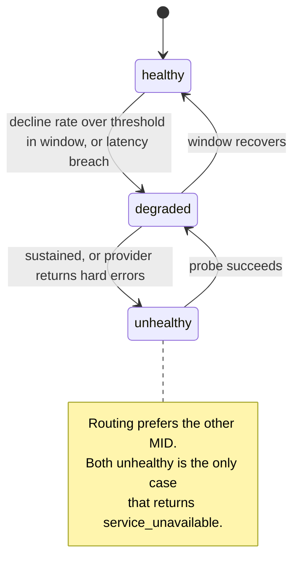
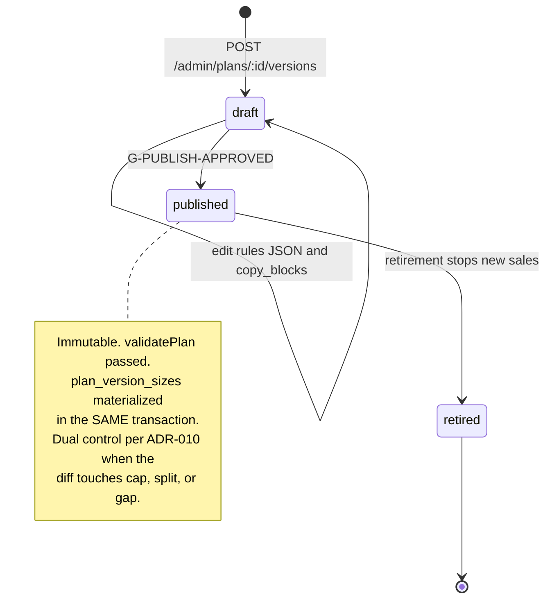

# M3: Billing and Checkout

Constitution section M3, Appendix B4 items 9 through 12 and 16, Appendix D2, Appendix B5 ten-section template. Money path under the [ADR-003](../decisions/ADR-003.md) strict regime.

This module is the front door. It is the only place a stranger who has never been authenticated can cause Merit to spend money (a provisioned account costs real entitlement dollars from the moment it exists), and it is the surface a card-fraud ring meets first. Two properties dominate every decision in it: **a purchase is a contract pinned to a plan version forever**, and **every inbound payment fact is a third-party assertion that may arrive twice, out of order, or forged.**

**Amended and approved at the Wave 3 batch 1 gate (2026-08-14).** One ruling changed this module: **[ADR-019](../decisions/ADR-019.md)'s Merit Wallet becomes a checkout payment method** (section 3.4, INV-M3-13, SD-M3-06). The PSP application timing question (OQ-M3-04) was answered as a calendar note rather than a design change.

**Identifier conventions:** `INV-M3-nn` invariants, `SD-M3-nn` schema deltas, `FM-M3-nn` failure modes, `AS-M3-nn` adversarial scenarios, `OQ-M3-nn` open questions, `DEP-M3-nn` dependencies.

---

## 1. Purpose and invariants

### 1.1 What this module is

The commerce saga and the PSP abstraction. Concretely: `POST /checkout`, `POST /accounts/:id/reset`, `POST /webhooks/psp/:provider`, the coupon claim, the plan-version publish path, and the chargeback handler.

The golden path is one traceable saga with compensation at every step:

```
checkout -> coupon claim -> PSP session -> payment webhook -> purchase paid
         -> account row -> account.provision_requested -> M2 -> welcome
```

Every arrow above can fail, and each failure has a named compensation in section 3.2. Constitution M3 is explicit that "paid but not provisioned = alert within 5 min, auto-retry", and that alarm is the module's single most important operational signal, because a trader who paid and cannot trade is a refund and a review, in that order.

### 1.2 What this module is not

| Not M3 | Whose job | Why the boundary is here |
|---|---|---|
| Talking to Rithmic | [M2](M02-rithmic-bridge.md) | M3 emits `account.provision_requested` and stops. It has no idea what a CSV is |
| Deciding whether an account is eligible for anything | [M1](M01-rules-engine.md) | M3 creates accounts. It never reads a rule |
| Verifying identity | M19 | M3 **blocks** on KYC state when the placement config says to, and consumes the state as a boolean. It never runs a check |
| Deciding whether a buyer is a fraudster | M7 | M3 enforces hard limits (account cap per entity, per-identity coupon limit, geo). Judgment calls are flags, not checkout errors |
| Paying anybody | M5 | Money out is M5. M3 only ever takes money in, plus refunds and reversals |
| Choosing what the rules say | founder, M1 | M3 publishes plan versions. `validatePlan` (M1 CV-01 to CV-19) is what decides whether a publish is allowed |

### 1.3 Invariants

| ID | Invariant | Enforcement |
|---|---|---|
| INV-M3-01 | A purchase's `plan_version_id` is resolved at checkout start and never changes | Column is write-once (trigger); `plan_versions` with `status = 'published'` are immutable (approved DATA_MODEL). B4 #12, GS-041 |
| INV-M3-02 | Price, discount, and cap eligibility are computed **server-side** from `plan_version_sizes`, never from the request | Zod schema has no price field at all. The absence is the control (Appendix E's Enrichlead lesson) |
| INV-M3-03 | Duplicate PSP webhook delivery produces exactly one effect | Unique `(psp, provider_event_id)`, and `processing_result` records which branch ran. B4 #9, GS-038 |
| INV-M3-04 | A webhook arriving out of order is **deferred and re-evaluated**, never applied out of order | State-machine guard, not timestamp comparison: a `refund` for a purchase not yet `paid` is parked with `out_of_order_deferred` and re-driven when its predecessor lands (GS-038) |
| INV-M3-05 | An unverified webhook signature never reaches business logic | Verification happens before the row is even parsed; `signature_verified` is recorded, not assumed (approved DATA_MODEL). Failure returns 401 and alarms |
| INV-M3-06 | One coupon claim per identity per code, decided by the database | Unique partial `(coupon_id, identity_id) where released_at is null`. The insert **is** the race. B4 #11, GS-040 |
| INV-M3-07 | A failed payment never consumes a coupon redemption | Claim released on failure, `coupon.claim_released` emitted, `redemption_count` maintained transactionally with the claim |
| INV-M3-08 | Account caps are enforced per resolved [identity](../GLOSSARY.md#trader-identity), never per email or per user | Cap check joins through `identities`; constitution B1's binding rule. GS-094 |
| INV-M3-09 | Every purchase records the exact `tos_version_id` set the buyer accepted, with IP and timestamp | Append-only `tos_acceptances`, unique per identity per version. It is the first artifact any enforcement dispute asks for |
| INV-M3-10 | A chargeback always closes the account, always flags the identity, and always posts a compensating ledger reversal, even when the identity nets negative | Automatic on `purchase.charged_back`. The books show the loss honestly. B4 #10, GS-039 |
| INV-M3-11 | The two MIDs are never both required for a purchase to succeed, and neither is ever required to be up | Health-checked failover; `service_unavailable` only when **both** are unhealthy |
| INV-M3-12 | A published plan version passes `validatePlan` before it is publishable, and publishing materializes `plan_version_sizes` in the same transaction | M1's CV-01 to CV-19; G-PUBLISH-APPROVED in [STATE_MACHINES section 10](../architecture/STATE_MACHINES.md). GS-076 to GS-078, GS-083 |
| INV-M3-13 | A wallet-funded purchase debits the wallet **in the same transaction** that creates the purchase, and never creates a purchase it could not fund | Wallet balance is Merit's own ledger, so there is no third party and no asynchronous confirmation. The debit and the purchase commit together or neither does, which makes the entire PSP webhook machinery inapplicable to this path rather than merely unused |
| INV-M3-14 | A wallet debit never takes an identity's balance below zero, and there is no credit facility anywhere in checkout | Check constraint plus the transaction in INV-M3-13. A negative wallet balance would be Merit lending money to a trader, which is a product nobody decided to build |

---

## 2. Entities and schema deltas

M3 consumes [DATA_MODEL sections 4 and 5](../architecture/DATA_MODEL.md) as approved. Five deltas.

| ID | Table | Change | Why it is not optional |
|---|---|---|---|
| SD-M3-01 | `psp_webhook_events` | add `purchase_id uuid null`, `deferred_until timestamptz null`, `defer_attempts int not null default 0` | INV-M3-04 needs somewhere to park a deferred event and something to drive its re-evaluation. Without it, "deferred" means "dropped and hoped for" |
| SD-M3-02 | `purchases` | add `refundable_until timestamptz null` and `first_trade_at timestamptz null` | Constitution M3 sets the refund window at "pre-first-trade only". That is a **fact about trading**, so it has to be recorded on the purchase when M2 sees the first fill, or the refund policy is unenforceable and becomes a support argument |
| SD-M3-03 | new `mid_health` | `(psp, window_start) pk`, `attempts`, `declines`, `chargebacks`, `decline_rate_bp`, `chargeback_rate_bp`, `state text check in ('healthy','degraded','unhealthy')`, `state_changed_at` | Failover needs a **decision record**, not a live computation. A routing decision that cannot be explained after the fact is one nobody will trust during an incident, and the 65bp chargeback threshold that "threatens the processor relationship" needs to be a tracked series, not a query someone remembers to run |
| SD-M3-04 | `coupons` | add `first_purchase_only boolean not null default false` and `applies_to_kind text check in ('new','reset','any') not null default 'any'` | Reset pricing and new-purchase pricing are different products with different margins. Without this, one leaked launch code discounts resets forever, which is the highest-volume repeat purchase in the business (AS-M3-04) |
| SD-M3-05 | `purchases` | add `checkout_ip_country char(2) null`, `card_country char(2) null`, `geo_decision text check in ('allowed','warned','blocked')` | The geo/document/payment country triangle is an M19 and M7 input, and the decision Merit made at checkout must be recorded at checkout. Reconstructing it later from an IP log is not the same artifact |
| SD-M3-06 | `purchases` | add `payment_method text not null check in ('psp','wallet','mixed') default 'psp'`, `wallet_debit_cents bigint not null default 0`, `wallet_ledger_transaction_id uuid null` | [ADR-019](../decisions/ADR-019.md). Without an explicit method the wallet path is indistinguishable from a PSP purchase whose webhook never arrived, which is exactly the state FM-M3-01 pages on. `mixed` exists because a trader with $60 in the wallet buying a $99 evaluation is the common case, not an edge one, and forcing them to choose one funding source is a conversion cost with no compensating benefit |

### 2.1 The PSP abstraction

```ts
export interface PspAdapter {
  readonly psp: 'psp_a' | 'psp_b';
  createSession(intent: PurchaseIntent): Promise<PaymentSession>;
  verifyWebhook(raw: Buffer, headers: Headers): Promise<VerifiedEvent>;  // throws, never returns unverified
  refund(purchaseRef: string, amountCents: bigint, idempotencyKey: string): Promise<RefundResult>;
  health(): Promise<{ reachable: boolean; latencyMs: number }>;
}
```

Three rules, each of which exists because of a documented failure.

**`verifyWebhook` throws rather than returning a boolean.** A boolean gets ignored. This is the same reasoning that made M1's engine refuse to compute rather than compute something plausible.

**Nothing in the interface returns a decision.** The adapter reports what the provider said. Whether that means an account gets created is Merit's logic, in one place, shared by both providers. Two providers with two decision paths is two implementations of the money-in rule, and they will drift.

**No adapter method takes a price.** `PurchaseIntent` carries a `purchase_id`; the amount is read from the purchase row the server wrote. This makes INV-M3-02 structural rather than a review item.

---

## 3. State machines

### 3.1 Purchase and provisioning saga

The machine is [STATE_MACHINES section 4](../architecture/STATE_MACHINES.md), unchanged, and this plan does not redraw it. What follows is the compensation table made operational, with the alarm and the owner for each.

| Break | Compensation | Alarm | Owner |
|---|---|---|---|
| Coupon claimed, payment failed | Release claim, emit `coupon.claim_released`, decrement count in the same transaction | none | M3 |
| Payment succeeded, account row not created | Retry from the webhook, which is idempotent by `(psp, provider_event_id)` | immediate page | M3 |
| Account created, provisioning not confirmed within 5 minutes | `provision_alarm`, worker retries with the identical filename ([M02 section 3.3](M02-rithmic-bridge.md)) | **page at 5 minutes** | M2 |
| Provisioning unrecoverable | Full refund, coupon claim released, account row retained in `provisioning_pending` with a close reason so the failure is auditable | page | M3 |
| Refund arrives before its payment | Defer (SD-M3-01), re-drive when the payment lands | warn after 3 defer attempts | M3 |
| Chargeback after everything succeeded | INV-M3-10: close, flag, reverse | page | M3 |

**The account row is created before provisioning confirms, not after.** This is deliberate and worth stating because the opposite is tempting. A trader who has paid must be able to see something, support must be able to find them, and the paid-not-provisioned exception must be a queryable state rather than an absence. `status = 'provisioning_pending'` is that state and the approved DATA_MODEL already indexes it.

### 3.2 MID failover



**Failover is per-attempt routing, never mid-transaction.** A session already created at PSP-A is completed at PSP-A or it fails; Merit does not retry the same purchase at PSP-B, because the buyer's card may have been charged and the provider may simply be slow to say so. A new attempt is a new session with a new idempotency key. This is the single most important sentence in this section: **retrying a payment at a different provider is how one purchase becomes two charges**, and the resulting chargeback damages the MID health it was trying to protect (AS-M3-02).

### 3.3 Plan version publish



Publishing is where marketing and the engine are forced to be the same thing. Two mechanisms, both binding:

**`copy_blocks` are keyed by rule path.** A published version carries the human sentence for each rule alongside the rule's own parameters, and a publish is rejected when a rule has parameters and no copy block. That is what makes constitution 0.4's "marketing must equal implementation to the tick" enforceable rather than aspirational.

**The publish diff shows the messages, and it shows their severity.** M1's publish-diff checks (`PW-01` to `PW-04`, [M01](M01-rules-engine.md) section 2) appear in the diff the founder approves, **typed as `info` or `warning` rather than rendered uniformly**. A dominated gate publishes fine; publishing copy that calls it a protection does not, and the diff is where that gets caught.

**The typing is not cosmetic and the reason is worth carrying.** After [ADR-019](../decisions/ADR-019.md) the cadence check fires on all three v1 plans, meaning "these two gates co-bind" on two of them and "this gate can never bind" on the third. Rendering all three identically would put two false positives in front of the founder on every publish, and a diff whose warnings are usually noise is a diff that gets approved without reading, which is the failure this gate exists to prevent. The renderer therefore groups by severity and `warning` sorts first.

---

### 3.4 The wallet as a payment method (ADR-019)

The [Merit Wallet](../decisions/ADR-019.md) is a checkout payment method alongside the two PSPs. It is the simplest path in this module and the one most likely to be built carelessly, because it looks like a discount and is actually a money movement.

**What makes it structurally different from a PSP payment:** there is no third party, no session, no webhook, no signature, and no asynchronous confirmation. The trader's wallet is a ledger account Merit owns. A wallet purchase is therefore **one transaction**: debit the wallet position, credit the appropriate revenue account, insert the `purchases` row as `paid`, and emit `purchase.paid`. No `provisioning_pending` limbo caused by payment uncertainty can exist on this path, because the payment either committed or it did not (INV-M3-13).

| Concern | PSP path | Wallet path |
|---|---|---|
| Funding confirmation | asynchronous webhook, may arrive twice or out of order | synchronous, same transaction |
| Failure mode | paid-not-provisioned (FM-M3-01) | insufficient balance, refused before anything is written |
| Idempotency anchor | `(psp, provider_event_id)` | the transaction itself, plus the request idempotency key |
| Refund | provider refund, days | ledger credit back to the wallet, instant |
| Chargeback | possible for months | **impossible**, there is no card network in the path |

**Three rules that are not obvious and are each worth a line.**

**Mixed funding is supported and the wallet leg is applied first.** A trader with a partial balance pays the remainder by card. The wallet debit and the PSP session are created in one checkout transaction with the wallet leg held pending the PSP result, and **a failed PSP leg releases the wallet debit** in the same compensation step that releases a coupon claim (section 3.1). The alternative, debiting the wallet only after the card clears, leaves a window where the trader's balance is spendable twice.

**A wallet refund returns to the wallet, never to a card.** Refunding a wallet purchase to an external destination would convert the wallet into a withdrawal path that bypasses [ADR-019](../decisions/ADR-019.md)'s external leg, and with it KYC, name matching, and destination cooling. That is a laundering primitive with a refund's paperwork, and the rule against it is structural: the refund path for `payment_method = 'wallet'` has no PSP adapter call in it at all.

**Chargeback risk falls, and the reason is worth stating because it changes this module's risk profile.** Wallet-funded purchases carry no chargeback exposure whatsoever, so as wallet adoption grows the denominator of `chargeback_rate_bp` shrinks while the numerator does not. **The MID health thresholds in SD-M3-03 are computed against card volume, not total volume**, or a healthy shift toward wallet funding would look like a deteriorating chargeback ratio and trip the failover in AS-M3-02's direction for no reason at all.

## 4. API endpoints touched

Schemas are in [API_CONTRACT sections 5 and 8](../architecture/API_CONTRACT.md) and are not restated. What follows is what M3 adds to that contract.

| Endpoint | M3's role | What this plan adds |
|---|---|---|
| `POST /checkout` | Owns | The full server-authoritative rule list: price from `plan_version_sizes`; discount recomputed; cap checked per identity (INV-M3-08); geo decision recorded (SD-M3-05); ToS acceptance written **before** the PSP session exists, so a buyer who abandons still has a recorded acceptance and a buyer who completes cannot have skipped it. **Accepts `payment_method` of `psp`, `wallet`, or `mixed`** (SD-M3-06, section 3.4); the wallet leg is server-computed from the identity's balance and is never supplied by the client, for the same reason no price is |
| `POST /accounts/:id/reset` | Owns | Same pipeline, `kind = 'reset'`, `parent_account_id` set. **The reset resolves the plan version current at reset time**, not the parent's, which is how a breached account on v1 becomes a new account on v3. That is correct and it must be said in the reset UI, because a trader who assumes their old rules carried over has been surprised by a rule change they never agreed to |
| `POST /webhooks/psp/:provider` | Owns | Verify, persist raw, dedupe, then dispatch. Returns 200 on duplicate (a provider that gets a 500 retries forever) and 401 on bad signature. Never does business work in the request; it enqueues |
| `POST /admin/plans/:id/versions`, `POST /admin/plans/versions/:id/publish` | Owns | `validatePlan` gate, `plan_version_sizes` materialization in the same transaction, dual control on cap/split/gap diffs ([ADR-010](../decisions/ADR-010.md)), diff rendering including warnings |
| `GET /purchases` | Owns | |
| `GET /plans`, `GET /plans/:id/versions/:v` | Serves | The **same** rules object marketing renders (B2). One shape, one source |

**Rate limits and anti-bot** are in [API_CONTRACT section 11](../architecture/API_CONTRACT.md) and [SECURITY](../architecture/SECURITY.md) and are binding here: 10 checkouts per hour per identity, 20 per hour per IP, Turnstile on checkout. Checkout is the highest-value unauthenticated-adjacent surface in the system.

---

## 5. Events emitted and consumed

### 5.1 Emitted

All in the approved [EVENTS.md section 4](../architecture/EVENTS.md) except the two marked NEW.

| Event | When | Notes |
|---|---|---|
| `checkout.started`, `coupon.claimed`, `coupon.claim_released` | request time | |
| `purchase.paid`, `purchase.failed`, `purchase.refunded`, `purchase.charged_back` | webhook dispatch | `purchase.charged_back` triggers closure, flag, and reversal, and updates the referring affiliate's chargeback rate ([M08](M08-affiliate-system.md)) |
| `account.provision_requested` | after `purchase.paid` | The handoff to [M2](M02-rithmic-bridge.md) |
| `plan_version.published`, `plan_version.retired` | admin | `published` carries the sizes array, which is what M9 renders |
| `mid.health_changed` **NEW** | SD-M3-03 state transition | `{ psp, from_state, to_state, decline_rate_bp, chargeback_rate_bp, window_start }`. MID health is a named risk in constitution 0 ("firms die from PSP freezes") and a state change must be an event on the feed, not a metric someone notices. Consumers: ALERT, FEED, BI |
| `purchase.first_trade_recorded` **NEW** | M2 sees the account's first fill | `{ purchase_id, account_id, first_trade_at }`. Closes the refund window (SD-M3-02). Emitted by M2, owned by M3's policy. Consumers: BI, FEED |

### 5.2 Consumed

| Event | Why M3 cares |
|---|---|
| `account.provisioned` / `account.provision_failed` (M2) | Completes or compensates the saga |
| `fill` ingestion, first per account (M2) | Sets `first_trade_at`, closing the refund window |
| `identity.merged` (M7) | Two identities merging can put the merged entity over its account cap. **Existing accounts are grandfathered and new purchases are blocked** (B4 #17, GS-046). M3 owns the block half |
| `kyc.verified` / `kyc.rejected` (M19) | Gates checkout when placement is `pre_eval` or the plan is Direct |

---

## 6. Failure modes

| ID | Failure | Blast radius | Detection | Recovery |
|---|---|---|---|---|
| FM-M3-01 | Paid but not provisioned | One trader paid and cannot trade. Left alone it becomes a refund, a chargeback, and a review | 5 minute alarm on `status = 'provisioning_pending'` | Auto-retry, then refund. **Never leave it silent**: the trader is told before they ask |
| FM-M3-02 | Duplicate webhook creates two accounts | Two entitlement bills, one confused trader, and a cap calculation that is wrong | Unique `(psp, provider_event_id)` | Structurally prevented. Test asserts 50 deliveries produce one account (GS-038) |
| FM-M3-03 | Out-of-order refund applied before payment | Purchase in an impossible state; refund recorded against nothing | State-machine guard, `out_of_order_deferred` | Deferred and re-driven (INV-M3-04, SD-M3-01) |
| FM-M3-04 | Forged webhook | An attacker mints paid accounts for free, or refunds real ones | Signature verification before parse; `signature_verified` recorded | 401, alarm on any verification failure. A burst is a page, because it is either an attack or a key rotation that went wrong |
| FM-M3-05 | Both MIDs unhealthy | Sales stop entirely. Revenue zero until one recovers | `mid.health_changed` to `unhealthy` on both | `service_unavailable` with an honest message, status page updated. **Payouts are unaffected**, which is the thing to say out loud in the comms template |
| FM-M3-06 | Chargeback wave | Chargeback ratio over 65bp threatens the processor relationship, which is a firm-death risk in constitution 0 | `mid_health` series, alerting well before 65bp | Route to the healthy MID, tighten AVS/CVV, per-BIN velocity limits, and escalate. The ratio is a **trailing** number so the alarm must fire on the trend |
| FM-M3-07 | Coupon race across two tabs | Two redemptions of a single-use code | Unique partial index | One wins, one gets `conflict` (GS-040) |
| FM-M3-08 | Plan version published with bad rules | Accounts permanently ineligible while looking healthy, or a gate that does nothing | `validatePlan` at publish (M1 CV-01 to CV-19) | Publish blocked with the failing rule named (GS-076 to GS-078, GS-083) |
| FM-M3-09 | Plan v2 published mid-checkout | Buyer gets rules they did not see | Version pinned at checkout start | Buyer gets v1, provably (B4 #12, GS-041) |
| FM-M3-10 | Refund issued after trading started | The firm refunds an evaluation that was consumed, and the pattern is farmable | `first_trade_at` (SD-M3-02) | Refund refused by policy with the recorded first-trade timestamp as the evidence |
| FM-M3-11 | PSP session expires between creation and payment | Buyer pays into a dead session, or thinks they did | `expires_at` on the session; purchase stays `pending` | Purchase expires cleanly, coupon claim released. A late webhook for an expired session is still honored if the provider says it was paid, because the provider is the authority on whether money moved |
| FM-M3-12 | Identity merge pushes an entity over the cap | Enforcement retroactively punishes accounts bought in good faith | `identity.merged` | Grandfather existing, block new, record `accounts_at_merge` (B4 #17, GS-046) |

---

## 7. Adversarial scenarios

**Six listed, five novel.** The one marked "extends" takes a B4 item into a place that changed this module's design.

### AS-M3-01: The refund-window farm (NOVEL)

**Attack.** The refund policy is pre-first-trade only. An adversary buys an evaluation, watches the market for a day, and refunds if conditions look poor, repeating until a good setup appears. They pay nothing for optionality on entry timing. At scale, with a rented card fleet, this is free look-ahead on the whole product.

**Why it nearly works.** "No trades placed" sounds like "nothing consumed". It is not: the account cost real entitlement money from provisioning (M2's INV-M2-09 world), it occupied a slot against the entity cap, and the buyer received something of value, namely the option to start on a day of their choosing.

**Numbers.** At $79 to $99 per eval and roughly $30 per login-month of entitlement plus data, a refunded-before-trading account costs Merit real money and returns nothing. A ring cycling 20 accounts weekly costs the firm entitlement fees plus PSP costs on every leg, and refunds also count against MID health at some providers.

**Counter.** Not a rule change; a measured one. `first_trade_at` (SD-M3-02) makes the policy enforceable at all. On top of it: refund **velocity per identity** is a risk signal fed to [M7](M07-risk-abuse.md), not a checkout block, because a genuine first-time buyer's refund is a support win and blocking it would be a brand cost. And the entitlement is not provisioned until the account is actually opened, which bounds the cost of the pattern to PSP fees. The honest limit: this cannot be fully closed without charging for the option, and charging for the option is a worse product.

### AS-M3-02: Double-charge through failover (NOVEL)

**Attack.** Not an attacker. The failover logic itself. PSP-A goes slow, the health check marks it degraded, and a well-intentioned retry sends the same purchase to PSP-B. PSP-A then confirms. One buyer, two charges, two accounts, one furious chargeback that damages exactly the MID health the failover existed to protect.

**Why it nearly works.** Every step is individually reasonable and the failure only appears under the conditions (provider slowness) that trigger failover in the first place, so it will never be seen in testing.

**Counter, which is a design constraint rather than a check.** **Failover is per-attempt routing, never mid-transaction** (section 3.2). Once a session exists at a provider, that purchase completes there or fails there. A new attempt is a new purchase row with a new idempotency key, and the two are linked so support can see the pair. The check that makes it visible: an alarm on any identity holding two `paid` purchases for the same plan and size within a five minute window, which is the fingerprint of this bug and also of a genuine double-click. GS-095.

### AS-M3-03: Chargeback timed after the payout (extends B4 #10)

**Attack.** B4 #10 asks what happens when a chargeback lands after a payout settled. The adversarial version: **make it the plan.** Buy with a stolen card, pass the evaluation (or buy Direct, where funding is immediate), extract one capped payout, then let the real cardholder discover the charge and dispute it. Merit loses the payout, the entitlement cost, the purchase amount, and the chargeback fee, and the trader's identity is one of many.

**Numbers.** On Direct-50K: purchase perhaps $299, payout cap $1,500 with $1,350 to the trader, chargeback fee and loss on top. The ring nets over $1,000 per successful account against a cost of a stolen card number. This is the single most profitable attack on the firm that requires no trading skill at all.

**Counter, and this is the load-bearing sentence: the counter is not in M3.** M3 makes the loss honest (INV-M3-10: close, flag, reverse, identity nets negative and the books say so). The actual defense is upstream and is the reason [M19](M19-kyc-identity.md) exists as a first-class module: **funding is behind verified identity**, so a stolen card buys an evaluation but a payout requires a real verified human whose face is deduped across all applicants. For Direct plans, where funding is immediate, verification happens at purchase, which is exactly why the constitution carves Direct out of the placement config. What M3 owes: chargeback rate per **referring affiliate** ([M08](M08-affiliate-system.md)) and per BIN, both of which are ring fingerprints, and a velocity limit per payment fingerprint. GS-039, GS-096.

### AS-M3-04: The immortal launch code (NOVEL)

**Attack.** A launch discount code leaks (they always leak; the juicing community trades them as a matter of course, per the [adversary dossier](../../research/ADVERSARY_DOSSIER.md)). Merit's real exposure is not the discounted evaluations. It is that **resets** are the highest-volume repeat purchase in the business, and a code with no `applies_to_kind` restriction discounts every reset forever, permanently repricing the product's most important revenue line.

**Numbers.** If a 30 percent code escapes onto a coupon aggregator and resets are half of transaction volume, the effective reset price falls 30 percent indefinitely, and margin on the line that funds payout liability falls with it. Nobody notices because per-transaction revenue looks normal, only slightly lower.

**Counter.** SD-M3-04: `applies_to_kind` and `first_purchase_only` on every coupon, with `applies_to_kind` **required** at creation rather than defaulted silently. Plus `max_redemptions` set on every launch code as a matter of policy, and `per_identity_limit` already in the approved schema. And a metric that would actually catch it: **realized discount rate per plan per week**, which drifts visibly when a code escapes, unlike absolute revenue. GS-097.

### AS-M3-05: Publishing a rule change that silently repossesses (NOVEL)

**Attack.** Insider or accident. A plan version is published that tightens a rule (a lower cap, a longer gap, a higher win-day floor). Existing accounts are pinned to their old version and are safe by INV-M3-01. But **resets are not**: constitution and section 4 both say a reset resolves the plan version current at reset time. A trader who breaches on Tuesday and rebuys on Wednesday gets the new rules, and they will experience it as the firm changing the deal after taking their money.

**Why it nearly works.** Every mechanism behaves exactly as designed. The pin holds. The publish is valid. The reset is correctly priced. There is no bug anywhere, and the trader is still right to be angry.

**Counter, which is product design, not code.** The reset flow **must render the diff** between the parent account's plan version and the version being purchased, whenever they differ, and require explicit acknowledgement of the changed rules before payment. `copy_blocks` keyed by rule path (section 3.3) is what makes that diff renderable at all: it is the same mechanism that makes marketing equal implementation, used in the one place where a trader is most likely to be surprised. And a dual-control gate on cap, split, and gap edits ([ADR-010](../decisions/ADR-010.md)) means the change that would trigger this cannot be made by one compromised session. GS-098.

### AS-M3-06: The checkout that provisions before the money is real (NOVEL)

**Attack.** Any PSP failure mode that reports success optimistically, or a webhook replayed from a captured payload against a leaked signing key, mints funded-capable accounts at zero cost. On Direct plans this is a **funded** account, so the attacker is straight into the money with no evaluation to pass.

**Why it matters more than it looks.** The account is not the prize; the entitlement and the funded status are. And unlike a chargeback attack, this leaves no cardholder to complain, so the only detection is Merit's own reconciliation of accounts created against payments actually received.

**Counter.** Three layers, and the third is the one that catches everything the first two miss.
1. Signature verification throws before parse (INV-M3-05), with replay protection by timestamp and nonce, and the signing key in the platform vault with a 90 day rotation ([SECURITY](../architecture/SECURITY.md)).
2. `purchase.paid` requires a `purchases` row **Merit created** at checkout, matched by `(psp, psp_reference)`. A webhook referencing an unknown purchase is rejected and alarmed, never allowed to create one.
3. **A daily settlement reconciliation**: accounts created versus payments settled at each PSP, compared against the provider's own settlement report. A discrepancy is a page. This is the money-in mirror of [M2](M02-rithmic-bridge.md)'s balance reconciliation, and it exists for the same reason: the only way to know a pipeline is honest is to compare it against an independent record. GS-099.

---

## 7.9 Checkout enrichment (ADR-023)

A **SEON-class digital-footprint vendor** runs at checkout, supplying email and phone footprint, device, IP, VPN and datacenter detection, and BIN intelligence. It is [D-15](M07-risk-abuse.md) from M07's side; what M03 owns is the call and its failure behavior.

| Property | Requirement |
|---|---|
| Adapter | **Vendor-agnostic**, same reasoning as the platform adapter. This is a commodity data-network product and the vendor will be re-evaluated |
| Launch posture | **Observe mode.** Signals recorded and scored, **nothing blocked**, until thresholds are tuned on Merit's own traffic rather than the vendor's defaults |
| Enforcement posture | **Soft decline plus review queue. Never a silent decline.** A refused customer is told, and a human can reverse it |
| **Failure behavior** | **Non-blocking in observe mode; fail-open on timeout in enforcement mode** |
| Disclosure | A new sub-processor in the privacy policy's sharing categories, and a line in the [Cost Stack](../../research/calibration/README.md) |

**The fail-open rule is the one to defend in review.** A checkout that cannot complete because an enrichment call timed out has converted a fraud control into an outage, and the trade is lopsided: the cost of letting a rare bad purchase through is one account's exposure, while the cost of a blocked checkout is every purchase during the incident. Enrichment is a signal, not a gate, and a signal that can stop revenue is misconfigured.

## 8. Test plan

### 8.1 Suites

| Suite | Prefix | Count | Runs | Blocks |
|---|---|---|---|---|
| Unit (pricing, discount, cap, geo decision) | `M3-U-nn` | 18 | every commit | merge |
| Webhook idempotency and ordering | `M3-W-nn` | 11 | every commit | merge |
| Saga integration with compensation | `M3-G-nn` | 9 | every commit | merge |
| Negative authz (D5, per endpoint per resource) | `M3-N-nn` | 7 | every commit | merge |
| Publish validation (delegates to M1's `RE-C-nn`) | `M3-P-nn` | 5 | every commit | merge |
| Golden fixtures | `GS-nnn` | 6 owned (GS-094 to GS-099), plus GS-038 to GS-041 and GS-046 shared | every commit | merge |

### 8.2 Named scenarios owned by this module

| ID | Scenario | Pins |
|---|---|---|
| GS-094 | Account cap enforced per identity, not per email | Two emails, one resolved identity, cap of 10: the eleventh purchase is refused with `account_cap_reached`. Asserts constitution B1's binding rule at the one endpoint where it costs money to get wrong |
| GS-095 | Failover never retries a purchase at the second MID | A slow PSP-A session that later succeeds produces exactly one charge and one account. Asserts failover is per-attempt routing, and that the double-charge fingerprint alarm fires on two `paid` purchases for the same plan and size inside five minutes. AS-M3-02 |
| GS-096 | Chargeback after a settled payout | Account closes, identity flagged, reversal posted, identity nets negative and the ledger says so. The payout is **not** clawed back. AS-M3-03, extends GS-039 |
| GS-097 | Coupon restricted by purchase kind | A `new`-only code is refused on a reset with `conflict`, and a code with no `applies_to_kind` cannot be created at all. AS-M3-04 |
| GS-098 | Reset onto a changed plan version renders the diff | Parent on v1, current is v3 with a lower cap: the reset flow shows the changed rules from `copy_blocks` and refuses to take payment without explicit acknowledgement. AS-M3-05 |
| GS-099 | Webhook citing an unknown purchase reference | Rejected, alarmed, no purchase and no account created. Asserts that Merit's own `purchases` row is a precondition for any paid state. AS-M3-06 |

### 8.3 Coverage rule

**Every state transition in the saga has a test for its compensation, not only for its happy path.** A saga whose compensations are untested is a saga with no compensations, which is Appendix E's whole thesis about code that satisfies the happy path and skips the primitive.

---

## 9. Observability

### 9.1 Metrics

| Metric | Why it matters |
|---|---|
| `checkout.conversion` by step (started, session created, paid, provisioned) | The funnel, and the place a KYC placement change shows up first (M19's friction telemetry) |
| `purchase.paid_not_provisioned_count` and oldest age | FM-M3-01. Should be zero; anything over 5 minutes is a page |
| `psp.decline_rate_bp` and `chargeback_rate_bp` per MID, trailing windows | The 65bp threshold is a firm-death risk. Alarm on the **trend**, well before the number |
| `psp.webhook_duplicate_rate` and `out_of_order_deferred_count` | A rising deferral count means the provider changed its delivery behavior |
| `psp.signature_failures` | Any is suspicious; a burst is an attack or a bad rotation |
| `coupon.realized_discount_rate_bp` per plan per week | AS-M3-04's detection. Absolute revenue hides a leaked code; realized discount rate does not |
| `refund.rate` and refunds per identity | AS-M3-01 |
| `purchases.created` versus `psp.settlements` daily | AS-M3-06's reconciliation. The money-in mirror of M2's balance recon |
| `plan_version.publishes` with validation warnings count | A publish that carried warnings is a thing to be able to find later |

### 9.2 Alerts

| Alert | Threshold | Severity |
|---|---|---|
| Paid but not provisioned | 5 minutes | **page** |
| Both MIDs unhealthy | any | **page** |
| Chargeback rate | 40bp warn, 55bp **page** (both below the 65bp processor threshold, deliberately) | as noted |
| Webhook signature failure | 3 in 10 minutes | **page** |
| Purchase/settlement reconciliation gap | any | **page** |
| Double-charge fingerprint | any | warn, with the pair linked for support |
| Realized discount rate shift | more than 2 sigma week over week per plan | warn |

### 9.3 Dashboard

One page: funnel by step for today and trailing 30 days, MID health for both providers with the two rates and the current routing state, paid-not-provisioned queue with ages, coupon performance including realized discount rate, and the daily purchases-versus-settlements reconciliation line.

---

## 10. Open questions for the founder

**OQ-M3-01. Is the reset diff acknowledgement a blocking step or a notice?** AS-M3-05 proposes blocking: a reset onto a changed plan version cannot take payment until the trader acknowledges the changed rules. Blocking costs conversion on the highest-volume repeat purchase. The alternative, a prominent notice, costs trust the one time it matters. Recommendation: **blocking, and only when the rules actually differ**, so the friction lands exclusively on the traders who would otherwise be surprised. In steady state, most resets are onto the same version and see nothing.

**OQ-M3-02. Refund policy, stated precisely enough to publish.** Constitution M3 says "refund window pre-first-trade only". Two things are underspecified and both will be asked on day one: is there also a **time** bound (for example 7 days, even with no trades), and does a refund release the entity cap slot immediately or after a cooling period? Proposal: 14 days **and** pre-first-trade, whichever comes first; the cap slot releases immediately, because holding it punishes the honest case and AS-M3-01's velocity signal is the right control for the dishonest one.

**OQ-M3-03. Do we sell to an identity with an open severity-4 flag?** Today checkout blocks on hard limits only (cap, geo, KYC) and flags are never a checkout error, per the detection-time enforcement doctrine. That is the right default. The edge case worth ruling on: an identity with an **enforced** closure in its history buying again. Proposal: block new purchases after an enforcement, cite the ToS clause, and make it an explicit, appealable decision rather than a silent decline, because a silent decline teaches a ring to try a different email while an explicit one does not.

**OQ-M3-04 (RULED, 2026-08-14). PSP shortlist and application timing.** Constitution section 10 lists "PSP shortlist (apply to 2 immediately)" as an open decision, and constitution section 8 flags PSP approval lead time as a schedule risk to be front-loaded in W1. This is a **calendar** dependency, not a design one: the adapter interface is provider-agnostic and M3 can be built and tested against a fake, but no real revenue exists until two MIDs are approved.

**Ruled: applications go out the day the capital go-decision is made.** Not before, because a PSP application from a firm that has not committed capital is an application that gets withdrawn, and a withdrawn application is a data point a processor remembers. Not after, because approval takes longer than this module does and every day of delay is a day of launch. Pinning it to an event rather than a date is the point: the trigger is now unambiguous and it is not a thing anyone has to remember to schedule.

---

### Dependencies on other modules

| ID | Dependency | Owner | Consequence if unmet |
|---|---|---|---|
| DEP-M3-01 | M2 records the first fill per account so the refund window can close | M2 | The refund policy is unenforceable and becomes a case-by-case support argument (SD-M3-02, AS-M3-01) |
| DEP-M3-02 | M2 confirms provisioning, or fails loudly within the 5 minute window | M2 | FM-M3-01 becomes silent, which is the worst version of it |
| DEP-M3-03 | M1's `validatePlan` runs at publish and blocks on failure | M1 | FM-M3-08: a config that cannot pay anyone reaches live accounts |
| DEP-M3-04 | M7 supplies the resolved identity for cap enforcement at checkout time, synchronously | M7 | The cap falls back to per-user, which is per-email, which is the fleet attack in constitution Appendix A item 6 |
| DEP-M3-05 | M19 supplies KYC state as a checkout gate when placement is `pre_eval` or the plan is Direct | M19 | Direct plans fund unverified humans, which is AS-M3-03 with no defense at all |
| DEP-M3-06 | M5 posts the compensating reversal on chargeback | M5 | The ledger stops being honest, which breaks the zero-sum invariant and every liability number built on it |
