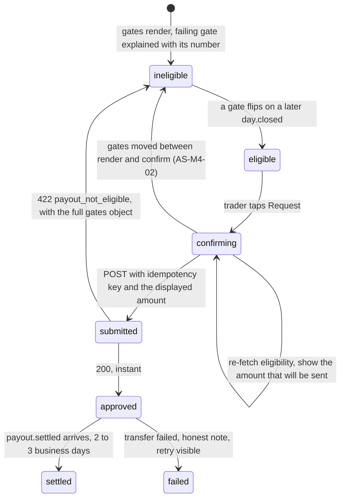

# M4: Trader Portal

Constitution section M4, Appendix D2 and D5, Appendix E (the Lovable and Base44 lessons), Appendix F (the anti-AI-tell standard), Appendix B5 ten-section template.

The portal is where Merit's product promise either lands or does not. Everything the rules engine computes correctly is worthless if the trader cannot see why, and every competitor complaint theme in [TOP10_FIRMS](../../research/TOP10_FIRMS.md) is ultimately about a trader not being able to see the rule that decided their outcome. This module has one job: **render exactly what the engine computed, never recompute it, and never round it.**

**Amended and approved at the Wave 3 batch 1 gate (2026-08-14).** Two rulings changed this module materially: **[ADR-019](../decisions/ADR-019.md)'s Merit Wallet adds a tenth screen** (SC-M4-10, section 3.5), and **[ADR-020](../decisions/ADR-020.md)'s indicative realtime layer supersedes this plan's "polling, not websockets, in v1" position** (section 3.6) and adds two invariants about labeling. The module's governing sentence is unchanged and now carries more weight, not less: render exactly what the engine computed, never recompute it, never round it, **and never let a live number look like a decided one.**

**Amended again by [ADR-039](../decisions/ADR-039.md) (FOLD-01 session 5, 2026-08-16), and this one adds a second governing sentence rather than qualifying the first.** Auth widens to three factors and a session now has two levels rather than one, so the portal has to render an **authority boundary** it never had to render before: [SECURITY](../architecture/SECURITY.md) C-27 says any single factor sees every read surface and no single factor changes anything sensitive. The whole of this module's share of that ruling is one word. **The boundary is shown, never hit.** A trader whose session cannot perform a sensitive action learns it from a disabled control carrying its own reason, in the same render as the action, and never from a refusal after they committed to it. That is section 3.7, INV-M4-14 and INV-M4-15, and it is the same idiom this module already uses twice: INV-M4-03's payout button carries its failing gate's text, and INV-M4-05 renders a skipped gate as disabled rather than as satisfied. **A third instance of an existing pattern, not a new one**, which is the reason it is cheap to get right and would have been expensive to get wrong.

**Identifier conventions:** `INV-M4-nn` invariants, `SD-M4-nn` schema deltas, `SC-M4-nn` screens, `FM-M4-nn` failure modes, `AS-M4-nn` adversarial scenarios, `OQ-M4-nn` open questions, `DEP-M4-nn` dependencies.

---

## 1. Purpose and invariants

### 1.1 What this module is

`apps/portal`, a Next.js App Router application, mobile first, consuming `/api/v1` and nothing else. Passwordless auth: **passkeys plus email OTP plus SMS OTP**, any single factor sufficient for login ([ADR-039](../decisions/ADR-039.md), [SECURITY](../architecture/SECURITY.md) C-01), and **what a single factor may then do is C-27's question rather than this section's**. **Eleven** screens, listed in section 3.1.

### 1.2 What this module is not

| Not M4 | Whose job | Why the boundary is here |
|---|---|---|
| Computing any rule, gate, threshold, or payable amount | [M1](M01-rules-engine.md) through the API | Appendix E's Enrichlead lesson: business rules enforced in the UI are business rules that do not exist. The portal has **no arithmetic on money** beyond formatting cents to a string |
| Deciding what a trader may see | API, `scopedDb(identity)` | Authorization is server side. The portal not rendering a link is a convenience, never a control |
| Storing anything durable | API | No client-side cache of a money number survives a navigation. See INV-M4-04 |
| Knowing a plan's rules | `plan_versions.copy_blocks` | The rules page renders the account's **pinned** version. There is no rules content in this repo's UI code at all |
| Taking payment | [M3](M03-billing-checkout.md) | The portal links into checkout; the PSP session belongs to M3 |

### 1.3 Invariants

| ID | Invariant | Enforcement |
|---|---|---|
| INV-M4-01 | No money value displayed anywhere is computed client side | Lint rule banning arithmetic operators on any field whose name ends `_cents` or `_bp`; a formatting helper is the only permitted consumer. Review-blocking |
| INV-M4-02 | Every screen showing account state labels the [last closed day](../GLOSSARY.md#last-closed-day) it is as of | `as_of_trading_day` is a required prop on every account-state component. A component that renders a balance without it does not compile ([ADR-002](../decisions/ADR-002.md)'s T+1 posture) |
| INV-M4-03 | The payout request button is enabled **only** when the server said `eligible: true`, and the amount shown is the server's `max_payout_cents` | No client-side gate evaluation exists. The button's disabled state carries the failing gate's own text |
| INV-M4-04 | A payout confirmation re-fetches eligibility immediately before submit, and shows the number it will actually send | AS-M4-02. The number on the confirm screen and the number in the request body are the same variable |
| INV-M4-05 | A gate reported `skipped: true` renders as **disabled**, never as satisfied | EC-050. A green check on a gate that was never evaluated is a lie the trader will eventually catch |
| INV-M4-06 | No response body is trusted for authorization; the portal never receives another identity's data to filter client side | `scopedDb(identity)` server side (D2), plus the negative-authz matrix in [API_CONTRACT section 12](../architecture/API_CONTRACT.md) as CI merge blockers |
| INV-M4-07 | Cross-trader resource access returns `404`, and the portal renders it as "not found", not "forbidden" | Confirmed at the [Wave 2 gate](../decisions/README.md). Existence is not confirmed to a stranger, and the UI must not undo that by wording |
| INV-M4-08 | Every rule sentence on any screen comes from `copy_blocks` on the account's pinned plan version | No rule text is authored in the portal. This is the mechanism behind constitution 0.4's "marketing must equal implementation to the tick" |
| INV-M4-09 | The simulated-environment disclosure appears in the footer, at checkout entry, on certificates, and on the funded dashboard | Constitution section 6, and it is a compliance obligation rather than a design preference |
| INV-M4-10 | No screen in this module is reachable without an authenticated session except the public certificate verification page | Middleware, plus the negative-authz suite asserting 401 on every route unauthenticated |
| INV-M4-11 | Every value sourced from the indicative layer is rendered with an **indicative** label, in the same component, at the point of use | [ADR-020](../decisions/ADR-020.md). Enforced the same way INV-M4-02 enforces `as_of_trading_day`: an indicative component takes a required `tier` prop and a component that renders a live value without it does not compile. A label in a page footer is not a label on a number |
| INV-M4-12 | On feed loss, a live surface falls back to last-closed values **and changes its label in the same render** | The failure this prevents is a live number that silently freezes, which is indistinguishable from a quiet market and is therefore worse than an honest stale number. GS-133 |
| INV-M4-13 | No indicative value is ever an input to a request the portal sends | The payout confirm flow reads eligibility from the authoritative endpoint only, even when a live floor distance is on screen beside it. [ADR-020](../decisions/ADR-020.md)'s hard rule, applied at the one place in the portal where a number becomes a money decision |
| INV-M4-14 | A sensitive action the current session is not elevated for renders **disabled**, carrying C-27's reason and the route to elevate, in the same component | [ADR-039](../decisions/ADR-039.md) amendment 4. Enforced the way INV-M4-02 and INV-M4-11 are enforced: a sensitive-action component takes a required `required_factor` prop and a required `session_elevation` prop, and one that renders the control without both does not compile. **The boundary is shown, never hit.** Section 3.7 |
| INV-M4-15 | The portal never computes whether a session is elevated, and the disabled state is a convenience rather than a control | The server declares the required factor per endpoint and reports the session's own factor and elevation; the portal renders both and decides nothing. Asserted by the negative-authz suite, which calls every sensitive endpoint from a **single-factor session that the client rendered as disabled** and requires the refusal to come from the server anyway. This is INV-M4-06 and section 1.2's "not rendering a link is a convenience, never a control" applied to the one new boundary, and it is stated separately because it fails differently: INV-M4-14 fails at compile time and INV-M4-15 fails in a test |
| INV-M4-16 | The economic calendar panel's source is `economic_calendar` and no external origin. No embed, iframe, or third-party calendar widget renders anywhere in the portal | [ADR-066](../decisions/ADR-066.md) section 2, and it is **the only mechanical form of "one source of truth for when was the news"**. The panel reads Merit's row through `economic_calendar_current`, the same view [M07](M07-risk-abuse.md) `D-04` reads, so a revised release time moves both or neither. An embed cannot carry a revision, cannot be staleness-monitored and cannot be joined to `fills`, so one rendered beside the panel would satisfy the display and satisfy none of `DEP-M7-06`, `D-04` or `FM-M7-08`. Section 3.8, GS-285 |
| INV-M4-17 | **An impersonation session renders the trader's screen, and the only permitted divergences are the persistent banner and the disabled state on the routes [ADR-068](../decisions/ADR-068.md) blocks** | Section 3.9. The banner is app-shell chrome with **no dismiss control in the component's API**, so it cannot be closed rather than being hard to close; the disabled state is INV-M4-15's convenience and never the control, and `GS-300` calls each blocked route directly for that reason. **A third divergence is a defect.** The reason this session type exists is that Merit deleted the credential, so there is no "what do you see on your screen" that survives a trader who cannot describe a screen ([ADR-068](../decisions/ADR-068.md) section 0), and **a support tool that renders a different page has stopped answering the question it was built for**. Stated as an invariant because the pressure runs one way: every later "while we are in here, show the operator one more thing" is individually reasonable and collectively the end of the tool |

---

## 2. Entities and schema deltas

M4 owns no table outright. Four deltas, one of which closes a real gap in the approved model and one of which is the only thing that makes C-27 enforceable at all.

| ID | Table | Change | Why it is not optional |
|---|---|---|---|
| SD-M4-01 | new `certificates` | `id`, `account_id`, `identity_id`, `kind check in ('pass','payout')`, `payout_request_id null`, `claims jsonb`, `signature bytea`, `signing_key_id`, `issued_at`, `revoked_at null`, `revoked_reason null` | [API_CONTRACT section 6](../architecture/API_CONTRACT.md) returns a `certificate_id` and a `verify_url`, and the approved DATA_MODEL has no table behind either. Without a row there is nothing to verify against, and a "verifiable" share card that verifies nothing is worse than no card at all (AS-M4-03) |
| SD-M4-02 | `purchases` | add `rule_diff_acknowledged_at timestamptz null` | [M3](M03-billing-checkout.md)'s AS-M3-05 requires a reset onto a changed plan version to be explicitly acknowledged. M4 renders the diff and captures the acknowledgement, and the timestamp is the artifact that settles the dispute later |
| SD-M4-03 | `sessions` | add `created_ip inet`, `created_user_agent text`, `last_seen_at timestamptz`, `last_seen_ip inet` | Account takeover leading to payout redirection is the highest-value attack on a trader account ([SECURITY section 2.6](../architecture/SECURITY.md)). The trader-visible active-sessions list, and the ability to revoke one, both need this, and so does the anomaly signal that a session moved country mid-life (AS-M4-05) |
| SD-M4-04 | `sessions` | add `auth_factor text NOT NULL check in ('passkey','email_otp','sms_otp')`, `elevated_at timestamptz null`, `elevated_by_factor text null check in ('passkey','dual_channel')`, plus `sessions_elevation_is_complete` refusing one of the pair without the other | **C-27 is unenforceable without it**: a handler cannot refuse an SMS-established session for a sensitive action if the session never recorded how it was established, and an emergent property of two rules is not enforceable. Landed in [`0029`](../../packages/db/migrations/0029_phone_identity_and_auth.sql). **`elevated_by_factor`'s check list is the enforcement and its absences are the ruling**: there is no `sms_otp` value and no `email_otp` value, so a session established by either has nothing to write and cannot elevate itself. There is deliberately **no `elevation_expires_at`**: the window is a launch parameter the config owns ([ADR-037](../decisions/ADR-037.md)), evaluated against `elevated_at` at the moment of the action, so the portal reads a boolean it was given and never a clock it interprets |

---

## 3. Screens and state machines

### 3.1 The eleven screens

| ID | Screen | The one thing it must get right |
|---|---|---|
| SC-M4-01 | Auth (passkey, email OTP, SMS OTP) | No password field exists anywhere. There is no password database to stuff (D2), and widening to a third factor did not change that, which is [SECURITY](../architecture/SECURITY.md) §2.6's claim and the reason C-01 could widen at all |
| SC-M4-02 | Account list | Floor distance, because it is the number traders actually watch, and it is the number that decides whether they trade tomorrow |
| SC-M4-03 | Account detail and equity chart | Every gate, gate by gate, with numbers. Never a single progress bar |
| SC-M4-04 | Payout center | The exact clamped amount, before submit, matching what will be sent (INV-M4-04) |
| SC-M4-05 | Rules page, per account | Rendered from the account's pinned `copy_blocks`. The whole rule, with its operator |
| SC-M4-06 | Purchase and reset | The rule diff when versions differ (SD-M4-02) |
| SC-M4-07 | KYC status | Four honest states, and what to do in each |
| SC-M4-08 | Certificates | Signed, verifiable, disclosure-bearing |
| SC-M4-09 | Referral panel | [M8](M08-affiliate-system.md)'s trader-facing surface, with the required NFA I-26-12 disclosure |
| SC-M4-10 | **Merit Wallet** | The balance, its two directions, and the honest statement of what a wallet balance is: money already earned and already yours, held by Merit until you withdraw it. Section 3.5 |
| SC-M4-11 | **Security and sessions** | Every active session with the factor that established it, revocation, the verified phone, and the phone-change ceremony's state while it runs. Section 3.7 |

**SC-M4-11 records a surface this module had already committed to and never gave a row.** AS-M4-05 counter 2 says "the trader sees every active session with its creation IP, user agent, and last-seen time, and can revoke any of them", and GS-104 asserts a destination change is "visible in the active-session and **security** views". Both are commitments in the approved text; neither had a screen id, and `SD-M4-03` was written in section 2 to serve a screen that section 3.1 did not list. [ADR-039](../decisions/ADR-039.md) forces the omission into the open because the surface now has to carry new content: the establishing factor, and the elevation control that every sensitive action routes through. **The row is allocated here rather than left to whoever builds it**, and the founder can reverse the allocation without any other part of this fold moving, since nothing outside section 3.7 and this table cites `SC-M4-11`. Unlike `SD-nn`, `SC-M4-nn` has no allocation table and no gate, so claiming one costs nothing and leaving a required surface homeless costs a build.

### 3.2 The payout request flow, which is the one that has to be perfect

**Two design rules that come out of this machine and are binding.**

`confirming` re-fetches. It does not trust the number that was on screen when the trader tapped. Between a dashboard render and a tap, a nightly batch can close a day and move a gate, and the difference between "the amount changed underneath me" and "we showed you the change before you confirmed" is the entire difference in how that gets described publicly (AS-M4-02).

**A 422 is never worded as a rejection.** The zero-denial policy means a request that has not cleared its gates is not a denial, and the copy has to carry that distinction: "not yet, here is exactly what is left" rather than "declined". This is a copy rule with a real consequence, since the word "declined" in a screenshot is what a review page is built from.

### 3.3 The consistency meter, always visible

Ruled at the M1 gate (OQ-9): the consistency meter and `profit_needed_to_dilute_cents` are shown **at all times**, not only when the gate fails. The reason is [AS-13](M01-rules-engine.md): eligibility is not monotone in profit, so a trader can make money and become less eligible, and the only defence against that reading as a moved goalpost is that the shape of the rule was visible before it bit.

The meter shows three numbers, always: best day, period profit, and the resulting share in bp against the limit. When the share is under the limit it also shows the headroom. When it is over, it shows `profit_needed_to_dilute_cents` as an amount, not a percentage, because a trader can act on an amount.

### 3.4 The three OQ-2 placements

Ruled at the M1 gate: the funded phase starts at the account size and eval profit is not carried (R-31). This must appear in plain language in three places, and this module owns two of them.

1. **The rules page** (SC-M4-05), in the eval section, as its own sentence rather than a footnote.
2. **The eval progress card** (SC-M4-03), where the profit-target progress is shown, because that is the exact moment a trader is forming the belief that the number they are watching is money they will keep.
3. The pass email, owned by [M10](M10-integrations.md).

The wording is a `copy_blocks` entry, not portal source, so it ships with the plan version it describes.

### 3.5 The wallet screen (ADR-019)

The wallet is where the trader's money sits between earning it and withdrawing it, so the screen's job is to make a genuinely new concept feel like the obvious one. Three elements, and the copy on the first is what decides whether traders trust the feature at all.

**The balance, framed as a payable balance.** The screen says, in plain words, that this is money the trader has already earned and that Merit holds until they move it. It is **not** an account, it earns **no interest**, and it cannot be sent to another trader. Those three negatives are stated affirmatively on the screen rather than buried in the ToS, because a wallet that looks like a bank account will be treated as one, and every misunderstanding lands on support at the worst possible moment. The wording is a `copy_blocks` entry (INV-M4-08) and a counsel-review item (see [legal/](../legal/README.md)).

**Two directions, deliberately asymmetric.** Money in is instant and needs no explanation. Money out has two exits and the screen shows both: **spend** on an evaluation or a reset, which is instant and internal ([M03](M03-billing-checkout.md) section 3.4), and **withdraw** to a bank destination, which carries KYC, the 48 hour destination-cooling window, a $100 minimum, and 2 to 3 business days. **No withdrawal fee**, stated on the screen rather than merely absent, because "no fee" is a claim competitors cannot make and an absence nobody notices.

**The timeline.** Every credit and debit with its cause, because the wallet is a ledger view and a ledger view that does not reconcile to the trader's own memory is the fastest way to lose the trust the wallet was built to earn.

**One thing the screen must not do.** It must not present the wallet balance as a score, a streak, or a level. That is [ADR-019a](../decisions/ADR-019.md)'s bright line arriving in the one place it is most tempting to cross: a balance is money, gamifying money is what the line exists to prevent, and the fact that it is Merit's own ledger rather than a bank makes it more important to treat seriously, not less.

### 3.6 The indicative layer on the dashboard (ADR-020)

[ADR-020](../decisions/ADR-020.md) puts live numbers on the trader dashboard for the first time: **live P&L, projected floor distance, and live win-day and consistency tracking**. This is the largest product change in the module and it is also the easiest place in the entire corpus to accidentally break the thing Merit sells.

**The rule the screens are designed around: a live number and a decided number never look alike.** Not a different tooltip, not a different footnote, a different visual treatment at the point of use (INV-M4-11), with the two never adjacent in a way that invites comparison without context. The trader must be able to answer "is this the number the rules used" without reading anything.

| Element | Tier | What it says |
|---|---|---|
| Live P&L, projected floor distance | indicative | "live, as of a moment ago" |
| Live win-day and consistency tracking | indicative | "on track / not on track today", never "you have 3 win days" |
| Balance, floor, win days, consistency, eligibility | authoritative | "as of last closed session" (INV-M4-02, unchanged) |
| Everything in the payout center | authoritative, always | INV-M4-13 |

**Projected floor distance is the feature and it is also the hazard**, so it gets its own rule. It is the single most useful number Merit can give a funded trader and the single most dangerous to get wrong, because a trader who reads it as authoritative and stops trading one tick early has lost nothing, while one who reads it as authoritative and keeps trading has lost an account. The copy therefore states the projection **and** the enforcement in the same breath: the number is indicative, and the thing that actually stops them intraday is the platform's auto-liquidator sitting at the floor ([DECISIONS](../decisions/README.md), the Wave 2 setpoint ruling), not this display.

**On feed loss the dashboard degrades rather than freezes** (INV-M4-12): live elements fall back to last-closed values with their labels changed in the same render. A frozen live number is the failure mode, because it looks exactly like a market that stopped moving.

**Nothing here touches the payout center.** The confirm flow re-fetches authoritative eligibility exactly as section 3.2 already specifies, and no indicative value enters the request body (INV-M4-13). The socket could be entirely down and the payout path would be unaffected, which is the property that makes shipping tier 2 safe at all.

### 3.7 The authority boundary, shown rather than hit (ADR-039)

[SECURITY](../architecture/SECURITY.md) C-27 gives a session two levels where it had one. Any single factor establishes a session sufficient for **every read surface**; no single factor, and specifically never SMS alone, is sufficient for a **sensitive action**. The portal's entire share of that ruling is the difference between a trader learning it before they act and learning it after.

**The three sensitive actions C-27 names, and where each one surfaces here.**

| Sensitive action | Where the trader meets it | What non-elevated renders as |
|---|---|---|
| **Payout destination change** | SC-M4-11, and the withdraw path on SC-M4-10 | The field is disabled and says a passkey or a second channel is needed to change where money goes, **before** the trader types a destination |
| **Contact change of either kind**, email or number | SC-M4-11 | The change control is disabled with the same sentence. A phone change additionally states the ceremony ahead of it, below |
| **External withdrawal** | SC-M4-10's withdraw direction | The amount field stays usable and the submit is disabled, because a trader who cannot yet submit can still legitimately want to know what they would be withdrawing |

**The failure this prevents is specific and it is not a niceties problem.** A trader logs in by SMS on a phone, opens the wallet, types a destination, confirms it, and receives a `403`. Nothing was stolen and no control failed, and the trader has still learned that Merit's UI offers actions its API refuses, which is the same lesson AS-M4-02 exists to avoid teaching about numbers. **Worse, it teaches the wrong lesson to the one population that matters**: the trader who is actually being attacked sees an identical refusal, so the refusal carries no information. A boundary that is only ever discovered by hitting it is indistinguishable from a bug, and users route around bugs.

**The disabled state is a convenience and the server is the control** (INV-M4-15). The portal renders `required_factor` and the session's own elevation exactly as it renders a failing gate: the server decided, the client displays. The negative-authz suite calls every sensitive endpoint from a single-factor session **that the client rendered as disabled** and requires the server's refusal anyway, because the moment the disabled attribute is the only thing standing between a session and a destination change, C-27 has moved into the client and stopped existing.

**Elevation is a step up, never a re-login.** `elevated_at` and `elevated_by_factor` sit on the session that already exists (SD-M4-04), so the trader does not lose their place, and the elevation window is a config value the server evaluates rather than a countdown the portal renders. **The portal shows that an action is currently available and does not show when it stops being available**, because a visible countdown is a prompt to hurry and hurrying is the attacker's ally on exactly these three actions.

**One thing the elevation prompt must not become, and it is the reason the copy is specified rather than left to the builder.** A prompt that says "approve this on your other device" and nothing more is training the trader to approve prompts, which is the whole mechanism of push-fatigue attacks: the attacker supplies the volume and the trader supplies the tap. **Every elevation prompt names the action it is elevating, and where an amount or a destination is involved it names those too**, so an approval is an approval of one specific thing. A trader who receives an elevation prompt for a destination change they did not start must be able to read what it is for without opening the portal, which is also what makes it a takeover alarm rather than an inconvenience.

**The phone-change ceremony is visible while it runs.** [SECURITY §4.8](../architecture/SECURITY.md) stores it as six enforced legs in `phone_change_requests`, and a ceremony whose state the trader cannot see is one they experience as a change that did not happen. SC-M4-11 renders the request's state, that the prior number and the email were both notified, and **that an external-withdrawal hold is running with the date it lifts** ([M19](M19-kyc-identity.md) owns the ceremony; M4 owns the rendering). The hold is stated as a date rather than a duration for EC-046's reason: a trader can act on a date and cannot evaluate a countdown of business hours.

**What a SIM-swapped session still sees, stated because it is the residual and not a gap.** Everything. Balance, withdrawable, floor distance, and history, which is enough for an attacker to decide whether the account is worth the next step. That is C-27's deliberate trade and AS-M4-05 prices it: read access is the cost of any-single-factor login, the controls that matter sit on the change, and the trader's own defence is SC-M4-11's session list, which is why revocation is on the same screen as the factor that established the session.

### 3.8 The economic calendar panel (ADR-066)

[ADR-066](../decisions/ADR-066.md) section 5.1 admits a dashboard panel rendering **Tier-1 economic events in the trader's timezone**. It is a panel on the dashboard beside section 3.6's indicative layer, **not a twelfth screen**, so section 3.1's table does not move and no `SC-M4-nn` is claimed.

**It renders from Merit's own row and from no embed, and that was settled before it reached this module.** [M07](M07-risk-abuse.md) `DEP-M7-06` has declared a maintained Tier-1 economic calendar as data since M07 was written, `FM-M7-08` has required its staleness alarm, and **no table satisfied either** until [`0039`](../../packages/db/migrations/0039_economic_calendar.sql). So the panel is not the reason the dataset exists; `D-04` is, and the panel is the second reader of a row the detector already needed. That ordering is the whole argument: an embed would have satisfied the panel and satisfied **none** of `DEP-M7-06`, `D-04` or `FM-M7-08`.

| Element | Tier | What it says |
|---|---|---|
| Upcoming Tier-1 releases, in the trader's local timezone | **authoritative** | The scheduled instant Merit holds, converted for display only |
| A release whose time has been revised | authoritative | The **current** revision, and that it moved |
| The calendar's own freshness, when it is stale | authoritative | The panel says the calendar is stale rather than showing a confident empty list |

**The panel is authoritative rather than indicative, and the distinction is not a technicality here.** Section 3.6's tiering separates "a number a moment ago" from "a number the rules used". A scheduled release time is neither: it is a **published fact Merit transcribed**, and it does not move with the market. Rendering it as indicative would teach the trader that release times are approximate, which is the opposite of true and the opposite of useful.

**The timezone conversion is a rendering and never a stored value.** One row, one UTC instant, converted per trader at the point of display. `GS-285` is exactly this: the same row on two dashboards in two timezones, both correct, with no second row and no timezone column anywhere. A timezone stored beside the instant would be a second answer to "when was the news", which is the failure `FM-M7-08` guards, arrived at from inside the building instead of from an embed.

**A stale calendar is stated rather than hidden, and this is INV-M4-12's rule applied to a second surface.** Section 3.6 already refuses to let a live number silently freeze, because a frozen number looks exactly like a quiet market. **An empty calendar panel looks exactly like a quiet week**, and it is the same failure: the trader reads "nothing scheduled" and trades into a release. So when the calendar is past its staleness threshold the panel says so, in the same render, rather than showing an empty list it cannot stand behind. `GS-287` pins the detector half of the same moment.

**What the panel deliberately does not do.** It does not tell the trader that trading a news window is prohibited, because it is not: `D-04` detects a **pattern across many events** and [M07](M07-risk-abuse.md):109 is explicit that "one trade around a release is a normal trading day". A panel that implied otherwise would be a rule the corpus does not contain, rendered in the client, which is `INV-M4-08`'s failure in a new place.

---

### 3.9 The impersonation banner, and why the trader never sees it (ADR-068)

[ADR-068](../decisions/ADR-068.md) requirement 4 says a **persistent** banner for the whole session, and requirement 7 says the trader is **not** told an impersonation session happened. Read as two rules about one screen those contradict each other. **The resolution is not a rule anybody has to remember.** The trader authentication path resolves a bearer token on `sessions.refresh_token_hash` ([`0002_identity.sql:342`](../../packages/db/migrations/0002_identity.sql)), and `IMPERSONATION-C1` in [`0042`](../../packages/db/migrations/0042_impersonation_sessions.sql) refuses that row **in both directions**, so an impersonation token can never be the token a trader's own session carries. **The banner renders inside the impersonation session and there is no other session it could reach**, which makes non-disclosure a consequence of the session-type boundary rather than a portal responsibility.

**This module writes the surface and rules none of it.** [ADR-068](../decisions/ADR-068.md) rules the properties, [`0042`](../../packages/db/migrations/0042_impersonation_sessions.sql) enforces the box, and the four explicit refusals are server-side authorization decisions in [M05](M05-payout-system.md), [M19](M19-kyc-identity.md) and [M20](M20-wallet.md). **No component named here refuses anything.**

**What "not a dismissible toast" means mechanically**, stated because "persistent" is a word a builder can satisfy with a toast that comes back:

| Property | What it means here |
|---|---|
| **It occupies layout** | A reserved band in the app shell, never an overlay. Nothing stacks over it, nothing scrolls it away, and no `z-index` accident can lose it |
| **It has no dismiss control** | The component takes no `dismissible` prop and no `onDismiss`. **The absence of the prop is the control**, in the idiom INV-M4-02 and INV-M4-11 already use. A disabled close button is a close button somebody re-enables |
| **It renders on every screen** | Shell chrome, so it is on all of section 3.1's screens **and on every error, empty and loading state**. A banner absent from the error page is absent exactly when an operator is somewhere unexpected |
| **It survives reload and deep link** | It renders from the session the server resolved, never from client state. A banner held in memory is gone on the first hard refresh, which is the ordinary way an operator works |
| **It is not a screen** | **No `SC-M4-nn` is claimed**, on section 3.8's precedent: chrome across every screen is not a new one, and section 3.1's table does not move |

**What it says.** Every field is a column on `impersonation_sessions` ([`0042`](../../packages/db/migrations/0042_impersonation_sessions.sql)) rather than a string the portal composes:

| Field | Column | Why it is on the banner |
|---|---|---|
| That this is an impersonation session | the session type itself | An operator's read of this screen is otherwise indistinguishable from the trader's, which is both the point of the tool and the risk of it |
| The admin actor | `admin_user_id` | An operator on a shared machine or a second window has to see whose session this is without leaving the page |
| The subject | `subject_identity_id` | The wrong subject is the mistake this banner exists to surface in one second rather than in one page |
| The reason | `reason_code` and `reason_detail` | Requirement 5. The vocabulary is closed and the detail is `NOT NULL` and non-blank, so there is always something true to render |
| The expiry | `expires_at` | Below, and it is the one field this module argues for rather than transcribes |
| An explicit exit | writes `ended_at`, `ended_by` and `end_reason` | [FOLD-04](FOLD-04-impersonation-and-admin-parity.md) section 4.1 requires an explicit exit that is its own audited event, so it is a control **on the banner** and not a closed browser tab |

**The expiry is rendered, and section 3.7 refuses to render exactly this kind of clock, so the divergence is argued rather than assumed.** Section 3.7 keeps the elevation window off the screen because **a visible countdown is a prompt to hurry and hurrying is the attacker's ally**, and its audience is a trader under pressure. **This clock has the opposite audience and the opposite meaning.** It is a **box** rather than a window of opportunity, its subject is the operator rather than the target, and `GS-301` is the failure that hiding it produces: a session that reaches expiry mid-view, whose next request is refused, on a page that still looks live. **An operator surprised by an expiry re-initiates**, which writes a second `impersonation_sessions` row with a second reason for one piece of work, and a support practice that routinely re-initiates is the practice that eventually asks for [ADR-068](../decisions/ADR-068.md) section 5's two hour ceiling to be raised. **Showing the box is what keeps the box from being argued with.**

**The clock is displayed and is never authoritative.** The banner renders `expires_at` as the server declared it. The refusal at expiry is the server's, and `IMPERSONATION-C2` makes a page view outside the session's box **unwritable**, so a request served late fails at the moment it tries to record itself rather than succeeding quietly. **A client that believes the session is live is not evidence that it is**, which is INV-M4-15's sentence applied to a clock instead of to an elevation.

**The blocked controls render disabled, and that is the second deliberate divergence from the trader's screen.** [ADR-068](../decisions/ADR-068.md) requirement 1 is **server-side rejection, never UI hiding**, and `GS-300` calls the route directly for that reason. The disabled state is rendered anyway, for section 3.7's reason one audience over: an operator who discovers the boundary by hitting it has learned that this surface offers actions its API refuses, and that lesson does not stay inside one session. **The refusal is the server's and the disabled state changes no authorization**, which is INV-M4-15 unchanged and not a second reading of it.

**Two divergences is the whole permitted list, and that is INV-M4-17.** The operator sees the trader's screen **plus one band and minus the affordances for the routes [ADR-068](../decisions/ADR-068.md) blocks**, and nothing else. A third divergence is a defect rather than a feature, because [ADR-068](../decisions/ADR-068.md) section 0 says why this session type exists at all: Merit is passwordless, there is no credential to walk a trader through, and impersonation is what is left of "what do you see on your screen". **A tool that renders a different screen has stopped answering that question.**

**What the banner is not, in one line, because the two failure modes must not be closed on the same side.** Its absence is a **disclosure defect and never an authorization defect**. A refusal that stopped working is not repaired by rendering a banner, and a banner that stopped rendering does not make a refusal fail. It is also **not** a disclosure to the trader and **not** a substitute for the audit trail: requirement 6's record is `impersonation_page_views`, which stores the **route template and never the resolved path** ([`0042`](../../packages/db/migrations/0042_impersonation_sessions.sql)), because that table is read by people reviewing an operator's conduct rather than by people who need the trader's account id a second time.

---

## 4. API endpoints consumed

M4 owns no endpoint. It consumes [API_CONTRACT sections 3, 5, 6, and 7](../architecture/API_CONTRACT.md) verbatim, and adds no field to any of them. What this plan records is the **one obligation per endpoint** that is easy to get wrong.

| Endpoint | Obligation |
|---|---|
| `GET /accounts` | Render `as_of_trading_day` on the card itself, not in a tooltip (INV-M4-02) |
| `GET /accounts/:id` | `progress` is a projection to display, never an input to a client-side decision. `next_eligible_trading_day` renders as a **date**, because a count of trading days is a rule a trader cannot evaluate (EC-046) |
| `GET /accounts/:id/eligibility` | Every gate rendered, including passing ones, including skipped ones as disabled (INV-M4-05). This endpoint is cheap by design and is called on every dashboard render |
| `POST /accounts/:id/payout` | Idempotency key generated once per confirm session, not per tap. A double tap must produce one payout, and the second response must be the first's result |
| `GET /accounts/:id/marks` | The equity chart. A day carrying `corrected: true` is visibly marked, because a chart that silently changes shape is how trust in the data goes |
| `GET /accounts/:id/timeline` | Trader-safe subset only. The portal never receives detector internals or other identities' ids, so it cannot leak them (INV-M4-06) |
| `GET /accounts/:id/certificate` | See AS-M4-03 |
| `GET /plans/:id/versions/:v` | The rules page for an account reads the **pinned** version, not the current one |
| `POST /kyc/session`, `GET /kyc/status` | Four states, four different pieces of advice. `rejected` is the hard one and gets a support route, never a dead end |
| `POST /auth/otp` | Carries the **channel**. The portal offers email and SMS as peers rather than as a fallback, because C-01 makes any single factor sufficient and a UI that calls one of them "fallback" is describing a hierarchy the server does not have |
| `GET /me` | The session's **own** `auth_factor` and its current elevation. This is the input to every INV-M4-14 render, and it is the reason the portal never has to reason about factors: it is told |
| The sensitive-action endpoints | Each declares its **required factor** in its own response, so a control's disabled state and the server's refusal are read from one declaration rather than two lists that drift. [API_CONTRACT §12](../architecture/API_CONTRACT.md)'s negative-authz matrix gains the required-factor column, and `CI-06k` asserts every sensitive action C-27 names declares a non-single factor |

**The contract rows for the auth and phone surface land with [API_CONTRACT](../architecture/API_CONTRACT.md) in the registries session, not here.** `POST /auth/otp`'s channel, the phone verification and change endpoints, the session-list and revocation endpoints SC-M4-11 needs, and §11's rate-limit rows are all that session's work; this table records **M4's obligation against each**, which is what section 4 has always been for. Naming them is deliberate: [FOLD-01 §6.2](FOLD-01-phone-identity.md) records that no gate catches a missing endpoint, and the session-list endpoint in particular has been owed since AS-M4-05 was approved and has never appeared in the contract.

---

## 5. Events emitted and consumed

M4 emits no domain events. It **consumes** them for live UI, and it is the surface where several of them become a human experience.

| Event | What the portal does with it |
|---|---|
| `day.closed` | Refresh the account card. The one moment per day where every number changes at once |
| `phase.passed` | The pass celebration, which must state the funded reset in the same view (section 3.4) |
| `phase.pass_deferred_consistency` | The single most important explanatory moment in the eval. The card explains dilution with the actual number needed |
| `breach.detected` | An honest, non-euphemistic account state, with the floor, the low, and the shortfall, and a link to the reset flow with no dark pattern in it |
| `payout.approved`, `payout.settled`, `payout.transfer_failed` | The status timeline. `transfer_failed` gets a truthful note and a visible retry, because silence here is what payout-trust collapse is made of |
| `rule.floor_locked` | A timeline entry explaining that the floor is now permanent, and what the loss room is from here ([ADR-014](../decisions/ADR-014.md)) |
| `kyc.*` | The status card |
| `account.graduated` | The ladder completion, with the live-invitation state |
| `phone.verified`, `phone.change_requested` | SC-M4-11's timeline. A phone change is a credential change and the trader's own record of it is what makes an unauthorized one visible to them. The event definitions land with [EVENTS](../architecture/EVENTS.md) in the registries session; what M4 records here is that it consumes them |

**Delivery of domain events is via polling, not websockets.** These events are T+1 by construction; a socket to deliver a number that changes once a day is infrastructure with no purchaser. Polling on focus plus a 60 second interval on the dashboard is sufficient.

**This plan's original conclusion, that v1 ships no websocket at all, is superseded by [ADR-020](../decisions/ADR-020.md).** A socket now exists, and the distinction that makes both statements true is worth keeping: **the socket carries indicative market data, never domain events.** A `day.closed` is still delivered by polling, because it happens once and the portal can wait a minute for it. A live floor distance is delivered by socket, because it changes continuously and is the number a funded trader watches all session. The two never share a channel, which also means a socket outage cannot delay a domain event.

---

## 6. Failure modes

| ID | Failure | Blast radius | Detection | Recovery |
|---|---|---|---|---|
| FM-M4-01 | A displayed number disagrees with the engine | The whole product promise. One screenshot of a mismatch is worth more to an adversary than any exploit | INV-M4-01's lint rule; a contract test asserting every displayed field maps to exactly one API field | Structural: the portal has no arithmetic to be wrong |
| FM-M4-02 | Stale eligibility, request submitted against a moved gate | Trader believes the firm changed the number underneath them | Re-fetch at confirm (INV-M4-04); the server re-evaluates regardless | 422 with the full gates object; the UI explains the change rather than reporting a failure (AS-M4-02) |
| FM-M4-03 | IDOR: one trader reads another's account | **Firm-ending.** This is the single most common vibe-code fatality (Appendix E, Lovable and Base44) | `scopedDb(identity)` plus a named negative-authz test per endpoint per resource, as CI merge blockers | Structural. The portal is not the control and must never be described as one |
| FM-M4-04 | Session hijack leading to payout destination change | Money to an attacker, and the account's own trader disputes it | 48 hour cooling plus re-verification on destination change (D4); session anomaly on country change (SD-M4-03) | Destination changes are not instant, which is the only control that survives a valid session (AS-M4-05) |
| FM-M4-05 | The portal renders a rule from its own source rather than `copy_blocks` | Marketing and implementation diverge, silently, exactly as constitution 0.4 forbids | A build-time check that no rule-shaped string literal exists in portal source | Move the sentence into `copy_blocks` on the plan version, where it ships with the rules it describes |
| FM-M4-06 | A certificate is shared that the firm cannot verify | The transparency moat inverts: forged proof of payouts damages the thing it imitates | Signature plus a public verification page backed by SD-M4-01 | Verify page is authoritative; an unverifiable card is reported as unverifiable, never as false (AS-M4-03) |
| FM-M4-07 | Notification says eligible, the portal says not | The highest-volume support wave available | Notifications carry `as_of_trading_day`; the portal is authoritative | The email states the day it was true on. See AS-M4-06 |
| FM-M4-08 | Mobile layout hides the failing gate below the fold | Traders conclude the rule is arbitrary because they never saw it | Mobile-first design, plus a visual test asserting the failing gate is above the fold at 375px | Layout fix; this is a correctness bug, not a polish item |
| FM-M4-09 | The portal ships a visual AI tell | A skeptical trader reads "another AI-generated prop firm", which for a firm holding payouts is a trust wound | Appendix F's hard-fail checklist as a review gate, plus a Playwright slop-score pass | Reject in review. Appendix F is binding, not advisory |
| FM-M4-10 | A sensitive action renders **enabled** to a non-elevated session | C-27 becomes a `403` the trader meets after committing, which reads as a broken product to the honest trader and tells the attacker nothing they did not already know. The asymmetry is the whole point: hitting the boundary costs the honest trader a wasted attempt and costs the attacker nothing | INV-M4-14's required props fail the build; the negative-authz suite asserts the server refuses regardless (INV-M4-15) | Structural on the render side. **The refusal is never the recovery**, because a refusal the trader reached is the failure |

---

## 7. Adversarial scenarios

**Six listed, five novel.** The one marked "extends" takes Appendix D4 somewhere specific to this surface.

### AS-M4-01: The portal as the ring's calculator (NOVEL)

**Attack.** Merit's differentiator is showing the whole rule, including `profit_needed_to_dilute_cents`, continuously (OQ-9's ruling). For an honest trader that is the difference between a rule and a mystery. For the hedged-pair ring in [M01 AS-02](M01-rules-engine.md), it is a **free, authoritative, real-time API for the exact amount of manufactured profit needed to unlock a capped extraction.** The ring does not have to model our consistency rule; we compute it for them, per account, every day.

**Numbers.** [M01 AS-02](M01-rules-engine.md) prices the manufactured-dilution attack at roughly 2,000c of spread and commission to unlock a 150,000c cap, and the hard part is knowing exactly how much to manufacture. The portal removes the hard part and removes the overshoot, which is the difference between a ring paying for three sloppy dilution days and paying for the minimum.

**Counter, and the honest answer is that we accept it.** Hiding the number does not stop a ring: they can derive it from the published rule with a spreadsheet, since the rule and every parameter are public by design (constitution 0.4). Hiding it only stops the honest trader who does not build spreadsheets, which is the majority. So the number stays visible, and the counter moves to where it belongs: the engine already publishes `profit_needed_to_dilute_cents` into `engine_gates`, which makes M7's detector arithmetic rather than inference. **A cluster of small positive days appearing on an account precisely while consistency is its only failing gate, with an inverse-correlated sibling, is the signature**, and it is only cheap to detect because the same number is stored. Transparency raises the ring's efficiency and simultaneously hands us the detector. GS-100.

### AS-M4-02: The number that changed between the tap and the send (NOVEL)

**Attack.** Not an attacker. The nightly batch. A trader opens the dashboard at 23:58 showing `max_payout_cents` of 150,000, the batch closes a new day at 00:05 with a losing session, and the trader taps Request at 00:07. Naively the request sends 150,000, the server clamps to 90,000, and the trader receives an amount they never agreed to. The support conversation is unwinnable because from the trader's side the firm quietly reduced a number after they committed.

**Why it nearly works.** Every component is correct. The dashboard was accurate when rendered. The server clamp is correct and is exactly what [ADR-009](../decisions/ADR-009.md) specifies. The failure is entirely in the seam.

**Counter.** The `confirming` state (section 3.2) re-fetches eligibility and shows the amount that will actually be sent, and the request body carries that same variable. When the number moved, the confirm screen says so explicitly and requires a fresh confirmation. And because [ADR-009](../decisions/ADR-009.md) made `amount_cents` optional, the safest client behavior is to **send the amount it displayed** rather than omitting the field, so that the server's clamp can only ever reduce it and the trader's screenshot and their payout agree. GS-101.

### AS-M4-03: The forged payout certificate (NOVEL)

**Attack.** Certificates are cheap virality and every competitor has them, which means adversaries already know the format. A forged card claiming a $1,500 Merit payout that never happened is trivially made in an image editor. Two directions of damage, and the second is worse. Outward: a scam account uses fake Merit payout proof to sell a signal service, and the reputational cost lands on Merit. Inward: a trader forges a card, Merit disputes it, and the argument is Merit's word against an image, which is exactly the position [M12](M12-transparency-platform.md)'s whole trust strategy exists to avoid.

**Counter.** The card is a rendering; the **certificate is the row** (SD-M4-01). Every card carries a short verification code resolving to a public page that states, from the signed row, what Merit actually issued: plan, size, trading day, and amount for a payout card. Three design rules make it work.
1. **The verification page is the authority and the image is not.** An unverifiable code returns "no certificate with this code", never "this is fake", because the honest claim is the defensible one.
2. **Revocation exists** (`revoked_at`). A certificate on an account later closed for chargeback or enforcement is revoked with a reason, and the verify page says so. Without revocation the firm's own proof outlives the fact it proved.
3. Claims are minimal by construction: no identity, no email, no cumulative totals. A certificate is a fact about an account on a day, and the smaller the claim, the less there is to forge usefully.

GS-102.

### AS-M4-04: The breach screen as a dark-pattern surface (NOVEL)

**Attack.** The moment of maximum vulnerability in the entire product is the breach screen. A trader has just lost an account, is emotional, and a reset purchase is one tap away. Every dark pattern in the funnel playbook works better here than anywhere else: a countdown discount, a pre-checked upgrade, an obscured floor number, a "you were so close" framing. The revenue is immediate and measurable, and the cost is invisible for months and then arrives all at once as a Trustpilot theme.

**Why it belongs in an adversarial list.** The adversary is Merit's own future incentive under revenue pressure. Constitution M4 says "zero dark patterns" and Appendix F's copy rules say the rest, but a documented rule with no test is a rule that erodes.

**Counter, made structural.** The breach screen shows the arithmetic first: the floor, the day's low, the shortfall in cents, and which rule (`breach_kind`), rendered from the event payload. The reset offer is present, honestly priced, below the explanation, with **no countdown, no pre-selection, and no comparative framing**. This is enforced as a review checklist item with a named test asserting the breach detail is above the reset call to action at every breakpoint, because the ordering is the control. GS-103.

### AS-M4-05: Account takeover for payout redirection (extends Appendix D4)

**Attack.** D4 names the classic vector. Its portal-specific shape is sharper than the generic case because of two Merit properties: payouts are **instant and mechanical** with no human in the loop, and a funded account's `withdrawable` is publicly visible on the dashboard, so an attacker with any session can see immediately whether the account is worth taking. Passwordless auth removes credential stuffing (there is no password database to stuff) but does not remove session theft, OTP interception, or a passkey registered on a device the attacker controls.

**The SIM-swap shape, added by [ADR-039](../decisions/ADR-039.md), and it is the cheapest entry this list has ever carried.** SMS OTP is now a login factor, so an attacker who ports the trader's number does not need to steal a session or phish a passkey: they authenticate as the trader, first try, with a code the carrier delivers to them. **The swap is a social-engineering attack on a third party Merit has no relationship with**, which is what separates it from every other row here, and [SECURITY §2.6](../architecture/SECURITY.md) carries it and OTP interception as two rows rather than one because interception leaves the number where it is, so the phone-change controls never fire and C-27 is the whole defence.

**What the attacker gets, and it is worth stating exactly rather than reassuringly.** A complete read of the account: balance, withdrawable, floor distance, plan, history, and enough to decide whether to continue. **What they do not get is any change**, because `sessions.elevated_by_factor` accepts `passkey` and `dual_channel` and has no `sms_otp` value to write (SD-M4-04). The destination cannot move, the contacts cannot move, and the withdrawal cannot be submitted. **The attacker's next move is therefore the phone-change ceremony**, which is where [SECURITY §4.8](../architecture/SECURITY.md)'s six legs meet them, and the second of those legs notifies the number they just took **and** the email they did not.

**Counter, layered, because no single one survives a valid session.**
1. **Payout destination changes trigger a 48 hour cooling window plus re-verification** (D4). The attacker's session is valid and the change still does not take effect today, which converts an instant theft into a detectable one.
2. **The trader sees every active session** with its creation IP, user agent, and last-seen time, and can revoke any of them (SD-M4-03). This is the control that lets the victim act before the firm notices.
3. **Passkey registration is itself a notified event**, because a new authenticator on the account is the quietest possible takeover step.
4. A session whose country changes mid-life is a signal to [M7](M07-risk-abuse.md), not a block, since traders travel and blocking on geography would generate more harm than it prevents.
5. **C-27, which is the only one of these that is a database vocabulary rather than a rule somebody implemented** (SD-M4-04, section 3.7). A single-factor session sees everything and changes nothing, and the portal shows that boundary rather than letting the attacker discover it, which costs nothing: **the attacker learns the same thing from one `403` that the honest trader learns from a disabled button**, so showing it gives away no defence and removes the failure the honest trader would otherwise take.
6. **Every session now carries the factor that established it** (`sessions.auth_factor`), so the session list is the surface where a trader sees a login by SMS that they did not perform, which is the SIM swap's only trader-visible symptom **before** the phone-change notice arrives.

**And the residual, named rather than argued away.** A trader whose number is swapped, who has no passkey and does not read the email, is protected by the 48 hour hold and by nothing else. That is the case §4.8 leg 3 exists for, and it is the reason the hold's ordering is asserted by a database constraint rather than by a handler.

GS-104.

### AS-M4-06: The eligibility notification that is already stale (NOVEL)

**Attack.** Not an attacker. Physics. A "you are now eligible" notification is generated from a `day.closed` event. The trader reads it the next evening, after another day has closed, and the account is no longer eligible because a losing day moved the buffer or a new best day broke consistency ([AS-13](M01-rules-engine.md)). The trader experiences a firm that invited them to request money and then said no. This is the highest-volume support wave available to us, and it is entirely self-inflicted.

**Counter.** Three things, all cheap.
1. **Every notification carries the trading day it was true on**, in the body, not in metadata: "as of Thursday 12 November". The claim is then permanently true and the trader can reconcile it themselves.
2. **The eligibility notification links to the eligibility screen, never to a request action.** A notification that deep-links to a Request button is a notification that promises an outcome.
3. **A losing-day notification is not sent**, but the eligibility screen always shows the current state, so the asymmetry is one of push rather than of truth. Notifying a trader that they became ineligible is technically transparent and practically cruel, and the state is one tap away for anyone who wants it.

GS-105.

---

## 7.9 Verification UX in the portal

[M19 section 7.9](M19-kyc-identity.md) carries the full specification; what M04 owns is the rendering, and three of its requirements are portal surfaces rather than copy decisions.

| Surface | Requirement |
|---|---|
| **The trigger moment** | **One** contextual prompt, leading with the achievement: "**You passed. One quick step to activate your funded account, about 2 minutes.**" Never a modal that blocks the dashboard |
| **The persistent card** | After the prompt, a dashboard card that waits. **Repeated prompting reads as accusation regardless of wording**, so the card is the only reminder |
| **Save and resume** | A trader who abandons mid-flow returns to exactly where they were. This is the single highest-value item in the whole spec, because abandonment is the dominant failure and a lost place is why people do not come back. GS-206 |
| **Embedded provider flow** | Rendered in place, never a redirect to an unfamiliar domain, which reads as phishing to exactly the security-conscious trader Merit wants |
| **The Verified badge** | Permanent and visible. A status the trader keeps, not a gate they passed and cannot confirm |
| **Failure** | Routes to a human. **The words "decisions are final" may not appear in any string this module renders** |

**The vocabulary rule is binding on this module's copy and is testable:** no trader-facing verification string contains "fraud", "suspicious", "risk", "flagged", or "review". Those words are internal-tier. A lint over the portal's string catalogue is the cheapest possible enforcement and it belongs in CI alongside the Appendix F em-dash check.

## 8. Test plan

### 8.1 Suites

| Suite | Prefix | Count | Runs | Blocks |
|---|---|---|---|---|
| Component render contracts (every field maps to one API field) | `M4-R-nn` | 22 | every commit | merge |
| Negative authz, D5 matrix | `M4-N-nn` | **one per endpoint per resource, plus one per sensitive action from a single-factor session** (INV-M4-15) | every commit | merge |
| E2E happy path (buy, pass, request, settle) | `M4-E-nn` | 1 plus the 10 highest-value unhappy paths | every commit | merge |
| Visual and layout, 375px and 1280px | `M4-V-nn` | **one per screen in section 3.1** | every commit | merge |
| Appendix F slop score | `M4-F-01` | 1 | every commit | merge |
| Golden fixtures | `GS-nnn` | 6 owned (GS-100 to GS-105) | every commit | merge |

**Two counts in that table were replaced by the rule that produces them, and one of them was already wrong.** The visual suite read "9, one per screen" against a section 3.1 that has listed **ten** screens since [ADR-019](../decisions/ADR-019.md) added the wallet, so the stated count and the stated rule disagreed and the rule was the true one. Rather than write "11" and wait for the next screen, both rows now carry the rule, per [ADR-034](../decisions/ADR-034.md): a hand-maintained count with no CI span is a number that drifts silently, and this one had. **No ordinal is claimed for the finding**, on session 31's ruling that the tally of hand-maintained counts is itself double-booked.

**`M4-F-01` deserves a sentence** because a lint rule for design taste sounds unserious and is not. It is a Playwright pass asserting the absence of the specific, enumerable tells in Appendix F: an indigo-to-purple gradient, a 3 to 4px colored left border on a card, Inter or Poppins as the body face, a centered hero with a pill badge above the H1, and uniform 16px radius across every surface. These are mechanically detectable, and the constitution classes each as a hard fail, so they are a test rather than an opinion.

### 8.2 Named scenarios owned by this module

| ID | Scenario | Pins |
|---|---|---|
| GS-100 | Consistency meter and dilution amount render on a passing account | Both are visible when the gate passes, not only when it fails. The OQ-9 ruling, and the reason AS-13 does not read as a moved goalpost. AS-M4-01 |
| GS-101 | Eligibility moves between dashboard render and confirm | The confirm step re-fetches, states that the amount changed, and requires fresh confirmation. The request body carries the displayed amount so the server clamp can only reduce it. AS-M4-02 |
| GS-102 | Certificate verification: valid, unknown, and revoked | Valid resolves to the signed claims; unknown returns "no certificate with this code" and never "fake"; revoked states the revocation. AS-M4-03 |
| GS-103 | Breach screen ordering at every breakpoint | Floor, low, shortfall, and rule name appear above the reset call to action at 375px and 1280px, with no countdown and no pre-selected option. AS-M4-04 |
| GS-104 | Payout destination change enters a 48 hour cooling window | The change is accepted, does not take effect, is notified to the existing contact, and is visible in the active-session and security views. AS-M4-05 |
| GS-105 | Eligibility notification names its trading day and links to the gates screen | The notification body carries "as of <trading day>" and deep-links to eligibility rather than to a request action. AS-M4-06 |

**The scenarios for the authority boundary are allocated and these citations are now live.** They were named in words rather than in identifiers until the registries session wrote the rows, because `CI-06d` fails on any `GS-nnn` cited anywhere in `docs/` that does not resolve, and writing an identifier before its row exists breaks the build. The three this module owed, in the order they were listed:

| Owed | Allocated | What it pins |
|---|---|---|
| A sensitive action **rendered disabled** to a single-factor session with its reason and its route | **GS-267** | The boundary is **shown rather than hit**. Every read surface renders and each sensitive action carries its route to elevation, so a trader learns what they must do before they act |
| The same endpoint **refusing that session on the server** regardless of what the client rendered | **GS-266** | `INV-M4-15`, and it is the half a rendering test cannot cover. The refusal is a vocabulary rather than a check: `sessions.elevated_by_factor` has no `sms_otp` value to write |
| The **phone-change ceremony visible on SC-M4-11** while its hold runs | **GS-269** | `withdrawal_hold_until` is exposed as a running time rather than inferred, so the trader meets the hold on the security screen instead of as an unexplained refusal at the end of it |

**GS-266 and GS-267 are a pair and neither is sufficient**, which is why the module owed both: a boundary tested only where it refuses is indistinguishable from one that refuses everything. [GS-268](../testing/golden-scenarios/34-gs-258-to-gs-272-phone-identity-and-the-authority-boundary.md) runs the SIM-swapped session end to end and pins C-27's own sentence, that it can see everything and change nothing.

### 8.3 Coverage rule

**Every screen has a negative-authz test and a mobile layout test, and no screen merges without both.** Appendix E's finding is that AI-written frontends fail on access control and trust boundaries rather than on syntax, so the two suites that matter most here are the two that are least fun to write.

---

## 9. Observability

### 9.1 Metrics

| Metric | Why it matters |
|---|---|
| `portal.eligibility_views` versus `payout_requests` | The gap is the funnel between knowing you can and doing it. A widening gap means the request flow has friction we did not intend |
| `portal.gate_view_distribution` by failing gate | Which gate traders are actually staring at, which is the leading indicator of the next support theme and pairs with M1's `engine.gate_failure_distribution` |
| `portal.confirm_amount_changed_rate` | AS-M4-02 firing in the wild. Should be small; a spike means batch timing and trader behavior overlap more than modelled |
| `portal.404_on_owned_resource` | A trader hitting 404 on something that is theirs is an authorization bug wearing a not-found costume |
| `portal.session_country_change` | AS-M4-05 signal, routed to M7 |
| `portal.sensitive_action_403_rate` | **FM-M4-10 firing in the wild, and it should be near zero.** A trader reaching a refusal means a control rendered enabled that INV-M4-14 says renders disabled, so this is a rendering bug metric wearing an authorization costume, which is the inverse of `portal.404_on_owned_resource` one row up |
| `portal.elevation_prompted` versus `portal.elevation_completed`, by action | The friction the boundary actually costs. A wide gap on the withdraw path is the one place where a security control and the wallet's whole promise are in tension, and it is better measured than argued |
| `portal.sms_established_session_share` | The share of sessions established by SMS, which is the population C-27 bounds. A rise is not an incident and a **sudden** rise on accounts with a wallet balance is AS-M4-05's shape |
| `portal.certificate_verify_lookups`, and the unknown-code rate | A rising unknown-code rate means forged cards are circulating (AS-M4-03) |
| `portal.p95_dashboard_ttfb` | Constitution 5.7's only portal-relevant budget |
| `portal.mobile_share` | Decides where layout effort goes, and constitution M4 says mobile first |

### 9.2 Alerts

| Alert | Threshold | Severity |
|---|---|---|
| Any negative-authz test failing in CI | any | merge blocker |
| 404 on an owned resource | any | **page** (it is an authz bug until proven otherwise) |
| Certificate unknown-code rate | more than 5 per day | warn |
| Confirm-amount-changed rate | more than 2 sigma week over week | warn |
| Payout request 5xx | any | **page** |
| A sensitive endpoint refusing a session the portal rendered as enabled | any | **page**. FM-M4-10, and it is a page for `portal.404_on_owned_resource`'s reason: it is a rendering bug until proven otherwise and an authorization bug if it is not |

### 9.3 Dashboard

Not a separate one. The portal's health belongs on M6's ops page as three lines: dashboard p95, payout request error rate, and the eligibility-to-request funnel. A module that needs its own dashboard to be understood is a module with too much in it.

---

## 10. Open questions for the founder

**OQ-M4-01. Does the portal show the identity-level aggregate?** A trader with ten accounts currently sees ten cards and no total. A combined withdrawable across accounts is genuinely useful to them. It also hands a ring a single view of their fleet's extraction capacity, and it makes the account cap and its per-entity basis very concrete to someone probing it. Recommendation: **show a total for accounts the trader holds, and do not show anything that reveals how the identity was resolved.** The useful number is theirs; the resolution graph is a detection asset.

**OQ-M4-02. What does a `rejected` KYC state say?** The four states are honest. `rejected` is the one where the honest wording and the useful wording diverge, since the provider's reason is often not something we may repeat, and a dead end here produces a support ticket from someone who may be entirely legitimate. Proposal: a neutral state plus a support route, never a reason code, and never an implication of wrongdoing.

**OQ-M4-03. Do we show the buffer as "yours but locked" or as "not yours"?** [ADR-014](../decisions/ADR-014.md) made this sharper: after a payout the trader's loss room **is** the buffer, so the buffer is simultaneously the thing they cannot withdraw and the thing they are risking. Recommendation: show it as a distinct band on the balance display labeled as the cushion, with the sentence "after a payout, this is your loss room" attached, because a trader who discovers that relationship after their first extraction will read it as a hidden rule. This is a `copy_blocks` entry.

**OQ-M4-04 (RESOLVED, 2026-08-14). Merit Rapid's cadence copy.** OQ-12 was decided as [ADR-018](../decisions/ADR-018.md): `win_days.required_count = 3`, so **the real cycle is about 3 trading days** and that is the figure the portal displays. [EC-049](../edge-cases/EC-049.md) still binds: the 1 day cadence gap is dominated, never binds, and may not be presented as the reason the plan is fast. Under [ADR-019](../decisions/ADR-019.md) the payout reaches the wallet the same day, so the cadence copy no longer needs to explain a settlement window at all; the 2 to 3 business day figure moves to the wallet screen's withdraw path, where it is actually true.

**OQ-M4-05 (NEW, from [ADR-020](../decisions/ADR-020.md)). How is "indicative" said, in one word, to a trader who will not read a sentence?** The invariants fix that a label exists and where it lives; they do not fix its wording, and this is a place where a bad word is worse than no word. "Indicative" is precise and is not a word most traders use. "Live" is the word they use and it carries exactly the wrong implication, since live is what they will assume the rules run on. "Estimated" implies imprecision that is not really the issue, because the number is accurate and merely not the one enforcement used. Recommendation: **"live (not used for rules)"** on first appearance, shortened to a persistent visual treatment plus "live" thereafter, and tested on real traders during the private beta rather than decided in this document. The one thing that must not happen is the label degrading to a tooltip, which is INV-M4-11's whole purpose.

**OQ-M4-06 (NEW, from [ADR-039](../decisions/ADR-039.md)). Does the portal offer to register a passkey at the moment a trader first meets the boundary, and is that a dark pattern?** C-27 makes a passkey the only factor that both establishes and elevates, so the trader who has one never meets a disabled control at all. The efficient moment to say so is the moment they are blocked, which is also the moment they most want to proceed, and "you are blocked, here is a thing to install" is structurally the shape AS-M4-04 spends a whole scenario refusing on the breach screen. **Recommendation: offer it, and hold it to the breach screen's rules rather than to the funnel's.** The explanation comes first, the offer sits below it, there is no countdown, and the dual-channel route stays visible and equal rather than being made the slow option to push the fast one. The distinction from AS-M4-04 is real and worth stating: a reset purchase takes the trader's money and a passkey costs them nothing, so the incentive that makes the breach screen dangerous is absent here. **What makes it a question rather than a decision is that the incentive is absent today**, and a support-cost or a fraud-loss number would create one, which is exactly how the breach screen would have gone wrong too.

---

### Dependencies on other modules

| ID | Dependency | Owner | Consequence if unmet |
|---|---|---|---|
| DEP-M4-01 | Every displayable number comes from an API field the engine computed | M1, M5 | The portal starts computing, and the marketing-equals-implementation guarantee dies in the client (FM-M4-01) |
| DEP-M4-02 | `copy_blocks` exists for every rule on every published plan version | M3 publish gate | The portal has no legitimate text to render and someone writes a sentence in a component (FM-M4-05) |
| DEP-M4-03 | Payout destination changes are gated by a 48 hour cooling window server side | M5, M19 | AS-M4-05 has no control that survives a valid session |
| DEP-M4-04 | `scopedDb(identity)` is the only data accessor, lint-enforced | packages/db, [ADR-008](../decisions/ADR-008.md) | FM-M4-03, which is the most common vibe-code fatality in the corpus's own research |
| DEP-M4-05 | Certificates are signed rows with a public verification endpoint | M11 builds it, M4 renders it | AS-M4-03 has no defensible position |
| DEP-M4-06 | Notifications carry `as_of_trading_day` | M10, M16 | AS-M4-06 becomes a recurring support wave |
| DEP-M4-07 | Every sensitive endpoint **declares** its required factor, and the session endpoint reports the session's own factor and elevation | API_CONTRACT §12, [M19](M19-kyc-identity.md) | INV-M4-14 has nothing to render, so the portal either guesses at the boundary or lets the trader hit it, and both are FM-M4-10. **A declaration the client reads is the only version of this that does not become a second copy of C-27 maintained in the portal** |
| DEP-M4-08 | Elevation is a step up on the existing session, not a re-login, and the window is a server-evaluated config value | M19, [ADR-037](../decisions/ADR-037.md) | The trader loses their place on every sensitive action, and the portal starts rendering a countdown it has to keep correct, which is a clock the client does not own (section 3.7) |
| DEP-M4-09 | `economic_calendar` is loaded and inside its coverage window, and the portal is served the current revision plus the calendar's freshness | M6 admin and seed per [M07](M07-risk-abuse.md) `DEP-M7-06`, table in [`0039`](../../packages/db/migrations/0039_economic_calendar.sql) | Section 3.8's panel has nothing to render. **The dangerous failure is not the empty panel, it is the confident one**: without the freshness fact the portal cannot tell an uncovered week from a quiet one, and it shows "nothing scheduled" to a trader about to trade into a release |
