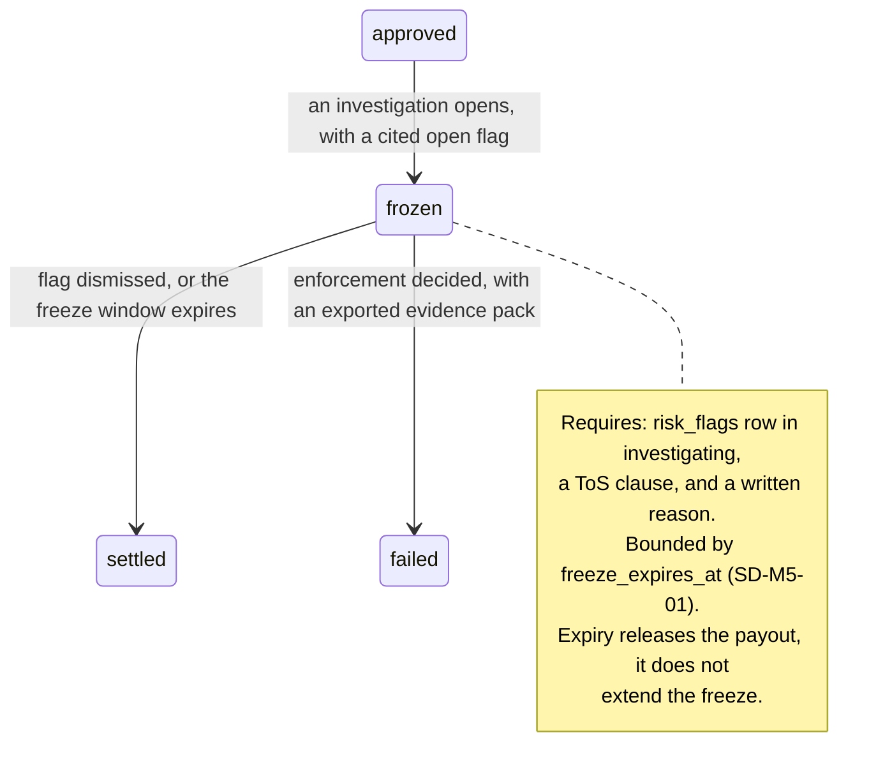

# M5: Payout System

Constitution section M5, Appendix B4 items 7, 8, 10, 19 and 22, Appendix D4, Appendix B5 ten-section template. Money path under the [ADR-003](../DECISIONS.md) strict regime, and the second of the two crown jewels.

The product is trust and trust is "payouts that settle exactly as promised". Constitution 0 names payout-trust collapse as one of the four ways firms die, with the mechanism spelled out: **one late cycle, then a review-page death spiral.** Everything in this module is arranged so that the promise is kept mechanically rather than intentionally.

One sentence governs the design: **approval is instant, irrevocable, and mechanical, so every control that exists must sit either before the request or after the settlement, and never in between.**

**Amended and approved at the Wave 3 batch 1 gate (2026-08-14).** [ADR-019](../DECISIONS.md) splits this module's flow into two legs. **The internal leg is new**: a payout request settles instantly to the trader's Merit Wallet. **The existing flow becomes the external leg**: a wallet-to-rail withdrawal, carrying every control this document already specifies. [ADR-016](../DECISIONS.md) was accepted with a conservative classifier and an escalation clock, and [ADR-017](../DECISIONS.md) with affiliate destination cooling. The governing sentence above survives intact and gains force: with the internal leg instant, the space between request and settlement has closed to zero, so there is now genuinely nowhere in the middle for a control to hide.

**Identifier conventions:** `INV-M5-nn` invariants, `SD-M5-nn` schema deltas, `LT-nn` ledger transaction shapes, `FM-M5-nn` failure modes, `AS-M5-nn` adversarial scenarios, `OQ-M5-nn` open questions, `DEP-M5-nn` dependencies.

---

## 1. Purpose and invariants

### 1.1 What this module is

The request pipeline, the ledger, the Rise integration, the freeze path, and the treasury and reserve machinery.

**Internal leg**, one transaction, no third party:

```
POST /accounts/:id/payout
  -> evaluatePayout (M1, the identical function the eligibility screen called)
  -> clampPayout (M1)
  -> persist immutable eligibility_snapshot
  -> post LT-01 ledger transaction, crediting the identity's wallet position
  -> status: settled_to_wallet              [instant, irrevocable, atomic]
  -> call M1's applySettlement exactly once  (anchors advance, win days reset)
  -> notify
```

**External leg**, the pre-existing flow, unchanged in every control:

```
POST /wallet/withdrawals
  -> KYC verified, destination outside its cooling window, name matched
  -> amount >= 10,000c, wallet balance sufficient, no withdrawal in flight
  -> post LT-06, debiting the wallet position
  -> status: approved -> enqueue transfer (idempotent) -> Rise
  -> settlement webhook -> post LT-07 -> notify
```

There is no approval step in either list because there is no approver. That absence is the module's entire product thesis, and the wallet sharpens it: the leg the trader experiences as "getting paid" now has **no external party in it at all**, so there is not even a rail that could be slow.

**The single most important consequence, because it reorganizes this whole document.** Every control that used to live "after settlement" now lives after the *external* settlement, and the internal leg has effectively no after. The controls did not weaken; they moved to the leg where the money actually leaves Merit, which is where they were always aimed.

### 1.2 What this module is not

| Not M5 | Whose job | Why the boundary is here |
|---|---|---|
| Deciding eligibility | [M1](M01-rules-engine.md) | M5 calls `evaluatePayout`. It contains no gate, no threshold, and no comparison against a plan config |
| Deciding to freeze | [M7](M07-risk-abuse.md) and admin | M5 **enforces** a freeze that already exists, or one opened during flight on cited evidence. It never originates one |
| Verifying identity | M19 | KYC is a context gate M5 reads. Payout time is never the first identity check (constitution M5) |
| Reducing the platform balance | [M2](M02-rithmic-bridge.md) and the vendor | M5 moves real money. The simulated account's balance is reduced by the platform, and M5's job is to **verify that it happened** (AS-M5-01) |
| Pausing sales | [M6](M06-admin-ops-console.md) | The circuit breaker is M6's. It pauses sales and **never** payouts, which is the single most important asymmetry in the business |

### 1.3 Invariants

| ID | Invariant | Enforcement |
|---|---|---|
| INV-M5-01 | There is no code path that denies an eligible request | `payout_requests.status` has no `denied` and no `pending_review` value (approved DATA_MODEL). The absence is the control |
| INV-M5-02 | The number shown by `GET /eligibility` and the number sent by `POST /payout` come from the same function with the same inputs | Both call M1's `evaluatePayout`. A second evaluator would be a second rule |
| INV-M5-03 | `trader_cents + firm_cents = approved_cents`, exactly, always | Check constraint plus M1's R-44 and RE-P-08. Rounding favors the trader by at most one cent, and the published copy says so |
| INV-M5-04 | Every ledger transaction sums to zero, and the whole table sums to zero | Deferred constraint trigger at commit, plus a nightly global assertion. `ledger.invariant_violated` halts payouts (see AS-M5-05 for why that is dangerous as well as necessary) |
| INV-M5-05 | A duplicate settlement webhook produces exactly one settlement, one win-day reset, and one ledger transaction | Unique `provider_transfer_id`, unique `idempotency_key` on `ledger_transactions`. B4 #8, GS-037 |
| INV-M5-06 | A retry never double-pays, including across a restore from backup | The same `idempotency_key` on every attempt, generated **before** the first send and persisted in the same transaction. B4 #19, GS-048, AS-M5-06 |
| INV-M5-07 | `applySettlement` is called exactly once per settled payout, with both trading days recorded | M1's DEP D-M5-1. Idempotent on `payout_request_id`, plus a per-account advisory lock shared with the batch |
| INV-M5-08 | At most one payout is in flight per account | Partial unique index (M1's SD-09), **not** only the engine gate, because the engine is not the only writer. M1's DEP D-M5-2, GS-052 |
| INV-M5-09 | An account that breaches after approval and before settlement is still paid | Constitution M1's FM-18 and [M01 section 3.3](M01-rules-engine.md). The snapshot was true when taken and the money was already the trader's |
| INV-M5-10 | A freeze requires at least one cited open flag and is bounded in time | Confirmed at the [Wave 2 gate](../DECISIONS.md); the time bound is SD-M5-01 and AS-M5-04 |
| INV-M5-11 | The reserve is reported against a **live** wallet balance, not a computed one | SD-M5-03. A reserve coverage ratio derived from our own ledger rather than the rail's balance is a number that agrees with itself |
| INV-M5-12 | The circuit breaker pauses sales and can never pause payouts | Structural: the breaker's only effect is a flag read by [M3](M03-billing-checkout.md)'s checkout. There is no code path from any liability signal to a payout block |
| INV-M5-13 | Every wallet-credited payout is observed reducing the platform balance, or it alarms | SD-M5-04, AS-M5-01. **This binds on the internal leg**, which is where the trading account's balance is reduced. "We credited the wallet" and "the trading account knows it was paid" remain two claims, and the wallet makes the gap between them shorter rather than absent |
| INV-M5-14 | A wallet balance is a **payable balance**: it earns no interest, it cannot be transferred to another identity, and it is never negative | Ledger constraint plus the absence of any peer-to-peer code path. Each of the three is a deliberate product limit with a legal reason ([ADR-019](../DECISIONS.md), and the counsel-review item in [legal/](../legal/README.md)) |
| INV-M5-15 | Wallet balances are included in Open Liability and in the reserve coverage ratio | [M06](M06-admin-ops-console.md) P-M6-01 and P-M6-07. A wallet balance has cleared every gate, which makes it the **most** certain liability on the book. A design that improved liquidity must not be allowed to quietly improve the reported liability with it |
| INV-M5-16 | An identity-scoped ledger halt pages immediately and carries an escalation clock to global | [ADR-016](../DECISIONS.md) as accepted. Without the clock, scoping the halt creates a slower version of AS-M5-05 in which one attributable imbalance buys an indefinitely unexamined corner of the ledger |

---

## 2. Entities and schema deltas

M5 consumes [DATA_MODEL section 8](../architecture/DATA_MODEL.md) as approved plus M1's approved SD-03, SD-05, and SD-09. Five deltas.

| ID | Table | Change | Why it is not optional |
|---|---|---|---|
| SD-M5-01 | `payout_requests` | add `frozen_at timestamptz null`, `freeze_flag_id uuid null fk risk_flags`, `freeze_expires_at timestamptz null` | A freeze with a cited flag but no clock is an indefinite hold, which is a denial with extra steps and is exactly what a zero-denial policy must not permit itself (AS-M5-04). The expiry is what makes the control bind on Merit rather than on the trader |
| SD-M5-02 | `payout_transfers` | add `name_match_score integer null`, `name_match_method text null`, `name_match_reviewed_by text null` | `destination_name_match` is a boolean in the approved model, and real name matching is not boolean. Transliteration, married names, and common names make a strict comparison produce false freezes on legitimate traders, which under a zero-denial policy is a brand cost. The score and the method make the threshold tunable and auditable (AS-M5-02) |
| SD-M5-03 | new `treasury_balances` | `(account_code, as_of) pk`, `balance_cents`, `source text check in ('provider_api','manual_attestation')`, `recorded_by`, `recorded_at` | The [reserve coverage ratio](../GLOSSARY.md#reserve-coverage-ratio) is the number that decides whether sales pause. Computing it from our own ledger makes it a number that agrees with itself; it must be anchored to the **rail's** reported balance, and when the rail cannot be queried, to a dated manual attestation that is visibly stale rather than silently wrong (INV-M5-11) |
| SD-M5-04 | `payout_requests` | add `balance_reflection_status text not null default 'pending' check in ('pending','observed','missing')` and `reflected_on_trading_day date null` | INV-M5-13. A settled payout whose withdrawal never appears in the platform balance leaves the trader able to withdraw the same money twice. This column is what turns that from an invisible loss into a nightly alarm (AS-M5-01) |
| SD-M5-06 | new `wallet_withdrawals` | `id`, `identity_id`, `amount_cents`, `destination_ref`, `status`, `idempotency_key`, `requested_at`, `settled_at null`, plus the `name_match_*` and freeze columns SD-M5-01 and SD-M5-02 add to `payout_requests` | The external leg is a different object from a payout request and modelling it as one would be the mistake. A payout request is a **claim against an account** evaluated by the engine; a withdrawal is a **movement of an already-settled balance** evaluated against KYC and destination rules. Conflating them means the engine's gates and the rail's gates share a status column, and the first person to add a state breaks the other one |
| SD-M5-07 | `ledger_accounts` | add the `trader_wallet` account class, per identity | [ADR-019](../DECISIONS.md)'s ledger account per identity. The reserved `promotional_credit` class and the `currency` columns from the Wave 2 gate activate here, which is what that reservation was for |
| SD-M5-05 | `ledger_transactions` | add `reversal_of uuid null fk ledger_transactions` | Corrections are compensating entries, never updates. Without a link, a reversal is a transaction that happens to be equal and opposite, and reconstructing which reversal answered which original becomes archaeology at exactly the moment (a chargeback dispute, an audit) when it must be instant |

### 2.1 The ledger transactions, stated exactly

Every money movement in Merit is one of these five shapes. Amounts are signed, positive is debit, and each transaction sums to zero (INV-M5-04).

| ID | Kind | Entries |
|---|---|---|
| LT-01 | `payout_approval` | debit `trader_withdrawable` (identity) `approved_cents`; credit **`trader_wallet`** (identity) `trader_cents`; credit `fees_revenue` `firm_cents`. **Only the credit leg was corrected** ([ADR-027](../DECISIONS.md)): the row read `credit firm_treasury trader_cents` while its own note below already said the leg credits `trader_wallet`. The debit is unchanged |
| LT-02 | `payout_settlement` | debit `firm_treasury` `trader_cents`; credit the payout wallet position `-trader_cents` |
| LT-03 | `payout_reversal` | the exact negation of LT-01, with `reversal_of` set (SD-M5-05) |
| LT-04 | `chargeback_reversal` | posted by [M3](M03-billing-checkout.md), referenced here because it is the transaction that makes an identity net negative honestly (B4 #10) |
| LT-05 | `affiliate_commission` | posted by [M8](M08-affiliate-system.md) |
| LT-06 | `wallet_withdrawal_approval` | debit `trader_wallet` (identity) `amount_cents`; credit `firm_treasury` `amount_cents`. The external leg's approval |
| LT-07 | `wallet_withdrawal_settlement` | debit `firm_treasury`; credit the payout wallet position. The external leg's cash movement |
| LT-08 | `wallet_purchase_debit` | debit `trader_wallet`; credit revenue. Posted by [M3](M03-billing-checkout.md) when a purchase is wallet-funded, in the same transaction as the purchase (M3's INV-M3-13) |

**LT-01's row was corrected at the reconciliation, and only its credit leg** ([ADR-027](../DECISIONS.md)). The table read `credit firm_treasury trader_cents` while the note below it already stated the leg credits the identity's `trader_wallet`. **The debit leg is unchanged and stays `trader_withdrawable`**, which is correct: the withdrawable position is reduced by the full `approved_cents`, and of that `trader_cents` becomes the wallet payable and `firm_cents` becomes revenue. The posting balances because `trader_cents + firm_cents = approved_cents` is already a check constraint on `payout_requests`.

**`firm_treasury` as the debit was considered and rejected**: it books a cash movement at approval, which contradicts the ruled recognition timing that **payout liability books at approval and cash derecognizes at settlement**. Cash moves at LT-02 and LT-07, not here.

**The state machine's `frozen` target changed** ([ADR-028](../DECISIONS.md)). It read `frozen --> transferring`, which is unreachable once `transferring` belongs to `wallet_withdrawals`. A released freeze now settles internally and instantly, which is what the wallet made true.

**LT-01's credit leg changed at the batch 1 gate.** It previously credited the payout wallet position as a firm obligation to pay; it now credits the **identity's `trader_wallet`** position (SD-M5-07). The obligation is the same size and is owed to the same person; what changed is that it is now recorded against the trader who owns it rather than pooled, which is what makes wallet balances individually reportable in Open Liability (INV-M5-15).

**LT-01 needs its own paragraph because the split is where an error would be invisible.** The trader's withdrawable position is reduced by the full `approved_cents`, because that is what leaves their claim on the firm. Of that, `trader_cents` becomes a firm obligation to pay out and `firm_cents` becomes recognized revenue. The three legs sum to zero, and **`firm_cents` is recognized at approval rather than at settlement**, deliberately: the firm's share is earned when the payout is approved, and holding it in suspense until settlement would make the revenue line depend on a payment rail's latency. **Ruled at the batch 1 gate, confirming what this paragraph proposed** ([DECISIONS](../DECISIONS.md)): payout **liability books at approval**, **cash derecognizes at settlement**, and **evaluation fees recognize at purchase**. Under the wallet those three separate cleanly: liability books at approval on the internal leg, changes form (not size) at wallet credit, and derecognizes as cash only when the external leg settles. `firm_cents` is recognized at approval alongside the liability, so both halves of LT-01 are recognized in the same moment and the revenue line does not depend on a rail's latency.

---

## 3. State machines

The payout request machine ([STATE_MACHINES section 2](../architecture/STATE_MACHINES.md)) and the transfer sub-machine (section 3) are approved and are not redrawn. Three things this plan adds.

### 3.1 What happens at settlement, exactly

**Under [ADR-019](../DECISIONS.md) there are two settlements and they are very different animals.** The internal one is a transaction; the external one is a conversation with a third party. The steps below are the **external** leg, preserved as written because a webhook from a rail is exactly as untrustworthy as it always was.

**The internal leg, for contrast, has no step list worth the name**, and that is the point: approval, LT-01, the wallet credit, both anchor advances, the win-day reset, and `applySettlement` all commit in **one database transaction**. Idempotency is the transaction plus the request's idempotency key. There is no webhook to replay, no ordering to defend, no partial state to reconcile, and no window in which a second request can arrive. Every failure mode from FM-M5-02 through FM-M5-04 is inapplicable to it by construction rather than by control, which is the strongest form of not having a bug. `payout_requests.status` reaches `settled_to_wallet` and stops.

Settlement on the external leg is still the most consequential transition involving an outside party, so its steps are ordered and each is idempotent.

| Step | Action | Idempotency anchor |
|---|---|---|
| S-1 | Verify webhook signature, timestamp, and nonce; reject outside the replay window | rejected before any state is touched |
| S-2 | Resolve the transfer by `provider_transfer_id`; if already `settled`, return 200 and stop | unique `provider_transfer_id` |
| S-3 | Post LT-02 | unique `ledger_transactions.idempotency_key` |
| S-4 | Set `payout_requests.status = 'settled'`, `settled_at`, `settled_trading_day` | status transition guard |
| S-5 | Call M1's `applySettlement` with `basis_trading_day` and `effective_trading_day` | unique on `payout_request_id` (INV-M5-07) |
| S-6 | Emit `payout.settled`, `payout.win_days_reset` | event dedupe by `(name, reference_id)` |
| S-7 | Mark `balance_reflection_status = 'pending'` and start the observation window | SD-M5-04 |

**S-5 is where [ADR-014](../DECISIONS.md) simplified this module.** Before the M1 gate, settlement also recomputed the floor. It no longer does: the floor is untouched by a settlement, so the settlement step's only state effects are the balance reduction, the two anchors, the win-day and consistency reset, and possibly graduation. One fewer branch in the most audited transition in the system.

### 3.2 Where `effective_trading_day` comes from, which decides liability

[ADR-013](../DECISIONS.md) made the cadence gap count from the settled payout's **effective** trading day. **[ADR-019](../DECISIONS.md) moved that anchor to the wallet-credit day**, which, because the internal leg is instant, is the same trading day as the basis day. The two anchors ADR-013 established still both exist and are still both stored; they now coincide.

**What did not change, and this is the half worth protecting.** `effective_trading_day` remains an **observed** fact about the platform: the day M2 sees a mark whose `adjustment_cents` matches this settlement (M2's INV-M2-12). It is still recorded, still never predicted, and `balance_reflection_status` still tracks it (SD-M5-04). It simply no longer drives the cadence gap. That separation is deliberate: the cadence anchor is now a fact about Merit's own ledger, which is instant and certain, while the reflection observation remains a fact about the vendor's books, which is neither. **AS-M5-01 is unaffected** and remains this module's scariest finding.

**Binding: `effective_trading_day` is observed, never predicted.** It is set when [M2](M02-rithmic-bridge.md) sees a mark whose `adjustment_cents` matches this settlement (M2's INV-M2-12 classification), and until then it is null. Three consequences follow, and all three are good:

- Replay is deterministic years later, because the value stored is a fact that was recorded, not a calculation that depended on a business-day convention nobody wrote down.
- A settlement whose adjustment never appears is **visible**, because the field stays null and `balance_reflection_status` stays `pending` past its window (AS-M5-01).
- The third consequence was that the cadence gap could not be gamed by settlement-timing games. **The wallet retires that concern rather than weakening it**: with the anchor on an instant internal credit there is no settlement timing left to game, because the trader cannot influence when a transaction that already committed committed.

### 3.3 The freeze path, bounded



Three properties, each of which constrains Merit rather than the trader.

**A freeze cannot be opened without a flag.** Confirmed at the Wave 2 gate and unchanged.

**A freeze expires.** SD-M5-01's `freeze_expires_at` defaults to a fixed window (proposed: 10 business days, OQ-M5-02) and **expiry releases the payout**. Extending requires a second, separately audited admin action with its own reason. Without this, "frozen" is an unbounded hold, and an unbounded hold is a denial that never had to be called one.

**The trader sees the freeze, its reason class, and its expiry date.** Not the evidence, not the detector, but the fact, the ToS clause, and the date by which it resolves. A review the trader cannot see the end of is indistinguishable from a refusal.

---

## 4. API endpoints touched

Schemas are in [API_CONTRACT sections 6 and 10](../architecture/API_CONTRACT.md).

| Endpoint | M5's role | What this plan adds |
|---|---|---|
| `POST /accounts/:id/payout` | Owns | The ordered server behavior in section 1.1. Idempotency key **required**; a repeat with the same key returns the original response verbatim rather than re-evaluating, because re-evaluating a retry is how a trader's retry becomes a different payout |
| `GET /accounts/:id/eligibility` | Shares with [M4](M04-trader-portal.md) | Read-only, no side effect, and it calls the identical function `POST` will call (INV-M5-02) |
| `GET /payouts` | Owns | The status timeline. `failure_note` is trader-readable and honest, because a vague failure on a payout is worse than a specific one |
| `POST /webhooks/rise` | Owns | Signature, timestamp, nonce, replay window. Enqueues; does no business work in the request |
| `POST /admin/accounts/:id/freeze` and `/unfreeze` | Owns | Requires a cited open flag and now also sets `freeze_expires_at` (SD-M5-01). Dual control is **not** required here, deliberately: a freeze is reversible and time-bounded, while the [ADR-010](../DECISIONS.md) dual-control set covers cap, split, gap, and treasury credentials, which are not |
| `POST /wallet/withdrawals` **NEW** | Owns | The external leg ([ADR-019](../DECISIONS.md), SD-M5-06). Carries every control the old settlement path carried: KYC verified, destination outside its 48 hour cooling window, name match scored, **$100 minimum**, **no fee**, and G-NO-IN-FLIGHT scoped to this leg. Idempotency key required |
| `GET /wallet` **NEW** | Owns | Balance and the credit and debit timeline. Read-only. Rendered by [M04](M04-trader-portal.md) SC-M4-10 |
| `GET /admin/liability` | Supplies | Reserve, RCR, open liability, and the eligible-forecast inputs, **now including wallet balances** (INV-M5-15). Rendered by [M6](M06-admin-ops-console.md) |

---

## 5. Events emitted and consumed

Emitted per [EVENTS sections 6 and 7](../architecture/EVENTS.md), plus three NEW.

| Event | When | Notes |
|---|---|---|
| `payout.requested`, `payout.approved`, `payout.blocked` | request time | `payout.approved` is the single most audited event in the system and carries the full gate results |
| `payout.transfer_queued`, `payout.transfer_sent`, `payout.settled`, `payout.transfer_failed` | transfer lifecycle | |
| `payout.win_days_reset` | S-6 | Carries `anchor_trading_day` (M1 gate amendment) |
| `payout.name_mismatch_detected` | pre-send | Now carries `name_match_score` and `name_match_method` (SD-M5-02) |
| `ledger.transaction_posted`, `ledger.invariant_violated` | every transaction, nightly | The second halts payouts. See AS-M5-05 |
| `payout.balance_reflection_missing` **NEW** | observation window expires | `{ payout_request_id, account_id, approved_cents, settled_trading_day, trading_days_elapsed }`. The trader may now be able to withdraw money already paid. Consumers: ALERT (page), RISK, FEED, EVID |
| `payout.freeze_expiring` **NEW** | 2 business days before `freeze_expires_at` | `{ payout_request_id, flag_id, expires_at }`. Forces a decision before the clock releases the payout, which is the point of having a clock. Consumers: ALERT, FEED |
| `wallet.credited` **NEW** | internal leg | `{ identity_id, account_id, payout_request_id, amount_cents, balance_after_cents, basis_trading_day }`. This is the event the trader experiences as being paid, and it is now the one M04 and M16 celebrate rather than `payout.settled`. Consumers: FEED, NOTIF, BI, EVID |
| `wallet.debited` **NEW** | purchase or withdrawal | `{ identity_id, amount_cents, cause, reference_id, balance_after_cents }`. Consumers: FEED, RISK, BI |
| `wallet.withdrawal_requested` / `.settled` / `.failed` **NEW** | external leg | Mirrors the `payout.transfer_*` family for the wallet-to-rail path. Consumers: ALERT, FEED, NOTIF |
| `treasury.coverage_changed` **NEW** | RCR crosses a threshold, or a balance is recorded | `{ rcr_bp, reserve_cents, cvar99_cents, eligible_next_7d_cents, source, as_of }`. [ADR-011](../DECISIONS.md)'s same-day top-up trigger needs an event, not a dashboard someone remembers to open. Consumers: ALERT, FEED, BI |

**Consumed:** `day.closed` (refreshes withdrawable and the forecast), `flag.status_changed` (opens and closes freezes), `kyc.verified` and `kyc.expired` (context gate), `purchase.charged_back` (LT-04 and the closure), and M2's mark stream (the balance reflection observation, DEP-M5-02).

---

## 6. Failure modes

| ID | Failure | Blast radius | Detection | Recovery |
|---|---|---|---|---|
| FM-M5-01 | Rise outage during a payout wave | Settlements stall. **The brand risk, not the money risk**: constitution 0 names one late cycle as the start of the death spiral | Transfer queue depth and age; provider health | Queue and retry with the same idempotency key. **Over-communicate**: status page, in-app banner, and a proactive message to every affected trader before they ask (constitution section 7) |
| FM-M5-02 | Settlement webhook replayed | Double settlement, double win-day reset | Unique `provider_transfer_id` | Structurally prevented; 50 deliveries produce one settlement (GS-037) |
| FM-M5-03 | Transfer sent twice after an ambiguous network failure | Real double payment | Same idempotency key on every attempt, generated before the first send | Provider dedupes; our record shows one transfer (INV-M5-06) |
| FM-M5-04 | Restore from backup with transfers mid-queue | Duplicate transfers, which is unrecoverable money | Idempotency keys persisted in the same transaction as the queue row, so they survive the restore | B4 #19, GS-048, AS-M5-06 |
| FM-M5-05 | Ledger does not sum to zero | We no longer know what we owe | Nightly global assertion plus per-transaction deferred trigger | Payouts halt automatically. This is correct **and** is itself an attack surface (AS-M5-05) |
| FM-M5-06 | Payout wallet cannot cover approved payouts | Late settlement, which is the death spiral's first step | RCR against a live balance (SD-M5-03), plus [ADR-011](../DECISIONS.md)'s same-day top-up trigger on the Eligible-Next-7-Days forecast | Top up same day. The breaker pauses **sales**, never payouts (INV-M5-12) |
| FM-M5-07 | Settled payout never reduces the platform balance | Trader can withdraw the same money twice, and every downstream number for that account is wrong | SD-M5-04's observation window | Alarm, `recon_blocked`, manual platform adjustment. **Never** reverse the payout (AS-M5-01) |
| FM-M5-08 | Name mismatch freezes a legitimate trader | A real trader's payout is held on a string comparison. Under a zero-denial policy this is the most damaging false positive available | Score and method recorded (SD-M5-02); false-positive rate tracked | Human review inside the bounded freeze window; thresholds tuned against the recorded scores rather than guessed (AS-M5-02) |
| FM-M5-09 | Freeze opened and forgotten | An indefinite hold, which is a denial nobody had to authorize | `freeze_expires_at` plus `payout.freeze_expiring` | Expiry releases the payout. Extension is a separate audited action (AS-M5-04) |
| FM-M5-10 | Account breaches while a payout is in flight | Trader fear that approval can be revoked | Explicit design, not a failure to handle | **The payout settles.** The account closes. GS-064, INV-M5-09 |
| FM-M5-11 | Correction changes a settled payout's basis | The basis is no longer reproducible from live marks | Replay divergence bounded to days after the correction | Absorb, flag, report the absorbed amount. **Never claw back** (B4 #5, INV-22, GS-057 and GS-058) |
| FM-M5-12 | 500 requests in one minute on a promo day | Lock contention, timeouts, and a queue of traders watching a spinner during the single most trust-sensitive action in the product | Load test at 500 per minute, p95 under 1s (B4 #22) | Per-account row locks only, no global lock; the engine call is pure and cheap; the transfer enqueue is the only I/O in the request path (GS-051) |

---

## 7. Adversarial scenarios

**Seven listed, five novel.** The two marked "extends" take a B4 item into a place that changed this module's design.

### AS-M5-01: The payout that was never taken out of the account (NOVEL)

**Attack.** Not an attacker at first. Merit pays 150,000c through Rise. The platform is supposed to reduce the simulated account's balance by the same amount, which appears as `adjustment_cents` on the next mark. If it does not (a provisioning miss, a vendor-side failure, a manual adjustment nobody made), the account's balance still contains money Merit already paid. The engine then computes `withdrawable` from a balance that is 150,000c too high, and the trader is legitimately eligible to withdraw the same money again. Every rule passes. Nothing is broken. **The same cents are paid twice, and the ladder does not stop it, because each payout is a separate correct ordinal.**

**Why it becomes an attack.** A trader who notices this once has found a repeating money printer bounded only by the cap and the ladder: 8 ordinals at 135,000c to the trader on CORE-50K, drawn against an account whose balance never goes down. They will not report it.

**Numbers.** One missed reflection on a CORE-50K account is 150,000c of duplicated liability. Across a fleet, or across a systematic vendor failure affecting a whole batch, it scales with the size of the failure and is invisible in every existing report, because reconciliation compares our balance against the vendor's and **both would agree**: both think the money is still there.

**Counter.** SD-M5-04 makes the reflection an explicit, tracked fact rather than an assumption. Every settled payout enters `balance_reflection_status = 'pending'` and must be observed as an `adjustment_cents` on a mark matching amount and account within a window (proposed: 3 trading days, OQ-M5-03). A payout still `pending` past the window emits `payout.balance_reflection_missing`, **pages**, and sets `recon_blocked` on the account, which removes it from eligibility until a human resolves it.

**And the recovery is stated now so it is not improvised later: the payout is never reversed.** The correct fix is a platform-side adjustment to bring the simulated balance to what it should have been, recorded as an admin action with the settlement referenced. Reversing a settled payout would break the never-claw-back promise for a firm-side error, which is the worst possible reason to break it. GS-106.

### AS-M5-02: The payout mule, and the name match that cannot be strict (NOVEL treatment of Appendix A item 7)

**Attack.** Appendix A item 7 names payout mules: a KYC-verified person cashing out for a hidden operator. Constitution M5's control is that the Rise payout name must match the M19-verified identity, and a mismatch freezes and flags rather than settling silently. The adversarial refinement is that **the mule's name matches perfectly**, because the mule is the verified person. The name check does not catch mules at all. What it catches is a trader sending money to a third party, which is a different and rarer thing.

**And the check has a cost the constitution does not price.** Names are weak identifiers. Transliteration (Muhammad, Mohammed, Mohamad), married and maiden names, hyphenation, middle-name ordering, and diacritics all produce mismatches on entirely legitimate traders. Under a zero-denial policy, freezing a real trader's payout on a string comparison is the most damaging false positive available to us, and it happens disproportionately to traders with non-Anglophone names, which is a fairness problem as well as a support one.

**Counter, in two parts because the two problems are different.**
- **For the name check itself:** a score, not a boolean (SD-M5-02). Record the score and the method on every transfer. Freeze only above a configured distance threshold, review inside the bounded freeze window, and **tune the threshold against recorded scores** rather than guessing it before launch. Track the false-positive rate as a named metric, because a control whose error rate nobody measures becomes a control nobody trusts.
- **For mules, which the name check does not address:** the real signals are M19's biometric dedupe across all applicants (one face, many names), M7's device and payment graph, and the destination-reuse signal that **one Rise destination receiving payouts from several unrelated identities** is a ring, and that is a query rather than an inference. That last one is the strongest mule detector available and it belongs in this module's data, so `destination_ref` reuse across identities is a first-class flag input.

GS-107.

### AS-M5-03: Instant approval outruns the reserve (NOVEL)

**Attack.** Approval is instant and irrevocable. [M01 AS-09](M01-rules-engine.md) shows that one identity with ten copy-traded accounts crosses the win-day gate on the same day and can produce 1,500,000c of individually correct payouts in one day, and OQ-7 ruled that no identity ceiling exists in v1. The payout wallet is funded **weekly, manually** ([ADR-011](../DECISIONS.md)). A correlated wave inside a week can therefore commit Merit to paying more than the wallet holds, and the commitment is made before anyone can react.

**The critical property: the circuit breaker does not help.** By design it pauses sales, never payouts (INV-M5-12), and that asymmetry is correct and must not be weakened. So the wave is approved, the money is owed, and the only variable left is how quickly the wallet is topped up. Late settlement is the exact failure constitution 0 names as fatal.

**Numbers.** Ten accounts at 150,000c capped, 135,000c to each trader, is 1,350,000c out of the door in one day from a single identity. Against a weekly funding rhythm sized to an average week, a single correlated wave is several times the expected outflow.

**Counter, and it is a forecasting problem rather than a rule problem.**
1. **The Eligible-Next-7-Days forecast is a launch requirement, not a dashboard nicety.** [M01 AS-09](M01-rules-engine.md) already establishes it must aggregate at identity level as well as account level, because a correlated wave is invisible in an account-level sum until it lands.
2. **[ADR-011](../DECISIONS.md)'s same-day top-up trigger fires on that forecast**, and `treasury.coverage_changed` makes it an event rather than a number someone notices.
3. **The RCR is computed against a live rail balance** (SD-M5-03, INV-M5-11), because a coverage ratio computed from our own ledger is a ratio that agrees with itself.
4. **CVaR99 must model request timing as a strategy** ([M01 AS-08](M01-rules-engine.md)) and correlated identity-level waves as a scenario, or the reserve is sized against a world where traders request at random, which they demonstrably do not.
5. **The reserve is sized against `CVaR99 at rho = 0.30`, which is a floor and not an estimate** (founder ruling, [DECISIONS](../DECISIONS.md)). The harness's calibration bands are central estimates and carry no cushion; conservatism lives in the `rho = 0.30` correlation assumption, the regime-stress ruin scenarios, and the RCR breaker at 1.0. This scenario is precisely why: a correlated wave is the event `rho = 0.30` exists to price, and a reserve sized against an independence assumption would be sized against a book Merit does not have.

**What [ADR-019](../DECISIONS.md) changed here, and it is the largest single improvement the wallet buys.** A correlated wave now lands on the **wallet**, not on cash. Ten accounts approving 1,350,000c in one day produces 1,350,000c of wallet credits and moves **no money at all**. Cash leaves only when those traders each individually request an external withdrawal, which is a separate action, subject to a $100 minimum, KYC, and destination cooling, and which historically a meaningful share of traders will delay or partially take. The firm gets the float and, more importantly, gets **time**, which is the one thing the weekly funding rhythm could not previously buy.

**Three things that did not change, stated so the improvement is not over-read.**
1. **The liability is identical.** Wallet balances are Open Liability and enter the RCR (INV-M5-15). Merit owes exactly what it owed.
2. **The forecast is still a launch requirement.** It now forecasts external withdrawal demand rather than approval volume, which is a *harder* prediction, not an easier one, because it depends on trader behavior rather than on gates the engine computes. The Eligible-Next-7-Days figure keeps its meaning for liability and gains a sibling for cash.
3. **The circuit breaker still cannot pause payouts** (INV-M5-12), and the asymmetry is now even more clearly correct: pausing the internal leg would be pausing a ledger entry.

**Residual, stated plainly.** With instant approval and no identity ceiling, the firm's exposure to a one-day correlated wave is bounded only by the per-account cap times the identity's account maximum. That is a deliberate, founder-ruled position (OQ-7) whose mitigation is visibility plus liquidity, and the wallet improves the liquidity half substantially without touching the exposure. It should be revisited if a single identity's forecast ever exceeds a configured share of the wallet. GS-108, GS-130.

### AS-M5-04: The indefinite freeze, which is a denial nobody authorized (NOVEL)

**Attack.** The adversary is Merit under pressure. Constitution M5 describes the 2 to 3 day settlement window as "a silent freeze hook for active investigations only". The Wave 2 gate added that a freeze requires at least one cited open flag, and called that constraint "deliberately a constraint on the founder's own future self". Both are good. Neither bounds **duration**. A flag can sit in `investigating` indefinitely, and a payout frozen indefinitely has been denied without anyone ever having to type the word.

**Why it nearly works.** Every individual step is defensible. There is a flag. There is a reason. There is a ToS clause. The investigation is ongoing. Nobody made a decision to deny, which is precisely the problem: the zero-denial policy is enforced against **explicit** denial and is entirely silent about the implicit kind.

**Counter.** `freeze_expires_at` (SD-M5-01), with expiry **releasing** the payout rather than extending the hold. `payout.freeze_expiring` fires two business days out, so the decision is forced while there is still time to make it properly. Extending is a second, separately audited admin action requiring its own written reason, which means an indefinite freeze is possible but leaves a numbered trail of deliberate decisions rather than a silence. And the trader sees the expiry date, because a review with no visible end is indistinguishable from a refusal to the person waiting for it. GS-109.

### AS-M5-05: Halting every payout by breaking the ledger by one cent (NOVEL)

**Attack.** `ledger.invariant_violated` is, by the approved [EVENTS](../architecture/EVENTS.md) catalogue, "the one event whose consumer is allowed to change system behavior automatically", and what it does is **halt payouts**. That is correct: a ledger that does not sum to zero means we do not know what we owe. It is also, viewed from outside, a **denial-of-payouts trigger with a very small activation energy.** Anyone who can cause a one cent imbalance anywhere in the ledger halts every payout for every trader until a human resolves it. Candidate levers: a crafted refund and chargeback race on the same purchase, a partial refund with an odd amount interacting with a split, or an affiliate commission reversal timed against a statement boundary.

**Why it is worth taking seriously.** The attack does not need to move money. It only needs to make the books disagree, and the system's own safety control does the damage. For a firm whose brand is payout reliability, a competitor or a disgruntled ring could buy a very cheap outage.

**Counter, three parts, and the first is the important one.**
1. **Scope the halt, conservatively.** A per-transaction imbalance halts payouts for the **identity** and the accounts involved in that transaction, not globally. Only a **global** sum mismatch halts everything, because only a global mismatch means the aggregate is unknown. **Accepted as [ADR-016](../DECISIONS.md) with two conditions that are part of the control rather than refinements of it.** First, the classifier is conservative and **must prove locality before granting it**: an imbalance spanning identities, one whose attribution is ambiguous, and one that cannot be traced to a transaction at all are **all treated as global**. Second, an identity-scoped halt **pages immediately and starts an escalation clock** to a global halt (INV-M5-16, proposed window 24 hours). Without the clock this counter would create a slower version of the attack it defends against, in which one attributable imbalance buys an indefinitely unexamined corner of the ledger.
2. **Make imbalance structurally hard.** The per-transaction zero-sum check is a deferred constraint trigger at commit, so no transaction can ever be written unbalanced in the first place. A global mismatch then implies data corruption or a direct write, both of which genuinely warrant a global halt.
3. **Make the halt loud and short.** A global halt pages immediately, states the transaction range implicated, and carries a runbook whose first step is the reconciliation query rather than a search for the cause.

GS-110.

### AS-M5-06: The restore that pays twice (extends B4 #19)

**Attack.** B4 #19 asks for a restore drill with payouts mid-queue. The sharpened version: the idempotency key is generated **in the worker** when the transfer is sent, rather than persisted when the request is approved. A restore to a point before the send loses the key, the worker generates a new one, and Rise sees a genuinely different transfer. Both settle. The money is gone twice and there is no mechanism to recover it, because the second payment was validly authorized by us.

**Counter.** The key is generated at approval and persisted in the **same transaction** as the `payout_transfers` row and the LT-01 ledger transaction. Anything a restore can lose, it loses together, and any surviving row carries the key that makes a resend safe. The quarterly restore drill ([INFRA section 6](../architecture/INFRA.md)) explicitly includes a mid-queue payout and asserts zero duplicate provider transfers. GS-048.

### AS-M5-07: The rail outage timed to a payout wave (extends constitution section 7)

**Attack.** Rise is a third party and will have an outage. The damaging version is one that coincides with a wave, so a large number of traders simultaneously see "sending" with no movement, at the exact moment the community is most attentive. The firm's technical position is fine (queued, idempotent, will settle). Its communications position is what decides the outcome.

**Counter, which is operational rather than technical.** The technical part is already done: queue, retry with the same key, no state lost. The part that matters is that constitution section 7 requires the comms template to be **pre-written**, and this module's definition of done includes it. Three rules, learned from the death-spiral pattern: **notify before traders ask**, not after; **name the rail** rather than saying "a technical issue", because vagueness reads as evasion on a payout; and **give a next-update time** rather than an ETA, because an ETA that slips twice does more damage than the outage. The status page and the in-app banner say the same words. GS-111.

---

## 7.9 Two norms from the market, one adopted and one refused

Folded from the [dossier](../../research/ADVERSARY_DOSSIER.md)'s 2026-08-14 primary-source pass, because both are decisions about this module's brand promise rather than its mechanics.

**Refused: fraud friction applied at payout time.** Apex requires two days of screen recordings from a trader requesting a payout. As a fraud control it is defensible; as an experience it is **friction applied to legitimate winners at the exact moment the firm owes them money**, and it is indistinguishable from a stall to everyone living through it. **Merit does not add a verification demand at payout.** Identity friction moves upstream of funding ([ADR-021](../DECISIONS.md), [ADR-022](../DECISIONS.md)) precisely so that the payout path stays mechanical. This is the operational meaning of the zero-denial policy: not that Merit never checks, but that Merit never checks *here*.

**The one exception, and it is not a new demand:** the [bounded freeze](../GLOSSARY.md) still exists, still requires a cited open flag, and still expires. A freeze is a pre-existing flag surfacing, never a fresh hurdle invented at request time.

**Adopted and published: the $100 minimum, against Apex's $500.** A five-fold difference in how long a small winner waits to see real money is a genuine trust differentiator and it should be stated as a comparison rather than buried in a table. It belongs in this module's copy and on [M12](M12-transparency-platform.md)'s public surfaces.

## 8. Test plan

### 8.1 Suites

| Suite | Prefix | Count | Runs | Blocks |
|---|---|---|---|---|
| Ledger property tests (zero-sum, signs, reversal symmetry) | `M5-L-nn` | 9 | every commit | merge |
| Request pipeline integration | `M5-R-nn` | 16 | every commit | merge |
| Webhook idempotency and replay | `M5-W-nn` | 8 | every commit | merge |
| Freeze path integration | `M5-F-nn` | 7 | every commit | merge |
| Treasury and RCR | `M5-T-nn` | 6 | every commit | merge |
| Negative authz (D5) | `M5-N-nn` | 6 | every commit | merge |
| Load (500 requests per minute, p95 under 1s) | `M5-P-01` | 1 | nightly | nightly alarm |
| Restore drill with transfers mid-queue | `M5-D-01` | 1 | quarterly, in the drill | drill gate |
| Golden fixtures | `GS-nnn` | 6 owned (GS-106 to GS-111), plus GS-035 to GS-039, GS-048, GS-051, GS-052, GS-064 to GS-066 shared | every commit | merge |

### 8.2 Named scenarios owned by this module

| ID | Scenario | Pins |
|---|---|---|
| GS-106 | Settled payout never appears as an adjustment on any mark | The observation window expires, `payout.balance_reflection_missing` pages, the account is `recon_blocked`, and the payout is **not** reversed. AS-M5-01 |
| GS-107 | Name match scores across a realistic set | Transliteration, married name, middle-name ordering, and a genuine third-party destination. Only the last crosses the freeze threshold, and every score is recorded. AS-M5-02 |
| GS-108 | Ten correlated accounts under one identity approve on one day | All ten are individually correct and individually capped; the identity-level forecast showed the wave in advance; `treasury.coverage_changed` fired the top-up trigger. AS-M5-03, pairs with GS-062 |
| GS-109 | Freeze reaches its expiry with no decision | The payout **releases**. Extension requires a separate audited action with its own reason. AS-M5-04 |
| GS-110 | A one cent per-transaction imbalance | Halts payouts for the implicated identity only, not globally. A global sum mismatch halts everything and pages. AS-M5-05 |
| GS-111 | Rail outage during a wave | Transfers queue with keys intact, no state is lost, and the pre-written comms template fires to every affected trader before any of them asks. AS-M5-07 |

### 8.3 Coverage rule

**Every ledger transaction shape has a property test asserting it sums to zero for randomly generated amounts and splits, and every state transition in both machines has an idempotency test.** Constitution section 5 puts money code on tests-first; on this module that means the ledger tests exist before the pipeline does.

---

## 9. Observability

### 9.1 Metrics

| Metric | Why it matters |
|---|---|
| `payout.approval_latency_ms` p95 | The product promise is instant. Anything visible to a human is a defect |
| `payout.settlement_latency_business_days` p50 and p95 | The published claim is 2 to 3 business days. This is the number the brand is built on |
| `payout.transfer_failure_rate` and retry depth | The leading indicator of a rail problem |
| `payout.frozen_count`, and age of the oldest freeze | AS-M5-04. A rising oldest-age is the shape of an indefinite hold forming |
| `payout.name_mismatch_rate` and **false-positive rate** | AS-M5-02. The second number is the one that matters and is the one nobody measures |
| `payout.balance_reflection_pending` and oldest age | AS-M5-01. Should be near zero after the window |
| `treasury.rcr_bp` against a live balance, plus attestation staleness | INV-M5-11. A stale attestation must be visibly stale |
| `treasury.eligible_next_7d_cents`, account level and identity level | [ADR-011](../DECISIONS.md)'s trigger input, and AS-M5-03's early warning |
| `ledger.global_sum_cents` | Zero, always. Any other value pages |
| `payout.settled_cents` daily, and per plan | Feeds the loss ratio and the public stats page ([M12](M12-transparency-platform.md)) |

### 9.2 Alerts

| Alert | Threshold | Severity |
|---|---|---|
| Ledger global sum non-zero | any | **page**, payouts halt globally |
| Ledger per-transaction imbalance | any | **page**, scoped halt (AS-M5-05) |
| Balance reflection missing | past the window | **page** |
| Settlement latency | over 3 business days on any payout | **page**. This is the brand |
| Transfer failure rate | over 2 percent in an hour | **page** |
| RCR | below 1.2 warn, below 1.0 **page** and the sales breaker fires | as noted |
| Eligible-Next-7-Days over the configured wallet share | any | **page**, same-day top-up task |
| Freeze older than its expiry minus 2 business days | any | warn, then page at expiry |
| Name mismatch | any | warn, and it enters the bounded freeze |
| Treasury attestation stale | over 7 days | warn |

### 9.3 Dashboard

M5 does not own a dashboard; it supplies M6's home page, which constitution M6 defines as the liability dashboard. The four numbers M5 owns there are open liability, RCR against a live balance, Eligible-Next-7-Days at both account and identity level, and settlement latency p95. **If only one number could be shown, it would be settlement latency p95**, because it is the only one a trader can also see.

---

## 10. Open questions for the founder

**OQ-M5-01 (RULED, 2026-08-14, as [ADR-016](../DECISIONS.md)). Should a per-transaction ledger imbalance halt payouts globally or only for the identity involved?** **Scoped, with a conservative classifier and an escalation clock.** Unattributable or cross-identity imbalance is global; a scoped halt pages immediately and escalates to global on a clock. The recommendation below was accepted and then tightened, and the tightening is the part worth remembering: scoping a halt without a clock does not remove the denial-of-payouts attack, it slows it down and hides it. Original text follows.

*Original question.* The approved [EVENTS](../architecture/EVENTS.md) catalogue says `ledger.invariant_violated` halts payouts, without scoping it. AS-M5-05 argues that a global halt on a single malformed transaction is a very cheap denial-of-payouts attack and that the correct scoping is: per-transaction imbalance halts the implicated identity, global sum mismatch halts everything. Recommendation: **scope it**, and treat a global mismatch as the genuine emergency it is. This amends an approved architecture doc, so it needs a ruling rather than an assumption.

**OQ-M5-02. How long is a freeze allowed to last before it releases?** Proposed: **10 business days**, with `payout.freeze_expiring` at 2 business days out and extension by a separate audited action. Ten days is long enough for a real investigation with a vendor in the loop and short enough that it cannot quietly become a denial. The number is a policy judgment and it will end up in the ToS, so it is the founder's.

**OQ-M5-03. How long is the balance-reflection observation window?** Proposed: **3 trading days** after `settled_trading_day`. Long enough to absorb a slow vendor cycle, short enough that a double-extraction opportunity does not survive a cadence gap. Depends on V-M2-05, so it may need to move after the vendor call.

**OQ-M5-04 (RULED, 2026-08-14). Is `firm_cents` recognized as revenue at approval or at settlement?** **At approval**, together with the payout liability, which also books at approval. **Cash derecognizes at settlement**, meaning the external leg under [ADR-019](../DECISIONS.md). **Evaluation fees recognize at purchase.** LT-01's original reasoning was accepted: the firm's share is earned when the payout is approved, and deferring it would make the revenue line depend on a rail's latency. The wallet makes this cleaner rather than harder, because liability, revenue, and cash now have three distinct and individually observable moments instead of two conflated ones. Still to be confirmed with whoever prepares the books before the first close, but as a review of a decided policy rather than an open choice.

**OQ-M5-06 (NEW, from [ADR-019](../DECISIONS.md)). What is the wallet-spend velocity limit, and does it differ from the withdrawal limit?** Wallet spend is the contained failure mode in an account takeover: an attacker with a valid session can burn a balance on evaluations and resets, which never leaves Merit's books and is fully reversible by ledger entry, but which is still a real loss and a genuinely upsetting experience for the victim. A velocity limit is therefore worth having and is **not** worth setting as tightly as the external one, because the blast radius is contained and the false-positive cost is a legitimate trader being unable to buy a reset at the moment they most want one. Proposal: a per-identity daily cap on wallet-funded purchases set at a small multiple of the largest single plan price, with anything above it delayed rather than refused, and the limit reviewed once real spend distributions exist. The external withdrawal path keeps its own, stricter controls and needs no velocity limit beyond them, because destination cooling already bounds the attack. See [SECURITY](../architecture/SECURITY.md) D4.

**OQ-M5-05. What is the configured wallet share that triggers a same-day top-up?** [ADR-011](../DECISIONS.md) left the threshold to this plan, saying it is "the document that can compute it against the CVaR99 estimate rather than guessing". Honest answer: **it cannot be computed yet**, because the figure comes from the simulation harness and the harness is Wave 4. Proposal: launch at **50 percent** of the payout wallet balance, which is deliberately conservative, and replace it with a derived number as the first action after the harness produces one. Recorded as a number to be replaced rather than a number to be trusted.

**One correction to that ADR-011 phrasing, now that conservatism has a ruled home.** The threshold is computed against **`CVaR99 at rho = 0.30`**, which is the reserve **floor**. Computing a top-up trigger against a central estimate would put the firm's liquidity alarm at the middle of the distribution, which is the one place an alarm is guaranteed to fire about half the time it matters and not at all the other half.

---

### Dependencies on other modules

| ID | Dependency | Owner | Consequence if unmet |
|---|---|---|---|
| DEP-M5-01 | M1's `evaluatePayout` and `clampPayout` are the only evaluators, and `applySettlement` is idempotent per payout | M1 | Two implementations of one rule, which drift, and the displayed number stops matching the paid number |
| DEP-M5-02 | M2 observes the platform balance reduction and reports it as `adjustment_cents`, setting `effective_trading_day` | M2 | AS-M5-01 goes undetected, and [ADR-013](../DECISIONS.md)'s cadence anchor has no observed value to use |
| DEP-M5-03 | M19 supplies verified identity and the name to match against, before any payout is reachable | M19 | Payout time becomes the first identity check, which constitution M5 forbids explicitly |
| DEP-M5-04 | M7 owns flags; a freeze cannot exist without one | M7 | INV-M5-10 is unenforceable and the freeze becomes a discretionary hold |
| DEP-M5-05 | M6 renders liability, RCR, and the forecast, and owns the sales circuit breaker | M6 | AS-M5-03 has no early warning, and the top-up trigger has no surface |
| DEP-M5-06 | The simulation harness produces **`CVaR99 at rho = 0.30`**, modelling peak-picking and correlated identity waves, and reports it as a **floor** distinct from its central estimate | Wave 4 | The reserve is sized against a world where traders request at random and act independently, which they do neither (OQ-M5-05, [DECISIONS](../DECISIONS.md)) |
