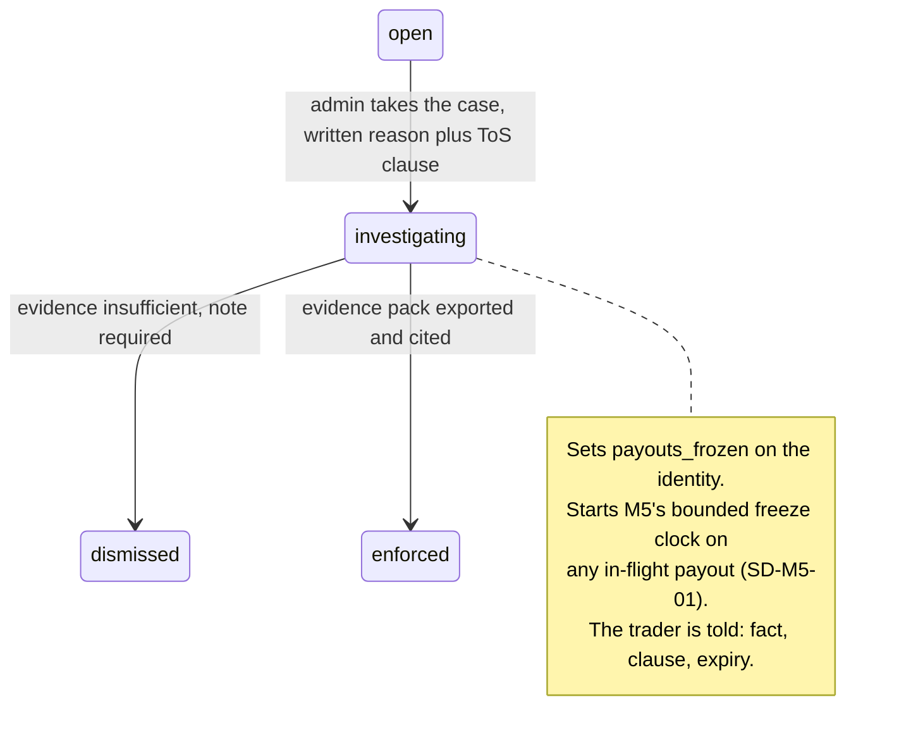
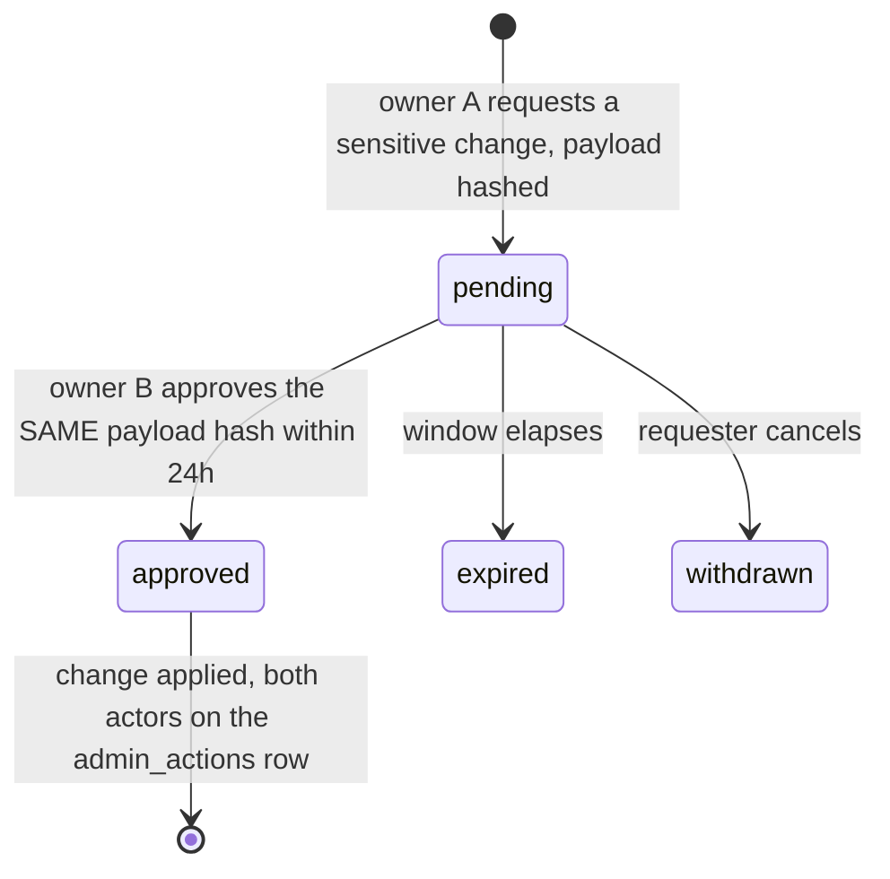

# M6: Admin and Ops Console

Constitution section M6 (**"the FTT-killer"**), Appendix D1 and D3, Appendix B5 ten-section template.

This module exists because of one named cause of death. Constitution 0 lists liability blindness first, with the quote attached: FTT "didn't know their liabilities till everyone requested on a new dashboard". Every panel below is an answer to a specific way a firm stops knowing something, and the module's success condition is not that the dashboard exists but that **the founder looks at it and believes it.**

That last clause drives more design here than any technical requirement. A control that cries wolf gets muted, a number nobody trusts gets ignored, and a breaker that fires wrongly gets disabled. Three of this module's six adversarial scenarios are about exactly that failure, because it is the one that actually happens.

**Amended and approved at the Wave 3 batch 1 gate (2026-08-14).** Three rulings changed this module: **evidence packs are confirmed as two tiers** (AS-M6-01, SD-M6-04), **wallet balances join Open Liability and reserve coverage** ([ADR-019](../decisions/ADR-019.md), P-M6-01 and P-M6-07), and **Open Liability gains a live indicative rendering** ([ADR-020](../decisions/ADR-020.md), section 3.5). The break-glass question OQ-M6-03 was ruled and moved to [SECURITY section 8](../architecture/SECURITY.md).

**Identifier conventions:** `INV-M6-nn` invariants, `SD-M6-nn` schema deltas, `P-M6-nn` panels, `FM-M6-nn` failure modes, `AS-M6-nn` adversarial scenarios, `OQ-M6-nn` open questions, `DEP-M6-nn` dependencies.

---

## 1. Purpose and invariants

### 1.1 What this module is

`apps/admin`, served from a **separate apex domain** behind the `ADMIN_ORIGIN` placeholder ([ADR-012](../decisions/ADR-012.md)), IP allowlisted, hardware-key SSO, unlinked from every public surface. Four surfaces: the liability home page, the account drill-down, the flags queue, and the event feed. Plus one export: the [evidence pack](../GLOSSARY.md#evidence-pack).

### 1.2 What this module is not

| Not M6 | Whose job | Why the boundary is here |
|---|---|---|
| Computing eligibility, liability inputs, or any rule | [M1](M01-rules-engine.md) | M6 aggregates numbers other modules computed. It has no arithmetic on a rule |
| Detecting abuse | [M7](M07-risk-abuse.md) | M6 renders the flag queue and records the human decision. It never raises a flag |
| Denying a payout | nobody | There is no such action. The most M6 can do is freeze, which requires a cited flag and expires ([M05](M05-payout-system.md) SD-M5-01) |
| Moving money | [M5](M05-payout-system.md) | M6 shows the treasury position and raises the top-up task. The founder moves the money by hand ([ADR-011](../decisions/ADR-011.md)) |
| Editing a live account's rules | nobody | An account's `plan_version_id` never changes. There is no admin action that could change it, and its absence is a control |

### 1.3 Invariants

| ID | Invariant | Enforcement |
|---|---|---|
| INV-M6-01 | Every mutating admin action writes an `admin_actions` row with actor, reason, before, and after, and a non-empty reason is required by the contract | Middleware, not per-endpoint discipline. Append-only table, no UPDATE or DELETE grant |
| INV-M6-02 | The admin origin shares no cookie, no CORS policy, and no CSP with any public surface | [ADR-012](../decisions/ADR-012.md). An XSS on the portal cannot reach the admin surface even in principle |
| INV-M6-03 | No admin action can deny a payout, and no liability signal has a code path to a payout block | [M05](M05-payout-system.md) INV-M5-12. The circuit breaker's only effect is a checkout flag |
| INV-M6-04 | Every number on the liability page names its **as-of** moment and its source | A figure whose freshness is unstated is a figure that will eventually be quoted stale in a decision that mattered (AS-M6-04) |
| INV-M6-05 | Evidence pack export is itself audited, and every pack has a declared audience and redaction profile | SD-M6-04, AS-M6-01. A pack contains everything about a trader, and some of it must never leave the building |
| INV-M6-06 | Muting or suppressing an alarm is an audited action with a mandatory expiry | SD-M6-03. A permanently muted alarm is an alarm that was deleted by someone who did not have to say so (AS-M6-03) |
| INV-M6-07 | A circuit breaker firing on a sample below its minimum is recorded as **insufficient data**, never as a breach of threshold | SD-M6-02, AS-M6-02. A ratio computed on three transactions is not a ratio |
| INV-M6-08 | Dual control on cap, split, gap, and treasury credential changes is enforced **server side**, with the two approvals from distinct credentials within a 24 hour window | [ADR-010](../decisions/ADR-010.md), SD-M6-05. The constraint must survive a determined founder in a hurry, which is the situation it exists for |
| INV-M6-09 | `readonly` cannot mutate anything, and `ops` cannot change config, roles, or plan versions | RBAC enforced server side per endpoint, with the D5 negative-authz matrix covering every role against every mutating endpoint |
| INV-M6-10 | The admin console renders trader-identifying data only when the query names a specific subject | No bulk export of identities exists as a UI affordance. Bulk is an audited export, not a screen (AS-M6-01) |
| INV-M6-11 | Every liability figure includes wallet balances, and no panel reports a liability number that excludes them | [ADR-019](../decisions/ADR-019.md), [M05](M05-payout-system.md) INV-M5-15. The wallet improved the firm's **liquidity** and changed none of its **obligations**, and a dashboard that blurred the two would be liability blindness introduced by a feature intended to reduce it |
| INV-M6-12 | An indicative figure is never presented as an as-of-last-closed figure, and no breaker, alarm, or task threshold reads one | [ADR-020](../decisions/ADR-020.md)'s hard rule on the admin surface. A live Open Liability is for the founder's eyes between batches; the same number decides nothing automatically (section 3.5) |

---

## 2. Entities and schema deltas

M6 consumes [DATA_MODEL sections 8, 9, and 10](../architecture/data-model/README.md) as approved. Five deltas, each from a failure mode below.

| ID | Table | Change | Why it is not optional |
|---|---|---|---|
| SD-M6-01 | `liability_snapshots` | add `eligible_next_7d_identity_max_cents bigint not null`, `eligible_next_7d_identity_max_id uuid null`, `absorbed_corrections_cents bigint not null default 0`, `open_liability_bounded_cents bigint not null` | Three separate gaps. The identity-level maximum is the number [M05 AS-M5-03](M05-payout-system.md) needs and an account-level total hides. The absorbed-corrections line is the [OQ-10 ruling](../decisions/gates/m1-gate-closure-2026-08-13.md) made concrete. And `open_liability_bounded_cents` is the near-term extractable figure, which is not the same number as the sum of withdrawable and must not be conflated with it (AS-M6-04) |
| SD-M6-02 | new `plan_breaker_state` | `(plan_id, evaluated_on) pk`, `metric text`, `numerator_cents`, `denominator_cents`, `sample_size int`, `ratio_bp`, `threshold_bp`, `min_sample int`, `state text check in ('armed','paused','insufficient_data','manually_overridden')`, `override_reason`, `override_expires_at`, `changed_by` | INV-M6-07. Without a recorded sample size and a minimum, the breaker fires on a two-transaction denominator and pauses sales on a brand new plan during its launch week, which is a self-inflicted outage that also destroys trust in the breaker itself (AS-M6-02) |
| SD-M6-03 | new `alarm_suppressions` | `id`, `alarm_key`, `scope jsonb`, `reason text not null`, `suppressed_by`, `suppressed_at`, `expires_at not null`, `released_at null` | INV-M6-06. Constitution M1's own FM-17 names the failure: a self-audit that becomes slow becomes a self-audit that gets disabled. A mandatory expiry converts "temporarily off" from a lie people tell themselves into a dated fact (AS-M6-03) |
| SD-M6-04 | `evidence_packs` | add `audience text not null check in ('internal','trader','counsel','regulator')`, `redaction_profile text not null`, `includes_detector_detail boolean not null` | AS-M6-01. A pack given to a trader in a dispute is a channel that discloses detector thresholds to the adversary who triggered them. The audience must be a declared, audited property of the export rather than a judgment made in the moment |
| SD-M6-05 | new `dual_control_approvals` | `id`, `subject_kind`, `subject_id`, `requested_by`, `requested_at`, `payload_hash`, `approved_by null`, `approved_at null`, `expires_at`, `status check in ('pending','approved','expired','withdrawn')` | [ADR-010](../decisions/ADR-010.md) requires a second approval within a window. That needs a row: without one, "dual control" is two clicks by the same session and the control is theatre, which Appendix D explicitly warns is worse than nothing because it reads as a control in an audit |

---

## 3. Surfaces

### 3.1 The liability home page

Constitution M6 fixes the panel list. What this plan adds is the **definition** of each number, because an undefined number is what liability blindness actually looks like.

| ID | Panel | The number, defined |
|---|---|---|
| P-M6-01 | Open liability | `sum(withdrawable_cents)` across funded accounts **plus `sum(wallet_balance_cents)` across identities**, as of the last closed day (INV-M6-11). This is the **accounting** figure: what traders could claim if every gate vanished. **The two components are shown separately as well as summed**, because they behave differently: withdrawable is a claim that still has to clear gates, and a wallet balance has already cleared them all and is owed unconditionally |
| P-M6-02 | Bounded near-term liability | `sum(min(withdrawable, cap_for_next_ordinal))` across funded accounts that are currently eligible or become eligible inside 7 trading days. This is the **cash** figure: what can actually leave soon. It is a different number from P-M6-01 and both are shown, because using either alone is a specific way to be wrong (AS-M6-04) |
| P-M6-03 | Eligible next 7 days | Account-level total, **plus the largest single identity's share** (SD-M6-01). The identity number is the one that triggers [ADR-011](../decisions/ADR-011.md)'s same-day top-up |
| P-M6-04 | Payout velocity | Trailing 7 day settled cents against the 30 day average, alarming above 2.5x (constitution M6) |
| P-M6-05 | Per-plan loss ratio | Trailing 30 day settled payouts divided by fees, per plan, with **sample size shown next to the ratio**. Breaker at 6000bp pauses that plan's new sales (SD-M6-02) |
| P-M6-06 | Pass-rate CUSUM per plan | `S_t = max(0, S_(t-1) + (x_t - mu_0 - 0.5*sigma))`, alarming at 4 to 5 sigma. "A plan is being beaten; inspect before the funded wave" |
| P-M6-07 | Reserve coverage | RCR against a **live** rail balance ([M05](M05-payout-system.md) SD-M5-03), with attestation staleness shown when the balance is a manual attestation. **The denominator is `CVaR99 at rho = 0.30`, the reserve floor, never the harness's central estimate** ([DECISIONS](../decisions/README.md)), and the panel names which figure it used. **The denominator now includes wallet balances**, and a second ratio is shown beside it: coverage against **near-term external withdrawal demand** rather than against total wallet liability. The two diverge exactly when the wallet is doing its job, and reporting only the first would understate the firm's real position as badly as reporting only the second would overstate it |
| P-M6-08 | MID health | Both providers, decline and chargeback rates, current routing state ([M03](M03-billing-checkout.md) SD-M3-03) |
| P-M6-09 | Data trust | Recon mismatches open, marks completeness gap, unconfirmed setpoints, replay divergences, batch last-success. **If anything here is red, every number above it is suspect and the page says so** |
| P-M6-10 | Absorbed corrections | Signed cumulative absorbed delta, per the [OQ-10 ruling](../decisions/gates/m1-gate-closure-2026-08-13.md), with the per-identity outliers listed |

**P-M6-09 is placed last in the list and first on the page.** Data trust gates every other number: an open reconciliation mismatch or a replay divergence means the liability figures are computed from state we have said we do not trust. Rendering them adjacent, with the trust panel above, is the difference between a dashboard and a dashboard that misleads.

### 3.2 The account drill-down

One screen answering one question: **why did this account get this outcome.** Account, identity, every mark, every `rule_states` row with its `gate_results`, every event, flags with evidence, payouts with their immutable snapshots, and every admin action. This is the screen a support conversation is conducted from, and it is the raw material of an evidence pack.

The `gate_results` per day is the load-bearing part. A trader disputing an outcome is disputing a specific day, and the drill-down must show what every gate said on that day, from the stored row rather than from a recomputation, because a recomputation is an assertion and the stored row is a record.

### 3.3 Enforcement flow

Binding, from [STATE_MACHINES section 7](../architecture/STATE_MACHINES.md) and unchanged: **no automatic transition into `enforced`.** Detectors produce `open` and nothing else. What this plan adds is that entering `investigating` now starts a clock, because [M05 AS-M5-04](M05-payout-system.md) showed that a freeze without one is a denial nobody authorized.

### 3.4 Dual control

Sensitive set, per [ADR-010](../decisions/ADR-010.md): payout cap, split, cadence gap, treasury credentials, and rail credentials. The approval binds to a **payload hash**, so approving a change and then applying a different one is impossible rather than merely discouraged. Both credentials are the founder's, on separate hardware keys, and the honest framing is carried verbatim from the ADR into the UI itself: at launch scale this is **compromise resistance, not insider resistance.** Writing that on the screen matters, because a control misread as something stronger is how a real gap survives an audit.

### 3.5 Live Open Liability (ADR-020, tier 2)

[ADR-020](../decisions/ADR-020.md) puts a **live Open Liability** figure on this page. It is the admin half of the same two-tier bargain the trader dashboard takes, and the reason it is worth having here is specific: the liability figure is the one number whose staleness has an actual named body count, since FTT "didn't know their liabilities till everyone requested".

**What it is.** Last closed session's authoritative Open Liability, plus the intraday movement implied by the indicative feed. It answers "roughly where is the book right now", which between batches is currently unanswerable at all.

**What it is not, and this is enforced rather than intended** (INV-M6-12):
- **No breaker reads it.** The plan loss-ratio breaker, the RCR trigger, the payout-velocity alarm, and [ADR-011](../decisions/ADR-011.md)'s same-day top-up task all read authoritative figures only. A live number that could pause sales would be an intraday vendor feed with a revenue lever attached.
- **No liability snapshot is written from it.** `liability_snapshots` remains a daily materialized row from closed data.
- **It is visually distinct from every authoritative figure on the page**, and it sits beside the as-of figure rather than replacing it. Two numbers, both labeled, is the entire design.

**And P-M6-09 governs it like everything else.** When data trust is red the live figure is suppressed rather than shown, because a live number derived from a feed we already distrust is worse than no number: it is the confident wrong answer AS-M6-04 is about, arriving faster.

---

## 4. API endpoints touched

M6 owns [API_CONTRACT sections 8 and 9](../architecture/API_CONTRACT.md) in full and adds no new endpoint shape. Three obligations worth stating.

| Endpoint | Obligation |
|---|---|
| `GET /admin/liability` | Response gains `open_liability_bounded_cents`, the identity-max eligible figure, and `absorbed_corrections_cents` (SD-M6-01). Every field carries its own `as_of` (INV-M6-04) |
| `GET /admin/evidence/:accountId` | Requires `reason` **and** now `audience` (SD-M6-04). The redaction profile follows from the audience and is recorded on the pack, not chosen per export |
| `POST /admin/plans/versions/:id/publish` | Dual control resolved against `dual_control_approvals` by payload hash, server side (SD-M6-05, INV-M6-08) |
| `GET /internal/jobs`, `GET /internal/recon/status` | Feed P-M6-09. These are the two endpoints an operator opens during an incident, so they must be fast and must not require a working batch to answer |

---

## 5. Events emitted and consumed

M6 consumes essentially the whole catalogue for the feed. It **emits** the admin side.

| Event | When | Notes |
|---|---|---|
| `flag.status_changed`, `enforcement.applied` | flag queue | `enforcement.applied` requires an `evidence_pack_id` on the transition |
| `evidence.pack_exported` | export | Now carries `audience` and `redaction_profile` (SD-M6-04) |
| `admin.action_recorded` | every mutation | Mirrors the `admin_actions` row so the feed does not depend on table shape |
| `breaker.state_changed` **NEW** | SD-M6-02 transition | `{ plan_id, metric, from_state, to_state, ratio_bp, threshold_bp, sample_size, min_sample }`. A breaker that pauses sales is a revenue event and belongs on the feed with its **sample size attached**, so the reader can see immediately whether it fired on real data (AS-M6-02) |
| `alarm.suppressed` / `alarm.suppression_expired` **NEW** | SD-M6-03 | `{ alarm_key, scope, reason, suppressed_by, expires_at }`. Muting a control is a decision, and decisions are events (AS-M6-03) |
| `dual_control.requested` / `.approved` / `.expired` **NEW** | SD-M6-05 | `{ subject_kind, subject_id, payload_hash, requested_by, approved_by? }`. Alerts on every admin login and every config change are already required by D3; the approval lifecycle needs the same treatment |

---

## 6. Failure modes

| ID | Failure | Blast radius | Detection | Recovery |
|---|---|---|---|---|
| FM-M6-01 | Liability number computed from untrusted state | Every decision made from the page is wrong, silently | P-M6-09 renders above the numbers and marks them suspect | Resolve the recon or replay issue first. The page must **refuse to look healthy** while data trust is red |
| FM-M6-02 | Breaker fires on a tiny denominator | Sales paused on a new plan during its launch week, and the breaker loses credibility permanently | `min_sample` on SD-M6-02, state `insufficient_data` | The breaker does not fire below the minimum; it says so instead (AS-M6-02) |
| FM-M6-03 | Alarm fatigue | The founder mutes a control and the mute outlives the reason | Mandatory expiry (SD-M6-03) plus a weekly digest of active suppressions | Suppression expires and the alarm returns. Nothing is muted forever without someone re-deciding (AS-M6-03) |
| FM-M6-04 | Evidence pack discloses detector thresholds to the adversary | Detection becomes evadable, permanently, for everyone | Audience and redaction profile on every export (SD-M6-04) | Trader-audience packs carry the account's own facts and never the detector's parameters (AS-M6-01) |
| FM-M6-05 | Admin console compromised | **Total loss.** D1 names it: one owned admin is everything | Separate apex origin, IP allowlist, hardware-key SSO, alerts on every admin login | Dual control on the sensitive set means a single owned session still cannot move cap, split, gap, or the rail (AS-M6-05) |
| FM-M6-06 | An admin action taken under social engineering | Account transfers, KYC swaps, and unfreeze requests are the classic vectors (Appendix A item 9) | Every action audited with a mandatory reason; identity changes have no admin path at all | The dangerous actions are made **slow** on purpose (AS-M6-06) |
| FM-M6-07 | CUSUM miscalibrated | Either constant alarms, which become noise, or none, which is the same as no chart | `mu_0` and `sigma` estimated from the simulation harness before launch, then refreshed monthly from realized data | Calibration is a tracked deliverable with a named owner, not a constant someone picked |
| FM-M6-08 | The dashboard is slow enough that nobody opens it | The single failure that makes every panel above worthless | p95 render budget of 2 seconds; `liability_snapshots` is a daily materialized row, not a live aggregate over the whole book | Snapshot-first, live only where freshness genuinely matters (P-M6-07, P-M6-09) |
| FM-M6-09 | RBAC gap lets `ops` change config | The role split becomes decorative | D5 negative-authz matrix across every role and every mutating endpoint, in CI | Merge blocker |
| FM-M6-10 | Search returns a result set that enumerates identities | A bulk PII surface hiding inside a convenience feature | Search requires a specific subject term; result sets are capped and audited (INV-M6-10) | Bulk is an audited export with an audience, never a screen |

---

## 7. Adversarial scenarios

**Six listed, five novel.** The one marked "extends" takes Appendix D1's crown-jewel analysis into this module's specifics.

### AS-M6-01: The evidence pack as a detector-disclosure channel (NOVEL)

**Attack.** The [evidence pack](../GLOSSARY.md#evidence-pack) is court-grade and is a launch requirement precisely because "adversaries publicly contest enforcement and the firm that cannot show its work loses the argument". So packs get sent to traders during disputes. A pack contains flags with their `evidence` JSON, which contains **the numbers behind the accusation**: the correlation coefficient that tripped the inverse-pair detector, the millisecond window that tripped fill clustering, the exact velocity threshold. A ring member who triggers a flag deliberately, contests it, and receives a pack has purchased **the detection thresholds for the entire firm** for the price of one burned account. They then tune to just inside every threshold, and Merit's detection is blind against that ring forever.

**Numbers.** One burned CORE-25K evaluation at roughly $79 buys the parameters of every detector that fired. The [dossier](../../research/ADVERSARY_DOSSIER.md) documents that these groups coordinate on Discord and Telegram and read rulebooks forensically, so the disclosure does not stay with one person.

**Counter, and it was confirmed at the batch 1 gate as a two-tier split** ([DECISIONS](../decisions/README.md)). SD-M6-04 makes audience a declared, audited property of the export, with a redaction profile that follows from it rather than a judgment made under pressure during a dispute. The ruling stated the split in the terms the profiles now implement: **a trader-facing pack shows conduct, rule text, and the trader's own trades; thresholds and detector internals are internal and counsel tier only.**
- **`trader` audience**: the account's own facts in full (every fill, every mark, every rule state, every gate result, the plan version and its rule text, the computation trace, and the fact that a flag exists with its type and its ToS clause). It contains no detector parameters, no thresholds, no other identity, and no comparison against a population.
- **`internal`, `counsel`, and `regulator`**: full detail including detector internals.
- Every export records which profile was used, so a later argument about what was disclosed is answered by a row rather than by memory.

**The honest tension, stated because it is real.** A trader-audience pack is less complete than an internal one, and an adversary will say so publicly. The answer that holds up: the pack contains **everything about their account and every rule that was applied to it**, which is the whole basis of the outcome, and detector parameters are not a rule that was applied. Enforcement is per the ToS on evidence, and the evidence is the behavior, not the threshold. GS-112.

### AS-M6-02: The circuit breaker that pauses sales on a plan with three customers (NOVEL)

**Attack.** Not an attacker. Small-sample statistics. The breaker pauses a plan's new sales when its trailing 30 day loss ratio (payouts divided by fees) exceeds 6000bp. In the first weeks of a plan's life, the denominator is tiny. One trader on a brand new plan buys a $99 evaluation, passes, and extracts a 150,000c payout: the ratio is roughly 13,500bp, more than twice the threshold, and **the firm's newest product is auto-paused during its launch week on a sample of one.**

**Why it is worse than it looks.** The pause itself is recoverable in minutes. What is not recoverable is that the first time the breaker fires it will be wrong, the founder will override it, and from then on the breaker is a thing that gets overridden. The control that constitution 0 names as the answer to one of four firm-killing failures becomes noise on its first firing, and it will be noise later when it is right.

**Counter.** SD-M6-02 records the denominator and a `min_sample`, and the state `insufficient_data` is a first-class outcome that is neither `armed` nor `paused`. Below the minimum the breaker **states that it has no opinion** rather than manufacturing one. Above it, the ratio is shown next to its sample size everywhere it appears, so a reader always sees how much data is behind the number. And `breaker.state_changed` carries the sample size into the alert itself, because an alert that omits it invites exactly the override that destroys the control.

Proposed minimum: **20 purchases and 3 settled payouts on the plan in the window** (OQ-M6-02). The number is a judgment; having one is not. GS-113.

### AS-M6-03: The muted alarm that stays muted (NOVEL)

**Attack.** Again Merit, under load. Constitution M1's own FM-17 names the pattern for the replay self-audit: it gets slow, someone disables it "temporarily", and Merit has a silent rules engine. The general form applies to every alarm in this document, and the ones most likely to be muted are the noisiest ones, which are usually noisy because they are firing on something real that nobody has had time to fix.

**Why it nearly always works.** Muting is done during an incident, by the person with the most context, for a genuinely good reason, and the reason expires long before the mute does. Nothing about it feels like a decision at the time.

**Counter.** SD-M6-03 makes suppression a row with a **mandatory** expiry, an author, and a written reason, and `alarm.suppressed` puts it on the feed. Expiry restores the alarm without anyone acting. A weekly digest lists every active suppression with its age and its reason, so a mute that has been renewed three times is visibly a decision to not fix something rather than an accident. And a small number of alarms are marked **unsuppressible**: ledger global imbalance, replay divergence, and balance-reflection missing. Those three can be acknowledged but never silenced, because each means Merit no longer knows something it must know. GS-114.

### AS-M6-04: The liability number that is confidently wrong (NOVEL)

**Attack.** FTT died of not knowing its liabilities. The subtler version of that death is knowing a number that is not the one you need. `open_liability = sum(withdrawable)` is the obvious definition and it is wrong in **both directions at once**, which is why it feels right.

- It **overstates** immediate cash need, because a trader with 500,000c withdrawable cannot extract it: the cap is 150,000c per request, one payout is in flight at a time, and the cadence gap enforces days between cycles. The near-term cash requirement is far smaller than the accounting claim.
- It **understates** total exposure, because withdrawable is a snapshot of today's profit and the real commitment is the whole remaining ladder: an account with eight rungs left can extract up to eight caps over its life regardless of what it is worth this morning.

A firm that funds its wallet against the overstatement holds too much cash and starves operations. A firm that reasons about total exposure from the same number is blind to the ladder. Either way the number is quoted in a decision it does not fit, which is what liability blindness looks like from the inside.

**Counter.** Three named numbers, never one, each with its own definition printed next to it (SD-M6-01):
1. **Open liability**, `sum(withdrawable)`. The accounting claim.
2. **Bounded near-term liability**, `sum(min(withdrawable, cap_for_next_ordinal))` over accounts eligible now or within 7 trading days. **This is the number the payout wallet is funded against**, and it is the one [ADR-011](../decisions/ADR-011.md)'s trigger reads.
3. **Remaining ladder exposure**, `sum((ladder - payouts_settled) * cap)` over funded accounts. The upper bound on lifetime commitment, and the number INV-17 asserts. **[ADR-024](../decisions/ADR-024.md) shortened the ladder to 5 on every plan, so this number fell**; it is read from the pinned plan version like every other parameter, never from a constant.

Showing all three, labeled, is cheap. Showing one and calling it "liability" is how the FTT quote happens. GS-115.

### AS-M6-05: The owned admin session (extends Appendix D1 and D3)

**Attack.** D1 puts the admin console among the crown jewels: "one owned admin = total loss". The Merit-specific sharpening is that the console's **read** surface is nearly as valuable as its write surface. The identity graph is the complete entity-resolution product, and evidence-pack export is a one-click exfiltration primitive that produces a signed URL to a file containing everything about a trader. An attacker with a read-only admin session and no write capability can still take the identity graph and a pack per account.

**Counter.** The write side is already covered by the approved architecture: separate apex origin ([ADR-012](../decisions/ADR-012.md)), IP allowlist, hardware-key SSO, dual control on the sensitive set ([ADR-010](../decisions/ADR-010.md)), and alerts on every admin login. What this plan adds is on the read side.
- **Export is audited and rate limited**, and a burst of evidence-pack exports is an alert in its own right, not merely an audit row. Nobody legitimately exports ten packs in an hour.
- **Signed URLs are short-lived and single-use**, and the pack lives in private storage that is never world-readable (Appendix E's Tea lesson).
- **No bulk identity screen exists** (INV-M6-10). Search requires a specific subject and result sets are capped, so the graph is walkable one identity at a time rather than dumpable.
- Canary rows in the identity graph act as tripwires ([SECURITY](../architecture/SECURITY.md) D3), because the fastest way to learn the graph has been taken is for a canary to appear somewhere.

GS-116.

### AS-M6-06: The action taken under duress, and why the dangerous ones must be slow (NOVEL)

**Attack.** Appendix A item 9 covers support social engineering: account transfers, KYC swaps, and pressure to unfreeze. At solo-founder scale the "support agent" being engineered is the founder, at speed, on a phone, with an angry trader and a public thread building. The dangerous actions are exactly the ones an attacker wants: unfreeze a frozen payout, close and reopen an account, change a payout destination, or override a breaker.

**Why it nearly works.** Every one of those actions is legitimate in some circumstance, each is a single click, and the pressure to act quickly is genuinely real rather than manufactured.

**Counter, which is UX rather than authorization.** The console makes the dangerous actions **deliberately slow and legible**, and this is a design requirement, not a preference.
- Any action reversing a protective state (unfreeze, breaker override, entitlement re-enable) requires the reason typed **before** the confirm control is enabled, and the confirm restates what will change in plain words.
- **Identity changes have no admin path at all.** There is no screen that edits a verified identity, so the highest-value social-engineering target does not exist as an affordance. A genuine case goes through M19's re-verification runbook.
- A breaker override carries a **mandatory expiry** (SD-M6-02's `override_expires_at`), so "just turn it off for now" is time-boxed by construction.
- Actions taken outside normal hours or from an unusual geography alert immediately (D4), which does not stop the action and does create a record that arrives while it still matters.

GS-117.

---

## 7.9 The identity-graph explorer

[ADR-022](../decisions/ADR-022.md)'s v1.x deliverable, specified here because it is an admin surface. **An operator who cannot see the graph will reason about the graph anyway, from a flat list of flags, badly.**

| Requirement | Why |
|---|---|
| Nodes are identities; **edges are weighted** and labeled with the signal that produced them | An unweighted graph makes a shared IP look like a biometric match |
| **Hard and soft edges are visually distinct** | The enforcement rule differs between them, so the picture must too |
| **One-click evidence pack from any node or cluster** | The pack is the artifact a dispute or a chargeback needs, and building it by hand is how it gets skipped |
| Packs are **audience-scoped** by the two-tier rule | Weights, thresholds and detector internals are **internal-tier always**, and a graph view makes it far easier to leak them by accident |
| Every view is logged as an access to the underlying identities | An investigator browsing the graph is reading personal data across many people |

**The failure this prevents is [AS-M6-01](#)'s, one layer up.** A cluster view that renders thresholds next to a trader-facing export is a single screenshot that gives away the whole detection posture. The audience scoping is not a feature of the pack; it is a property of the surface.

## 8. Test plan

### 8.1 Suites

| Suite | Prefix | Count | Runs | Blocks |
|---|---|---|---|---|
| Liability aggregation correctness (the three numbers, against fixtures) | `M6-A-nn` | 11 | every commit | merge |
| Breaker and CUSUM behavior including small samples | `M6-B-nn` | 9 | every commit | merge |
| RBAC and negative authz across all three roles | `M6-N-nn` | 18 | every commit | merge |
| Audit completeness (every mutation writes a row) | `M6-U-nn` | 1 generative test over every mutating route | every commit | merge |
| Dual control | `M6-D-nn` | 6 | every commit | merge |
| Evidence pack redaction profiles | `M6-E-nn` | 5 | every commit | merge |
| Golden fixtures | `GS-nnn` | 6 owned (GS-112 to GS-117) | every commit | merge |

**`M6-U-01` deserves a note.** It enumerates every mutating admin route from the router, calls each with a valid payload, and asserts an `admin_actions` row exists with a non-empty reason. Written as a generative test over the route table rather than one test per route, so a new endpoint added without an audit row **fails automatically** rather than waiting for someone to remember. That is the difference between an invariant and an aspiration.

### 8.2 Named scenarios owned by this module

| ID | Scenario | Pins |
|---|---|---|
| GS-112 | Evidence pack redaction by audience | A `trader` pack contains every fill, mark, rule state, gate result, and the plan's rule text, plus the fact and ToS clause of any flag, and contains **no** detector parameter, threshold, or other identity. An `internal` pack contains everything. AS-M6-01 |
| GS-113 | Loss ratio computed on a sample below the minimum | State is `insufficient_data`, sales are **not** paused, and the alert carries the sample size. AS-M6-02 |
| GS-114 | Alarm suppression expires and the alarm returns | Suppression requires a reason and an expiry; expiry restores automatically; ledger imbalance, replay divergence, and balance-reflection-missing cannot be suppressed at all. AS-M6-03 |
| GS-115 | The three liability numbers diverge on the same book | An account with 500,000c withdrawable, a 150,000c cap, and 6 ladder rungs left contributes 500,000c, 150,000c, and 900,000c to the three figures respectively. Asserts they are never conflated. AS-M6-04 |
| GS-116 | Evidence pack export burst | Ten exports in an hour alerts, signed URLs are short-lived and single-use, and no screen returns a bulk identity list. AS-M6-05 |
| GS-117 | Reversing a protective state requires a typed reason first | Unfreeze, breaker override, and entitlement re-enable each require the reason before the confirm control enables; a breaker override without an expiry is rejected; no route edits a verified identity. AS-M6-06 |

### 8.3 Coverage rule

**Every panel has a fixture proving its number against a hand-built book, and every mutating route is covered by the generative audit test and by the RBAC matrix.** A dashboard whose numbers are not tested against a known book is a dashboard whose numbers nobody can defend, which is the same as not having it.

---

## 9. Observability

M6 is the observability surface, so this section is about **watching the watcher**.

| Metric | Why it matters |
|---|---|
| `admin.page_load_p95` | FM-M6-08. A dashboard nobody opens is worthless, and slowness is why people stop opening things |
| `admin.liability_snapshot_age` | A stale snapshot rendered as current is AS-M6-04 with extra steps |
| `admin.alarm_suppressions_active` and oldest age | AS-M6-03 in the wild |
| `admin.breaker_overrides_active` | Each one is a control the founder decided to bypass; the count should be visible and small |
| `admin.evidence_exports` by audience | AS-M6-01 and AS-M6-05 |
| `admin.actions` by type and actor, and out-of-hours count | D4's anomaly signal |
| `admin.flags_open` by severity, and time-to-first-touch on severity 4 and 5 | A queue nobody works is a detection system with no consequence |
| `admin.dual_control_pending` and expiry rate | A high expiry rate means the control is being routed around rather than used |

**Alerts:** any admin login (D3); any config change; any role grant; evidence-export burst; dual-control approval; a suppression created without an expiry (which should be impossible and therefore pages if it happens); and the weekly digest of active suppressions and overrides, which is a scheduled report rather than an alarm and is the single most useful recurring artifact this module produces.

---

## 10. Open questions for the founder

**OQ-M6-01. Which alarms are unsuppressible?** Proposed: ledger global imbalance, replay divergence, and payout balance-reflection missing. Each means Merit no longer knows something it must know before paying anyone. Adding a fourth (setpoint unconfirmed on a funded account, from [M02 AS-M2-03](M02-rithmic-bridge.md)) is arguable and would mean an unresolvable vendor gap could page nightly forever, which is itself how alarms die. Recommendation: three, and revisit after the vendor call settles V-M2-08.

**OQ-M6-02. Breaker minimum sample.** Proposed 20 purchases and 3 settled payouts on the plan inside the window. Too high and the breaker sleeps through a genuinely bad launch; too low and AS-M6-02 fires. This is a judgment about how much evidence is enough to pause revenue.

**OQ-M6-03 (RULED, 2026-08-14). Who is the second `owner` credential when the founder is unavailable?** **The recommendation below was accepted in full and extended to four parts**, all required before launch: a **sealed physical backup of the second key**, a **documented unseal procedure**, a **quarterly existence check** on the same ops calendar as the restore and rotation drills, and a **lost-key rotation runbook** for the case where a working key is lost and the sealed backup becomes the second credential. All four now live in [SECURITY section 8](../architecture/SECURITY.md). The reasoning that produced the quarterly check is the sentence to keep: an untested break-glass is the same as none, and the moment you find that out is the incident. Original text follows.

*Original question.* [ADR-010](../decisions/ADR-010.md) holds both keys with one person, honestly documented as compromise resistance rather than separation of duties. The gap it leaves is **availability**: if the founder loses both keys, or is unreachable during an incident, no sensitive change can be made at all. A break-glass path is needed and every version of it weakens the control. Options: a sealed offline credential with a documented custody procedure, a time-delayed single-key override that alerts loudly, or accepting the outage. Recommendation: **sealed offline credential with a written custody procedure and a quarterly verification that it still works**, because an untested break-glass is the same as none.

**OQ-M6-04. Does the founder want a daily digest or only alarms?** Constitution section 7 requires a weekly risk ritual checklist page. A daily one-screen digest (liability, three numbers, flags opened, payouts settled, data trust) delivered by email means the dashboard is read on days nothing is wrong, which is when reading it is most useful and least likely. Recommendation: **yes, daily, one screen, and it is the first thing built in this module**, because the habit is the control.

---

### Dependencies on other modules

| ID | Dependency | Owner | Consequence if unmet |
|---|---|---|---|
| DEP-M6-01 | M1 supplies the eligible-forecast projection at both account and identity level | M1 | AS-M5-03 has no early warning and [ADR-011](../decisions/ADR-011.md)'s trigger has no input |
| DEP-M6-02 | M5 supplies a live rail balance for the RCR, or a dated attestation | M5 | The reserve ratio is computed from our own ledger and agrees with itself |
| DEP-M6-03 | M7 supplies flags with numeric evidence, and a detector-parameter registry so redaction knows what to strip | M7 | AS-M6-01's redaction becomes a manual judgment made during a dispute |
| DEP-M6-04 | M2 supplies data-trust inputs: recon status, completeness gap, unconfirmed setpoints | M2 | P-M6-09 cannot gate the page and every number renders as if trustworthy |
| DEP-M6-05 | The simulation harness supplies CUSUM `mu_0` and `sigma`, and **`CVaR99 at rho = 0.30`** as the RCR denominator | Wave 4 | FM-M6-07: the chart either screams or sleeps. And an RCR computed against a central estimate rather than the floor reads as healthy at exactly the coverage level that is not ([DECISIONS](../decisions/README.md)) |
| DEP-M6-06 | M19 owns identity changes; no admin route edits a verified identity | M19 | AS-M6-06's highest-value social-engineering target exists as a click |
