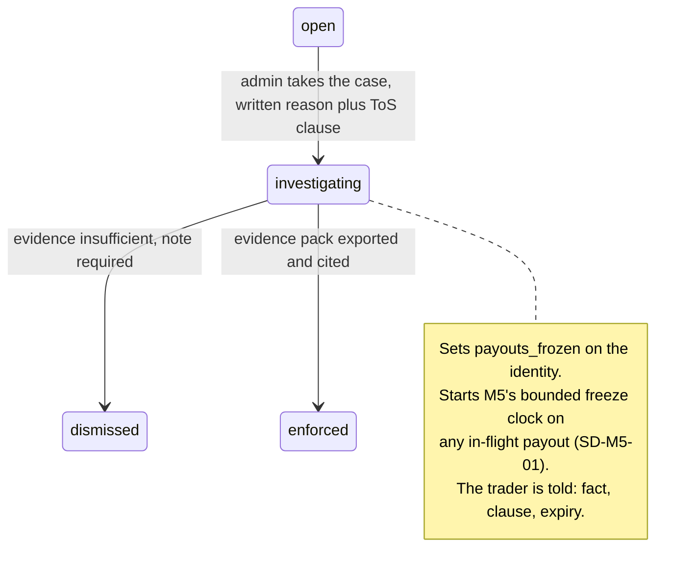
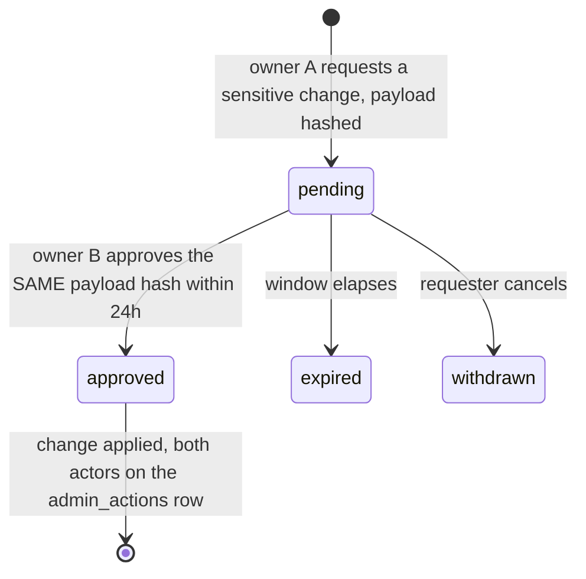

# M6: Admin and Ops Console

Constitution section M6 (**"the FTT-killer"**), Appendix D1 and D3, Appendix B5 ten-section template.

This module exists because of one named cause of death. Constitution 0 lists liability blindness first, with the quote attached: FTT "didn't know their liabilities till everyone requested on a new dashboard". Every panel below is an answer to a specific way a firm stops knowing something, and the module's success condition is not that the dashboard exists but that **the founder looks at it and believes it.**

That last clause drives more design here than any technical requirement. A control that cries wolf gets muted, a number nobody trusts gets ignored, and a breaker that fires wrongly gets disabled. Three of this module's six adversarial scenarios are about exactly that failure, because it is the one that actually happens.

**Amended and approved at the Wave 3 batch 1 gate (2026-08-14).** Three rulings changed this module: **evidence packs are confirmed as two tiers** (AS-M6-01, SD-M6-04), **wallet balances join Open Liability and reserve coverage** ([ADR-019](../decisions/ADR-019.md), P-M6-01 and P-M6-07), and **Open Liability gains a live indicative rendering** ([ADR-020](../decisions/ADR-020.md), section 3.5). The break-glass question OQ-M6-03 was ruled and moved to [SECURITY section 8](../architecture/SECURITY.md).

**Amended by [ADR-040](../decisions/ADR-040.md) and [ADR-041](../decisions/ADR-041.md) ([FOLD-02](FOLD-02-enforcement-window-and-suspension.md) session 5, 2026-08-16).** Four things move and one of them is a founder ruling this document was the open question for. **`OQ-M6-01` is RULED: the unsuppressible list is four, not three.** **Section 1.2's zero-denial row is one of the ten sites ADR-040 names**, and it is amended rather than left contradicting the ADR. **Restriction and restore become launch-available actions** on the flags queue and a new identity drill-down (section 3.3a), because [ADR-022](../decisions/ADR-022.md) tiers the graph explorer to v1.x and the one-click-from-a-cluster affordance therefore cannot be the only way in. And `INV-M6-13` and `INV-M6-14` state what the console must not do and what it must record. **No panel definition, no liability number and no breaker moves.**

**Identifier conventions:** `INV-M6-nn` invariants, `SD-M6-nn` schema deltas, `P-M6-nn` panels, `FM-M6-nn` failure modes, `AS-M6-nn` adversarial scenarios, `OQ-M6-nn` open questions, `DEP-M6-nn` dependencies.

---

## 1. Purpose and invariants

### 1.1 What this module is

`apps/admin`, served from a **separate apex domain** behind the `ADMIN_ORIGIN` placeholder ([ADR-012](../decisions/ADR-012.md)), IP allowlisted, hardware-key SSO, unlinked from every public surface. Surfaces: the liability home page, the account drill-down, **the identity drill-down**, the flags queue, and the event feed. Plus one export: the [evidence pack](../GLOSSARY.md#evidence-pack).

**The identity drill-down is added here rather than invented here** ([ADR-041](../decisions/ADR-041.md), [M07](M07-risk-abuse.md) section 3.3a). Both name it as a **v1** entry point for restriction, and this document's surface list did not contain it, so a launch-available action was committed to in two approved places and owned in none. **A restriction is per human and the account drill-down is per account**, so opening one from a screen about a single account is the wrong shape rather than a missing button: the operator would be restricting a human from a page that cannot show them what else that human holds. The discriminator for writing it here is the one [FOLD-02](FOLD-02-enforcement-window-and-suspension.md) session 4 used for `G-ENFORCEMENT-RESTRICT`: **a primary source states what the surface is**, so this is transcription. **The count of surfaces is not restated**, on the same reasoning that took the numeral out of M02's vendor agenda.

### 1.2 What this module is not

| Not M6 | Whose job | Why the boundary is here |
|---|---|---|
| Computing eligibility, liability inputs, or any rule | [M1](M01-rules-engine.md) | M6 aggregates numbers other modules computed. It has no arithmetic on a rule |
| Detecting abuse | [M7](M07-risk-abuse.md) | M6 renders the flag queue and records the human decision. It never raises a flag |
| Denying a payout | nobody | **Amended by [ADR-040](../decisions/ADR-040.md), and this row is one of the ten sites that amendment names.** There is still no `denied` status and no action called denial. **The substance survives:** every payout either pays or produces a documented enforcement action carrying a cited flag, a ToS clause and an exported evidence pack. **The mechanism changes:** what M6 can do is now a **freeze** on an in-flight payment ([M05](M05-payout-system.md) SD-M5-01) or, inside a 48 hour pre-approval **hold** the console did not open and cannot extend, an enforcement that closes the request. Zero denial was expressed as "no review state exists" and is expressed now as **"a review state exists and it expires"**. The row read "there is no such action" until 2026-08-16, and the honest correction is that the absence is no longer the control: **the clock is** |
| Moving money | [M5](M05-payout-system.md) | M6 shows the treasury position and raises the top-up task. The founder moves the money by hand ([ADR-011](../decisions/ADR-011.md)) |
| Editing a live account's rules | nobody | An account's `plan_version_id` never changes. There is no admin action that could change it, and its absence is a control |

### 1.3 Invariants

| ID | Invariant | Enforcement |
|---|---|---|
| INV-M6-01 | Every mutating admin action writes an `admin_actions` row with actor, reason, before, and after, and a non-empty reason is required by the contract | Middleware, not per-endpoint discipline. Append-only table, no UPDATE or DELETE grant |
| INV-M6-02 | The admin origin shares no cookie, no CORS policy, and no CSP with any public surface | [ADR-012](../decisions/ADR-012.md). An XSS on the portal cannot reach the admin surface even in principle |
| INV-M6-03 | No admin action can deny a payout, and no liability signal has a code path to a payout block | [M05](M05-payout-system.md) INV-M5-12. The circuit breaker's only effect is a checkout flag. **Amended by [ADR-040](../decisions/ADR-040.md), section 1.2:** the second clause is untouched and structural, and the first now means **no admin action refuses a payout on a judgment**. The console cannot open a hold (`G-HOLD-REQUIRED` is evaluated at request time from the flag state, not by a human), cannot extend one, and cannot mute the alarm that fires when one runs past its expiry. What it can do inside the window is record a **documented enforcement action** with a cited flag, a ToS clause and an exported evidence pack, and doing nothing means the request **pays** |
| INV-M6-04 | Every number on the liability page names its **as-of** moment and its source | A figure whose freshness is unstated is a figure that will eventually be quoted stale in a decision that mattered (AS-M6-04) |
| INV-M6-05 | Evidence pack export is itself audited, and every pack has a declared audience and redaction profile | SD-M6-04, AS-M6-01. A pack contains everything about a trader, and some of it must never leave the building |
| INV-M6-06 | Muting or suppressing an alarm is an audited action with a mandatory expiry | SD-M6-03. A permanently muted alarm is an alarm that was deleted by someone who did not have to say so (AS-M6-03) |
| INV-M6-07 | A circuit breaker firing on a sample below its minimum is recorded as **insufficient data**, never as a breach of threshold | SD-M6-02, AS-M6-02. A ratio computed on three transactions is not a ratio |
| INV-M6-08 | Dual control on cap, split, gap, and treasury credential changes is enforced **server side**, with the two approvals from distinct credentials within a 24 hour window | [ADR-010](../decisions/ADR-010.md), SD-M6-05. The constraint must survive a determined founder in a hurry, which is the situation it exists for |
| INV-M6-09 | `readonly` cannot mutate anything, and `ops` cannot change config, roles, or plan versions | RBAC enforced server side per endpoint, with the D5 negative-authz matrix covering every role against every mutating endpoint |
| INV-M6-10 | The admin console renders trader-identifying data only when the query names a specific subject | No bulk export of identities exists as a UI affordance. Bulk is an audited export, not a screen (AS-M6-01) |
| INV-M6-11 | Every liability figure includes wallet balances, and no panel reports a liability number that excludes them | [ADR-019](../decisions/ADR-019.md), [M05](M05-payout-system.md) INV-M5-15. The wallet improved the firm's **liquidity** and changed none of its **obligations**, and a dashboard that blurred the two would be liability blindness introduced by a feature intended to reduce it |
| INV-M6-12 | An indicative figure is never presented as an as-of-last-closed figure, and no breaker, alarm, or task threshold reads one | [ADR-020](../decisions/ADR-020.md)'s hard rule on the admin surface. A live Open Liability is for the founder's eyes between batches; the same number decides nothing automatically (section 3.5) |
| INV-M6-13 | **No admin action extends a hold, a freeze or a restriction past its own clock, and no console affordance offers to** | [ADR-040](../decisions/ADR-040.md) and [ADR-041](../decisions/ADR-041.md). Expiry is the security control rather than the flag, so an "extend" button is the one control-shaped affordance that would delete the control. The three clocks are `payout_requests.hold_expires_at`, `freeze_expires_at` on both tables, and `identity_restriction_episodes.sla_due_at`, and **none of them is writable from any admin route after the row exists**. A case needing longer than 48 hours produces an enforcement inside the window or it produces a payment |
| INV-M6-14 | **A restriction and a restore are both console actions with a complete record, and neither is writable without one** | [ADR-041](../decisions/ADR-041.md). Opening one writes an [`identity_restriction_episodes`](../architecture/data-model/identity_restriction_episodes.md) row carrying a cited `risk_flags` id, a ToS clause, a written reason, an actor and an exported evidence pack; `identity_restriction_open_uq` allows **at most one open episode per identity**, so a second restriction on a restricted human is a database refusal rather than a duplicate record. A restore writes `restored_at`, `restored_by` and `restore_evidence`, which `identity_restriction_restore_is_complete` makes **all-or-none** ([`0031`](../../packages/db/migrations/0031_payout_hold_and_identity_restriction.sql)). **The restore is the half that gets skipped under pressure**, and it is the half that has to survive being contested |

---

## 2. Entities and schema deltas

M6 consumes [DATA_MODEL sections 8, 9, and 10](../architecture/data-model/README.md) as approved. **<!--gen:m06_delta_count-->10<!--/gen--> deltas, and the table is the count: the number in this sentence is derived from it rather than typed** ([ADR-034](../decisions/ADR-034.md), `OI-24`. It read *"Five deltas"*, was corrected once to *"Six deltas"*, and stood at *"Seven deltas"* while the table grew past it, which is the drift that rule exists to end). **Where a row's failure mode is not one of section 6's, the row's own cell says so:** `SD-M6-06`'s is [M07](M07-risk-abuse.md) `FM-M7-08`, because the dataset is owned here and consumed there; `SD-M6-07`'s is this module's own and lives in section 3.6 rather than section 6, because a digest that stops arriving is a failure of the console's *delivery* rather than of any panel it renders and section 6 was closed before there was anything to deliver; and `SD-M6-11`'s is [ADR-069](../decisions/ADR-069.md)'s ruling in section 11, because it exists to make a distinction auditable rather than to prevent an enumerated failure.

| ID | Table | Change | Why it is not optional |
|---|---|---|---|
| SD-M6-01 | `liability_snapshots` | add `eligible_next_7d_identity_max_cents bigint not null`, `eligible_next_7d_identity_max_id uuid null`, `absorbed_corrections_cents bigint not null default 0`, `open_liability_bounded_cents bigint not null` | Three separate gaps. The identity-level maximum is the number [M05 AS-M5-03](M05-payout-system.md) needs and an account-level total hides. The absorbed-corrections line is the [OQ-10 ruling](../decisions/gates/m1-gate-closure-2026-08-13.md) made concrete. And `open_liability_bounded_cents` is the near-term extractable figure, which is not the same number as the sum of withdrawable and must not be conflated with it (AS-M6-04) |
| SD-M6-02 | new `plan_breaker_state` | `(plan_id, evaluated_on) pk`, `metric text`, `numerator_cents`, `denominator_cents`, `sample_size int`, `ratio_bp`, `threshold_bp`, `min_sample int`, `state text check in ('armed','paused','insufficient_data','manually_overridden')`, `override_reason`, `override_expires_at`, `changed_by` | INV-M6-07. Without a recorded sample size and a minimum, the breaker fires on a two-transaction denominator and pauses sales on a brand new plan during its launch week, which is a self-inflicted outage that also destroys trust in the breaker itself (AS-M6-02) |
| SD-M6-03 | new `alarm_suppressions` | `id`, `alarm_key`, `scope jsonb`, `reason text not null`, `suppressed_by`, `suppressed_at`, `expires_at not null`, `released_at null` | INV-M6-06. Constitution M1's own FM-17 names the failure: a self-audit that becomes slow becomes a self-audit that gets disabled. A mandatory expiry converts "temporarily off" from a lie people tell themselves into a dated fact (AS-M6-03) |
| SD-M6-04 | `evidence_packs` | add `audience text not null check in ('internal','trader','counsel','regulator')`, `redaction_profile text not null`, `includes_detector_detail boolean not null` | AS-M6-01. A pack given to a trader in a dispute is a channel that discloses detector thresholds to the adversary who triggered them. The audience must be a declared, audited property of the export rather than a judgment made in the moment |
| SD-M6-05 | new `dual_control_approvals` | `id`, `subject_kind`, `subject_id`, `requested_by`, `requested_at`, `payload_hash`, `approved_by null`, `approved_at null`, `expires_at`, `status check in ('pending','approved','expired','withdrawn')` | [ADR-010](../decisions/ADR-010.md) requires a second approval within a window. That needs a row: without one, "dual control" is two clicks by the same session and the control is theatre, which Appendix D explicitly warns is worse than nothing because it reads as a control in an audit |
| SD-M6-06 | new `economic_calendar` and `economic_calendar_loads` | `economic_calendar`: `id`, `load_id`, `event_key`, `occurrence_key`, `tier smallint check between 1 and 3`, `scheduled_release_at timestamptz`, `release_trading_day date`, `revision integer`, `revision_reason null`, unique `(event_key, occurrence_key, revision)`, plus the view `economic_calendar_current`. `economic_calendar_loads`: `id`, `source_id`, `coverage_start_day`, `coverage_end_day`, `source_digest`, `actor`. Both append-only by grant | **It is not new scope.** [M07](M07-risk-abuse.md) `DEP-M7-06` has read "a maintained Tier-1 economic calendar, as data \| **M6 admin, seed** \| D-04 fires on the wrong windows" since M07 was written, and **no table satisfied it**, so `D-04` news-window clustering has been unimplementable for the whole life of the corpus. The dataset is owned here because `DEP-M7-06` assigns it here. The **revision** is load bearing: a release time moves and `D-04`'s window must move with it, so it is a new row rather than an update ([ADR-066](../decisions/ADR-066.md) section 2, GS-286). The **loads** table is `FM-M7-08`'s staleness clock on `trading_calendar_loads`' precedent, and without it an exhausted calendar is indistinguishable from a quiet week |
| SD-M6-07 | new `report_schedules` and `report_deliveries` | `report_schedules`: `id`, `digest text` **check in a closed set of four**, `cadence` **generated from `digest`**, `format check in ('csv','pdf')`, `channel check in ('email','sftp')`, `recipients text[]` non-empty, `enabled`, `created_by`. `report_deliveries`: `schedule_id`, `due_at`, `attempt`, `covers_through_trading_day`, the transcribed `channel` and `format`, `recipients_attempted`, `recipients_omitted`, `omission_reason`, `outcome check in ('delivered','failed')`, `failure_reason`, `attempted_at`, `delivered_at`, `artifact_digest bytea`. The delivery table is append-only by grant; the schedule table is not | **The C8 weekly risk ritual's input is currently a human remembering to look.** Section 3.6. The `digest` CHECK is what makes "this is not a report builder" a schema fact rather than a sentence in [ADR-066](../decisions/ADR-066.md), and `report_deliveries` is the load-bearing half: **the delivery-failure alarm reads it and never the job's own report**, which is [M05](M05-payout-system.md) `INV-M5-18`'s construction on a second sweep. Without `due_at` the alarm has nothing to fire on, because absence is only detectable against an expectation |
| SD-M6-09 | new `account_adjustments` | `id`, `identity_id not null`, `account_id null`, `direction check in ('credit','debit')`, `amount_cents > 0` as a **magnitude** with `direction` carrying the sign, `reason_code check in ('goodwill','reconciliation_error','promotional_credit')`, `reason_note not null` and non-empty, `destination check in ('trader_wallet','promotional_credit')`, `ledger_transaction_id not null unique`, `promotional_credit_grant_id null`, `reverses_adjustment_id null`, `actor not null`, `dual_control_threshold_cents not null`, `dual_control_approval_id null`, `evidence_pack_id null`. Append-only by grant. Constraints: `reason_picks_destination`, `promotional_names_its_grant`, `debit_is_a_reversal`, `no_self_reversal`, `dual_control_above_threshold`, a partial unique index allowing **at most one reversal per adjustment**, and three assertions (`ADJ-C1`, `ADJ-C2`, `ADJ-C3`) | [ADR-067](../decisions/ADR-067.md), [`0038`](../../packages/db/migrations/0038_account_adjustments.sql). **It is the first admin route in this corpus that moves money to a named person and the first table that permits taking money back**, so every property of it is a constraint rather than a policy. **Never a balance mutation:** an adjustment posts a ledger transaction or it does not exist, and `ADJ-C2` goes past what `identity_restriction_restore_is_complete` can do by reading the posting and asserting it **is** the adjustment, to the account, the identity, the cent and the sign. **The destination is never `trader_withdrawable`**, because [`gates.ts:78`](../../packages/rules-engine/src/payout/gates.ts) computes withdrawable from the trading balance, so a ledger credit there would buy no eligibility and only make the ledger disagree with the engine. **A debit is only ever the exact reversal of a credit this table posted**, which is what keeps it clear of `INV-M6-03`. **Two console requirements ride on this row** rather than on invariant numbers this session did not claim ([ADR-067](../decisions/ADR-067.md) section 10): the adjustment surface **renders `identities.status`**, because an adjustment against a `restricted` or `closed` identity is permitted and must therefore not be invisible; and the live Open Liability figure in section 3.5 carries a **third term, same-day adjustment postings at par**, which is authoritative rather than indicative and so does not weaken `INV-M6-12` |
| SD-M6-10 | new `impersonation_sessions` and `impersonation_page_views` | `impersonation_sessions`: `id`, `admin_user_id` -> `users(id)`, **`subject_identity_id` -> `identities(id)`**, `token_hash bytea not null unique`, `reason_code text not null` over a controlled vocabulary, `reason_detail text not null` and non-blank, `started_at`, `expires_at`, `ended_at null`, `ended_by null`, `end_reason null`. Three guards: `impersonation_box_is_bounded` (`expires_at > started_at AND expires_at <= started_at + interval '2 hours'`), `impersonation_exit_is_complete` and `impersonation_exit_within_box`. `impersonation_page_views`: `id`, `impersonation_session_id`, `path`, `viewed_at`, append-only by grant, bounded to its session's box by `impersonation_page_view_within_box`. Two triggers implement `IMPERSONATION-C1` **in both directions** against `sessions.refresh_token_hash`. Routes: `POST /admin/identities/:identityId/impersonate` and `POST /admin/impersonation/:id/exit` | `ADR-068`, **auth and therefore money path**. The requirement that needs schema rather than middleware is the second one: a token minted for impersonation **cannot satisfy a trader authorization**. The trader auth path resolves a bearer token by `refresh_token_hash` on `sessions`, so if no `sessions` row can ever carry an impersonation token's hash, that lookup cannot return a row for one and **elevation under [SECURITY](../architecture/SECURITY.md) `C-27` is unreachable by construction rather than by rule**. The table also carries **no `user_id`, no `auth_factor`, no `elevated_at` and no `elevated_by_factor`**, which is structural and not an omission. The **2 hour ceiling** is what makes the time box a time box: a configurable duration with no ceiling is a setting, not a bound. `GS-300` to `GS-303` |
| SD-M6-11 | `admin_actions` | add `initiative text not null check in ('enforcement','trader_request','operational')` and `on_behalf_of_identity_id uuid null references identities(id)`, with a **biconditional** `CHECK` that the identity is set exactly when `initiative = 'trader_request'`, plus a partial index on `(on_behalf_of_identity_id, created_at desc)` | Section 11, [ADR-069](../decisions/ADR-069.md), `0043`. **Attribution was already carried and initiative was not.** [`0017`](../../packages/db/migrations/0017_events_and_audit.sql) gives `actor`, `reason not null`, `before` and `after`, so nothing distinguishes an admin acting **on** a trader from an admin acting **for** one, and in a dispute those are different defences. The vocabulary is `CloseRequest.kind`'s, unchanged, because row 33 of section 11.2 is the one trader-requested admin act the corpus already models; **that field has no column anywhere today** and lands in the `after` jsonb or nowhere. It arrives before any parity route exists because `admin_actions` is append-only and retained forever, so a discriminator added later leaves every historical row `NULL` and `NULL` is then ambiguous between *"Merit's own act"* and *"written before the column existed"* |

**A single number between `SD-M6-07` and `SD-M6-09` remains deliberately unclaimed**, and this paragraph read *"three numbers"* in its first clause and *"the two numbers"* in its last while the run it describes was being consumed one number at a time. [FOLD-03](FOLD-03-vendor-parity-gap-fill.md) `F2` and `F3` both write this module and neither had claimed a delta when `ADR-068` claimed high and left them the run below it; `SD-M6-07` and `SD-M6-09` have since been claimed from that run. There is no `SD-M6-nn` allocation table to read, which is [ADR-034](../decisions/ADR-034.md)'s condition exactly, and the remedy available to a session that cannot create one is to claim high and say so where the next writer looks. **It is named by position rather than by identifier on purpose**: `ADR-026`'s completeness gate reads an `SD-nn` token anywhere under `docs/` as a citation, so writing the number out would demand a manifest row for a delta nobody has designed.

---

## 3. Surfaces

### 3.1 The liability home page

Constitution M6 fixes the panel list. What this plan adds is the **definition** of each number, because an undefined number is what liability blindness actually looks like.

| ID | Panel | The number, defined |
|---|---|---|
| P-M6-01 | Open liability | `sum(withdrawable_cents)` across funded accounts **plus `sum(wallet_balance_cents)` across identities**, as of the last closed day (INV-M6-11). This is the **accounting** figure: what traders could claim if every gate vanished. **The two components are shown separately as well as summed**, because they behave differently: withdrawable is a claim that still has to clear gates, and a wallet balance has already cleared them all and is owed unconditionally |
| P-M6-02 | Bounded near-term liability | `sum(min(withdrawable, cap_for_next_ordinal))` across funded accounts that are currently eligible or become eligible inside 7 trading days. This is the **cash** figure: what can actually leave soon. It is a different number from P-M6-01 and both are shown, because using either alone is a specific way to be wrong (AS-M6-04) |
| P-M6-03 | Eligible next 7 days | Account-level total, **plus the largest single identity's share** (SD-M6-01). The identity number is the one that triggers [ADR-011](../decisions/ADR-011.md)'s same-day top-up |
| P-M6-04 | Payout velocity | Trailing 7 day settled cents against the 30 day average, alarming above 2.5x (constitution M6) |
| P-M6-05 | Per-plan loss ratio | Trailing 30 day settled payouts divided by fees, per plan, with **sample size shown next to the ratio**. Breaker at 6000bp pauses that plan's new sales (SD-M6-02) |
| P-M6-06 | Pass-rate CUSUM per plan | `S_t = max(0, S_(t-1) + (x_t - mu_0 - 0.5*sigma))`, alarming at 4 to 5 sigma. "A plan is being beaten; inspect before the funded wave" |
| P-M6-07 | Reserve coverage | RCR against a **live** rail balance ([M05](M05-payout-system.md) SD-M5-03), with attestation staleness shown when the balance is a manual attestation. **The denominator is `CVaR99 at rho = 0.30`, the reserve floor, never the harness's central estimate** ([DECISIONS](../decisions/README.md)), and the panel names which figure it used. **The denominator now includes wallet balances**, and a second ratio is shown beside it: coverage against **near-term external withdrawal demand** rather than against total wallet liability. The two diverge exactly when the wallet is doing its job, and reporting only the first would understate the firm's real position as badly as reporting only the second would overstate it |
| P-M6-08 | MID health | Both providers, decline and chargeback rates, current routing state ([M03](M03-billing-checkout.md) SD-M3-03) |
| P-M6-09 | Data trust | Recon mismatches open, marks completeness gap, unconfirmed setpoints, replay divergences, batch last-success. **If anything here is red, every number above it is suspect and the page says so** |
| P-M6-10 | Absorbed corrections | Signed cumulative absorbed delta, per the [OQ-10 ruling](../decisions/gates/m1-gate-closure-2026-08-13.md), with the per-identity outliers listed |

**P-M6-09 is placed last in the list and first on the page.** Data trust gates every other number: an open reconciliation mismatch or a replay divergence means the liability figures are computed from state we have said we do not trust. Rendering them adjacent, with the trust panel above, is the difference between a dashboard and a dashboard that misleads.

### 3.2 The account drill-down

One screen answering one question: **why did this account get this outcome.** Account, identity, every mark, every `rule_states` row with its `gate_results`, every event, flags with evidence, payouts with their immutable snapshots, and every admin action. This is the screen a support conversation is conducted from, and it is the raw material of an evidence pack.

The `gate_results` per day is the load-bearing part. A trader disputing an outcome is disputing a specific day, and the drill-down must show what every gate said on that day, from the stored row rather than from a recomputation, because a recomputation is an assertion and the stored row is a record.

### 3.3 Enforcement flow

Binding, from [STATE_MACHINES section 7](../architecture/STATE_MACHINES.md) and unchanged: **no automatic transition into `enforced`.** Detectors produce `open` and nothing else. What this plan adds is that entering `investigating` now starts a clock, because [M05 AS-M5-04](M05-payout-system.md) showed that a freeze without one is a denial nobody authorized.

### 3.3a Restriction and restore, and why the entry point is a v1 surface (ADR-041)

**The `investigating` to `enforced` path already carries everything a restriction needs**, which is why [ADR-041](../decisions/ADR-041.md) put the action there instead of building a second path: an exported evidence pack, a cited flag, a ToS clause, a written reason and an actor are preconditions of `enforced` today. What the fold adds is a **third outcome** beside dismissal and closure.

| Outcome from `enforced` | Scope | Reversible | Record |
|---|---|---|---|
| Closure for cause | one **account** | **no, terminal** | `account_status_history` plus the pack |
| Freeze on an in-flight payment | one **payment** | yes, and it expires | the freeze trio on the row ([M05](M05-payout-system.md) SD-M5-01) |
| **Restriction** | one **human**, every account they hold | yes, by a **documented restore** | an [`identity_restriction_episodes`](../architecture/data-model/identity_restriction_episodes.md) row (INV-M6-14) |

**Two entry points, both launch-available, and that is the whole point of the section.** [ADR-022](../decisions/ADR-022.md) tiers the identity-graph explorer to **v1.x**, so the one-click-from-a-cluster affordance section 7.9 describes **cannot be the only way in** or the enforcement Ruling B created would ship with no way to apply it until a later release.

- **v1: the flags queue.** The case is already open, the pack is already exported, and restriction is one more terminal choice on the same confirm step.
- **v1: the identity drill-down** (section 3.2a). The operator arrived from the human rather than from the case, which is the shape an investigator actually works in when the unit of abuse is a person holding several accounts ([M07](M07-risk-abuse.md) AS-M7-02, AS-M7-06).
- **v1.x: the graph explorer**, beside its one-click evidence pack (section 7.9).

**All three inherit GS-117 and the restore inherits it hardest.** GS-117 requires the reason typed **before** the confirm control enables, for any action reversing a protective state, and a restore is exactly that category: it is the reversal of a protective state, taken under pressure, by the person with the most context, which is AS-M6-06's fact pattern with the enforcement running the other way. **Restriction is the slow action and restore is the slower one**, and both restate what will change in plain words before the confirm.

**What the console cannot do here** (INV-M6-13): it cannot extend the episode's `sla_due_at`, and a restriction opened over a held payout does **not** move that payout's `hold_expires_at`. Without that property Ruling B is a route around Ruling A, since an investigator who wanted more than 48 hours would simply restrict the human ([M05](M05-payout-system.md), [ADR-041](../decisions/ADR-041.md)).

### 3.2a The identity drill-down

One screen answering the question the account drill-down cannot: **who is this human, what do they hold, and what is currently true across all of it.** The identity, its status and status reason, every account with its state, the resolved graph edges with their kind and confidence, every flag, every restriction episode past and present with its actor and its evidence, the wallet position, and every admin action taken against the human rather than against one account.

**It is the surface a restriction is opened from and the surface a restore is opened from**, because both are per-human acts, and it is where the operator can see what the enforcement will actually halt before halting it.

**INV-M6-10 binds here exactly as it binds everywhere else**, and this screen is the reason to say so rather than assume it: the drill-down renders trader-identifying data across several accounts at once, so it is reachable **only by naming a specific subject** and every view is logged as an access to the underlying identities, in section 7.9's terms. It is not a browse surface and there is no list behind it. **A screen that aggregates one human is a convenience; a screen that aggregates humans is the bulk PII surface FM-M6-10 exists to refuse**, and the difference is one query parameter, which is why the constraint is stated here rather than inherited quietly.

### 3.4 Dual control

Sensitive set, per [ADR-010](../decisions/ADR-010.md): payout cap, split, cadence gap, treasury credentials, and rail credentials. The approval binds to a **payload hash**, so approving a change and then applying a different one is impossible rather than merely discouraged. Both credentials are the founder's, on separate hardware keys, and the honest framing is carried verbatim from the ADR into the UI itself: at launch scale this is **compromise resistance, not insider resistance.** Writing that on the screen matters, because a control misread as something stronger is how a real gap survives an audit.

### 3.5 Live Open Liability (ADR-020, tier 2)

[ADR-020](../decisions/ADR-020.md) puts a **live Open Liability** figure on this page. It is the admin half of the same two-tier bargain the trader dashboard takes, and the reason it is worth having here is specific: the liability figure is the one number whose staleness has an actual named body count, since FTT "didn't know their liabilities till everyone requested".

**What it is.** Last closed session's authoritative Open Liability, plus the intraday movement implied by the indicative feed. It answers "roughly where is the book right now", which between batches is currently unanswerable at all.

**What it is not, and this is enforced rather than intended** (INV-M6-12):
- **No breaker reads it.** The plan loss-ratio breaker, the RCR trigger, the payout-velocity alarm, and [ADR-011](../decisions/ADR-011.md)'s same-day top-up task all read authoritative figures only. A live number that could pause sales would be an intraday vendor feed with a revenue lever attached.
- **No liability snapshot is written from it.** `liability_snapshots` remains a daily materialized row from closed data.
- **It is visually distinct from every authoritative figure on the page**, and it sits beside the as-of figure rather than replacing it. Two numbers, both labeled, is the entire design.

**And P-M6-09 governs it like everything else.** When data trust is red the live figure is suppressed rather than shown, because a live number derived from a feed we already distrust is worse than no number: it is the confident wrong answer AS-M6-04 is about, arriving faster.

### 3.6 Scheduled digest delivery ([ADR-066](../decisions/ADR-066.md), SD-M6-07)

**The panels above are read by a founder who remembers to open them.** Constitution section 7 requires a weekly risk ritual and [WEEKLY_RISK_RITUAL](../ops/runbooks/WEEKLY_RISK_RITUAL.md) is the checklist, but **its input has until now been attention**. A control that exists and does not arrive is a control that enforces nothing, and this module already said so about itself: section 9's alert list calls the weekly digest of active suppressions "the single most useful recurring artifact this module produces" and **specifies no mechanism anywhere for delivering it**.

**This is not a scheduler over a report builder, and [ADR-066](../decisions/ADR-066.md) section 8 refuses one.** The parity referral asked for recurring delivery of "the reporting layer's saved views"; a grep for `saved view` and `reporting layer` across `docs/plans/` and `docs/architecture/` returns nothing, so admitting the item as written would mean designing a reporting layer inside a parity gap-fill. What is admitted is **four named digests over panels this section already defines**.

#### The four, and the panels each is made of

| Digest | Cadence | Built from | Size |
|---|---|---|---|
| **Liability** | daily | P-M6-01 Open Liability, P-M6-03 Eligible-Next-7-Days, and **P-M6-07's reserve coverage ratio, which reads a live rail balance** ([M05](M05-payout-system.md) `SD-M5-03`) | **MUST** |
| **Plan loss ratios and CUSUM** | weekly | P-M6-05 with its sample size beside it (INV-M6-07) and P-M6-06 | **MUST** |
| **Flag queue summary** | weekly | The queue's depth and age by severity, section 9's `admin.flags_open` | SHOULD |
| **Revenue and cohort** | monthly | Section 3.1's commercial figures and the completed-ladder cohort | SHOULD |

**The two MUSTs earn it from the ritual rather than from the report.** They are the C8 ritual's input, so a schedule that silently stops is a weekly risk review that silently stops. The other two are useful and nothing depends on them, which is exactly the distinction [DELIVERY_PLAN](../DELIVERY_PLAN.md) sizes on.

**Cadence is not a per-schedule choice.** It is generated from the digest in the schema, so a daily liability digest cannot be scheduled monthly by a careless write. And **the digest vocabulary is closed at four by a CHECK**: admitting a fifth is a migration, which is a ruling, which is what stops the refused report builder arriving one custom report at a time.

#### The alarm fires on the delivery record, never on the job

**This is [M05](M05-payout-system.md) `INV-M5-18`'s idiom, deliberately reused rather than reinvented.** That invariant is asserted *"on the QUERY, never on the job"*, evaluated independently of whether the sweep reported success, on the stated ground that **a job that reports success is not evidence that the work happened** ([M02](M02-rithmic-bridge.md) `FM-M2-11`). A second sweep with the same shape gets the same control.

- **The alarm reads [`report_deliveries`](../architecture/data-model/report_deliveries.md)**: an enabled schedule whose window has closed with no `delivered` row is the finding. The dead-man switch is in [CRON_INVENTORY](../ops/runbooks/CRON_INVENTORY.md), on the same footing as the freeze-expiry assertion.
- **`due_at` is what makes that askable at all.** Absence is only detectable against an expectation, so the window an attempt discharges is stored on the attempt. Without it, "nothing arrived" and "not due yet" are the same empty result set, which is [`economic_calendar_loads`](../architecture/data-model/economic_calendar_loads.md)'s coverage bound one table over.
- **There is deliberately no `skipped` outcome.** Two values, `delivered` and `failed`. A skip that can be *recorded* as an outcome is a skip that reads as normal in a list of outcomes, and the acceptance is that a failed delivery alarms and **never silently skips**. A run that declines to send writes `failed` with its reason, or it writes nothing and the missing row is the finding. Both roads reach a human.
- **The delivery log is append-only by grant.** An `UPDATE`-able outcome makes the alarm's own evidence editable by the process the alarm exists to distrust.

**These belong in section 9's metric table and are placed here instead**, because three sibling sessions are editing this document under [ADR-066](../decisions/ADR-066.md) at the same time and an appended subsection collides with nothing while an edited shared table collides with everything. The metrics are `admin.report_deliveries_failed` and, the one that matters, **`admin.report_windows_undelivered`, which is zero, always, and is computed from the table rather than from the job's report.**

#### Channels, and the one that is a second credential surface

**Email is the MUST channel. SFTP push is admitted as SHOULD.** `OQ-F3-04` stands and the founder closes it at signature: SFTP is a **second credential surface**, which makes "is email alone acceptable for v1" a security question rather than a convenience one.

**It reuses no [M02](M02-rithmic-bridge.md) code path, and this is a boundary rather than a preference.** M02's SFTP is a **vendor wire format** held provisional under [ADR-005](../decisions/ADR-005.md) pending the Rithmic call. Coupling them would make a change to a report a **provisioning incident**, which is the wrong blast radius by two modules. Mechanically, [`0040`](../../packages/db/migrations/0040_report_schedules.sql) references no M02 object and stores no credential: `recipients` names a destination, and [ADR-010](../decisions/ADR-010.md) already owns the sensitive credential set.

#### INV-M6-10 is not weakened, and the schema is where that is enforced

**No digest is a bulk identity export.** The liability digest is aggregate. The flag-queue digest carries **counts and links, never trader-identifying rows**, which keeps it inside INV-M6-10's rule that trader-identifying data renders only when the query names a specific subject.

**The delivery table holds no artifact, only its SHA-256.** A table of rendered digest bodies **would be** the bulk export, sitting behind an admin route, created by the feature that was admitted on the promise that it was not one. The hash answers "was what arrived what we generated" and answers nothing about any trader.

#### Tying it to the ritual, in the runbook rather than by implication

**[WEEKLY_RISK_RITUAL](../ops/runbooks/WEEKLY_RISK_RITUAL.md) now names the digest as its input**, and the ritual's first action is to check that the digest arrived. That sentence is the whole point of the feature: the ritual and the artifact were specified in different documents, months apart, and neither said the other existed.

#### Golden scenarios

**GS-288, GS-289 and GS-290 are already registered** in [GOLDEN_SCENARIOS section 36](../testing/golden-scenarios/36-gs-285-to-gs-299-the-vendor-parity-gap-fill.md) and are **not renumbered here**. GS-288 pins the alarm firing from the delivery record while the job reports success. GS-289 pins the aggregate digest satisfying INV-M6-10. **GS-290 is the one whose mechanism is easiest to under-build**: a schedule naming a removed recipient degrades to the remaining recipients **and records the removal**, so an omission with no stated reason is unwritable and, more sharply, **a delivery that reached nobody cannot be recorded as `delivered` at all**. Full degradation to zero recipients is not a degraded success; it is a failure that has learned to look like one.

#### Two things recorded rather than quietly decided

**The weekly suppression digest is NOT one of the four, and it is the artifact section 9 calls the most useful one this module produces.** It is derivable from `alarm_suppressions` and this mechanism could carry it tomorrow. **It is not scheduled here** because [ADR-066](../decisions/ADR-066.md) sized a set of four and a fifth digest is a ruling rather than a session's judgment, which is the same closed-vocabulary discipline the `digest` CHECK enforces on everybody else. It is named so the next reader finds the gap rather than assuming the mechanism forgot it.

**OQ-M6-04 asked whether the founder wants a daily digest or only alarms**, and recommended "yes, daily, one screen, and it is the first thing built in this module, because the habit is the control". [ADR-066](../decisions/ADR-066.md) sizes the daily liability digest **MUST**, which answers the delivery half of that question and leaves the "one screen" half and the "only alarms" alternative to the founder. **The question is not marked ruled here**, because a session closing a founder question on its own authority is the failure the ADR discipline exists against.

**And this subsection took the number `3.6` while three sibling sessions were writing this document.** If it collides at merge, the remedy is section 3.3a's and [DELTA_MANIFEST](../../packages/db/DELTA_MANIFEST.md) section 4b's: a letter suffix, which inserts a section without disturbing what cites the next number.

---

## 4. API endpoints touched

M6 owns [API_CONTRACT sections 8 and 9](../architecture/API_CONTRACT.md) in full and adds no new endpoint shape. Three obligations worth stating.

| Endpoint | Obligation |
|---|---|
| `GET /admin/liability` | Response gains `open_liability_bounded_cents`, the identity-max eligible figure, and `absorbed_corrections_cents` (SD-M6-01). Every field carries its own `as_of` (INV-M6-04) |
| `GET /admin/evidence/:accountId` | Requires `reason` **and** now `audience` (SD-M6-04). The redaction profile follows from the audience and is recorded on the pack, not chosen per export |
| `POST /admin/plans/versions/:id/publish` | Dual control resolved against `dual_control_approvals` by payload hash, server side (SD-M6-05, INV-M6-08) |
| `GET /internal/jobs`, `GET /internal/recon/status` | Feed P-M6-09. These are the two endpoints an operator opens during an incident, so they must be fast and must not require a working batch to answer |

---

## 5. Events emitted and consumed

M6 consumes essentially the whole catalogue for the feed. It **emits** the admin side.

| Event | When | Notes |
|---|---|---|
| `flag.status_changed`, `enforcement.applied` | flag queue | `enforcement.applied` requires an `evidence_pack_id` on the transition. Its `action` union already carries `"restrict"`, so [ADR-041](../decisions/ADR-041.md) adds **no** value to it |
| `identity.restricted` | section 3.3a, on opening an episode | Already in the approved catalogue as `{ identity_id, reason, tos_clause, evidence_pack_id }`. **It carries no account list and `enforcement.applied` does**, so the two are emitted from the same transaction and consumers are told which is authoritative for what: the episode row is the record, `enforcement.applied` names the accounts as of that instant, and [M02](M02-rithmic-bridge.md) resolves the set itself at consume time because the set can move (M02 section 3.6) |
| **the restore, which has no event and needs one** | section 3.3a, on a documented restore | **A gap, named rather than filled here.** `identity.payouts_frozen` has `identity.payouts_unfrozen` beside it and **`identity.restricted` has no counterpart in [EVENTS](../architecture/EVENTS.md) at all**, so `G-RESTRICTION-LIFTED` is a transition with no event, against [STATE_MACHINES](../architecture/STATE_MACHINES.md)' universal rule 1. Nothing can react to a restore: not [M02](M02-rithmic-bridge.md)'s re-enable (its `DEP-M2-06`), not the notification, not the feed. **EVENTS is [FOLD-02](FOLD-02-enforcement-window-and-suspension.md) session 6**, and naming the event here would claim in a registry this session does not own, which is the discipline session 4 applied to `payout.held` |
| `evidence.pack_exported` | export | Now carries `audience` and `redaction_profile` (SD-M6-04) |
| `admin.action_recorded` | every mutation | Mirrors the `admin_actions` row so the feed does not depend on table shape |
| `breaker.state_changed` **NEW** | SD-M6-02 transition | `{ plan_id, metric, from_state, to_state, ratio_bp, threshold_bp, sample_size, min_sample }`. A breaker that pauses sales is a revenue event and belongs on the feed with its **sample size attached**, so the reader can see immediately whether it fired on real data (AS-M6-02) |
| `alarm.suppressed` / `alarm.suppression_expired` **NEW** | SD-M6-03 | `{ alarm_key, scope, reason, suppressed_by, expires_at }`. Muting a control is a decision, and decisions are events (AS-M6-03) |
| `dual_control.requested` / `.approved` / `.expired` **NEW** | SD-M6-05 | `{ subject_kind, subject_id, payload_hash, requested_by, approved_by? }`. Alerts on every admin login and every config change are already required by D3; the approval lifecycle needs the same treatment |

---

## 6. Failure modes

| ID | Failure | Blast radius | Detection | Recovery |
|---|---|---|---|---|
| FM-M6-01 | Liability number computed from untrusted state | Every decision made from the page is wrong, silently | P-M6-09 renders above the numbers and marks them suspect | Resolve the recon or replay issue first. The page must **refuse to look healthy** while data trust is red |
| FM-M6-02 | Breaker fires on a tiny denominator | Sales paused on a new plan during its launch week, and the breaker loses credibility permanently | `min_sample` on SD-M6-02, state `insufficient_data` | The breaker does not fire below the minimum; it says so instead (AS-M6-02) |
| FM-M6-03 | Alarm fatigue | The founder mutes a control and the mute outlives the reason | Mandatory expiry (SD-M6-03) plus a weekly digest of active suppressions | Suppression expires and the alarm returns. Nothing is muted forever without someone re-deciding (AS-M6-03) |
| FM-M6-04 | Evidence pack discloses detector thresholds to the adversary | Detection becomes evadable, permanently, for everyone | Audience and redaction profile on every export (SD-M6-04) | Trader-audience packs carry the account's own facts and never the detector's parameters (AS-M6-01) |
| FM-M6-05 | Admin console compromised | **Total loss.** D1 names it: one owned admin is everything | Separate apex origin, IP allowlist, hardware-key SSO, alerts on every admin login | Dual control on the sensitive set means a single owned session still cannot move cap, split, gap, or the rail (AS-M6-05) |
| FM-M6-06 | An admin action taken under social engineering | Account transfers, KYC swaps, and unfreeze requests are the classic vectors (Appendix A item 9) | Every action audited with a mandatory reason; identity changes have no admin path at all | The dangerous actions are made **slow** on purpose (AS-M6-06) |
| FM-M6-07 | CUSUM miscalibrated | Either constant alarms, which become noise, or none, which is the same as no chart | `mu_0` and `sigma` estimated from the simulation harness before launch, then refreshed monthly from realized data | Calibration is a tracked deliverable with a named owner, not a constant someone picked |
| FM-M6-08 | The dashboard is slow enough that nobody opens it | The single failure that makes every panel above worthless | p95 render budget of 2 seconds; `liability_snapshots` is a daily materialized row, not a live aggregate over the whole book | Snapshot-first, live only where freshness genuinely matters (P-M6-07, P-M6-09) |
| FM-M6-09 | RBAC gap lets `ops` change config | The role split becomes decorative | D5 negative-authz matrix across every role and every mutating endpoint, in CI | Merge blocker |
| FM-M6-10 | Search returns a result set that enumerates identities | A bulk PII surface hiding inside a convenience feature | Search requires a specific subject term; result sets are capped and audited (INV-M6-10) | Bulk is an audited export with an audience, never a screen |

---

## 7. Adversarial scenarios

**Six listed, five novel.** The one marked "extends" takes Appendix D1's crown-jewel analysis into this module's specifics.

### AS-M6-01: The evidence pack as a detector-disclosure channel (NOVEL)

**Attack.** The [evidence pack](../GLOSSARY.md#evidence-pack) is court-grade and is a launch requirement precisely because "adversaries publicly contest enforcement and the firm that cannot show its work loses the argument". So packs get sent to traders during disputes. A pack contains flags with their `evidence` JSON, which contains **the numbers behind the accusation**: the correlation coefficient that tripped the inverse-pair detector, the millisecond window that tripped fill clustering, the exact velocity threshold. A ring member who triggers a flag deliberately, contests it, and receives a pack has purchased **the detection thresholds for the entire firm** for the price of one burned account. They then tune to just inside every threshold, and Merit's detection is blind against that ring forever.

**Numbers.** One burned CORE-25K evaluation at roughly $79 buys the parameters of every detector that fired. The [dossier](../../research/ADVERSARY_DOSSIER.md) documents that these groups coordinate on Discord and Telegram and read rulebooks forensically, so the disclosure does not stay with one person.

**Counter, and it was confirmed at the batch 1 gate as a two-tier split** ([DECISIONS](../decisions/README.md)). SD-M6-04 makes audience a declared, audited property of the export, with a redaction profile that follows from it rather than a judgment made under pressure during a dispute. The ruling stated the split in the terms the profiles now implement: **a trader-facing pack shows conduct, rule text, and the trader's own trades; thresholds and detector internals are internal and counsel tier only.**
- **`trader` audience**: the account's own facts in full (every fill, every mark, every rule state, every gate result, the plan version and its rule text, the computation trace, and the fact that a flag exists with its type and its ToS clause). It contains no detector parameters, no thresholds, no other identity, and no comparison against a population.
- **`internal`, `counsel`, and `regulator`**: full detail including detector internals.
- Every export records which profile was used, so a later argument about what was disclosed is answered by a row rather than by memory.

**The honest tension, stated because it is real.** A trader-audience pack is less complete than an internal one, and an adversary will say so publicly. The answer that holds up: the pack contains **everything about their account and every rule that was applied to it**, which is the whole basis of the outcome, and detector parameters are not a rule that was applied. Enforcement is per the ToS on evidence, and the evidence is the behavior, not the threshold. GS-112.

### AS-M6-02: The circuit breaker that pauses sales on a plan with three customers (NOVEL)

**Attack.** Not an attacker. Small-sample statistics. The breaker pauses a plan's new sales when its trailing 30 day loss ratio (payouts divided by fees) exceeds 6000bp. In the first weeks of a plan's life, the denominator is tiny. One trader on a brand new plan buys a $99 evaluation, passes, and extracts a 150,000c payout: the ratio is roughly 13,500bp, more than twice the threshold, and **the firm's newest product is auto-paused during its launch week on a sample of one.**

**Why it is worse than it looks.** The pause itself is recoverable in minutes. What is not recoverable is that the first time the breaker fires it will be wrong, the founder will override it, and from then on the breaker is a thing that gets overridden. The control that constitution 0 names as the answer to one of four firm-killing failures becomes noise on its first firing, and it will be noise later when it is right.

**Counter.** SD-M6-02 records the denominator and a `min_sample`, and the state `insufficient_data` is a first-class outcome that is neither `armed` nor `paused`. Below the minimum the breaker **states that it has no opinion** rather than manufacturing one. Above it, the ratio is shown next to its sample size everywhere it appears, so a reader always sees how much data is behind the number. And `breaker.state_changed` carries the sample size into the alert itself, because an alert that omits it invites exactly the override that destroys the control.

Proposed minimum: **20 purchases and 3 settled payouts on the plan in the window** (OQ-M6-02). The number is a judgment; having one is not. GS-113.

### AS-M6-03: The muted alarm that stays muted (NOVEL)

**Attack.** Again Merit, under load. Constitution M1's own FM-17 names the pattern for the replay self-audit: it gets slow, someone disables it "temporarily", and Merit has a silent rules engine. The general form applies to every alarm in this document, and the ones most likely to be muted are the noisiest ones, which are usually noisy because they are firing on something real that nobody has had time to fix.

**Why it nearly always works.** Muting is done during an incident, by the person with the most context, for a genuinely good reason, and the reason expires long before the mute does. Nothing about it feels like a decision at the time.

**Counter.** SD-M6-03 makes suppression a row with a **mandatory** expiry, an author, and a written reason, and `alarm.suppressed` puts it on the feed. Expiry restores the alarm without anyone acting. A weekly digest lists every active suppression with its age and its reason, so a mute that has been renewed three times is visibly a decision to not fix something rather than an accident. And a small number of alarms are marked **unsuppressible**: ledger global imbalance, replay divergence, balance-reflection missing, and **a payout hold, a payout freeze or a wallet-withdrawal freeze standing past its own expiry** ([ADR-040](../decisions/ADR-040.md), OQ-M6-01 ruled below). Those four can be acknowledged but never silenced. GS-114.

**The fourth is the one that reads differently from the other three, and the ADR states the difference rather than assuming the list is homogeneous.** The first three mean **Merit cannot safely pay anyone**. The fourth means **Merit has stopped paying someone and nobody is being told**, which is the opposite failure and the same category: each is a thing Merit must know before it pays. OQ-M6-01's own counter-argument, that a fourth alarm risks paging nightly forever on an unresolvable vendor gap, was the reason the setpoint candidate was declined and **it does not apply here**: the condition is resolvable by Merit alone, in one action, with no third party in it.

**And the honest limit, which is this section's own argument turned on itself.** "Unsuppressible" is enforced today by nothing. [`alarm_suppressions`](../../packages/db/migrations/0016_treasury_controls.sql) carries `alarm_key text NOT NULL` with **no CHECK, no reference list and no exclusion**, so the table will accept a row muting the ledger-imbalance alarm as readily as any other. The mandatory expiry is real and structural (`expires_at NOT NULL`); **the unsuppressible set is a list in code that does not exist yet**, which means adding a fourth member costs nothing today precisely because the list binds nothing today. That is the reverse of a reassurance, and it is stated here because a document asserting four unsuppressible alarms beside a schema that can mute all four is the exact shape [ADR-041](../decisions/ADR-041.md)'s fold found three times: **columns and prose that record a control are not the control.**

### AS-M6-04: The liability number that is confidently wrong (NOVEL)

**Attack.** FTT died of not knowing its liabilities. The subtler version of that death is knowing a number that is not the one you need. `open_liability = sum(withdrawable)` is the obvious definition and it is wrong in **both directions at once**, which is why it feels right.

- It **overstates** immediate cash need, because a trader with 500,000c withdrawable cannot extract it: the cap is 150,000c per request, one payout is in flight at a time, and the cadence gap enforces days between cycles. The near-term cash requirement is far smaller than the accounting claim.
- It **understates** total exposure, because withdrawable is a snapshot of today's profit and the real commitment is the whole remaining ladder: an account with eight rungs left can extract up to eight caps over its life regardless of what it is worth this morning.

A firm that funds its wallet against the overstatement holds too much cash and starves operations. A firm that reasons about total exposure from the same number is blind to the ladder. Either way the number is quoted in a decision it does not fit, which is what liability blindness looks like from the inside.

**Counter.** Three named numbers, never one, each with its own definition printed next to it (SD-M6-01):
1. **Open liability**, `sum(withdrawable)`. The accounting claim.
2. **Bounded near-term liability**, `sum(min(withdrawable, cap_for_next_ordinal))` over accounts eligible now or within 7 trading days. **This is the number the payout wallet is funded against**, and it is the one [ADR-011](../decisions/ADR-011.md)'s trigger reads.
3. **Remaining ladder exposure**, `sum((ladder - payouts_settled) * cap)` over funded accounts. The upper bound on lifetime commitment, and the number INV-17 asserts. **[ADR-024](../decisions/ADR-024.md) shortened the ladder to 5 on every plan, so this number fell**; it is read from the pinned plan version like every other parameter, never from a constant.

Showing all three, labeled, is cheap. Showing one and calling it "liability" is how the FTT quote happens. GS-115.

### AS-M6-05: The owned admin session (extends Appendix D1 and D3)

**Attack.** D1 puts the admin console among the crown jewels: "one owned admin = total loss". The Merit-specific sharpening is that the console's **read** surface is nearly as valuable as its write surface. The identity graph is the complete entity-resolution product, and evidence-pack export is a one-click exfiltration primitive that produces a signed URL to a file containing everything about a trader. An attacker with a read-only admin session and no write capability can still take the identity graph and a pack per account.

**Counter.** The write side is already covered by the approved architecture: separate apex origin ([ADR-012](../decisions/ADR-012.md)), IP allowlist, hardware-key SSO, dual control on the sensitive set ([ADR-010](../decisions/ADR-010.md)), and alerts on every admin login. What this plan adds is on the read side.
- **Export is audited and rate limited**, and a burst of evidence-pack exports is an alert in its own right, not merely an audit row. Nobody legitimately exports ten packs in an hour.
- **Signed URLs are short-lived and single-use**, and the pack lives in private storage that is never world-readable (Appendix E's Tea lesson).
- **No bulk identity screen exists** (INV-M6-10). Search requires a specific subject and result sets are capped, so the graph is walkable one identity at a time rather than dumpable.
- Canary rows in the identity graph act as tripwires ([SECURITY](../architecture/SECURITY.md) D3), because the fastest way to learn the graph has been taken is for a canary to appear somewhere.

GS-116.

### AS-M6-06: The action taken under duress, and why the dangerous ones must be slow (NOVEL)

**Attack.** Appendix A item 9 covers support social engineering: account transfers, KYC swaps, and pressure to unfreeze. At solo-founder scale the "support agent" being engineered is the founder, at speed, on a phone, with an angry trader and a public thread building. The dangerous actions are exactly the ones an attacker wants: unfreeze a frozen payout, close and reopen an account, change a payout destination, or override a breaker.

**Why it nearly works.** Every one of those actions is legitimate in some circumstance, each is a single click, and the pressure to act quickly is genuinely real rather than manufactured.

**Counter, which is UX rather than authorization.** The console makes the dangerous actions **deliberately slow and legible**, and this is a design requirement, not a preference.
- Any action reversing a protective state (unfreeze, breaker override, entitlement re-enable) requires the reason typed **before** the confirm control is enabled, and the confirm restates what will change in plain words.
- **Identity changes have no admin path at all.** There is no screen that edits a verified identity, so the highest-value social-engineering target does not exist as an affordance. A genuine case goes through M19's re-verification runbook.
- A breaker override carries a **mandatory expiry** (SD-M6-02's `override_expires_at`), so "just turn it off for now" is time-boxed by construction.
- Actions taken outside normal hours or from an unusual geography alert immediately (D4), which does not stop the action and does create a record that arrives while it still matters.

GS-117.

---

## 7.9 The identity-graph explorer

[ADR-022](../decisions/ADR-022.md)'s v1.x deliverable, specified here because it is an admin surface. **An operator who cannot see the graph will reason about the graph anyway, from a flat list of flags, badly.**

| Requirement | Why |
|---|---|
| Nodes are identities; **edges are weighted** and labeled with the signal that produced them | An unweighted graph makes a shared IP look like a biometric match |
| **Hard and soft edges are visually distinct** | The enforcement rule differs between them, so the picture must too |
| **One-click evidence pack from any node or cluster** | The pack is the artifact a dispute or a chargeback needs, and building it by hand is how it gets skipped |
| **One-click restriction from a node**, arriving with the explorer and **never as the only way in** | [ADR-041](../decisions/ADR-041.md). The graph is where a per-human enforcement is most obviously the right shape, which is exactly why it is the tempting place to put the only affordance. [ADR-022](../decisions/ADR-022.md) tiers this whole surface to **v1.x**, so a restriction reachable only from here would be a launch-scope enforcement with a post-launch entry point. The v1 routes are section 3.3a's, this one is a convenience over them, and it inherits the same GS-117 typed reason and the same `identity_restriction_episodes` row |
| Packs are **audience-scoped** by the two-tier rule | Weights, thresholds and detector internals are **internal-tier always**, and a graph view makes it far easier to leak them by accident |
| Every view is logged as an access to the underlying identities | An investigator browsing the graph is reading personal data across many people |

**The failure this prevents is [AS-M6-01](#)'s, one layer up.** A cluster view that renders thresholds next to a trader-facing export is a single screenshot that gives away the whole detection posture. The audience scoping is not a feature of the pack; it is a property of the surface.

## 7.10 The standing duplicate-signal views

[ADR-066](../decisions/ADR-066.md) section 4, [FOLD-03](FOLD-03-vendor-parity-gap-fill.md) section 5.3. **Six standing views, sized SHOULD.** They are placed beside the explorer because that is where every row of them jumps to, and they answer the question an operator asks before opening a graph: **which shared thing is worth opening a graph about.**

**Nothing here is a detector and nothing here is new.** Every signal these views read has been in the tree since [`0002`](../../packages/db/migrations/0002_identity.sql), and the two that arrived later arrived with their own rulings. **The views compute no confidence**, hold no threshold, and write no row. What they add is a standing query and an ordering; [M07](M07-risk-abuse.md) records in one sentence that no detector is duplicated.

### The six, with what each one actually reads

| View | The read | Grouped on |
|---|---|---|
| **Shared IP** | `identity_signals` where `kind = 'ip'`, with `kind = 'asn'` rendered beside it rather than merged into it | `value_hash`. The ASN is the weaker neighbour of the same observation and merging the two would make a datacenter range look like an address |
| **Shared device fingerprint** | `identity_signals` where `kind = 'device'` | `value_hash` |
| **Shared payment fingerprint** | `identity_signals` where `kind = 'payment'` | `value_hash`, which is the BIN plus last four **hashed**. `value_preview` is what the operator sees, and [`0002`](../../packages/db/migrations/0002_identity.sql)'s own example of it is `visa ****4242`: deliberately not enough to reconstruct the value it previews |
| **Shared phone or carrier** | `identity_signals` where `kind` is `'phone'` or `'phone_carrier'` (`U-07`), against `identity_phones` (`SD-M19-05`) for the carrier metadata `D-18` captures | `value_hash`, and **the two kinds are separate views on one screen rather than one view**, because [`0029`](../../packages/db/migrations/0029_phone_identity_and_auth.sql) states the weights differ: `phone` is the high-weight node [ADR-039](../decisions/ADR-039.md) turns on, and `phone_carrier` alone is a country rather than a fleet |
| **Shared KYC match** | `identity_signals` where `kind = 'kyc_identity'` | `value_hash` |
| **Shared payout destination** | `payout_transfers.destination_ref` **and** `wallet_withdrawals.destination_ref` | `destination_ref`. **This is the one view that is not a signal at all**, and the paragraph below is why |

**The payout-destination view reads two tables and neither of them is `identity_signals`, which is the one thing in this section a reader should not take on trust.** The approved signal model at [M07](M07-risk-abuse.md):84 ends *"settlement-rail identity"*, and that is `identity_signals.kind = 'rise_identity'`: **who the rail says the payee is.** `D-09` destination concentration reads something different, [M07](M07-risk-abuse.md):116's *"one `destination_ref` receiving payouts from more than one unrelated identity"*, which is **where the money actually went**. They are not the same fact and a view that substituted one for the other would quietly answer the other question. **Both legs are read because [ADR-028](../decisions/ADR-028.md) split them**: `transferring` left `payout_requests` and the external leg lives on `wallet_withdrawals` (`SD-M5-06`), so a view reading `payout_transfers` alone would show a clean board while a destination collected wallet withdrawals from four identities. That is `D-09`'s own stated case, *"the strongest mule detector available"*, going blind on the leg [ADR-019](../decisions/ADR-019.md) created.

### The row, and the number it is sorted on

**Each row shows the signal, the linked identities, the account count, the aggregate open liability, and a jump to section 7.9.**

**The default sort is aggregate open liability, descending, and it is [ADR-066](../decisions/ADR-066.md)'s ruling rather than a preference.** [M07](M07-risk-abuse.md):94 says *"A shared IP is a coffee shop; a shared device is a household; a shared card is a family. None of them is a person."* **A view sorted by signal count therefore puts the coffee shop first and teaches the operator to spend the morning on it.** Sorting by liability is the whole difference between a risk tool and a curiosity, and **GS-291** asserts it: a shared IP across three identities ranks **below** a shared payment fingerprint across two carrying more liability.

**The liability figure is `P-M6-01`'s and no other, which needs saying because three numbers on this module's own home page could plausibly fill the column.**

| Constraint | Why it binds here specifically |
|---|---|
| **It includes wallet balances** | `INV-M6-11`. A sort key that excluded them would rank a group holding its money in the wallet below a group holding the same money in an account, which is liability blindness reintroduced by the sort order rather than by the panel |
| **It is the authoritative as-of-last-closed figure, never section 3.5's live one** | `INV-M6-12`. A live figure in this column makes the **ordering** of a risk surface a function of an intraday vendor feed, and [ADR-020](../decisions/ADR-020.md)'s hard rule is that the live number decides nothing automatically. A sort is a decision about what the operator looks at first |
| **The column names its as-of and its source** | `INV-M6-04`, on every number this module renders |
| **It is suppressed when `P-M6-09` is red rather than shown** | The rows still render; the liability column and therefore the sort do not. A ranking computed from data we have said we do not trust is `AS-M6-04` with the ordering attached |
| **Identities are counted once per row** | An identity holding four accounts contributes its liability once and its accounts four times, and the two columns are read by the same operator in the same glance |

### The tiers, and the distinction that makes summing safe

**A soft link renders as a soft link, aggregates no cap, and changes nothing the trader may buy.** [M07](M07-risk-abuse.md):94: *"Only a hard merge changes what a trader may buy."* **GS-292** pins it.

**Summing liability across a soft-linked group is not cap aggregation, and conflating the two is the mistake this paragraph exists to refuse.** [M07](M07-risk-abuse.md) section 3.1 says caps do not aggregate across a soft link, which is a statement about **what a trader is entitled to buy**. The column here adds up **what Merit already owes** the identities in the row, which is true whether or not they are one person and is arithmetic rather than a finding. **A view that read "caps do not aggregate" as "do not add these numbers up" would have no sort key at all**, and a view that read the sum as a merged cap would enforce a merge nobody decided. The row is evidence of exposure; only the merge is a decision.

| The view must | Because |
|---|---|
| **Render the tier**, taking it from `identity_links.confidence_bp` and the hard-link ceiling and **never deriving one** | [ADR-022](../decisions/ADR-022.md) made the graph scored and `D-16` owns the score. A second place that computes confidence is a second answer to the same question |
| **Exclude suppressed edges from the aggregate and keep them visible as history** | `SD-M7-04`, `INV-M7-09`. [`0002`](../../packages/db/migrations/0002_identity.sql) is explicit that a suppressed edge *"stays visible as history and stops contributing to enforcement"*, and a sort key is where an unsuppressed-in-effect edge would come back to life unnoticed |
| **Trigger no state change of any kind** | These are read surfaces. Enforcement entry points are section 3.3a's and section 7.9's, both of which require a typed reason, a cited flag and an evidence pack |

### Access, and the entry point that cannot be the only one

**`INV-M6-10` holds and is not weakened.** Naming a signal and listing the identities that share it **is a specific-subject query**: the subject is the signal. **The list of signals is not a list of humans**, no view offers an all-identities browse, and there is no export affordance on any of the six. **Every view is logged as an access to the underlying identities**, in section 7.9's terms and for section 7.9's reason.

**The jump to section 7.9 is a convenience and not the way in**, which is [ADR-041](../decisions/ADR-041.md)'s argument applied one surface over. [ADR-022](../decisions/ADR-022.md) tiers the explorer to **v1.x** and these views are sized **SHOULD**, so a row whose only destination was the explorer would be a surface that does nothing at all until a post-launch module lands. **Every row therefore also opens the identity drill-down at section 3.2a**, which is a v1 surface, and the explorer jump arrives with the explorer.

**No schema delta is claimed by this section and none is needed**, which was the finding before it was the outcome: all six views read tables that exist. **The reservation this session held in this module's delta sequence is released unspent, and it is released by position rather than by name** for the reason [M07](M07-risk-abuse.md) section 2 already records: `ADR-026`'s completeness gate reads any `SD-` identifier under `docs/` as a claim, so writing the number in order to decline it creates the claim the sentence is refusing to make.

**GS-291 and GS-292 are cited here and section 8.2 is not edited.** They are already registered and already owned by this module in the golden-scenario ownership index, which is what `CI-06d` reads; section 8.2's table is being appended to by a concurrent session in this same fold, and a second writer in one table is how a merge eats a row.

## 8. Test plan

### 8.1 Suites

| Suite | Prefix | Count | Runs | Blocks |
|---|---|---|---|---|
| Liability aggregation correctness (the three numbers, against fixtures) | `M6-A-nn` | 11 | every commit | merge |
| Breaker and CUSUM behavior including small samples | `M6-B-nn` | 9 | every commit | merge |
| RBAC and negative authz across all three roles | `M6-N-nn` | **one per mutating route per role**, enumerated from the router | every commit | merge |
| Restriction and restore lifecycle, including the refusals | `M6-R-nn` | **one per refusal INV-M6-13 and INV-M6-14 name, plus the two happy paths** | every commit | merge |
| Audit completeness (every mutation writes a row) | `M6-U-nn` | 1 generative test over every mutating route | every commit | merge |
| Dual control | `M6-D-nn` | 6 | every commit | merge |
| Evidence pack redaction profiles | `M6-E-nn` | 5 | every commit | merge |
| Golden fixtures | `GS-nnn` | 6 owned (GS-112 to GS-117) | every commit | merge |

**`M6-U-01` deserves a note.** It enumerates every mutating admin route from the router, calls each with a valid payload, and asserts an `admin_actions` row exists with a non-empty reason. Written as a generative test over the route table rather than one test per route, so a new endpoint added without an audit row **fails automatically** rather than waiting for someone to remember. That is the difference between an invariant and an aspiration.

### 8.1a `M6-N-01` to `M6-N-08` are CLAIMED by `ADR-068`, and the router-enumerated set continues from `M6-N-09`

**This block is claimed before the tests are written, and the claim is the first thing in the commit rather than the last.** Section 8.1 says `M6-N-nn` is *"one per mutating route per role, enumerated from the router"*, which is a **rule** and not an allocation table. A rule cannot be read by a concurrent session, so two sessions enumerating the same router both start at `M6-N-01` and neither is wrong locally. That is [ADR-034](../decisions/ADR-034.md)'s collision on a registry [ADR-034](../decisions/ADR-034.md) does not yet cover, and [FOLD-04](FOLD-04-impersonation-and-admin-parity.md) `I4` is writing this module at the same time as this session.

**`M6-N-09` is the next free identifier. The router enumeration starts there.**

**Four of the seven blocked routes need new enforcement and three do not, and stating the split is the point.** [SECURITY](../architecture/SECURITY.md) `C-27` already refuses any sensitive action from a session that cannot elevate, and an impersonation session **never inherits or intercepts the trader's OTP or passkey**, so it can never elevate. **External withdrawal, payout-destination change and contact change are therefore refused by an invariant that already exists**, and `ADR-068` adds nothing to them. A document claiming new enforcement where an old invariant already holds is how the old one gets removed later.

| Test | Route | Refused by |
|---|---|---|
| `M6-N-01` | `POST /accounts/:accountId/payout` ([API_CONTRACT:409](../architecture/API_CONTRACT.md)) | **explicit** |
| `M6-N-02` | `POST /checkout` with `payment_method = wallet` ([M20:206](M20-wallet.md)) | **explicit** |
| `M6-N-03` | `POST /wallet/withdrawals` ([M05:305](M05-payout-system.md), [M20:205](M20-wallet.md)) | `C-27`, inherited |
| `M6-N-04` | payout-destination change ([SECURITY](../architecture/SECURITY.md) `C-27`, [API_CONTRACT:691](../architecture/API_CONTRACT.md)). **NO ROUTE EXISTS. TRIPWIRE** | `C-27`, inherited |
| `M6-N-05` | `POST /phone/change` ([API_CONTRACT:196](../architecture/API_CONTRACT.md)), `POST /me/contact-channels` ([M16:255](M16-notification-center.md)) | `C-27`, inherited |
| `M6-N-06` | `POST /checkout` ([API_CONTRACT:267](../architecture/API_CONTRACT.md)) | **explicit** |
| `M6-N-07` | `POST /kyc/session` ([API_CONTRACT:484](../architecture/API_CONTRACT.md)), `POST /kyc/reverify` ([M19:223](M19-kyc-identity.md)) | **explicit** |
| `M6-N-08` | an impersonation token replayed against a trader route | `IMPERSONATION-C1`, a database constraint under [`0042`](../../packages/db/migrations/0042_impersonation_sessions.sql). `GS-303` |

**`M6-N-04` is a tripwire and it must say so in the test body, not only here.** `grep destination` over [API_CONTRACT](../architecture/API_CONTRACT.md) returns three hits and **none of them is a route**: two are the OTP challenge's `destination` field and the third is [API_CONTRACT:691](../architecture/API_CONTRACT.md), a `D5` matrix row naming the capability under `C-27`. **So the capability is enumerated and the route is not written.** A negative-authz test that exercises nothing is the "control that exists and enforces nothing" class this corpus has now found roughly twenty times, and it fails the wrong way: it reads as coverage. `M6-N-04` therefore asserts the **conditional**, that IF a payout-destination route is ever added THEN an impersonation session cannot reach it, and **whoever writes that route owns converting it into a live test**. That sentence is the deliverable, and it belongs beside the assertion where that author will read it.

### 8.2 Named scenarios owned by this module

| ID | Scenario | Pins |
|---|---|---|
| GS-112 | Evidence pack redaction by audience | A `trader` pack contains every fill, mark, rule state, gate result, and the plan's rule text, plus the fact and ToS clause of any flag, and contains **no** detector parameter, threshold, or other identity. An `internal` pack contains everything. AS-M6-01 |
| GS-113 | Loss ratio computed on a sample below the minimum | State is `insufficient_data`, sales are **not** paused, and the alert carries the sample size. AS-M6-02 |
| GS-114 | Alarm suppression expires and the alarm returns | Suppression requires a reason and an expiry; expiry restores automatically; ledger imbalance, replay divergence, balance-reflection-missing **and a hold or freeze past its expiry** cannot be suppressed at all. AS-M6-03, **and the fourth member is [ADR-040](../decisions/ADR-040.md) closing OQ-M6-01**. **The registry row still names three**: [GOLDEN_SCENARIOS](../testing/golden-scenarios/README.md) is [FOLD-02](FOLD-02-enforcement-window-and-suspension.md) session 7 and this session does not write in it, so the divergence is stated here rather than left for that session to discover |
| GS-115 | The three liability numbers diverge on the same book | An account with 500,000c withdrawable, a 150,000c cap, and 6 ladder rungs left contributes 500,000c, 150,000c, and 900,000c to the three figures respectively. Asserts they are never conflated. AS-M6-04 |
| GS-116 | Evidence pack export burst | Ten exports in an hour alerts, signed URLs are short-lived and single-use, and no screen returns a bulk identity list. AS-M6-05 |
| GS-117 | Reversing a protective state requires a typed reason first | Unfreeze, breaker override, and entitlement re-enable each require the reason before the confirm control enables; a breaker override without an expiry is rejected; no route edits a verified identity. AS-M6-06 |

### 8.3 Coverage rule

**Every panel has a fixture proving its number against a hand-built book, and every mutating route is covered by the generative audit test and by the RBAC matrix.** A dashboard whose numbers are not tested against a known book is a dashboard whose numbers nobody can defend, which is the same as not having it.

**Every count in section 8.1 that restated a list is now the list's own rule.** The RBAC suite read `18` against a route table that does not exist yet, so the number could only ever have been checked against itself; the coverage rule one paragraph above already stated the property the number was standing in for. Same class as [ADR-034](../decisions/ADR-034.md)'s, same remedy as [ADR-037](../decisions/ADR-037.md)'s, and **no ordinal is claimed for it**, on session 31's finding that the running tally of hand-maintained counts is itself double-booked.

**Three golden scenarios are owed and no `GS-nnn` is claimed here**, because `CI-06d` fails on any `GS-nnn` cited under `docs/` that does not resolve to a registry definition, and [GOLDEN_SCENARIOS](../testing/golden-scenarios/README.md) is [FOLD-02](FOLD-02-enforcement-window-and-suspension.md) session 7. Named in words so that session has the list rather than rediscovering it: **a restriction blocks every surface [ADR-041](../decisions/ADR-041.md) enumerates and the account state is unchanged afterwards**; **a restore is refused against an unconfirmed `set_risk` and the episode stays open**; **a restriction opened over a held payout does not move `hold_expires_at`**. GS-114's fourth unsuppressible member is a fourth debt on the same session, recorded in section 8.2.

---

## 9. Observability

M6 is the observability surface, so this section is about **watching the watcher**.

| Metric | Why it matters |
|---|---|
| `admin.page_load_p95` | FM-M6-08. A dashboard nobody opens is worthless, and slowness is why people stop opening things |
| `admin.liability_snapshot_age` | A stale snapshot rendered as current is AS-M6-04 with extra steps |
| `admin.alarm_suppressions_active` and oldest age | AS-M6-03 in the wild |
| `admin.breaker_overrides_active` | Each one is a control the founder decided to bypass; the count should be visible and small |
| `admin.evidence_exports` by audience | AS-M6-01 and AS-M6-05 |
| `admin.actions` by type and actor, and out-of-hours count | D4's anomaly signal |
| `admin.flags_open` by severity, and time-to-first-touch on severity 4 and 5 | A queue nobody works is a detection system with no consequence. **Severity 4 is now a gate on money** ([M07](M07-risk-abuse.md), `G-HOLD-REQUIRED`), so time-to-first-touch on it is time a trader's payout is held |
| `admin.holds_open`, oldest age, and **count past `hold_expires_at`** | The third number is **zero, always**, and it is the fourth unsuppressible alarm's own query. Computed from the table rather than from the sweep's report, because a job reporting success is not evidence the work happened |
| `admin.restrictions_open`, oldest age, and count past `sla_due_at` | [ADR-041](../decisions/ADR-041.md). An episode nobody has closed is a human halted across everything they hold, and **it is the enforcement with no clock of its own**: only the SLA where a payout is pending binds it, so the age distribution is the only thing that makes a forgotten restriction visible |
| `admin.restorations` and median time from restore decision to platform re-enable | [M02](M02-rithmic-bridge.md) section 3.6.3's asymmetry, measured rather than assumed. A restore that completes on Merit and never completes on the platform is `FM-M2-16`, and this is the number that shows it happening |
| `admin.dual_control_pending` and expiry rate | A high expiry rate means the control is being routed around rather than used |

**Alerts:** any admin login (D3); any config change; any role grant; evidence-export burst; dual-control approval; a suppression created without an expiry (which should be impossible and therefore pages if it happens); **a suppression created against any of the four unsuppressible keys, which is also impossible and therefore also pages** (AS-M6-03's limit: nothing in the schema refuses it today); **any hold, freeze or withdrawal freeze past its expiry, unsuppressible**; **any restriction episode open past its `sla_due_at`**; and the weekly digest of active suppressions and overrides, which is a scheduled report rather than an alarm and is the single most useful recurring artifact this module produces.

---

## 10. Open questions for the founder

**OQ-M6-01 (RULED, 2026-08-15, [ADR-040](../decisions/ADR-040.md)). Which alarms are unsuppressible?** **Four.** The founder's words:

> **The unsuppressible alarm list moves from three to four. A releaser that can be muted is not a control.**

The fourth is **a payout hold, a payout freeze or a wallet-withdrawal freeze standing past its own expiry**, asserted on the query rather than on the sweep's own report ([M05](M05-payout-system.md) section 9.2, [M02](M02-rithmic-bridge.md) FM-M2-11's idiom). **The auto-release became the load-bearing control the moment `held_pending_review` existed**, since it is the only thing standing between a bounded hold and an indefinite one, and a control that can be muted during the incident it exists for is not one.

**The setpoint candidate this question raised is still declined and for the reason the original text gave**, which is what makes the ruling a distinction rather than a reversal: an unconfirmed setpoint is an unresolvable **vendor** gap that could page nightly forever, and the release condition is resolvable by Merit alone, in one action, with no third party in it. *Original text follows.*

*Original question.* Proposed: ledger global imbalance, replay divergence, and payout balance-reflection missing. Each means Merit no longer knows something it must know before paying anyone. Adding a fourth (setpoint unconfirmed on a funded account, from [M02 AS-M2-03](M02-rithmic-bridge.md)) is arguable and would mean an unresolvable vendor gap could page nightly forever, which is itself how alarms die. Recommendation: three, and revisit after the vendor call settles V-M2-08.

**OQ-M6-05 (NEW, from AS-M6-03's own limit). Does the unsuppressible set get storage, or stay a list in code?** The set is now four and [`alarm_suppressions`](../../packages/db/migrations/0016_treasury_controls.sql) can mute every one of them: `alarm_key` is bare text with no CHECK and no reference list. Three options, in ascending cost. A **CHECK on the table** naming the four is cheap and makes the set a schema fact, and it puts an operational list inside a migration where changing it needs a superseding file. A **reference table** with an `unsuppressible boolean` is the shape `detector_definitions` already uses for a list that changes as data, and it is one more table. **Application-side only** is what the corpus assumes today and it is the option that has already failed once in this document's own history, since the mandatory expiry is enforced by `NOT NULL` precisely because nobody trusted it to a handler. Recommendation: **the reference table**, because the set is exactly the kind of list that will gain a fifth member and a migration per member is how a control becomes annoying enough to route around. It is a founder call and it is not urgent: **nothing can be muted before the alarms exist.**

**OQ-M6-02. Breaker minimum sample.** Proposed 20 purchases and 3 settled payouts on the plan inside the window. Too high and the breaker sleeps through a genuinely bad launch; too low and AS-M6-02 fires. This is a judgment about how much evidence is enough to pause revenue.

**OQ-M6-03 (RULED, 2026-08-14). Who is the second `owner` credential when the founder is unavailable?** **The recommendation below was accepted in full and extended to four parts**, all required before launch: a **sealed physical backup of the second key**, a **documented unseal procedure**, a **quarterly existence check** on the same ops calendar as the restore and rotation drills, and a **lost-key rotation runbook** for the case where a working key is lost and the sealed backup becomes the second credential. All four now live in [SECURITY section 8](../architecture/SECURITY.md). The reasoning that produced the quarterly check is the sentence to keep: an untested break-glass is the same as none, and the moment you find that out is the incident. Original text follows.

*Original question.* [ADR-010](../decisions/ADR-010.md) holds both keys with one person, honestly documented as compromise resistance rather than separation of duties. The gap it leaves is **availability**: if the founder loses both keys, or is unreachable during an incident, no sensitive change can be made at all. A break-glass path is needed and every version of it weakens the control. Options: a sealed offline credential with a documented custody procedure, a time-delayed single-key override that alerts loudly, or accepting the outage. Recommendation: **sealed offline credential with a written custody procedure and a quarterly verification that it still works**, because an untested break-glass is the same as none.

**OQ-M6-04. Does the founder want a daily digest or only alarms?** Constitution section 7 requires a weekly risk ritual checklist page. A daily one-screen digest (liability, three numbers, flags opened, payouts settled, data trust) delivered by email means the dashboard is read on days nothing is wrong, which is when reading it is most useful and least likely. Recommendation: **yes, daily, one screen, and it is the first thing built in this module**, because the habit is the control.

---

### Dependencies on other modules

| ID | Dependency | Owner | Consequence if unmet |
|---|---|---|---|
| DEP-M6-01 | M1 supplies the eligible-forecast projection at both account and identity level | M1 | AS-M5-03 has no early warning and [ADR-011](../decisions/ADR-011.md)'s trigger has no input |
| DEP-M6-02 | M5 supplies a live rail balance for the RCR, or a dated attestation | M5 | The reserve ratio is computed from our own ledger and agrees with itself |
| DEP-M6-03 | M7 supplies flags with numeric evidence, and a detector-parameter registry so redaction knows what to strip | M7 | AS-M6-01's redaction becomes a manual judgment made during a dispute |
| DEP-M6-04 | M2 supplies data-trust inputs: recon status, completeness gap, unconfirmed setpoints | M2 | P-M6-09 cannot gate the page and every number renders as if trustworthy |
| DEP-M6-05 | The simulation harness supplies CUSUM `mu_0` and `sigma`, and **`CVaR99 at rho = 0.30`** as the RCR denominator | Wave 4 | FM-M6-07: the chart either screams or sleeps. And an RCR computed against a central estimate rather than the floor reads as healthy at exactly the coverage level that is not ([DECISIONS](../decisions/README.md)) |
| DEP-M6-06 | M19 owns identity changes; no admin route edits a verified identity | M19 | AS-M6-06's highest-value social-engineering target exists as a click |
| DEP-M6-07 | [M2](M02-rithmic-bridge.md) consumes `identity.restricted` and revokes platform trading on every account the identity holds, and re-enables on a documented restore | M2 | **The restriction halts four legs and leaves the trader trading.** M2's `DEP-M2-06` is the same dependency stated from the other end, and its `FM-M2-15` is the assertion that catches it. **The restore half currently has no event to depend on**, which is section 5's gap and session 6's file |
| DEP-M6-08 | [M5](M05-payout-system.md) supplies the hold and freeze expiry query, and [M7](M07-risk-abuse.md) supplies severity 4 as the band `G-HOLD-REQUIRED` reads | M5, M7 | The fourth unsuppressible alarm has no query to fire on, which makes it an alarm defined against nothing. **This is the dependency OQ-M6-01's ruling created**, and it is listed because an unsuppressible alarm that never fires is indistinguishable from a suppressed one |

---

## 11. Admin capability parity ([ADR-069](../decisions/ADR-069.md))

**Added after FREEZE by [ADR-069](../decisions/ADR-069.md), which is [FOLD-04](FOLD-04-impersonation-and-admin-parity.md) section 5's ruling. Its input is [the admin capability parity audit](../reviews/2026-08-20-admin-parity-audit.md).**

**Why this table exists, in one sentence that is the whole argument.** Actions taken through impersonation are **attributed to the trader**, which corrupts the audit trail and weakens an evidence pack precisely where an evidence pack is worth most, in a dispute or a chargeback representment. **An admin-attributed action preserves provenance; an impersonated one destroys it.** So parity is not a nicety that makes read-only impersonation tolerable: **it is the condition that makes read-only correct**, and where it is missing, read-only is a missing feature wearing a principle's clothes.

**The baseline this table replaces.** Before `ADR-069` the admin surface contained **zero** endpoints performing a trader action on a trader's behalf. Every admin mutation in the corpus was enforcement, correction, configuration, conferral or annotation. **None of them was the trader's own act performed by an admin.**

### 11.1 What every route in this section carries

| Property | Mechanism |
|---|---|
| **`owner` role only** | Not `ops`, not `readonly`. `ADR-069` section 8 rules this at v1 and records the account-recovery group as the real future ask |
| **Attributed to the admin** | `admin_actions.actor`. **The trader is never the recorded actor of an action they did not take** |
| **A mandatory reason** | `admin_actions.reason NOT NULL`, which is the existing control and not a new one |
| **On whose initiative** | `admin_actions.initiative = 'trader_request'` and `on_behalf_of_identity_id` set to the subject identity (`SD-M6-11`). The `CHECK` is a biconditional, so neither half can be omitted |
| **A dual-timeline audit** | The `admin_actions` row **and** an `events` row carrying `actor_kind = 'admin'`, which `GET /accounts/:accountId/timeline` projects to the trader. **The trader sees that an operator acted** |
| **A `M6-N-nn` negative-authz test per route per role** | By section 8.1's own rule, not by an ordinal claimed here. **18 route-and-verb pairs across three roles** |

### 11.2 The matrix

**Thirty-four trader-side mutating actions**, enumerated from [API_CONTRACT](../architecture/API_CONTRACT.md) sections 3 to 7 plus the surface tables of the module plans owning routes the contract does not carry. **Reads are out of scope. Webhooks are provider-to-Merit. `/internal/*` is `admin_sso` already.**

Classes: **NEW** is a route `ADR-069` creates; **E** existed before it; **OQ** is blocked on section 11.4; **EXCLUDED** is a permanent declared exclusion, section 11.3.

| # | Trader action | Class | `owner` admin equivalent |
|---|---|---|---|
| 1 | `POST /auth/otp` | EXCLUDED | none, and none is correct |
| 2 | `POST /auth/verify` | EXCLUDED | none, and none is correct |
| 3 | `POST /auth/elevate` | EXCLUDED | none, and none is correct |
| 4 | `POST /auth/passkey/register/options`, `/verify` | EXCLUDED | none, and none is correct |
| 5 | `POST /auth/passkey/login/options`, `/verify` | EXCLUDED | none, and none is correct |
| 6 | `POST /auth/logout` | EXCLUDED | none. The support-shaped version is row 7 |
| 7 | `POST /sessions/:id/revoke` | **NEW** | `POST /admin/identities/:identityId/sessions/revoke`. Revokes **every** session the identity holds, because the support case is *"I think my account is compromised"* and an operator cannot enumerate session ids the trader can see. **A compromised trader who cannot reach their own portal previously had no path to revocation at all** |
| 8 | `POST /phone/verify` | EXCLUDED | none. The row's whole value is that the handset holder produced the code |
| 9 | `POST /phone/change` | **NEW** | `POST /admin/identities/:identityId/phone-change`. **Opens the D4 ceremony, and does not complete it**: see 11.2a. Sets `withdrawal_hold_until` identically and **the operator cannot waive it** |
| 10 | `POST /phone/change/:id/cancel` | **NEW** | `POST /admin/phone-change/:requestId/cancel`. The abuse-response half: what a trader does when a change they did not start is running against their number, and what a support agent told about it on the phone previously could not do |
| 11 | `POST /me/contact-channels` and `DELETE` | **NEW** | `POST /admin/identities/:identityId/contact-channels` and `DELETE /admin/identities/:identityId/contact-channels/:channelId`. **An added channel is unverified until possession is proved**, per 11.2a. Two verbs, one row |
| 12 | `POST /checkout` | **NEW**, blocked | `POST /admin/identities/:identityId/checkout`. **Blocked behind `OQ-F4-01`**, because `accept_tos_version_ids` is a required field and row 32 is unruled |
| 13 | `POST /checkout` with `payment_method = "wallet"` | **NEW**, blocked | The same path with `payment_method = "wallet"`. **Counted as its own row** because [M20](M20-wallet.md) section 3.2 supplies a distinct authorization path and a distinct refusal surface. Also blocked behind `OQ-F4-01` |
| 14 | `POST /accounts/:accountId/reset` | **NEW**, blocked | `POST /admin/accounts/:accountId/reset`. Blocked behind `OQ-F4-01` for the same reason. **The reset-velocity risk signal reads `events.actor_kind`** and does not count an operator-originated reset against the trader |
| 15 | `POST /offers/redeem` | **NEW**, blocked | `POST /admin/identities/:identityId/offers/redeem`. Blocked behind `OQ-F4-01`. **`POST /admin/offers/:id/revoke` could take an offer away and nothing could apply one.** See 11.5 finding 1 |
| 16 | `POST /accounts/:accountId/payout` | **NEW** | `POST /admin/accounts/:accountId/payout`. **Origination, which is the missing half**: `release` and `enforce` resolve a request the trader already made and `release` *"posts the stored decision unchanged and re-evaluates nothing"*. This route **re-evaluates every gate**. Not dual controlled, on the asymmetry `ADR-069` section 5 states |
| 17 | `POST /wallet/withdrawals` | **NEW** | `POST /admin/identities/:identityId/wallet/withdrawals`. **DUAL CONTROLLED** against `dual_control_approvals` by payload hash (`SD-M6-05`, INV-M6-08), on [M20](M20-wallet.md)'s `POST /admin/wallet/:identityId/correct` precedent. Carries KYC verified, destination cooling window, name-match score, the $100 minimum and `G-NO-IN-FLIGHT` unchanged |
| 18 | `POST /kyc/session` | OQ | **`OQ-F4-02`.** The admin KYC surface reads and adjudicates; nothing initiates |
| 19 | `POST /kyc/reverify` | OQ | **`OQ-F4-02`**, recorded separately because the answers may differ |
| 20 | `POST /affiliate/links` | **NEW** | `POST /admin/affiliates/:affiliateId/links`. **There is no admin affiliate console at all today**, which is wider than this row |
| 21 | `POST /affiliate/creatives` | **NEW** | `POST /admin/affiliates/:affiliateId/creatives`, the **submit** half only. See 11.5 finding 2 |
| 22 | `PATCH /me/notification-preferences` | **NEW** | `PATCH /admin/identities/:identityId/notification-preferences`. **[M16](M16-notification-center.md)'s high-severity pattern must read `actor_kind` before it fires**, or this route generates severity flags on Merit's own support staff (EC-115, GS-193) |
| 23 | `POST /notifications/:id/read` | EXCLUDED | none. `read_at` is the proof-of-notice input |
| 24 | `POST /me/discord/link` | EXCLUDED | none. Impossible rather than forbidden |
| 25 | `DELETE /me/discord/link` | **NEW** | `DELETE /admin/identities/:identityId/discord/link`. **A live enforcement need**: a restricted or closed identity keeps its synced Discord roles until the trader themself unlinks |
| 26 | `PATCH /me/discord/roles` | **NEW** | `PATCH /admin/identities/:identityId/discord/roles`. Row 25 one granularity finer |
| 27 | `PATCH /me/leaderboard` | **NEW** | `PATCH /admin/identities/:identityId/leaderboard`. Takes effect on the next publish and removes historical entries (INV-M11-10). **A trader asking support to take their name off a public page is a routine request and there was no route for it** |
| 28 | `POST`, `PATCH /journal` | EXCLUDED | none. The journal is the trader's private reflection |
| 29 | `DELETE /journal` | **NEW** | `DELETE /admin/identities/:identityId/journal`. **Counted separately from row 28 because it is an erasure path**, and the privacy runbook makes erasure an obligation Merit owes rather than a convenience the trader enjoys. **An obligation with no operator route is one Merit cannot discharge for a trader who cannot log in** |
| 30 | `POST /me/invitations/:id/accept` and `/decline` | OQ | **`OQ-F4-01`.** A terms acceptance wearing a program invitation's shape. **The `decline` leg may separate from the `accept` leg**, since declining accepts nothing |
| 31 | `POST /me/review-requests/opt-out` | **NEW** | `POST /admin/identities/:identityId/review-requests/opt-out`. **The population most likely to ask support to stop contacting them is the least likely to still be logging in** |
| 32 | **Contract signature**, that is `accept_tos_version_ids` | OQ | **`OQ-F4-01`.** There is no signature route: acceptance is a required field on rows 12 and 14, so **this question gates the commerce group rather than sitting beside it** |
| 33 | **Account-closure request** | E | `POST /admin/accounts/:accountId/close` with `kind: "trader_request"`. **No gap and no trader route.** This row is the shape the eighteen took, and it is the existence proof that the pattern works |
| 34 | **Any plan-config-affecting action** | E | `POST /admin/plans/:planId/versions`, `POST /admin/plans/versions/:versionId/publish`. **No gap and no trader route by construction.** It was never a parity question |

**Eighteen rows close, across 17 distinct paths and 18 route-and-verb pairs.** Rows 12 and 13 share a path and differ by `payment_method`; row 11 is one row carrying two verbs. **The D5 count is 18 per role**, because section 8.1 counts a mutating route and a route is a path with a verb.

### 11.2a Two boundaries this section does not cross, stated because they look crossed

**AS-M6-06 says "identity changes have no admin path at all" and rows 9, 10 and 11 do not create one.** The distinction is between **editing a verified identity** and **opening a ceremony**, and it is the difference between an affordance an attacker wants and one they cannot use.

- **No route in this section writes a verified identity attribute.** DEP-M6-06 stands unchanged: M19 owns identity changes, a genuine case goes through M19's re-verification runbook, and none of the eighteen touches a KYC-verified name, date of birth or document.
- **Row 9 opens the D4 phone-change ceremony and cannot complete it.** Completion requires `POST /phone/verify`, which is **row 8 and permanently excluded**, so the possession proof still has to be produced by whoever holds the handset. An operator who opens the ceremony has started a clock and proved nothing.
- **Row 11 adds an unverified channel.** [EC-115](../edge-cases/EC-115.md)'s ceremony holds: the existing contact is notified immediately and unmutably, and **the new contact must verify before becoming usable.**
- **The 48 hour `withdrawal_hold_until` is not waivable by an operator.** It is the control that makes a phone-change ceremony safe to open, and *"a hold an operator can waive is not a hold"*.

**So the highest-value social-engineering target still does not exist as an affordance**, which is what AS-M6-06 requires. What exists is the ability to **start** a ceremony whose proofs are unchanged, for a trader who cannot start it themselves.

### 11.3 The excluded set, which is `GS-304`'s exclusion list

**Ten rows are permanent, declared exclusions.** `GS-304` is a coverage test, and **a coverage test with no exclusion list fails on ten rows on arrival**, which is how a gate gets switched off. **An addition to this list is an amendment to [ADR-069](../decisions/ADR-069.md) and not a commit.**

| Rows | Why an admin equivalent would be a different and worse act |
|---|---|
| 1, 2, 4, 5 | **Credential forgery.** Issuing a trader's OTP, consuming their challenge or registering a passkey on their identity manufactures a login factor for an account the operator does not hold. **Strictly worse than impersonation**, because the session produced is indistinguishable from the trader's own with no impersonation record attached at all |
| 3 | **Elevation is `passkey or dual_channel`** (C-27). An operator holds neither on the trader's behalf, and a path that let one be asserted admin-side would delete C-27 |
| 6 | **Ending one's own session is not a support act.** Row 7 is the support-shaped version and is classed differently on purpose |
| 8 | **The row's whole value is that the handset holder produced the code.** An admin-completed verification writes an [ADR-022](../decisions/ADR-022.md) hard-link edge asserting a possession nobody demonstrated, which corrupts [M07](M07-risk-abuse.md)'s graph rather than the audit trail |
| 23 | **An admin marking a notification read manufactures evidence that the trader saw it.** `read_at` is the input to the proof-of-notice query (AS-M16-05), so this is the audit-trail corruption the fold exists to prevent, arriving through the parity door instead of the impersonation one |
| 24 | **Impossible rather than forbidden.** The confirming half happens on Discord under the trader's own Discord identity |
| 28 | **The journal is the trader's private reflection.** An admin writing in it is not a support action under any attribution, and *"an admin can do every trader action"* stated without exceptions would include writing in a trader's diary |

### 11.4 The two blocked questions

| Question | What it blocks | Status |
|---|---|---|
| **`OQ-F4-01`, contract and terms acceptance** | Rows 30 and 32, **and rows 12, 13, 14 and 15 as a consequence**, because `accept_tos_version_ids` is required on checkout and reset. `tos_acceptances` is append-only and is *"the first artifact any enforcement dispute asks for"* (INV-M3-09) | Open. [ADR-069](../decisions/ADR-069.md) section 7 carries a narrow exception scoped to **the acceptance step alone**, `owner` only, dual controlled, with a marker on the `tos_acceptances` row itself. **Not pre-approved** |
| **`OQ-F4-02`, KYC assertion** | Rows 18 and 19 | Open, and it is a vendor question before it is a policy one. *"Merit never proxies documents"* (INV-M19-07) and `POST /kyc/session` returns a hosted URL, so the act is **creating a provider session**, not making an identity assertion. [ADR-069](../decisions/ADR-069.md) section 7 carries a narrow exception with **no** dual control, and the asymmetry is deliberate. **Prerequisite: a vendor answer in writing** |

### 11.5 Three findings this enumeration produced that are not parity gaps

1. **`POST /offers/redeem` is cited by its consumer and absent from its owner.** [M14](M14-loyalty-retention.md) names M17 as owning redemption and [M17](M17-offers-engine.md)'s surface table does not carry the route. Row 15's admin equivalent is specified against a trader route whose owning plan does not list it. **Owed to M17, and not repaired here.**
2. **Affiliate creative approval has no route on either surface.** [M08](M08-affiliate-system.md) says creatives are *"submitted for approval"* and no endpoint approves them. Row 21 closes the **submit** half only; creating an approver route would be new admin capability unrelated to parity. **Owed to M08.**
3. **The eighteen routes are owed to [API_CONTRACT](../architecture/API_CONTRACT.md).** Its surface tables and its section 12 negative-authz matrix carry none of them, and `CI-06k` requires a declared required-factor cell per row. **API_CONTRACT was not in the fence of the session that wrote this section**, so the debt is named here rather than left for the implementing session to find.
