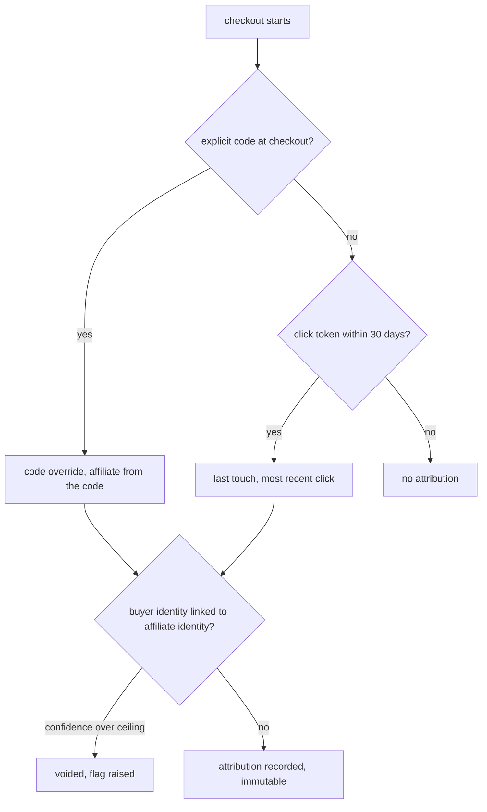
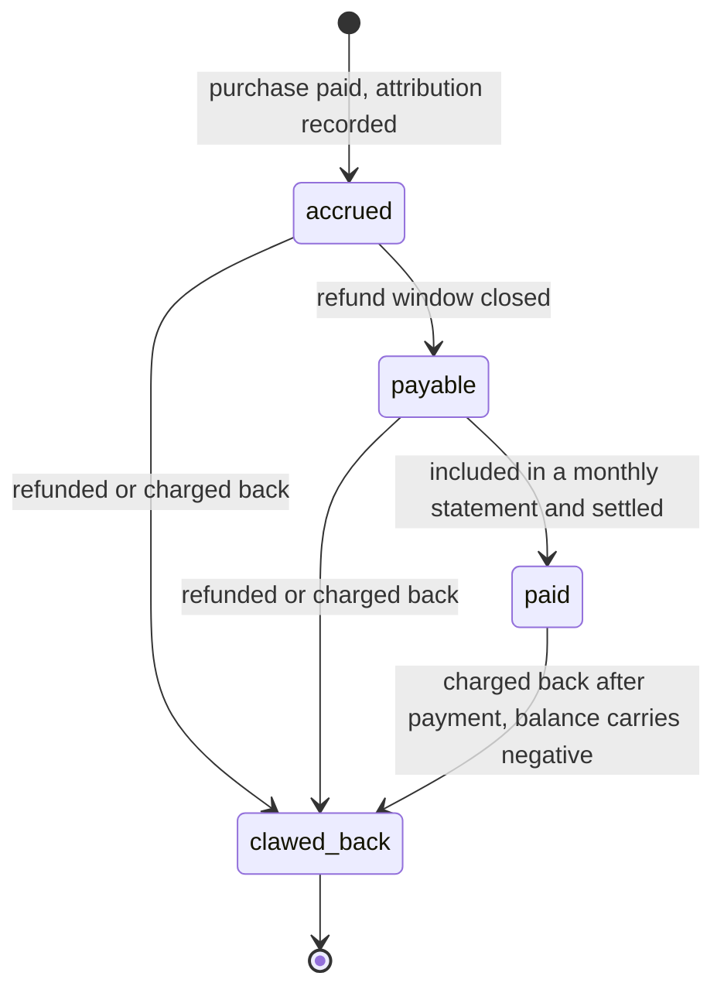
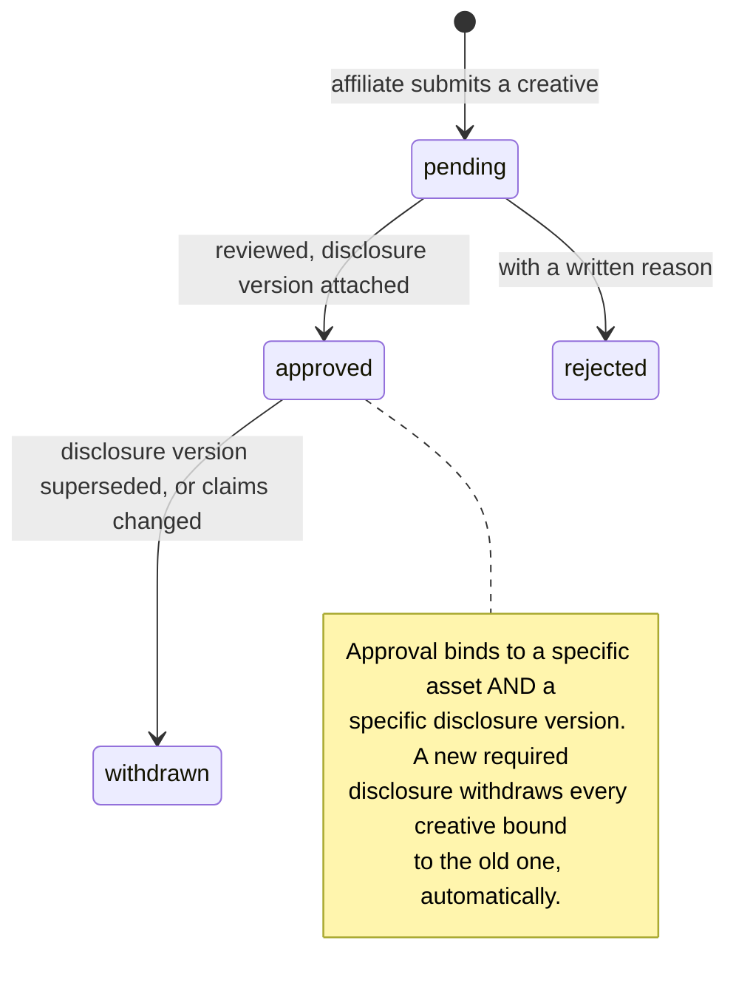

# M8: Affiliate System

Constitution section M8, Appendix A items 7 and 9, Appendix B4 item 16, Appendix B5 ten-section template.

Affiliates are the cheapest acquisition channel in this industry and the one with the most direct line to the firm's money: a commission is **cash out, paid on a sale that can still be reversed, to a party the firm does not control and whose public claims the firm is nonetheless answerable for.**

Two facts shape everything below. **Commission is the only outflow in Merit that is paid on a promise rather than on a settled fact**, because a purchase can charge back for months after the commission is payable. And **NFA I-26-12 makes a promoter's claims the firm's problem**, so creative approval is a compliance control rather than a brand preference.

**Amended and approved at the Wave 3 batch 1 gate (2026-08-14).** [ADR-017](../decisions/ADR-017.md) was accepted with one addition that lands here: **affiliate payout destinations carry the same 48 hour cooling window on change** as trader destinations (INV-M8-11). The one-rail rule this module argued for in AS-M8-05 is now a numbered ADR binding every module that ever pays anybody.

**Identifier conventions:** `INV-M8-nn` invariants, `SD-M8-nn` schema deltas, `FM-M8-nn` failure modes, `AS-M8-nn` adversarial scenarios, `OQ-M8-nn` open questions, `DEP-M8-nn` dependencies.

---

## 1. Purpose and invariants

### 1.1 What this module is

Codes, click and purchase attribution, the commission engine, monthly statements, the affiliate dashboard, and the compliance hooks. Payment rides [M5](M05-payout-system.md)'s rail and [M5](M05-payout-system.md)'s ledger; M8 computes what is owed and never moves money itself.

### 1.2 What this module is not

| Not M8 | Whose job | Why the boundary is here |
|---|---|---|
| Moving money | [M5](M05-payout-system.md) | M8 produces a statement and a ledger transaction request. The rail, the idempotency key, and the settlement webhook are M5's, so there is exactly one payment path in the system |
| Deciding a purchase is fraudulent | [M7](M07-risk-abuse.md) | M8 supplies attribution and chargeback-rate signals and consumes flags. It raises no flag of its own except the mechanical self-deal check |
| Pricing | [M3](M03-billing-checkout.md) | Commission is a share of **net** sale; the net comes from the purchase row |
| Discounting | [M3](M03-billing-checkout.md) | Affiliate codes link to coupons; the coupon rules, including [M03](M03-billing-checkout.md)'s SD-M3-04 purchase-kind restriction, belong there |
| Building sub-IB trees | nobody, in v1 | `affiliates.parent_id` and `level` are reserved and unused. Reserved is not built |

### 1.3 Invariants

| ID | Invariant | Enforcement |
|---|---|---|
| INV-M8-01 | One attribution per purchase, at most | Unique `attributions.purchase_id` (approved DATA_MODEL). Attribution is resolved once, at checkout, and never revisited |
| INV-M8-02 | Attribution resolves **code override first, then last-touch click within 30 days** | Deterministic order, recorded in `attributions.model`. An ambiguous rule is a rule two affiliates will both claim |
| INV-M8-03 | A self-purchase, or a purchase by an identity linked to the affiliate above the configured confidence, voids attribution and raises a flag | B4 #16, GS-045. The check runs at attribution time using [M7](M07-risk-abuse.md)'s resolver (AS-M8-06) |
| INV-M8-04 | Commission is computed on `amount_paid_cents`, never on list price | A commission on list price pays out more than the sale brought in whenever a coupon was used, which is a silent negative-margin sale |
| INV-M8-05 | Commission becomes `payable` only after the refund window closes, and becomes `paid` only in a statement | Approved DATA_MODEL `payable_after`. Section 3.2 adds the chargeback window, which is a different and longer clock (AS-M8-01) |
| INV-M8-06 | A reversed purchase always reverses its commission, including after payment | `clawed_back` status plus a carried negative balance (SD-M8-04). A firm that cannot claw back a commission has made chargeback fraud profitable for the referrer as well as the buyer |
| INV-M8-07 | An affiliate cannot be paid without a current, versioned ToS acceptance | `affiliates.tos_version_id` not null; a new version blocks payment until re-accepted. NFA I-26-12 |
| INV-M8-08 | Every published creative is approved, versioned, and carries the current required disclosure | SD-M8-03. `creative_approved` as a bare boolean is a control with nothing behind it (AS-M8-04) |
| INV-M8-09 | An affiliate statement is immutable once issued; corrections are new lines on the next statement | Approved DATA_MODEL. The same discipline as the ledger, for the same reason |
| INV-M8-10 | Affiliate payouts and trader payouts share one destination-concentration check | [M07](M07-risk-abuse.md) D-09 sees both. An affiliate destination that also receives trader payouts from unrelated identities is the same signal wearing a different hat (AS-M8-05) |
| INV-M8-11 | An affiliate destination change enters a **48 hour cooling window** with re-verification and notification to the contact already on file | [ADR-017](../decisions/ADR-017.md) as accepted. One rail is only one control if the destination-change path is also one control; an affiliate destination that could be repointed instantly would be the soft side of the same rail, and a compromised affiliate account would be the fast route to the same money. Identical mechanics to C-11, differing only in which screen initiates it. GS-140 |

---

## 2. Entities and schema deltas

M8 consumes [DATA_MODEL section 10](../architecture/data-model/README.md) as approved. Five deltas.

| ID | Table | Change | Why it is not optional |
|---|---|---|---|
| SD-M8-01 | `affiliate_commissions` | add `chargeback_window_ends_on date not null`, `clawback_of uuid null`, `paid_in_statement_id uuid null` | The approved model has `payable_after`, which encodes the **refund** window. Chargebacks arrive months later, on the card networks' clock rather than ours, so a single date conflates two different risks and pays commission long before the sale is final (AS-M8-01) |
| SD-M8-02 | `affiliate_clicks` | add `referrer_host text null`, `landing_is_direct boolean not null default false`, `click_fingerprint bytea null`, `suspicious_reason text null` | Last-touch attribution with a 30 day window is stealable by volume, and the theft is invisible without knowing where a click came from. These four fields are the difference between detecting cookie stuffing and paying for it (AS-M8-03) |
| SD-M8-03 | new `affiliate_creatives` | `id`, `affiliate_id`, `kind text check in ('landing','video','post','email','other')`, `url_or_ref`, `submitted_at`, `status check in ('pending','approved','rejected','withdrawn')`, `reviewed_by`, `reviewed_at`, `disclosure_version_id`, `notes` | INV-M8-08. `affiliates.creative_approved` is a boolean with no record of **what** was approved, which is worthless in a compliance conversation. NFA I-26-12 requires the disclosure to accompany the claim, and that is a per-creative fact (AS-M8-04) |
| SD-M8-04 | `affiliates` | add `balance_cents bigint not null default 0` and `negative_balance_since date null` | INV-M8-06. A clawback after payment has to land somewhere. Without a carried balance the only options are chasing a refund or writing it off, and an affiliate who learns that clawbacks are unenforceable is an affiliate with a business model |
| SD-M8-05 | `attributions` | add `buyer_identity_id uuid not null`, `affiliate_identity_id uuid not null`, `self_deal_link_confidence_bp int null` | INV-M8-03. The self-deal check must record **what it found**, not only its verdict, or an argument about a voided commission has no evidence on either side |

---

## 3. Attribution and the commission clock

### 3.1 Attribution, resolved once

Two properties are load bearing. **Resolution happens at checkout start**, in the same step that pins the plan version, so an affiliate cannot be added or changed after the buyer has seen a price. And **it happens once**: `attributions.purchase_id` is unique and nothing rewrites it. The rule that "last touch wins, unless a code was typed" needs to be published to affiliates verbatim, because the alternative is two affiliates each believing they earned the same sale, which is an argument with no factual resolution.

### 3.2 The two clocks, which is the change this plan makes

The approved model has one date, `payable_after`, set past the refund window. That is correct for refunds and wrong for chargebacks, and the difference is months.

| Clock | Length | What it protects against |
|---|---|---|
| Refund window | [M03](M03-billing-checkout.md) OQ-M3-02's answer, proposed 14 days or first trade | A buyer who changes their mind |
| Chargeback window | Card-network dependent, commonly up to 120 days | A stolen card, discovered when the real cardholder sees a statement |

**Commission is paid after the refund window and before the chargeback window closes.** That is a deliberate commercial choice: waiting 120 days to pay affiliates would make Merit uncompetitive as a partner, and no firm in this market does it. The consequence is accepted with three controls rather than pretended away (AS-M8-01): a carried negative balance (SD-M8-04), a per-affiliate reserve holdback (OQ-M8-01), and chargeback rate as a **payment gate** rather than only a metric.

### 3.3 Creative approval

That automatic withdrawal is the part worth building carefully. A disclosure requirement that changes and leaves a hundred approved creatives carrying the old text is a compliance gap that looks like a healthy control from the inside.

---

## 4. API endpoints touched

M8 owns [API_CONTRACT section 7](../architecture/API_CONTRACT.md)'s affiliate endpoints and adds one.

| Endpoint | M8's role | Notes |
|---|---|---|
| `GET /affiliate/stats` | Owns | Clicks, conversions, earned, payable, paid, and **clawed back**. The last one is shown by default, because an affiliate who discovers clawbacks only when a statement is short will assume they were cheated |
| `GET /affiliate/statements` | Owns | Immutable once issued |
| `POST /affiliate/links` | Owns | Issues a click token |
| `POST /affiliate/creatives` **NEW** | Owns | Submit for approval (SD-M8-03). Returns the current required disclosure text so the affiliate can attach it before submitting rather than after being rejected |
| `POST /checkout` | Consumes | Supplies `affiliate_click_token`; attribution resolves inside the checkout transaction |
| `GET /admin/flags` | Supplies | `affiliate_self_deal` flags |

---

## 5. Events emitted and consumed

Per [EVENTS section 9](../architecture/EVENTS.md), plus three NEW.

| Event | When | Notes |
|---|---|---|
| `affiliate.click_recorded`, `attribution.recorded`, `attribution.voided` | attribution | `voided` carries the reason and the link confidence (SD-M8-05) |
| `affiliate.commission_accrued`, `.payable`, `.paid` | commission clock | |
| `affiliate.statement_issued` | monthly | |
| `affiliate.commission_clawed_back` **NEW** | refund or chargeback | `{ affiliate_id, commission_id, purchase_id, amount_cents, cause, balance_after_cents }`. A clawback changes what an affiliate is owed and sometimes makes it negative, which is a fact both sides need on the record (AS-M8-01) |
| `affiliate.creative_status_changed` **NEW** | SD-M8-03 | `{ affiliate_id, creative_id, from_status, to_status, disclosure_version_id, reviewed_by }`. Compliance evidence has to be an event, not a column read at audit time (AS-M8-04) |
| `affiliate.suspicious_click_pattern` **NEW** | cookie-stuffing detection | `{ affiliate_id, window, click_count, direct_landing_share, distinct_referrers, conversion_rate_bp }`. Consumers: RISK, ALERT, FEED (AS-M8-03) |

**Consumed:** `purchase.paid` (accrue), `purchase.refunded` and `purchase.charged_back` (claw back, and update `chargeback_rate_bp`), `identity.merged` (a merge can retroactively make a past attribution a self-deal, see FM-M8-06), and `flag.status_changed` (an enforced affiliate stops being paid).

---

## 6. Failure modes

| ID | Failure | Blast radius | Detection | Recovery |
|---|---|---|---|---|
| FM-M8-01 | Commission paid on a purchase that later charges back | Cash out on a sale that produced negative revenue, plus a chargeback fee | Chargeback webhook against paid commissions | Clawback to a carried negative balance (SD-M8-04), netted against future commission. Escalate above a threshold (AS-M8-01) |
| FM-M8-02 | Commission computed on list price | Silent negative margin on every discounted sale | INV-M8-04, unit tested against a coupon fixture | Compute from `amount_paid_cents`, always |
| FM-M8-03 | Two affiliates claim one sale | An argument with no factual resolution, and a partner relationship damaged either way | INV-M8-01 and INV-M8-02: one attribution, deterministic order, published | The published rule is the answer. Ambiguity is the failure, not the outcome |
| FM-M8-04 | Cookie stuffing hijacks organic conversions | Merit pays commission on sales it already had | SD-M8-02's click provenance, and the conversion-rate outlier signal | Void the attributions, flag, suspend (AS-M8-03) |
| FM-M8-05 | An affiliate publishes a non-compliant claim | Regulatory exposure under NFA I-26-12, and the claim is quoted back at Merit by traders it misled | Creative approval with disclosure versioning (SD-M8-03), plus periodic re-checks of live URLs | Withdraw approval, require takedown, suspend. Approval is per asset and per disclosure version (AS-M8-04) |
| FM-M8-06 | An identity merge makes a past attribution a self-deal | Commission already paid on a sale that was never arm's length | `identity.merged` re-runs the self-deal check over that affiliate's attributions | **Not retroactively enforced against the buyer** (INV-M7-06's grandfather principle), but commission on affected purchases is clawed back and flagged. The two are different questions and get different answers |
| FM-M8-07 | An affiliate is also a trader and shares a payout destination with unrelated identities | A mule structure with a commission cover story | [M07](M07-risk-abuse.md) D-09 sees both payout types (INV-M8-10) | Flag, freeze the affiliate statement, investigate (AS-M8-05) |
| FM-M8-08 | A statement is issued with a wrong number | Immutable, so it cannot be edited | Reconciliation of statement totals against commission rows before issue | Correct on the **next** statement as a named line. Never edit an issued statement (INV-M8-09) |
| FM-M8-09 | An affiliate ToS version changes and payments continue on the old acceptance | The compliance basis of every payment is stale | INV-M8-07 blocks payment until re-acceptance | Re-acceptance flow, with the statement held rather than the commission voided |

---

## 7. Adversarial scenarios

**Six listed, five novel.** The one marked "extends" takes B4 #16 past the case it covers.

### AS-M8-01: The commission that outruns the chargeback (NOVEL)

**Attack.** Commission is payable after the refund window (days) and chargebacks arrive on the card networks' clock (up to about 120 days). An adversary buys evaluations with stolen cards through their own affiliate code, collects commission in the next monthly statement, and is gone long before the cardholders notice. **Merit pays out real money on purchases that were never real**, and then pays chargeback fees on the same purchases.

**Numbers.** At a $99 evaluation and a 30 percent commission, each stolen-card purchase yields about $30 in clean cash, and Merit later loses the $99, a chargeback fee of roughly $15 to $25, and the commission. Net loss per fraudulent purchase is comfortably above the purchase price. A hundred purchases is a five-figure loss and, worse, a chargeback ratio spike that threatens the processor relationship, which constitution 0 names as a firm-death risk.

**Why it is more attractive than plain card fraud.** Ordinary stolen-card evaluation purchasing yields an account the fraudster still has to trade. This variant converts the stolen card **directly into cash** through Merit's own affiliate rail, with no trading at all.

**Counter, three parts, because paying affiliates in 120 days is not commercially available.**
1. **A carried negative balance** (SD-M8-04). Clawback always lands, netted against future commission, and an affiliate whose balance is negative is not paid. This alone only works on affiliates who expect to keep earning.
2. **A per-affiliate reserve holdback** (OQ-M8-01): a share of each statement is retained until the chargeback window closes on the underlying purchases. Proposed 20 percent for the first 90 days of an affiliate relationship, falling to zero once a chargeback history exists. New affiliates carry the risk they introduce.
3. **Chargeback rate as a payment gate, not only a metric.** `affiliates.chargeback_rate_bp` above a threshold **holds the statement** pending review rather than merely appearing on a dashboard. This is the control that catches the attack in its first month rather than its fourth.

GS-123.

### AS-M8-02: The affiliate who recruits their own fleet (NOVEL)

**Attack.** The dossier's item 3 (paid passing services) and item 6 (identity fleets) meet the affiliate program. An operator becomes an affiliate, recruits "traders" who are their own synthetic or family identities, and earns commission on every evaluation those identities buy. Even ignoring any trading outcome, the operator recovers a share of every fee they pay, which **lowers the effective cost of running a fleet by the commission rate.** A 30 percent commission means a fleet operator buys evaluations at a 30 percent discount that no coupon rule limits and no per-identity cap sees.

**Why the existing controls miss it.** The self-deal check (B4 #16) tests whether the **buyer** is the affiliate. Here the buyers are different identities, deliberately, and if entity resolution has not linked them, every attribution looks clean.

**Counter.** Not a new rule; a change in what the existing signals are joined on.
- **Affiliate identity is a first-class node in [M7](M07-risk-abuse.md)'s graph** (SD-M8-05 records both identities on every attribution). The cluster query that finds a fleet already exists; it simply has to include the referrer edge.
- **A concentration signal**: an affiliate whose referred buyers cluster on shared devices, payment fingerprints, or ASNs at a rate far above the population is a flag, and it is the same D-01 through D-08 machinery with a different grouping key.
- **Commission is not paid on purchases by identities linked to the affiliate above the confidence ceiling**, which is INV-M8-03 already, extended from "the buyer is the affiliate" to "the buyer is linked to the affiliate". The confidence ceiling is what keeps this from voiding a genuine referral to a family member, which is a real and legitimate case.

**Honest residual.** An operator with clean separation (distinct devices, distinct cards, distinct verified humans) is indistinguishable from a genuinely successful affiliate, and should be, because at that point they may simply be one. The bound is the same as everywhere else: caps, ladder, reserve. GS-124.

### AS-M8-03: Cookie stuffing and organic theft (NOVEL)

**Attack.** Last-touch attribution with a 30 day window is stealable by **volume**. An affiliate embeds invisible click-throughs in unrelated traffic (an iframe, a redirect chain, a browser extension), so anyone who later buys through search or word of mouth carries their click token. Merit pays commission on conversions it already had, and the affiliate's numbers look excellent because their conversion rate is the site's organic rate.

**Numbers.** The fingerprint is arithmetic: a legitimate affiliate converts a few percent of clicks; a stuffer converts a tiny fraction of a percent while capturing a large share of total conversions. Stuffing ten thousand tokens a day costs nothing and, at a 30 percent commission on $99, each hijacked organic sale is a $30 transfer from Merit to a party that contributed nothing.

**Counter.** SD-M8-02 makes the pattern visible, which it is not today.
- Record `referrer_host` and whether the landing was direct. Stuffed clicks come from hosts unrelated to the affiliate's declared properties, or from none at all.
- A per-affiliate weekly signal on the ratio of clicks to conversions against the population, plus distinct referrer count. `affiliate.suspicious_click_pattern` routes to [M7](M07-risk-abuse.md) rather than auto-suspending, because the honest and dishonest cases can look alike in one week's data.
- **A shorter window would be the obvious fix and is the wrong one.** A 30 day cookie is the industry norm and cutting it punishes legitimate content affiliates whose readers take weeks to decide. Detect the pattern; do not degrade the product for everyone.
- Declared properties per affiliate (part of SD-M8-03's creative record) give the referrer check something to compare against.

GS-125.

### AS-M8-04: The promoter's claim the firm has to answer for (NOVEL)

**Attack.** An affiliate publishes "guaranteed payouts at Merit" or fabricated earnings screenshots, or omits the simulated-environment disclosure. Under NFA I-26-12 the promoter's claims are the firm's compliance problem, and separately they are Merit's brand problem: a trader who arrived believing a guarantee and then meets a real rule will say Merit lied, and from their side that is true.

**Why the existing control does not work.** `affiliates.creative_approved` is a boolean on the affiliate. It records that **something** was once approved, not what, not when, and not against which disclosure text. It cannot answer the only question a compliance conversation asks, which is what exactly was approved and does it still comply.

**Counter.** SD-M8-03 makes approval per asset and per disclosure version, with a reviewer and a timestamp.
- **A new required disclosure automatically withdraws every creative bound to the superseded version**, so a disclosure change cannot leave a field of stale approved assets.
- **Live re-checks**: approved URLs are re-fetched periodically and a changed page reverts to `pending`. Approving a landing page that is later edited is otherwise the easiest bypass in the system.
- **The affiliate ToS carries the specific prohibited claim classes** (guarantees, fabricated results, omission of the simulated-environment disclosure, implied employment or partnership with Merit), enumerated rather than gestured at, because "misleading" is not a standard anyone can comply with.
- **Enforcement is graduated and published**: withdrawal, then suspension, then termination with unpaid commission forfeit per the ToS. Graduated and stated is what makes the first enforcement defensible.

GS-126.

### AS-M8-05: The affiliate rail as a mule channel (NOVEL)

**Attack.** Affiliate commissions are paid through the same settlement rail as trader payouts. An operator registers as an affiliate, points the affiliate destination at the same account that receives trader payouts for several "unrelated" traders, and now has a payment channel with a **commercial cover story**: money arriving as commission looks like a partnership, not a payout, and nobody reconciles the two categories against each other.

**Why it nearly works.** The two payment types are computed by different modules, appear on different screens, and are reviewed by different mental models. [M07](M07-risk-abuse.md)'s D-09 destination-concentration detector was specified against `payout_transfers`, and an affiliate statement paid on the same rail could easily sit outside its query.

**Counter.** INV-M8-10: **affiliate payments and trader payouts share one destination-concentration check.** D-09's input is every outbound destination regardless of which module produced it. Concretely that means affiliate payments post through [M5](M05-payout-system.md)'s transfer machinery rather than a parallel one, which is also why section 1.2 puts money movement outside this module in the first place. One rail, one destination table, one detector.

The design rule this generalizes to, worth carrying into M9 through M19: **every outbound payment path in Merit is the same path.** A second one is not an efficiency, it is a blind spot with a schedule. **Accepted at the batch 1 gate as [ADR-017](../decisions/ADR-017.md)**, which promotes this from a rule this module argued for to one binding on every module that ever pays anybody.

**The ADR added the half this scenario missed.** One rail with one destination table is only genuinely one control if the **destination-change** path is also one control. This scenario defended against a shared destination and said nothing about how quickly an affiliate destination could be pointed somewhere new. Affiliate destination changes therefore carry the same 48 hour cooling window, re-verification, and notification as trader destination changes (INV-M8-11). Without it, an attacker who compromised an affiliate account would find an instant route to money that the trader-side path deliberately makes slow, and the concentration detector would see the theft only after it settled. GS-127, GS-140.

### AS-M8-06: Self-deal through a straw buyer (extends B4 #16)

**Attack.** B4 #16 covers an affiliate buying through their own code, which is a one-line check. The extension is a friend, a second email, or a family member buying instead. The affiliate takes a commission on a sale they effectively made to themselves, and if the discount plus commission approaches the purchase price, the evaluation is nearly free.

**Counter.** INV-M8-03 is written against the **resolved identity link**, not against equality: attribution voids when the buyer identity is linked to the affiliate identity above a confidence ceiling, using [M07](M07-risk-abuse.md)'s graph. SD-M8-05 records the confidence found, so a voided commission has evidence on both sides of the argument.

**The ceiling is where the judgment lives**, and it is [M07 AS-M7-04](M07-risk-abuse.md)'s problem in a different costume: set it too low and a genuine referral to a spouse is voided, which is a real and common case in this market; set it too high and the straw buyer walks through. Recommendation: **void at the hard-merge tier only** (biometric match or an admin merge), and **flag without voiding** at the soft-link tier, so the money question and the investigation question are answered separately. GS-045 covers the direct case; the linked case is asserted alongside it.

---

## 8. Test plan

| Suite | Prefix | Count | Runs | Blocks |
|---|---|---|---|---|
| Attribution resolution (override, last touch, expiry, none) | `M8-A-nn` | 10 | every commit | merge |
| Commission arithmetic including coupons and the two clocks | `M8-C-nn` | 12 | every commit | merge |
| Clawback and negative balance | `M8-B-nn` | 7 | every commit | merge |
| Statement immutability and correction-by-next-statement | `M8-S-nn` | 5 | every commit | merge |
| Compliance: creative lifecycle and disclosure supersession | `M8-K-nn` | 6 | every commit | merge |
| Negative authz (an affiliate reads only their own data) | `M8-N-nn` | 5 | every commit | merge |
| Golden fixtures | `GS-nnn` | 5 owned (GS-123 to GS-127), plus GS-045 shared | every commit | merge |

### 8.1 Named scenarios owned by this module

| ID | Scenario | Pins |
|---|---|---|
| GS-123 | Chargeback lands after the commission was paid | Clawback posts, the affiliate balance goes negative and is netted against future commission, and a chargeback rate above the threshold holds the next statement pending review rather than merely appearing on a dashboard. AS-M8-01 |
| GS-124 | An affiliate's referred buyers cluster on shared signals | The concentration flag fires, commission on linked-identity purchases is withheld above the confidence ceiling, and a genuine family referral below the ceiling is not voided. AS-M8-02 |
| GS-125 | Ten thousand clicks with a near-zero conversion rate | `affiliate.suspicious_click_pattern` fires on the clicks-to-conversions ratio and the distinct-referrer count, routes to the risk queue, and does **not** auto-suspend. The 30 day window is unchanged. AS-M8-03 |
| GS-126 | A required disclosure version is superseded | Every creative bound to the old version is withdrawn automatically, and an approved landing page whose content later changes reverts to `pending` on re-check. AS-M8-04 |
| GS-127 | An affiliate destination also receives trader payouts from unrelated identities | The shared destination-concentration detector fires across both payment types, because affiliate payments ride the same transfer machinery. AS-M8-05 |

---

## 9. Observability

| Metric | Why it matters |
|---|---|
| `affiliate.conversion_rate` per affiliate against the population | AS-M8-03's primary signal |
| `affiliate.clicks_per_conversion` and distinct referrer hosts | The other half of the same signal |
| `affiliate.chargeback_rate_bp` per affiliate | AS-M8-01, and a payment gate rather than only a chart |
| `affiliate.clawback_cents` and count, and affiliates carrying a negative balance | The realized cost of paying before the chargeback window closes |
| `affiliate.commission_cents` against `purchase.net_cents` per plan | Effective acquisition cost, and the number that says whether the channel works |
| `affiliate.creatives_pending` and oldest age | A compliance queue nobody works is a compliance gap |
| `affiliate.buyer_signal_concentration` per affiliate | AS-M8-02 |
| Attribution mix: code override versus last touch versus none | A shift toward last touch with flat code use is what cookie stuffing looks like in aggregate |

**Alerts:** chargeback rate above the payment-gate threshold (holds the statement); suspicious click pattern; a creative pending beyond its SLA; any affiliate destination appearing in the shared concentration check; and any statement whose total does not reconcile against its commission rows, which blocks issue rather than warning after.

---

## 10. Open questions for the founder

**OQ-M8-01. Reserve holdback on new affiliates.** Proposed: retain 20 percent of each statement until the chargeback window closes on the underlying purchases, for the first 90 days of an affiliate relationship, falling to zero thereafter. It makes new affiliates carry the risk they introduce, which is where the risk actually is (AS-M8-01), and it is standard practice in high-risk affiliate programs, so it is explicable to partners. It also makes Merit slightly less attractive than a competitor paying in full immediately. This is a commercial judgment. *Market corroboration (Wave 1 amendment, 2026-08-14): the Axcera Futures Solution brochure (February 2026, primary source; [PROP_TECH_LANDSCAPE section 1.2](../../research/PROP_TECH_LANDSCAPE.md)) ships affiliate commission vesting/holds as a standard feature, so a holdback is explicable to partners as prevailing vendor practice, not a Merit-only friction.*

**OQ-M8-02. The commission rate, and whether it varies by plan.** The constitution says "% of net sale" without fixing it. A flat rate is simple and explicable. A rate that varies by plan lets Merit steer acquisition toward the plans whose economics it prefers, and immediately creates an incentive for affiliates to push a trader onto a plan that suits the affiliate rather than the trader. Recommendation: **flat across plans in v1.** Steering acquisition through commission is a lever that is hard to un-pull once partners have built around it.

**OQ-M8-03. Do affiliates see per-trader outcomes?** They will ask, because knowing which referrals passed is genuinely useful to a content affiliate. It is also a privacy exposure and a ring-coordination tool: an affiliate who can see which of their referrals reached funded status can time a coordinated request wave. Recommendation: **aggregate only**, no per-trader outcomes, no names, no timing. This should be decided before the dashboard is built rather than removed after affiliates have relied on it.

**OQ-M8-04. What happens to unpaid commission on termination for cause?** The affiliate ToS needs to say, in advance. Forfeiting everything is standard and defensible when the cause is fraud; applying it to a disclosure breach is disproportionate and will be argued publicly. Recommendation: **graduated, matching the enforcement ladder**: forfeit on fraud or self-deal, pay out earned commission on a compliance termination, with both stated in the ToS before the first affiliate signs.

---

### Dependencies on other modules

| ID | Dependency | Owner | Consequence if unmet |
|---|---|---|---|
| DEP-M8-01 | M7 resolves buyer and affiliate identities synchronously at checkout | M7 | INV-M8-03 degrades to an email comparison, and AS-M8-06 walks through |
| DEP-M8-02 | M5 owns the transfer rail; affiliate payments use it rather than a second path | M5 | AS-M8-05 becomes a blind spot with a schedule |
| DEP-M8-03 | M3 supplies `amount_paid_cents` and both dispute webhooks | M3 | Commission is computed on the wrong base, and clawbacks never fire |
| DEP-M8-04 | Legal supplies the affiliate ToS, the required disclosure text, and the prohibited-claim classes | Wave 4 legal | INV-M8-07 and INV-M8-08 have nothing to enforce, and NFA I-26-12 exposure is unmanaged |
| DEP-M8-05 | M7's D-09 accepts affiliate destinations as input | M7 | INV-M8-10 is unenforced |
