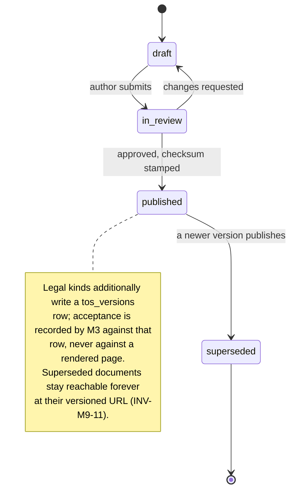
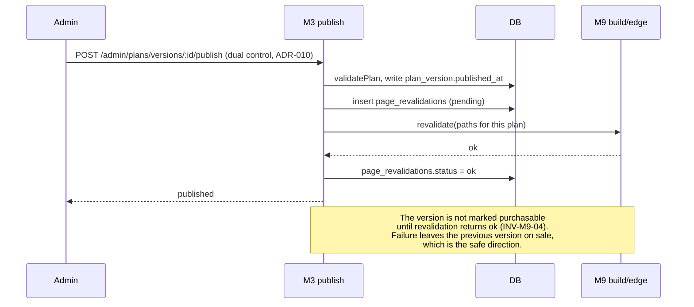
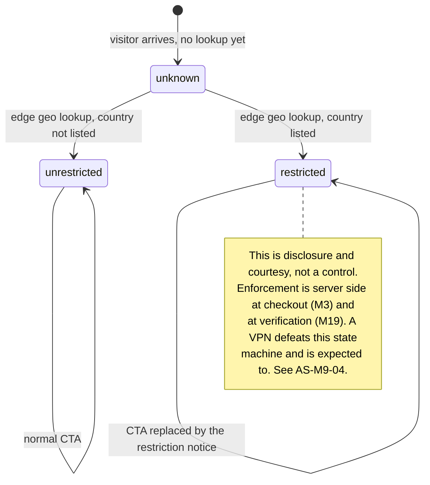

# M9: Marketing Site and Content

Constitution section M9, Appendix B5 ten-section template, Appendix F (design and prose), and the [parameter-status ruling](../DECISIONS.md#parameter-status-launch-candidates-versus-structural-rulings-founder-ruling-2026-08-14). Non-money path under the [ADR-003](../DECISIONS.md) permissive regime, with one exception noted in 1.3 that is not permissive at all.

One sentence governs this module: **the marketing site is a rendering of the configuration the engine executes, and every place it stops being that is a place where a promise and a rule can disagree.**

Constitution 0.5 names the marketing-versus-implementation gap as a founding hazard, and this is the module where that gap physically lives. Everywhere else in Merit the risk is a bug. Here the risk is a sentence: prose that was true when it was written, about a number that has since moved.

**Identifier conventions:** `INV-M9-nn` invariants, `SD-M9-nn` schema deltas, `PG-M9-nn` page surfaces, `FM-M9-nn` failure modes, `AS-M9-nn` adversarial scenarios, `OQ-M9-nn` open questions, `DEP-M9-nn` dependencies.

---

## 1. Purpose and invariants

### 1.1 What this module is

The public surface: home, plans and pricing, per-plan rules pages, FAQ, the [published stats page](M12-transparency-platform.md), blog and content, legal pages, and the geo-restriction notice. A fast statically generated Next.js application, served from the edge, holding no session and reading no trader data.

Three of those surfaces are unlike the rest and deserve naming up front, because they are the ones that carry risk:

| Surface | Why it is different |
|---|---|
| **Plans and pricing** (PG-M9-02) | Every number on it is a config value with a live consequence at checkout. A stale render is a price Merit will not honor |
| **Rules pages** (PG-M9-03) | The published `copy_blocks` are the contract a trader will be enforced against. This page is the implementation, not a description of it |
| **Stats** (PG-M9-05) | Owned and computed by [M12](M12-transparency-platform.md), rendered here. A number Merit publishes about its own honesty is the one number a mistake on is unforgivable |

### 1.2 What this module is not

| Not M9 | Whose job | Why the boundary is here |
|---|---|---|
| Computing any statistic | [M12](M12-transparency-platform.md) | M9 renders what M12 publishes. A marketing site that computes its own pass rate is a second implementation of the firm's most scrutinized number |
| Deciding plan parameters | [M1](M01-rules-engine.md) and plan config | M9 reads `plan_versions`. It contains no threshold, no price, and no rule text of its own |
| Taking money | [M3](M03-billing-checkout.md) | The site links to checkout. Nothing on the marketing origin touches a PSP |
| Enforcing geo restriction | [M3](M03-billing-checkout.md) at checkout, [M19](M19-kyc-identity.md) at verification | M9 **discloses** the restricted list and suppresses the call to action. Enforcement is server side and elsewhere (AS-M9-04) |
| Authenticating anyone | [M4](M04-trader-portal.md) | The marketing origin has no session cookie and no authenticated route. That is a security property, not an omission |
| Drafting legal text | [legal/](../legal/README.md) and counsel | M9 renders versioned legal documents and records nothing about acceptance. Acceptance is [M3](M03-billing-checkout.md)'s, against `tos_versions` |

### 1.3 Invariants

| ID | Invariant | Enforcement |
|---|---|---|
| INV-M9-01 | No plan parameter, price, cap, split, gap, win-day count, or ladder length is ever a literal in this codebase | Build-time lint (VG-M9-1): a numeric literal inside a plan, pricing, or rules component fails the build. Every such value arrives from `plan_versions` or `plan_version_sizes`. [Parameter-status ruling](../DECISIONS.md#parameter-status-launch-candidates-versus-structural-rulings-founder-ruling-2026-08-14) |
| INV-M9-02 | Rule text on a public page is the pinned `copy_blocks` of the plan version being displayed, verbatim | The rules page has no prose of its own. The plain-English explainer **is** the `copy_blocks` content, authored with the plan version and published with it, so the marketing sentence and the executed rule change in the same commit and the same publish action |
| INV-M9-03 | Every published page states the plan version it renders and the moment it was built | Version label plus `built_at` in the page footer and in the JSON-LD. A public page that cannot say which version it describes is unciteable, and it will be cited (AS-M9-07) |
| INV-M9-04 | A plan version publish invalidates every page derived from it, before the version is purchasable | The publish action ([M03](M03-billing-checkout.md), `POST /admin/plans/versions/:id/publish`) is not complete until revalidation returns. Ordering is the control, not a cache TTL (AS-M9-01, INV-M9-11) |
| INV-M9-05 | The simulated-environment disclosure appears in the footer of every page, in checkout, in the ToS, and on every certificate | Constitution section 6 and Appendix F. A layout-level component, so a new page cannot omit it by being new |
| INV-M9-06 | No number on the stats page is computed here | The page fetches M12's published aggregate and renders it with its window and as-of date attached. There is no arithmetic in this module (AS-M9-03) |
| INV-M9-07 | Content pages (blog, FAQ) may not state a plan parameter in prose | Build-time lint (VG-M9-2) over MDX: a currency figure, a percentage, or a day count in content prose fails the build unless it is emitted by the `<PlanValue>` component, which reads config. This is the single most important control in the module and the one most likely to be argued with (AS-M9-02) |
| INV-M9-08 | The published cadence for **Merit Rapid is about 3 trading days**, and the copy attributes it to the **win-day gate**, never to the 1 day cadence gap | [ADR-018](../DECISIONS.md), [EC-049](../EDGE_CASES.md). A dominated gate may not be published as the reason a plan is fast, and may not be published as a protection at all |
| INV-M9-09 | Marketing prose never claims a payout timing the wallet does not deliver | [ADR-019](../DECISIONS.md). The internal leg is same day to the Merit Wallet; the external leg is 2 to 3 business days. Both are stated, and the second is never omitted to make the first read better (AS-M9-06) |
| INV-M9-10 | The marketing origin holds no session, no trader data, and no write path | [SECURITY](../architecture/SECURITY.md) C-08's separation logic applied downward: the most-attacked and least-privileged surface in the estate is also the one with nothing to steal |
| INV-M9-11 | A page rendering a **superseded** plan version is reachable, labeled, and never the default | Permanent per-version URLs. A trader pinned to v1 must be able to read v1's public page, and a stranger must never land on it by accident (AS-M9-07) |

---

## 2. Entities and schema deltas

M9 is overwhelmingly a consumer. It reads `plans`, `plan_versions`, `plan_version_sizes`, `tos_versions`, and `geo_restrictions` as approved in [DATA_MODEL](../architecture/DATA_MODEL.md), and M12's published aggregate. Three deltas.

| ID | Table | Change | Why it is not optional |
|---|---|---|---|
| SD-M9-01 | `plan_versions` | add `public_slug text not null` and `public_visible boolean not null default false` | A plan version needs a stable, permanent public URL that survives being superseded (INV-M9-11), and a version can exist as published-for-engine while not yet being the one on sale. Deriving the URL from the version number instead would make the archive URL change whenever numbering does, which breaks exactly the links AS-M9-07 depends on |
| SD-M9-02 | new `content_documents` | `id`, `kind check in ('page','post','faq','legal')`, `slug`, `locale`, `title`, `body_mdx`, `version integer`, `published_at`, `superseded_by uuid null`, `author`, `checksum bytea` | Legal pages are **versioned documents with acceptance consequences**, and the constitution requires ToS, Privacy, and Risk Disclosure to be versioned. Once legal pages need version history, giving blog posts a different storage mechanism means two content systems and one of them without an audit trail. `checksum` is what makes "the page a trader accepted" a provable artifact rather than a git blame |
| SD-M9-03 | new `page_revalidations` | `id`, `trigger text`, `reference_id uuid`, `paths text[]`, `requested_at`, `completed_at null`, `status check in ('pending','ok','failed')` | INV-M9-04 makes revalidation part of the publish transaction's definition of done. An invalidation that is fire-and-forget is a cache that is usually right, and "usually right" on a price page is AS-M9-01 |

**One thing deliberately not modelled: no analytics or visitor table.** Traffic analytics live with the vendor ([M10](M10-integrations.md)); nothing about a visitor is written to Merit's database from the marketing origin. That keeps INV-M9-10 true by construction rather than by policy.

---

## 3. State machines

### 3.1 Content document lifecycle

**Superseding never deletes.** A legal document a trader accepted in March must be readable in 2031 exactly as it was, because [SECURITY](../architecture/SECURITY.md) records acceptance with a version and this module is where that version resolves to words. The same rule is applied to blog content for a smaller reason that still matters: a post quoted by a community member should not be able to change under the quote.

### 3.2 Publish and revalidation, which is an ordering problem

The dangerous half of this module is not rendering. It is the window between a plan version becoming purchasable and the public page saying so.

**The ordering is the control and it runs in the direction that costs Merit rather than the trader.** If revalidation fails, the new version does not go on sale and the old one keeps selling. The alternative ordering, in which the new version sells while the site still advertises the old one, produces a checkout that contradicts the page that led to it, which is [B4 #12](../../MERIT_BUILD_MASTER_PROMPT.md) with the marketing site added to it and is materially worse than a delayed launch.

### 3.3 Geo disclosure, which is not geo enforcement

---

## 4. API endpoints touched

M9 owns no authenticated endpoint. It consumes the public catalog and one internal hook.

| Endpoint | M9's role | Notes |
|---|---|---|
| `GET /plans` | Consumes | Public, cached. Returns the currently sellable versions with their materialized sizes ([API_CONTRACT section 4](../architecture/API_CONTRACT.md)) |
| `GET /plans/:planId/versions/:version` | Consumes | The rules JSON **and** `copy_blocks`. The same object marketing renders and the engine executes, which is the constitution's own phrasing and the reason the endpoint exists |
| `GET /public/stats` **NEW** | Consumes | [M12](M12-transparency-platform.md)'s published aggregate: values, trailing window, as-of trading day, and method reference. M9 renders and never computes (INV-M9-06) |
| `POST /internal/revalidate` **NEW** | Owns | Called by the publish action and by content publishing. Admin origin and service credential only, path allowlisted, never reachable from the public internet. Writes `page_revalidations` (SD-M9-03) |
| `GET /public/content/:kind/:slug` **NEW** | Owns | Versioned content retrieval for build and for permanent archive URLs. Public and cacheable |

**Two endpoints deliberately absent.** There is no newsletter subscribe endpoint on this origin (it posts directly to [M10](M10-integrations.md)'s provider, so no visitor record enters Merit's database), and there is no contact form (support is [M10](M10-integrations.md)'s Chatwoot widget). Each absence removes an unauthenticated write path from the most exposed origin in the estate.

---

## 5. Events emitted and consumed

M9 is a leaf. It emits little and consumes the catalog.

| Event | When | Notes |
|---|---|---|
| `content.published` **NEW** | a content document publishes | `{ document_id, kind, slug, version, checksum, author }`. Legal kinds also produce a `tos_versions` row. Consumers: FEED, BI |
| `site.revalidation_failed` **NEW** | revalidation returns non-ok or times out | `{ trigger, reference_id, paths, error }`. **Blocks the plan version from becoming purchasable** (INV-M9-04) and pages if the trigger was a plan publish. Consumers: ALERT, FEED |
| `site.stats_stale` **NEW** | the rendered stats payload is older than its freshness budget | `{ as_of_trading_day, age_hours, budget_hours }`. Consumers: ALERT, FEED. See AS-M9-03 |

**Consumed:** `plan.version_published` (triggers revalidation), `stats.published` ([M12](M12-transparency-platform.md), triggers the stats page rebuild), and `tos.version_published`.

---

## 6. Failure modes

| ID | Failure | Blast radius | Detection | Recovery |
|---|---|---|---|---|
| FM-M9-01 | Static page serves a stale price or cap after a publish | A trader is quoted a price checkout will not honor. Under a transparency brand this is not a bug, it is the accusation | `page_revalidations` status, plus a synthetic check comparing rendered values against `GET /plans` | Ordering prevents it (INV-M9-04). If it happens anyway, **honor the published price for anyone who reached checkout from the stale page** and record the cost. AS-M9-01 |
| FM-M9-02 | Blog or FAQ prose contradicts current config | The most quotable surface on the site is also the least controlled one | VG-M9-2 build lint (INV-M9-07), plus a quarterly content audit against config | Fix and republish. The lint is the real answer; the audit exists for prose that predates the lint. AS-M9-02 |
| FM-M9-03 | Stats page renders a stale or partial aggregate | Merit publishes a wrong number about its own honesty | `site.stats_stale`, plus M12's own freshness contract | **Render the last good value with its as-of date, or render nothing with an explanation. Never render a number without its window.** AS-M9-03 |
| FM-M9-04 | Edge geo lookup unavailable | The restriction notice does not appear | Edge health, and the synthetic check from a restricted-country probe | **Fail open on the notice and closed at checkout.** The notice is courtesy; the control is server side and unaffected. AS-M9-04 |
| FM-M9-05 | Build fails after a plan publish | The site is stale for the length of the outage | Build pipeline alarm, plus `site.revalidation_failed` | The previous build keeps serving, and the new version does not go on sale. Static hosting degrades to "correct but old", which is the right degradation |
| FM-M9-06 | Legal page superseded while a checkout is open | A trader accepts a version they did not read | `tos_versions` is pinned into the checkout session at open ([M3](M03-billing-checkout.md)), exactly as the plan version is (B4 #12) | The pinned version wins. The mechanism already exists for prices and is reused rather than reinvented |
| FM-M9-07 | A superseded plan version's URL 404s | Every link a trader, an affiliate, or a reviewer ever shared to that plan breaks | Link check over `plan_versions.public_slug` in CI | Permanent per-version URLs (SD-M9-01, INV-M9-11). A 404 on a rules page a trader was enforced against is an evidentiary problem as well as a marketing one |
| FM-M9-08 | CDN cache poisoning or an unsanctioned edge rewrite | The public face of a financial product serves attacker content | Subresource integrity, immutable deploys, and a synthetic content check against the build checksum | Strict CSP, no third-party script on the pricing or rules routes, and the build digest asserted post-deploy. [SECURITY](../architecture/SECURITY.md) C-14 and INFRA |

---

## 7. Adversarial scenarios

**Seven listed, six novel.** The one marked "extends" takes a B4 item into the surface it did not previously cover.

### AS-M9-01: The cache that quotes a price the firm will not honor (NOVEL, extends B4 #12)

**Attack.** Not initially an attacker. B4 #12 pins that a buyer whose checkout was open on v1 gets v1. It says nothing about the **marketing site**, which is statically generated and served from an edge cache with its own lifetime. A plan version publishes with a higher price or a lower cap. The pricing page is regenerated on a schedule, or on an invalidation that silently failed, so for some window the public page advertises v1 while checkout sells v2.

**Why it becomes an attack.** The window is discoverable and repeatable. Publishes are visible from the outside: the rules page changes, the plan version label changes, and the community that reads rulebooks forensically ([dossier item 5](../../research/ADVERSARY_DOSSIER.md)) watches for exactly this. Anyone who notices the lag can screenshot the favorable page and buy into the unfavorable one, then demand the advertised terms with evidence. The screenshot is genuine, which is what makes it work: Merit really did publish that page at that moment, and a firm whose entire brand is "the rules do not surprise you" has no good answer that is not "honor it".

**Numbers.** A cap difference of 50,000c on a 50K plan, applied to a launch-day cohort of a few hundred accounts, is a liability delta measured in tens of thousands of dollars. The reputational number is worse and is unbounded.

**Counter, and the shape of it is ordering rather than freshness.**
1. **Revalidation is part of the publish transaction's definition of done** (INV-M9-04). The version does not become purchasable until every derived path returns ok. A failure leaves the old version on sale, which is the direction that costs Merit a delay rather than costing a trader a surprise.
2. **`page_revalidations` (SD-M9-03) makes the invalidation an audited fact**, not a fire-and-forget call. `site.revalidation_failed` pages when the trigger was a plan publish.
3. **A synthetic check compares rendered page values against `GET /plans` continuously**, so a divergence is detected by Merit rather than reported by a trader holding a screenshot.
4. **The standing policy, decided now rather than under pressure: if a stale page is ever served, the advertised terms are honored** for anyone who reached checkout from it, and the cost is recorded. Deciding this in advance is what stops the first occurrence from being negotiated in public. GS-142.

### AS-M9-02: The blog post that outlives its config (NOVEL)

**Attack.** The adversary is time, and the victim is a sentence. A launch blog post says "our 50K plan pays up to $1,500 per payout and requires 5 winning days". Eighteen months later the cap schedule has moved and Merit Rapid runs 3 win days. The plans page is correct because it reads config. The rules page is correct because it renders `copy_blocks`. The blog post is wrong, is indexed, ranks well for exactly those queries, and is the first thing a prospective trader reads.

**Why it is worse than it sounds.** The [parameter-status ruling](../DECISIONS.md#parameter-status-launch-candidates-versus-structural-rulings-founder-ruling-2026-08-14) makes every one of these numbers a **tunable launch candidate**, so this is not a hypothetical drift, it is the expected behavior of the system. And a stale marketing claim is not merely embarrassing: under a transparency positioning it is the exact accusation Merit's brand is built to be immune to, and it hands a competitor or a disgruntled community member a genuine artifact.

**Counter, and it is a build-time control rather than a process.**
- **VG-M9-2 lints MDX content** (INV-M9-07). A currency amount, a percentage, or a day count appearing in prose fails the build unless it is emitted by `<PlanValue plan="core_eod" size="50K" field="payout_cap_cents"/>`, which reads config at render. The component is deliberately verbose to use, because the friction is the point: an author who wants to state a number must state which number, from which plan, at which size.
- **Content that must discuss a number generically uses ranges the config cannot invalidate**, or describes the mechanism rather than the value. "The cap is set per plan and shown on the plan's rules page" survives every tuning.
- **A quarterly content audit** covers prose written before the lint existed and prose the lint cannot see, such as an image or a video thumbnail with a number burned into it. That last case is real and the lint cannot help: **the standing rule is that no marketing image contains a parameter value.** EC-083, GS-143.

### AS-M9-03: The transparency number that is quoted without its window (NOVEL)

**Attack.** M12 publishes a trailing 90 day pass rate. The number is honest, computed, and in Merit's favor during a good quarter. An affiliate screenshots it and puts it in a creative. A community post cites it. Six months later the trailing figure has moved and the screenshot has not, and Merit is now associated with a claim it no longer makes, in materials it may have approved under [M08](M08-affiliate-system.md)'s creative approval flag.

**And the inverse is the version that actually hurts.** A bad quarter publishes honestly, gets screenshotted, and circulates as the permanent characterization of the firm. Voluntary disclosure creates an artifact the firm does not control, which is the price of the trust moat and is worth paying with eyes open.

**Counter, in three parts, none of which is "publish less".**
1. **Every published statistic carries its trailing window and its as-of trading day in the same visual unit as the number**, not in a caption and not in a footnote. This binds the OG image and every social card too, which is where screenshots actually come from. A number rendered without its window is a build failure (INV-M9-06, and M12's own contract).
2. **Every stat links to its method**, so a disputed figure resolves against a published definition rather than an argument.
3. **Affiliate creatives that embed a statistic are approved with an expiry** ([M08](M08-affiliate-system.md)'s creative approval flag gains a date), because a compliance approval with no expiry on a moving number is an approval of a future number nobody has seen. GS-144.

### AS-M9-04: Solicitation is not the same act as sale (NOVEL)

**Attack.** Geo enforcement lives at checkout ([M3](M03-billing-checkout.md)) and at verification ([M19](M19-kyc-identity.md)), which is correct and is where the money is. The marketing site, meanwhile, is a global, indexed, actively promoted surface that makes an **offer** to every jurisdiction on earth, including the ones on the restricted list. A regulator, or a plaintiff, does not need to show that a resident of a restricted jurisdiction bought anything. The site's own SEO, paid acquisition, and affiliate creatives are evidence that Merit solicited there.

**Why it nearly passes review.** Every engineering control is present and working. The restricted-country visitor genuinely cannot buy. The gap is that "cannot buy" and "was not solicited" are different claims, and only the first one was ever designed for.

**Counter, and it is deliberately modest because the honest answer is legal rather than technical.**
- **Edge geo lookup replaces the call to action with the restriction notice** (section 3.3), naming the jurisdiction and stating plainly that Merit does not accept traders there. This is disclosure and courtesy. **It is defeated by a VPN and is expected to be**, which is why it is documented as a notice rather than as a control.
- **The restricted list is published as a page**, not only enforced at checkout, so the position is a stated policy rather than an error message.
- **Paid acquisition and affiliate campaigns carry the same exclusion list as checkout**, from the same `geo_restrictions` table, so the targeting configuration and the enforcement configuration cannot drift apart. An affiliate running traffic into a restricted country is an [M08](M08-affiliate-system.md) compliance matter with a data source rather than a judgment call.
- **OQ-M9-03 raises the part this module cannot decide:** whether counsel wants the site to serve a hard block, a notice, or nothing at all in restricted jurisdictions. All three are defensible and the choice is not an engineer's. EC-084, GS-145.

### AS-M9-05: The forensic reader finds the seam between the sentence and the operator (NOVEL treatment of dossier item 5)

**Attack.** The [dossier](../../research/ADVERSARY_DOSSIER.md) describes a community that reads rulebooks forensically and exploits any gap between marketing and implementation. The gap they hunt is not usually a wrong number. It is an **operator**: "you need to make at least $150 on five days" versus an engine comparing `realized_pnl_cents >= win_day_floor_cents`, or "more than" versus `>`. A trader who lands exactly on a boundary and loses has a grievance built out of Merit's own sentence, and grievances built out of the firm's own words are the ones that spread.

**Why the usual defense fails.** The usual defense is careful copywriting, and careful copywriting decays: the engine is versioned and tested, and the sentence is neither.

**Counter, which is structural and is already half built.**
- **The plain-English explainer is `copy_blocks`, published with the plan version** (INV-M9-02). The sentence and the rule ship in the same object, are reviewed in the same publish diff, and are versioned by the same number. There is no separate marketing copy to drift.
- **Every rule's stated operator is pinned by a golden file** ([M01](M01-rules-engine.md) section 3.5 and EC-001), and the boundary pair is tested from **both** sides. The rules page is therefore quoting a tested string.
- **Where the engine's operator is strict, the copy says "more than"; where it is inclusive, the copy says "at least".** The mapping is mechanical and is checked at publish, so a copy block whose wording contradicts its rule's operator fails validation rather than reaching a page. GS-146.

### AS-M9-06: Selling the fast leg and omitting the slow one (NOVEL)

**Attack.** The adversary is Merit's own marketing instinct. [ADR-019](../DECISIONS.md) makes payout approval and wallet credit same day, which is a genuinely excellent claim. The external withdrawal to a bank remains 2 to 3 business days. Every incentive points at headlining "get paid the same day" and putting the withdrawal window in a footnote.

**Why it is fatal rather than merely sharp.** Constitution 0 names payout-trust collapse as one of the four ways firms die, and specifies the mechanism as **one late cycle then a review-page death spiral**. A trader who reads "same day" and sees their bank credited on day three has experienced a late cycle, even though nothing was late. Merit would have manufactured the exact perception it built the wallet to prevent, using a true sentence.

**Counter, stated as copy law rather than as guidance.**
- **The two legs are always named together, in the same sentence, at the same weight** (INV-M9-09). The canonical form: *"Payouts land in your Merit Wallet the same day you request them. Withdrawing from your wallet to your bank takes 2 to 3 business days."*
- **Neither half appears alone**, including in a headline, a social card, an email subject, an OG image, or an affiliate creative. The pairing is a lint over content and a review item on [M08](M08-affiliate-system.md) creative approval.
- **The wallet is described as what it is** ([M05](M05-payout-system.md) INV-M5-14): money already earned and already the trader's, held by Merit until they withdraw, earning no interest and not transferable. Overselling a wallet as a bank account is a legal problem as well as a trust one. GS-147.

### AS-M9-07: The permanent link to a rule that no longer exists (NOVEL)

**Attack.** A trader on a plan version pinned at v1 is enforced under v1. The public rules page shows v4. The trader shares the public URL in a dispute, or a support agent does, and both parties are now reading a document that does not govern the account. Conversely, if superseded versions are simply removed, every link ever shared to a rules page breaks, including links inside evidence packs and inside the trader's own email history.

**Why it matters more here than on a normal marketing site.** [M06](M06-admin-ops-console.md)'s evidence packs include the pinned `plan_version` and its `copy_blocks` precisely so that the rules as marketed and the rules as executed are both in the pack. That guarantee is weakened if the public artifact those blocks came from is unreachable or has silently become a different document at the same address.

**Counter.**
- **Every plan version gets a permanent public URL** (SD-M9-01's `public_slug`), and superseded versions stay reachable forever (INV-M9-11).
- **A superseded page is unmistakably labeled**, states which version supersedes it, and is excluded from indexing and from every navigational path, so it is reachable by link and unreachable by browsing.
- **The trader's own rules page in the portal** ([M04](M04-trader-portal.md) SC-M4-05) renders their **pinned** version and links to that version's permanent public URL, so the two surfaces agree by construction.
- **A support runbook** states that the version to quote is the account's pinned one, retrieved from the admin console rather than from the public site. EC-085, GS-148.

---

## 8. Test plan

### 8.1 Suites

| Suite | Prefix | Count | Runs | Blocks |
|---|---|---|---|---|
| Config-render parity (page values against `GET /plans`) | `M9-C-nn` | 9 | every commit | merge |
| Build lints VG-M9-1 and VG-M9-2 (no literals, no prose parameters) | `M9-L-nn` | 4 | every commit | merge |
| Publish and revalidation ordering | `M9-R-nn` | 6 | every commit | merge |
| Content versioning and permanent URLs | `M9-V-nn` | 5 | every commit | merge |
| Disclosure presence (sim language, cadence copy, two-leg payout copy) | `M9-D-nn` | 6 | every commit | merge |
| Accessibility and Appendix F conformance | `M9-A-nn` | 5 | every commit | merge |
| Link integrity over every `public_slug` and legal version | `M9-K-01` | 1 | nightly | nightly alarm |
| Synthetic stale-content probe against live config | `M9-S-01` | 1 | continuous in production | page |
| Golden fixtures | `GS-nnn` | 7 owned (GS-142 to GS-148) | every commit | merge |

### 8.2 Named scenarios owned by this module

| ID | Scenario | Pins |
|---|---|---|
| GS-142 | Publish with a failing revalidation | The new version does **not** become purchasable, the old one keeps selling, and the failure pages. AS-M9-01 |
| GS-143 | MDX content containing a bare parameter value | Build fails. The same content using `<PlanValue>` builds and renders the live value. AS-M9-02 |
| GS-144 | A statistic rendered without its window | Build fails, including in the OG image path. AS-M9-03 |
| GS-145 | Restricted-country visitor, with and without a VPN | Notice shown, call to action suppressed, and checkout refuses server side in both cases. AS-M9-04 |
| GS-146 | A `copy_block` whose wording contradicts its rule's operator | Publish validation fails. "More than" against `>=` does not reach a page. AS-M9-05 |
| GS-147 | Payout copy with one leg omitted | Lint fails on headline, social card, email subject, and OG image. AS-M9-06 |
| GS-148 | A superseded plan version's public URL | Resolves, is labeled superseded, names its successor, and is excluded from indexing and navigation. AS-M9-07 |

### 8.3 Coverage rule

**Every value rendered on a public page is asserted equal to the same value fetched from the API in the same test run.** Not a snapshot of an expected number: a comparison against the source. A snapshot test of a price page proves the page has not changed, which is precisely the wrong property for a page whose job is to change with its configuration.

---

## 9. Observability

### 9.1 Metrics

| Metric | Why it matters |
|---|---|
| `site.revalidation_latency_ms` and failure count | INV-M9-04's ordering is only as good as the call it waits on |
| `site.config_divergence_count` | The synthetic probe's finding. Should be zero, always. Any other value is AS-M9-01 in progress |
| `site.stats_age_hours` | AS-M9-03. A transparency page's credibility is a function of its freshness as much as its accuracy |
| Core Web Vitals p75 per route | Constitution M9 says fast, and the pricing route's LCP is the one that converts |
| `checkout_start_rate` by plan and by traffic source | The funnel input [M19](M19-kyc-identity.md)'s placement telemetry is measured against |
| Restricted-country impression count | AS-M9-04's exposure, and the number counsel will ask for |
| Superseded-version page views | Whether AS-M9-07 is happening in the wild, and whether support is quoting the wrong document |
| Content age distribution against last config change | The leading indicator for AS-M9-02, and the input to the quarterly audit |

### 9.2 Alerts

| Alert | Threshold | Severity |
|---|---|---|
| Revalidation failed on a plan publish | any | **page**. The version stays unsellable until resolved |
| Rendered value diverges from config | any | **page** |
| Stats payload older than its freshness budget | budget exceeded | warn, then page at 2x |
| Build failure on `main` | any | warn (the previous build keeps serving) |
| Legal page 404 or checksum mismatch | any | **page**. An unreachable ToS version is an evidentiary failure |
| Third-party script detected on a pricing or rules route | any | **page**. CSP violation report, [SECURITY](../architecture/SECURITY.md) |

### 9.3 Dashboard

M9 owns a small one: divergence count, revalidation health, stats age, and Core Web Vitals per route. **If only one number could be shown it would be `site.config_divergence_count`**, because it is the only metric here that measures whether the module's governing sentence is currently true.

---

## 10. Open questions for the founder

**OQ-M9-01. Does the public rules page show every size, or only the size selector's current choice?** Showing all three sizes at once makes the page long and makes the parameters comparable, which is a transparency win and also hands the forensic reader a single page to diff across sizes. Showing one at a time is cleaner and slightly less useful. Proposed: **one at a time with a size selector, plus a "compare all sizes" view on the same URL**, so the comparison exists but is not the default read.

**OQ-M9-02. How much of the content system is worth building before launch?** SD-M9-02 specifies a versioned document store because legal pages require one. Blog content could ship as files in the repository instead, which is faster and gives up the audit trail. Proposed: **one system, database backed, from the start**, on the reasoning that two content systems is the outcome nobody chooses and everybody ends up with. The cost is roughly a week.

**OQ-M9-03. In restricted jurisdictions, does the site serve a notice, a hard block, or the normal page?** AS-M9-04 argues that solicitation and sale are different acts and that only sale is currently defended. Proposed: **notice plus call-to-action suppression**, with the restricted list published. This is a counsel question and the answer changes what gets built, so it should be asked at the same sitting as the restricted-list determination that constitution section 10 already leaves open.

**OQ-M9-04. Is the stats page linked from the primary navigation at launch, or introduced after enough history exists to be meaningful?** The transparency moat is the point, and a pass rate computed over six weeks of beta is a number with enormous error bars that will nonetheless be quoted forever (AS-M9-03). Proposed: **publish from day one, with the sample size and window shown as prominently as the value, and a stated minimum sample below which the figure renders as "not yet meaningful" rather than as a number.** M12 owns the threshold; this question is only whether the link is in the main navigation on launch day. Recommendation: yes, because a transparency page that appears once the numbers look good is not a transparency page.

---

### Dependencies on other modules

| ID | Dependency | Owner | Consequence if unmet |
|---|---|---|---|
| DEP-M9-01 | `GET /plans` and the version endpoint expose `copy_blocks` alongside `rules` | M1, M3 | INV-M9-02 is unenforceable and the rules page grows prose of its own, which is AS-M9-05 |
| DEP-M9-02 | The publish action calls revalidation and waits for it before marking a version purchasable | M3 | INV-M9-04 fails and AS-M9-01's window opens on every publish |
| DEP-M9-03 | M12 publishes stats with window, as-of day, sample size, and a method reference | M12 | INV-M9-06 and AS-M9-03's counter both become impossible; the page either computes its own numbers or publishes naked ones |
| DEP-M9-04 | `geo_restrictions` is the single source for checkout enforcement, campaign targeting, and the site notice | M3, M8 | The targeting configuration and the enforcement configuration drift, which is AS-M9-04's worst version |
| DEP-M9-05 | `tos_versions` rows are created by content publishing and pinned into checkout sessions | M3 | FM-M9-06: a trader accepts a version they did not read |
| DEP-M9-06 | M8's creative approval carries an expiry when a creative embeds a statistic | M8 | AS-M9-03's third counter does not exist, and compliance approves a future number nobody has seen |
