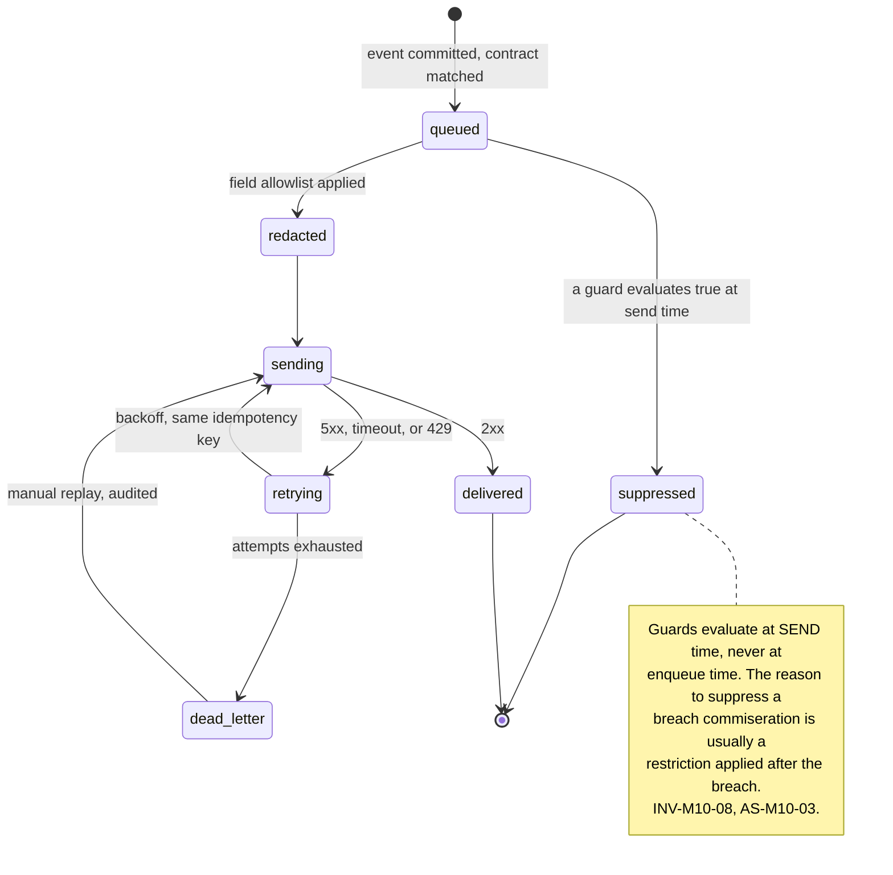
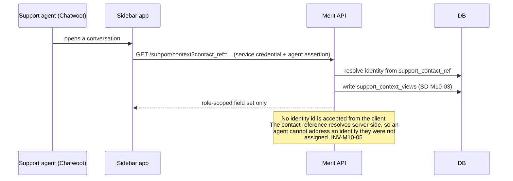
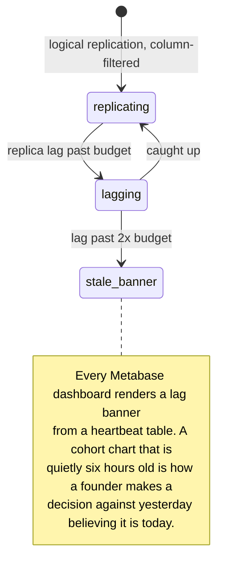

# M10: Integrations

Constitution section M10 ("buy, wire, don't build"), Appendix B5 ten-section template, Appendix D3, and [EVENTS section 11](../architecture/EVENTS.md)'s lifecycle messaging triggers. Non-money path, with one exception: the outbound event stream is a money-adjacent asset even though it moves no money, and section 1.3 treats it as one.

One sentence governs this module: **every integration is a copy of some part of Merit held by somebody else, and the design question is never what the vendor can do for us but what leaves the building to make it possible.**

The constitution's instruction is to buy rather than build, and that instruction is correct. What it does not say, and what this plan exists to say, is that each purchase creates a **second custodian** of data whose first custodian is held to [SECURITY](../architecture/SECURITY.md)'s full control catalogue. Six vendors is six more places a breach can start and six more places Merit's own numbers can be quoted from.

**Amended by [ADR-039](../decisions/ADR-039.md) (FOLD-01 session 5, 2026-08-16), and the amendment breaks this module's oldest assumption.** A sixth integration is added, the SMS sender (IN-M10-06), and it is **not like the other five**: phone verification is mandatory at registration, so for the first time a bought vendor sits on the critical path of something a trader is trying to do. INV-M10-01's list does not name registration, which is not an exemption but an omission of a flow that did not exist when the list was written. **Section 7.9 carries the sixth integration, the registration lookup's egress, and two findings that were surfaced rather than closed**, per this corpus's standing preference for a named gap over a quiet assumption.

**Identifier conventions:** `INV-M10-nn` invariants, `SD-M10-nn` schema deltas, `IN-M10-nn` integrations, `FM-M10-nn` failure modes, `AS-M10-nn` adversarial scenarios, `OQ-M10-nn` open questions, `DEP-M10-nn` dependencies.

---

## 1. Purpose and invariants

### 1.1 What this module is

The wiring layer between Merit's event stream and six bought services, plus the egress discipline that governs all of them.

| ID | Integration | Direction | What crosses the boundary |
|---|---|---|---|
| IN-M10-01 | **Chatwoot**, self-hosted support inbox | Inbound iframe, outbound API read | A support agent's view of one identity's account context, on demand, per conversation, audited (section 3.2) |
| IN-M10-02 | **Metabase**, on a read replica | Read only, internal | Full analytical read of the warehouse-shaped replica. No writes, no PII columns (section 3.3) |
| IN-M10-03 | **Loops or Customer.io**, lifecycle messaging | Outbound events | The nine [EVENTS section 11](../architecture/EVENTS.md) triggers, with suppression guards, and the minimum payload each needs |
| IN-M10-04 | **Sentry, uptime monitoring, status page** | Outbound errors and probes | Stack traces, request context, and release metadata, after scrubbing (AS-M10-04) |
| IN-M10-05 | **Discord internal alerting** | Outbound webhook | Liability, CUSUM, reconciliation, and MID health alerts. **Internal operations only**, distinct from [M15](M15-discord-integration.md)'s community integration |
| IN-M10-06 | **SMS sender** ([ADR-039](../decisions/ADR-039.md)) | Outbound API, synchronous at registration | **A telephone number and a one-time code.** The only integration on the critical path of anything, and the only one that carries an identity-grade identifier in plaintext. Section 7.9 |

**The shared spine, which is the actual deliverable.** Every one of the six is wired through a single **outbound integration bus**: one dispatcher reading the `events` table, one egress allowlist, one redaction pass, one retry and dead-letter discipline, one audit record of what was sent where. Five bespoke webhook callers scattered through the codebase would be five different answers to "what did we tell that vendor about this trader", and that question has to have one answer.

### 1.2 What this module is not

| Not M10 | Whose job | Why the boundary is here |
|---|---|---|
| Deciding what to say to a trader | [M16](M16-notification-center.md) | M16 owns preference, channel, and content. M10 owns delivery to the vendor that sends it. A trader who unsubscribed must not be reachable through this module |
| Community Discord: roles, announcements, verification | [M15](M15-discord-integration.md) | IN-M10-05 is an internal alert firehose into an operations channel. The two share a protocol and nothing else, and conflating them is how a liability figure reaches a public server (AS-M10-05) |
| Computing any published statistic | [M12](M12-transparency-platform.md) | A Metabase saved question is not a published number, and the distinction is enforced rather than assumed (AS-M10-02) |
| Alerting policy and thresholds | [M6](M06-admin-ops-console.md) and each owning module | M10 delivers an alert. It never decides that something is alarming |
| Storing support conversation content | Chatwoot | Merit stores a conversation reference on the identity, never the transcript ([DATA_MODEL](../architecture/data-model/README.md)'s `Conversations` lateral branch is a pointer) |
| Being on the critical path of anything | nobody, deliberately | See INV-M10-01 |

### 1.3 Invariants

| ID | Invariant | Enforcement |
|---|---|---|
| INV-M10-01 | **No vendor is ever on the critical path of a purchase, a provisioning, a rule evaluation, or a payout** | Every outbound dispatch is asynchronous, enqueued through pg-boss ([ADR-006](../decisions/ADR-006.md)) after the transaction that caused it commits. A vendor outage produces a delayed message and never a failed sale or a delayed payout (AS-M10-06). **The claim is unchanged and its four-item list is now load bearing rather than illustrative**: [ADR-039](../decisions/ADR-039.md) puts IN-M10-06 on the critical path of **registration**, which this list does not name and never did. Section 7.9 states that plainly rather than widening the list to cover it, because widening it would be asserting a protection that does not exist |
| INV-M10-12 | A telephone number exists in plaintext **in a request body and never at rest**, on either side of the boundary | `identity_phones.phone_hash`, `contact_channels.value_hash` and `otp_challenges.destination_hash` are all one-way ([`0029`](../../packages/db/migrations/0029_phone_identity_and_auth.sql), [`0019`](../../packages/db/migrations/0019_notifications_and_community.sql)), and `integration_dispatches.fields_sent` records **field names rather than values** (SD-M10-02), so the audit trail of a number's disclosure never becomes a second copy of the number. This is C-13's hashed-signal discipline extended to the one identifier that a vendor cannot do its job without receiving, and section 7.9 records what it costs |
| INV-M10-02 | Every outbound payload passes one redaction pass, and the allowlist is per integration and per field | SD-M10-01's `integration_contracts`. Not a denylist. A field added to an event next year is **not** sent to any vendor until somebody adds it to that vendor's contract (AS-M10-04) |
| INV-M10-03 | Every dispatch writes an audit row: which vendor, which event, which fields, when, and the response | SD-M10-02 `integration_dispatches`. "What did we tell that vendor about this trader" is a query, answerable during a privacy request or a vendor breach |
| INV-M10-04 | No document, no biometric, no PAN, no full device fingerprint, and no raw IP leaves Merit through any integration | [SECURITY](../architecture/SECURITY.md) C-13 extended to egress. The contract allowlists make it structural rather than a review item |
| INV-M10-05 | The support sidebar shows an agent exactly the fields their role permits, scoped to the identity in the conversation, and every view is audited | Section 3.2, SD-M10-03. A support tool is a read of the crown-jewel identity graph from outside the admin origin (AS-M10-01) |
| INV-M10-06 | The read replica carries **no** PII columns and **no** write grant | Column-level exclusion at replication, and a replica role with `SELECT` only. Metabase cannot become a data-exfiltration console because the data is not there (AS-M10-02) |
| INV-M10-07 | A number produced by a Metabase question is **internal**, is labeled internal in the tool itself, and is never a published figure | Naming convention plus a banner on every dashboard, and the reconciliation rule in AS-M10-02. [M12](M12-transparency-platform.md) is the only publisher of a public number |
| INV-M10-08 | Lifecycle messaging respects [M16](M16-notification-center.md)'s preferences and every suppression guard in [EVENTS section 11](../architecture/EVENTS.md) | The dispatcher evaluates guards **at send time**, not at enqueue time, because the reason to suppress usually arrives after the event that queued the message (AS-M10-03) |
| INV-M10-09 | The status page does not share failure domains with the systems it reports on | Third-party hosted, separate DNS, separate credentials. A status page that is down during the incident is worse than none, because its silence reads as concealment |
| INV-M10-10 | Every scheduled integration job is covered by a dead-man switch | Constitution section 7's cron inventory. A digest that silently stops arriving is indistinguishable from a quiet week, and quiet weeks are exactly when nobody checks |
| INV-M10-11 | Vendor credentials are per integration, minimum scope, rotated on the 90 day calendar, and never shared between two integrations | [SECURITY](../architecture/SECURITY.md) C-14. A shared key means one vendor's breach is every vendor's breach |

---

## 2. Entities and schema deltas

Four deltas. All of them exist to make egress answerable rather than merely functional.

| ID | Table | Change | Why it is not optional |
|---|---|---|---|
| SD-M10-01 | new `integration_contracts` | `id`, `integration text`, `event_name text`, `field_allowlist text[]`, `enabled boolean`, `guard_expression text null`, `version integer`, `approved_by`, `approved_at` | INV-M10-02. Without a declared per-vendor field allowlist, the payload sent to a vendor is whatever the event happened to contain on the day it was serialized, which means a schema addition silently becomes a disclosure. Making the contract a row rather than code also makes "what are we sending Loops" a question the founder can answer without reading a repository |
| SD-M10-02 | new `integration_dispatches` | `id`, `integration`, `event_id`, `identity_id null`, `fields_sent text[]`, `status`, `attempts`, `response_code`, `dispatched_at`, `idempotency_key` | INV-M10-03. A privacy deletion request and a vendor breach ask the identical question, and neither can be answered from a log that rotates in 30 days. Append-only, and it is the only table in this module with a retention longer than a quarter |
| SD-M10-03 | new `support_context_views` | `id`, `agent_ref`, `identity_id`, `fields_returned text[]`, `conversation_ref`, `viewed_at`, `ip_hash` | INV-M10-05, AS-M10-01. A support agent reading the identity graph is a privileged read happening outside the admin origin's IP allowlist and hardware-key SSO. If it is not audited it is an unmonitored back door into the crown jewel, and social engineering through support is [dossier item 9](../../research/ADVERSARY_DOSSIER.md) |
| SD-M10-04 | `identities` | add `support_contact_ref text null` | The pointer to the Chatwoot contact, so Merit can resolve a conversation to an identity without storing transcripts. One column instead of a conversation table is the whole point: Merit is not a second copy of the support system |

**Deliberately not modelled.** No transcript storage, no analytics event table, no vendor-side identifier beyond the two pointers above. Every one of those would make Merit a partial replica of a system it is paying somebody else to run, which is the failure mode "buy, wire, don't build" exists to prevent.

---

## 3. State machines

### 3.1 Outbound dispatch

**Dead-letter is a state, not a log line.** A message that could not be delivered stays visible with its payload, its failure, and a replay control, because the alternative is a class of trader communication that fails silently and is discovered by a support ticket. `payout.transfer_failed` is in this stream, and [EVENTS section 11](../architecture/EVENTS.md) marks it "always send; silence is what kills payout trust".

### 3.2 The support context read

**The client never names the trader.** The sidebar passes the conversation's contact reference and the server resolves it. An agent who edits the request cannot pivot to another identity, which is the difference between a support tool and an IDOR with a login page ([SECURITY](../architecture/SECURITY.md) C-03, C-18).

### 3.3 Analytical replication

Excluded from replication entirely: `identity_signals`, `kyc_verifications`, `passkeys`, `sessions`, `otp_challenges`, `idempotency_keys`, **`identity_phones`, `phone_change_requests`, `contact_channels`**, and the raw ingest tables. Excluded at column level: every name, email, and destination reference. What remains is enough for cohort funnels, LTV and CAC, and payout health, and is not enough to identify a person (INV-M10-06).

**The three tables [`0029`](../../packages/db/migrations/0029_phone_identity_and_auth.sql) and [`0019`](../../packages/db/migrations/0019_notifications_and_community.sql) added to that list are excluded on the same reasoning as `identity_signals`, and one of them needs its reasoning said out loud.** `identity_phones` is the identity graph's newest and highest-weight node ([ADR-022](../decisions/ADR-022.md), [ADR-039](../decisions/ADR-039.md) (b)), and its carrier columns are the most re-identifying non-PII in the estate: carrier plus country plus line type plus a portability date is a small enough bucket that it identifies a person in a cohort of a few hundred without holding a single hashed value. **A hash is not an exclusion criterion and never was**, which is why this list names tables rather than trusting the column-level pass. **`otp_send_budget` is excluded at column level rather than entirely, and the column is `scope_key`.** The breaker's own behavior is exactly what the founder should be able to chart: spend, sends, the trip, the degraded window and `deferred_registrations` are all figures [ADR-039](../decisions/ADR-039.md) requires somebody to watch, and putting them behind the admin console only would make the reported figure the one nobody charts. But `scope_key` is polymorphic by `scope_kind`: `encode(phone_hash,'hex')` for `phone`, the alpha-2 for `country`, the literal `global`, **and the raw address for `ip`**. One column, four meanings, one of which is PII, so the column goes and the counts stay. **A column-level exclusion driven by a sibling column's value cannot be reasoned about at replication time**, which is why the whole column is dropped rather than the `ip` rows, and it is worth noticing that this shape appears the moment a table stores a key whose type is a value.

---

## 4. API endpoints touched

| Endpoint | M10's role | Notes |
|---|---|---|
| `GET /support/context` **NEW** | Owns | Section 3.2. Service credential plus an agent assertion, contact reference only, role-scoped response, audited on every call. Rate limited per agent, and an agent exceeding the limit is an alert rather than a 429 nobody sees |
| `POST /internal/integrations/replay` **NEW** | Owns | Dead-letter replay. Admin origin, `owner` or `ops`, reason required, writes `admin_actions` |
| `GET /internal/integrations/health` **NEW** | Owns | Per-integration queue depth, oldest pending age, dead-letter count, last success. Feeds [M6](M06-admin-ops-console.md) |
| `GET /admin/identities/:identityId/disclosures` **NEW** | Owns | Every field ever sent about this identity, per vendor, from `integration_dispatches`. The privacy-request and breach-response endpoint, and the reason SD-M10-02 exists (AS-M10-04) |
| `POST /webhooks/psp/:provider`, `POST /webhooks/rise` | Not M10 | Named here only to state the boundary: inbound money webhooks belong to [M3](M03-billing-checkout.md) and [M5](M05-payout-system.md) and do not pass through this module's bus |

---

## 5. Events emitted and consumed

**Consumed** (the dispatch inputs): the nine [EVENTS section 11](../architecture/EVENTS.md) triggers, plus `treasury.coverage_changed`, `ledger.invariant_violated`, `recon.mismatch_detected`, `risk.cusum_alarm`, `psp.mid_health_changed`, and `payout.balance_reflection_missing` for the internal alert channel.

**Emitted**, four, all about the wiring rather than the business:

| Event | When | Notes |
|---|---|---|
| `integration.dispatch_failed` **NEW** | attempts exhausted | `{ integration, event_id, event_name, attempts, last_response_code }`. Consumers: ALERT, FEED. Pages when the event is in the payout family, warns otherwise |
| `integration.contract_changed` **NEW** | an `integration_contracts` row changes | `{ integration, event_name, fields_added, fields_removed, approved_by }`. **A field added to a vendor contract is a disclosure decision and is audited as one.** Consumers: ALERT, FEED, EVID |
| `integration.replica_lag_exceeded` **NEW** | lag past budget | `{ lag_seconds, budget_seconds }`. Consumers: ALERT, FEED |
| `support.context_viewed` **NEW** | every sidebar read | `{ agent_ref, identity_id, fields_returned, conversation_ref }`. Consumers: FEED, RISK. Volume is real and the value is real: this is the audit trail for reads of the identity graph from outside the admin origin |

---

## 6. Failure modes

| ID | Failure | Blast radius | Detection | Recovery |
|---|---|---|---|---|
| FM-M10-01 | Vendor outage on the messaging provider | Traders stop hearing from Merit. On the payout family this is the death-spiral input | Queue depth and oldest-pending age per integration | Queue, retry with the same idempotency key, dead-letter with a replay control. **Nothing in the product blocks** (INV-M10-01) |
| FM-M10-02 | A suppression guard evaluated at enqueue rather than at send | A commiseration or reset offer reaches somebody Merit just restricted | Guard-evaluation tests, plus a suppressed-count metric that should never be zero | Guards evaluate at send (INV-M10-08). AS-M10-03 |
| FM-M10-03 | An event gains a field and the field ships to every vendor | Silent disclosure, discovered during a breach or a privacy request | Contract allowlists are additive-by-approval; a new field is absent from every contract by default | Structurally prevented (INV-M10-02). AS-M10-04 |
| FM-M10-04 | Sentry captures a payload containing PII or a secret | Crown-jewel data in a third-party system with weaker controls than the one it came from | Scrubber unit tests plus a canary token in a synthetic error payload ([SECURITY](../architecture/SECURITY.md) C-19) | Deny-by-default serialization on money-path errors, scrub before send, and a documented vendor-side purge procedure. AS-M10-04 |
| FM-M10-05 | Discord alert webhook posts to a public channel | Merit's liability position, reconciliation state, and breaker status become public | Channel-id assertion at startup and per send | Separate credential per channel, an allowlisted channel id, and no liability figure in the message body (AS-M10-05) |
| FM-M10-06 | Read replica lag makes a dashboard silently stale | A decision made against yesterday believing it is today | Heartbeat table plus the lag banner (section 3.3) | Banner and alert. A stale dashboard that says it is stale is fine; one that does not is the failure |
| FM-M10-07 | Support agent views an identity they were not assigned | Unaudited read of the identity graph, and the social-engineering surface | `support_context_views`, plus a per-agent rate and breadth alert | Contact-reference resolution server side, role-scoped fields, and audit on every call. AS-M10-01 |
| FM-M10-08 | Status page shares a failure domain with the outage | Silence at the moment silence reads as concealment | Third-party hosted, probed from outside | INV-M10-09, plus a named human and a pre-written template per incident class (constitution section 7) |
| FM-M10-09 | A scheduled digest silently stops | Nobody notices, because a quiet week and a broken job look identical | Dead-man switch per job (INV-M10-10) | The dead-man switch is the recovery: it alarms on non-run rather than on failure |
| FM-M10-10 | **The SMS sender is down and registration is mandatory-verified** | **Nobody can register.** Not a delayed message: a closed front door, and the first vendor outage in this module that costs revenue rather than patience | Send-failure rate and OTP delivery latency per country, and the registration funnel's first step | **Undecided, and it is `OQ-M10-05`.** C-28's degradation covers the **cost breaker** and says nothing about a vendor outage, and the mechanism it would reuse (`deferred_registrations`, the `pre_funded` gate) already exists. Section 7.9 |
| FM-M10-11 | A prior contact must be notified and **no deliverable address exists** | The account-takeover countermeasure `INV-M16-03` and [SECURITY §4.8](../architecture/SECURITY.md) leg 2 both name does not fire, silently, on the one event it exists for | **None today.** A send with no address is a code path that has never had an address to fail on | **RULED, [ADR-046](../decisions/ADR-046.md), 2026-08-16.** The address exists as of [`0034`](../../packages/db/migrations/0034_reversible_contact_addresses.sql) and the send is no longer permitted to be silent: `prior_notified_at` may not be set without citing a dispatch record. A send with no address now produces no dispatch and therefore cannot advance the request. Section 7.9 |

---

## 7. Adversarial scenarios

**Six listed, five novel.** The one marked "extends" sharpens a dossier item into this module's surface.

### AS-M10-01: The support console is an unlisted door into the identity graph (NOVEL treatment of dossier item 9)

**Attack.** [SECURITY](../architecture/SECURITY.md) puts the admin console behind a separate apex domain, an IP allowlist, hardware-key SSO, and RBAC ([ADR-012](../decisions/ADR-012.md), C-08). The support sidebar reads much of the same data, through a service credential, from a self-hosted Chatwoot instance, over the public internet, for an agent authenticated by Chatwoot rather than by Merit. Every control that makes the admin console safe is absent, and the data is roughly the same data.

**Two ways it is exploited, and the second is the one that will actually happen.** The direct way is a compromised agent account or a compromised Chatwoot instance, which yields a bulk read of the identity graph. The realistic way is [dossier item 9](../../research/ADVERSARY_DOSSIER.md): **social engineering the support process itself**. A caller who can get an agent to open a conversation "for" a trader gets Merit's own tool to display that trader's account context, and everything the agent then reads back is authoritative because it came from Merit.

**Why the usual defense is insufficient.** Training. Support agents are hired to be helpful under time pressure and they will be, which is why the control has to sit in the data rather than in the person.

**Counter, four parts, in order of how much each one buys.**
1. **The client never names the trader.** The sidebar sends a conversation contact reference and the server resolves it (section 3.2). An agent cannot address an identity they were not assigned, because there is no parameter in which to name one.
2. **Role-scoped fields, minimized hard.** The default agent view is account status, plan, phase, gate progress, and open ticket context. It is **not** the identity graph, not linked accounts, not payout destinations, not flags, and not KYC detail. Anything above the default requires an escalation that is itself a distinct audited action.
3. **Every read is audited with the fields returned** (SD-M10-03), and per-agent breadth is monitored: an agent viewing many distinct identities in a short window is an alert, which is the shape both a compromised account and a social-engineering campaign make.
4. **No support-initiated identity change, ever, without the verification runbook** ([dossier item 9](../../research/ADVERSARY_DOSSIER.md) names account transfers and KYC swaps specifically). Support can read and can escalate. It cannot mutate identity, destination, or KYC state at all, and that is a code-level absence rather than a permission setting. EC-086, GS-149.

### AS-M10-02: The saved question that becomes a published number (NOVEL)

**Attack.** Metabase is wired to a read replica so the founder can build cohort funnels and payout health dashboards. Someone builds a "pass rate" question. It is a reasonable query, and it computes a slightly different number from [M12](M12-transparency-platform.md)'s published pass rate, because it filters differently on breached-and-reset accounts, or on accounts that never traded, or on the boundary of the trailing window. The Metabase figure is convenient, in front of the founder daily, and gets quoted: in an investor update, in a Discord answer, in a blog post.

**Why it is a serious problem rather than an untidy one.** Merit's differentiator is that it publishes a pass rate at all. Two internally inconsistent pass rates, both real, both Merit's, is a worse position than publishing none, because the discrepancy is discoverable and reads as either sloppiness or selection. And the drift is not detectable by testing either query: both are correct implementations of slightly different questions.

**Counter, and the important half is a reconciliation rather than a prohibition.**
- **Every Metabase dashboard carries an "internal, not published" banner**, and questions that shadow a published metric are named with an `internal_` prefix (INV-M10-07). This is weak on its own and is stated as weak.
- **The strong control is a nightly reconciliation**: for each metric [M12](M12-transparency-platform.md) publishes, a Metabase question computes it **from M12's own published definition** and asserts equality with the published value. A divergence is an alert. This turns the analytical tool from a competing source into a **checker** of the published one, which is a genuinely better use of it than the prohibition would have been.
- **Only M12 publishes**, and M12's numbers come from a versioned definition with a method page ([M12](M12-transparency-platform.md) INV-M12-02). A number without a method reference is not publishable regardless of which tool produced it. GS-150.

### AS-M10-03: The commiseration email to somebody we just banned (NOVEL, sharpens the EVENTS section 11 guards)

**Attack.** [EVENTS section 11](../architecture/EVENTS.md) already knows about this class and states the rule: suppress the breach commiseration if the identity is restricted or carries an open severity 4+ flag, "because a commiseration email to someone we just restricted reads as either incompetence or mockery". The adversarial sharpening is **ordering**. The breach event fires at 00:20 in the nightly batch. The detector run that flags the ring fires at 00:40. The restriction is applied by a human at 09:15. If the guard is evaluated when the message is enqueued, every one of those messages went out at 00:21 and the guard never had anything to suppress.

**And the version with real money attached.** The same ordering bug sends a **reset offer with a discount** to an account under active investigation, which is Merit offering to sell more capacity to a ring it is in the middle of detecting, in writing, with a coupon code attached. That artifact is genuinely damaging in an enforcement conversation.

**Counter.**
- **Guards evaluate at send time, against live state**, never at enqueue (INV-M10-08). The dispatcher re-reads restriction status, open flag severity, and account state immediately before the send.
- **A deliberate delay on the two offer-bearing messages.** Breach commiseration with a reset offer and win-back both hold for a configured window (proposed: until the next detector run has completed for that identity, and in no case less than 2 hours), because the whole value of a send-time guard is that something arrived in between. A commiseration email is not urgent, and treating it as urgent is what creates the exposure.
- **Suppressed sends are counted and visible.** A suppression metric that reads zero for a week means the guards are not wired, not that Merit had a clean week. EC-087, GS-151.

### AS-M10-04: The error report that carries the eligibility snapshot into a third-party SaaS (NOVEL)

**Attack.** Sentry captures an unhandled exception on `POST /accounts/:id/payout`. The frame's local variables include the eligibility snapshot, the clamped amount, the identity, the destination reference, and, on a serialization error, the whole request body. That payload lands in a vendor's system with a different retention policy, a different access model, a broader set of humans, and no relationship to Merit's `scopedDb` discipline. The trader's crown-jewel data has been copied out of the most controlled table in the estate into the least controlled system in it, by the error handler.

**Why it beats the standard defense.** The standard defense is a scrubber with a denylist of key names: `password`, `token`, `card`. The payout path contains none of those words and every one of its fields is sensitive. A denylist tuned for authentication data is blind to financial data by construction.

**Counter, and it inverts the usual polarity.**
1. **Deny by default on money paths.** Errors raised inside the payout, ledger, KYC, and identity-resolution paths serialize an **allowlisted** context only: route, release, error class, request id, and account id. No frame locals, no request body, no headers. Everything else is dropped before the SDK sees it.
2. **The same field-allowlist mechanism as every other integration** (SD-M10-01, INV-M10-02), so there is one place to answer "what can reach Sentry" and it is a row rather than a middleware nobody has read.
3. **A canary in a synthetic error.** [SECURITY](../architecture/SECURITY.md) C-19's canary tokens are seeded into a synthetic exception payload on a schedule; the canary appearing in the vendor confirms the scrubber has regressed, which is the only way to test a negative reliably.
4. **`GET /admin/identities/:id/disclosures` answers the question this scenario creates**: after any vendor incident, which identities had what sent about them, from `integration_dispatches` (INV-M10-03). Without it, a vendor breach becomes an unbounded disclosure of unknown scope, which is the version that has to be reported as unbounded. EC-088, GS-152.

### AS-M10-05: Merit's liability position, posted to a chat server (NOVEL)

**Attack.** IN-M10-05 posts operational alerts to Discord: reserve coverage, CUSUM alarms, reconciliation mismatches, MID health. Those messages contain, in plain text, the firm's open liability, which plans are being beaten, and whether the payment processor relationship is under stress. Any one of those is competitively valuable and the reconciliation and MID items are the kind of thing that, taken out of context, reads as a firm in trouble.

**Three ways it leaks, and none of them require breaking anything.** A webhook URL is a bearer credential in a string, so anyone who ever sees it can post to that channel and anyone with the channel can read it. Discord permissions drift, and a private ops channel becomes visible to a role somebody added for an unrelated reason. And [M15](M15-discord-integration.md) puts Merit on a **public community server** with its own bot and its own credentials, so the two Discord integrations sit one configuration mistake apart.

**Counter.**
- **Two integrations, no shared anything.** IN-M10-05 and [M15](M15-discord-integration.md) have separate applications, separate credentials, separate servers, and separate code paths. They are not one Discord integration with two purposes, and section 1.2 says so.
- **The channel id is asserted at startup and on every send.** A misconfigured target fails closed and pages rather than posting.
- **Alerts carry severity, class, and a link, never a figure.** "Reserve coverage below threshold, see the admin console" conveys everything an operator needs to act and nothing a reader can quote. The number lives behind [ADR-012](../decisions/ADR-012.md)'s admin origin, which is where the controls are. This costs an operator one click and removes an entire disclosure class.
- **The webhook credential is on the 90 day rotation calendar** like every other (INV-M10-11). GS-153.

### AS-M10-06: The vendor that quietly becomes load bearing (NOVEL)

**Attack.** The adversary is convenience. The welcome email is wired into the provisioning saga because that is where the data is. The reset offer is generated by the messaging vendor because their template engine is better. A support macro starts reading a field the sidebar returns, then that field's absence starts breaking the macro. Over six months, three vendors move from "notified by" to "part of". Nobody decided this; each step was reasonable.

**Why it is the most likely failure in this module.** It has no attacker, no incident, and no moment where anybody could have said no. It is discovered during a vendor outage, when a purchase fails and the reason is that a marketing platform returned a 500.

**Counter, structural, because a policy against this decays exactly as fast as the drift does.**
1. **All dispatch is post-commit and asynchronous** (INV-M10-01). A saga step cannot await a vendor because the dispatcher runs after the transaction, and the enqueue participates in that transaction ([ADR-006](../decisions/ADR-006.md)'s stated benefit).
2. **A chaos test in CI runs the four critical flows with every vendor returning 500 and every vendor timing out**, asserting the flows complete. Purchase, provisioning, payout request, and payout settlement. This is the control: an assertion that fails when the drift happens, rather than a paragraph that everyone agrees with.
3. **Content that a trader must receive is Merit's**, rendered from [M16](M16-notification-center.md)'s templates and stored in `notifications`, with the vendor as a delivery channel. A message whose text exists only inside a vendor is a message Merit cannot reproduce in an evidence pack or resend after a vendor migration.
4. **The quarterly integration review asks one question**: for each vendor, what breaks if they are gone for a day. The answer must remain "messages are late". EC-089, GS-154.

---

## 7.9 The two egresses ADR-039 adds, and the two findings they surfaced

### 7.9.1 IN-M10-06, the SMS sender

**M16 decides what to say and M10 delivers it**, which is section 1.2's boundary and it holds here unchanged. What is new is what crosses: **a telephone number in plaintext and a one-time code**, to a vendor, on a synchronous path, for an unauthenticated stranger.

| Property | Requirement |
|---|---|
| **Contract** | Its own `integration_contracts` row (SD-M10-01). The number is an allowlisted field and adding it is a **disclosure decision**, audited as `integration.contract_changed` like every other |
| **Audit** | `integration_dispatches` records `fields_sent` and never values (INV-M10-03, INV-M10-12), so the record of a number's disclosure does not become a copy of the number |
| **Rate limiting** | **Not M10's.** The velocity scopes and the cost breaker are `otp_send_budget` under [M16](M16-notification-center.md) `INV-M16-12` and C-28. M10 delivers what M16 authorized and never decides that a send is too many, which is section 1.2's "M10 never decides that something is alarming" applied to cost |
| **Deliverability** | Per-country delivery rate and latency are operational figures here and **cost** figures in [M03 §7.9.2](M03-billing-checkout.md). One vendor behaviour, two owners, and it is worth saying which is which because "SMS is expensive in country X" and "SMS does not arrive in country X" have different remedies |
| **Credential** | Per integration, minimum scope, 90 day rotation (INV-M10-11). A sender credential is a **spend** credential, which no other credential in this module is |

**Why the transport-only discipline is not negotiable for this one.** AS-M10-06 part 3 says content a trader must receive is Merit's, rendered from M16's templates. Every SMS vendor sells a contact book, a template engine and a verification API that does the whole ceremony for you, and taking any of the three moves an authentication factor's state into a vendor. **The verification API is the tempting one and it is the one that must be refused**: it would make a vendor the authority on whether a number is verified, which is a fact `identity_phones.verified_at` exists to hold and which C-27 then depends on.

### 7.9.2 The registration lookup as governed egress

Not a seventh integration: [ADR-023](../decisions/ADR-023.md)'s existing vendor at a second call site, resolved on evidence in [FOLD-01 §3.1](FOLD-01-phone-identity.md) and specified from the commerce side in [M03 §7.9.1](M03-billing-checkout.md). **What M10 owns is that it is an egress and therefore takes its own contract row rather than inheriting checkout's.**

**The reason a shared row would have been wrong is the reason the allowlist is per call site and not per vendor.** Checkout's row allowlists email, device, IP and BIN. If the registration lookup rode on it, the phone number would have had to be added to a row a checkout call also reads, and INV-M10-02's guarantee — a field is not sent to anybody until somebody adds it to that vendor's contract — would have quietly become "the number is sent at checkout too". **Two moments, two rows, two answers to `GET /admin/identities/:identityId/disclosures`.**

**And INV-M10-04 is not violated by this, which is worth stating because it looks like it might be.** The list is documents, biometrics, PAN, full device fingerprints and raw IPs. A telephone number is not on it and is not being quietly added to it: the number is the **subject** of the lookup rather than context attached to one, so a vendor that does not receive it cannot answer. That is the difference between this egress and AS-M10-04's Sentry payload, where every sensitive field was context nobody needed. **INV-M10-12 is what bounds it instead**: plaintext in the request, never at rest, on either side.

### 7.9.3 Finding 1: a vendor is now on the critical path of registration, by design, on day one

**AS-M10-06 is about a vendor that becomes load bearing by drift, over six months, with no moment anyone could have said no. IN-M10-06 is load bearing on the day it ships**, because [ADR-039](../decisions/ADR-039.md) makes phone verification mandatory at registration. If the SMS vendor is down, nobody registers. That is FM-M10-10 and it is the first vendor outage in this module that costs revenue rather than patience.

**INV-M10-01's list does not name registration**, so nothing is being contradicted. But the list was written when every integration was post-commit and asynchronous, and reading it as "no vendor is ever load bearing" is now wrong. The invariant's claim is left exactly as it was and the omission is named here, because widening the list to include registration would be **asserting a protection that does not exist**.

**What the ruling already settled, and what it did not.** C-28's degradation ruling is precise and it is about the **cost breaker**: on trip, registration continues with verification deferred to [ADR-021](../decisions/ADR-021.md)'s `pre_funded` gate, and the window alarms. **A vendor outage is a different trigger with an identical shape**: nothing has moved, nothing is owed, and the only thing a refusal protects is a vendor's availability. The mechanism to reuse already exists and is already built, `deferred_registrations` and the `pre_funded` gate, and `otp_send_budget.state` has a `degraded` value that a health check could set.

**It is raised as `OQ-M10-05` and not decided here**, because "the same reasoning obviously applies" is exactly the move that produced this corpus's worst errors. Degrading on a **cost** trip is a founder ruling about Merit's own bill. Degrading on a **vendor** outage lets an attacker who can DoS a third party turn off Merit's phone verification, and that is a different bargain that the founder has not been asked about.

### 7.9.4 Finding 2: the prior contact has no deliverable address, and neither does the current one

**This is a proven gap in a shipped control, of exactly [`OI-06`](FOLD-01-phone-identity.md)'s shape: every document citing the control cites a control whose input does not exist.** It is recorded rather than fixed, for `OI-06`'s reason.

**The claim, checked against the migrations rather than recalled.** There is **no plaintext telephone number in any of the twenty-nine migrations.** `identity_phones` holds `phone_hash bytea` plus a `phone_preview` that is "enough to recognise, not enough to reconstruct" ([`0029`](../../packages/db/migrations/0029_phone_identity_and_auth.sql)); `phone_change_requests` holds `new_phone_hash bytea`; `otp_challenges` holds `destination_hash bytea`; `contact_channels` holds `value_hash bytea`. Every one is one-way and every one is one-way **on purpose**, and the reasoning in each comment is correct: a second plaintext copy of every number a trader ever used buys nothing and costs a breach.

**What follows from it is not what those comments assume.** Both [`0019`](../../packages/db/migrations/0019_notifications_and_community.sql) and the [`contact_channels`](../architecture/data-model/contact_channels.md) design record say the value is hashed because **"the sending path holds the address"**. The sending path is this module. **This module holds nothing**, by INV-M10-02 and INV-M10-03 and by the deliberate absence in section 2 of any table that stores a contact value, and it may not delegate the holding to a vendor because AS-M10-06 part 3 forbids a vendor being the system of record for content a trader must receive.

So the address is held by **the request**, and only a request that carries one has one:

| Flow | Who supplies the number | Deliverable today |
|---|---|---|
| Registration OTP, login OTP | The trader types it | **Yes** |
| A security-class SMS to the **verified** number: destination changed, passkey registered, breach | Nobody. Merit initiates | **No** |
| `INV-M16-03`'s notification to the **prior** number after a phone change | Nobody, and it must not be the actor, since the actor may be the attacker | **No** |
| [SECURITY §4.8](../architecture/SECURITY.md) leg 2, `prior_notified_at` | as above | **No** |
| Dormancy escalation "including prior contacts" ([COUNSEL_PACKET](../legal/COUNSEL_PACKET.md) 3a) | Nobody | **No** on the SMS leg |

**The email side has the same gap on prior addresses and not on current ones.** `users.email` is plaintext, so a live email is deliverable; it is one column on one row, so a change **overwrites** it and the prior address survives only as `contact_channels.value_hash`. `INV-M16-03` has therefore never had a deliverable prior address on either channel, and that predates [ADR-039](../decisions/ADR-039.md) entirely. **`SD-M16-06` widened `contact_channels.kind` to accept `sms` and made the countermeasure *representable*; it did not make it *sendable*, and the difference is this finding.**

**The sharpest version, because it is the one that would survive a review.** `phone_change_requests_applied_is_complete` makes `prior_notified_at` a precondition of the write, so the database refuses a change that did not notify. **The database can only assert that a timestamp exists.** A handler with no address to send to and a column it must fill will fill it, the constraint will pass, the ceremony will look enforced, and the notification that is the entire anti-takeover control will never have left the building. **A control that is storage-enforceable and not send-enforceable reads as enforced in every document and in every test that inspects the row.**

**Recommendation, offered without deciding it. RULED AS WRITTEN on 2026-08-16, with one amendment, and executed as [`0034`](../../packages/db/migrations/0034_reversible_contact_addresses.sql). See [ADR-046](../decisions/ADR-046.md); the paragraph is left exactly as it was written so the ruling can be read against what was actually proposed.** Store the address **reversibly rather than not at all**: a `value_ciphertext` beside the existing `value_hash`, envelope-encrypted under a key only the dispatcher can use, with the hash kept for matching and uniqueness. That preserves the stated goal, which is that a database dump does not yield a usable address, and gives the sending path the thing every citing document already assumes it has. It is a schema change in its own migration after its own session, and it touches `contact_channels`, `identity_phones` and `phone_change_requests`.

**The amendment, which is the one thing the recommendation did not contain.** `merit_dispatcher` gets `SELECT` and `INSERT`, **never `DELETE`**, and `UPDATE` stays for rotation. **Erasure is a privacy operation and not a send operation**, and a compromised send-path role holding `DELETE` can destroy the addresses this countermeasure depends on. `0034` implements it column-scoped, which is narrower than the words, and says so in its own header.

**And the plan was one layer short, which the execution found rather than the planning.** The address makes the send **possible**; it does not make it **provable**, and `phone_change_requests_applied_is_complete` was already accepting a timestamp from a handler that had sent nothing. [`EC-146`](../edge-cases/EC-146.md) had ruled that remedy in words nine days before this plan was written, and this section did not cite it: `prior_notified_at` is now a citation of an `integration_dispatches` row and a `notifications` row rather than a claim. **Two legs, two tables, because the SMS leg cannot be a `notifications` row at all** ([`0029`](../../packages/db/migrations/0029_phone_identity_and_auth.sql) declined to widen `notifications.channel`).

**No `OI-nn` identifier is claimed for it and the reason is a defect, not an oversight.** [`DELTA_MANIFEST`](../../packages/db/DELTA_MANIFEST.md) already carries **two rows numbered `OI-06`**, found by the S-E3 session: the `OI` series is the one registry with no allocation table, which is the [ADR-034](../decisions/ADR-034.md) race the three allocation tables exist to end. Claiming a third number into a namespace with a known live collision would make the collision harder to resolve rather than easier. It is `OQ-M10-06` here, and it needs a manifest row once the numbering is settled.

## 8. Test plan

### 8.1 Suites

| Suite | Prefix | Count | Runs | Blocks |
|---|---|---|---|---|
| Dispatch bus: ordering, retry, idempotency, dead-letter | `M10-B-nn` | 11 | every commit | merge |
| Contract allowlist and redaction (including negative: new field is not sent) | `M10-C-nn` | 9 | every commit | merge |
| Suppression guards evaluated at send time | `M10-G-nn` | 8 | every commit | merge |
| Support context scoping and audit | `M10-S-nn` | 7 | every commit | merge |
| Replica exclusion (asserts named columns and tables are absent) | `M10-R-nn` | 5 | every commit | merge |
| Vendor-down chaos across the critical flows | `M10-X-nn` | **one per critical flow**: purchase, provisioning, payout request, payout settlement, **and registration** | every commit | merge |
| Negative authz (D5) on support and internal endpoints | `M10-N-nn` | 5 | every commit | merge |
| Sentry scrubber canary | `M10-K-01` | 1 | nightly, and continuously in production | page |
| Dead-man switch coverage over the cron inventory | `M10-D-01` | 1 | nightly | nightly alarm |
| Golden fixtures | `GS-nnn` | 6 owned (GS-149 to GS-154) | every commit | merge |

### 8.2 Named scenarios owned by this module

| ID | Scenario | Pins |
|---|---|---|
| GS-149 | Support agent attempts to address an unassigned identity | The request carries no identity parameter to tamper with; resolution is server side; the read is audited with its field list. AS-M10-01 |
| GS-150 | An internal question diverges from the published metric | The nightly reconciliation alerts. The published value does not change, and the internal question is the one investigated. AS-M10-02 |
| GS-151 | Breach at 00:20, flag at 00:40, restriction at 09:15 | The commiseration and reset offer are **suppressed at send**, not delivered at 00:21. AS-M10-03 |
| GS-152 | Unhandled exception on the payout path | The captured payload contains route, release, error class, request id, and account id, and nothing else. The canary does not appear in the vendor. AS-M10-04 |
| GS-153 | Alert dispatched to a mis-set Discord channel | Startup and per-send channel assertion fails closed and pages; no message is posted; no figure was in the body anyway. AS-M10-05 |
| GS-154 | Every vendor returns 500 and then times out | Purchase, provisioning, payout request, and payout settlement all complete. Messages queue. AS-M10-06 |

**The registration flow joins the chaos suite and its assertion is blocked, which is stated rather than papered over.** The other four assert that the flow **completes** with every vendor returning 500 and then timing out. Registration cannot assert that yet, because whether it completes under an SMS-sender outage is `OQ-M10-05` and is the founder's to rule. **The test is written now against the behaviour the founder chooses**, and until then it asserts the one thing that is already settled either way: **the failure is visible**, alarmed and counted, rather than a registration funnel that quietly reads as a bad traffic day. The count was a hand-maintained "4" and is replaced by the rule that produces it, per [ADR-034](../decisions/ADR-034.md).

**IN-M10-06's contract needs no new suite** and that is 8.3 working as designed: the allowlist negative tests are generated from the contract rows, so a sixth integration produces its own tests by existing. A module that had to remember to add a test for its newest vendor would be the module FM-M10-03 describes.

### 8.3 Coverage rule

**Every integration contract has a negative test asserting that a field absent from its allowlist is not transmitted, and the test is generated from the contract rows rather than hand written.** A hand-written egress test covers the fields somebody remembered, which is the same set the reviewer would have remembered, which is why FM-M10-03 happens in the first place.

---

## 9. Observability

### 9.1 Metrics

| Metric | Why it matters |
|---|---|
| Queue depth and oldest-pending age, per integration | The leading indicator for every vendor outage, before the vendor's status page says anything |
| `integration.dead_letter_count` and age | A trader communication that failed silently is the failure this metric exists to prevent |
| `integration.suppressed_count` by guard | AS-M10-03. A zero here for a week means the guards are not wired |
| `support.context_views` per agent, and distinct identities per agent per hour | AS-M10-01. The breadth number is the one that catches both compromise and social engineering |
| `integration.replica_lag_seconds` | FM-M10-06 |
| Sentry event volume by path, and scrubbed-field count | A sudden rise in scrubbed fields on a money path means somebody added context to an error handler |
| Delivery latency p95 for the payout family | The one message class where lateness is a brand event rather than an inconvenience |
| Per-vendor cost, monthly | Constitution E3 and the C8 retro. Six vendors is six bills that grow without anyone choosing, and **one of them is now a bill an adversary can move** ([M03 §7.9.2](M03-billing-checkout.md)) |
| **SMS delivery rate and latency p95, by destination country** | FM-M10-10's leading indicator, and the operational half of a number [M03](M03-billing-checkout.md) also watches as cost. A country whose delivery rate falls is a country whose traders cannot register, and the registration funnel alone would read it as weak demand |
| **Registration lookup timeout rate** | The fail-open path's frequency. Every timeout writes `line_type = 'unknown'` and `footprint_present = NULL`, so a rising rate silently degrades [M07](M07-risk-abuse.md)'s D-18 fleet signature rather than failing anything, which is the correct posture and the reason it has to be watched instead |

### 9.2 Alerts

| Alert | Threshold | Severity |
|---|---|---|
| Dispatch failure in the payout family | any | **page** |
| Dead-letter age | over 1 hour | **page** |
| Support context breadth per agent | above the configured hourly distinct-identity limit | **page** |
| Contract change | any | warn, and it writes `admin_actions` and `integration.contract_changed` |
| Canary token observed in a vendor system | any | **page**. The scrubber has regressed |
| Discord channel assertion failure | any | **page** |
| Replica lag | past budget warn, past 2x **page** and the dashboards banner |
| Dead-man switch non-run | any scheduled job | **page** |
| Metabase-versus-published divergence | any | warn, investigated same day |
| SMS send failure rate, globally or for any one destination country | past the configured rate | **page**. FM-M10-10, and it is a page rather than a warn because the symptom on every other dashboard is "fewer signups today" |

### 9.3 Dashboard

M10 supplies a panel on [M6](M06-admin-ops-console.md)'s operations view rather than owning a console: per-integration health, dead-letter count, suppression counts, and replica lag. **If only one number could be shown it would be dead-letter age**, because it is the only one that represents a trader who is currently not being told something Merit decided to tell them.

---

## 10. Open questions for the founder

**OQ-M10-01. Self-hosted Chatwoot, or a hosted support vendor?** The constitution says self-hosted Chatwoot, and AS-M10-01 is the reason to revisit it: self-hosting puts a second internet-facing application, with its own patch cadence and its own auth, in front of a read of the identity graph. Hosted moves that burden to a vendor and moves the data with it. Proposed: **keep self-hosted**, on the reasoning that the sidebar's minimization (section 3.2) is what actually bounds the exposure and it holds either way, and that a support inbox is a poor place to add a data-processor agreement. Flagged because it is a security posture choice, not a cost one.

**OQ-M10-02. Which messaging vendor, and does the choice survive the evidence requirement?** Loops and Customer.io both work. The binding constraint is AS-M10-06 part 3: message content must be Merit's, reproducible in an evidence pack years later. That argues for a vendor used as a **transport** with Merit-rendered content, which both support and neither encourages. Proposed: choose on deliverability and price, and hold the transport-only discipline regardless of which is chosen.

**OQ-M10-03. Should reset offers and win-backs go through this module at all, or only through [M17](M17-offers-engine.md)?** AS-M10-03 shows the offer-bearing messages are the dangerous ones, and [M17](M17-offers-engine.md) owns offer eligibility. Proposed: **M17 decides whether an offer exists and for whom; M10 delivers only what M17 has already authorized for that identity at that moment.** The messaging vendor never holds offer logic, and never holds a coupon code that Merit has not already issued and bound to that identity. This is a scope statement rather than a question if the founder agrees, and it needs saying because the vendor's own campaign tooling makes the wrong version very easy.

**OQ-M10-04. What is the retention on `integration_dispatches`?** It is the only long-retention table in the module and it exists to answer breach and privacy questions. Proposed: **7 years for the field-list metadata, no payload bodies stored at all.** Storing the metadata is cheap and answers the question; storing the payloads would recreate the disclosure inside Merit, which is the opposite of the point.

**OQ-M10-05 (NEW, from [ADR-039](../decisions/ADR-039.md)). When the SMS sender is down, does registration degrade the way the cost breaker degrades, or does it stop?** Section 7.9.3. C-28 ruled the **cost** breaker degrades: registration continues, verification defers to `pre_funded`, the window alarms, and `deferred_registrations` counts the cohort. A vendor outage has the identical shape and a different trigger, and the mechanism to reuse is already built. **Proposed: degrade, on the same reasoning and with the same alarms**, because the asymmetry the founder ruled on is a property of *registration* rather than of *cost*: nothing has moved, nothing is owed, and a refusal protects only the vendor's uptime. **Flagged rather than assumed, and the reason is the one difference that matters:** degrading on cost is a decision about Merit's own bill, while degrading on a vendor outage means anyone who can take that vendor offline can turn off Merit's phone verification, and an SMS provider is a far easier target than Merit. If the answer is degrade, the fifth chaos test asserts completion; if it is stop, it asserts a clean, alarmed, counted refusal. **Either answer is testable and the absence of an answer is what is not.**

**OQ-M10-06 (CLOSED 2026-08-16 by [ADR-046](../decisions/ADR-046.md), executed as [`0034`](../../packages/db/migrations/0034_reversible_contact_addresses.sql). The question and the finding are left standing below because the ruling is read against them.) Nothing in the schema held an address the dispatcher could send to.** Section 7.9.4. No plaintext telephone number exists in any migration, `users.email` is overwritten on change, and `contact_channels.value_hash` is one-way, so `INV-M16-03`'s prior-contact notification, [SECURITY §4.8](../architecture/SECURITY.md) leg 2, and every security-class SMS Merit itself initiates have no deliverable destination. Two documents say the value is hashed because "the sending path holds the address"; **the sending path is this module and it holds nothing.** **Recommendation: a `value_ciphertext` beside the hash, envelope-encrypted under a dispatcher-only key**, in its own migration after its own session, which preserves the goal (a dump yields no usable address) and gives the citing documents the thing they already assume. **No `OI-nn` is claimed**: the `OI` series already carries two rows numbered `OI-06` and is the one registry with no allocation table.

---

### Dependencies on other modules

| ID | Dependency | Owner | Consequence if unmet |
|---|---|---|---|
| DEP-M10-01 | The `events` table is append-only, ordered, and carries a stable id the dispatcher can checkpoint against | Wave 2 architecture | The bus either loses messages or duplicates them, and INV-M10-03's audit becomes unreliable |
| DEP-M10-02 | M16 owns preferences and templates, and exposes both to the dispatcher | M16 | INV-M10-08 fails and an unsubscribed trader is reachable through the vendor |
| DEP-M10-03 | M17 authorizes an offer before any message references it | M17 | AS-M10-03's coupon-to-a-ring artifact becomes possible, and offer logic accretes inside a vendor |
| DEP-M10-04 | M7 exposes restriction state and open-flag severity readably at send time | M7 | The guards cannot evaluate late, which is the entire counter to AS-M10-03 |
| DEP-M10-05 | M12 publishes a versioned metric definition the reconciliation can compute against | M12 | AS-M10-02's strong counter does not exist and the weak one is all that remains |
| DEP-M10-06 | INFRA provides column-filtered logical replication and a `SELECT`-only replica role | INFRA | INV-M10-06 becomes a convention, and Metabase becomes a data-exfiltration console with a login page |
| DEP-M10-07 | M16 authorizes every OTP send against `otp_send_budget` **before** it reaches the dispatcher | M16, C-28 | The velocity scopes and the cost breaker exist and nothing consults them, so the pumping attack in [M16](M16-notification-center.md) `AS-M16-07` runs against a spend limit that is a row nobody reads |
| DEP-M10-08 | Something holds an address the dispatcher can send to | **OWNED as of 2026-08-16. [ADR-046](../decisions/ADR-046.md) and [`0034`](../../packages/db/migrations/0034_reversible_contact_addresses.sql)**, which seal the address beside the hash under a key only this module's role can use. **The new dependency is the key manager**: there is no envelope without a key encryption key living outside the database, and that is a launch dependency rather than a schema one | `INV-M16-03`, [SECURITY §4.8](../architecture/SECURITY.md) leg 2 and every Merit-initiated security SMS **had** no destination, and the phone-change ceremony's constraint passed on a timestamp for a message that never left. **Both halves are closed**: the address is sealed beside the hash, and the timestamp now cites the dispatch. **This was the only row in this table with no owner** until [ADR-046](../decisions/ADR-046.md) ruled it |
