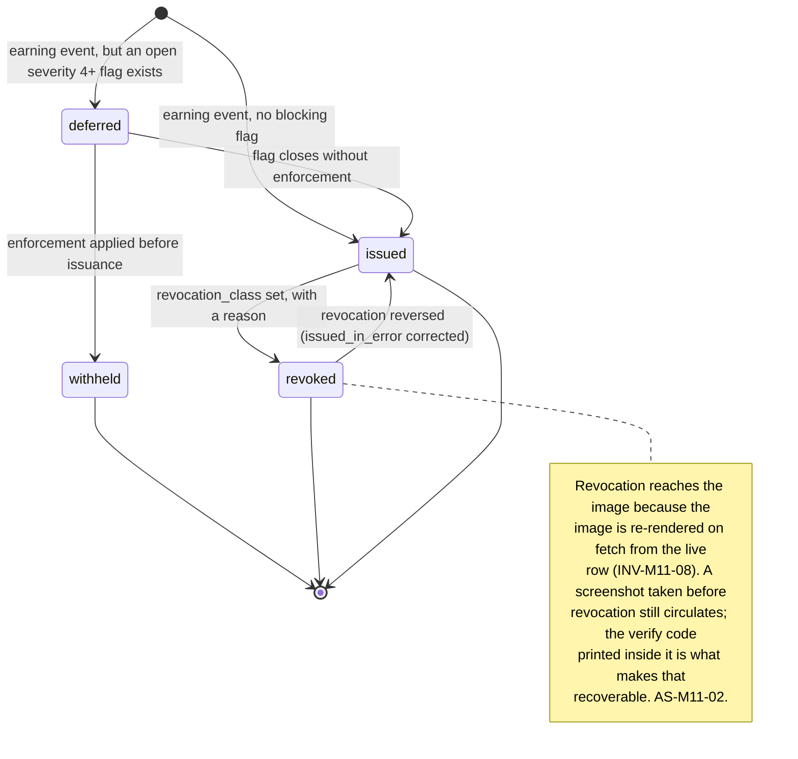
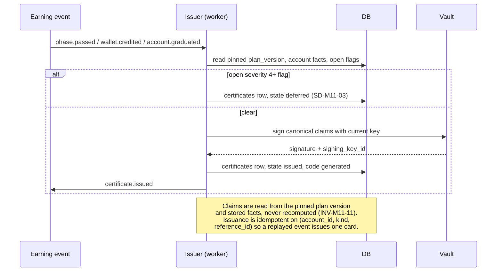
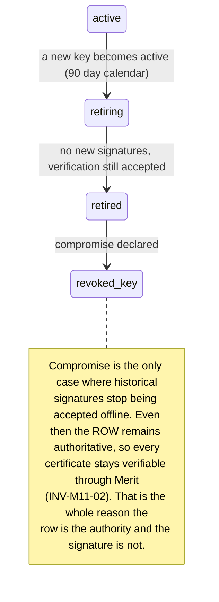

# M11: Certificates and Social Proof

Constitution section §4-ADDENDUM ("signed, verifiable pass/payout share cards"), Appendix B5 ten-section template, and the per-trade certificate input recorded from the Axcera brochure ([PROP_TECH_LANDSCAPE](../../research/PROP_TECH_LANDSCAPE.md) section 1.2, SHOULD rather than v1 MUST). Non-money path, and the module with the highest ratio of brand consequence to engineering difficulty in the corpus.

[M04](M04-trader-portal.md) already owns the `certificates` table (SD-M4-01) and the forged-card scenario (AS-M4-03), and this plan does not restate either. **M11 owns the system behind them**: issuance, signing and key lifecycle, rendering, the public verification surface, revocation semantics, and the social-proof surfaces that certificates make possible.

One sentence governs this module: **a certificate is a small, signed, revocable claim about one account on one day, and every temptation in this module is a temptation to make it bigger than that.**

The temptation is not hypothetical. A certificate that carried a lifetime total would be more shareable. A per-trade card showing a trader's best trade would be more shareable still. Each step makes the artifact more viral and less true, and Merit is the firm whose entire position is that its numbers do not flatter.

**Identifier conventions:** `INV-M11-nn` invariants, `SD-M11-nn` schema deltas, `CT-M11-nn` certificate kinds, `FM-M11-nn` failure modes, `AS-M11-nn` adversarial scenarios, `OQ-M11-nn` open questions, `DEP-M11-nn` dependencies.

---

## 1. Purpose and invariants

### 1.1 What this module is

The issuance and verification system for signed claims Merit makes about an account, plus the opt-in social surfaces built on them.

| ID | Kind | Claim | Status |
|---|---|---|---|
| CT-M11-01 | **Pass** | This account passed its evaluation on this trading day, on this plan at this size | v1 |
| CT-M11-02 | **Payout** | This account was paid this amount on this trading day, ordinal *n* of its ladder | v1 |
| CT-M11-03 | **Graduation** | This account completed its payout ladder | v1, and it is the ladder's public face alongside [M18](M18-graduation-track.md) |
| CT-M11-04 | **Per-trade** | This account took this trade, with entry, exit, size, and result | **Deferred, OQ-M11-01.** The Axcera brochure ships these; AS-M11-01 is the reason Merit should not, in the shape they ship |

Plus: the public verification page, the signing key lifecycle, the render pipeline, and the opt-in leaderboard surface reserved in [DATA_MODEL section 12](../architecture/DATA_MODEL.md) (`identities.display_name`, `.leaderboard_opt_in`).

### 1.2 What this module is not

| Not M11 | Whose job | Why the boundary is here |
|---|---|---|
| The trader's certificate screen | [M4](M04-trader-portal.md) SC-M4-08 | M11 issues and verifies. M04 renders the authenticated list and the share affordances |
| The `certificates` table | [M4](M04-trader-portal.md) SD-M4-01 | Approved there. M11 adds three deltas to it and owns nothing else about it |
| Aggregate published statistics | [M12](M12-transparency-platform.md) | A certificate is one account on one day. **A certificate system must never become an aggregate publisher**, because a total assembled from cards is a statistic with no method page (AS-M11-04) |
| Deciding an account is enforced | [M7](M07-risk-abuse.md) | M11 revokes on an enforcement event. It never originates one, and its revocation text is constrained by what the enforcement actually found (AS-M11-05) |
| Trustpilot review requests | [M12](M12-transparency-platform.md) | Adjacent and frequently confused. A review request is a solicitation with compliance obligations; a certificate is a signed claim. They are different objects with different lawyers |

### 1.3 Invariants

| ID | Invariant | Enforcement |
|---|---|---|
| INV-M11-01 | A certificate's claims are **minimal**: the account's plan, size, trading day, the kind-specific value, and nothing else | Claim schema per kind, validated at issuance. No identity, no email, no display name, no cumulative total, no lifetime figure. The smaller the claim, the less there is to forge usefully ([M04](M04-trader-portal.md) AS-M4-03) |
| INV-M11-02 | **The row is the authority; the image is a rendering.** Verification always resolves against `certificates`, never against the image or its signature alone | The verify page reads the row. An offline signature check is a convenience for third parties and is never the thing Merit's own surface trusts |
| INV-M11-03 | An unknown code returns "no certificate with this code", never "this is fake" | [M04](M04-trader-portal.md) AS-M4-03 as approved. The honest claim is the defensible one, and Merit cannot know that a card it did not issue is a forgery rather than a typo |
| INV-M11-04 | Every certificate carries the simulated-environment disclosure, in the image and on the verify page | Constitution section 6, [GLOSSARY](../GLOSSARY.md#sim-simulated-and-b-book). Rendered by the template, so a new kind cannot omit it by being new |
| INV-M11-05 | Certificate codes are unguessable and the verification endpoint is rate limited and non-enumerable | 128 bits of entropy, no sequence, no timing difference between known and unknown. **The verify page is an oracle about Merit's own book** and is treated as one (AS-M11-04) |
| INV-M11-06 | Every signature carries a `signing_key_id`, and rotating a key never invalidates a historical certificate | SD-M11-01. Key rotation is on the 90 day calendar ([SECURITY](../architecture/SECURITY.md) C-14), and a rotation that breaks every card ever issued is a rotation nobody will perform |
| INV-M11-07 | Revocation distinguishes **"the fact is not true"** from **"the account was later enforced"**, and the public text differs | SD-M11-02's `revocation_class`. Collapsing the two lets an enforcement retroactively deny an achievement that did happen, which is a claw-back in a different costume (AS-M11-05) |
| INV-M11-08 | A rendered image is re-generated on fetch from the live row, and its URL is short lived | The image is never a static artifact Merit keeps serving after the row changed. This is what makes revocation reach the surface that actually circulates (AS-M11-02) |
| INV-M11-09 | No certificate is issued for an account with an open severity 4+ flag, and issuance is **deferred rather than denied** | The account's achievement is real and the card can be issued when the flag closes. Deferral with a visible reason is the zero-denial posture applied to a non-money surface |
| INV-M11-10 | Leaderboard participation is **opt in**, reversible, and shows a display name that is not the trader's legal name | [DATA_MODEL](../architecture/DATA_MODEL.md)'s reserved columns. A leaderboard is a targeting list for paid-passing services if it is not (AS-M11-06) |
| INV-M11-11 | Every value on a certificate is read from the account's **pinned plan version** and its stored facts, never recomputed | [Parameter-status ruling](../decisions/gates/parameter-status-launch-candidates-versus-structural-rulings-founder-ruling-2026-08-14.md). A card issued in March must still say what was true in March after the plan is retuned in June |

---

## 2. Entities and schema deltas

M11 extends [M04](M04-trader-portal.md)'s approved `certificates` (SD-M4-01) and adds one table.

| ID | Table | Change | Why it is not optional |
|---|---|---|---|
| SD-M11-01 | `certificates` | add `signing_key_id text not null`, `code text not null unique`, `claims_schema_version integer not null` | INV-M11-06 and INV-M11-05. Without a key id, the first rotation makes every historical signature unverifiable, which means either the key is never rotated or the history is discarded, and both are worse than the column. `code` is the short unguessable token that appears in the image and resolves on the verify page; it is distinct from `id` so the public token can be rotated after an incident without rewriting the primary key. The schema version is what lets the claim shape evolve without making old cards unreadable |
| SD-M11-02 | `certificates` | add `revocation_class text null check in ('fact_untrue','account_enforced','issued_in_error','trader_request')` | INV-M11-07. `revoked_reason` alone is free text, and free text on a public page is how an enforcement gets described inconsistently twice. The class drives the published sentence; the free text stays internal (AS-M11-05) |
| SD-M11-03 | `certificates` | add `deferred_until timestamptz null`, `deferred_reason text null` | INV-M11-09. An achievement earned while a flag is open is still an achievement. Deferral needs a state, or the alternative is issuing a card Merit may have to revoke publicly within the week |
| SD-M11-04 | new `certificate_verifications` | `id`, `code_hash bytea`, `result check in ('valid','unknown','revoked','deferred')`, `ip_hash`, `user_agent_class`, `verified_at` | AS-M11-04. The verify endpoint is the only public oracle Merit operates about its own payout book, and an enumeration campaign is invisible without this table. Hashed inputs only, 90 day retention, and the rate of `unknown` is itself the signal ([M04](M04-trader-portal.md) already tracks the unknown-code rate as a metric) |

**Signing keys are not a table.** They live in the platform vault ([SECURITY](../architecture/SECURITY.md) C-14) with a key id recorded on each certificate. Merit stores the id and never the material, which is the same discipline applied to every other credential in the estate.

---

## 3. State machines

### 3.1 Certificate lifecycle

**`withheld` and `revoked` are different states on purpose.** Withheld means Merit never made the claim. Revoked means Merit made it and has since qualified it. A system that only had revoked would have to publish and then retract, which is strictly worse for both parties.

### 3.2 Issuance

**Issuance is triggered by the earning event, not by the trader asking.** A card that only exists when requested is a card that does not exist for the 80 percent of traders who never look, and the whole commercial point of this module is cheap virality among people who were not going to file a support ticket about a share graphic.

### 3.3 Key rotation

**The compromise case is why INV-M11-02 is written the way it is.** If the signature were the authority, a key compromise would force Merit to either invalidate its entire history of proofs or accept forged ones. Because the row is the authority, a compromise costs Merit an offline-verification convenience and nothing else.

---

## 4. API endpoints touched

| Endpoint | M11's role | Notes |
|---|---|---|
| `GET /accounts/:accountId/certificate?kind=` | Shares with [M4](M04-trader-portal.md) | Approved in [API_CONTRACT section 6](../architecture/API_CONTRACT.md). Returns the signed time-limited `image_url` and the public `verify_url`. M11 owns what is behind both |
| `GET /verify/:code` **NEW, public** | Owns | The verification page. No session, no enumeration, rate limited, constant-time lookup, writes `certificate_verifications` (SD-M11-04). Returns the signed claims for a valid code, the revocation class sentence for a revoked one, and INV-M11-03's exact wording for an unknown one |
| `GET /certificates/:code/image.png` **NEW, public** | Owns | Re-rendered on fetch from the live row (INV-M11-08). Cache lifetime measured in minutes, never in days, and a revoked certificate renders as revoked |
| `GET /certificates` **NEW** | Owns | The trader's own list, including `deferred` entries with their reason. Session scoped |
| `POST /admin/certificates/:id/revoke` **NEW** | Owns | `revocation_class` required, reason required, writes `admin_actions`. `owner` or `ops` |
| `PATCH /me/leaderboard` **NEW** | Owns | Opt in or out, and set a display name. Opt out takes effect on the next publish and removes historical entries (INV-M11-10) |
| `GET /public/leaderboard` **NEW, public** | Owns | Opt-in participants only, display names only, and the metric set decided in OQ-M11-03 |

---

## 5. Events emitted and consumed

| Event | When | Notes |
|---|---|---|
| `certificate.issued` **NEW** | issuance | `{ certificate_id, code, account_id, kind, claims, signing_key_id }`. Consumers: FEED, NOTIF, BI |
| `certificate.deferred` **NEW** | an open flag blocks issuance | `{ certificate_id, account_id, kind, flag_id, deferred_reason }`. Consumers: FEED, RISK |
| `certificate.revoked` **NEW** | revocation | `{ certificate_id, code, revocation_class, actor, reason }`. Consumers: FEED, EVID, ALERT at `fact_untrue` |
| `certificate.verify_anomaly` **NEW** | enumeration signature detected | `{ window, distinct_codes, unknown_rate, ip_hash_count }`. Consumers: ALERT, RISK. AS-M11-04 |
| `leaderboard.opt_changed` **NEW** | opt in or out | `{ identity_id, opted_in }`. Consumers: FEED, BI |

**Consumed:** `phase.passed` (CT-M11-01), `wallet.credited` (CT-M11-02, because [ADR-019](../decisions/ADR-019.md) makes the wallet credit the moment the trader experiences as being paid), `account.graduated` (CT-M11-03), `flag.status_changed` (deferral resolution), and `enforcement.applied` (revocation).

**One consumption choice worth stating.** The payout certificate fires on `wallet.credited`, not on `payout.settled`. Under the two-leg design the wallet credit is instant and irrevocable, and the external settlement may not happen for days or at all if the trader leaves the balance in the wallet. Issuing on external settlement would mean a trader who was paid has no card, which is exactly backwards.

---

## 6. Failure modes

| ID | Failure | Blast radius | Detection | Recovery |
|---|---|---|---|---|
| FM-M11-01 | Certificate issued for a fact that later proves untrue | Merit's own signed proof asserts something false | Replay self-audit divergence, correction ingest | Revoke with class `fact_untrue`, page. **This is the only revocation class that is an incident** (INV-M11-07) |
| FM-M11-02 | Revocation does not reach a circulating image | Merit's proof outlives the fact it proved | Image re-render on fetch (INV-M11-08); unknown-code and revoked-lookup rates | The verify code inside the image is the recovery path. A screenshot cannot be recalled and the design accepts that (AS-M11-02) |
| FM-M11-03 | Signing key compromised | Forged cards verify offline | Canary certificate, key-use monitoring | Declare, rotate, mark the key revoked. **Every real certificate stays verifiable** because the row is the authority (INV-M11-02, section 3.3) |
| FM-M11-04 | Verify endpoint enumerated | An outsider reconstructs Merit's payout book and can contradict or preempt [M12](M12-transparency-platform.md) | `certificate_verifications` rate and distinct-code counts, `certificate.verify_anomaly` | Unguessable codes make it infeasible; rate limits and the anomaly event make an attempt visible. AS-M11-04 |
| FM-M11-05 | Render pipeline outage or cost blowup | Cards do not render; a public endpoint becomes an expensive one | Render latency and per-render cost, plus a per-code render budget | Cache the rendered bytes keyed by `(code, row_version)`, so a re-render only happens when the row actually changed. INV-M11-08 costs nothing when nothing changed |
| FM-M11-06 | A deferred certificate is forgotten | A trader who did the work never receives their card | Oldest-deferred age metric | Deferral is a state with an owner and an age alarm, not a silent skip (INV-M11-09) |
| FM-M11-07 | Leaderboard exposes a trader who did not intend to be exposed | Harassment, targeting, and a privacy complaint | Opt-in only, and opt-out removes history | INV-M11-10. Opt-out is immediate and retroactive, because a leaderboard nobody can leave is a publication, not a feature |
| FM-M11-08 | A certificate's plan values drift after a config retune | A card issued in March says June's numbers | Claims are stored on the row at issuance, not joined at render (INV-M11-11) | Structurally prevented. The stored claim is the artifact |

---

## 7. Adversarial scenarios

**Seven listed, six novel.** The one marked "extends" sharpens [M04](M04-trader-portal.md)'s approved AS-M4-03 into the part that plan could not reach.

### AS-M11-01: The per-trade certificate is a cherry-picking machine with the firm's signature on it (NOVEL)

**Attack.** The adversary here is a competitor's feature list. The Axcera brochure ships per-trade certificates, and [PROP_TECH_LANDSCAPE](../../research/PROP_TECH_LANDSCAPE.md) records them as a SHOULD. A per-trade card lets a trader publish one trade: entry, exit, size, result. Its only use is to publish the **best** one. Merit would be operating a machine whose sole function is selecting a favorable sample, signing it, and putting the firm's name on the output.

**Why this is worse for Merit than for the firm that shipped it.** Merit's entire commercial position, and [M12](M12-transparency-platform.md)'s whole existence, is that its published numbers are computed rather than selected. A signed cherry-picked trade is the exact opposite proposition, and a competitor pointing at it is not making an unfair argument. Worse, the artifact is genuinely useful to the people Merit least wants to help: **paid passing services and signal sellers** ([dossier item 3](../../research/ADVERSARY_DOSSIER.md)) need credible proof of skill to sell, and a firm-signed winning trade is the most credible artifact available to them. Merit would be issuing sales collateral to its own adversaries, at no cost, on request.

**Numbers, because the asymmetry is the argument.** A trader with a 40 percent win rate over 200 trades has roughly 80 winners to choose from. The card shows one. Nothing on it is false and the impression it creates is unrelated to the account's actual performance.

**Counter, and it is a scoping decision rather than a control.**
- **Per-trade certificates are deferred (CT-M11-04, OQ-M11-01), and if they ship they ship with context.** The only defensible shape is a card that shows the trade **alongside the account's own aggregate for the same period**: win rate, trade count, and net result. That makes the artifact honest and makes it far less attractive to publish, which is the correct outcome and is also why competitors ship the other shape.
- **What Merit ships instead is the account-level card it already has.** A pass, a payout, and a graduation are facts about a whole account over its whole life, which is a sample nobody selected.
- **[M13](M13-trader-analytics-journal.md)'s per-account performance breakdown serves the legitimate need** the per-trade card was reaching for, privately, where a trader can learn from a trade without publishing it.
- **The bright line, stated so it survives the next brochure:** Merit signs facts about accounts and periods, never facts about selected events. EC-090, GS-155.

### AS-M11-02: Revocation cannot reach a screenshot (NOVEL, extends M04 AS-M4-03)

**Attack.** [M04](M04-trader-portal.md) AS-M4-03 establishes revocation and the verify page. The gap that plan could not close is that **the image is what circulates and the verify page is what is authoritative**, and almost nobody clicks through. A trader is paid, shares the card, is later closed for chargeback or enforcement, and Merit revokes. The row says revoked. The verify page says revoked. The PNG is on three social platforms and in a Telegram group, unchanged, forever, and it is a genuine Merit artifact with a genuine Merit signature.

**Why the obvious fix does not work.** Short-lived image URLs stop Merit serving the old image; they do not stop a copy that already exists. Nothing can. The design has to be honest about that and optimize for the case that is recoverable.

**Counter, four parts, and the first is the one that matters.**
1. **The verification code is rendered inside the image**, prominently, as a short human-typeable token next to the Merit mark. A screenshot therefore carries its own falsification path. Anyone who cares enough to be persuaded by the card can check it in ten seconds, and the people who matter in a dispute (a journalist, a counterparty, a prospective trader who is suspicious) are exactly the people who will.
2. **Images re-render on fetch from the live row** (INV-M11-08) with a cache lifetime in minutes, so every surface that hot-links rather than copying corrects itself. That covers embeds, link previews, and OG unfurls, which is a large share of real circulation.
3. **Revocation is proportionate** (INV-M11-07). Most revocations are `account_enforced`, and the published sentence for that class does not say the payout did not happen, because it did. Over-claiming on revocation is how a firm turns a modest correction into a fight.
4. **The unknown-and-revoked lookup rate is monitored** ([M04](M04-trader-portal.md) already names the metric), because a spike means a revoked or forged card is circulating right now, which is actionable while it is happening. GS-156.

### AS-M11-03: The rotation that quietly stops happening because it breaks history (NOVEL)

**Attack.** The adversary is the ops calendar. [SECURITY](../architecture/SECURITY.md) C-14 puts credentials on a 90 day rotation. If certificate signatures carry no key id, rotating the signing key makes every previously issued card fail an offline signature check. The first time somebody notices, the rotation gets skipped "until we sort out the certificate thing", and then it gets skipped again. Eighteen months later Merit is signing its public proofs with a key that has been in the vault since launch, has been present in every deploy since, and has been handled by every process that ever touched the vault.

**Why it is a real risk rather than a hygiene note.** This is the exact mechanism by which long-lived signing keys survive in real systems: not a decision to keep them, but a rotation whose side effect nobody wanted to own. And a compromised certificate signing key is unusually damaging for Merit specifically, because the forged artifact is *proof that Merit paid somebody*, which is the single most valuable lie available in this market.

**Counter.**
- **`signing_key_id` on every certificate** (SD-M11-01, INV-M11-06), so verification selects the key that signed that row and rotation costs nothing historically.
- **Retiring is a state, not a deletion** (section 3.3). A retired key signs nothing new and verifies everything old.
- **The row is the authority** (INV-M11-02), so even a fully revoked key leaves every genuine certificate verifiable through Merit. The compromise case costs an offline convenience rather than the history.
- **The rotation is tested by the drill, not by intention.** The quarterly key-rotation drill ([SECURITY](../architecture/SECURITY.md) section 7) includes a certificate rotation with an assertion that a card issued under the previous key still verifies. A rotation nobody has rehearsed is a rotation nobody will perform under pressure. GS-157.

### AS-M11-04: The verification page is an oracle about Merit's own book (NOVEL)

**Attack.** `GET /verify/:code` is public, unauthenticated, and answers a yes-or-no question about whether Merit issued a given claim. If codes are short, sequential, or drawn from a small space, an attacker enumerates them and harvests every certificate Merit has ever issued: every pass, every payout, with amounts, plans, sizes, and dates.

**What they do with it, and this is the part that makes it a strategic problem rather than a privacy one.** They compute Merit's real pass rate, payout volume, and average payout **independently**, before or against whatever [M12](M12-transparency-platform.md) publishes. A competitor with that dataset can contradict Merit's transparency page, and the contradiction is credible because it is built from Merit's own signed artifacts. The firm whose differentiator is voluntary disclosure would be arguing about its own numbers with someone holding a derivation of them.

**And a smaller, nastier version.** Certificates carry plan, size, and date. Combined with a public Discord handle or a shared screenshot, an enumerated corpus lets an outsider link trading outcomes to people, which is a re-identification risk on a population that includes people who did badly.

**Counter, and the first item is the whole defense.**
1. **128 bits of entropy, no sequence, no structure** (INV-M11-05). The code space is not walkable, which makes the attack infeasible rather than merely rate limited.
2. **Constant-time response for known and unknown codes**, so timing does not become the oracle the code space is not.
3. **Rate limits per IP and per ASN, plus `certificate_verifications`** (SD-M11-04) and the `certificate.verify_anomaly` event, so an attempt is visible even though it cannot succeed. The signature to watch is a high distinct-code rate with a near-total unknown rate, which no legitimate traffic produces.
4. **Minimal claims** (INV-M11-01), so even a fully successful harvest yields facts about accounts and never about people.
5. **A stated position, because this scenario cuts the other way too:** if an outsider ever does derive an aggregate from certificates and it disagrees with [M12](M12-transparency-platform.md), Merit publishes the method difference rather than disputing the arithmetic. M12's numbers have a published method precisely so this conversation is winnable. EC-091, GS-158.

### AS-M11-05: Revocation as a retroactive denial (NOVEL)

**Attack.** The adversary is Merit under pressure, which is the same adversary as [M05](M05-payout-system.md) AS-M5-04. A trader passes, is paid, and shares both cards. Months later the account is closed for a ToS violation. The instinct is to revoke everything, and the revocation page says "this certificate is no longer valid".

**Why that is a real harm rather than a wording quibble.** The pass happened. The payout happened and, under the never-claw-back promise, the money is the trader's permanently. Revoking the proof of a thing that remains true is a **retroactive denial of an achievement**, and it is precisely the shape of the behavior Merit's zero-denial posture exists to make impossible. A trader can accept an enforcement and still, correctly, feel robbed by that page. Publicly, it also invites the reading that Merit revokes proofs when a relationship sours, which is unfalsifiable if the revocation text is generic.

**Counter.**
- **`revocation_class`** (SD-M11-02, INV-M11-07) with four values and four distinct public sentences:
  - `fact_untrue`: the claim was wrong. This is an incident (FM-M11-01) and the page says the claim was issued in error and is withdrawn.
  - `account_enforced`: **the claim stands and the account was later closed under a named ToS clause.** The page says exactly that. It does not say the certificate is invalid, because it is not.
  - `issued_in_error`: a system fault, reversible.
  - `trader_request`: the trader asked, and the page says only that it was withdrawn at the holder's request.
- **The free-text reason stays internal**; the class picks the published sentence. This is the same two-tier discipline the batch 1 gate applied to evidence packs, and for the same reason: consistency in what the public sees is a control, not a nicety.
- **Enforcement never revokes a payout certificate for `fact_untrue`.** The payout happened. GS-159.

### AS-M11-06: The leaderboard is a shopping list (NOVEL)

**Attack.** [DATA_MODEL](../architecture/DATA_MODEL.md) reserves `display_name` and `leaderboard_opt_in` for leaderboards and contests, and every competitor has one. A public leaderboard of top-performing funded traders is, from the other side, a curated and continuously updated list of **the most valuable targets in the estate**: the accounts with the largest balances, the traders most worth impersonating, and the people a paid-passing service most wants to recruit or advertise against ([dossier item 3](../../research/ADVERSARY_DOSSIER.md)).

**Three concrete uses, none of which require breaking anything.** Recruit the top names into an account-management arrangement, which is now explicitly prohibited by the copy-trading clause but is only detectable after it starts. Target them for account takeover, since a leaderboard tells an attacker exactly which sessions are worth stealing. Or simply advertise against them: "our service passed three of Merit's top ten".

**Counter, and the honest position is that this is a product decision with a security cost.**
- **Opt in, reversible, retroactive on opt out** (INV-M11-10). Nobody appears who did not choose to, and leaving removes history rather than freezing it.
- **Display names, never legal names**, and no plan size on the public entry, because size is the field that turns a ranking into a target list ordered by value.
- **Rank and relative performance, not absolute balances.** A leaderboard can be motivating without publishing how much money is behind each name.
- **Opt-in status is a risk signal, not a risk factor**: [M7](M07-risk-abuse.md) treats a leaderboard participant's ATO exposure as elevated for the purposes of session and destination-change monitoring, which is cheap and is the right response to a self-selected high-value population.
- **OQ-M11-03 asks whether it ships at all at launch.** The recommendation is that it does not: it is a retention feature with a security cost, in a launch quarter whose retention problem is not yet measured. EC-092, GS-160.

### AS-M11-07: Certificates become an aggregate publisher by accident (NOVEL)

**Attack.** Nobody decides this either. A trader's certificate list shows three payout cards, so a "lifetime paid" total is one addition away and is obviously nice. A profile page shows a trader's cards, so a count is obviously nice. An affiliate wants a widget showing "Merit has issued 4,102 payout certificates", which is true and is obviously nice. Each step is small. At the end of them, M11 is publishing aggregate statistics about Merit's payout book, from a system with no method page, no trailing window, no sample-size floor, and no reconciliation, in direct competition with [M12](M12-transparency-platform.md), which has all four.

**Why it is dangerous specifically here.** A count of issued certificates is **not** a count of payouts: cards are deferred (INV-M11-09), withheld, revoked, and issued per ladder ordinal. Any total derived from them is subtly wrong in a direction nobody has characterized, and it would be published under the firm's most trust-laden surface. And once it exists, it will be quoted against M12's figure, which is AS-M10-02's failure with a public audience instead of an internal one.

**Counter.**
- **A hard scope rule, stated as an invariant boundary in section 1.2:** M11 issues and verifies individual claims. **It never sums, counts, or averages anything for publication.** Not on the verify page, not on a profile, not in a widget, not in an API response.
- **The trader's own list may show their own totals**, because a trader summing their own cards is not a published statistic and they can already do the arithmetic. Nothing public aggregates.
- **Any request for a public aggregate routes to [M12](M12-transparency-platform.md)**, which will publish it with a method, a window, and a sample-size floor, or will decline to. That is the entire reason M12 exists as a separate module rather than as a page in this one. EC-093, GS-161.

---

## 8. Test plan

### 8.1 Suites

| Suite | Prefix | Count | Runs | Blocks |
|---|---|---|---|---|
| Issuance: triggers, idempotency, deferral, claim minimality | `M11-I-nn` | 12 | every commit | merge |
| Signing and verification, including cross-key-rotation | `M11-S-nn` | 8 | every commit | merge |
| Revocation classes and their published sentences | `M11-R-nn` | 7 | every commit | merge |
| Render pipeline: disclosure presence, code presence, live-row reflection | `M11-D-nn` | 6 | every commit | merge |
| Verify endpoint: enumeration resistance, constant time, rate limits | `M11-V-nn` | 6 | every commit | merge |
| Leaderboard opt-in, opt-out retroactivity, field exclusion | `M11-L-nn` | 5 | every commit | merge |
| Negative authz (D5) | `M11-N-nn` | 4 | every commit | merge |
| Key-rotation drill assertion (old card still verifies) | `M11-K-01` | 1 | quarterly, in the drill | drill gate |
| Golden fixtures | `GS-nnn` | 7 owned (GS-155 to GS-161) | every commit | merge |

### 8.2 Named scenarios owned by this module

| ID | Scenario | Pins |
|---|---|---|
| GS-155 | A per-trade certificate is requested | v1 has no such kind. If the deferred kind is later enabled, the card renders the account's period aggregate alongside the trade or it does not render. AS-M11-01 |
| GS-156 | A shared payout card is revoked | The live re-render shows revoked, the verify code inside the image resolves to the revocation class sentence, and the sentence for `account_enforced` does not claim the payout did not happen. AS-M11-02 |
| GS-157 | Key rotation with historical certificates outstanding | A card signed under the retired key still verifies; a card signed under a **revoked** key still verifies through the row. AS-M11-03 |
| GS-158 | Enumeration attempt against the verify endpoint | Known and unknown codes respond in indistinguishable time, rate limits engage, and `certificate.verify_anomaly` fires on the distinct-code and unknown-rate signature. AS-M11-04 |
| GS-159 | Enforcement on an account with a pass and a payout card | Both revoke as `account_enforced` with the standing-claim sentence. Neither revokes as `fact_untrue`. AS-M11-05 |
| GS-160 | Leaderboard opt out | The identity disappears from the current publish **and** from historical entries; no plan size was ever exposed. AS-M11-06 |
| GS-161 | Any public surface attempts an aggregate | The response contains no count, sum, or average across accounts. The trader's own list may total the trader's own cards. AS-M11-07 |

### 8.3 Coverage rule

**Every certificate kind has a claim-schema test asserting the exact field set, and a negative test asserting that identity, email, display name, and any cumulative figure are absent.** Minimality is the module's primary control and an allowlist test is the only way to keep a helpful addition from becoming a disclosure.

---

## 9. Observability

### 9.1 Metrics

| Metric | Why it matters |
|---|---|
| Certificates issued per kind per day, and share of eligible events | Whether the virality mechanism is actually reaching people |
| `certificate.verify_lookups` and the **unknown-code rate** | [M04](M04-trader-portal.md)'s named metric. A rising unknown rate means forged or revoked cards are circulating now |
| Distinct codes per source per hour | AS-M11-04's enumeration signature, which the volume metric alone would miss |
| Deferred count and oldest-deferred age | FM-M11-06. A trader who earned a card and never got it is a quiet failure |
| Revocations by class | AS-M11-05. A rise in `fact_untrue` is an incident trend; a rise in `account_enforced` is an enforcement trend, and conflating them would hide both |
| Render latency p95 and per-render cost | FM-M11-05. A public render endpoint is a cost surface as well as a load one |
| Share-affordance click-through per kind | The only number that says whether any of this is worth its maintenance |
| Leaderboard opt-in rate | AS-M11-06's exposed population size, and the input to OQ-M11-03 |

### 9.2 Alerts

| Alert | Threshold | Severity |
|---|---|---|
| Revocation with class `fact_untrue` | any | **page**. Merit signed something untrue |
| Verify enumeration signature | any | **page** |
| Unknown-code rate | above the configured baseline | warn |
| Oldest deferred certificate | over 10 business days | warn, and it is a queue somebody owns |
| Signing failure or vault unavailable | any | **page**. Issuance defers rather than issuing unsigned |
| Render error rate | over 2 percent | warn |
| A certificate row's claims not matching its signature | any | **page**. Tamper indication on an append-only-by-policy table |

### 9.3 Dashboard

M11 supplies a card on [M6](M06-admin-ops-console.md): issuance by kind, deferred age, revocations by class, and the verify unknown rate. **If only one number could be shown it would be the unknown-code rate**, because it is the only one that reports on artifacts Merit no longer controls.

---

## 10. Open questions for the founder

**OQ-M11-01. Do per-trade certificates ship, and in what shape?** The Axcera brochure ships them and [PROP_TECH_LANDSCAPE](../../research/PROP_TECH_LANDSCAPE.md) records them as a SHOULD. AS-M11-01 argues they are a firm-signed cherry-picking machine whose most enthusiastic users are the paid-passing services Merit is built against. Proposed: **do not ship in v1.** If they ship later, the only defensible shape is a card that renders the trade **with the account's aggregate for the same period**, which is honest and is deliberately less attractive to publish. This is a brand decision rather than an engineering one, and it should be made explicitly rather than by a backlog item quietly acquiring an estimate.

**OQ-M11-02. What exactly does the `account_enforced` revocation sentence say?** AS-M11-05 fixes the principle: the claim stands and the account was later closed under a named ToS clause. The wording is a legal and brand question. Proposed draft, for counsel: *"This certificate records a real event. The account it refers to was later closed under section X of the Terms of Service."* Naming the clause is deliberate and follows the same reasoning as [M07](M07-risk-abuse.md)'s enforcement posture: an enforcement a trader can read in advance is one they can dispute on the merits.

**OQ-M11-03. Does the leaderboard ship at launch?** AS-M11-06 shows it is a retention feature with a real security cost and a real targeting cost. Proposed: **no at launch**, revisit once retention is measured rather than assumed, and if it ships, ship it with ranks rather than balances and with [M7](M07-risk-abuse.md) treating participants as elevated ATO exposure. The columns stay reserved either way, which is what the [DATA_MODEL](../architecture/DATA_MODEL.md) reservation bought.

**OQ-M11-04. Should a certificate be issuable for an evaluation pass on an account that later breached?** The pass happened; the account is now closed. Proposed: **yes, and it is not revoked**, on the same reasoning as `account_enforced`: a fact that occurred stays true. This is worth an explicit ruling because the alternative reading, that a certificate should describe current status rather than a past event, is defensible and would change the whole module's semantics. Recommendation is firmly the first reading: **a certificate is a dated claim about a day, not a statement about now**, and every invariant in this plan follows from that.

---

### Dependencies on other modules

| ID | Dependency | Owner | Consequence if unmet |
|---|---|---|---|
| DEP-M11-01 | The `certificates` table exists as approved (SD-M4-01) with M11's four deltas | M4 | There is nothing to verify against, and a verifiable share card that verifies nothing is worse than no card |
| DEP-M11-02 | `wallet.credited`, `phase.passed`, and `account.graduated` are emitted reliably and are replay-safe | M1, M5 | Issuance is either missed or duplicated, and idempotency has no anchor |
| DEP-M11-03 | M7 exposes open-flag severity readably at issuance time and emits `enforcement.applied` | M7 | INV-M11-09's deferral cannot evaluate, and revocation has no trigger |
| DEP-M11-04 | The platform vault provides signing with a stable key id and a retire-rather-than-delete lifecycle | INFRA, SECURITY | AS-M11-03's rotation trap opens, and the 90 day calendar quietly stops covering this key |
| DEP-M11-05 | M12 is the only publisher of any cross-account aggregate | M12 | AS-M11-07 happens by accretion, and Merit publishes two different payout totals |
| DEP-M11-06 | M13 provides the private per-account performance view | M13 | The legitimate need behind per-trade certificates has no home, and AS-M11-01's pressure returns with a better argument |
