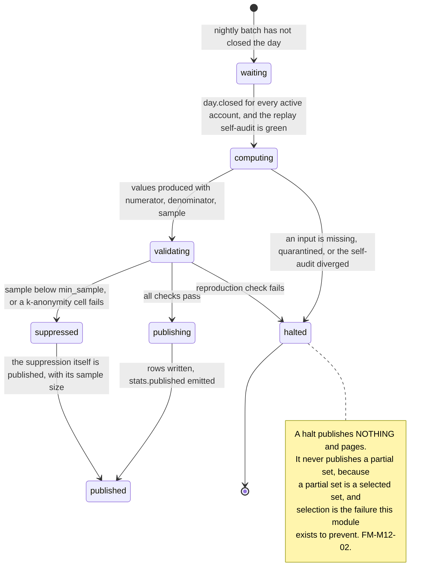
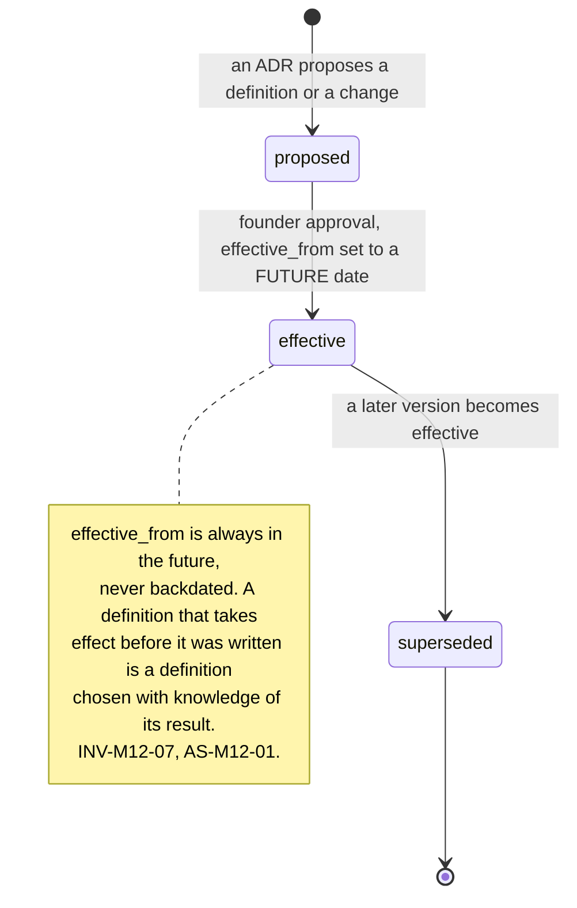
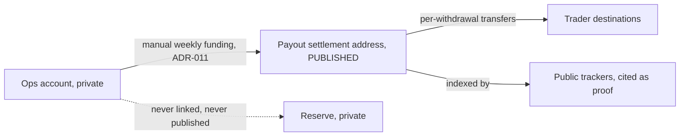
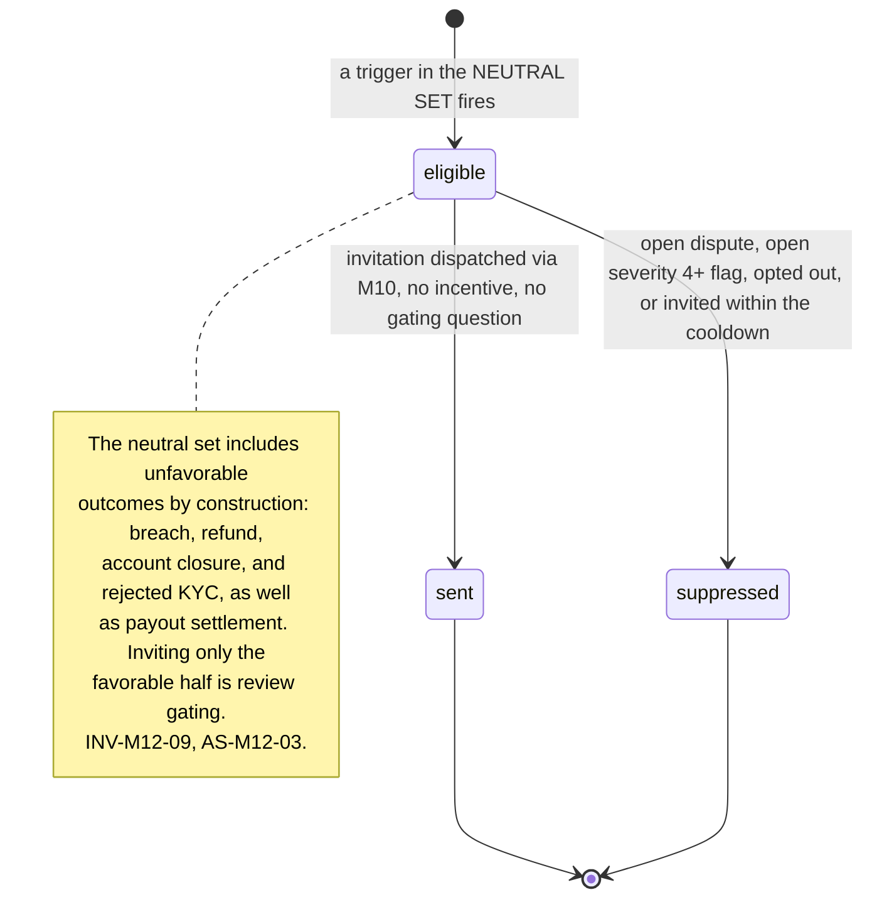

# M12: Transparency Platform

Constitution section M9's published stats page, section §4-ADDENDUM's M12 ("public trailing pass rates, payouts paid, on-chain proof links, auto-computed trust moat"), [EVENTS section 12](../architecture/EVENTS.md) open question 2, Appendix B5 ten-section template, and the Trustpilot auto-review-request input recorded from the Axcera brochure with a **mandatory compliance check** ([PROP_TECH_LANDSCAPE](../../research/PROP_TECH_LANDSCAPE.md) section 1.2).

**This is the launch differentiator, and the research says so precisely.** [TOP10_FIRMS](../../research/TOP10_FIRMS.md) section 1B found that **TradeDay is the only top-ten firm publishing an evaluation pass rate** (36 percent, January to June 2026) and that it publishes it **as a blog figure**. Nobody auto-publishes trailing pass rates, payout totals, and average payout computed from the engine itself. The gap between a blog post and a computed, versioned, continuously refreshed surface is the entire product of this module, and it is the one competitive position Merit can take on day one that no competitor can copy without rebuilding their data plane.

One sentence governs this module: **every number Merit publishes about itself must be computed by the same engine that decides money, from a versioned definition, over a stated window, with a stated sample, and it must be capable of being unflattering.**

The last clause is the load-bearing one. A transparency surface that can only produce good numbers is a marketing page with extra steps, and the market will work that out. **The value of publishing is created entirely by the credible possibility of publishing something bad**, which means the design constraint is not accuracy but **precommitment**: the definitions, the windows, the sample floors, and the publication schedule must all be fixed before anyone knows what the numbers will say.

**Identifier conventions:** `INV-M12-nn` invariants, `SD-M12-nn` schema deltas, `ST-nn` published statistics, `FM-M12-nn` failure modes, `AS-M12-nn` adversarial scenarios, `OQ-M12-nn` open questions, `DEP-M12-nn` dependencies.

---

## 1. Purpose and invariants

### 1.1 What this module is

Three surfaces and one machine.

| Surface | What it is |
|---|---|
| **The public stats page** | The `ST-nn` registry below, auto-computed nightly from closed-session data, each with a window, a sample, an as-of trading day, and a link to its method page |
| **The method pages** | One per statistic. The exact definition, the numerator, the denominator, every exclusion, the version history, and the reason for each change |
| **Proof links** | Independent corroboration a reader can check without trusting Merit, including the on-chain settlement trail (section 3.4) and [M11](M11-certificates-social-proof.md)'s per-certificate verification |
| **The review-request flow** | Trustpilot invitations, on a compliance-constrained trigger set (section 3.5). This is the surface with the most legal exposure per line of code in the corpus |

The machine underneath is a **nightly statistics run** that reads the same authoritative tables the engine reads, computes each registered definition, writes an immutable `published_statistics` row, and never overwrites one.

### 1.2 The statistic registry, v1 candidate set

[EVENTS section 12](../architecture/EVENTS.md) left the launch set open and named four candidates. This plan proposes seven and argues for excluding three obvious ones.

| ID | Statistic | Window | Grain | Notes |
|---|---|---|---|---|
| ST-01 | **Evaluation pass rate** | trailing 90 trading days | per plan, and lineup total | The headline. Its denominator is the entire argument (AS-M12-01) |
| ST-02 | **Funded-to-first-payout rate** | trailing 90 trading days | per plan | The number that says whether funded accounts actually get paid, which is the question the pass rate does not answer |
| ST-03 | **Total paid to traders** | trailing 30, trailing 90, and lifetime | lineup total | In dollars. Corroborated by the on-chain trail (section 3.4) |
| ST-04 | **Average and median payout** | trailing 90 trading days | per plan | Median is published alongside the mean deliberately: a mean alone is the number a single large payout distorts |
| ST-05 | **Time from payout request to wallet credit** | trailing 90 trading days | lineup, p50 and p95 | Under [ADR-019](../DECISIONS.md) this is effectively zero and it is Merit's strongest verifiable claim |
| ST-06 | **Time from withdrawal request to external settlement** | trailing 90 trading days | lineup, p50 and p95 | The honest companion to ST-05. Publishing the fast leg without the slow one is [M09](M09-marketing-site.md) AS-M9-06 in statistical form |
| ST-07 | **Share of eligible payout requests approved** | trailing 90 trading days | lineup | Structurally 100 percent, because [M05](M05-payout-system.md) INV-M5-01 has no denial path. See AS-M12-05 for why publishing a constant is both the best and the most suspicious claim available |

**Three deliberately excluded, and the exclusions are published on the method index with their reasons**, because an unexplained absence is read as concealment.

| Excluded | Why |
|---|---|
| **Per-plan loss ratio** | It is [M6](M06-admin-ops-console.md)'s circuit-breaker input. Publishing it tells a ring which plan is currently being beaten, in real time, from Merit's own site (AS-M12-04) |
| **Reserve coverage ratio** | Merit's liquidity position is not a trust signal, it is a target. A falling RCR published live is a bank-run mechanic |
| **Any per-trader or per-account figure** | [M11](M11-certificates-social-proof.md) covers individual claims with consent. Aggregates here are never small enough to identify anyone (INV-M12-06) |

### 1.3 What this module is not

| Not M12 | Whose job | Why the boundary is here |
|---|---|---|
| Rendering the stats page | [M9](M09-marketing-site.md) | M12 publishes an aggregate; M9 renders it with its window attached and computes nothing (M9 INV-M9-06) |
| Internal analytics | [M10](M10-integrations.md) Metabase, [M6](M06-admin-ops-console.md) | An internal question is not a published number, and the reconciliation between them runs in M10's direction, not this one (M10 AS-M10-02) |
| Individual certificates | [M11](M11-certificates-social-proof.md) | And M11 never aggregates (M11 AS-M11-07). The two modules are each other's boundary |
| Deciding what the engine computes | [M1](M01-rules-engine.md) | M12 reads `rule_states`, `payout_requests`, `ledger_entries`, and `accounts`. It contains no rule and re-derives no gate |
| Marketing claims | [M9](M09-marketing-site.md), [M8](M08-affiliate-system.md) | M12 publishes figures with methods. Turning one into a comparative claim is a different act with different rules (AS-M12-08) |

### 1.4 Invariants

| ID | Invariant | Enforcement |
|---|---|---|
| INV-M12-01 | Every published number is computed from **closed-session authoritative data only**, never from the indicative tier | [ADR-020](../DECISIONS.md)'s hard rule extended to publication. A public statistic derived from a live cache is a public statistic that can be wrong for a reason nobody can reconstruct |
| INV-M12-02 | Every statistic has a **versioned definition** with a public method page, and every published value records the definition version that produced it | SD-M12-01. This is the module's central control: without it, "our pass rate is 41 percent" is a claim about arithmetic nobody can check (AS-M12-01) |
| INV-M12-03 | A published value is **immutable**. Corrections are published as a new value with a **restatement note**, and the superseded value stays visible | SD-M12-02's `restatement_of`. A transparency page that silently edits history is worth less than no page (AS-M12-06) |
| INV-M12-04 | Every value carries its **window, sample size, and as-of trading day**, in the same visual unit as the number | [M09](M09-marketing-site.md) INV-M9-06 and AS-M9-03. Binding on the page, the API, the OG image, and every social card |
| INV-M12-05 | Below a per-statistic **minimum sample**, the surface publishes "not yet meaningful" **with the sample size shown**, never a number and never a blank | AS-M12-07. Showing the sample while withholding the ratio is what distinguishes a stated limitation from a concealment |
| INV-M12-06 | No published aggregate has a cell small enough to identify an account or an identity | k-anonymity floor per grain, checked at publish. A per-plan-per-size-per-week pass rate on a new plan is a statistic about four people |
| INV-M12-07 | **Definitions are frozen before the data exists.** A definition change requires an ADR, and it applies **forward only** | AS-M12-01. The whole value of the surface is precommitment, and a definition tuned after seeing the number is not a definition |
| INV-M12-08 | The publication schedule is fixed and automatic. There is **no approval step** between computation and publication | AS-M12-07. A human who can withhold a bad number is a human who will be asked to, and the absence of the step is the control. Failures halt publication loudly rather than publishing selectively (FM-M12-02) |
| INV-M12-09 | A review request is sent on a **neutral trigger set** that includes unfavorable outcomes, never on a favorable outcome alone | Section 3.5. Inviting only traders who were just paid is review gating, and it is prohibited by Trustpilot's guidelines and by the FTC's rule on review suppression (AS-M12-03) |
| INV-M12-10 | No review request offers, implies, or is contingent on any incentive | Same section. An incentivized review is a prohibited review, and for Merit specifically it is also a purchased opinion published under a transparency brand |
| INV-M12-11 | On-chain proof links point to **payout-only settlement addresses** that hold no treasury balance and reveal no reserve position | Section 3.4, AS-M12-02. Proving payouts must not publish the firm's liquidity |
| INV-M12-12 | Every statistic is reproducible: recomputing a published value from the same as-of data yields the same number | Replay determinism ([GLOSSARY](../GLOSSARY.md#replay-determinism)) applied to statistics. A number nobody can reproduce is an assertion |

---

## 2. Entities and schema deltas

Four deltas. Two of them exist only so that a number can be defended a year later, which is the only timeframe that matters here.

| ID | Table | Change | Why it is not optional |
|---|---|---|---|
| SD-M12-01 | new `statistic_definitions` | `id`, `stat_code`, `version integer`, `title`, `numerator_spec text`, `denominator_spec text`, `exclusions text[]`, `window_spec`, `grain`, `min_sample integer`, `method_body_mdx`, `adr_ref text null`, `effective_from date`, `superseded_by uuid null` | INV-M12-02 and INV-M12-07. A pass rate is not a number, it is a **choice of denominator**, and the choices are all defensible and move the answer by tens of points (AS-M12-01). Storing the definition as a versioned row with an ADR reference is what converts "we compute it honestly" from a promise into an artifact. `min_sample` lives here rather than in code because it is a publication policy, not an implementation detail |
| SD-M12-02 | new `published_statistics` | `id`, `stat_code`, `definition_version`, `window_start_day`, `window_end_day`, `as_of_trading_day`, **`measure statistic_measure`**, **`value bigint`**, **`value_unit statistic_unit`**, `numerator`, `numerator_unit`, `denominator`, `sample_size`, `grain_key text null`, `suppressed_reason text null`, `restatement_of uuid null`, `computed_at`, `input_digest bytea` | INV-M12-03 and INV-M12-12. Append only, never updated. `numerator` and `denominator` are stored alongside the ratio because a published ratio without its components cannot be checked by the reader, and a reader who cannot check is being asked to trust, which is the thing this module exists to avoid. `input_digest` makes reproduction verifiable rather than merely possible. **Amended by [ADR-031](../DECISIONS.md)**: `value_numeric numeric` is `value bigint` with a mandatory `value_unit`, because all seven statistics are exactly representable as integers and for ST-03 and ST-04 the column holds money on a public surface. **Amended by [ADR-032](../DECISIONS.md)**: `measure` distinguishes the two figures ST-04, ST-05 and ST-06 each publish, and joins the window unique key |
| SD-M12-03 | new `review_requests` | `id`, `identity_id`, `trigger_event`, `trigger_class check in ('favorable','unfavorable','neutral')`, `sent_at`, `suppressed_reason null`, `provider_ref null` | INV-M12-09. The compliance question a regulator or Trustpilot asks is not "did you incentivize" but **"who did you invite, and were they a representative set"**. That question is answerable only from a table that records the trigger class of every invitation, including the unfavorable ones (AS-M12-03) |
| SD-M12-04 | new `proof_links` | `id`, `kind check in ('onchain_address','onchain_tx','third_party_tracker','certificate_verify')`, `label`, `url`, `scope_note`, `enabled`, `added_by`, `added_at` | INV-M12-11 and AS-M12-02. An on-chain address published as proof is a permanent, irrevocable disclosure, and the decision to publish one needs an audited row with a written scope note rather than a link somebody added to a template |

---

## 3. State machines

### 3.1 The nightly statistics run



**The dependency on the replay self-audit is deliberate and is the strongest quality gate available.** [M01](M01-rules-engine.md) Appendix B re-derives every `rule_states` row nightly and halts payout eligibility on divergence. M12 will not publish a statistic computed over a day whose self-audit diverged, because the statistic would be computed from state the engine itself does not currently vouch for.

### 3.2 Definition lifecycle



**Historical values are never recomputed under a new definition.** When a definition changes, the method page shows both, the published series shows the version boundary, and any chart drawn across it renders the discontinuity explicitly rather than smoothing it. A transparency series with an invisible methodology break is the most sophisticated way to mislead available to a firm that computes its own numbers.

### 3.3 Restatement

```mermaid
sequenceDiagram
    participant Corr as Backdated correction (B4 #5)
    participant Batch as Replay
    participant M12
    participant Page
    Corr->>Batch: a fill correction changes a closed trading day
    Batch->>M12: rule_states re-derived; a published window is now stale
    M12->>M12: recompute affected windows under their ORIGINAL definition version
    alt material change
        M12->>Page: publish a NEW value with restatement_of set
        M12->>Page: superseded value stays visible with a restatement note
    else immaterial
        M12->>Page: record the recomputation, publish no new value, note it in the method page changelog
    end
    Note over M12,Page: Materiality is a published threshold per<br/>statistic, fixed in advance (OQ-M12-03).<br/>Deciding materiality after seeing the delta<br/>is the whole failure. AS-M12-06.
```

### 3.4 On-chain proof, and what it must not prove

Merit settles external withdrawals through Rise, which is a crypto-rail settlement provider. [TOP10_FIRMS](../../research/TOP10_FIRMS.md) records that public trackers such as Payout Junction index exactly this rail, which is why Tradeify, MyFundedFutures, and FundedNext have public payout volumes and why Apex and Topstep, who settle by Wise and ACH, do not. **Merit's rail choice therefore makes independent corroboration available for free, and the module's job is to take it without giving anything else away.**



**Three rules, and the second one is the finding.**
1. **Only the settlement address is published**, never an ops or reserve address, and never an address that would let an observer sum Merit's holdings (INV-M12-11).
2. **The settlement address is swept to a working balance.** A published address that holds the reserve publishes the reserve, continuously, to anyone who ever reads the page (AS-M12-02).
3. **The tracker is cited, not trusted.** Merit's own ST-03 is authoritative and the tracker is corroboration, because a third party's index can lag, misattribute, or disappear. Where the two disagree, Merit publishes the difference and its cause.

### 3.5 The review request, which is the compliance surface



**The compliance check the founder required, performed rather than deferred.** Three constraints bind, and the first is the one the brochure's version fails.

- **Trustpilot's guidelines prohibit selective invitation.** Inviting traders only after a successful payout is textbook review gating: it invites a population selected for having just had the best possible experience. It is also the exact shape the Axcera brochure describes, which is why this plan does not adopt it.
- **The FTC's rule on consumer reviews and testimonials prohibits review suppression and gating**, and treats selectively soliciting only satisfied customers as a deceptive practice. The exposure is not theoretical for a firm whose public position is transparency: getting caught doing this is worse for Merit than for any competitor, because the hypocrisy is the story rather than the practice.
- **Incentives are prohibited outright** (INV-M12-10), including a discount, wallet credit, a free reset, or entry to anything. This intersects [ADR-019a](../DECISIONS.md)'s bright line from the other direction: a randomized reward for reviewing would be both a purchased opinion and a paid random outcome.

**What Merit does instead**, and it is a better product as well as a compliant one: invite across a **neutral trigger set** that includes breach, refund, closure, and rejected KYC alongside payout settlement, at a rate proportional to each trigger's share of the population. The resulting rating is lower than a gated one would be and it is real, which is the entire point of the firm.

---

## 4. API endpoints touched

| Endpoint | M12's role | Notes |
|---|---|---|
| `GET /public/stats` **NEW, public** | Owns | The full registry: value, numerator, denominator, sample, window, as-of day, definition version, method URL, and suppression reason where applicable. Cached, no session, no rate limit beyond edge protection ([M9](M09-marketing-site.md) consumes it) |
| `GET /public/stats/:statCode/history` **NEW, public** | Owns | The full published series including restatements and definition-version boundaries. **This endpoint is the transparency claim**: a page can be edited, a series with immutable rows and restatement links cannot be quietly rewritten |
| `GET /public/methods/:statCode` **NEW, public** | Owns | The method page, all versions, with the ADR reference for every change |
| `GET /public/proof` **NEW, public** | Owns | `proof_links` (SD-M12-04) with scope notes |
| `POST /internal/stats/run` **NEW** | Owns | Guarded recompute, admin origin, reason required. **Cannot publish**; it computes and diffs against the published series, so an operator can check without being able to select |
| `POST /me/review-requests/opt-out` **NEW** | Owns | Session scoped, permanent, honored across all triggers |
| `GET /admin/stats/reconciliation` **NEW** | Owns | Published values against the [M10](M10-integrations.md) Metabase recomputation (M10 AS-M10-02), and against the on-chain tracker for ST-03 |

**The absence worth naming: there is no endpoint that publishes a statistic on demand, and no admin endpoint that withholds one.** INV-M12-08 makes publication automatic and scheduled. `POST /internal/stats/run` deliberately cannot write to `published_statistics`, so the only way a number reaches the public surface is the nightly run.

---

## 5. Events emitted and consumed

| Event | When | Notes |
|---|---|---|
| `stats.published` **NEW** | the nightly run completes | `{ as_of_trading_day, stat_codes, definition_versions, run_digest }`. Consumers: FEED, BI, and [M9](M09-marketing-site.md)'s revalidation |
| `stats.run_halted` **NEW** | a halt in section 3.1 | `{ as_of_trading_day, reason, stage }`. **Pages.** Consumers: ALERT, FEED |
| `stats.suppressed` **NEW** | a statistic falls below `min_sample` or fails k-anonymity | `{ stat_code, grain_key, sample_size, min_sample }`. Consumers: FEED, BI |
| `stats.restated` **NEW** | a restatement publishes | `{ stat_code, original_id, new_id, delta, cause }`. Consumers: ALERT, FEED, EVID. Restatement is rare enough that every one deserves eyes |
| `stats.definition_changed` **NEW** | a definition version becomes effective | `{ stat_code, from_version, to_version, adr_ref, effective_from }`. Consumers: FEED, EVID |
| `review.request_sent` / `.suppressed` **NEW** | invitation flow | `{ identity_id, trigger_event, trigger_class, suppressed_reason }`. Consumers: FEED, BI. The trigger-class distribution is the compliance evidence (AS-M12-03) |
| `proof.link_changed` **NEW** | a proof link is added, disabled, or edited | `{ kind, label, url, scope_note, actor }`. Consumers: ALERT, FEED, EVID. Publishing an on-chain address is irrevocable and is audited as such |

**Consumed:** `day.closed`, `replay.audit_completed`, `phase.passed`, `breach.detected`, `wallet.credited`, `wallet.withdrawal_settled`, `purchase.refunded`, `account.closed`, `kyc.rejected`, and `ingest.correction_received` (the restatement trigger).

---

## 6. Failure modes

| ID | Failure | Blast radius | Detection | Recovery |
|---|---|---|---|---|
| FM-M12-01 | A definition is ambiguous and two readings give different numbers | Merit publishes a figure it cannot defend under questioning | Definition tests: each `stat_code` has a fixture set with a hand-computed expected value | The method page is the specification and the fixture is the test. An ambiguous definition is a merge blocker, not a footnote |
| FM-M12-02 | Partial computation publishes some statistics and not others | A **selected** set, which is the failure this module exists to prevent | Run-level atomicity: all or nothing | Halt, publish nothing, page. Silence with an alarm beats a subset |
| FM-M12-03 | A backdated correction invalidates a published window | The published history is wrong and nobody knows | `ingest.correction_received` triggers a recompute of every affected window | Restate above the materiality threshold, record below it (section 3.3). Never silently edit |
| FM-M12-04 | Small sample publishes a wild number | A meaningless figure is quoted forever | `min_sample` per statistic (INV-M12-05) | Publish the suppression with its sample size. AS-M12-07 |
| FM-M12-05 | The on-chain settlement address accumulates a balance | Merit's liquidity position is public and observable in real time | Balance monitor on the published address, with a ceiling alarm | Sweep to a working balance; alarm above it. AS-M12-02 |
| FM-M12-06 | Review invitations skew favorable | Review gating, which is a regulatory finding and a brand event | Trigger-class distribution monitored against population shares (SD-M12-03) | Rate-balance the trigger set; alarm on skew. AS-M12-03 |
| FM-M12-07 | A tracker disagrees with ST-03 | A public contradiction of Merit's own number by a source Merit cited | Nightly reconciliation against the tracker | **Publish the difference and its cause.** The tracker is cited, not trusted (section 3.4 rule 3) |
| FM-M12-08 | The stats run is computed from indicative data | A public number derived from a source the engine itself will not use for money | The stats worker holds no read grant on the live cache | Structurally prevented (INV-M12-01, [ADR-020](../DECISIONS.md), [SECURITY](../architecture/SECURITY.md) C-26) |
| FM-M12-09 | Published pass rate becomes an adversary's plan-selection guide | Rings concentrate on the plan the page identifies as softest | Per-plan publication is a deliberate choice with a cost (AS-M12-04) | Publish per plan anyway, and treat the concentration signal as a [M7](M07-risk-abuse.md) input rather than a reason to stop publishing |

---

## 7. Adversarial scenarios

**Eight listed, seven novel.** The one marked "extends" takes a B4 item into the published surface.

### AS-M12-01: The denominator is the entire product (NOVEL)

**Attack.** The adversary is arithmetic, and it does not need bad faith. "Pass rate" has no canonical definition, and every honest choice moves it enormously:

| Choice | Effect on the published number |
|---|---|
| Include accounts that were purchased but never traded | Lowers it substantially. Roughly a tenth of purchases in this market never place a trade |
| Include accounts still in evaluation at window close | Lowers it, and mechanically more so the faster Merit grows (AS-M12-02's sibling, below) |
| Count a reset as a new attempt, or as a continuation | Moves it by a large factor on any plan with cheap resets |
| Count per **account** or per **identity** | Diverges sharply once one trader holds up to ten accounts |
| Measure the window by **purchase** date or by **outcome** date | Changes which cohort is described entirely |

Every one of those is defensible. A firm that picks them **after** seeing the numbers can produce a pass rate anywhere across a very wide range and defend each choice individually. TradeDay's published 36 percent is a blog figure with no method attached, which means nobody can tell which of these it made.

**Why this is the module's central risk rather than a detail.** The precommitment is the product. A number computed under a definition chosen with knowledge of the result is not a transparency artifact, and the difference is invisible to a reader unless the definition is published, versioned, and dated before the data exists.

**Counter.**
1. **Definitions are versioned rows with public method pages** (SD-M12-01, INV-M12-02), including the numerator, the denominator, and every exclusion in words a trader can check against their own experience.
2. **`effective_from` is always in the future** (INV-M12-07, section 3.2). A definition never takes effect before it was written, so no definition can be chosen with knowledge of its result.
3. **A definition change requires an ADR** and applies forward only. Historical values are never recomputed under a new definition, and any chart crossing a version boundary **renders the discontinuity** rather than smoothing it.
4. **Merit's v1 choices are stated here so the founder rules on them once**, in OQ-M12-01, before any data exists. The recommendation is the unflattering reading of every one: **include never-traded accounts, exclude in-progress accounts from the numerator and include them in a separately published "still open" count, count a reset as a new attempt, publish per account with a per-identity figure alongside, and window by outcome date.**
5. **The numerator and denominator are published with the ratio** (SD-M12-02), so a reader can recompute rather than trust. EC-094, GS-162.

### AS-M12-02: Publishing the payout proof publishes the treasury (NOVEL)

**Attack.** [TOP10_FIRMS](../../research/TOP10_FIRMS.md) establishes that the crypto settlement rail Merit uses is indexed by public trackers, which is what makes on-chain proof possible and is a genuine competitive gift. It cuts both ways and the second edge is sharp. **A published settlement address is a permanent, irrevocable, real-time disclosure of everything that address does**: its balance, every inflow from Merit's operating account, every outflow, the timing and size distribution of payouts, and every counterparty address.

**What an adversary does with that, in ascending order of harm.**
- A **competitor** computes Merit's payout volume, growth rate, and average payout continuously, and can time announcements against Merit's weekly funding rhythm ([ADR-011](../DECISIONS.md)), which is visible on-chain as a regular inflow.
- A **ring** watches the balance. [M05](M05-payout-system.md) AS-M5-03 shows that a correlated wave can commit Merit to more than the wallet holds, and the counter is liquidity plus visibility. An adversary who can **see the liquidity** can time the wave to the low point in the funding cycle. Merit would have published the one number an attacker needs to schedule the attack.
- A **journalist or community member** watches the balance fall between funding events and reports that Merit is running out of money, which may be entirely false and is unanswerable in the moment because the observation is true.
- **Trader destination addresses are exposed** by association. Anyone who knows one trader's address learns their payout history, and anyone who harvests the address set has a list of funded Merit traders.

**Why the obvious mitigation is insufficient.** "Use a fresh address per payout" hides the aggregate but destroys the proof, because a tracker cannot attribute payouts to Merit without a stable identity. The two goals are in genuine tension and the design has to choose a point rather than pretend otherwise.

**Counter, and it is a deliberate, stated compromise.**
1. **A dedicated settlement address, published, that is not the reserve and is not the ops account** (INV-M12-11). It is funded to a **working balance** sized to a short horizon and swept, so its balance discloses operational tempo rather than the firm's position. `FM-M12-05` alarms if it ever holds more than the ceiling.
2. **The reserve and ops accounts are never published, never linked from a published address in a way that reveals them, and their addresses do not appear in any artifact.**
3. **Trader destination exposure is disclosed to traders, in plain words, at the point they set a destination.** This is not something Merit can prevent and it is something a trader deserves to know before choosing a rail. [M19](M19-kyc-identity.md) and [M05](M05-payout-system.md) carry the copy.
4. **The proof link is a row with a written scope note** (SD-M12-04) and every change is audited and evented, because publishing an address is one of the very few actions in this system that **cannot be undone**.
5. **The honest alternative is on the table in OQ-M12-02**: cite third-party trackers as corroboration without publishing an address of Merit's own. This gives up a little proof strength and gives up all of the above, and it is the recommendation. EC-095, GS-163.

### AS-M12-03: The review request that is review gating (NOVEL, and the founder's mandatory compliance check)

**Attack.** The Axcera brochure ships a Trustpilot auto-review-request on payout settlement, and it is an obviously good growth mechanic: the invitation reaches a trader at the single happiest moment of the relationship. [TOP10_FIRMS](../../research/TOP10_FIRMS.md) shows why the temptation is strong, since Trustpilot rating is the industry's dominant trust signal, MyFundedFutures at 4.9 is explicitly "the benchmark", and Topstep's 3.6 is the constitution's cautionary tale.

**Why it is prohibited, on two independent grounds.** Trustpilot's own guidelines prohibit selective invitation, and inviting only traders who were just paid is the definitional case. Separately, the FTC's rule on consumer reviews and testimonials treats review gating, the practice of soliciting only customers likely to be positive, as a deceptive practice. Neither of these is a gray area, and the mechanic as described in the brochure fails both.

**Why it is worse for Merit than for the firm that ships it.** Merit's entire positioning is that its numbers are computed rather than selected. A rating built by selecting whom to ask is the same sin as a pass rate built by selecting a denominator, executed on the surface where the firm is loudest about not doing it. The story that writes itself is not "prop firm solicits reviews", it is "transparency firm was gaming its reviews", and that story is fatal in a market whose [dossier](../../research/ADVERSARY_DOSSIER.md) describes a community that reads firms forensically.

**Counter, and it produces a lower rating on purpose.**
1. **A neutral trigger set** (INV-M12-09, section 3.5): breach, refund, account closure, and rejected KYC sit alongside payout settlement, sampled at rates proportional to each outcome's share of the population. The invited set resembles the customer base rather than its best quartile.
2. **`trigger_class` is recorded on every invitation** (SD-M12-03), so "were the people you asked representative" is answerable with a query rather than a memory. The distribution is monitored and skew alarms (FM-M12-06).
3. **No incentive of any kind** (INV-M12-10), which also keeps this surface clear of [ADR-019a](../DECISIONS.md)'s bright line.
4. **No pre-screening question.** Asking "how was your experience" and routing only the happy answers to Trustpilot is gating with an extra step, and it is the most common implementation of it.
5. **Suppression is for genuine conflict only**: an open dispute, an open severity 4+ flag, an opt-out, or a recent invitation. Every suppression is recorded with its reason, and **"the outcome was bad" is not a suppression reason.**
6. **The founder-facing consequence, stated plainly:** Merit's Trustpilot rating will be lower than a gated competitor's, and the correct response to that gap is to publish ST-01 through ST-07 next to it rather than to close it. EC-096, GS-164.

### AS-M12-04: The transparency page as an operations manual for the adversary (NOVEL)

**Attack.** Every statistic Merit publishes is also intelligence. A per-plan pass rate tells a ring which plan is currently easiest, updated nightly and sourced from the firm itself. ST-05 and ST-06 publish the payout cycle timing, which is exactly the schedule a coordinated extraction wants. ST-02 tells them the conversion rate they are trying to beat, and ST-04's median tells them what a normal payout looks like, which is what an operator wants to know in order not to be an outlier.

**The version that would be genuinely dangerous, and is therefore excluded.** A published per-plan **loss ratio** is [M6](M06-admin-ops-console.md)'s circuit-breaker input and its CUSUM alarm is described in the constitution as "a plan is being beaten; inspect before the funded wave". Publishing it hands the adversary Merit's own detection signal, in real time, so they learn that a plan is being successfully attacked at the same moment Merit does, and can pile in before the breaker fires. The same applies to the reserve coverage ratio, which is a bank-run mechanic if published falling.

**Counter, which is a scoping decision made once rather than a control.**
- **The three exclusions in section 1.2 are permanent and their reasons are published**, because an unexplained gap in a transparency registry is read as concealment and an explained one is read as judgment.
- **Everything else is published per plan anyway**, and the concentration it may cause is treated as a [M7](M07-risk-abuse.md) input: if attack volume shifts toward the plan the page identifies as softest, that shift is itself a detectable signal on a population Merit already monitors. The alternative, publishing only lineup totals, would hide the number a trader most wants (the pass rate on the plan they are considering) in order to slightly inconvenience an adversary who could estimate it anyway from community reports.
- **Nothing published is ever fresher than the last closed session** (INV-M12-01), so no published figure supports intraday timing.
- **The line is drawn at Merit's own control signals.** Outcomes are published; the firm's detection and liquidity instruments are not. GS-165.

### AS-M12-05: Publishing a constant, and why 100 percent reads as a lie (NOVEL)

**Attack.** ST-07 is the share of eligible payout requests approved. Under [M05](M05-payout-system.md) INV-M5-01 there is no denial code path at all, so the number is 100 percent, always, structurally. It is simultaneously Merit's strongest possible claim and the single least believable number on the page, because every reader has seen a firm claim it and has read the Trustpilot reviews saying otherwise. [TOP10_FIRMS](../../research/TOP10_FIRMS.md) records exactly that pattern at Apex: "payouts approved but unpaid 15+ business days" and accounts "under review" after profitability.

**The adversarial sharpening, which is the real risk.** A competitor or a community member does not attack the number, they attack the **definition**, and there is a genuine gap to attack: what about **frozen** requests ([M05](M05-payout-system.md) section 3.3), **deferred** ones, accounts that were `recon_blocked`, and requests that were never made because the trader was not eligible? A reader who suspects Merit will assume every one of those is hidden in the word "eligible", and they would be making a reasonable inference.

**Counter, and it turns the weakest number into the strongest one.**
1. **Publish the denominator's full decomposition**, not the ratio alone: requests made, requests approved, requests **frozen** (with the count and the median freeze duration), requests **released on freeze expiry**, and accounts blocked from requesting by `recon_blocked`. The frozen count is the number a skeptic is looking for, and publishing it unprompted is worth more than the 100 percent is.
2. **Publish the freeze bound as a fact about Merit**: [M05](M05-payout-system.md) SD-M5-01 makes freezes expire and expiry **releases the payout**. "Freezes: 3, median 4 days, maximum bounded at 10 business days by policy, 100 percent released or resolved" is a claim no competitor can make and it is directly checkable against trader reports.
3. **State the structural reason in the method page**: there is no denial status in the schema, and the method page says so. A claim backed by an absence in a data model is unusually strong and unusually easy to explain.
4. **ST-06 keeps it honest.** Approval being instant means nothing if settlement is slow, and publishing both is what stops ST-07 reading as the Apex claim. EC-097, GS-166.

### AS-M12-06: The correction that quietly rewrites published history (NOVEL, extends B4 #5)

**Attack.** B4 #5 pins the backdated fill correction: replay recomputes forward and a settled payout is never clawed back. What it does not cover is that a correction to a closed trading day **changes a statistic Merit already published**. An account that passed now did not, or vice versa. The trailing 90 day pass rate for a window that closed six weeks ago is now wrong.

**Three ways to handle it, two of which are corrosive.** Silently recompute and update the page: the published series becomes editable, which destroys the entire evidentiary value of publishing it, and the edit is undetectable to anyone who did not save the old page. Never correct: the page carries a known-wrong number and Merit knows it. Correct only when it helps: obviously indefensible and also the thing everyone will assume happened unless the policy is fixed in advance.

**And the subtle version, which is the one that will actually occur.** Corrections are usually small. A pass rate moving from 41.2 to 41.1 percent is immaterial by any sensible standard. But "sensible standard" applied case by case, after seeing the delta, is exactly how a materiality policy becomes a selection mechanism. The first time a correction moves a number by two points in the wrong direction, the case-by-case judgment will be made under pressure.

**Counter.**
1. **Published values are immutable** (INV-M12-03). A correction produces a **new row** with `restatement_of` set, and the superseded value stays visible with a restatement note explaining the cause.
2. **Materiality is a published threshold per statistic, fixed in advance** (OQ-M12-03), so the decision to restate is arithmetic rather than judgment. Below the threshold the recomputation is still recorded in the method changelog, so nothing is invisible even when nothing is restated.
3. **Recomputation uses the definition version that was in force when the original was published** (section 3.3), never the current one, or a restatement would silently mix a data correction with a methodology change.
4. **`stats.restated` alerts.** Restatements should be rare, and a rising restatement rate means the ingest pipeline has a problem that the statistics surface is the first to notice. EC-098, GS-167.

### AS-M12-07: The first bad quarter, and the sample floor that looks like hiding (NOVEL)

**Attack.** Merit launches. Six weeks into beta, ST-01's denominator is 60 accounts and its value is 8 percent, because early cohorts are small, skewed, and full of people testing the product. That number is nearly meaningless and it is also, once published, permanent: [M09](M09-marketing-site.md) AS-M9-03 establishes that a screenshot circulates forever, and "Merit's pass rate is 8 percent" is a far better story than any correction to it.

**The trap on the other side, which is what makes this hard.** The obvious answer is a minimum sample below which nothing is published. But a transparency page that shows nothing during the firm's first quarter, and starts showing numbers once they look reasonable, is doing exactly what the surface exists to disprove, and it will be described that way. **Withholding on a threshold and withholding on a result are indistinguishable to a reader** unless the threshold was published first.

**Counter, and it depends entirely on precommitment.**
1. **`min_sample` is part of the versioned definition** (SD-M12-01), published on the method page **before launch**, with its rationale. It is a number the founder committed to before knowing what the data would say, and the method page's version history proves that.
2. **Below the floor, the surface publishes the suppression with its sample size** (INV-M12-05): "not yet meaningful, 60 evaluations completed, published from 250". A blank would read as hiding; a bare number would be noise; the sample size plus the stated floor is a stated limitation, and it also functions as a live progress indicator toward the first real figure.
3. **Publication is automatic and unapprovable** (INV-M12-08). There is no endpoint and no admin control that can withhold a computed value that clears its floor, which means Merit cannot suppress a bad number even under pressure, and can say so.
4. **The first published value is published whatever it is**, and the founder should decide now, in OQ-M12-04, whether they are prepared for that. This is the one place in the corpus where the correct engineering answer is genuinely subordinate to a commercial commitment, and pretending otherwise would be the wrong kind of plan. GS-168.

### AS-M12-08: The comparative claim that borrows credibility it did not earn (NOVEL)

**Attack.** The moment ST-01 exists, the marketing move is irresistible: "Merit's pass rate is 41 percent. The only other firm that publishes one reports 36 percent." The comparison is factually accurate in both halves and is **methodologically meaningless**, because TradeDay's 36 percent is a blog figure with no published method and almost certainly a different denominator, a different window, and a different treatment of resets and untraded accounts (AS-M12-01's table shows how much room that leaves).

**Why it is self-harming rather than merely sloppy.** Merit's whole claim is that a number without a method is not a number. Comparing its rigorous figure to a competitor's unmethodical one **implicitly accepts that the competitor's figure is comparable**, which concedes the entire argument in order to win a sentence. Worse, if the competitor later publishes a method showing their figure was computed more conservatively, Merit's comparison becomes retroactively misleading and the retraction is a bigger story than the claim.

**Counter.**
- **Merit publishes its own figures with methods and does not compare them to figures without methods.** This is a copy rule binding on [M9](M09-marketing-site.md) and on [M8](M08-affiliate-system.md)'s creative approval, and it is enforced in review rather than in code because it is a sentence-level judgment.
- **The comparison Merit is allowed to make is about the practice, not the value**: that it publishes seven statistics, computed nightly from the engine, with versioned methods and immutable history, and that it is the only firm doing so. That claim is checkable, is genuinely differentiating, and gets stronger rather than weaker if a competitor starts publishing too.
- **If a competitor publishes a method, comparison becomes possible** and Merit computes its own figure under **their** definition as well, publishes both, and says which is which. That is a considerably better artifact than the original claim would have been. GS-169.

---

## 8. Test plan

### 8.1 Suites

| Suite | Prefix | Count | Runs | Blocks |
|---|---|---|---|---|
| Definition fixtures: hand-computed expected value per `stat_code` | `M12-D-nn` | 14 | every commit | merge |
| Denominator edge cases (untraded, in-progress, resets, identity grain, window boundary) | `M12-E-nn` | 12 | every commit | merge |
| Run atomicity, halt behavior, and self-audit dependency | `M12-R-nn` | 8 | every commit | merge |
| Immutability and restatement (including definition-version pinning) | `M12-I-nn` | 9 | every commit | merge |
| Sample floor, suppression rendering, k-anonymity | `M12-S-nn` | 7 | every commit | merge |
| Review-request trigger balance and suppression reasons | `M12-V-nn` | 9 | every commit | merge |
| Proof-link scope (no reserve address, balance ceiling) | `M12-P-nn` | 4 | every commit | merge |
| Reproduction: recompute a published row and assert equality plus digest | `M12-X-01` | 1 | nightly | page |
| Tracker reconciliation for ST-03 | `M12-T-01` | 1 | nightly | nightly alarm |
| Golden fixtures | `GS-nnn` | 10 owned (GS-162 to GS-171) | every commit | merge |

### 8.2 Named scenarios owned by this module

| ID | Scenario | Pins |
|---|---|---|
| GS-162 | Pass rate computed under all five denominator choices | Five materially different values from one dataset, each matching its definition version's fixture. AS-M12-01 |
| GS-163 | A published settlement address accumulates past its ceiling | Alarm fires; no reserve or ops address is reachable from any published artifact. AS-M12-02 |
| GS-164 | Review invitations across a mixed outcome population | The invited set's trigger-class distribution matches population shares; a payout-only trigger set fails the test. AS-M12-03 |
| GS-165 | Loss ratio and RCR requested from the public API | Both absent, with the published exclusion reason returned in the registry index. AS-M12-04 |
| GS-166 | ST-07 with freezes present in the window | Publishes 100 percent **and** the freeze decomposition: count, median duration, and release outcome. AS-M12-05 |
| GS-167 | Backdated correction lands on a published window | A new row with `restatement_of`; the original stays visible; recomputation uses the original definition version. AS-M12-06 |
| GS-168 | Sample below the published floor | Renders "not yet meaningful" with the sample size and the floor. No admin path can publish or withhold otherwise. AS-M12-07 |
| GS-169 | A comparative claim in marketing copy | Review gate rejects a value-to-value comparison against an unmethodical figure; a practice comparison passes. AS-M12-08 |
| GS-170 | Statistics run on a day whose replay self-audit diverged | The run **halts**, publishes nothing, and pages. Pins INV-M12-01's dependency on the engine's own self-vouching |
| GS-171 | Definition change with a backdated `effective_from` | Rejected at write time. A definition cannot take effect before it was written. INV-M12-07 |

### 8.3 Coverage rule

**Every statistic has a fixture whose expected value was computed by hand from the method page's prose, by someone reading the prose rather than the query.** This is the module's version of the golden-file rule against self-grading: a test whose expected value came from running the query proves the query agrees with itself, which is precisely the property that would let an ambiguous definition ship.

---

## 9. Observability

### 9.1 Metrics

| Metric | Why it matters |
|---|---|
| Nightly run success, duration, and halt count by stage | INV-M12-08's automation is only credible if it actually runs |
| Suppression count by statistic and grain | Whether the surface is mostly numbers or mostly "not yet meaningful", which is a launch-quarter reality check |
| Restatement count and magnitude | A rising rate means the ingest pipeline has a problem the statistics surface noticed first |
| Reproduction check pass rate and digest mismatches | INV-M12-12. A number nobody can reproduce is an assertion |
| Review-invitation trigger-class distribution against population shares | AS-M12-03's compliance evidence, and the single most important number in the module legally |
| Review opt-out rate | Whether the invitation cadence is annoying people, which a gated program would never learn |
| Published settlement address balance and time above ceiling | AS-M12-02 |
| Tracker-versus-ST-03 delta | FM-M12-07 |
| Stats page views, method page views, and history endpoint calls | The method-to-value ratio says whether anybody is checking, which is the only evidence that transparency is being valued rather than merely offered |

### 9.2 Alerts

| Alert | Threshold | Severity |
|---|---|---|
| Statistics run halted | any | **page** |
| Reproduction check failure | any | **page**. A published number cannot be reproduced |
| Restatement published | any | warn, with founder notification |
| Settlement address balance above ceiling | any | **page** |
| Review trigger-class skew | beyond the configured tolerance | **page**. This is a compliance alarm, not a quality one |
| Definition change written with a non-future `effective_from` | any | **page**. Attempted or accidental, it is the shape of the module's central failure |
| Tracker delta on ST-03 | beyond tolerance | warn, investigate and publish the cause |
| A statistic published without a definition version or sample | any | **page** |

### 9.3 Dashboard

M12 owns a small internal dashboard: run health, suppression map, restatement log, reproduction status, and the review trigger-class distribution. **If only one number could be shown it would be the review trigger-class distribution**, because it is the only metric here that is simultaneously a compliance control, a brand control, and the thing a regulator would ask for first.

---

## 10. Open questions for the founder

**OQ-M12-01. DRAFTED at the Wave 4 gate: [M12-statistic-definitions.md](M12-statistic-definitions.md) is the sign-off table**, carrying six global definitional choices, all seven statistics in both trailing and lifetime form, the three published exclusions, and a sixteen-row founder sign-off. **S-16 is the row that matters most and it is not a definition**: it asks the founder to accept, in advance, that the first number publishes whatever it says. The ruling that produced it follows.

**OQ-M12-01 (the ruling). RULED at the batch 2 gate: draft the seven definitions as a founder sign-off table for the Wave 4 gate.** Three binding requirements on that draft. Each statistic carries **both a trailing-window and a lifetime form**, because a firm that publishes only one of them is choosing the flattering one. **Denominators are always stated on the surface itself**, never only in a methodology page a reader has to find. And each definition carries a **future-dated `effective_from`** per this module's existing design, so a definition change is announced before it takes effect rather than discovered after. The unflattering readings proposed below stand as the drafting basis. The original question is preserved below.

**OQ-M12-01 (as asked). The v1 definitions, which must be fixed before any data exists.** This is the most consequential ruling in the module and AS-M12-01 explains why it cannot wait. Proposed, and every choice is the unflattering one:

| Question | Proposal |
|---|---|
| Accounts purchased but never traded | **Included** in the denominator. Excluding them is the single largest available inflation and every firm that could exclude them would |
| Accounts still in evaluation at window close | **Excluded from both numerator and denominator**, with the open count published separately, because including them in the denominator alone understates and in both overstates |
| A reset | **A new attempt.** A trader who resets and passes has passed on their second attempt, and the page says so |
| Grain | **Per account**, with a per-identity figure published alongside, since one identity may hold up to ten accounts |
| Window anchor | **Outcome date**, so the trailing 90 days describes outcomes that occurred in it |
| Merit Rapid's cadence in ST-05 and ST-06 | Published per plan, with [ADR-018](../DECISIONS.md)'s 3 trading day cycle attributed to the **win-day gate**, never to the cadence gap ([EC-049](../EDGE_CASES.md)) |

**OQ-M12-02. Does Merit publish an on-chain settlement address of its own, or cite third-party trackers only?** AS-M12-02 finds that publishing an address publishes operational tempo permanently and irrevocably, and that a ring watching the balance can time a correlated wave to the funding cycle. Proposed: **cite trackers, do not publish an address.** The proof strength lost is modest, because the tracker already indexes the rail and will attribute Merit's volume regardless. The disclosure avoided is permanent. If the founder wants the stronger proof, it must come with the swept working balance, the ceiling alarm, and the trader-facing disclosure that destination addresses are publicly observable.

**OQ-M12-03. What is the materiality threshold for a restatement, per statistic?** Proposed: **0.5 percentage points for rate statistics, 1 percent of value for money statistics**, published on each method page, fixed before launch. The number matters less than that it exists in advance; AS-M12-06's real failure is a threshold chosen after seeing the delta.

**OQ-M12-04. Is the founder prepared to publish the first number whatever it is?** INV-M12-08 removes the approval step deliberately, so that Merit can say there is no approval step. That control is only real if the founder accepts its consequence in advance: a bad first quarter publishes, is screenshotted, and cannot be withdrawn. Recommendation: **yes, with `min_sample` set high enough that the first published figure is genuinely informative** (proposed 250 completed evaluations for ST-01), which is a legitimate way to be careful and, unlike an approval step, is a commitment made before the data rather than after.

**OQ-M12-05. Does the review-request flow ship at launch at all?** It is a growth mechanic with the highest regulatory exposure per line of code in the corpus, and the compliant version deliberately produces a lower rating than the non-compliant one. Proposed: **ship it, in the neutral-trigger form**, because the alternative is that Merit's rating is built from self-selected reviewers, which skews negative in this market and is also a selected sample. A representative invitation is genuinely more transparent than no invitation, which is the unusual case where the compliant option is also the honest one.

---

### Dependencies on other modules

| ID | Dependency | Owner | Consequence if unmet |
|---|---|---|---|
| DEP-M12-01 | The replay self-audit runs nightly and reports green or divergent per account | M1 | INV-M12-01's quality gate has nothing to check, and Merit publishes numbers the engine does not vouch for |
| DEP-M12-02 | `rule_states`, `payout_requests`, and `ledger_entries` are append-only and replayable | Wave 2 architecture | INV-M12-12's reproduction is impossible and every published figure is an assertion |
| DEP-M12-03 | M9 renders values with window, sample, and as-of day, and computes nothing | M9 | INV-M12-04 is unenforceable at the point it matters, which is the screenshot |
| DEP-M12-04 | M10 delivers review invitations and evaluates suppression at send time | M10 | An invitation reaches a trader mid-dispute, which is both a compliance and a brand failure |
| DEP-M12-05 | M5 exposes freeze counts, durations, and release outcomes | M5 | AS-M12-05's decomposition is impossible and ST-07 publishes an unbelievable constant with nothing behind it |
| DEP-M12-06 | M11 never publishes an aggregate | M11 | Two payout totals exist, and the one without a method is the one that gets quoted |
| DEP-M12-07 | M7 receives per-plan attack-concentration signals as a detector input | M7 | AS-M12-04's accepted cost has no compensating control |
| DEP-M12-08 | The stats worker holds no read grant on the indicative cache | INFRA, M2 | FM-M12-08 becomes possible, and [ADR-020](../DECISIONS.md)'s hard rule is violated on the most public surface Merit operates |
