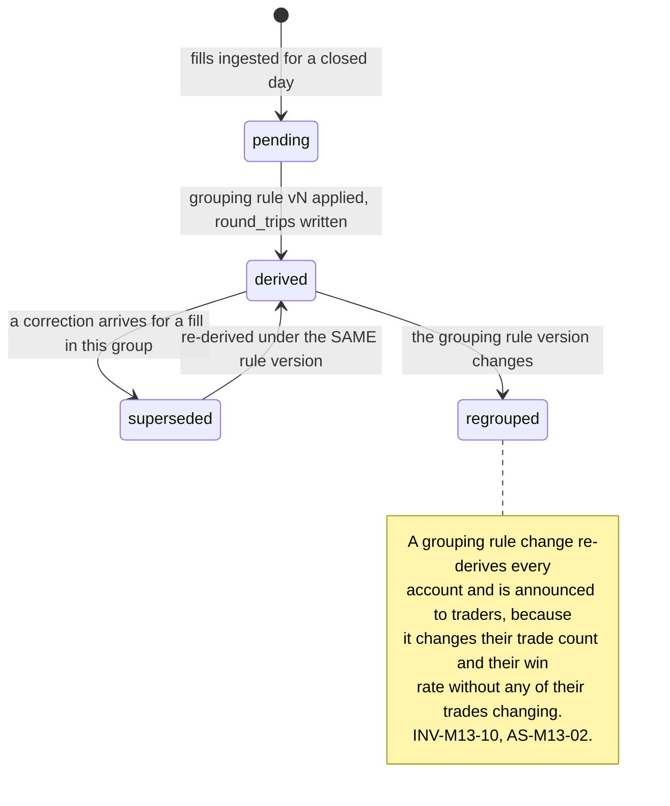
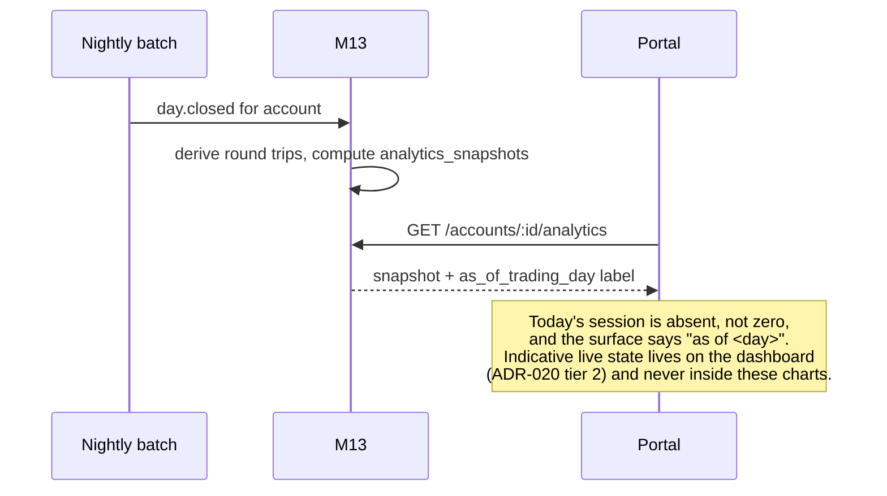
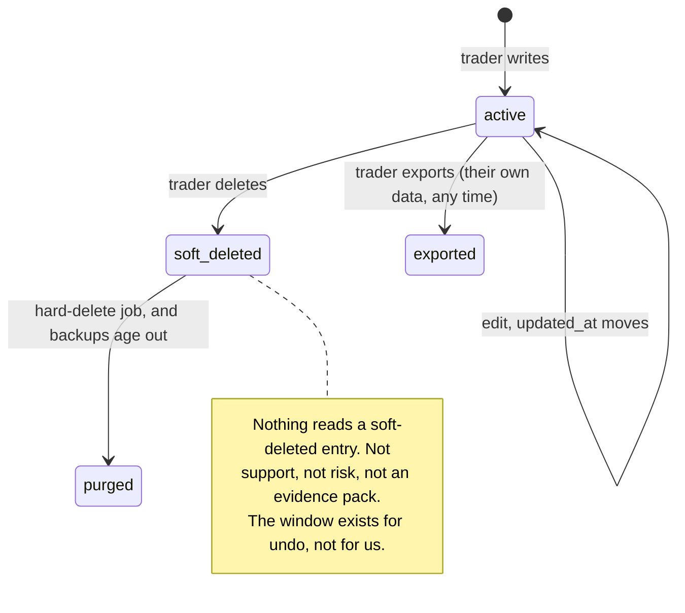

# M13: Trader Analytics and Journal

Constitution section §4-ADDENDUM ("per-account performance breakdowns, a retention driver"), Appendix B5 ten-section template, and [ADR-020](../DECISIONS.md)'s two-tier data plane. Non-money path by the [ADR-003](../DECISIONS.md) classification, and section 1.3 explains why one invariant in it is nonetheless held to money-path standard.

One sentence governs this module: **every number here is a different view of the same closed-session facts the engine used, and the moment it becomes a second computation of anything the engine also computes, Merit has two rulebooks.**

This is the module a trader opens most often and the one whose failure mode is quietest. A wrong analytic does not breach an account or misprice a payout. It produces a trader who believes something slightly different from what the engine will enforce, and then meets the engine on the day it matters. [TOP10_FIRMS](../../research/TOP10_FIRMS.md) records exactly that failure at Topstep, where the complaint theme is "real-time MLL breaching accounts on unrealized wicks, a rule-implementation gap between what traders expect and what the engine enforces". The gap does not have to be in the engine to be fatal. It only has to be in what the trader was shown.

**Identifier conventions:** `INV-M13-nn` invariants, `SD-M13-nn` schema deltas, `AN-M13-nn` analytic surfaces, `FM-M13-nn` failure modes, `AS-M13-nn` adversarial scenarios, `OQ-M13-nn` open questions, `DEP-M13-nn` dependencies.

---

## 1. Purpose and invariants

### 1.1 What this module is

Per-account performance analysis and a private trading journal, both computed from `fills`, `daily_marks`, and `rule_states` as the engine already stores them.

| ID | Surface | Contents | Data floor |
|---|---|---|---|
| AN-M13-01 | **Account performance** | Equity curve, cumulative and per-day realized P&L, win rate, average win and loss, largest win and loss, expectancy | `daily_marks` only. Works with no fill detail at all |
| AN-M13-02 | **Trade list and detail** | Every fill, grouped into round trips, with entry, exit, size, instrument, duration, and result | `fills`. **Contingent on V-M2-11** ([M02](M02-rithmic-bridge.md)) |
| AN-M13-03 | **Distribution analysis** | Result by instrument, by session hour, by day of week, by holding time, by size | `fills` |
| AN-M13-04 | **Rule-state history** | Floor distance, buffer progress, win-day accumulation, and consistency share, per day, as the engine recorded them | `rule_states`. **Rendered, never recomputed** (INV-M13-01) |
| AN-M13-05 | **Journal** | Free-text notes and tags per day and per round trip, private to the trader | Trader input |
| AN-M13-06 | **Account comparison** | The trader's own accounts side by side | All of the above, same identity only |

**Two things this module is deliberately built to be.** It is the private, honest home for the analysis that [M11](M11-certificates-social-proof.md) AS-M11-01 refused to make publishable, and it is the retention surface the constitution names, which means its success metric is repeat visits rather than any number it displays.

### 1.2 What this module is not

| Not M13 | Whose job | Why the boundary is here |
|---|---|---|
| Computing any rule, gate, or eligibility value | [M1](M01-rules-engine.md) | M13 **renders** `rule_states`. It contains no threshold and no comparison against a plan config (INV-M13-01) |
| Live intraday numbers | [M4](M04-trader-portal.md) via [ADR-020](../DECISIONS.md)'s tier 2 | The dashboard shows indicative live state, labeled. Analytics are as-of last closed session, labeled, and the two never blend in one chart (AS-M13-04) |
| Publishing anything | [M12](M12-transparency-platform.md) | Nothing here is public, aggregate, or comparative against other traders (AS-M13-06) |
| Detecting abuse | [M7](M07-risk-abuse.md) | M13 produces no flag and feeds no detector. Section 3.4 and AS-M13-03 explain why that boundary is drawn harder here than anywhere else in the corpus |
| Storing the trader's strategy | nobody | Journal text is the trader's, minimized, exportable, and deletable (INV-M13-07) |

### 1.3 Invariants

| ID | Invariant | Enforcement |
|---|---|---|
| INV-M13-01 | Any value the engine also computes is **read from `rule_states`**, never recomputed here | The module has no access to plan config at all. Not a convention: the analytics service's database role cannot read `plan_versions` or `plan_version_sizes`. **This one invariant is held to money-path standard** despite the module's classification, because a second implementation of a gate is a second rulebook (AS-M13-01) |
| INV-M13-02 | Realized P&L, per day and cumulative, is the value in `daily_marks`, to the cent | No re-derivation from fills, ever, even where fill detail exists. Fills group into round trips for **presentation**; the money number is the mark's |
| INV-M13-03 | Every surface states its as-of trading day, and no surface blends authoritative and indicative values | [ADR-020](../DECISIONS.md)'s labeling rule, and [M04](M04-trader-portal.md) INV-M4-02's test. A chart with a live final point and closed history is two datasets wearing one line (AS-M13-04) |
| INV-M13-04 | Every metric has a **stated definition** reachable from the surface, including its treatment of fees, commissions, and partial fills | AS-M13-01. A trader who cannot find out what "win rate" counts will assume the flattering reading and be wrong at the worst time |
| INV-M13-05 | A metric that cannot be computed from available data is **absent and explained**, never approximated | AS-M13-05. An R-multiple inferred from realized loss is not an R-multiple, and a sophisticated-looking undefined number is worse than a missing one |
| INV-M13-06 | Analytics run against the read path only, and can never contend with the nightly batch or the payout request path | Read replica or a resource-capped role, plus precomputation for the expensive shapes (AS-M13-07). No trader action degrades another trader's payout |
| INV-M13-07 | Journal content is the trader's: exportable, deletable, never used for enforcement, never shown to support by default, and never a detector input | Section 3.4, SD-M13-02, INV-M13-08. This is a **stated product promise**, not an implementation detail (AS-M13-03) |
| INV-M13-08 | Journal content enters an [evidence pack](../GLOSSARY.md#evidence-pack) only on the trader's own request or on lawful compulsion, and never in the internal tier by default | Extends the batch 1 gate's two-tier evidence pack ruling. The trader-facing tier shows conduct, rule text, and the trader's own trades; their private notes are none of those three |
| INV-M13-09 | No surface compares a trader to any other trader or to a population statistic | AS-M13-06. Percentile framing leaks [M12](M12-transparency-platform.md)'s territory through an authenticated side door, one query at a time |
| INV-M13-10 | Historical analytics change **only** when the underlying marks change, and a change is disclosed to the trader | AS-M13-02. A win rate that silently moves overnight is indistinguishable from a firm editing history |

---

## 2. Entities and schema deltas

Three deltas, plus one derived table that exists for performance rather than for meaning.

| ID | Table | Change | Why it is not optional |
|---|---|---|---|
| SD-M13-01 | new `round_trips` | `id`, `account_id`, `instrument`, `opened_at`, `closed_at`, `trading_day`, `direction`, `max_size`, `entry_fills uuid[]`, `exit_fills uuid[]`, `gross_result_cents`, `fee_cents`, `net_result_cents`, `derivation_version integer` | AN-M13-02 and AN-M13-03 are a grouping problem, and grouping fills into round trips is genuinely ambiguous once scaling in and out, reversals, and overnight positions exist. Doing it at read time means the answer depends on which query ran; doing it once, versioned, means a trader's trade count is stable and a change to the grouping rule is a visible, dated event (INV-M13-10). **`net_result_cents` is presentational and never reconciles the account**: `daily_marks` does that (INV-M13-02) |
| SD-M13-02 | new `journal_entries` | `id`, `identity_id`, `account_id`, `scope check in ('day','round_trip')`, `reference_id`, `body text`, `tags text[]`, `created_at`, `updated_at`, `deleted_at null` | AN-M13-05. Soft delete with a hard-delete job, because a trader who deletes a note expects it gone and a note that survives deletion in a backup is the difference between a promise and a claim (INV-M13-07) |
| SD-M13-03 | new `analytics_snapshots` | `account_id`, `as_of_trading_day`, `payload jsonb`, `inputs_digest bytea`, `computed_at`, primary key `(account_id, as_of_trading_day)` | INV-M13-06 and AS-M13-07. The expensive shapes are computed once per account per closed day in the batch, not per page load. `inputs_digest` is what makes INV-M13-10 checkable: if the digest changed, the marks changed, and the trader is told why |

**One reservation used rather than added.** `fills` already reserves `order_id`, `venue`, and `correction_of` ([DATA_MODEL section 12](../architecture/DATA_MODEL.md)). Round-trip derivation reads all three, which is what that reservation was for.

---

## 3. State machines

### 3.1 Round-trip derivation

**Derivation is versioned for the same reason [M12](M12-transparency-platform.md)'s definitions are.** "How many trades did I take" has no canonical answer once a trader scales into a position across four fills and exits across three. Any consistent rule is fine; a rule that changes without notice is not.

### 3.2 Analytics freshness

### 3.3 Journal entry lifecycle

### 3.4 The boundary this module draws hardest

**Journal text is never a detector input, never a default support view, and never in the internal evidence tier.** That is stated as a state machine's absence rather than as a rule, because the design decision is that no code path exists.

The reasoning is in AS-M13-03 and it is worth one sentence here: a trading journal only works if traders write honestly in it, honest writing includes admitting mistakes, and a journal that can be used against its author is a journal nobody uses, which loses the retention value the module exists for **and** produces nothing for enforcement anyway, because the only people who would stop writing candidly are the ones with something to hide.

---

## 4. API endpoints touched

| Endpoint | M13's role | Notes |
|---|---|---|
| `GET /accounts/:accountId/analytics` **NEW** | Owns | The snapshot with its `as_of_trading_day`, definition links, and any `absent_metrics` list with reasons (INV-M13-05). Session scoped, `scopedDb` |
| `GET /accounts/:accountId/round-trips` **NEW** | Owns | Cursor paginated, with `derivation_version` on every page |
| `GET /accounts/:accountId/marks` | Consumes | Approved in [API_CONTRACT section 6](../architecture/API_CONTRACT.md). The equity curve's source, unchanged |
| `GET /accounts/:accountId/timeline` | Consumes | Rule-state history for AN-M13-04, rendered as recorded |
| `GET/POST/PATCH/DELETE /journal` **NEW** | Owns | Session scoped. `DELETE` soft deletes and schedules the purge |
| `GET /me/export` **NEW** | Owns | The trader's own data, including journal, round trips, marks, and rule states, as a file. Required by the privacy runbook (constitution section 6) and useful enough to be a product feature rather than a compliance chore |
| `GET /accounts/:accountId/analytics/definitions` **NEW, public** | Owns | Metric definitions. Public because a definition is not private and because [M9](M09-marketing-site.md) links to it from the rules pages |

**One endpoint deliberately absent: there is no percentile, ranking, or population-comparison endpoint** (INV-M13-09, AS-M13-06).

---

## 5. Events emitted and consumed

| Event | When | Notes |
|---|---|---|
| `analytics.snapshot_computed` **NEW** | per account per closed day | `{ account_id, as_of_trading_day, inputs_digest }`. Consumers: BI. Low value individually, and it is what makes INV-M13-10's change detection cheap |
| `analytics.history_changed` **NEW** | a snapshot's digest changes for a previously computed day | `{ account_id, as_of_trading_day, cause }` where cause is `correction` or `regrouping`. **Consumers: NOTIF, FEED.** The trader is told (AS-M13-02) |
| `analytics.derivation_version_changed` **NEW** | the round-trip grouping rule changes | `{ from_version, to_version, accounts_affected }`. Consumers: ALERT, NOTIF, FEED |
| `journal.entry_deleted` **NEW** | soft delete | `{ entry_id, identity_id }`, no body. Consumers: none beyond the purge job. Deliberately carries no content |

**Consumed:** `day.closed`, `ingest.correction_received`, and `account.closed` (which freezes analytics rather than deleting them, because a trader's history of a closed account is still theirs).

---

## 6. Failure modes

| ID | Failure | Blast radius | Detection | Recovery |
|---|---|---|---|---|
| FM-M13-01 | An analytic disagrees with the engine's number | A trader forms a belief the engine will not honor. This is the Topstep failure pattern, and it does not require the engine to be wrong | A parity assertion in CI and nightly: every rendered engine value equals `rule_states` and `daily_marks` to the cent | INV-M13-01 and INV-M13-02 make it structural. The nightly assertion catches a regression before a trader does. AS-M13-01 |
| FM-M13-02 | Fill detail unavailable (V-M2-11 unconfirmed) | AN-M13-02 and AN-M13-03 do not exist | Known in advance, not discovered | **Degrade to the `daily_marks` floor**, which still supports AN-M13-01 and AN-M13-04 fully. The module ships either way, with the fill-dependent surfaces absent and explained (INV-M13-05). DEP-M13-02 |
| FM-M13-03 | Correction changes a closed day's history | A trader's stats change overnight with no explanation | `inputs_digest` comparison (SD-M13-03) | `analytics.history_changed` notifies the trader with the cause. AS-M13-02 |
| FM-M13-04 | Round-trip grouping is ambiguous or changes silently | Trade count and win rate move without any trade changing | `derivation_version` on every row and page | Version the rule, announce the change, re-derive everything at once. AS-M13-02 |
| FM-M13-05 | Analytics query load competes with the batch or the payout path | The most trust-sensitive action in the product gets slow because someone opened a chart | Query time and connection-pool saturation by role | Precomputed snapshots, read replica or capped role, cursor pagination everywhere. INV-M13-06, AS-M13-07 |
| FM-M13-06 | A journal note is surfaced in an enforcement context | A product promise is broken, and every trader who reads about it stops writing | No code path exists (section 3.4); a negative test asserts the absence | INV-M13-07 and INV-M13-08. AS-M13-03 |
| FM-M13-07 | An indicative value reaches an analytics chart | A closed-session artifact contains a number the engine will not honor | The analytics service holds no read grant on the live cache ([SECURITY](../architecture/SECURITY.md) C-26) | Structurally prevented. AS-M13-04 |
| FM-M13-08 | A metric is displayed that has no valid definition on the available data | Sophisticated-looking nonsense, trusted because it looks sophisticated | Definition coverage test: every rendered metric resolves to a definition entry | Absent and explained beats approximated. INV-M13-05, AS-M13-05 |

---

## 7. Adversarial scenarios

**Six listed, six novel.** None of them is an outsider, which is itself the finding: this module's adversaries are a second implementation, a helpful feature, and a load pattern.

### AS-M13-01: The second rulebook, written by the analytics page (NOVEL)

**Attack.** The adversary is a reasonable engineer with a deadline. The analytics page needs "profit this consistency period". `rule_states` has it, but joining is awkward, and the fills are right there. So the page sums them. The sum differs from the engine's by the treatment of fees, or by a partial fill on a period boundary, or by a correction the mark absorbed and the raw fills did not. The difference is small and nobody notices for months.

**Then it matters, once.** A trader reads their consistency share on the analytics page as 29.4 percent, is satisfied, and requests a payout. The engine computes 30.2 percent and the gate fails. Every word of Merit's marketing says the rules do not surprise you, and the trader has a screenshot of Merit's own page saying they were fine. [TOP10_FIRMS](../../research/TOP10_FIRMS.md) documents this exact class as Topstep's dominant complaint theme, described as "a rule-implementation gap between what traders expect and what the engine enforces". It is worth being precise that in that case the *engine* was right too.

**Why the usual defenses fail.** A code review catches the obvious version and not the subtle one, and a unit test written by the same engineer tests the same misunderstanding. The only reliable defense is making the second computation impossible rather than incorrect.

**Counter.**
1. **The analytics service's database role cannot read `plan_versions` or `plan_version_sizes`** (INV-M13-01). It is not possible to evaluate a gate here, because the thresholds are unreachable. This is the same shape as [SECURITY](../architecture/SECURITY.md) C-26's write-grant absence, and it is chosen for the same reason: a permission is a control and a guideline is not.
2. **Every engine value is read from `rule_states`** and every money value from `daily_marks`, to the cent (INV-M13-02). Round trips are presentational and are labeled as such where they appear next to a money figure.
3. **A nightly parity assertion** recomputes every rendered engine value from the stored rows and asserts equality across every account. It is cheap, it runs alongside the replay self-audit that already exists, and it fails loudly.
4. **Every metric carries its definition** (INV-M13-04), including its fee treatment, because the second most common version of this failure is a trader and the engine both being right about different questions. EC-099, GS-172.

### AS-M13-02: The history that changes overnight (NOVEL)

**Attack.** Not an attacker. A backdated fill correction (B4 #5) arrives for a day three weeks ago. The engine replays forward correctly and never claws back. But the trader's analytics page now shows a different win rate, a different largest loss, and a different equity curve than it did yesterday, with no event, no notice, and no explanation. Separately and more insidiously, a change to the **round-trip grouping rule** does the same thing with no data change at all: the same fills, regrouped, produce a different trade count and a different win rate.

**Why this is a trust event rather than a data event.** A trader who screenshots their stats and later sees different ones has, from their side, watched the firm edit their history. In a market whose [dossier](../../research/ADVERSARY_DOSSIER.md) describes a community primed to believe firms manipulate records, and in a firm whose entire brand is that numbers do not move, this is expensive. And it is guaranteed to happen: corrections are a designed-for part of the pipeline, not an exception.

**Counter.**
1. **`inputs_digest` on every snapshot** (SD-M13-03). If the digest changes for a day already computed, something upstream moved, and the system knows without anybody checking.
2. **`analytics.history_changed` notifies the trader** with the cause (`correction` or `regrouping`) and the affected date range. Told first, by Merit, is a completely different experience from noticed later, by them.
3. **`derivation_version` is on every round-trip row and every API page** (SD-M13-01), and a grouping-rule change is announced, applied to everyone at once, and never applied silently to new data only, which would leave a discontinuity inside a single account's history.
4. **The definitions page shows version history**, in the same shape [M12](M12-transparency-platform.md) uses, because the discipline that makes a public statistic defensible makes a private one defensible for the same reason. EC-100, GS-173.

### AS-M13-03: The journal as a confession (NOVEL)

**Attack.** A trader writes, in a private journal note attached to a trade: *"hedged this one against my other account, worked out."* Merit now holds a written admission of conduct that [M07](M07-risk-abuse.md)'s copy-trading clause makes a violation. The temptation is obvious and comes in three escalating forms: let support see journal notes when investigating a ticket; include them in the internal evidence tier because they are highly probative; and, eventually, run a keyword detector over them, which would be cheap, effective, and would find real rings.

**Why Merit should refuse all three, and the argument is practical before it is ethical.**
- **A journal that can be used against its author is a journal nobody writes in honestly.** The retention value of this module comes entirely from candid writing, and candour is the first casualty. The feature would degrade to a diary of things traders are comfortable having Merit read.
- **The enforcement value is illusory for exactly the same reason.** The traders who would be caught by a journal detector are the ones who did not think about it, and the organized rings the [dossier](../../research/ADVERSARY_DOSSIER.md) describes, who coordinate on Discord and read rulebooks forensically, would simply not write it down. Merit would be building surveillance that catches the careless and misses the organized, which is the worst possible selectivity for an enforcement mechanism.
- **The evidence is weak on its own terms.** A note saying "hedged" is ambiguous, unverified, and self-reported. [M07](M07-risk-abuse.md)'s detectors work on **conduct**, and the batch 1 gate ruled the trader-facing evidence pack shows conduct, rule text, and the trader's own trades. A journal note is none of those and would import a category of soft evidence into a process built specifically to avoid one.
- **And the reputational asymmetry is brutal.** "Merit reads your journal" is a headline that costs more than any ring it could catch, and it is unanswerable once true.

**Counter, and it is an absence rather than a control.**
- **No code path reads journal content for any purpose other than showing it to its author or exporting it to them** (INV-M13-07, section 3.4). Not support, not risk, not the internal evidence tier.
- **A negative test asserts the absence**, in the same family as the D5 negative-authz matrix: the journal table is unreachable from the risk, admin, and evidence services by database grant.
- **Journal content enters an evidence pack only on the trader's own request or on lawful compulsion** (INV-M13-08), and the second case is a documented legal process rather than a product feature.
- **The promise is published**, in plain words, on the journal surface itself. A privacy property nobody knows about buys none of the candour it was built to protect. EC-101, GS-174.

### AS-M13-04: The chart with one live point (NOVEL)

**Attack.** [ADR-020](../DECISIONS.md) ships an indicative live layer, and the trader dashboard shows live P&L and projected floor distance, labeled. The equity curve on the analytics page is closed-session data. The obviously nice feature is to append today's live value to the curve so the line reaches the present. It looks better, it is what every trading platform does, and it silently produces a chart in which the last point obeys different rules from every other point: it can move, it can reverse, it is not what any gate will be evaluated against, and it will disagree with the same chart tomorrow.

**Why the label does not save it.** [ADR-020](../DECISIONS.md)'s labeling rule is at the point of use, and a single line on a chart is one visual unit. A footnote saying the last point is indicative does not stop a trader reading the line as a line, and the specific harm is that **floor distance is the number traders watch to decide whether to keep trading today** ([M04](M04-trader-portal.md) SC-M4-02 says so explicitly). A blended chart is most misleading precisely where it is most consulted.

**Counter.**
- **Authoritative and indicative never share a visual unit** (INV-M13-03). Live state is the dashboard's; the analytics curve ends at the last closed session and says so.
- **Where today's state is genuinely useful next to history, it is a separate, differently styled element** with its own label, not a continuation of the same line.
- **The analytics service holds no read grant on the live cache** ([SECURITY](../architecture/SECURITY.md) C-26, [M02](M02-rithmic-bridge.md) INV-M2-14), so this cannot be built here even by accident.
- **The rendering test from [M04](M04-trader-portal.md) extends to charts**: a series containing a value with a different provenance from its siblings is a build failure. GS-175.

### AS-M13-05: The R-multiple that is silently undefined (NOVEL)

**Attack.** Every competitor's analytics ships R-multiples, and [PROP_TECH_LANDSCAPE](../../research/PROP_TECH_LANDSCAPE.md) records "R-multiple metrics" as a standard portal feature. An R-multiple is a result expressed in units of **intended risk**, and Merit does not know intended risk: it has fills, not stop orders, and even with order data a stop that was moved or never placed makes the intent unknowable. The available shortcut is to define R as the realized loss on losing trades, which makes every losing trade exactly -1R by construction and turns the whole metric into a restatement of the win/loss ratio wearing the vocabulary of risk management.

**Why it is worse than a merely useless metric.** It looks rigorous. A trader optimizing against a metric that is definitionally circular will make real decisions from it, and Merit will have supplied the false precision. The same trap sits behind several neighbours: Sharpe ratios on fewer than thirty observations, "expectancy" computed across mixed instruments without tick-value normalization ([M01](M01-rules-engine.md)'s contract-spec discipline exists for exactly this), and any profit factor computed over a handful of trades.

**Counter.**
- **A metric with no valid definition on the available data is absent and explained** (INV-M13-05). The analytics response carries an `absent_metrics` list with a one-line reason each, so the absence is visibly a choice.
- **R-multiples ship only if intended risk is captured**, which is a **journal field the trader fills in** (AN-M13-05 tags), never an inference. A trader-declared risk makes the metric meaningful and makes its dependence on the trader's own input obvious.
- **Every ratio states its minimum sample** and renders "not enough trades yet, n of m" below it, borrowing [M12](M12-transparency-platform.md) INV-M12-05's discipline wholesale, because the failure mode is identical at the individual scale.
- **Tick values come from `contract_specs`**, never from a multiplier in analytics code (B4 #14). EC-102, GS-176.

### AS-M13-06: Percentile framing leaks the population one query at a time (NOVEL)

**Attack.** The obviously motivating retention feature is comparison: "your win rate is in the top 20 percent of funded traders", "you are ahead of 68 percent of Core EOD accounts". It is engaging, every consumer product does it, and it is a population statistic delivered through an authenticated endpoint with no method page, no window, no sample floor, and no publication policy.

**Two harms, and the second is the one that is genuinely dangerous.** The first is that it is [M12](M12-transparency-platform.md)'s job done badly, which is [M10](M10-integrations.md) AS-M10-02 and [M11](M11-certificates-social-proof.md) AS-M11-07 again on a third surface. The second is **enumeration**: a percentile endpoint is an oracle over the population distribution. A determined trader, or an operator with ten accounts and the patience to vary them, can reconstruct the shape of Merit's funded-trader performance distribution, which is the raw material for computing the firm's real pass rate, its loss ratios, and which plan is currently softest, without ever visiting the transparency page. [M12](M12-transparency-platform.md) AS-M12-04 explains why Merit deliberately does not publish the last of those.

**Counter.**
- **No surface compares a trader to any other trader or to a population statistic** (INV-M13-09). There is no endpoint, which means there is nothing to enumerate.
- **The legitimate need is served by self-comparison**: this account against the trader's own other accounts (AN-M13-06), and this month against the trader's own history. That is more useful for improvement than a percentile is, and it leaks nothing.
- **If population comparison is ever wanted, it goes through [M12](M12-transparency-platform.md)** as a published statistic with a method, a window, and a sample floor, rendered identically for everyone. Personalizing a published statistic is fine; publishing a personalized one is not. GS-177.

### AS-M13-07: The retention feature that competes with the payout path (NOVEL)

**Attack.** The adversary is a load pattern. Analytics is by a wide margin the heaviest read workload in the estate: a funded trader with a year of history pulls tens of thousands of fills, and the interesting queries are aggregations across all of them. [ADR-006](../DECISIONS.md) and [ADR-007](../DECISIONS.md) put jobs, marks, fills, and the ledger in **one Postgres instance**, deliberately, so that restore and backup are one procedure. The consequence is that an analytics query and a payout request contend for the same resources.

**The timing is the attack even without an attacker.** Traders open analytics after the session closes and around the daily reset, which is when the nightly batch is running and when [M05](M05-payout-system.md) FM-M5-12's promo-day payout spike lands. The constitution's own load target is payout request p95 under 500ms, and the module most likely to break it is the one nobody classified as a money path. A trader with ten accounts refreshing analytics during a wave is a denial of service with an innocent explanation, and a competitor who works this out has a very cheap way to make Merit's payouts slow on the day it hurts most.

**Counter.**
1. **Precomputed snapshots** (SD-M13-03) in the nightly batch, so the common page load is a single-row read rather than an aggregation.
2. **INV-M13-06's resource separation**: analytics reads run against the read replica or a role with a hard connection and statement-timeout cap, so the worst case is slow analytics rather than slow payouts. The [M10](M10-integrations.md) replica already exists and its exclusions are compatible with the fill data analytics needs.
3. **Cursor pagination everywhere and no unbounded range**, per [API_CONTRACT section 1](../architecture/API_CONTRACT.md)'s design rules, with a hard cap on the widest window a single request can ask for.
4. **Load test as a named gate**, in the same suite as [M05](M05-payout-system.md)'s 500-requests-per-minute test: analytics at realistic concurrency **while** the payout load test runs, asserting the payout p95 target still holds. Testing them separately proves nothing about the only interaction that matters. EC-103, GS-178.

---

## 8. Test plan

### 8.1 Suites

| Suite | Prefix | Count | Runs | Blocks |
|---|---|---|---|---|
| Engine-parity assertions (every rendered engine value against `rule_states` and `daily_marks`) | `M13-P-nn` | 12 | every commit and nightly | merge, and nightly page |
| Round-trip derivation: scale in and out, reversals, overnight, corrections | `M13-R-nn` | 11 | every commit | merge |
| Definition coverage and `absent_metrics` reasons | `M13-D-nn` | 7 | every commit | merge |
| History-change detection and notification | `M13-H-nn` | 6 | every commit | merge |
| Journal isolation (negative: unreachable from risk, admin, evidence, support) | `M13-J-nn` | 8 | every commit | merge |
| Provenance: no indicative value in any authoritative series | `M13-V-nn` | 5 | every commit | merge |
| Negative authz (D5), including cross-account and cross-identity | `M13-N-nn` | 6 | every commit | merge |
| Analytics load **concurrent with** the payout load test | `M13-L-01` | 1 | nightly | nightly alarm, and a launch gate |
| Degraded mode with no fill detail (V-M2-11 unconfirmed) | `M13-G-01` | 1 | every commit | merge |
| Golden fixtures | `GS-nnn` | 7 owned (GS-172 to GS-178) | every commit | merge |

### 8.2 Named scenarios owned by this module

| ID | Scenario | Pins |
|---|---|---|
| GS-172 | Consistency share rendered on analytics against the engine's value | Equal to the cent, and the analytics role **cannot read plan config** at all. AS-M13-01 |
| GS-173 | A correction lands on a day already snapshotted | The digest changes, `analytics.history_changed` notifies with the cause and range, and the trader is told before they notice. AS-M13-02 |
| GS-174 | Journal content requested from risk, admin, evidence, and support paths | All four fail by database grant. Trader export and trader view succeed. AS-M13-03 |
| GS-175 | An equity series with a live final point | Build failure: a series carrying mixed provenance does not render. AS-M13-04 |
| GS-176 | R-multiple requested with no declared risk | Absent, with a stated reason, rather than inferred. With a declared risk it computes and says the risk was trader-supplied. AS-M13-05 |
| GS-177 | Percentile or population comparison requested | No such endpoint exists; self-comparison across the trader's own accounts succeeds. AS-M13-06 |
| GS-178 | Analytics load concurrent with a payout wave | Payout request p95 holds under its target; analytics degrades first. AS-M13-07 |

### 8.3 Coverage rule

**Every metric rendered anywhere in this module appears in exactly one of two lists: values read from engine tables, or values derived here with a published definition and a fixture.** A metric in neither list is a merge blocker. The whole failure surface of this module is metrics that grew without anybody deciding what they meant.

---

## 9. Observability

### 9.1 Metrics

| Metric | Why it matters |
|---|---|
| Engine-parity assertion failures | Zero, always. Any other value is AS-M13-01 in production |
| Analytics query time p95 and p99, and connection-pool share by role | AS-M13-07. The p99 is the one that matters because the tail is what collides with a payout wave |
| `analytics.history_changed` count by cause | A rising `correction` count is an ingest problem; a `regrouping` count above zero unexpectedly is a released change nobody announced |
| Snapshot computation time per account, and batch contribution | Analytics must not become the reason the nightly batch misses its 10 minute target |
| Absent-metric render count by metric | Which metrics traders keep asking for that Merit cannot honestly compute, which is the input to OQ-M13-02 |
| Journal entries per active trader, and export requests | The candour proxy. If journal use is near zero, either nobody wants it or nobody believes the promise |
| Repeat-visit rate to analytics per funded trader | The constitution calls this module a retention driver, and this is the only number that tests the claim |
| Round-trip derivation failures and unresolved fills | The health of AN-M13-02, and the early warning that V-M2-11's shape changed |

### 9.2 Alerts

| Alert | Threshold | Severity |
|---|---|---|
| Engine-parity assertion failure | any | **page** |
| Analytics-attributable payout latency regression | payout p95 above target with analytics load elevated | **page** |
| Journal table accessed from a non-trader path | any | **page**. A grant regressed, and a product promise is at risk |
| Indicative value detected in an authoritative series | any | **page** |
| `analytics.history_changed` volume | above the configured daily baseline | warn, investigate the ingest source |
| Snapshot job failure or overrun | any | warn, then page if two consecutive nights |

### 9.3 Dashboard

M13 supplies a panel rather than owning a console: parity status, query-time p99, snapshot health, and history-change counts. **If only one number could be shown it would be engine-parity assertion failures**, because it is the only one that reports on whether Merit currently has one rulebook or two.

---

## 10. Open questions for the founder

**OQ-M13-01. Is the journal's privacy promise absolute, and is Merit willing to publish it?** AS-M13-03 recommends yes on both, and the second half is the part that needs a decision: publishing "we never read your journal" is a commitment that constrains Merit permanently and that a future incident may make uncomfortable. The argument for publishing is that an unpublished privacy property buys none of the candour it exists to protect, so an unpublished promise is a cost with no benefit. Recommendation: **publish it, with the lawful-compulsion carve-out stated in the same sentence rather than hidden in the ToS.**

**OQ-M13-02. Which fill-dependent surfaces are launch scope, given that V-M2-11 is unconfirmed?** [M02](M02-rithmic-bridge.md)'s vendor call has not happened, and AN-M13-02 and AN-M13-03 do not exist without per-fill detail. Proposed: **build AN-M13-01 and AN-M13-04 as launch scope**, since they need only `daily_marks` and `rule_states` and already deliver the retention core, and treat the trade-level surfaces as a fast follow that ships the week the fill data is confirmed. This means the module ships regardless of the vendor call, which is the same posture [ADR-005](../DECISIONS.md) took everywhere else.

**OQ-M13-03. Does the trader-facing export include the round-trip derivation, or only raw data?** Including it is more useful and pins Merit to a derivation the trader can then hold against a later version. Proposed: **include it, with `derivation_version` stamped in the export**, on the reasoning that a version-stamped derivation is exactly what makes a later change explicable rather than suspicious.

**OQ-M13-04. Should journal entries be tied to accounts that later close?** A trader's notes on a breached account are often their most valuable, and the account is gone. Proposed: **journal entries survive account closure and stay in the trader's view and export indefinitely**, because they belong to the identity rather than to the account, and deleting a trader's own reflections when they breach is both unkind and exactly the moment they would most want them.

---

### Dependencies on other modules

| ID | Dependency | Owner | Consequence if unmet |
|---|---|---|---|
| DEP-M13-01 | `rule_states` stores every gate result and progress value per trading day, as approved (M1's SD-06 split of `engine_gates` and `context_gates`) | M1 | AN-M13-04 has to recompute, which is AS-M13-01 by force rather than by carelessness |
| DEP-M13-02 | M2 supplies per-fill detail (**V-M2-11**, unconfirmed) | M2 | AN-M13-02 and AN-M13-03 do not exist. The module still ships on the `daily_marks` floor (FM-M13-02, OQ-M13-02) |
| DEP-M13-03 | `contract_specs` supplies tick values as data | M2, Wave 2 | Every per-instrument figure is wrong in a way that looks right (B4 #14) |
| DEP-M13-04 | The read replica carries `fills`, `daily_marks`, and `rule_states` | INFRA, M10 | INV-M13-06 has nowhere to run, and AS-M13-07 becomes a live risk on launch day |
| DEP-M13-05 | The analytics service role holds no grant on `plan_versions`, `plan_version_sizes`, or the indicative cache | INFRA | INV-M13-01 and INV-M13-03 degrade from structural to advisory, which is the difference between this module being safe and being carefully written |
| DEP-M13-06 | M7, M6, and the evidence pack services hold no grant on `journal_entries` | INFRA, M7, M6 | INV-M13-07's promise is unenforceable, and AS-M13-03's temptation has nothing standing in its way |
