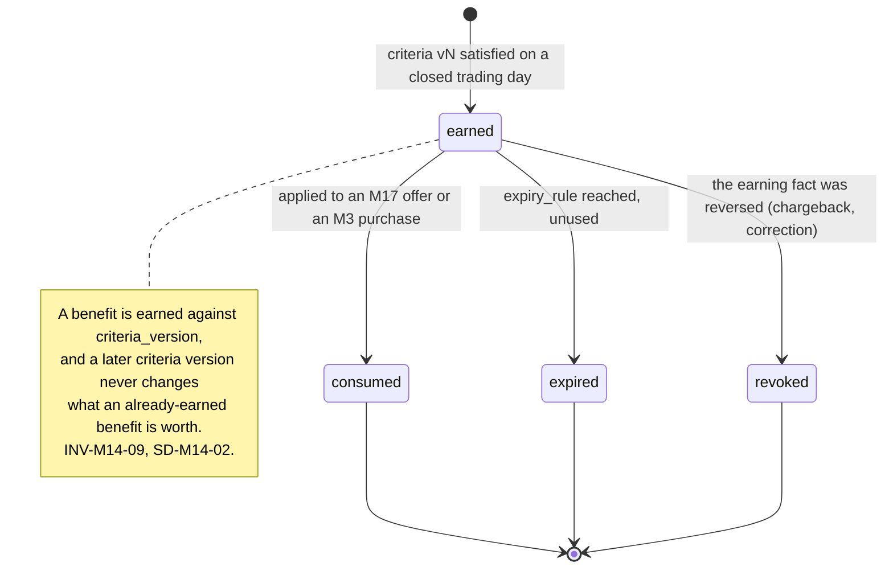
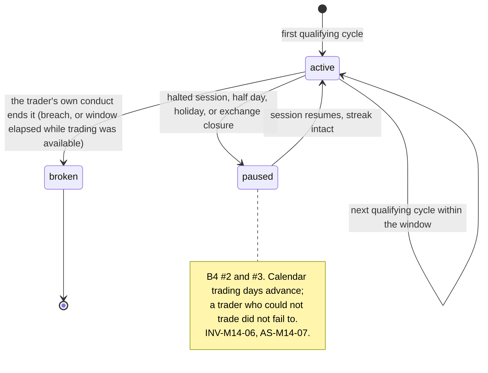
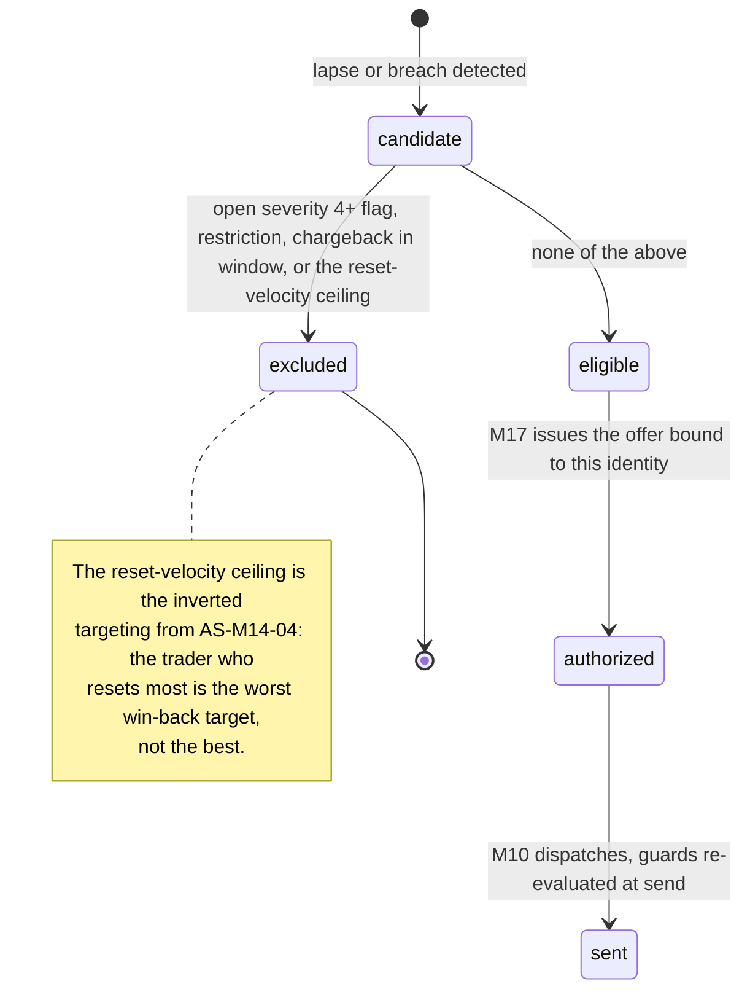

# M14: Loyalty and Retention Engine

Constitution section §4-ADDENDUM ("progressive cap release after the Nth payout, streaks, reset discounts, win-backs, FundedNext and SharkFutures mechanics"), Appendix B5 ten-section template, and **[ADR-019a](../DECISIONS.md)'s gamification bright line, which is binding on this module by name.**

**Money path, and the classification is not a formality.** Every mechanic in this module either moves a plan parameter that governs payouts, issues a credit that appears in the ledger, or changes who is offered what after a breach. [ADR-003](../DECISIONS.md)'s strict regime applies to any slice that touches the cap schedule or `promotional_credit`.

One sentence governs this module: **a loyalty mechanic may change what a trader is offered, and it may never change what the engine computes, except through the same audited, dual-controlled plan-version publish that every other parameter change uses.**

That sentence is the whole plan. Loyalty systems in this industry work by quietly making the rules better for good customers, and the moment Merit does that outside the plan-version path it has a second, undocumented rulebook that varies by person, which is precisely the discretion the firm's entire positioning denies having.

**Identifier conventions:** `INV-M14-nn` invariants, `SD-M14-nn` schema deltas, `LM-M14-nn` loyalty mechanics, `FM-M14-nn` failure modes, `AS-M14-nn` adversarial scenarios, `OQ-M14-nn` open questions, `DEP-M14-nn` dependencies.

---

## 1. Purpose and invariants

### 1.1 What this module is

Four mechanics, and their v1 recommendation is stated up front because two of them are recommended against.

| ID | Mechanic | What it does | v1 recommendation |
|---|---|---|---|
| LM-M14-01 | **Progressive cap release** | A higher payout cap from a configured ordinal onward, using `payout_cap_schedule`'s existing array shape | **Ship, as a plan-version change only** (AS-M14-01, AS-M14-06). Never as a per-trader grant |
| LM-M14-02 | **Streaks and milestones** | Recognition for consecutive payout cycles or consecutive win days | **Recognition only, no economic reward** (AS-M14-02). Ship the badge, not the benefit |
| LM-M14-03 | **Reset discounts** | A reduced reset price after a breach, rule based | **Ship**, priced and issued by [M17](M17-offers-engine.md), targeted by rules stated here (AS-M14-04) |
| LM-M14-04 | **Win-backs** | Re-engagement of lapsed traders | **Ship, with the targeting inverted** from the obvious design (AS-M14-04) |

Plus the loyalty state itself: what a trader has earned, what it entitles them to, and the audit trail proving nobody granted it by hand.

### 1.2 The bright line, restated because this is the module it was written for

[ADR-019a](../DECISIONS.md) says: **purchased is always known contents; randomized is earned only, and only with disclosed odds; there are no purchased loot boxes in Merit, ever.**

Three consequences that this module must hold, and the third is the one a naive implementation breaks.

1. **Anything a trader pays for states exactly what they get, before they pay.** A reset discount is a stated price, never a mystery price.
2. **Anything randomized is earned through activity, and its odds are published.** In practice v1 randomizes nothing at all, and OQ-M14-02 asks whether it ever should.
3. **The two rules compose, so a free random reward that resolves into a purchase is still a purchased loot box.** A wheel spin that awards "a discount of unknown size on a reset you then buy" is the prohibited product wearing a free hat, because the randomized outcome determines what the money buys (AS-M14-03).

### 1.3 What this module is not

| Not M14 | Whose job | Why the boundary is here |
|---|---|---|
| Pricing and issuing an offer | [M17](M17-offers-engine.md) | M14 decides **who has earned what**; M17 decides what an offer costs, renders it, and issues the credit or coupon. One offers engine, one place where money and price meet |
| Changing a plan parameter | [M1](M01-rules-engine.md) config plus [M3](M03-billing-checkout.md)'s publish path | M14 never writes a cap, a split, a gap, or a ladder. It **proposes a plan version** like any other change (INV-M14-02, AS-M14-06) |
| Sending anything | [M16](M16-notification-center.md) and [M10](M10-integrations.md) | Including the guards. A win-back computed here is still suppressed at send by live state ([M10](M10-integrations.md) AS-M10-03) |
| The payout ladder or graduation | [M1](M01-rules-engine.md), [M18](M18-graduation-track.md) | The ladder is structural ([parameter-status ruling](../DECISIONS.md#parameter-status-launch-candidates-versus-structural-rulings-founder-ruling-2026-08-14)). Loyalty may not extend it, shorten it, or sell relief from it |
| Deciding who is trustworthy | [M7](M07-risk-abuse.md) | Loyalty status is **never** a risk mitigant. A tier is a record of spending and surviving, not of honesty (AS-M14-05) |

### 1.4 Invariants

| ID | Invariant | Enforcement |
|---|---|---|
| INV-M14-01 | No loyalty mechanic changes any value the engine reads, except through a published plan version | The loyalty service holds **no write grant** on `plan_versions`, `plan_version_sizes`, or `accounts.plan_version_id`. Structural, not procedural (AS-M14-06) |
| INV-M14-02 | A progressive cap release is a **plan-version publish**, subject to [ADR-010](../DECISIONS.md)'s dual control and delay window | A cap edit is a cap edit regardless of the word "loyalty" in front of it. This is the single most important sentence in the module |
| INV-M14-03 | Loyalty state is **derived**, recomputed from events, and never hand-granted | SD-M14-01 stores a derivation, not a balance. An admin cannot grant a tier; they can only correct the inputs, which is an audited act with a different name |
| INV-M14-04 | No randomized reward exists in v1. If one ever exists, it is earned only and its odds are published | [ADR-019a](../DECISIONS.md). A randomized outcome that determines what a subsequent purchase yields is a purchased loot box regardless of how it was obtained (AS-M14-03) |
| INV-M14-05 | Loyalty status is invisible to [M7](M07-risk-abuse.md), to the payout path, and to support's default view | AS-M14-05. A tier that buys leniency is discretion with a marketing name, and the firm's whole claim is that it has none |
| INV-M14-06 | A streak is broken only by the trader's own conduct, never by a calendar the trader does not control | [Trading calendar](../GLOSSARY.md#trading-calendar) semantics: halted sessions, half days, and holidays cannot break a streak (B4 #2 and #3, AS-M14-07) |
| INV-M14-07 | Every earned benefit states its exact terms, its expiry, and what breaks it, before it is earned | Published criteria, versioned like a plan. A benefit whose rules are discovered at the moment of loss is the dark pattern the constitution's M4 tone directive forbids |
| INV-M14-08 | Win-back and reset-offer targeting **excludes** identities with an open severity 4+ flag, an active restriction, or a chargeback in the window | Evaluated at both computation and send ([M10](M10-integrations.md) INV-M10-08). AS-M14-04 |
| INV-M14-09 | No loyalty benefit is retroactive, and no benefit is withdrawn retroactively | Both directions, deliberately. FundingTicks' retroactive rule change is the market's live case study in how one announcement destroys a brand ([TOP10_FIRMS](../../research/TOP10_FIRMS.md) watchlist) |
| INV-M14-10 | Loyalty credit is `promotional_credit` in the ledger, never `trader_wallet` | [ADR-019](../DECISIONS.md) activated both classes and they are not interchangeable. Wallet balance is money the trader earned and can withdraw; promotional credit is a discount instrument that is spendable and **never withdrawable** (AS-M14-03) |

---

## 2. Entities and schema deltas

Three deltas. Two of them exist to make the module auditable and one exists to make it honest.

| ID | Table | Change | Why it is not optional |
|---|---|---|---|
| SD-M14-01 | new `loyalty_states` | `identity_id`, `as_of_trading_day`, `payouts_lifetime`, `consecutive_payout_cycles`, `accounts_funded_lifetime`, `resets_lifetime`, `tenure_days`, `derivation_version`, `inputs_digest`, primary key `(identity_id, as_of_trading_day)` | INV-M14-03. Storing a **derived** state per day rather than a mutable balance is what makes "nobody granted this by hand" checkable: the state is reproducible from the event stream, and a divergence is a tamper indication. It also makes a tier change explicable to a trader, which a mutable counter never is |
| SD-M14-02 | new `loyalty_benefit_grants` | `id`, `identity_id`, `benefit_code`, `criteria_version`, `earned_on_trading_day`, `expires_at null`, `consumed_at null`, `consumed_ref null`, `revoked_at null`, `revoked_reason null` | INV-M14-07 and INV-M14-09. A benefit needs a record of **which published criteria version** earned it, or a criteria change silently rewrites what past traders were promised, which is the FundingTicks failure. `consumed_ref` points at the [M17](M17-offers-engine.md) offer or the [M3](M03-billing-checkout.md) purchase that used it, so a benefit cannot be spent twice |
| SD-M14-03 | new `loyalty_criteria` | `benefit_code`, `version`, `title`, `criteria_spec`, `terms_body_mdx`, `expiry_rule`, `breaks_on text[]`, `effective_from date`, `superseded_by null` | INV-M14-07. The same versioned-definition discipline [M12](M12-transparency-platform.md) uses for statistics, applied to promises. `breaks_on` is explicitly enumerated rather than implied, because "what breaks my streak" is the question a trader asks after it breaks, and answering it then is too late (AS-M14-07) |

**Two reservations used rather than added.** `payout_cap_schedule` is already an array in the plan config ([DATA_MODEL section 12](../architecture/DATA_MODEL.md), which names progressive cap release as the reason), and `promotional_credit` is already a ledger account class ([ADR-019](../DECISIONS.md)). This module needs neither a new money path nor a new config shape, which is the strongest available evidence that the Wave 2 reservations were the right ones.

---

## 3. State machines

### 3.1 Benefit lifecycle



**Revocation is narrow on purpose.** A benefit is revoked only when the fact that earned it was itself reversed, which in practice means a chargeback or a correction. An enforcement does not revoke an already-earned benefit; it restricts the account, which is a different act with its own process. This mirrors [M11](M11-certificates-social-proof.md) INV-M11-07's split between "the fact is not true" and "the account was later enforced", and for the same reason.

### 3.2 Progressive cap release, which is a plan-version publish

```mermaid
sequenceDiagram
    participant M14
    participant Founder
    participant Publish as M3 publish path
    participant Engine
    M14->>Founder: cohort reaches the configured ordinal; propose plan version
    Note over Founder: ADR-010 dual control:<br/>second credential, delay window,<br/>publish diff reviewed (PW warnings, CV validations)
    Founder->>Publish: POST /admin/plans/versions/:id/publish
    Publish->>Publish: validatePlan, CV-10, CV-11, CV-17, INV-21
    Publish->>Engine: new plan_version available
    Note over M14,Engine: M14 never writes a cap. It proposes and it<br/>reports. INV-M14-01, INV-M14-02, AS-M14-06.
```

**The consequence a naive design misses.** Because a cap release is a plan version, it applies to **accounts pinned to that version**, and existing accounts are pinned to theirs (B4 #12). Progressive cap release is therefore not "your cap goes up at payout five"; it is "this plan's cap schedule has a second step, and every account on this version has always had it". That is a materially better product: the benefit is published in the rules page from day one, is visible before purchase, and requires no per-trader state at all. It is also the only version compatible with INV-M14-01.

### 3.3 Streak accounting



### 3.4 Win-back and reset-offer targeting



---

## 4. API endpoints touched

| Endpoint | M14's role | Notes |
|---|---|---|
| `GET /me/loyalty` **NEW** | Owns | Derived state, earned benefits with their terms and expiry, and **progress toward the next one with its exact criteria**. Session scoped |
| `GET /public/loyalty/criteria` **NEW, public** | Owns | Every published criteria version. Public because a benefit whose rules are private is a dark pattern (INV-M14-07) |
| `POST /admin/loyalty/recompute` **NEW** | Owns | Recompute a derivation and diff it against stored state. **Cannot write a grant**, only correct inputs, which is a separate audited action |
| `POST /admin/plans/:planId/versions` | Consumes | The cap-release proposal path. M14 supplies the proposed schedule; publishing is [M3](M03-billing-checkout.md)'s and dual control is [ADR-010](../DECISIONS.md)'s |
| `POST /offers/redeem` | Consumes | [M17](M17-offers-engine.md) owns redemption. M14 supplies the grant that authorized it (SD-M14-02) |

**The absence that matters: there is no endpoint that grants a benefit.** Not for admins, not for support, not for the founder. Benefits are derived (INV-M14-03), and the only way to change one is to change the facts that produced it, which is an audited correction with its own name.

---

## 5. Events emitted and consumed

| Event | When | Notes |
|---|---|---|
| `loyalty.benefit_earned` **NEW** | criteria satisfied | `{ identity_id, benefit_code, criteria_version, earned_on_trading_day, expires_at }`. Consumers: NOTIF, FEED, BI |
| `loyalty.benefit_consumed` / `.expired` / `.revoked` **NEW** | lifecycle | `{ benefit_id, consumed_ref | reason }`. Consumers: FEED, BI, EVID on revoked |
| `loyalty.streak_broken` **NEW** | streak ends | `{ identity_id, length, cause }` where cause is enumerated from `breaks_on`. Consumers: NOTIF, FEED. **The trader is told which enumerated cause broke it**, never a generic message (AS-M14-07) |
| `loyalty.criteria_changed` **NEW** | a criteria version becomes effective | `{ benefit_code, from_version, to_version, effective_from }`. Consumers: ALERT, NOTIF, FEED, EVID |
| `loyalty.cap_release_proposed` **NEW** | a cohort reaches the trigger | `{ plan_code, from_ordinal, proposed_cap_bp, cohort_size, projected_lifetime_delta_cents }`. **Consumers: ALERT, FEED.** The projected liability delta is in the event because the founder should never see this proposal without it (AS-M14-01) |
| `loyalty.state_divergence` **NEW** | recomputation disagrees with stored state | `{ identity_id, field, stored, recomputed }`. **Pages.** Consumers: ALERT, RISK. A derived state that diverges is a tamper indication |

**Consumed:** `wallet.credited` (the payout ordinal that drives most criteria, per [ADR-019](../DECISIONS.md)), `breach.detected`, `account.provisioned`, `purchase.charged_back`, `flag.status_changed`, `day.closed`, and `account.graduated`.

---

## 6. Failure modes

| ID | Failure | Blast radius | Detection | Recovery |
|---|---|---|---|---|
| FM-M14-01 | A loyalty mechanic changes an engine value directly | A second rulebook that varies by trader, undocumented and undiscoverable | No write grant exists (INV-M14-01) | Structurally prevented. AS-M14-06 |
| FM-M14-02 | Progressive cap release raises lifetime exposure more than modelled | The ladder's bound (INV-17) moves for exactly the cohort most able to extract | `projected_lifetime_delta_cents` on the proposal event, and the reserve model rerun before publish | Model first, publish second. The proposal is not approvable without the number. AS-M14-01 |
| FM-M14-03 | A streak reward incentivizes the extraction cadence the gap exists to pace | Merit pays traders to extract as fast as the rules allow, forever | Cohort payout-frequency comparison, streak holders against the population | Recognition without economic reward (LM-M14-02). AS-M14-02 |
| FM-M14-04 | A benefit's criteria change alters what past traders were promised | The FundingTicks failure: one announcement, brand destroyed | `criteria_version` on every grant (SD-M14-02) | Grants are immutable against their own version (INV-M14-09). No retroactivity in either direction |
| FM-M14-05 | A win-back reaches a restricted or flagged identity | Merit invites back somebody it just enforced against, in writing | Exclusion at computation **and** at send (INV-M14-08) | Both evaluations. AS-M14-04 |
| FM-M14-06 | Promotional credit becomes withdrawable | A discount instrument converts to cash, which is a liability nobody priced and possibly a regulated one | Ledger class separation (INV-M14-10), asserted by test | `promotional_credit` has no path to `trader_wallet` and none to a withdrawal. AS-M14-03 |
| FM-M14-07 | Loyalty tier influences a risk or payout decision | Discretion, wearing a loyalty badge | Tier is unreadable from the risk and payout services by grant (INV-M14-05) | Structural. AS-M14-05 |
| FM-M14-08 | A streak breaks on a day the trader could not trade | A trader is punished by the exchange calendar | Calendar-aware accounting (INV-M14-06), with fixtures on DST, half days, and halts | Pause rather than break. AS-M14-07, B4 #1 to #3 |
| FM-M14-09 | Loyalty state diverges from its derivation | Somebody or something granted status outside the system | Nightly recomputation against `inputs_digest` | `loyalty.state_divergence` pages. This is the module's tamper detector |

---

## 7. Adversarial scenarios

**Seven listed, seven novel.**

### AS-M14-01: Progressive cap release raises the ceiling for the cohort best able to reach it (NOVEL)

**Attack.** The mechanic is standard in the market and sounds like pure goodwill: after five payouts, your cap goes up. What it actually does is move the **lifetime** bound that [M01](M01-rules-engine.md) INV-17 establishes, and it moves it selectively for the accounts that have already demonstrated they can extract repeatedly.

**The arithmetic, at Core EOD 50K.** The ladder is 8 payouts at a 150,000c cap, so lifetime extraction is bounded at 1,200,000c gross and 1,080,000c to the trader at the 9000bp split. Doubling the cap from ordinal 5 gives four payouts at 150,000c and four at 300,000c: 1,800,000c gross, 1,620,000c to the trader. **That is a 50 percent increase in maximum lifetime exposure per account**, granted exactly to the accounts that reached ordinal 5.

**Why that cohort is the wrong one to grant it to, and this is the finding.** [ADR-018](../DECISIONS.md) states the defense of Merit Rapid's headline rate in three parts, and the second is "the 8-payout lifetime ladder, which is what makes the lifetime figure the number that matters". A progressive cap release attacks that defense directly. And the population reaching ordinal 5 is not a random sample of good traders: it includes, disproportionately, the hedged pairs and rings for whom repeated extraction is the **designed outcome** rather than a skill result. [M07](M07-risk-abuse.md)'s detectors are good and they are not perfect, and a cap release is a policy that pays the residual undetected fraction more.

**Counter, and it is a process rather than a prohibition, because the mechanic is genuinely good for genuine traders.**
1. **It is a plan-version publish, always** (INV-M14-02, section 3.2), so it goes through [ADR-010](../DECISIONS.md)'s dual control, the delay window, and the full publish diff including CV-10, CV-11, CV-17, and the INV-21 post-payout-versus-floor check.
2. **The proposal event carries `projected_lifetime_delta_cents`** and the founder never sees a cap-release proposal without it. The reserve model is rerun at the new schedule **before** publish, because a cap change is a CVaR99 input and the whole point of [ADR-019](../DECISIONS.md)'s conservatism relocation is that the reserve floor is computed rather than assumed.
3. **It is published in the plan's rules page from the beginning**, not granted per trader (section 3.2). A trader buying the plan can see the second step of the schedule before they buy, which is better marketing and requires no per-trader state.
4. **The ladder length is structural and does not move.** The [parameter-status ruling](../DECISIONS.md#parameter-status-launch-candidates-versus-structural-rulings-founder-ruling-2026-08-14) makes the cap's *value* a config and the ladder's *existence* structural, and this mechanic must stay on the config side of that line. EC-104, GS-179.

### AS-M14-02: The streak reward pays for the behaviour the cadence gap exists to slow (NOVEL)

**Attack.** A streak of consecutive payout cycles is the obvious loyalty metric and the obvious thing to reward. Consider what earns it. The [cadence gap](../GLOSSARY.md#cadence-gap) exists to pace extraction, and under [ADR-019](../DECISIONS.md) a Core EOD cycle is 5 trading days and Merit Rapid's is 3. A trader with a long streak is by definition a trader extracting **at the maximum rate the rules permit, without interruption**. Rewarding that is Merit paying a bonus for maximum-rate extraction, which is the opposite of what every liability control in the corpus is arranged to encourage.

**And the adversarial half, which is worse.** A hedged pair produces a perfect streak by construction. One side of the pair wins every cycle, mechanically, because that is what a hedge is. [M07](M07-risk-abuse.md) D-02's inverse-correlation detector needs 20 trading days at the population threshold, and its young-account fast path needs 5 with much tighter thresholds. A streak-based reward pays out on a cadence the ring hits **before** the detector's window closes, so Merit would be running a loyalty program whose most reliable earners are the accounts it has not yet detected.

**Counter.**
1. **Streaks are recognition, not economics** (LM-M14-02). A badge, a milestone in the portal, a certificate through [M11](M11-certificates-social-proof.md). No credit, no discount, no cap change, no fee reduction.
2. **If an economic streak reward is ever wanted, its criteria must be uncorrelated with extraction rate**: tenure, total trading days, or accounts held without breach. Those reward durability, which is what a loyalty program is supposed to buy.
3. **Streak-holder cohorts are a [M7](M07-risk-abuse.md) input**, not a trust signal. A perfect streak is a mildly interesting pattern and it is genuinely more likely under a hedge than under skill.
4. **The metric to watch is the payout-frequency distribution of streak holders against the population** (FM-M14-03). If loyalty ever moves it toward the ceiling, the mechanic is doing the thing this scenario describes. EC-105, GS-180.

### AS-M14-03: The free spin that resolves into a purchase (NOVEL)

**Attack.** [ADR-019a](../DECISIONS.md) prohibits purchased loot boxes: purchased is known contents, randomized is earned only with disclosed odds. The natural implementation that satisfies both rules **individually** and violates their composition is a two-step: a trader **earns** a spin through activity, the spin is free, its odds are published, and it awards a **discount of randomized size on a reset the trader then buys.** Every clause is satisfied. Nothing was purchased randomly. And the product is a paid random outcome, because the randomized result determines what the subsequent payment yields.

**Two more shapes of the same composition, so the pattern is recognizable rather than the instance.** A "mystery bundle" of evaluation credits earned through a milestone, redeemed by paying a fixed price for unknown contents. And a randomized promotional-credit grant that can only be spent on a purchase, which is the same object with the arrow reversed.

**And the version that is not gambling but is still prohibited.** Promotional credit that becomes withdrawable would convert a marketing instrument into cash. That is a liability nobody priced, it is potentially a regulated product, and it hands an attacker a laundering path: buy credit cheaply through a promotion, withdraw it as money. [ADR-019](../DECISIONS.md) activated `promotional_credit` and `trader_wallet` as **separate ledger classes** and this is why.

**Counter.**
1. **The composition rule is stated as a rule** (section 1.2 item 3, INV-M14-04): a randomized outcome that determines what a subsequent purchase yields is a purchased loot box regardless of how the randomization was obtained. A mechanic that needs this explained has already failed, which is [ADR-019a](../DECISIONS.md)'s own test.
2. **v1 randomizes nothing.** Every benefit is deterministic against published criteria (SD-M14-03). This is not a limitation to work around; it is the position.
3. **`promotional_credit` has no path to `trader_wallet` and no path to a withdrawal** (INV-M14-10), asserted by a ledger test rather than assumed from the absence of a feature.
4. **Every discount is a stated amount on a stated product before payment** (section 1.2 item 1). EC-106, GS-181.

### AS-M14-04: The best win-back target is the worst trader to win back (NOVEL)

**Attack.** Win-back targeting is a scoring problem, and any sensible score ranks candidates by likelihood of repurchase. The trader most likely to buy another evaluation after a breach is, empirically and by a wide margin, **the trader who has already done so many times**. So the model selects serial resetters, and Merit's retention program becomes a system for identifying people who repeatedly lose money on evaluations and encouraging them to do it again, at a discount, at the moment they are most susceptible.

**Three reasons this is worse than an ordinary marketing concern.**
- **It is the [dossier](../../research/ADVERSARY_DOSSIER.md) item 8 population.** Martingale eval brute-forcing is a named adversary pattern, and a brute-forcer's signature is exactly high reset velocity. [M07](M07-risk-abuse.md) D-05 and D-06 watch for it. A win-back model optimized on repurchase probability will **converge on the same population the risk module is investigating**, and will subsidize it.
- **It is the reputational profile of the firms Merit is defined against.** A discounted reset offer landing minutes after a breach, targeted at the people who breach most, is the mechanic that produces the review themes [TOP10_FIRMS](../../research/TOP10_FIRMS.md) catalogues, and Merit's tone directive (constitution M4, "zero dark patterns") forbids it in as many words.
- **It is bad economics on a two-sided view.** A trader on their eighth reset is not becoming funded, and the lifetime value of a funded trader who succeeds is larger than the fee stream from one who never will.

**Counter, and it inverts the obvious design rather than moderating it.**
1. **A reset-velocity ceiling excludes rather than prioritizes** (section 3.4). Above a configured number of resets in a window an identity is **removed** from win-back and discount targeting, not promoted. That is the inversion, and it should be stated plainly because every off-the-shelf retention tool does the opposite by default.
2. **Exclusions bind at computation and at send** (INV-M14-08, [M10](M10-integrations.md) AS-M10-03's late guard): open severity 4+ flag, active restriction, chargeback in the window.
3. **Timing is deliberate.** A breach commiseration is not urgent, and [M10](M10-integrations.md)'s hold window applies, so the offer never arrives in the emotional minute after a loss.
4. **The published targeting principle**, which Merit can say out loud and no competitor will: **Merit does not send discount offers to traders who reset frequently.** It is a genuine differentiator, it is checkable by any trader who resets a lot and notices the silence, and it costs less revenue than it appears to. EC-107, GS-182.

### AS-M14-05: The tier that implies discretion (NOVEL)

**Attack.** Tiers are the standard shape of loyalty, and every tier system creates an expectation: that the firm treats its better customers better. In most businesses that is fine and true. In Merit it is a claim that the rules bend, and the firm's entire positioning, its zero-denial policy, its published rulebook, and its instant mechanical approval, is that they do not.

**Where the damage lands, in three escalating places.**
- **Support.** "I am a Platinum trader" becomes a lever, and an agent under pressure who has a tier badge on their screen will feel it. That is social engineering with the firm's own UI providing the pretext ([M10](M10-integrations.md) AS-M10-01, [dossier item 9](../../research/ADVERSARY_DOSSIER.md)).
- **Risk.** A tier visible to the flags queue makes a reviewer hesitate before flagging a high-tier trader. That hesitation is a real, measurable degradation of a detection system, and it is invisible in the metrics because nobody logs the flag they did not raise.
- **Payouts.** Any tier visibility on the payout path is fatal to the module's own product claim, because the promise is that approval is mechanical and identical for everyone.

**And the mirror-image harm.** A trader who is *not* high tier and is enforced against will reasonably suspect they were treated worse for it, and Merit cannot disprove that if tier was visible anywhere in the process.

**Counter.**
- **Loyalty status is unreadable from the risk service, the payout service, and support's default view** (INV-M14-05), by database grant rather than by convention.
- **Tiers, if they exist, are named for what they are**: a record of tenure and volume. Not "trusted", not "verified", not anything implying a rule difference. OQ-M14-03 asks whether they should exist at all, and recommends milestones rather than tiers precisely because a milestone is a fact and a tier is a status.
- **The published statement**: loyalty affects what you are offered, never how you are judged. This is checkable by anyone who reads the plan-version path in the rules pages, because there is nowhere else a rule could come from. GS-183.

### AS-M14-06: The loyalty service quietly becomes a config editor (NOVEL)

**Attack.** The adversary is a reasonable feature request under time pressure. Progressive cap release needs the cap to differ for some accounts. The plan-version path is heavyweight: dual control, a delay window, a publish diff, a validation suite. A loyalty override table on `accounts` would take an afternoon. Nobody intends to bypass [ADR-010](../DECISIONS.md); they intend to ship a benefit, and the control was designed for a config edit rather than for a reward.

**Why it is the most dangerous thing in this module.** [ADR-010](../DECISIONS.md) names cap, split, and gap as dual-control changes because they are the parameters through which economic sabotage is silent. A per-account cap override is exactly that surface, with less scrutiny, reachable by a service whose job is to be generous. An attacker who compromises the loyalty service would find a supported code path to raise payout caps, and its audit trail would read as a marketing action rather than a config change. Meanwhile the engine stays pure and the rules pages stay honest, so **the account's published rules and its actual cap would differ**, which is the marketing-versus-implementation gap that constitution 0.5 exists to prevent, arriving from the one direction nobody watches.

**Counter.**
1. **The loyalty service holds no write grant on `plan_versions`, `plan_version_sizes`, or `accounts.plan_version_id`** (INV-M14-01). Not policy: a permission.
2. **There is no per-account parameter override anywhere in the data model**, and adding one is a schema change that would surface in a migration review. The account's parameters come from its pinned plan version and from nowhere else, which is the property every replay, evidence pack, and rules page depends on.
3. **A cap release is a plan version, publicly, from the start** (section 3.2), so the benefit is visible in the rules page and applies by pinning rather than by grant.
4. **A canary**: a synthetic attempt to write a cap outside the publish path is executed in CI and asserted to fail on the grant, in the same family as [SECURITY](../architecture/SECURITY.md) C-19's tripwires. EC-108, GS-184.

### AS-M14-07: The streak the exchange broke (NOVEL)

**Attack.** A trader holds a 12 cycle streak. Thanksgiving week brings a half day, the following month a limit-locked session leaves them unable to trade at all, and the streak window elapses. The streak breaks. The trader did nothing, could do nothing, and has lost something Merit told them they had.

**Why it is disproportionately damaging.** B4 items 1 through 3 already establish that Merit's calendar handling must follow the exchange session rather than the wall clock, and the constitution's own answer to the halted-session question is that calendar trading days advance while win days do not, **and that this is documented publicly**. A loyalty streak that ignores that distinction contradicts a rule Merit has already published about a nearly identical situation, which makes it look less like an oversight and more like a mechanic designed to expire. In a market whose watchlist includes a firm destroyed by a retroactive rule change ([TOP10_FIRMS](../../research/TOP10_FIRMS.md)), "the loyalty streak that quietly expires on holidays" is a small thing that reads as a large one.

**Counter.**
- **A streak pauses rather than breaks on any day the trader could not trade** (INV-M14-06, section 3.3): halts, half days where the session was materially curtailed, holidays, and exchange closures, all read from the [trading calendar](../GLOSSARY.md#trading-calendar) as data.
- **`breaks_on` is enumerated in the published criteria** (SD-M14-03), so what breaks a streak is answerable before it breaks rather than after.
- **`loyalty.streak_broken` names the enumerated cause** and the trader is told which one, because "your streak ended" with no reason is the shape of a mechanic nobody trusts.
- **Fixtures cover the DST transition, the half day, and the limit-locked session** (B4 #1, #2, #3), reusing the calendar fixtures [M01](M01-rules-engine.md) already owns rather than building a second calendar understanding, which would be this module's own version of AS-M13-01. EC-109, GS-185.

---

## 8. Test plan

### 8.1 Suites

| Suite | Prefix | Count | Runs | Blocks |
|---|---|---|---|---|
| Derivation: state reproduces from events, digest stability | `M14-D-nn` | 9 | every commit | merge |
| Criteria versioning and grant immutability (no retroactivity either way) | `M14-C-nn` | 8 | every commit | merge |
| Streak calendar semantics (DST, half day, halt, holiday, closure) | `M14-S-nn` | 9 | every commit | merge |
| Grant negative tests (no write grant on config, no per-account override) | `M14-N-nn` | 7 | every commit | merge |
| Ledger class separation (`promotional_credit` never reaches wallet or withdrawal) | `M14-L-nn` | 6 | every commit | merge |
| Targeting exclusions at computation and at send | `M14-T-nn` | 8 | every commit | merge |
| Tier invisibility to risk, payout, and support default view | `M14-V-nn` | 5 | every commit | merge |
| Cap-release proposal produces a projected liability delta and cannot publish | `M14-P-nn` | 4 | every commit | merge |
| Nightly derivation divergence check | `M14-X-01` | 1 | nightly | page |
| Golden fixtures | `GS-nnn` | 7 owned (GS-179 to GS-185) | every commit | merge |

### 8.2 Named scenarios owned by this module

| ID | Scenario | Pins |
|---|---|---|
| GS-179 | A progressive cap release is proposed | It publishes only through the plan-version path with dual control, the proposal carries `projected_lifetime_delta_cents`, and CV and INV-21 validations run. AS-M14-01 |
| GS-180 | A hedged pair accumulates a perfect streak | The streak earns recognition and **no economic benefit**, and the cohort surfaces as a [M7](M07-risk-abuse.md) input. AS-M14-02 |
| GS-181 | An earned free spin awarding a randomized reset discount | Rejected at design review and by the compositional test: no mechanic may let a randomized outcome determine what a later purchase yields. AS-M14-03 |
| GS-182 | Win-back scoring over a population including serial resetters | Above the velocity ceiling the identity is **excluded**, not prioritized. Flagged and restricted identities are excluded at both computation and send. AS-M14-04 |
| GS-183 | A high-tier identity reaches the flags queue and the payout path | Tier is unreadable from both, and from support's default view. AS-M14-05 |
| GS-184 | The loyalty service attempts to write a cap | Fails on the database grant; no per-account override column exists to write to. AS-M14-06 |
| GS-185 | A streak spans a half day, a holiday, and a limit-locked session | The streak **pauses and survives**; only trader conduct breaks it, and the break event names its enumerated cause. AS-M14-07, pairs with GS-030 to GS-032 |

### 8.3 Coverage rule

**Every benefit in `loyalty_criteria` has a fixture proving it is earned exactly when its published terms say and at no other time, plus a negative fixture proving it cannot be granted by any other path.** The second half is the one that matters: this module's failure mode is not a benefit computed wrongly, it is a benefit that arrived without being computed.

---

## 9. Observability

### 9.1 Metrics

| Metric | Why it matters |
|---|---|
| Derivation divergence count | Zero, always. Any other value means status appeared outside the system (FM-M14-09) |
| Benefits earned, consumed, expired, and revoked, by code | Expiry share is the honesty check: a program whose benefits mostly expire is a program that promises more than it delivers |
| Payout-frequency distribution of streak holders against the population | AS-M14-02's live test. A shift toward the ceiling means loyalty is buying extraction |
| Win-back exclusion counts by reason | AS-M14-04. The reset-velocity exclusion count is the number that proves the inversion is real rather than documented |
| Reset velocity distribution, and the share of resets carrying a discount | Whether Merit is subsidizing brute-forcing despite the ceiling |
| Cap-release cohort size and realized lifetime extraction against projection | AS-M14-01's after-the-fact check, which is the only one that tests the model rather than the intent |
| Retention: funded-account survival and repeat-purchase rate, loyalty cohort against control | The module's actual purpose, and the only evidence it is worth its risk |
| Attempted writes to config from the loyalty service | Should be zero; a canary firing here is an incident |

### 9.2 Alerts

| Alert | Threshold | Severity |
|---|---|---|
| Derivation divergence | any | **page** |
| Config write attempted from the loyalty service | any | **page**. AS-M14-06's canary |
| `promotional_credit` posting toward a wallet or withdrawal path | any | **page**. A ledger-class boundary was crossed |
| Win-back or discount dispatched to an excluded identity | any | **page**. Both guards failed |
| Streak-holder payout frequency above the population ceiling band | sustained | warn, and it is a risk-review item |
| Criteria change published | any | warn, with founder notification and a trader announcement |

### 9.3 Dashboard

M14 supplies a panel on [M6](M06-admin-ops-console.md): benefits outstanding by code with expiry exposure, cap-release cohort tracking against projection, exclusion counts, and the streak-holder frequency comparison. **If only one number could be shown it would be realized lifetime extraction for cap-release cohorts against projection**, because it is the only number that tests whether AS-M14-01's counter actually worked.

---

## 10. Open questions for the founder

**OQ-M14-01. Does progressive cap release ship at launch, and at what schedule?** AS-M14-01 shows it raises maximum lifetime exposure by roughly 50 percent at a doubling from ordinal 5, concentrated on the cohort that reached ordinal 5, which includes the undetected residual of [M07](M07-risk-abuse.md)'s target population. Proposed: **not at launch.** Ship the mechanic's machinery (it is already just `payout_cap_schedule`), and publish a second step only after the simulation harness prices it and the beta produces a real detection-efficacy figure. If it does ship, it ships as a published plan-version step visible before purchase, never as a per-trader grant.

**OQ-M14-02. Does Merit ever ship a randomized reward, even an earned one with published odds?** [ADR-019a](../DECISIONS.md) permits it and this plan recommends against using the permission. The bright line's own rationale is a CFTC-posture argument, and a randomized mechanic invites the reading that the product is a wager rather than an evaluation. Proposed: **v1 randomizes nothing** (INV-M14-04), and any future proposal comes with counsel review rather than a product review. Recorded as a deliberate non-use of an allowance, so a later team does not read the permission as an intention.

**OQ-M14-03. Tiers, or milestones?** AS-M14-05 argues a tier implies discretion and a milestone states a fact. Proposed: **milestones only**, named for what they record ("10 payouts", "one year funded"), with no tier names implying trust or standing. This is a smaller product than every competitor's and it is the only version compatible with a firm whose claim is that the rules do not vary by person.

**OQ-M14-04. What is the reset-velocity ceiling above which an identity is excluded from discount targeting?** AS-M14-04's inversion needs a number, and it is a commercial judgment with a real revenue cost. Proposed: **4 resets on one account, or 8 across an identity, within 90 days**, reviewed once real distributions exist. The direction matters more than the value, and the value should be set now so it is not set later by whoever is looking at a revenue chart.

**OQ-M14-05. Is Merit willing to publish the targeting principle?** AS-M14-04 proposes stating plainly that Merit does not send discount offers to traders who reset frequently. It is checkable by any heavy resetter who notices the silence, it is genuinely differentiating, and it permanently forecloses a revenue lever. Recommendation: **publish it.** An unpublished restraint buys nothing, and this is the module where Merit's tone directive is most easily lost.

---

### Dependencies on other modules

| ID | Dependency | Owner | Consequence if unmet |
|---|---|---|---|
| DEP-M14-01 | `payout_cap_schedule` remains an array and the publish path validates every step | M1, M3 | Progressive cap release needs a schema change on a money-path table, which is the migration [DATA_MODEL section 12](../architecture/DATA_MODEL.md)'s reservation exists to avoid |
| DEP-M14-02 | [ADR-010](../DECISIONS.md)'s dual control binds every cap edit regardless of origin | M3, M6 | INV-M14-02 is unenforceable and AS-M14-06 is available to anyone in a hurry |
| DEP-M14-03 | M17 owns offer pricing, issuance, and redemption, and accepts a grant reference | M17 | Two places issue economic instruments, and one of them is a loyalty service |
| DEP-M14-04 | M7 exposes flag severity and restriction state at both computation and send | M7, M10 | INV-M14-08 cannot evaluate and a win-back reaches somebody Merit enforced against |
| DEP-M14-05 | `promotional_credit` and `trader_wallet` remain distinct ledger classes with no path between them | M5 | INV-M14-10 fails and a discount instrument becomes withdrawable cash |
| DEP-M14-06 | The trading calendar is data, with halts and half days recorded | M2, Wave 2 | INV-M14-06 cannot be computed and streaks break on days the exchange was shut |
| DEP-M14-07 | The simulation harness can price a cap-schedule change as a CVaR99 input | Wave 4 | AS-M14-01's proposal has no projected liability delta, and the founder is asked to approve a cap change without its number |
