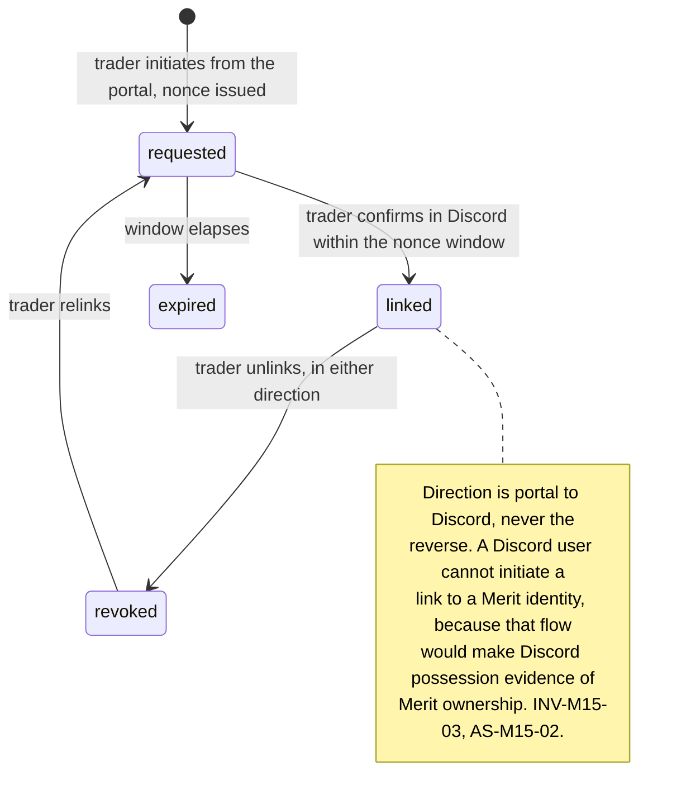
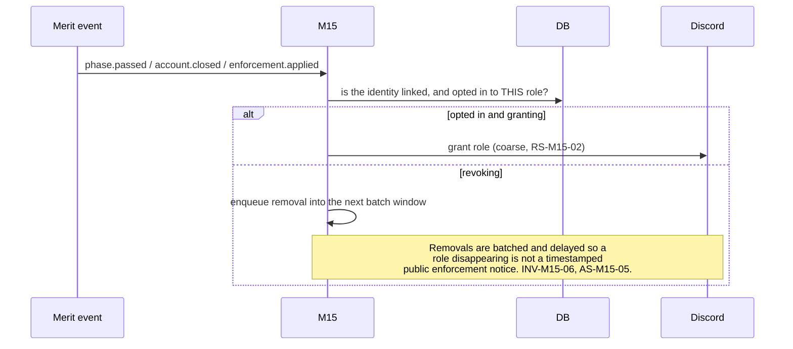
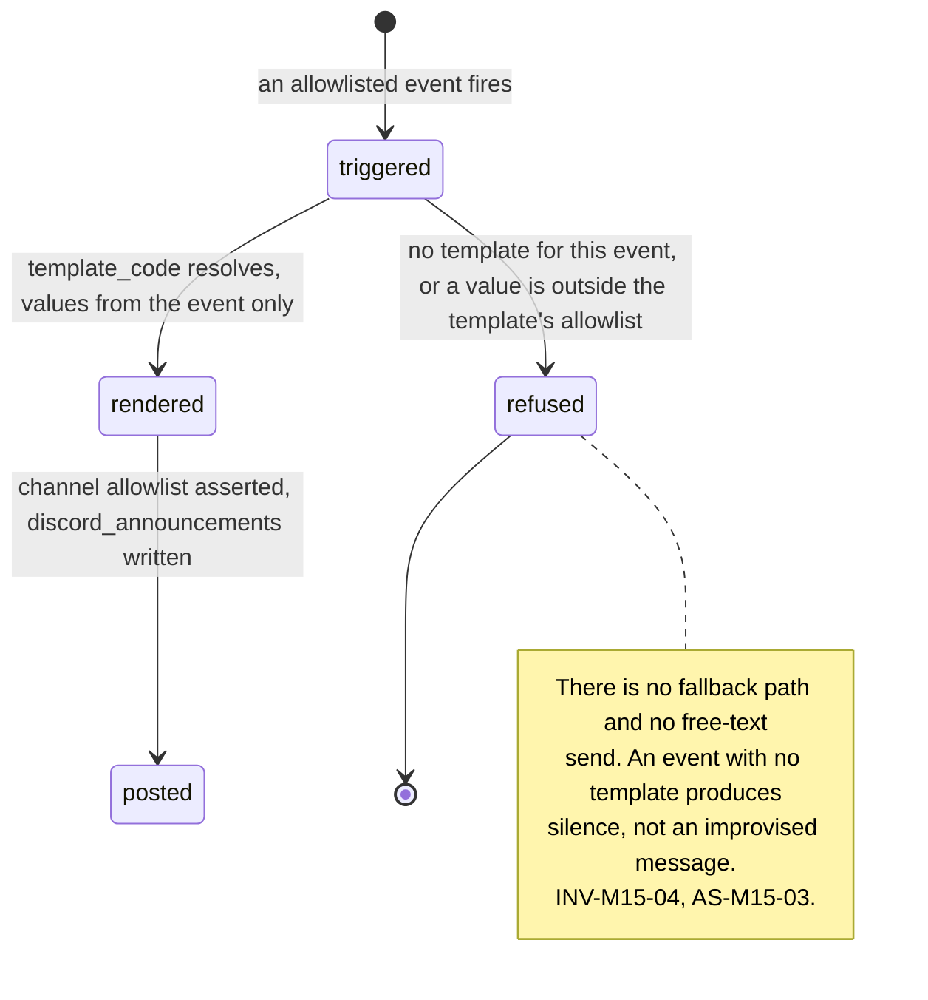

# M15: Discord Integration

Constitution section §4-ADDENDUM ("role sync on funded and payout events, announcements bot"), section 10's open decision that **Discord community bot scope is post-launch**, and Appendix B5's ten-section template. Non-money path, and the module with the widest gap in the corpus between how small it looks and how much it discloses.

One sentence governs this module: **every Discord role is a public statement about a trader, and every bot message is Merit speaking in a room it does not control.**

The market makes the case for being here. [TOP10_FIRMS](../../research/TOP10_FIRMS.md) records Tradeify running a 102,000 member Discord as its primary announcement channel, and the [dossier](../../research/ADVERSARY_DOSSIER.md) records that the same platform is where hedging syndicates, paid passing services, and copy-ring rentals coordinate. Both facts are about the same room. A firm's community server is simultaneously its best retention surface and a venue its adversaries already occupy, and this plan treats those as one problem rather than two.

**Section 10's ruling is respected rather than reargued: this module is post-launch.** It is planned now because the events it consumes and the identity link it needs are decisions that must not be retrofitted, and because building it later against a design nobody wrote is how a bot ends up holding an authentication factor.

**Identifier conventions:** `INV-M15-nn` invariants, `SD-M15-nn` schema deltas, `RS-M15-nn` role surfaces, `FM-M15-nn` failure modes, `AS-M15-nn` adversarial scenarios, `OQ-M15-nn` open questions, `DEP-M15-nn` dependencies.

---

## 1. Purpose and invariants

### 1.1 What this module is

A community Discord presence with three capabilities, each scoped tightly by what it is allowed to reveal.

| ID | Capability | Scope |
|---|---|---|
| RS-M15-01 | **Identity link** | A trader voluntarily links a Discord account to their Merit identity. One way, revocable, and never an authentication factor (AS-M15-02) |
| RS-M15-02 | **Role sync** | Roles granted from Merit state, **opt in per role**, and deliberately coarse (AS-M15-01) |
| RS-M15-03 | **Announcements** | Merit speaking: releases, rule-version publishes, status. Sourced from events, never hand-typed by the bot's credential (AS-M15-03) |

### 1.2 What this module is not

| Not M15 | Whose job | Why the boundary is here |
|---|---|---|
| Internal operational alerts | [M10](M10-integrations.md) IN-M10-05 | Two Discord integrations, separate applications, separate credentials, separate servers, separate code. [M10](M10-integrations.md) AS-M10-05 explains what one configuration mistake would cost |
| Publishing statistics | [M12](M12-transparency-platform.md) | A bot that posts "Merit paid $X this week" is a second publisher with no method page. It links to M12 or it says nothing (AS-M15-03) |
| Support | [M10](M10-integrations.md) Chatwoot | Account questions leave the public channel. A public answer with account context is an unlogged support interaction with an audience (AS-M15-06) |
| Notification delivery | [M16](M16-notification-center.md) | Discord is not a notification channel in v1. A trader's payout notice does not arrive in a chat app they share with strangers |
| Detection | [M7](M07-risk-abuse.md) | And community content is **not** a detector input, on the same reasoning as [M13](M13-trader-analytics-journal.md)'s journal (AS-M15-04) |
| Authentication | [M4](M04-trader-portal.md) | No Discord login, no Discord-based recovery, no Discord-based support verification. Ever (INV-M15-03) |

### 1.3 Invariants

| ID | Invariant | Enforcement |
|---|---|---|
| INV-M15-01 | Every role that reveals Merit state is **opt in**, per role, revocable, and its exact meaning is stated before the trader opts in | SD-M15-01. A role is a public statement about a person, and consent to be in a server is not consent to be labeled in it (AS-M15-01) |
| INV-M15-02 | Roles are **coarse**: no role encodes an amount, a plan size, a payout count, or a rank | AS-M15-01. Granularity is what turns a badge into a target list ordered by value |
| INV-M15-03 | The Discord link is **never** an authentication factor, a recovery path, or a support-verification method | Structural: the link table is unreachable from the auth and support-verification services by grant. [SECURITY](../architecture/SECURITY.md) C-01's passwordless design has exactly two factors and this is not one (AS-M15-02) |
| INV-M15-04 | The bot posts only from **event-sourced templates**; there is no free-text send path using the bot credential | AS-M15-03. A compromised token must not be able to speak a rule change into existence in Merit's own voice |
| INV-M15-05 | Every announcement links to the authoritative surface and asserts nothing that is not already published there | A rule change announced in Discord and nowhere else is a rule change with no version history |
| INV-M15-06 | Role **removal** is silent, batched, and never coincident with an enforcement | AS-M15-05. A role disappearing at the moment an account closes publishes the enforcement to everyone in the server |
| INV-M15-07 | Community content is never read by, stored for, or fed to any risk, enforcement, or evidence process | AS-M15-04, mirroring [M13](M13-trader-analytics-journal.md) INV-M13-07. And the ToS-relevant conduct rules are enforced **as moderation**, which is a different act with a different record |
| INV-M15-08 | The bot's Discord application, token, and server are entirely separate from [M10](M10-integrations.md)'s operational alerting | [M10](M10-integrations.md) INV-M10-11 and AS-M10-05. One shared credential would put liability figures one misconfiguration from a public room |
| INV-M15-09 | Nothing in this module can write to any Merit state except the link and role-preference tables | The bot has no path to accounts, payouts, flags, or config. It is a read-and-publish surface |

---

## 2. Entities and schema deltas

Two deltas, both small, both about consent.

| ID | Table | Change | Why it is not optional |
|---|---|---|---|
| SD-M15-01 | new `discord_links` | `identity_id`, `discord_user_id`, `linked_at`, `revoked_at null`, `role_opt_ins text[]`, `link_nonce_hash bytea` | INV-M15-01 and INV-M15-03. `role_opt_ins` is an array rather than a boolean because consent is **per role**: a trader may be happy to be publicly "Funded" and not at all happy to be publicly "Recently Paid". The nonce hash is what makes the link flow resistant to a replayed link request, and storing only the hash keeps a stolen database from yielding live link tokens |
| SD-M15-02 | new `discord_announcements` | `id`, `event_id`, `template_code`, `channel_id`, `rendered_body`, `posted_at`, `provider_message_ref` | INV-M15-04 and INV-M15-05. Every message Merit has ever posted in its own community, reproducible, with the event that caused it. In a market where one announcement destroyed a firm ([TOP10_FIRMS](../../research/TOP10_FIRMS.md)'s FundingTicks entry), being able to prove exactly what was said and when is worth a table |

**Deliberately not modelled: no message content, no member list, no channel activity.** Merit stores the link, the consent, and its own announcements. The community's conversation belongs to the community and to Discord (INV-M15-07).

---

## 3. State machines

### 3.1 Link lifecycle

### 3.2 Role sync

### 3.3 Announcement

---

## 4. API endpoints touched

| Endpoint | M15's role | Notes |
|---|---|---|
| `POST /me/discord/link` **NEW** | Owns | Issues the nonce. Session scoped, portal initiated only |
| `DELETE /me/discord/link` **NEW** | Owns | Revokes, and removes every synced role in the next batch window |
| `PATCH /me/discord/roles` **NEW** | Owns | Per-role opt in and out, each with its published meaning shown at the point of choice |
| `POST /webhooks/discord` **NEW** | Owns | Link confirmation only. Signature verified, replay window, nonce single use ([SECURITY](../architecture/SECURITY.md) C-06) |
| `GET /admin/discord/announcements` **NEW** | Owns | The posted record (SD-M15-02). Read only, admin origin |

**Absent by design: no endpoint accepts a Discord user id as an identifier for anything.** A Discord id resolves to a Merit identity in exactly one direction, inside this module, for role sync only.

---

## 5. Events emitted and consumed

| Event | When | Notes |
|---|---|---|
| `discord.linked` / `.unlinked` **NEW** | link lifecycle | `{ identity_id }`. No Discord id in the payload. Consumers: FEED, BI |
| `discord.role_synced` **NEW** | grant or batched removal | `{ identity_id, role_code, direction }`. Consumers: FEED |
| `discord.announcement_posted` **NEW** | a post succeeds | `{ event_id, template_code, channel_id, message_ref }`. Consumers: FEED, EVID |
| `discord.announcement_refused` **NEW** | no template, or a value outside the allowlist | `{ event_id, reason }`. Consumers: ALERT (warn), FEED. A refusal means an event fired that somebody expected to announce |

**Consumed:** `phase.passed`, `account.graduated`, `account.closed`, `enforcement.applied` (removal only, batched), `plan.version_published`, and `status.incident_*`. **Deliberately not consumed: `wallet.credited` and every other payout event** unless the trader opted into a payout-visible role, and OQ-M15-02 recommends that role not exist at all.

---

## 6. Failure modes

| ID | Failure | Blast radius | Detection | Recovery |
|---|---|---|---|---|
| FM-M15-01 | A role reveals more than the trader consented to | Private financial state published to a public room | Per-role consent (INV-M15-01), and a role-catalogue test asserting each role's information content | Coarse roles only (INV-M15-02). AS-M15-01 |
| FM-M15-02 | The Discord link becomes an auth or verification path | Compromising a chat account compromises a trading account | Grant separation, plus a negative test from the auth and support services | INV-M15-03. AS-M15-02 |
| FM-M15-03 | Bot token compromised | An attacker announces a rule change in Merit's voice, in the room where Merit's community lives | Token scope minimal, channel allowlist asserted per post, and `discord_announcements` as the record of truth | Template-only posting (INV-M15-04) bounds what a stolen token can say. AS-M15-03 |
| FM-M15-04 | Role removal times an enforcement publicly | Merit publishes a private enforcement by omission | Batched, delayed removals (INV-M15-06) | AS-M15-05 |
| FM-M15-05 | Community content is used in an investigation | The journal failure, replayed on a surface with witnesses | No storage, no grant (INV-M15-07) | AS-M15-04 |
| FM-M15-06 | Support answers an account question in public | Unlogged support with account context, in front of an audience | Channel policy, plus a bot response that routes to the support inbox | AS-M15-06 |
| FM-M15-07 | Discord outage or rate limit | Roles drift from Merit state | Sync lag metric, reconciliation sweep | Idempotent reconciliation, and roles are not load bearing for anything |
| FM-M15-08 | The operational alert integration posts here | Liability figures in a public room | Separate applications and credentials (INV-M15-08) | [M10](M10-integrations.md) AS-M10-05's channel assertion, from both sides |

---

## 7. Adversarial scenarios

**Six listed, six novel.**

### AS-M15-01: The role that publishes a trader's finances (NOVEL)

**Attack.** Role sync is the module's headline feature and the most common implementation is the dangerous one. A "Funded" role tells everyone in a public server which members hold live simulated capital. A "Recently Paid" role tells them who just received money, this week, by name. Tiered roles by account size publish the size. The trader agreed to join a Discord server; they did not agree to have their financial state broadcast to it, and in the usual implementation they were never asked.

**Who uses it, and this is not speculative.** The [dossier](../../research/ADVERSARY_DOSSIER.md) records that paid passing services and copy-ring rentals recruit on exactly these platforms. A funded-role list is a **pre-qualified prospect list** for those services, delivered by Merit, refreshed automatically. A payout-role list is better still: it identifies people with money moving right now, which is the population worth targeting for account takeover and for social engineering. This is [M11](M11-certificates-social-proof.md) AS-M11-06's leaderboard problem with two aggravating factors: it is automatic rather than opt in, and it updates in real time.

**Counter.**
1. **Opt in per role, with the role's exact meaning shown at the moment of choosing** (INV-M15-01). Consent to be in a room is not consent to be labeled in it, and a single global "sync my roles" toggle hides the distinction that matters, which is that traders feel very differently about "Funded" and "Paid this week".
2. **Coarse roles only** (INV-M15-02). No amount, no size, no count, no rank, no tier. A role says a trader has reached a stage, and nothing about how much.
3. **The payout-visible role is recommended not to exist** (OQ-M15-02). It is the single most targetable signal in the estate and its only benefit is community texture that a trader can produce themselves with an [M11](M11-certificates-social-proof.md) certificate, which is consented per instance rather than standing.
4. **Opt-out is immediate and removes the role**, and, per INV-M15-06, does so in the batch window so leaving is not itself an event. EC-110, GS-186.

### AS-M15-02: The chat account that becomes a trading credential (NOVEL)

**Attack.** Once a Discord identity maps to a Merit identity, the mapping starts looking like proof. Three ways it gets used, each one a small step from the last: a support agent accepts "I am @handle, the linked account" as verification; a recovery flow offers "confirm through Discord" as a convenience; and a bot command like `/mypayouts` returns account state to whoever controls the Discord account.

**Why the endpoint of that path is severe.** [SECURITY](../architecture/SECURITY.md) C-01 makes Merit passwordless precisely so there is no credential to stuff, and D1 names trader sessions as a crown jewel because account takeover leads to payout redirection. Discord accounts are compromised constantly, are protected by a password by default, and are outside Merit's control entirely. Making one a factor imports the whole password-stuffing threat model Merit designed itself out of, through a community feature nobody classified as security relevant.

**And the direction of the link matters as much as its use.** If a Discord user can initiate a link to a Merit identity, then possession of a Discord account becomes evidence about a Merit account, which is the same failure at the other end.

**Counter.**
1. **The link is initiated from the authenticated portal only** (section 3.1), with a single-use nonce confirmed in Discord. Possession of the Discord account proves only that the person holding the Merit session also holds it.
2. **The link table is unreachable from the auth and support-verification services by grant** (INV-M15-03), with a negative test in the D5 family.
3. **No bot command returns account state.** Not balance, not payout history, not gate progress. The bot's reply to any such request is a link to the portal. This costs a genuinely nice feature and removes an entire attack surface, and it is the right trade because the nice feature is one click away in a place that is actually authenticated.
4. **Support's verification runbook does not list Discord**, and [dossier item 9](../../research/ADVERSARY_DOSSIER.md)'s prohibition on support-initiated identity changes without the runbook applies unchanged. EC-111, GS-187.

### AS-M15-03: A stolen bot token speaks in Merit's voice (NOVEL)

**Attack.** A Discord bot token is a bearer credential. It lives in a deploy environment, is used by a long-running process, and grants the ability to post as Merit in Merit's own community. An attacker with it does not need to touch a database. They post a **rule change**.

**Why that is the worst available outcome for this specific firm.** [TOP10_FIRMS](../../research/TOP10_FIRMS.md)'s watchlist carries FundingTicks as "the live case study in how one announcement destroys a brand", after a retroactive rule change with profit clawbacks. Merit's entire market position is that rules do not change retroactively and that every parameter has a version history. A convincing fake announcement of a retroactive change, posted in Merit's official channel by Merit's official bot, would be screenshotted within seconds and would spread faster than any correction. The damage is done at the screenshot, not at the correction. Adjacent versions: a fake payout-suspension notice, a fake "verify your wallet here" link during a real incident, or a fake status update contradicting the real status page.

**Counter, and it is about bounding what a valid credential can say rather than about protecting the credential.**
1. **Template-only posting** (INV-M15-04). The bot has no free-text send path. Every message resolves from an allowlisted `template_code` with values drawn from the triggering event, so a stolen token can replay a legitimate announcement and cannot compose a new claim.
2. **Channel allowlist asserted per post**, so the token cannot post outside the channels it exists for.
3. **`discord_announcements` is the record** (SD-M15-02): what Merit said, when, and which event caused it. A disputed announcement resolves against a table rather than a memory.
4. **Every announcement links to the authoritative surface** (INV-M15-05), so a message with no corresponding rules-page version or status entry is self-evidently wrong to anyone who checks, and the community can be told once that this is the rule.
5. **Token on the 90 day rotation** ([SECURITY](../architecture/SECURITY.md) C-14), and a pre-written incident template for "our Discord bot posted something we did not author", because constitution section 7 requires comms templates in advance and this is a comms incident before it is a technical one. EC-112, GS-188.

### AS-M15-04: Merit hosts the room where the rings recruit (NOVEL)

**Attack.** The [dossier](../../research/ADVERSARY_DOSSIER.md) is explicit that hedging syndicates, paid passing services, and copy-ring rentals coordinate on Discord and Telegram. Operating an official Merit server means Merit is now the host of a venue where its own adversaries can find each other, and where a recruiter's best possible targeting signal is the funded-role list Merit itself publishes (AS-M15-01).

**The tempting response, and why it is a trap.** Merit has moderator visibility into its own server. Mining that content for enforcement signals would be cheap and would find real violations: people do post "anyone want to run the other side". Doing it creates four problems at once. It makes community content an evidence source, which is [M13](M13-trader-analytics-journal.md) AS-M13-03's failure with an audience. It catches the careless and misses the organized, who move to a private server the moment they suspect it. It makes Merit's community a place where members assume they are being surveilled, which destroys the retention value the server exists for. And it imports a category of soft, unverified, self-reported evidence into an enforcement process [M07](M07-risk-abuse.md) deliberately built on conduct.

**Counter, which separates two things that look alike.**
- **Community content is never a detector, enforcement, or evidence input** (INV-M15-07). No storage, no ingestion, no grant.
- **Moderation is a different act with a different record.** Solicitation of prohibited arrangements violates the server rules and is moderated as such: removed, and the member banned from the server. That is a hosting decision made on hosting grounds, and it does not touch the trader's Merit account, produce a flag, or enter an evidence pack.
- **The two are kept apart deliberately**, and the reason is stated publicly in the server rules: moderation protects the room, and enforcement against a trading account rests on conduct in the trading account. A trader who is banned from the Discord and keeps their funded account is exactly the outcome that proves the separation is real.
- **The recruitment surface is narrowed at its source** by AS-M15-01's counters, which is the intervention that actually reduces harm: no funded-role list means no pre-qualified prospect list. EC-113, GS-189.

### AS-M15-05: The role that vanishes is an enforcement notice (NOVEL)

**Attack.** A trader is enforced against and their account closes. The role sync removes their "Funded" role. In a server where members can see each other's roles, the removal is visible, immediate, and timestamped. Merit has published an enforcement action against a named individual to a public room, without deciding to, and the inference is available to anyone watching: the role went away at 14:32, therefore something happened at 14:32.

**Why this is worse than it first appears.** [M07](M07-risk-abuse.md)'s enforcement process is careful, evidence backed, and private, and the batch 1 gate's two-tier evidence pack ruling exists specifically to control what a trader and what the public may see. A role change bypasses all of that machinery in a single API call. It also creates a signal an adversary can farm: a ring can watch role churn to learn Merit's detection cadence, which tells them how long a scheme survives, which is genuinely useful intelligence.

**Counter.**
- **Removals are batched and delayed** (INV-M15-06), on a window wide enough that a removal is not attributable to a moment. Grants may be immediate, because a grant discloses only what the trader opted into disclosing.
- **Removals are never coincident with an enforcement**, and a removal that would land in the same window as one is deferred to the following window.
- **Removals include ordinary churn** in the same batch: unlinks, opt-outs, and expirations. A batch containing only enforcement removals is a batch that publishes them, so the window is chosen to make batches mixed.
- **The trader is told first** that their role will be removed, through [M16](M16-notification-center.md), so nobody learns their own status change from a Discord sidebar. GS-190.

### AS-M15-06: Support in public (NOVEL)

**Attack.** Traders will ask "where is my payout" in the community channel, because that is where people are. Somebody from Merit will answer, because ignoring it looks worse. The answer requires account context, so it is either useless or it discloses account state in public. And in the payout-anxiety case, which is the one that matters most, the pressure to answer specifically is highest exactly when the disclosure is most sensitive.

**Two harms.** The trader's account state is public, including sometimes a freeze, a KYC issue, or a flag, none of which the trader would have chosen to publish. And the interaction is unlogged: it is not in Chatwoot, not in `support_context_views` ([M10](M10-integrations.md) SD-M10-03), and not in any record, so Merit has an unauditable support channel with an audience, which is the combination [M10](M10-integrations.md) AS-M10-01 spent an entire scenario preventing on a private surface.

**Counter.**
- **A published channel policy and a bot that enforces it gently**: an account-specific question gets an automatic reply routing to the support inbox, with the link, immediately, so the trader is helped rather than ignored.
- **No Merit representative answers an account-specific question in a public channel**, stated as a rule in the support runbook, with the reason given so it is followed rather than resented.
- **General questions are answered publicly and well**, because that is what a community is for, and the distinction is whether the answer needs to know who is asking.
- **The bot never returns account state** (AS-M15-02's counter 3), so there is no "just use the bot" shortcut that reintroduces the disclosure. GS-191.

---

## 8. Test plan

### 8.1 Suites

| Suite | Prefix | Count | Runs | Blocks |
|---|---|---|---|---|
| Link flow: direction, nonce single use, replay, revocation | `M15-L-nn` | 8 | every commit | merge |
| Role consent: per-role opt in, coarseness assertion over the role catalogue | `M15-R-nn` | 7 | every commit | merge |
| Removal batching and enforcement decoupling | `M15-B-nn` | 5 | every commit | merge |
| Announcement templating (negative: no free-text path, no unknown template) | `M15-A-nn` | 6 | every commit | merge |
| Negative authz and grant separation (auth, support, risk, evidence) | `M15-N-nn` | 6 | every commit | merge |
| Credential separation from [M10](M10-integrations.md)'s alerting | `M15-S-nn` | 3 | every commit | merge |
| Reconciliation sweep after a Discord outage | `M15-O-01` | 1 | nightly | nightly alarm |
| Golden fixtures | `GS-nnn` | 6 owned (GS-186 to GS-191) | every commit | merge |

### 8.2 Named scenarios owned by this module

| ID | Scenario | Pins |
|---|---|---|
| GS-186 | Role sync for a trader who opted into one role and not another | Only the consented role is granted; no role encodes an amount, size, count, or rank. AS-M15-01 |
| GS-187 | Discord identity presented to auth, recovery, and support verification | All three refuse; the link table is unreachable from each by grant. A bot state query returns a portal link. AS-M15-02 |
| GS-188 | Bot token used to post an unknown template and a free-text message | Both refused. A replayed legitimate template posts and is recorded. AS-M15-03 |
| GS-189 | Prohibited-arrangement solicitation observed in the community | Moderated as a server matter, producing **no flag, no evidence entry, and no account action**. AS-M15-04 |
| GS-190 | Enforcement closes an account holding a synced role | Removal is deferred to a batch window containing mixed churn, and the trader was notified first. AS-M15-05 |
| GS-191 | Account-specific question asked in a public channel | Automatic routing reply, no account state disclosed, and no human answer in channel. AS-M15-06 |

### 8.3 Coverage rule

**Every role in the catalogue has a test asserting exactly what a member of the public can infer from seeing it**, expressed as an allowlist of facts. A role whose inference set is not written down is a role whose disclosure nobody has measured, which is how AS-M15-01 happens.

---

## 9. Observability

### 9.1 Metrics

| Metric | Why it matters |
|---|---|
| Link rate and unlink rate | Unlink rate is the consent signal: a rising one means the roles disclose more than traders expected |
| Per-role opt-in share | AS-M15-01. A low opt-in on a role is the community telling Merit that role should not exist |
| Role sync lag and reconciliation drift | FM-M15-07 |
| Removal batch composition (share of enforcement removals per batch) | AS-M15-05. A batch that is mostly enforcement removals publishes them |
| Announcement refusals by reason | An event fired that somebody expected to announce, or a template drifted |
| Public account-question routing count | AS-M15-06's volume, and the input to whether the channel policy is working |
| Bot token age against the rotation calendar | FM-M15-03 |

### 9.2 Alerts

| Alert | Threshold | Severity |
|---|---|---|
| Free-text or unknown-template post attempted | any | **page**. Either a code path exists that should not, or the token is compromised |
| Post to a channel outside the allowlist | any | **page** |
| Link table accessed from auth, support-verification, risk, or evidence | any | **page** |
| Removal batch composed only of enforcement removals | any | warn, widen the window |
| Sync drift after reconciliation | above threshold | warn |
| Operational alert content detected on the community application | any | **page**. [M10](M10-integrations.md) AS-M10-05 from this side |

### 9.3 Dashboard

M15 supplies a small panel: opt-in shares per role, unlink rate, sync drift, and announcement refusals. **If only one number could be shown it would be per-role opt-in share**, because it is the only measurement of whether the community agrees with Merit about what is safe to publish about them.

---

## 10. Open questions for the founder

**OQ-M15-01. Confirming section 10's post-launch scoping.** The constitution leaves Discord bot scope as a post-launch decision and this plan assumes that stands. Two pieces are worth pulling forward regardless: the **event allowlist** and the **link direction**, because both are cheap now and expensive to retrofit, and a link built later without INV-M15-03 in mind is exactly how a chat account becomes a credential. Proposed: **build the link and the announcement templates in the launch quarter; ship role sync post-launch**, after the community exists and its norms are visible.

**OQ-M15-02. Does a payout-visible role exist at all?** AS-M15-01 argues it is the most targetable signal Merit could publish and that its benefit is community texture a trader can already create for themselves with an [M11](M11-certificates-social-proof.md) certificate, consented per instance. Proposed: **it does not exist.** Traders who want to share a payout share a certificate, which is their choice each time rather than a standing broadcast.

**OQ-M15-03. Where is the boundary between moderation and enforcement, in published words?** AS-M15-04 proposes that server rules govern the room and account conduct governs the account, and that a member banned from Discord keeps their funded account. That is an unusual position and it should be stated deliberately, because the alternative reading, that public solicitation of a prohibited arrangement is itself evidence, is defensible and would change both this module and [M07](M07-risk-abuse.md). Recommendation: **keep them separate and publish the separation**, on the grounds that surveillance of the community catches the careless, misses the organized, and costs the retention value the server exists for.

**OQ-M15-04. Should Discord ever be a notification channel?** [DATA_MODEL](../architecture/data-model/README.md) reserves `push` on `notifications` and Discord is not among the channels. Proposed: **no.** A payout notice arriving in a chat application the trader shares with strangers is a disclosure risk for a convenience already served by email and in-app, and adding a channel to [M16](M16-notification-center.md)'s matrix that Merit does not control is a preference nobody can honor reliably.

---

### Dependencies on other modules

| ID | Dependency | Owner | Consequence if unmet |
|---|---|---|---|
| DEP-M15-01 | M10's operational Discord integration uses a separate application, credential, and server | M10 | [M10](M10-integrations.md) AS-M10-05: liability figures are one misconfiguration from a public room |
| DEP-M15-02 | The auth and support-verification services hold no grant on `discord_links` | INFRA, M4 | INV-M15-03 becomes advisory, and AS-M15-02's path opens one convenience at a time |
| DEP-M15-03 | M7 and the evidence services hold no grant on any community content, and none is stored | M7, INFRA | AS-M15-04's temptation has nothing standing in its way |
| DEP-M15-04 | M16 notifies a trader before a role is removed | M16 | A trader learns their own status change from a Discord sidebar |
| DEP-M15-05 | M12 owns every published aggregate | M12 | The announcements bot becomes a second publisher with no method page |
| DEP-M15-06 | M11 certificates exist as the consented, per-instance alternative to a payout role | M11 | OQ-M15-02's recommendation loses its substitute, and the pressure for a standing broadcast returns |
