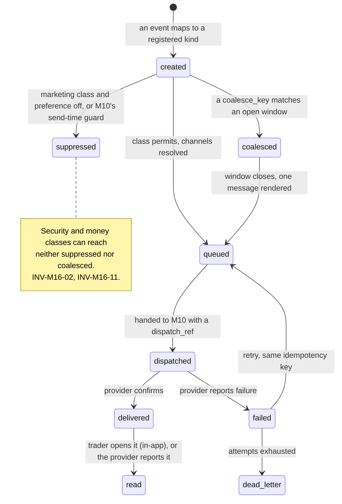
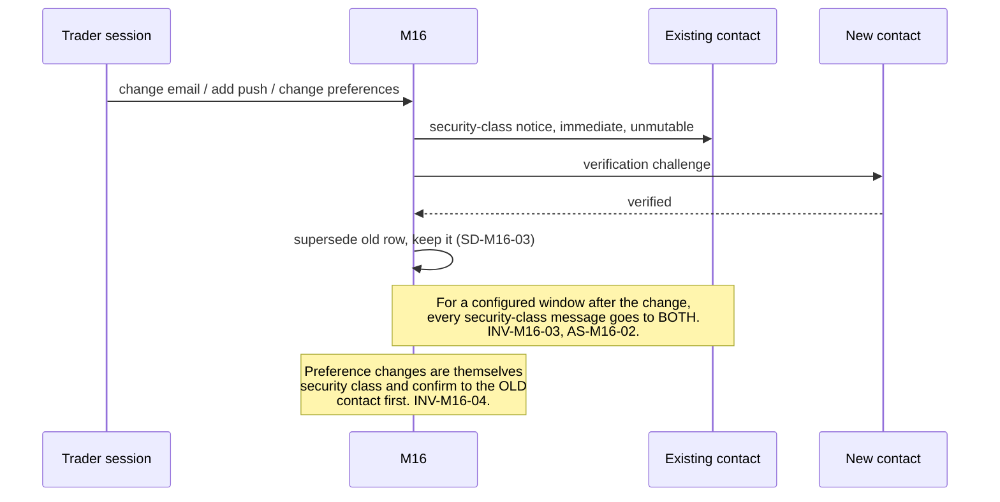
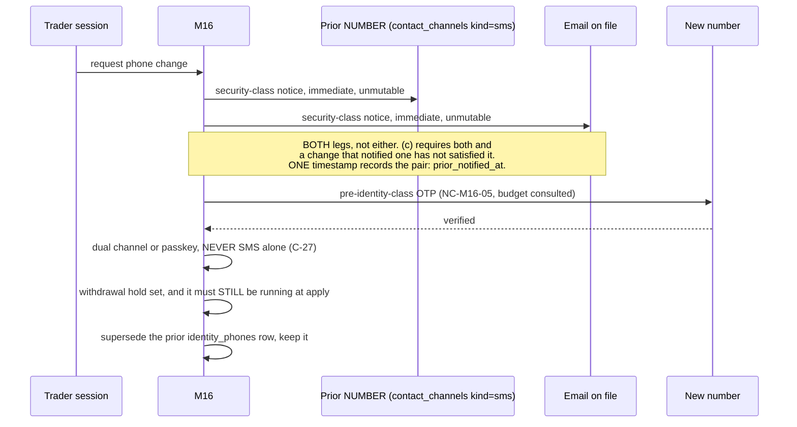
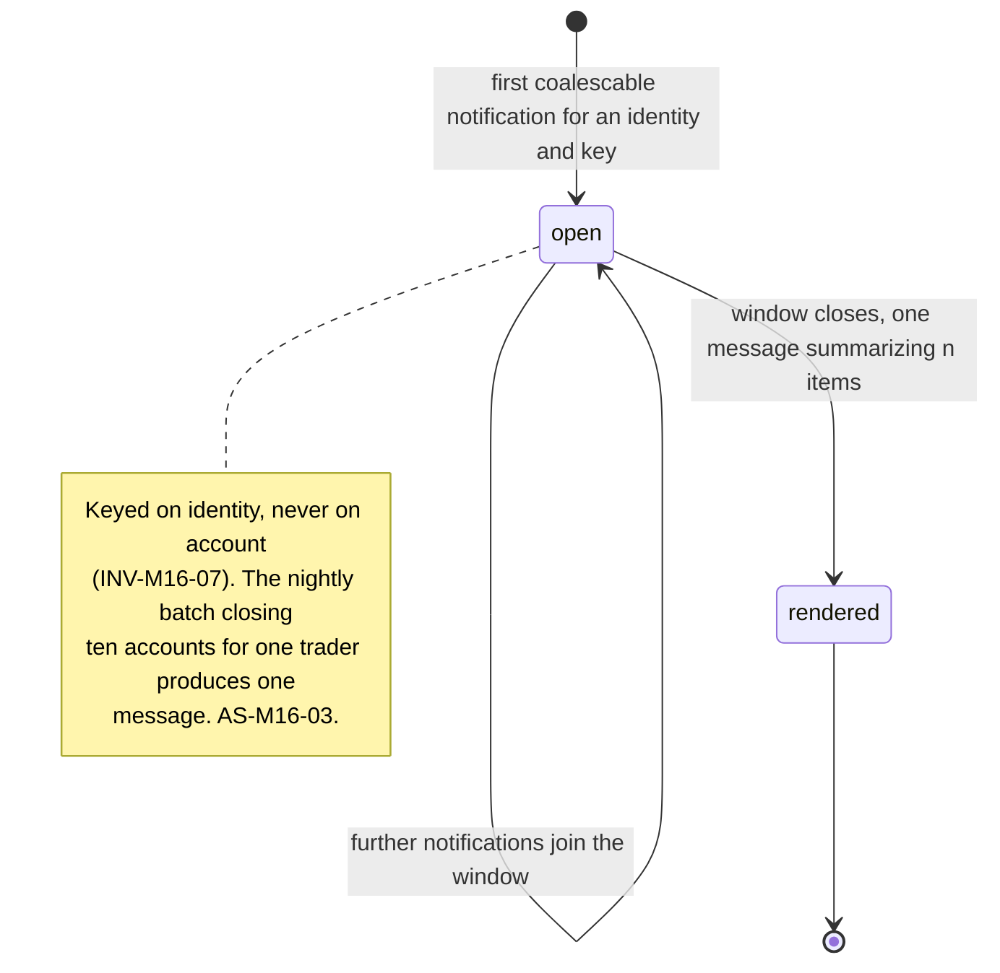

# M16: Notification Center

Constitution section §4-ADDENDUM ("in-app, email, and push preference matrix, event driven"), [EVENTS section 11](../architecture/EVENTS.md)'s lifecycle triggers and their suppression guards, Appendix B5's ten-section template, and Appendix D4's destination-change controls. Non-money path, with three exceptions named in 1.4 that are held to a higher standard because a notification is sometimes the only control standing between an attacker and a payout. **The third arrived with [ADR-039](../decisions/ADR-039.md)**: the pre-identity class is not about a payout at all, and it is held to that standard because its send path spends money on an attacker-supplied destination.

One sentence governs this module: **a preference is a promise about what Merit will send, and there is a small set of messages a trader must never be able to switch off, so the entire design is the argument about where that line sits.**

Two failures bracket this module. Sending too much trains traders to ignore Merit, so the one message that mattered is the one they deleted unread. Sending too little, or letting a preference silence a security or payout notice, means a trader learns about a frozen payout or a changed withdrawal destination from a bank statement. Constitution section 7 is unambiguous about which direction to err in on payout matters: over-communicate, because payout trust is the brand.

**Identifier conventions:** `INV-M16-nn` invariants, `SD-M16-nn` schema deltas, `NC-M16-nn` notification classes, `FM-M16-nn` failure modes, `AS-M16-nn` adversarial scenarios, `OQ-M16-nn` open questions, `DEP-M16-nn` dependencies.

---

## 1. Purpose and invariants

### 1.1 What this module is

The preference matrix, the templates, the in-app inbox, and the decision about **who gets told what, on which channel, and whether they may decline.**

### 1.2 The five classes, which are the module's real specification

Every notification kind belongs to exactly one class, and the class decides what a preference can do to it.

| ID | Class | Mutable? | Channels | Examples |
|---|---|---|---|---|
| NC-M16-01 | **Security** | **No.** Not by preference, not by any setting | Every verified channel on file, **and every prior one** (AS-M16-02) | Destination change, **phone change**, KYC state change, new device sign-in, password-equivalent credential change, role or access change |
| NC-M16-02 | **Money** | **No** | Email plus in-app, always | Payout approved, wallet credited, withdrawal settled, **withdrawal failed**, freeze applied, freeze expiring, chargeback, refund |
| NC-M16-03 | **Account state** | Channel choice only; cannot be silenced entirely | Trader's choice among email and in-app | Passed, breached, graduated, plan version pinned at purchase, reset available |
| NC-M16-04 | **Marketing and lifecycle** | **Fully mutable**, including off | Trader's choice | Win-backs, offers, product news, community |
| NC-M16-05 | **Pre-identity auth** **NEW** | **No, and there is nobody to hold a preference.** The generated `mutable` column already says so: `pre_identity_auth` is not in (`account_state`, `marketing`), so nobody may opt out of the OTP proving they hold the number they are registering | SMS or email, to the destination supplied at registration and to nothing else | Registration OTP, phone-verification OTP |

**NC-M16-05 is [ADR-039](../decisions/ADR-039.md) amendment 2 and it is the module's first class that is not about a customer.** It exists because the four above were all written for a **known recipient**, and a registration OTP has none.

**Three properties follow, and the third is the one that would be got wrong.**

1. **It is never rate-limit exempt.** `notification_kinds.rate_limit_exempt` is a **generated** column, `class IN ('security','money')`, so the new class is non-exempt **by construction** rather than by anybody remembering (`SD-M16-07`). INV-M16-12.
2. **It is never coalesced.** `notification_kinds_immutable_never_coalesced` was dropped and re-added to include it. Three OTP requests are three codes, and collapsing a burst of them into one message delivers one code for three challenges, which is a broken login rather than a tidy inbox.
3. **It is a policy row and never a `notifications` row, and the reason is structural rather than an omission.** `notifications.identity_id` is `NOT NULL` (`0019`), so a pre-identity message **cannot be a `notifications` row at all**: there is no identity yet, which is what "pre-identity" means. The kind exists here so the SMS sender can ask whether to consult `otp_send_budget`; the **delivery record** is `otp_challenges` plus an `integration_dispatches` row. **A later session "completing the pair" by widening `notifications.class` would be adding a value that no row can ever legally carry.**

**The line sits between NC-M16-03 and NC-M16-04, and between "which channel" and "whether at all".** A trader may always choose a channel. A trader may only choose silence on the marketing class. That is a stronger commitment than most products make and it is the one the constitution's payout-trust doctrine requires: [EVENTS section 11](../architecture/EVENTS.md) says of `payout.transfer_failed`, "always send; silence is what kills payout trust", and a preference matrix that could mute it would be a control with a hole shaped exactly like the failure it exists to prevent.

### 1.3 What this module is not

| Not M16 | Whose job | Why the boundary is here |
|---|---|---|
| Delivering to a vendor | [M10](M10-integrations.md) | M16 decides and renders; M10 transports. The suppression guards evaluate at send in M10 ([M10](M10-integrations.md) AS-M10-03) and the **class** is decided here |
| Deciding an offer exists | [M17](M17-offers-engine.md) | M16 never invents a reason to contact somebody |
| Discord | [M15](M15-discord-integration.md) | Discord is not a notification channel (M15 OQ-M15-04). A payout notice does not arrive in a chat app shared with strangers |
| The in-app rendering | [M4](M04-trader-portal.md) | M16 owns the inbox data and the unread semantics; M04 renders them |
| Deciding what a trader may know | [M7](M07-risk-abuse.md) and the two-tier evidence ruling | M16 renders the **trader tier** of any enforcement-adjacent message and never the internal tier (AS-M16-04) |

### 1.4 Invariants

| ID | Invariant | Enforcement |
|---|---|---|
| INV-M16-01 | Every notification kind is registered with a class, and a kind without a class cannot be sent | Registry test. An unclassified kind is a kind whose mutability nobody decided |
| INV-M16-02 | Security and money class messages **cannot be disabled by any preference**, and the preference UI shows them as always-on with the reason | SD-M16-01's class check. Hiding them from the UI would be worse: a trader must be able to see what they cannot switch off |
| INV-M16-03 | A security-class message goes to **every verified channel on file and to the immediately previous contact**, for a configured window after any contact change | AS-M16-02. Notifying only the current contact is a control an attacker disables by acting first |
| INV-M16-04 | Preference changes are themselves security-class events, and take effect **after** a confirmation to the existing contact | AS-M16-02. Otherwise the first step of an account takeover is muting the alarms |
| INV-M16-05 | Message content is Merit's, rendered from a versioned template, and **stored in `notifications`** | [M10](M10-integrations.md) AS-M10-06. A message whose text lives only in a vendor cannot be reproduced in an evidence pack or resent after a migration |
| INV-M16-06 | No notification body contains detector internals, thresholds, flag detail, population comparisons, or another identity | AS-M16-04, extending the batch 1 gate's two-tier evidence ruling to outbound messages, which are the least controlled surface it applies to |
| INV-M16-07 | Notifications are **coalesced per identity**, not emitted per account | AS-M16-03. A trader with ten accounts receives one nightly summary, not ten messages |
| INV-M16-08 | A new notification kind defaults to its **class default**, never to enabled-for-everyone | AS-M16-06. Shipping a kind that switches itself on for every existing trader is how a product spams the people who trusted it longest |
| INV-M16-09 | `read_at` is a convenience, never evidence of notice | AS-M16-05. Proof of notice is the dispatch record plus the delivery receipt, and the distinction matters the first time a freeze or a ToS change is disputed |
| INV-M16-10 | Every trader-facing message about money states the two legs honestly | [M09](M09-marketing-site.md) INV-M9-09 and AS-M9-06 applied to transactional copy: wallet credit is same day, external withdrawal is 2 to 3 business days, and neither appears alone |
| INV-M16-11 | Rate limiting and coalescing never apply to the security or money classes | A quota that can drop a freeze notice is a quota that will, on the busiest day, which is the day it matters. **[ADR-039](../decisions/ADR-039.md) records this invariant as CONFIRMED, not amended**, and `rate_limit_exempt` is generated as `class IN ('security','money')`, which is this sentence in DDL |
| INV-M16-12 | **The exemption is post-identity, and the split is the invariant.** A message to an authenticated recipient at an address Merit already holds is `INV-M16-11`'s subject. A message to an **attacker-supplied destination before any identity exists** is not, and it carries per-number, per-IP and per-country velocity plus a **global cost circuit breaker** | NC-M16-05, `SD-M16-04`'s `otp_send_budget`, and `SD-M16-07`'s generated `rate_limit_exempt`. **The breaker degrades rather than stopping**, and its trip, its degraded window and its recovery each alarm. [SECURITY](../architecture/SECURITY.md) C-28, AS-M16-07 |

**`INV-M16-11` is CONFIRMED, not amended, and [ADR-039](../decisions/ADR-039.md) says so in those words.** Nothing about it moves: the security and money classes stay exempt from rate limiting and coalescing, for exactly the reason written beside it. **What changed is that a fifth class exists which is neither of them**, so the exemption no longer reaches the pre-identity surface by default.

**The distinction it was always making, now stated.** `INV-M16-11` was written for **post-identity** messages: the recipient is authenticated and the address is one Merit already verified, so an exemption there costs Merit a message it wanted to send anyway. Registration OTP is the opposite on both counts. **The recipient is unauthenticated and the destination is chosen by whoever is at the keyboard**, so a rate-limit exemption there is not a promise to a customer, it is a blank cheque written to a stranger. **Applied to an attacker-supplied number, the exemption funds the attack** (AS-M16-07). Two classes, and the invariant that was right stays exactly as it was.

---

## 2. Entities and schema deltas

M16 consumes the approved `notifications` and `notification_preferences` ([DATA_MODEL section 10](../architecture/data-model/README.md)). **Seven deltas: three at the schema-delta reconciliation and four at [FOLD-01](FOLD-01-phone-identity.md).**

| ID | Table | Change | Why it is not optional |
|---|---|---|---|
| SD-M16-01 | new `notification_kinds` | `kind`, `class check in ('security','money','account_state','marketing')`, `title`, `template_code`, `template_version`, `default_channels text[]`, `mutable boolean generated from class`, `coalesce_key_spec text null` | INV-M16-01, INV-M16-02, INV-M16-08. The class is the module's entire policy and it belongs in data, where it can be reviewed in one query, rather than distributed across handlers. `mutable` is generated from `class` so the two can never disagree, which is the sort of drift that produces a mutable money notification eighteen months from now |
| SD-M16-02 | `notifications` | add `class`, `template_version`, `rendered_body text`, `coalesce_key text null`, `dispatch_ref uuid null fk integration_dispatches`, `delivery_status`, `delivered_at null` | INV-M16-05 and INV-M16-09. `rendered_body` is what makes a message reproducible years later, and the split between `sent_at`, `delivery_status`, and `read_at` is what makes AS-M16-05's distinction between dispatch, delivery, and reading expressible at all |
| SD-M16-03 | new `contact_channels` | `id`, `identity_id`, `kind check in ('email','push')`, `value_hash`, `verified_at null`, `superseded_at null`, `superseded_by null` | INV-M16-03. Notifying "the previous contact" requires the previous contact to exist as a row rather than as a value that was overwritten. This is the schema that makes the classic account-takeover countermeasure possible, and its absence is why that countermeasure is so often missing |

**The four FOLD-01 deltas**, from [ADR-039](../decisions/ADR-039.md) and landed in [`0029_phone_identity_and_auth`](../../packages/db/migrations/0029_phone_identity_and_auth.sql).

| ID | Table | Change | Why it is not optional |
|---|---|---|---|
| SD-M16-04 | new `otp_send_budget` | pk `(scope_kind, scope_key, evaluated_on)` over `phone`, `ip`, `country` and `global`; `sends` / `send_limit`, `spend_cents` / `budget_cents`, `state check in ('armed','degraded','manually_overridden')`, `tripped_at`, `alarm_raised_at`, `recovered_at`, `deferred_registrations`, and a dated override | INV-M16-12, AS-M16-07. Built on `plan_breaker_state`'s pattern from `0016` rather than a new idiom. **`state` has no stopping value and the absence is the founder's ruling**, not an oversight. `otp_send_budget_degraded_is_alarmed` refuses to store a silent trip, and `deferred_registrations` is the reported figure ADR-039 requires, given somewhere to live so it is not a control citing an input that does not exist |
| SD-M16-05 | `otp_challenges` | add `channel check in ('email','sms')` and `destination_hash`; `email_normalized` relaxed to nullable under `otp_challenges_exactly_one_destination` | SMS OTP. **Exactly one destination, and it is the one the channel names**: two destinations on one challenge is a code delivered twice, which halves the work of intercepting it, and zero is a challenge nobody can answer. `channel` takes **no default** deliberately, because `DEFAULT 'email'` would let a handler that forgot to set it write a well-formed email challenge and leave a CHECK doing a type's job |
| SD-M16-06 | `contact_channels` | `kind` check widened to `('email','push','sms')`, dropped and re-added under an explicit name | **[FOLD-01](FOLD-01-phone-identity.md) finding 4: `INV-M16-03` could not notify a prior *number*.** `0019` wrote the check inline with no row shape for a phone, so ADR-039 (c)'s "notify the prior number **and** email" had nothing to notify and was unbuildable. `contact_channels_live_uq` is already per `(identity_id, kind)`, so it needs no change and now means one live SMS destination per identity, which is what (b) implies for the delivery side |
| SD-M16-07 | `notification_kinds` | `class` gains `pre_identity_auth`; new **`rate_limit_exempt boolean` generated from `class`**; `notification_kinds_immutable_never_coalesced` widened to the new class | NC-M16-05, INV-M16-12. **Generated, on `mutable`'s precedent from `SD-M16-01` and for the same reason**: as an ordinary boolean, one careless seed row marking the registration-OTP kind exempt restores SMS pumping and nothing objects. Generated, the two facts cannot disagree at all. `mutable` then gives the right answer for the new class **without being touched**, which is worth naming as the payoff of the original decision |

---

## 3. State machines

### 3.1 Notification lifecycle

### 3.2 Contact change, which is a security ceremony rather than a settings edit

**The phone leg, which is the same ceremony with two extra locks and one different reason.** [ADR-039](../decisions/ADR-039.md) (c) and (d). It is a heavier ceremony than the email leg above and the justification is one sentence: **under ADR-039 the phone is an authentication factor**, so changing it is a credential change wearing the clothes of a settings edit. M16 owns the notification legs; the ceremony's state lives in `phone_change_requests` (`SD-M19-06`) and its full control narrative is [SECURITY §4.8](../architecture/SECURITY.md).

| Leg | What M16 owes it |
|---|---|
| **Both prior legs, never one** | `prior_notified_at` is a single timestamp for the number **and** the email, because (c) requires both and there is no partial satisfaction. `INV-M16-03` on a *number* is what `SD-M16-06` bought |
| **The new number's OTP is NC-M16-05, not NC-M16-01** | It is addressed to a destination nobody has verified yet, so it consults `otp_send_budget` like any other pre-identity send. INV-M16-12 |
| **The confirmation is never SMS alone** | [SECURITY](../architecture/SECURITY.md) C-27, and `sessions.elevated_by_factor` has no `sms_otp` value to write. A SIM-swapped session cannot start this ceremony, let alone finish it |
| **The prior row survives** | Supersession rather than update, `SD-M19-05`, for `SD-M16-03`'s reason exactly: a prior contact that was overwritten cannot be notified next time |
| **The hold is not M16's to shorten** | The external-withdrawal hold runs on its own clock and a notification neither starts nor ends it. `phone_change_requests_applied_is_complete` asserts the ordering, and the duration is config under [ADR-037](../decisions/ADR-037.md) |

### 3.3 Coalescing

---

## 4. API endpoints touched

| Endpoint | M16's role | Notes |
|---|---|---|
| `GET /notifications` **NEW** | Owns | The in-app inbox, cursor paginated, with class and read state. Rendered by [M4](M04-trader-portal.md) |
| `POST /notifications/:id/read` **NEW** | Owns | Sets `read_at`. Explicitly a convenience (INV-M16-09) |
| `GET /me/notification-preferences` **NEW** | Owns | The matrix, **including the always-on kinds shown as always-on with their reason** (INV-M16-02) |
| `PATCH /me/notification-preferences` **NEW** | Owns | Security class: confirms to the existing contact before taking effect (INV-M16-04). Rejects any attempt to disable a security or money kind, with a typed error rather than a silent no-op |
| `POST /me/contact-channels` and `DELETE` **NEW** | Owns | Section 3.2's ceremony. Idempotency keyed, rate limited, Turnstile ([SECURITY](../architecture/SECURITY.md) C-07) |
| `GET /admin/notifications/:identityId` **NEW** | Owns | What was sent, when, to which channel, and its delivery status. The proof-of-notice query (AS-M16-05). Admin origin, audited read |

---

## 5. Events emitted and consumed

| Event | When | Notes |
|---|---|---|
| `notification.created` **NEW** | a kind resolves for an identity | `{ notification_id, identity_id, kind, class, channels }`. Consumers: FEED, BI |
| `notification.suppressed` **NEW** | preference or guard | `{ kind, class, reason }`. **A suppression whose class is not marketing is a bug and pages.** Consumers: ALERT, FEED |
| `notification.delivery_failed` **NEW** | attempts exhausted | `{ notification_id, kind, class, channel }`. **Pages on security and money classes.** Consumers: ALERT, FEED |
| `contact.channel_changed` **NEW** | add, verify, or supersede | `{ identity_id, kind, action }`, no values. Consumers: ALERT, RISK, FEED. This is a [M7](M07-risk-abuse.md) signal as well as a notification event |
| `notification.preferences_changed` **NEW** | any preference edit | `{ identity_id, kinds_affected }`. Consumers: RISK, FEED. Muting several account-state kinds shortly before a destination change is a pattern worth seeing |

**Consumed:** the nine [EVENTS section 11](../architecture/EVENTS.md) triggers, plus the payout family, `wallet.*`, `kyc.*`, `flag.status_changed`, `enforcement.applied`, `certificate.issued`, `loyalty.benefit_earned`, `tos.version_published`, and `day.closed`.

---

## 6. Failure modes

| ID | Failure | Blast radius | Detection | Recovery |
|---|---|---|---|---|
| FM-M16-01 | A money or security notice is suppressible | A trader mutes the message about their own frozen payout | Class check in data (SD-M16-01), and a registry test over every kind | INV-M16-02. `notification.suppressed` on a non-marketing class pages |
| FM-M16-02 | Notification storm from the nightly batch | 5,000 messages, or ten to one trader; traders learn to ignore Merit | Per-identity volume metric, and a batch-window ceiling alarm | Coalescing keyed on identity (INV-M16-07). AS-M16-03 |
| FM-M16-03 | A security notice reaches only the attacker's new contact | The classic account-takeover cash-out, with the alarm disabled first | Prior-contact notification (INV-M16-03), and the change event as a risk signal | Notify both, for a window. AS-M16-02 |
| FM-M16-04 | A message leaks detector or flag internals | Merit teaches an adversary its thresholds, in writing, addressed to them | Template lint over the allowlisted variable set | INV-M16-06. AS-M16-04 |
| FM-M16-05 | `read_at` is treated as proof of notice | A dispute turns on a claim the data cannot support | Explicit separation of `sent_at`, `delivered_at`, and `read_at` (SD-M16-02) | INV-M16-09. AS-M16-05 |
| FM-M16-06 | A new kind switches itself on for everyone | The most loyal traders get spammed by a release | Default is the class default, and a migration adding a kind is reviewed for it | INV-M16-08. AS-M16-06 |
| FM-M16-07 | A freeze notice tips off a ring member mid-investigation | The investigation's subject learns its timing | Trader-tier content only, and the freeze notice is required regardless (AS-M16-01) | The tension is resolved in favour of telling the trader, deliberately, with reasoning |
| FM-M16-08 | Vendor outage delays money-class messages | Silence during exactly the event that kills payout trust | [M10](M10-integrations.md)'s queue depth and dead-letter age | In-app is always written even when email fails, so the message exists somewhere the trader can reach |

---

## 7. Adversarial scenarios

**Seven listed, seven novel.**

### AS-M16-01: The freeze notice that is also an investigation tip-off (NOVEL)

**Attack.** [M05](M05-payout-system.md) INV-M5-10 and section 3.4 require that a frozen payout is visible to the trader with its reason class and its expiry date, because "a review the trader cannot see the end of is indistinguishable from a refusal". That is right, and it has an adversarial cost nobody has priced: the notice tells the subject of an active investigation that the investigation exists, when it started, and roughly what class of conduct triggered it. For a coordinated ring, one member's freeze notice is an early warning for the whole group. They stop, unwind, or accelerate extraction on the accounts not yet frozen, all before [M07](M07-risk-abuse.md) has finished building the case.

**Why the obvious mitigation is refused.** Delaying the notice, or making it vague, gets Merit the "under review" pattern that [TOP10_FIRMS](../../research/TOP10_FIRMS.md) documents as the single most damaging complaint theme at the largest firm in the market, and which the constitution's detection-time-only doctrine exists to avoid. Merit cannot adopt the anti-pattern it defined itself against in order to make an investigation slightly easier.

**Counter, which resolves the tension by changing what the notice contains rather than whether it is sent.**
1. **The notice is sent, promptly, always.** The trader learns of the freeze, its ToS clause, and its expiry date. This is not negotiable and it is the reason [M05](M05-payout-system.md)'s freeze is bounded in the first place.
2. **It contains no detector, no threshold, no other identity, and no pattern description** (INV-M16-06). "A review is open under section X, it expires on this date" tells the trader everything they need and tells a ring almost nothing about how they were found.
3. **The real answer is upstream: freeze less, and freeze late.** [M07](M07-risk-abuse.md)'s detection-time doctrine and [M05](M05-payout-system.md)'s requirement of a cited open flag mean a freeze happens when there is already a case, not while one is being built. The scenario's damage comes from freezing early, which the architecture already discourages for independent reasons.
4. **Group-scoped timing is a [M7](M07-risk-abuse.md) decision, not a notification one.** If a clique is being actioned, the enforcement decisions are taken together and the notices follow the decisions. Merit does not stagger notices to buy investigation time; it takes the decision once. EC-114, GS-192.

### AS-M16-02: The attacker mutes the alarm first (NOVEL)

**Attack.** [SECURITY](../architecture/SECURITY.md) C-11 and Appendix D4 make a payout destination change trigger a 48 hour cooling window and re-verification, and the notification to the contact on file is the control that makes a trader aware in time. An attacker with a valid session simply reorders the steps:

1. Change the email address, or add a new one and make it primary.
2. Turn off notification preferences, or at least the account-state ones.
3. **Then** change the payout destination.

Every notice about steps 2 and 3 now arrives at an address the attacker controls. The cooling window still runs, and it protects nobody, because its whole function is to give the real owner time to notice.

**Why this is the highest-value scenario in the module.** [SECURITY](../architecture/SECURITY.md) D1 names trader sessions a crown jewel precisely because takeover leads to payout redirection, and §4.7's wallet blast-radius analysis distinguishes contained internal spend from external theft on the grounds that external theft "still meets destination cooling, KYC, and name matching, so it stays slow and detectable". Detectable **by whom** is the unstated assumption, and the answer is the trader, through a notification.

**Counter, four parts, and the third is the one usually missing.**
1. **Contact changes are a ceremony, not a settings edit** (section 3.2): the existing contact is notified immediately and unmutably, and the new one must verify before it becomes usable.
2. **Preference changes are themselves security class** (INV-M16-04) and confirm to the existing contact before taking effect, so step 2 of the attack raises the alarm it was intended to silence.
3. **Prior contacts keep receiving security-class messages for a window after a change** (INV-M16-03, SD-M16-03). This is what defeats the reordering: even a fully successful step 1 does not stop the destination-change notice reaching the real owner, because it goes to both. It requires the previous contact to survive as a row rather than being overwritten, which is why SD-M16-03 exists.
4. **The sequence is a [M7](M07-risk-abuse.md) signal.** `contact.channel_changed` followed by `notification.preferences_changed` followed by a destination change, inside a short window, is a specific and rare pattern, and it belongs in the flags queue at high severity rather than only in an email. EC-115, GS-193.

### AS-M16-03: The nightly batch becomes a broadcast (NOVEL)

**Attack.** No attacker. The nightly batch closes the day for every active account and emits `day.closed` with a full mark payload (the Wave 2 gate confirmed this deliberately). At 5,000 accounts, a naive per-account notification is 5,000 messages in a few minutes, which triggers vendor rate limits, spam classification, and a deliverability reputation problem that then degrades the **money-class** messages that share the sending domain. And a trader holding ten accounts, which the plan config permits on Core EOD, receives ten separate messages every single night.

**The version with teeth.** A retry bug or a replayed batch multiplies it. Constitution B4 #18 already pins that the nightly batch must be resumable and idempotent after crashing at account 2,341 of 5,000; the notification layer must be idempotent under the same replay, or the recovery from a batch failure is a duplicate broadcast to the entire trader base, which is a worse incident than the failure was.

**Counter.**
1. **Coalescing keyed on identity** (INV-M16-07, section 3.3), so ten accounts produce one summary and the summary is more useful than ten messages would have been.
2. **Digest kinds are marketing or account-state class**, and account-state permits a channel choice including in-app only, so a trader can have daily detail without daily email.
3. **Idempotency on `(identity_id, kind, coalesce_key)`**, so a replayed batch produces no second message. This inherits the same discipline as the ledger's idempotency keys rather than inventing a new one.
4. **Security and money classes are exempt from coalescing and rate limiting** (INV-M16-11), because a quota that can drop a freeze notice will do so on the day of the incident that generated the volume.
5. **A batch-window ceiling alarm**: outbound volume above a configured multiple of the rolling norm halts the marketing and account-state stream and pages, without touching the other two classes. GS-194.

### AS-M16-04: The email that teaches the adversary the threshold (NOVEL)

**Attack.** A notification is the least controlled surface the two-tier evidence ruling applies to. The batch 1 gate ruled that a trader-facing evidence pack shows conduct, rule text, and the trader's own trades, while thresholds, detector internals, parameters, and population comparisons are internal and counsel tier only. Every one of those is a tempting inclusion in a message written to be helpful:

- "Your account was flagged for fill timing correlated with another account within 2 seconds" names the detector and its window.
- "Your win rate is unusually high compared to other traders on this plan" is a population comparison, and also tells a ring which statistic to keep inside a band.
- "Your consistency share is 31 percent against a 30 percent limit, and you need $X more profit to dilute" is fine and already published ([M01](M01-rules-engine.md) OQ-9 requires it), which is exactly why the boundary needs stating: some numbers are published rules and some are detection internals, and a template author cannot be expected to know which without a list.

**Counter.**
- **A per-template variable allowlist** (INV-M16-06), enforced by lint. A template may reference published rule values and the trader's own facts, and may not reference flag detail, detector names, thresholds, population statistics, or another identity.
- **The allowlist derives from [M07](M07-risk-abuse.md)'s SD-M7-03 strip registry**, which the batch 1 gate already established as the source for what gets stripped from a trader-tier pack. One list, two consumers, no chance of the two drifting.
- **Enforcement-adjacent templates are reviewed with the same seriousness as an evidence pack**, because they are one, delivered by email to the subject.
- **The published rule values are fine and should be generous**, because that is the product. The distinction the allowlist encodes is not secrecy versus openness, it is **rules versus detection**. GS-195.

### AS-M16-05: `read_at` is not proof of notice (NOVEL)

**Attack.** A dispute arrives. A trader says they were never told their payout was frozen, or that the ToS changed, or that their destination change was accepted. Merit checks `notifications` and finds `read_at` is null, or finds it set. Both answers are traps.

**Why both are traps.** A null `read_at` does not mean the trader was not notified: an email can be delivered, read in a preview pane, and never generate a read event. A set `read_at` does not prove a person read it: it proves a request hit an endpoint, which an image proxy, a security scanner, or a shared inbox can produce. Building either inference into a support script or, worse, into a ToS-acceptance argument, means Merit is asserting something its data does not support, in the one context where being wrong is expensive.

**And the constitutional angle.** [SECURITY](../architecture/SECURITY.md) and constitution section 6 require ToS acceptance to be recorded with version, IP, and timestamp, which is a **positive act by the trader**, not an inference from a notification. That is the right model and it should not be weakened by a read receipt that looks like it does the same job.

**Counter.**
1. **Three separate fields with three separate meanings** (SD-M16-02): `sent_at` is when Merit dispatched, `delivered_at` is when the provider confirmed delivery, and `read_at` is a convenience for the in-app unread badge.
2. **Proof of notice is dispatch plus delivery**, and it is stated in those words in the support runbook and in any dispute template. `read_at` is explicitly excluded (INV-M16-09).
3. **Anything requiring genuine acknowledgement uses a positive act**: ToS acceptance is a click recorded with version, IP, and timestamp; a destination change requires verification; a freeze notice is informational and its expiry runs regardless of whether anyone read it, which is precisely why [M05](M05-payout-system.md)'s bounded freeze is a better control than a notice would be.
4. **`GET /admin/notifications/:identityId`** answers the dispute from the dispatch record, and the answer it gives is "sent at T, delivered at T+2s", which is both honest and sufficient. EC-116, GS-196.

### AS-M16-06: The new kind that switches itself on for everyone (NOVEL)

**Attack.** Six months in, a release adds a notification kind. The migration inserts the row. Because `notification_preferences` stores explicit rows and absence means default, and because the default was written as enabled, every existing trader is opted into a new message they never chose, including the traders who carefully turned everything else off. Those are the most engaged and most privacy-attentive people in the base, and Merit has just demonstrated that their preferences are provisional.

**The subtler variant, which is worse.** A kind is added to the **money** class that should have been account-state, or to account-state that should have been marketing. Class assignment happens once, in a migration, usually by whoever built the feature, and it is the single decision that determines whether a trader can ever escape the message. There is no natural review point for it because it looks like a data row rather than a policy.

**Counter.**
1. **A new kind defaults to its class default** (INV-M16-08), and the marketing class default is **off**. A trader opts in to new marketing; they do not opt out of it.
2. **Class assignment is a reviewed decision**, called out explicitly in the migration checklist alongside the money-path migration discipline the founder already reads line by line (constitution E2). A migration adding a `notification_kinds` row states the class and the reason in the migration itself.
3. **A registry test enumerates every kind and its class** and fails if a kind is unclassified or if `mutable` disagrees with `class`, which SD-M16-01 makes impossible by generation but which is asserted anyway because a generated column can be dropped by a later migration.
4. **Traders can see the full matrix including always-on kinds** (INV-M16-02), so a new unmutable kind is visible rather than discovered. GS-197.

---

### AS-M16-07: The pumping attempt, where the abuse pays the attacker rather than costing them (NOVEL)

**Attack.** SMS pumping, also sold as artificially inflated traffic. The attacker controls, or revenue-shares with whoever controls, a block of premium-rate or high-settlement-cost numbers. They point Merit's registration form at those numbers and drive volume. **Every OTP Merit sends is revenue to them and a line item to Merit.** No account is taken over, no data leaves, nothing is stolen in the sense the rest of this module is written about, and Merit's invoice goes up until somebody looks at it.

**Why it lands specifically here, and it is a classification error rather than a coding one.** `INV-M16-11` exempts the security class from rate limiting, for an excellent reason: a quota that can drop a freeze notice will drop one on the day it matters. Registration OTP looks **exactly** like a security message. It is about authentication, it is time-critical, dropping it breaks a real customer's signup, and it would be classified `security` by any careful person applying this module's own four classes. **That classification is the vulnerability.** The exemption was written for a recipient Merit has already verified; the registration form hands the destination to the attacker.

**And this attack has a property nothing else in the corpus has.** Every other abuse here costs the adversary something to attempt: an evaluation fee, a stolen card, a burned identity, an hour of manufactured trades. **Pumping pays.** The attacker's revenue is Merit's cost, in the same transaction, which means there is no volume at which they stop voluntarily and no threshold below which the attempt is uneconomic for them.

**Counter, and the fourth one is the ruling a careful implementer would have got backwards.**

1. **The class splits, and the split is the finding** (NC-M16-05, INV-M16-12). Registration OTP is `pre_identity_auth`, not `security`. **`INV-M16-11` is confirmed and unchanged** for the post-identity messages it was written about; what it stops doing is reaching a surface it was never about.
2. **The exemption is unforgeable rather than merely correct.** `rate_limit_exempt` is **generated** from `class` (`SD-M16-07`), so the new class is non-exempt by construction. This is the whole argument `SD-M16-01` already made for `mutable`, applied a second time: as an ordinary boolean, a single seed row re-exempts the pre-identity class eighteen months from now and **nothing objects**, and the person who writes that row will be doing something that looks like fixing a bug.
3. **Four scopes, and `global` is the one that is not obvious.** `otp_send_budget` carries per-number, per-IP and per-country velocity plus a **global cost breaker**. Per-country matters because pumping concentrates on specific destinations; **global matters because Merit's SMS bill is one number and a per-country breaker cannot see an attack spread across ten.** And the breaker is denominated in **`spend_cents` against `budget_cents`**, not only in message counts, because the attacker's yield is money and a control that counts attempts is measuring the wrong quantity.
4. **The breaker degrades, it does not stop, and this is the founder's ruling** ([ADR-039](../decisions/ADR-039.md)). Phone verification is mandatory at registration, so a breaker that **stops** means no new customers: **the control protecting revenue becomes a cheap denial of service on it.** Worse, it is cheap in exactly the currency the attacker is already spending, since the traffic that trips the breaker is the traffic they were sending anyway. **Fail-closed protects money on provisioning and destroys it on registration.** On trip, registration **continues** with verification deferred to a hard gate before first funding, which is [ADR-021](../decisions/ADR-021.md)'s existing `pre_funded` trigger and not a new mechanism. Degrading converts a denial of service into a queue.
5. **And it trips alarms, which is the half that decays.** The trip, the degraded window and the recovery each alarm, `otp_send_budget_degraded_is_alarmed` refuses to store a trip that was not alarmed, and **`deferred_registrations` is a reported figure**, because a queue nobody drains is a fail-open with extra steps. A degraded mode nobody is watching becomes the normal mode.
6. **An OTP is never coalesced and never silenceable.** Three requests are three codes. And `pre_identity_auth` is outside the generated `mutable` set, so nobody opts out of the message proving they hold the number they are registering.

**The second-order attack, which exists only because of counter 4 and has to be priced with it.** An attacker who reads this document trips the breaker **on purpose**, cheaply, and registers fleet identities during the degraded window while phone verification is deferred. That is a real consequence of choosing degradation and it is not a reason to reverse it. **It buys them registrations and not funded accounts**: `pre_funded` fires before the funded account exists, which is before Merit's own capital is at risk, and an identity that registered under a tripped breaker cannot reach a funded account without the verification it skipped. The degraded window is **alarmed while it runs**, so it is not a quiet door. And the identities that registered inside it are a **named cohort** rather than an anonymous inflow: `deferred_registrations` counts them, and [M07](M07-risk-abuse.md)'s D-12 forms candidate clusters from graph priors at funding with no trading data, which is precisely the population this window produces. **The attack converts a cost problem into a review queue, which is the trade the ruling is making on purpose.**

**The residual, stated rather than defended away.** `otp_send_budget` is **daily** state and that granularity is deliberate: it is the durable, reviewable budget, the same job `plan_breaker_state` does for sales. It is **not** the burst control. Sub-minute velocity belongs at the edge, where it can refuse a send **before one is paid for**, alongside Turnstile on the auth surface ([SECURITY](../architecture/SECURITY.md) C-07). A reader who takes this table for the whole defence has left the first minute of an attack uncontrolled.

**The edge case and golden scenarios are allocated and these citations are now live: [EC-144](../edge-cases/EC-144.md) and GS-270 for the pumping attempt, [EC-142](../edge-cases/EC-142.md) and GS-271 for the degraded path** [ADR-039](../decisions/ADR-039.md) names by name, where a breaker-tripped registration completes, the identity reaches `pre_funded`, and the funding gate refuses it until phone verification lands. **A degraded path with no fixture is a path that gets removed by whoever finds it confusing**, which is why the ruling named it rather than leaving it to the registries session's judgment.

## 7.9 Verification notifications

Bound by [M19 section 7.9](M19-kyc-identity.md)'s milestone-not-accusation rule. Verification is the one notification class where the *tone* is a control rather than a preference.

| Rule | Detail |
|---|---|
| **The trigger notification leads with the achievement** | Subject and preview text carry the milestone ("You passed"), never the requirement |
| **One reminder, then stop** | A single follow-up after the contextual prompt. The persistent dashboard card ([M04](M04-trader-portal.md)) carries the rest. **A verification nag sequence is an accusation delivered on a schedule** |
| **No fraud vocabulary** | Same banned list as the portal, enforced by the same lint over the template catalogue |
| **Failure notifications name a human** | Every failure message routes to support and states that a person will look. Never "decisions are final" |
| **Not suppressible into silence** | Verification is preference-respecting for channel but not for existence: a trader who muted everything still learns that their funded account is waiting on one step |

## 8. Test plan

### 8.1 Suites

| Suite | Prefix | Count | Runs | Blocks |
|---|---|---|---|---|
| Class enforcement (every kind, mutability, suppression refusal) | `M16-C-nn` | 10 | every commit | merge |
| Contact-change ceremony, prior-contact window, preference-change confirmation | `M16-S-nn` | 11 | every commit | merge |
| Coalescing, idempotency under batch replay, per-identity keying | `M16-B-nn` | 8 | every commit | merge |
| Template variable allowlist (negative: detector, threshold, population, other identity) | `M16-T-nn` | 9 | every commit | merge |
| Two-leg payout copy presence | `M16-P-nn` | 4 | every commit | merge |
| Proof-of-notice field semantics | `M16-N-nn` | 5 | every commit | merge |
| Registry completeness and default-on-new-kind | `M16-R-nn` | 4 | every commit | merge |
| Negative authz (D5) | `M16-A-nn` | 5 | every commit | merge |
| Golden fixtures | `GS-nnn` | 6 owned (GS-192 to GS-197) | every commit | merge |

### 8.2 Named scenarios owned by this module

| ID | Scenario | Pins |
|---|---|---|
| GS-192 | A freeze notice for an account inside an active investigation | The notice **sends**, on time, with the ToS clause and the expiry date, and contains no detector, threshold, pattern, or other identity. AS-M16-01 |
| GS-193 | Contact change, then preference mute, then destination change | The prior contact receives every security notice; the preference change confirmed to the old contact first; the sequence raises a high-severity risk signal. AS-M16-02 |
| GS-194 | Nightly batch replayed after a mid-run crash | One coalesced message per identity, and **zero duplicates** on replay. Security and money classes are exempt from coalescing. AS-M16-03, pairs with GS-047 |
| GS-195 | A template referencing a detector name and a population comparison | Lint failure. A template referencing published rule values and the trader's own facts passes. AS-M16-04 |
| GS-196 | Notice disputed with `read_at` null and with `read_at` set | The answer comes from dispatch plus delivery in both cases; `read_at` is never cited. AS-M16-05 |
| GS-197 | A migration adds a new kind | Marketing defaults **off**; the class is stated in the migration; an unclassified kind fails the registry test. AS-M16-06 |

### 8.3 Coverage rule

**Every notification kind has a test asserting its class and a negative test asserting that no preference setting can suppress it if that class forbids suppression.** The module's failure surface is entirely in the class boundary, and the boundary is only real if the negative half is tested.

---

## 9. Observability

### 9.1 Metrics

| Metric | Why it matters |
|---|---|
| Delivery rate and latency p95 by class | The money class's p95 is the one constitution section 7's over-communicate doctrine turns on |
| Non-marketing suppression count | Must be zero. Any other value means a class boundary leaked |
| Messages per identity per day, distribution | The training-them-to-ignore-us metric, and the early warning for AS-M16-03 |
| Coalescing ratio | How much noise the identity keying is actually removing |
| Marketing opt-out rate by kind | Which kinds traders do not want, which is the honest input to whether they should exist |
| Prior-contact security notices sent | AS-M16-02's control firing. A non-zero count here is the countermeasure working, and each one deserves a look |
| Contact-change-then-preference-change sequences | The takeover pattern, counted rather than merely alerted, because the rate is the input to tuning the risk severity |
| Bounce and complaint rate by sending domain | Deliverability of the money class depends on the reputation the marketing class spends |
| **Pre-identity OTP spend, against budget, by country and globally** | AS-M16-07. **The attacker's yield is denominated in money, so the control has to be too.** A count of sends cannot distinguish a busy signup day from a pumping campaign aimed at the most expensive destinations available |
| **Pre-identity OTP sends per number and per IP, distribution** | The three velocity scopes as a distribution rather than a threshold. The shape of the tail is what tunes `send_limit`, and there is no data to tune it on before beta |
| **Time spent degraded, and `deferred_registrations` during each window** | The founder ruling's reported figure. **A queue nobody drains is a fail-open with extra steps**, and the count is the only thing that makes the queue visible |
| **OTP completion rate, by channel** | The honest denominator for everything above: a falling completion rate on SMS with steady send volume is either an attack or a deliverability failure, and both need looking at |

### 9.2 Alerts

| Alert | Threshold | Severity |
|---|---|---|
| Suppression on a security or money class kind | any | **page** |
| Delivery failure on a security or money class kind | any | **page** |
| Outbound volume above the batch-window ceiling | any | **page**, marketing and account-state halt, other classes continue |
| Contact change followed by preference change within the window | any | **page** to risk, and it is a flag input |
| Template lint bypass or unclassified kind reaching send | any | **page** |
| Complaint rate on the sending domain | above the provider threshold | warn, then page. The money class rides this reputation |
| **Cost breaker trips** | any | **page**. Registration continues degraded, and the page is what stops that becoming the normal mode |
| **Cost breaker still degraded** | for as long as it runs | **page on a repeating cadence, not once.** A trip that pages and a recovery that pages still leave the window between them silent, and the window is where the unverified registrations are |
| **Cost breaker recovers** | any | alert, with the window's `deferred_registrations` in the message. The recovery is where the queue becomes somebody's work |
| **A `pre_identity_auth` kind observed `rate_limit_exempt`** | any | **page**. It is a generated column, so this cannot happen without the generation having been dropped, which is `SD-M16-01`'s stated failure mode arriving on the newer column |
| **An override on `otp_send_budget` past its `override_expires_at`** | any | **page**. An indefinite override is a disabled breaker with a nicer name, which is `0016`'s ruling |

### 9.3 Dashboard

M16 supplies a panel on [M6](M06-admin-ops-console.md): delivery health by class, per-identity volume distribution, non-marketing suppression count, and the takeover-sequence counter. **If only one number could be shown it would be money-class delivery failures**, because it is the only one where a single occurrence is a brand event.

---

## 10. Open questions for the founder

**OQ-M16-01. Is the class boundary as drawn correct, specifically that account-state kinds cannot be silenced entirely?** A trader who breaches repeatedly may genuinely want to stop receiving breach notices. The argument against allowing it is that a breach is a material change to something the trader owns, and a firm that lets you mute the news of your own account closing is a firm whose notices mean nothing. Proposed: **keep it as drawn**, with the channel choice as the release valve, so a trader who does not want breach emails can have breach notices in-app only.

**OQ-M16-02. How long is the prior-contact notification window?** AS-M16-02's counter depends on it, and it trades an attacker's window against a genuinely-changed-address trader receiving messages at an address they abandoned. Proposed: **30 days**, matching the order of the 48 hour destination cooling but wide enough to cover a slow-noticing owner, with the old address receiving **security class only**, never money or account state.

**OQ-M16-03. Does push ship at launch?** [DATA_MODEL](../architecture/data-model/README.md) reserves the channel deliberately and there is no mobile surface yet. Proposed: **reserve it, do not ship it.** The reservation already bought the migration; shipping a channel needs an application to ship it from.

**OQ-M16-04. Should Merit publish the class matrix?** Publishing "here is what we will always tell you, and you cannot turn it off" is a trust artifact of the same family as [M12](M12-transparency-platform.md)'s method pages, and it commits Merit publicly to over-communicating on money. Recommendation: **publish it**, on the rules or legal pages, because a commitment nobody can see is a commitment Merit can quietly relax.

---

### Dependencies on other modules

| ID | Dependency | Owner | Consequence if unmet |
|---|---|---|---|
| DEP-M16-01 | M10 transports, evaluates its send-time guards, and returns a `dispatch_ref` and delivery status | M10 | INV-M16-09's proof of notice has no delivery half, and AS-M16-05's dispute is unanswerable |
| DEP-M16-02 | M7's SD-M7-03 strip registry is the source for the template variable allowlist | M7 | Two lists exist, they drift, and AS-M16-04 happens on the surface with the widest distribution |
| DEP-M16-03 | M5 emits freeze, freeze-expiring, wallet, and withdrawal events with trader-safe payloads | M5 | Either the money class is incomplete or its templates reach for internal fields |
| DEP-M16-04 | M7 accepts the contact-change-then-preference-change sequence as a detector input | M7 | AS-M16-02's fourth counter does not exist, and the pattern is only ever an email nobody correlates |
| DEP-M16-05 | M4 renders the inbox and the preference matrix including always-on kinds | M4 | INV-M16-02's visibility half fails, and traders discover unmutable kinds by receiving them |
| DEP-M16-06 | `tos_acceptances` remains the record of acceptance, recorded as a positive act | M3, M9 | AS-M16-05's fourth counter erodes and a read receipt starts standing in for consent |
