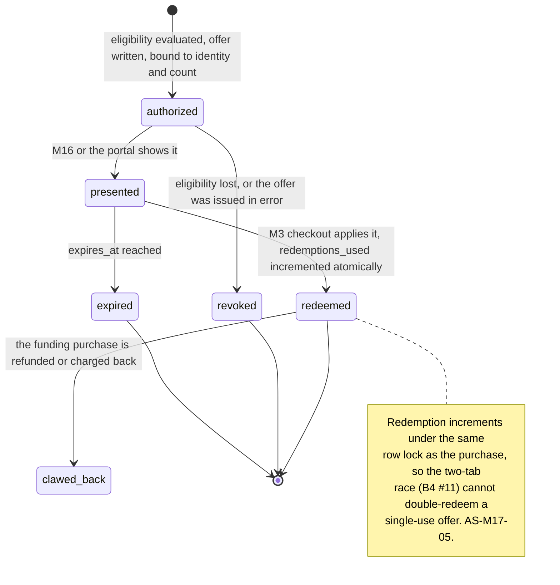
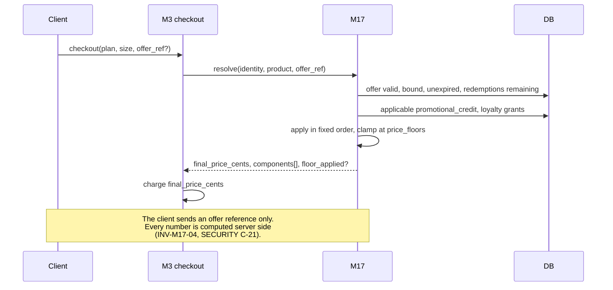
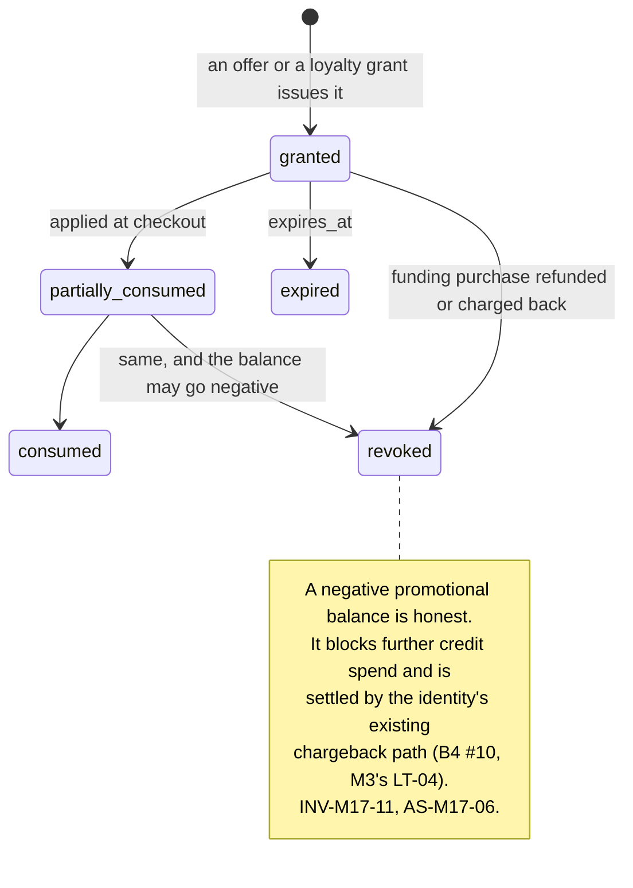

# M17: Offers Engine

Constitution section §4-ADDENDUM ("contextual reset pricing, bundles, every offer a config, A/B-able"), Appendix B5's ten-section template, **[ADR-019a](../decisions/ADR-019.md)'s gamification bright line**, and the **[parameter-status ruling](../decisions/gates/parameter-status-launch-candidates-versus-structural-rulings-founder-ruling-2026-08-14.md)**, both of which name this module. Free-trial accounts and rule-based promotional campaigns enter as drafting inputs from the Axcera brochure ([PROP_TECH_LANDSCAPE](../../research/PROP_TECH_LANDSCAPE.md) section 1.2, SHOULD rather than v1 MUST).

**Money path under [ADR-003](../decisions/ADR-003.md)'s strict regime.** Every offer changes what somebody pays, several change what the ledger records, and one class of them would change what the engine computes if this plan did not forbid it.

One sentence governs this module: **an offer changes the price of a known thing, and it may never change the thing.**

That sentence draws the only line that matters here. A discount on an evaluation is an offer. A larger payout cap this weekend is a **rule change wearing a promotion's clothes**, and the [parameter-status ruling](../decisions/gates/parameter-status-launch-candidates-versus-structural-rulings-founder-ruling-2026-08-14.md) already decided that a structural ruling is never marketed as a tunable and that a parameter is read from a published plan version rather than adjusted by a campaign.

**Identifier conventions:** `INV-M17-nn` invariants, `SD-M17-nn` schema deltas, `OF-M17-nn` offer types, `FM-M17-nn` failure modes, `AS-M17-nn` adversarial scenarios, `OQ-M17-nn` open questions, `DEP-M17-nn` dependencies.

---

## 1. Purpose and invariants

### 1.1 What this module is

One engine that decides **who may be offered what, at what price, until when**, and issues the instrument that makes it real.

| ID | Offer type | Instrument | v1 |
|---|---|---|---|
| OF-M17-01 | **Contextual reset pricing** | A discount bound to one identity and one breached account | Ship |
| OF-M17-02 | **Campaign discount** | A coupon code, per [M3](M03-billing-checkout.md)'s approved `coupons` | Ship |
| OF-M17-03 | **Bundle** | Several accounts or an account plus resets, at a stated price for stated contents | Ship |
| OF-M17-04 | **Promotional credit** | A `promotional_credit` ledger grant, spendable at checkout, never withdrawable | Ship |
| OF-M17-05 | **Free trial account** | A zero-price evaluation account | **Recommended against at launch** (AS-M17-02) |
| OF-M17-06 | **Rule-based promo campaign** | Automatic eligibility from stated conditions | Ship, with the eligibility rules published |

### 1.2 What this module is not

| Not M17 | Whose job | Why the boundary is here |
|---|---|---|
| Changing any plan parameter | [M1](M01-rules-engine.md) config, published through [M3](M03-billing-checkout.md) with [ADR-010](../decisions/ADR-010.md) dual control | An offer prices a plan version. It never edits one (INV-M17-01, AS-M17-01) |
| Taking payment | [M3](M03-billing-checkout.md) | M17 computes and authorizes a price; M3 charges it. Server-authoritative pricing stays [SECURITY](../architecture/SECURITY.md) C-21's, in one place |
| Deciding who has earned a benefit | [M14](M14-loyalty-retention.md) | M14 derives entitlement; M17 prices and issues. One engine issues economic instruments and it is this one |
| Sending the offer | [M16](M16-notification-center.md) and [M10](M10-integrations.md) | Including the send-time guards ([M10](M10-integrations.md) AS-M10-03). M17 authorizes; it does not deliver |
| Affiliate commission | [M8](M08-affiliate-system.md) | Codes are shared with affiliates ([M3](M03-billing-checkout.md)'s coupon linkage), and attribution and commission remain M8's |

### 1.3 Invariants

| ID | Invariant | Enforcement |
|---|---|---|
| INV-M17-01 | **No offer changes any value the engine reads.** Not a cap, split, gap, drawdown, target, win-day count, consistency ratio, buffer, or ladder length | The offers service holds no write grant on `plan_versions`, `plan_version_sizes`, or `accounts.plan_version_id`, identically to [M14](M14-loyalty-retention.md) INV-M14-01. AS-M17-01 |
| INV-M17-02 | Every offer states its **exact contents and exact price before payment** | [ADR-019a](../decisions/ADR-019.md). No mystery bundles, no randomized contents, no randomized discount resolving into a purchase ([M14](M14-loyalty-retention.md) AS-M14-03's composition rule applies here unchanged) |
| INV-M17-03 | An offer is **bound to an identity** and to a redemption count before it exists | SD-M17-01. An unbound code is a code that will leak, and leaked promo codes are [dossier item 9](../../research/ADVERSARY_DOSSIER.md) (AS-M17-05) |
| INV-M17-04 | Price is computed **server side**, from the offer record, at checkout; the client can never influence it | [SECURITY](../architecture/SECURITY.md) C-21. The client supplies an offer reference and nothing else |
| INV-M17-05 | Stacking is **explicit and bounded**: a floor price exists per product, and no combination can reach or cross it | SD-M17-02, AS-M17-04. `stackable=false` on coupons ([M3](M03-billing-checkout.md)) is necessary and is not sufficient once credit, loyalty grants, and campaigns coexist |
| INV-M17-06 | A published price on a public surface is the price the offer-free path charges | [M09](M09-marketing-site.md) INV-M9-01. A price experiment must not desync the config-rendered public page (AS-M17-03) |
| INV-M17-07 | Experiments never vary a rule, a gate, or anything the engine reads | AS-M17-03, AS-M17-07. Two live plan versions is a legitimate product decision made through the publish path; it is not an experiment this module can run |
| INV-M17-08 | `promotional_credit` is spendable at checkout and has **no path to `trader_wallet` and no path to a withdrawal** | [ADR-019](../decisions/ADR-019.md), [M14](M14-loyalty-retention.md) INV-M14-10, asserted by ledger test |
| INV-M17-09 | Offer targeting excludes the same populations [M14](M14-loyalty-retention.md) INV-M14-08 excludes, evaluated at authorization **and** again at send | Open severity 4+ flag, restriction, chargeback in the window, and the reset-velocity ceiling ([M14](M14-loyalty-retention.md) AS-M14-04's inversion) |
| INV-M17-10 | Every offer has an expiry, and an expired offer is refused at checkout rather than honored quietly | An offer with no expiry is a permanent price change nobody published |
| INV-M17-11 | Promotional credit issued against a purchase is **revoked if that purchase is charged back or refunded**, and revocation may make the balance negative | SD-M17-03, AS-M17-06. A credit funded by a payment that was reversed is a credit Merit gave away |
| INV-M17-12 | A **Direct** plan offer can never reduce price below the configured floor for that plan | AS-M17-04. Direct funds immediately, so a near-free Direct account is instant funded liability with no fee behind it |

---

## 2. Entities and schema deltas

M17 consumes [M3](M03-billing-checkout.md)'s approved `coupons` and `coupon_redemptions` and the `promotional_credit` ledger class activated by [ADR-019](../decisions/ADR-019.md). Four deltas.

| ID | Table | Change | Why it is not optional |
|---|---|---|---|
| SD-M17-01 | new `offers` | `id`, `offer_type`, `identity_id null`, `scope check in ('identity','segment','public')`, `product_ref`, `contents jsonb`, `price_cents`, `list_price_cents`, `currency`, `max_redemptions`, `redemptions_used`, `expires_at`, `criteria_version null`, `loyalty_grant_id null`, `experiment_arm null`, `created_by`, `revoked_at null` | INV-M17-02 and INV-M17-03. `contents` is explicit rather than derived because [ADR-019a](../decisions/ADR-019.md) requires stated contents before payment, and a bundle whose contents are computed at redemption is a bundle whose contents were not stated. `list_price_cents` is stored alongside `price_cents` so the discount is a fact rather than a comparison against a value that may since have moved |
| SD-M17-02 | new `price_floors` | `product_ref`, `floor_cents`, `reason`, `effective_from`, `approved_by` | INV-M17-05 and INV-M17-12. Stacking arithmetic needs a hard stop that is not "the sum of the discounts we happened to configure", and the floor for a Direct plan is a **liability** decision rather than a margin one, which is why it carries a written reason and an approver |
| SD-M17-03 | `ledger_entries` usage plus new `promotional_credit_grants` | `id`, `identity_id`, `amount_cents`, `source_offer_id null`, `funding_purchase_id null`, `expires_at`, `consumed_cents`, `revoked_at null`, `revoked_reason null` | INV-M17-08 and INV-M17-11. A credit needs to know what funded it, or a chargeback cannot claw back the credit it paid for (AS-M17-06). The ledger records the money; this table records the entitlement's provenance and expiry |
| SD-M17-04 | new `offer_experiments` | `id`, `name`, `hypothesis`, `arms jsonb`, `varies check in ('price','presentation','bundle_contents')`, `started_at`, `ended_at null`, `winner_arm null` | INV-M17-07. The `varies` check is the schema enforcing the rule: there is **no enum value for a rule, a gate, or a plan parameter**, so an experiment that varies one cannot be written down, let alone run (AS-M17-07) |

---

## 3. State machines

### 3.1 Offer lifecycle

### 3.2 Price resolution, which is the module's money path

**The application order is fixed and published in the method note**, because order changes the answer once percentage and absolute instruments coexist: percentage discounts first against list price, then absolute campaign amounts, then promotional credit, then clamp at the floor. Credit last is deliberate, so a trader's own credit is never consumed to pay for a discount they would have received anyway.

### 3.3 Promotional credit

---

## 4. API endpoints touched

| Endpoint | M17's role | Notes |
|---|---|---|
| `GET /me/offers` **NEW** | Owns | Live offers for this identity with contents, price, list price, and expiry. Session scoped |
| `POST /internal/offers/authorize` **NEW** | Owns | Campaign and rule-based issuance. Admin origin or worker. Writes `offers`, evaluates INV-M17-09's exclusions |
| `POST /checkout` | Consumes | [M3](M03-billing-checkout.md)'s, gaining an optional `offer_ref`. Price resolution is section 3.2 |
| `GET /admin/offers` and `POST /admin/offers/:id/revoke` **NEW** | Owns | Reason required, writes `admin_actions` |
| `POST /admin/price-floors` **NEW** | Owns | **Dual control**, on the same footing as [ADR-010](../decisions/ADR-010.md)'s set: a floor is the control that stops AS-M17-04, and a floor anyone can lower is not a control |
| `GET /admin/experiments` **NEW** | Owns | Arms, allocation, and results. `varies` is constrained by SD-M17-04 |

---

## 5. Events emitted and consumed

| Event | When | Notes |
|---|---|---|
| `offer.authorized` **NEW** | an offer is written | `{ offer_id, identity_id, offer_type, price_cents, list_price_cents, expires_at, experiment_arm }`. Consumers: FEED, BI, NOTIF |
| `offer.redeemed` **NEW** | applied at checkout | `{ offer_id, purchase_id, components, floor_applied }`. Consumers: FEED, BI, RISK |
| `offer.refused` **NEW** | expired, exhausted, unbound, or excluded | `{ offer_ref, reason }`. Consumers: FEED, RISK. A rising refusal rate on one code is the leak signature (AS-M17-05) |
| `offer.floor_applied` **NEW** | stacking hits the floor | `{ product_ref, would_be_cents, floor_cents, components }`. **Consumers: ALERT, FEED.** The floor firing means a configuration would otherwise have sold below it (AS-M17-04) |
| `promotional_credit.granted` / `.consumed` / `.revoked` **NEW** | credit lifecycle | `{ identity_id, amount_cents, source_offer_id, funding_purchase_id }`. Consumers: FEED, BI, RISK on revoked |
| `experiment.arm_assigned` **NEW** | allocation | `{ experiment_id, arm, identity_id }`. Consumers: BI, and [M12](M12-transparency-platform.md) needs it to know whether a published statistic spans arms (AS-M17-07) |

**Consumed:** `breach.detected` (OF-M17-01's trigger, held per [M10](M10-integrations.md)'s window), `purchase.refunded` and `purchase.charged_back` (INV-M17-11), `loyalty.benefit_earned`, `flag.status_changed`, and `account.closed`.

---

## 6. Failure modes

| ID | Failure | Blast radius | Detection | Recovery |
|---|---|---|---|---|
| FM-M17-01 | An offer alters a plan parameter | A rule that varies by campaign, undocumented, contradicting the rules page | No write grant (INV-M17-01) | Structurally prevented. AS-M17-01 |
| FM-M17-02 | Stacking produces a price at or below the floor | Merit sells funded capacity for nothing | `offer.floor_applied`, and a stacking-simulation test over every live instrument combination | Floors clamp (INV-M17-05). AS-M17-04 |
| FM-M17-03 | A code leaks and is redeemed at scale | Uncontrolled discount, and possibly a fleet | Redemption rate against expectation, distinct identities per code, `offer.refused` rate | Identity binding and redemption caps (INV-M17-03). AS-M17-05 |
| FM-M17-04 | Free-trial accounts create a fleet with no payment fingerprint | [M7](M07-risk-abuse.md)'s strongest identity signal is absent exactly where it is most needed | Entity-resolution density on trial cohorts | Recommended against at launch; if shipped, KYC before provisioning (AS-M17-02) |
| FM-M17-05 | Promotional credit survives a chargeback | Merit funds a credit with money it did not keep | `funding_purchase_id` linkage (SD-M17-03) | Revoke, allow a negative balance, settle through the existing chargeback path. AS-M17-06 |
| FM-M17-06 | A price experiment desyncs the public page | Two prices for one product, one of them published | [M09](M09-marketing-site.md)'s synthetic config-divergence probe | The public page always shows the offer-free price (INV-M17-06). AS-M17-03 |
| FM-M17-07 | An experiment splits the population under different rules | [M12](M12-transparency-platform.md)'s published statistics silently mix two regimes | `varies` has no rule value (SD-M17-04); `experiment.arm_assigned` lets M12 detect a spanning window | Structurally prevented, plus a reporting guard. AS-M17-07 |
| FM-M17-08 | An offer reaches an excluded identity | A discount to somebody under investigation, in writing | Exclusions at authorization and at send (INV-M17-09) | Both evaluations. [M14](M14-loyalty-retention.md) AS-M14-04 |
| FM-M17-09 | Two tabs redeem one single-use offer | Double discount, and the coupon race of B4 #11 | Atomic increment under the purchase's row lock | Section 3.1. GS-040 already pins the coupon half |

---

## 7. Adversarial scenarios

**Seven listed, six novel.** The one marked "extends" takes a B4 item into the stacking arithmetic it did not cover.

### AS-M17-01: The rule change sold as a promotion (NOVEL)

**Attack.** The adversary is a good marketing idea. Every lever in this business that would actually move conversion is a **rule**, not a price: a bigger payout cap this weekend, consistency waived for new accounts in October, a shorter cadence gap for Black Friday buyers, a ninth rung on the ladder for the anniversary. Each is more compelling than any discount, each is trivially expressible as a config value, and each is the thing the [parameter-status ruling](../decisions/gates/parameter-status-launch-candidates-versus-structural-rulings-founder-ruling-2026-08-14.md) forbids: **a structural ruling is never marketed as a tunable**, and a parameter is read from a published plan version rather than adjusted by a campaign.

**Three ways it does damage, and the third is the one that persists.**
- **It breaks the rules page.** [M09](M09-marketing-site.md) INV-M9-02 renders `copy_blocks` from the account's pinned plan version. An account bought under a promotional cap either shows a rules page that disagrees with its engine behavior, or forces a per-account override, which is [M14](M14-loyalty-retention.md) AS-M14-06's failure arriving from a second direction.
- **It bypasses [ADR-010](../decisions/ADR-010.md).** Cap, split, and gap are dual-control changes because they are the parameters through which economic sabotage is silent. A campaign flag that moves any of them is that surface with a marketing approval instead of a second hardware key.
- **It makes every future rule negotiable.** Once a cap has been raised for a weekend, it is a number Merit chose rather than a number Merit computed, and every support conversation about a cap from that day forward has a precedent in it.

**Counter, and the good news is that the compliant version is a better product.**
1. **No write grant** (INV-M17-01), so the temptation cannot be acted on by this service.
2. **The legitimate version of every one of those campaigns is a plan version**: published through [M3](M03-billing-checkout.md) with dual control, validated by the CV suite, visible on the rules page **before purchase**, and pinned to the accounts that bought it. That is a real product, honestly marketed, and it is exactly the mechanism [M14](M14-loyalty-retention.md) section 3.2 already specifies for progressive cap release.
3. **The offer copy rule**: an offer may describe the plan's published rules and may never describe them as changed, conditional, or temporary. Enforced in review, in the same pass as [M08](M08-affiliate-system.md)'s creative approval.
4. **"Caps exist" is not a promotion** ([parameter-status ruling](../decisions/gates/parameter-status-launch-candidates-versus-structural-rulings-founder-ruling-2026-08-14.md)). A structural property may not be offered, waived, or framed as a limited-time condition, and the cap's *value* being a config does not make its *existence* one. EC-117, GS-198.

### AS-M17-02: The free trial removes the identity signal it most needs (NOVEL)

**Attack.** Free-trial accounts are a recorded brochure input and an obvious funnel improvement. They also delete Merit's single strongest identity signal at the exact moment it matters most. [M7](M07-risk-abuse.md) D-08 watches payment velocity, and the [dossier](../../research/ADVERSARY_DOSSIER.md) names the payment fingerprint (card BIN plus last four, hashed) as a primary entity-resolution input; constitution B1 makes the identity graph the spine of the whole system. **A free account has no payment fingerprint at all.** Entity resolution on a trial cohort falls back to email normalization, device fingerprint, and IP or ASN, every one of which is cheap to defeat: disposable domains, browser profiles, and residential proxies are commodity products.

**What an operator does with it.** [Dossier item 6](../../research/ADVERSARY_DOSSIER.md) describes one operator running 20 to 30 accounts under different names to beat per-entity caps. Free trials make the marginal cost of an additional identity approximately zero, which is the one condition under which the max-accounts-per-entity cap stops being a real constraint. If a trial can pass an evaluation and reach a funded account, Merit has built a path from zero cost to real liability with its weakest identity checks on it.

**Counter, and the recommendation is to not ship it at launch.**
1. **Recommended against for v1** (OF-M17-05, OQ-M17-02). The funnel benefit is real and the timing is wrong: it should arrive after [M7](M07-risk-abuse.md)'s detectors have a beta's worth of calibration and after [M19](M19-kyc-identity.md)'s placement telemetry has settled the pre-eval versus pre-funded question.
2. **If it ships, KYC precedes provisioning**, unconditionally, regardless of the [M19](M19-kyc-identity.md) placement config. A free trial is precisely the case where the placement tradeoff inverts: the cost argument for pre-funded verification is that verification costs money on 100 percent of buyers, and a free trial has no purchase to protect, so the fraud argument wins outright.
3. **Trials are capped per identity and per resolved entity**, and count against `max_accounts_per_entity` rather than sitting outside it.
4. **A trial cannot reach a funded account without a paid step**, which preserves the property that real liability always sits behind a real payment. This is the cheapest structural answer and it costs the funnel very little, because the trial's job is to demonstrate the product rather than to fund anyone. EC-118, GS-199.

### AS-M17-03: The price experiment that desyncs the public page (NOVEL)

**Attack.** "Every offer a config, A/B-able" invites price experiments. [M09](M09-marketing-site.md) INV-M9-01 requires every price on the marketing site to be read from `plan_versions`, and its AS-M9-01 already establishes what a stale or divergent price costs. A naive experiment introduces exactly that divergence deliberately: half the visitors see one price on the pricing page, and the checkout may charge another, or two visitors comparing notes find two prices for the same product with no explanation.

**And the version with a legal edge.** Differential pricing by traffic source or cohort on a financial-adjacent product invites a fairness reading Merit specifically cannot afford, given that its entire brand is that the terms are the same for everyone and published in advance. A trader who discovers they paid more than a peer for an identical evaluation has a grievance that sounds exactly like the thing Merit claims not to do.

**Counter.**
1. **The public page always shows the offer-free price** (INV-M17-06), read from config, identical for everyone, no experiment applied. Experiments live entirely in **offers**, which are bound to an identity and presented in authenticated or explicitly-referred contexts.
2. **A discount is always presented against the published list price** (SD-M17-01 stores both), so a trader always knows what the standard price is and what they were offered. That is a fairer artifact than either uniform pricing or hidden differential pricing, and it is checkable.
3. **Experiments vary `price`, `presentation`, or `bundle_contents`, and nothing else** (SD-M17-04).
4. **[M09](M09-marketing-site.md)'s synthetic config-divergence probe already watches the public surface** and will catch a leak of experimental pricing onto it as a page-versus-config divergence, which is the alarm that already exists. GS-200.

### AS-M17-04: Stacking to a free funded account (NOVEL, extends B4 #11)

**Attack.** B4 #11 pins the coupon race: two tabs, one single-use code. It does not cover the arithmetic once several instruments coexist, and by launch there are at least five: a campaign coupon, a contextual reset discount, promotional credit from a loyalty grant, an affiliate code, and a bundle price. Each is individually sensible. `stackable=false` on coupons ([M3](M03-billing-checkout.md)) prevents two **coupons** combining and says nothing about a coupon plus credit plus a bundle.

**The arithmetic that hurts, on Direct.** A Direct plan funds immediately: there is no evaluation, so the account is live simulated capital from the moment it provisions. Suppose a 40 percent campaign coupon, a bundle price already 25 percent below list, and enough promotional credit to cover most of the remainder. The resulting purchase price approaches zero, and Merit has issued a **funded account with real payout liability and effectively no fee behind it.** At a 25K Direct with a 75,000c cap and a 6 payout ladder, that is up to 405,000c of trader-side lifetime exposure created by a transaction that collected almost nothing. Nobody configured that outcome; three people configured three reasonable things.

**And the version that is deliberate.** An operator who works out the stack does not do it once. They do it as many times as `max_accounts_per_entity` permits, which is exactly the fleet-funding economics [M08](M08-affiliate-system.md)'s scenarios worry about, reached through the pricing engine instead of through affiliate commission.

**Counter.**
1. **Price floors per product** (SD-M17-02, INV-M17-05), clamping the resolved price regardless of how many instruments applied. The floor is a hard stop, not a warning.
2. **The Direct floor is a liability decision, not a margin decision** (INV-M17-12), and carries a written reason and an approver, because the number it must exceed is a function of expected payout liability rather than of cost.
3. **Floor edits are dual controlled** (section 4), on the same footing as cap, split, and gap. A control anybody can lower is not a control.
4. **`offer.floor_applied` alerts**, because the floor firing means a live configuration would otherwise have sold below it, which is a configuration bug that needs finding rather than a clamp to be quietly grateful for.
5. **A stacking-simulation test** enumerates every live instrument combination against every product nightly and asserts no combination reaches the floor. Testing instruments individually is what produced the gap. EC-119, GS-201.

### AS-M17-05: The code that escapes (NOVEL treatment of dossier item 9)

**Attack.** [Dossier item 9](../../research/ADVERSARY_DOSSIER.md) names leaked promo codes among insider and process leaks. The mechanism needs no insider: a code intended for a segment gets posted to a coupon aggregator, a Discord server, or a deal subreddit within hours of first use, because there are people whose hobby is finding them. Merit then honors it at scale, to a population it did not choose, at a discount sized for a small cohort.

**Why it compounds beyond the discount.** A widely redeemed code produces a **cohort with shared provenance**, which distorts the acquisition data every downstream decision uses, and it can produce a burst of cheap accounts that is indistinguishable from a fleet at the moment [M7](M07-risk-abuse.md) is looking at it. And if the code carried affiliate attribution ([M3](M03-billing-checkout.md)'s coupon linkage), Merit pays commission on conversions it already had, which is [M08](M08-affiliate-system.md) AS-M8-05's territory reached from the pricing side.

**Counter.**
1. **Identity binding is the default** (INV-M17-03). A contextual reset offer, a loyalty grant, and a rule-based promo are all bound to one identity and cannot be transferred. Only OF-M17-02 campaign codes are shareable, and they are shareable **on purpose**.
2. **Every shareable code carries `max_redemptions` and an expiry** (SD-M17-01, INV-M17-10), and the cap is set at authorization rather than discovered later.
3. **The leak signature is monitored**: redemption rate against expectation, distinct new identities per code per hour, and the `offer.refused` rate once the cap is hit. A code being posted publicly looks very different from a code being used by its intended cohort, and it looks different within an hour.
4. **Revocation is immediate and does not claw back completed purchases.** A trader who redeemed in good faith keeps their price; the code stops working. Retroactive price changes would be [TOP10_FIRMS](../../research/TOP10_FIRMS.md)'s FundingTicks failure applied to commerce.
5. **Affiliate-linked codes exclude self-referral and carry [M8](M08-affiliate-system.md)'s attribution checks**, unchanged. GS-202.

### AS-M17-06: The credit funded by a payment that came back (NOVEL)

**Attack.** A promotion grants $100 of promotional credit on a purchase. The trader spends the credit on a reset the following week. Three weeks later the original purchase is charged back. The purchase reverses through [M3](M03-billing-checkout.md)'s LT-04 and the account closes per B4 #10. **The credit does not reverse**, because nothing linked it to the payment that funded it, and it has already been consumed on a different product that was delivered.

**Why it is a real vector rather than an accounting untidiness.** It is repeatable and cheap. Buy with a stolen card, receive credit, spend the credit immediately on something else, let the chargeback land. The chargeback closes the account and flags the identity, and the value extracted through the credit is already gone. [Dossier item 7](../../research/ADVERSARY_DOSSIER.md) names stolen-card evaluation purchases and the MID health damage they cause; this variant adds a second extraction on top of the first, funded by Merit.

**Counter.**
1. **`funding_purchase_id` on every grant** (SD-M17-03). A credit knows what paid for it.
2. **A chargeback or refund revokes the grant**, and **revocation may drive the promotional balance negative** (INV-M17-11), which blocks further credit spend and is honest about the position. A negative balance is not an error state to be swallowed.
3. **The negative balance settles through the existing chargeback path** (B4 #10, [M3](M03-billing-checkout.md)'s LT-04), where the identity is already net negative and the ledger already shows the firm's loss honestly. No new mechanism is introduced.
4. **Credit granted against a purchase does not become spendable until the refund window closes**, which costs a little immediacy and removes the fast version of the attack entirely. The window already exists in [M3](M03-billing-checkout.md) (refund pre-first-trade only, OQ-M3-02), and reusing it is better than inventing a second timer.
5. **Chargeback-in-window is already an exclusion** for further offers (INV-M17-09). EC-120, GS-203.

### AS-M17-07: The experiment that splits the population under two rulebooks (NOVEL)

**Attack.** The most valuable experiment anyone could propose is a rule experiment: does a 25 percent consistency requirement convert and retain better than 30? It is expressible, since both are plan versions, and it is measurable. Running it means two live populations under different rules at the same time, and three things break at once.

- **[M12](M12-transparency-platform.md)'s published statistics silently mix two regimes.** A trailing 90 day pass rate spanning both arms is a number with no method, which is precisely what M12's versioned definitions exist to prevent, and it would be published without anybody noticing because the definition did not change.
- **The rules page is fine and the comparison is not.** Each account is pinned to its version and reads correctly, so nothing looks wrong. Two traders comparing notes discover Merit is running different rules for different people, which is a materially different claim from "we publish our rules".
- **It is a fairness question with a real answer.** One arm is worse to be in. On a product where the rules determine whether a person keeps money they earned, assigning that at random is not the same act as testing a button colour.

**Counter.**
1. **`varies` has no value for a rule, a gate, or a plan parameter** (SD-M17-04). The experiment cannot be recorded, so it cannot be run through this module.
2. **Two live plan versions remain entirely legitimate as a product decision**, made through the publish path, published, and chosen by the buyer rather than assigned to them. That is the honest form of the same learning: ship both, let people pick, and measure.
3. **`experiment.arm_assigned` is consumed by [M12](M12-transparency-platform.md)** so that a statistics window spanning multiple pricing arms is at least visible, and a spanning window on anything that could affect outcomes is disclosed on the method page rather than smoothed.
4. **The line, stated for the next person who proposes this:** Merit experiments on **what it charges and how it explains itself**, never on **what it enforces**. GS-204.

---

## 8. Test plan

### 8.1 Suites

| Suite | Prefix | Count | Runs | Blocks |
|---|---|---|---|---|
| Price resolution: order, components, server authority | `M17-P-nn` | 12 | every commit | merge |
| Stacking simulation over every live instrument combination and product | `M17-S-nn` | 10 | every commit and nightly | merge, nightly page |
| Floors, including the Direct liability floor | `M17-F-nn` | 6 | every commit | merge |
| Binding, redemption caps, expiry, two-tab race | `M17-B-nn` | 9 | every commit | merge |
| Promotional credit lifecycle, chargeback revocation, negative balance | `M17-C-nn` | 9 | every commit | merge |
| Grant negatives (no config write, no wallet path, no withdrawal path) | `M17-N-nn` | 7 | every commit | merge |
| Experiment constraints (`varies` enum, no rule arm) | `M17-E-nn` | 5 | every commit | merge |
| Exclusion evaluation at authorization and at send | `M17-X-nn` | 6 | every commit | merge |
| Golden fixtures | `GS-nnn` | 7 owned (GS-198 to GS-204) | every commit | merge |

### 8.2 Named scenarios owned by this module

| ID | Scenario | Pins |
|---|---|---|
| GS-198 | A campaign attempts a temporary cap or a waived consistency gate | Refused: no write grant, and no offer field can express a plan parameter. The compliant path is a published plan version. AS-M17-01 |
| GS-199 | A free-trial cohort with shared device and ASN signals | Absent a payment fingerprint, entity resolution degrades measurably; the trial path requires KYC before provisioning and counts against the entity cap. AS-M17-02 |
| GS-200 | A price experiment runs while the public page renders | The public page shows the **offer-free** config price for every visitor; the offer is presented against the stored list price. AS-M17-03 |
| GS-201 | Coupon plus bundle plus credit on a Direct plan | The floor clamps, `offer.floor_applied` alerts, and no combination reaches or crosses it. AS-M17-04, extends GS-040 |
| GS-202 | A campaign code posted publicly | `max_redemptions` caps it, the refusal rate and distinct-identity rate raise the leak signature, revocation is immediate, and completed purchases are **not** repriced. AS-M17-05 |
| GS-203 | Credit granted, spent, then the funding purchase charged back | The grant revokes, the promotional balance goes negative, further credit spend blocks, and settlement follows the existing chargeback path. AS-M17-06, pairs with GS-039 |
| GS-204 | An experiment proposed with a rule-varying arm | Unrepresentable: `varies` has no such value. Two published plan versions remain available as the honest alternative. AS-M17-07 |

### 8.3 Coverage rule

**Every instrument that can reduce a price is enumerated in one registry, and the stacking simulation runs the full cross-product of that registry against every product on every commit.** The module's characteristic failure is not a wrong discount, it is a combination nobody enumerated, and only a cross-product test finds those.

---

## 9. Observability

### 9.1 Metrics

| Metric | Why it matters |
|---|---|
| Realized discount rate by product, and its distribution | The margin picture, and the early warning that stacking is deeper than intended |
| `offer.floor_applied` count by product | Should be near zero. Each occurrence is a live configuration that would have sold below the floor |
| Redemptions per code per hour, and distinct new identities per code | AS-M17-05's leak signature, which is visible within an hour and invisible in a daily total |
| Free-trial cohort entity-resolution density, if trials ever ship | AS-M17-02's live measurement of how much identity signal was lost |
| Promotional credit outstanding, and revoked-after-consumption amount | AS-M17-06's realized loss, and the input to whether the refund-window hold is set correctly |
| Offer-to-purchase conversion by type and arm | The module's purpose |
| Exclusion counts by reason at authorization and at send | INV-M17-09. The reset-velocity exclusions prove [M14](M14-loyalty-retention.md)'s inversion is operating |
| Reset purchases carrying a discount, as a share of all resets | Whether Merit is subsidizing eval brute-forcing despite the ceiling |

### 9.2 Alerts

| Alert | Threshold | Severity |
|---|---|---|
| Price floor applied | any | **page**. A configuration would have sold below the floor |
| Resolved price at or below floor after clamping | any | **page**. The clamp itself failed |
| Config write attempted from the offers service | any | **page** |
| `promotional_credit` posting toward a wallet or withdrawal path | any | **page** |
| Code redemption rate above expectation | configured multiple | **page**. Leak in progress |
| Offer dispatched to an excluded identity | any | **page** |
| Experiment written with an unrecognized `varies` value | any | **page** |

### 9.3 Dashboard

M17 supplies a panel on [M6](M06-admin-ops-console.md): realized discount by product, floor-applied counts, live code redemption rates, promotional credit outstanding, and exclusion counts. **If only one number could be shown it would be floor-applied count**, because it is the only one that reports a configuration Merit did not intend to have.

---

## 10. Open questions for the founder

**OQ-M17-01. What are the price floors, per product, and specifically for Direct?** AS-M17-04 shows the Direct floor is a liability decision: the number must exceed the expected payout liability an instantly funded account carries, not the cost of provisioning it. Proposed: **floors set from the simulation harness's expected-liability-per-funded-account figure, with an interim floor at 60 percent of list until the harness produces one.** The interim number should be recorded as a placeholder to be replaced, on the same footing as [M05](M05-payout-system.md) OQ-M5-05's honest placeholder.

**OQ-M17-02. Do free-trial accounts ship at launch?** AS-M17-02 recommends no, on the grounds that a trial deletes the payment fingerprint that [M7](M07-risk-abuse.md)'s entity resolution most depends on, at the exact moment marginal identity cost falls to zero. Proposed: **defer past launch**, revisit once beta detector calibration and [M19](M19-kyc-identity.md)'s placement telemetry exist. If the founder wants them sooner, the non-negotiable conditions are KYC before provisioning, counting against the entity cap, and no path from a trial to a funded account without a paid step.

**OQ-M17-03. Is differential pricing acceptable at all, and how is it disclosed?** AS-M17-03's counter has Merit always showing the list price alongside any offer, which is more transparent than most competitors and still means two people can pay different amounts. Proposed: **acceptable, with the list price always shown**, and a plain sentence in the FAQ saying Merit runs promotions and that the standard price is always published. Recommendation is to publish that sentence, because the alternative is a trader discovering it themselves and framing it less generously.

**OQ-M17-04. Does promotional credit expire, and how long is the refund-window hold before it becomes spendable?** Proposed: **credit expires 180 days after grant**, and **becomes spendable when the funding purchase's refund window closes**. The hold costs immediacy on a promotion and removes AS-M17-06's fast path entirely, and reusing [M3](M03-billing-checkout.md)'s existing window avoids a second timer with its own edge cases.

**OQ-M17-05. Is the offer copy rule worth publishing?** AS-M17-01's third counter says an offer may describe the plan's published rules and may never describe them as changed, conditional, or temporary. Publishing that as a stated commitment ("Merit never runs a promotion that changes the rules of a plan, only its price") is checkable against the rules pages and forecloses the most tempting marketing lever the business has. Recommendation: **publish it.** It is the commerce-side twin of [M12](M12-transparency-platform.md)'s method pages.

---

### Dependencies on other modules

| ID | Dependency | Owner | Consequence if unmet |
|---|---|---|---|
| DEP-M17-01 | M3 owns checkout, applies the resolved price, and increments redemptions under the purchase's row lock | M3 | The two-tab race returns and price authority splits across two services |
| DEP-M17-02 | The offers service holds no write grant on plan config, and none toward `trader_wallet` | INFRA | INV-M17-01 and INV-M17-08 become advisory, and AS-M17-01 is available to anybody with a campaign to launch |
| DEP-M17-03 | M14 supplies derived entitlement and the reset-velocity ceiling | M14 | Offer targeting reverts to the default that subsidizes eval brute-forcing |
| DEP-M17-04 | M7 exposes flag severity and restriction state at authorization and at send | M7, M10 | INV-M17-09 cannot evaluate |
| DEP-M17-05 | M3's refund and chargeback events carry the purchase reference that funded a credit | M3 | AS-M17-06 is unrecoverable, and a stolen-card purchase yields a second extraction Merit funds |
| DEP-M17-06 | M12 consumes `experiment.arm_assigned` and discloses spanning windows | M12 | A published statistic silently mixes pricing arms with no method note |
| DEP-M17-07 | The simulation harness produces expected liability per funded account, per plan | Wave 4 | OQ-M17-01's Direct floor stays a placeholder, and the control that stops AS-M17-04 is a guess |
