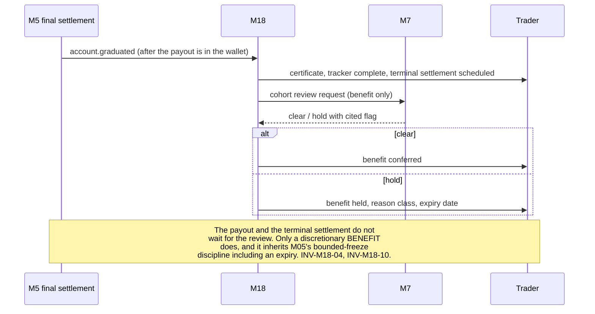
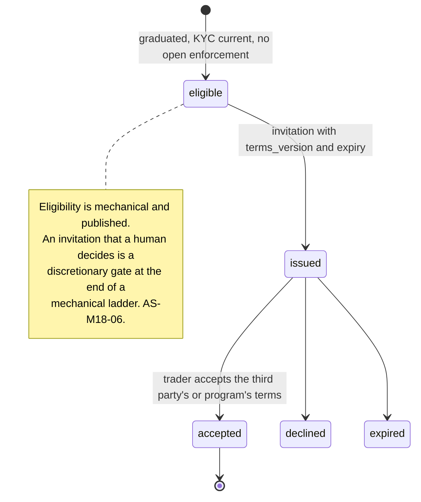

# M18: Graduation Track

**Renamed at the batch 2 gate, from "Live-Graduation Pipeline" to "Graduation Track", to match shipped behavior.** [OQ-M18-01](../decisions/gates/consolidated-founder-addendum-and-batch-2-gate-closure-2026-08-14.md) ruled that **no live program exists at launch**: the ladder ends in **graduation eligibility plus continuation** (GP-M18-03, the path that requires nothing and is honest). A module named for a pipeline to a live program would have been a name describing an aspiration, which is precisely the marketing-versus-implementation gap constitution section 0.5 exists to prevent, committed in the filename.

**Three consequences bind immediately:**
- **Zero live-program copy is written until counsel rules.** That includes the marketing site, the portal, certificates, emails, and Discord. The copy is what commits Merit, not the code.
- **If a live program is ever built, the working structure is a ring-fenced affiliated entity**, on the MFFU pattern. Recorded as a starting point for counsel, not as a decision.
- **Counsel packet item 1** ([DECISIONS](../decisions/README.md)) covers all three graduation paths, because the question is what Merit may *say* about graduation before a program exists, and that is not an engineering question.

**Second ruling folded, and it changes the module's spine: [ADR-024](../decisions/ADR-024.md) separates the ladder from the live invitation.** Completing the ladder sets **graduation eligibility**, which is a **review-pool flag and nothing more**. Invitation is at **Merit's sole discretion** from that pool. [M01](M01-rules-engine.md) R-49 no longer emits an invitation event, because **an engine that emits an invitation on ladder completion has already made the promise**, and the promise is what commits Merit rather than the program.

**The framing to publish, adopted verbatim from Lucid:** the ladder is **"the maximum payout level, not a guaranteed minimum for live eligibility."** One sentence, and it prevents the whole misreading. Binding on the ToS and on marketing.

**`max_payouts` is **5 on Core EOD and Merit Rapid and 4 on Direct** (the FREEZE gate set Direct's)** ([ADR-024](../decisions/ADR-024.md)), matching Lucid and Tradeify. Lifetime to the trader at 50K is **$6,750 on Core EOD, $5,400 on Direct, $4,500 on Merit Rapid**.

### Competitive map: how the market structures the live path

Recorded here and in [TOP10_FIRMS](../../research/TOP10_FIRMS.md) so "industry consensus is 5" is checkable rather than remembered.

| Firm | Ladder | Live path |
|---|---|---|
| **Lucid** | **5** | Discretionary. Publishes the ladder as "the maximum payout level, **not a guaranteed minimum** for live eligibility", which is the framing Merit adopts verbatim |
| **Tradeify** | **5** | Discretionary. Counts the ladder **across an entity's accounts** rather than per account, which Merit records as a config option and does not adopt by default |
| **Topstep** | n/a | The selectivity benchmark: **0.71 percent** of funded traders reach live capital. Any firm implying ladder completion leads to live capital is describing something no firm actually operates |
| **TopOne** | varies | Live path advertised as a progression |
| **Phidias** | varies | Live path advertised as a progression |

**What the map is for.** Merit's ladder length sits exactly at consensus, and its live posture sits at the honest end of it. The two firms that publish a discretionary framing are the two Merit is matching; the firms that advertise a progression are the pattern [AS-M18-01](#) warns about.

### The review-pool surface

**Specified now, shipped with zero live copy**, per the prior ruling. The surface is internal; the silence is external.

| Requirement | Detail |
|---|---|
| An **admin queue over graduation-eligible accounts** | The pool, not a leaderboard. Ordered by whatever an operator is actually deciding on |
| **Full history and evidence attached to each row** | Every mark, every payout, every flag, every rule state. A discretionary decision is made **against the record**, never against a name |
| **No trader-facing exposure of pool membership** | A trader learns they are eligible; they learn nothing about being reviewed, ranked, or passed over |
| The decision is **logged with its reason** | Discretion that leaves no record is indistinguishable from arbitrariness when it is questioned later |

**Why the evidence attachment is not optional.** A discretionary invitation is exactly the decision most likely to be challenged as unfair, and the only defensible answer is the account's own record. Building the pool without the evidence would produce a queue that invites judgment and supplies nothing to judge with.

Constitution section §4-ADDENDUM ("ladder tracker, invitation workflow, vault and bonus display, **the marketing face of the payout cap**"), Appendix B5's ten-section template, and [M01](M01-rules-engine.md) INV-17's lifetime bound. The `graduated` phase and the invitation event are already present in the approved [DATA_MODEL](../architecture/DATA_MODEL.md) and [EVENTS](../architecture/EVENTS.md), reserved for this module.

**This plan opens with the finding rather than burying it in section 7, because it changes what the module is.**

> **Graduation to a live program would change Merit's regulatory character, and nothing else in the corpus is built for that.** Constitution section 6 requires simulated-environment disclosure everywhere it matters, [GLOSSARY](../GLOSSARY.md#sim-simulated-and-b-book) records that all Merit trading including the funded phase occurs in a simulated environment with the firm taking the other side internally, and every legal page, certificate, and rules page repeats it. A program in which a trader's orders reach a venue, or in which Merit allocates real capital against a trader's decisions, is **not that**. Depending on structure it is a managed account, an adviser or commodity-trading-adviser relationship, or a pooled vehicle, each with its own registration and disclosure regime. This module therefore cannot ship a live program on Merit's own paper without a counsel-led decision that is nowhere in the corpus today.

One sentence governs this module: **the ladder is a liability control, the graduation is its honest ending, and every design choice here is about not letting the marketing face of the cap become a promise the firm cannot keep.**

**Identifier conventions:** `INV-M18-nn` invariants, `SD-M18-nn` schema deltas, `GP-M18-nn` graduation paths, `FM-M18-nn` failure modes, `AS-M18-nn` adversarial scenarios, `OQ-M18-nn` open questions, `DEP-M18-nn` dependencies.

---

## 1. Purpose and invariants

### 1.1 What this module is

The trader-facing face of [M01](M01-rules-engine.md)'s payout ladder, and whatever happens when it ends.

| Surface | Contents |
|---|---|
| **Ladder tracker** | Which ordinal the account is on, what remains, and, stated plainly, that the ladder is finite and what finishing means |
| **Vault display** | Lifetime paid on this account, and, if a graduation benefit exists, its **accrued** value, never a projection (AS-M18-04) |
| **Graduation event** | What happens at the final ordinal: the account's terminal state, the balance question, and the certificate ([M11](M11-certificates-social-proof.md) CT-M11-03) |
| **Invitation workflow** | Only if a program exists to be invited to, and only under GP-M18-01's constraints |

### 1.2 The three possible graduation paths, and what each costs

| ID | Path | What it is | Regulatory weight | Recommendation |
|---|---|---|---|---|
| GP-M18-01 | **Live program on Merit's paper** | Merit allocates real capital or routes real orders | **Changes the firm's character.** Registration, disclosure, and custody questions that no corpus document addresses | Not v1. Counsel first, and it may never be right |
| GP-M18-02 | **Third-party introduction** | Merit introduces graduates to an unaffiliated firm that runs live programs | Lower, and not zero: introduction for compensation has its own rules, and Merit's brand rides on the third party's conduct | Viable, and needs a written arrangement |
| GP-M18-03 | **Continuation, honestly framed** | Graduation completes the account. The trader opens a new account, keeps their record, and the ladder restarts | **None.** It is what already happens | **v1.** Ship this, and say exactly what it is |

**GP-M18-03 is not a consolation prize and this plan does not present it as one.** The ladder's real function is to bound per-account lifetime extraction (INV-17), and a trader who completes one has extracted roughly $4,500 on Merit Rapid or $6,750 on Core EOD at 50K, which is a genuine outcome worth marking. What the module must not do is dress GP-M18-03 in GP-M18-01's language.

### 1.3 What this module is not

| Not M18 | Whose job | Why the boundary is here |
|---|---|---|
| The ladder rule itself | [M1](M01-rules-engine.md) | `ladder.payouts_to_graduate` is plan config and INV-17 is the engine's. M18 renders and explains it |
| Any payout | [M5](M05-payout-system.md) | Including the last one. Graduation is a consequence of the final settlement, never a gate before it |
| Deciding a trader is good | [M13](M13-trader-analytics-journal.md), and nobody | Graduation is **mechanical**: it is the ladder ending. If an invitation adds a judgment, that judgment is the module's biggest risk (AS-M18-06) |
| Certificates | [M11](M11-certificates-social-proof.md) | CT-M11-03 is the graduation card |
| Publishing graduation counts | [M12](M12-transparency-platform.md) | With a method and a window, or not at all ([M11](M11-certificates-social-proof.md) AS-M11-07's routing rule) |

### 1.4 Invariants

| ID | Invariant | Enforcement |
|---|---|---|
| INV-M18-01 | **No copy, screen, email, or certificate promises a live program unless one exists, is contracted, and is disclosed** | Copy review, and the marketing lint of [M09](M09-marketing-site.md) INV-M9-07 extended to graduation language. AS-M18-01 |
| INV-M18-02 | The ladder's **finiteness is disclosed before purchase**, on the rules page, in the plan comparison, and in the account's own tracker from day one | Constitution 0.5's marketing-versus-implementation doctrine. A cap discovered at ordinal 8 is a cap that was hidden (AS-M18-02) |
| INV-M18-03 | Graduation is **mechanical**: reaching the final ordinal's settlement graduates the account, with no approval, no review, and no discretion | [M05](M05-payout-system.md) INV-M5-01's zero-denial logic extended to the ladder's end. AS-M18-06 |
| INV-M18-04 | Graduation **never blocks, delays, reduces, or conditions the final payout** | The graduation transition happens after `applySettlement`, never before. A benefit at the end of a ladder must never become a reason to slow the last rung |
| INV-M18-05 | A graduated account's **remaining withdrawable balance is payable**, by a terminal settlement, and is never stranded | AS-M18-05. An account that stops paying while holding the trader's money is a denial produced by an accounting boundary |
| INV-M18-06 | The vault display shows **accrued** value only, never a projection, and states its basis | AS-M18-04. A number that looks like a balance is a balance to the person reading it |
| INV-M18-07 | Graduation confers **no rule change** on any account | The [parameter-status ruling](../decisions/gates/parameter-status-launch-candidates-versus-structural-rulings-founder-ruling-2026-08-14.md) and [M17](M17-offers-engine.md) INV-M17-01. A graduate opening a new account gets that plan version's published rules, like everyone |
| INV-M18-08 | If GP-M18-02 ships, the third party is **named**, the compensation arrangement is **disclosed**, and Merit makes no representation about the third party's terms | [legal/](../legal/README.md). An introduction Merit is paid for and does not disclose is the affiliate-disclosure problem with a bigger consequence |
| INV-M18-09 | Graduated accounts remain fully readable: history, analytics, certificates, and evidence | [M13](M13-trader-analytics-journal.md) OQ-M13-04's reasoning. A trader's record is theirs after the account ends |
| INV-M18-10 | The graduating cohort is a **risk cohort**, reviewed before any benefit is conferred | AS-M18-03, AS-M18-07. Completing a ladder is the exact outcome a successful undetected ring produces |

---

## 2. Entities and schema deltas

Small, because most of what this module needs was reserved in Wave 2.

| ID | Table | Change | Why it is not optional |
|---|---|---|---|
| SD-M18-01 | `accounts` | add `graduated_at timestamptz null`, `graduation_path text null check in ('continuation','third_party_intro','live_program')`, `terminal_settlement_id uuid null` | The `graduated` phase exists in the approved model; what is missing is **which** graduation happened and whether the terminal settlement (INV-M18-05) occurred. Without the second, a graduated account holding a balance is indistinguishable from one that paid out fully |
| SD-M18-02 | new `graduation_benefits` | `id`, `identity_id`, `account_id`, `benefit_code`, `accrued_cents`, `basis text`, `conferred_at null`, `withheld_reason null`, `criteria_version` | INV-M18-06 and INV-M18-10. `accrued_cents` with a stated `basis` is what stops a vault display becoming a projection, and `withheld_reason` is what lets the risk review in INV-M18-10 hold a benefit without silently dropping it |
| SD-M18-03 | new `graduation_invitations` | `id`, `identity_id`, `program_ref`, `issued_at`, `accepted_at null`, `declined_at null`, `expires_at`, `terms_version` | Only if GP-M18-01 or GP-M18-02 ever ships. Recorded here so that the shape is decided before commercial pressure decides it, and so that `terms_version` exists from the first invitation rather than being added after the first dispute |

---

## 3. State machines

### 3.1 The ladder's end

```mermaid
stateDiagram-v2
    funded --> funded: payout ordinal n settles, n < ladder
    funded --> graduating: final ordinal settles (applySettlement complete)
    graduating --> terminal_settlement: remaining withdrawable paid to the wallet
    terminal_settlement --> graduated
    graduated --> [*]
    note right of graduating
      Graduation happens AFTER the final
      settlement, never before it, so it can
      never delay or condition the last payout.
      INV-M18-04.
    end note
    note right of terminal_settlement
      The account stops earning ordinals and
      does not stop owing. INV-M18-05, AS-M18-05.
    end note
```

**The order in that diagram is the module's most important design decision.** [M05](M05-payout-system.md)'s governing sentence is that approval is instant, irrevocable, and mechanical, so every control sits before the request or after the settlement and never in between. Graduation is a control-shaped thing that arrives at the exact moment of the most emotionally significant payout an account will ever make, and putting it **after** `applySettlement` is what keeps it out of the middle.

### 3.2 Benefit conferral, with the cohort review that does not delay money

### 3.3 Invitation, if a program ever exists

---

## 4. API endpoints touched

| Endpoint | M18's role | Notes |
|---|---|---|
| `GET /accounts/:accountId` | Consumes | Approved. Gains ladder position, remaining ordinals, and the finiteness statement |
| `GET /accounts/:accountId/graduation` **NEW** | Owns | Ladder tracker, accrued vault value with its basis, terminal-settlement state, and, where applicable, invitation state |
| `POST /admin/accounts/:accountId/graduation-benefit` **NEW** | Owns | Confer or hold, reason required, expiry required on a hold, writes `admin_actions` |
| `POST /me/invitations/:id/accept` and `/decline` **NEW** | Owns | Only if a program exists. Records `terms_version` |
| `GET /public/graduation` **NEW, public** | Owns | What graduation is, in plain language, including that the ladder is finite. Linked from every plan's rules page (INV-M18-02) |

---

## 5. Events emitted and consumed

| Event | When | Notes |
|---|---|---|
| `account.graduated` | final settlement completes | **Already in the approved [EVENTS](../architecture/EVENTS.md) catalogue** and consumed by [M10](M10-integrations.md)'s trigger table. M18 adds `graduation_path` and `ladder_length` to the payload |
| `graduation.terminal_settlement` **NEW** | remaining withdrawable paid | `{ account_id, amount_cents, wallet_credit_ref }`. Consumers: FEED, NOTIF, BI. INV-M18-05 |
| `graduation.benefit_conferred` / `.withheld` **NEW** | after cohort review | `{ identity_id, benefit_code, accrued_cents, withheld_reason, expires_at }`. Consumers: FEED, NOTIF, RISK, EVID |
| `graduation.invitation_issued` / `.accepted` / `.declined` **NEW** | invitation lifecycle | `{ identity_id, program_ref, terms_version }`. Consumers: FEED, BI, EVID |

**Consumed:** `wallet.credited` (to know an ordinal settled), `payout.win_days_reset`, `flag.status_changed`, `kyc.expired`, and `enforcement.applied`.

---

## 6. Failure modes

| ID | Failure | Blast radius | Detection | Recovery |
|---|---|---|---|---|
| FM-M18-01 | Copy promises a live program that does not exist | Merit has made an unbacked promise about real capital, in writing, to its best traders | Copy lint and review (INV-M18-01) | Say what exists. AS-M18-01 |
| FM-M18-02 | Ladder finiteness discovered at the final ordinal | A trader learns the cap only when it binds, which is constitution 0.5's founding hazard | Disclosure presence tests on the rules page, tracker, and comparison | INV-M18-02. AS-M18-02 |
| FM-M18-03 | Graduation delays or conditions the final payout | The most trust-sensitive payout an account makes is the one Merit made conditional | Ordering test: `applySettlement` completes before any graduation transition | INV-M18-04 |
| FM-M18-04 | A graduated account strands a withdrawable balance | Merit holds money it owes with no mechanism to release it | Terminal settlement is a required state (SD-M18-01), with an age alarm | INV-M18-05. AS-M18-05 |
| FM-M18-05 | Vault display shows a projection | A trader plans around money that may never exist | Display test asserting the rendered value equals `accrued_cents` | INV-M18-06. AS-M18-04 |
| FM-M18-06 | Graduation benefit conferred on an undetected ring | The cohort most likely to include a successful ring receives the largest discretionary payout in the system | Cohort review before conferral (INV-M18-10) | Hold with a cited flag and an expiry, on [M05](M05-payout-system.md)'s bounded-freeze pattern. AS-M18-03 |
| FM-M18-07 | Invitation becomes a discretionary gate | A mechanical ladder ends in a human judgment, contradicting the firm's central claim | Eligibility is published and computed | INV-M18-03. AS-M18-06 |
| FM-M18-08 | Third-party program mistreats a graduate | Merit's brand carries the consequence of somebody else's conduct | Named party, disclosed compensation, no representation about their terms (INV-M18-08) | AS-M18-07 |

---

## 7. Adversarial scenarios

**Seven listed, seven novel.**

### AS-M18-01: The live program that changes what Merit is (NOVEL, and the reason this plan opens with it)

**Attack.** The adversary is the module's own name. "Live-graduation pipeline" presumes a live program, and the market pressure to have one is real: it is the natural ending to a ladder, it is excellent marketing, and competitors gesture at it. Building it on Merit's own paper would mean either routing a trader's orders to a venue or allocating real firm capital against their decisions.

**Why that is a different company.** Every compliance position in the corpus rests on one sentence, repeated in the footer, at checkout, in the ToS, on certificates, and in the [GLOSSARY](../GLOSSARY.md#sim-simulated-and-b-book): all Merit trading, including the funded phase, occurs in a simulated environment, with the firm taking the other side internally rather than routing to the exchange. A live program contradicts that sentence for the population it applies to, and the contradiction is not cosmetic:

- **Routing a customer's orders** makes Merit an intermediary in a regulated market, with the registration, supervision, and disclosure regime that follows.
- **Allocating firm capital against a trader's decisions** is a managed-account or adviser relationship, and if it is pooled it is a vehicle with its own regime.
- **Either one imports custody, suitability, and disclosure obligations** that no document in this corpus addresses, and that [SECURITY](../architecture/SECURITY.md), [INFRA](../architecture/INFRA.md), and [DATA_MODEL](../architecture/DATA_MODEL.md) are not built for.
- **And it breaks the disclosure Merit repeats everywhere**, which is worse than never having made it, because a firm that says "everything is simulated" and then operates a live program has a disclosure that is now conditionally false.

**And the version that happens without anybody deciding.** Nobody proposes "let us become a broker". What happens is that the marketing site says "graduate to a live funded account", because it converts, and then the product has to mean something. The promise arrives first and the structure is asked to catch up, which is the reverse of the order this business can survive.

**Counter.**
1. **v1 ships GP-M18-03, continuation, and says exactly what it is** (section 1.2). The ladder completes, the account closes with everything paid, the trader keeps their record and their certificate, and they may open a new account under the published rules.
2. **INV-M18-01 makes the copy rule binding**: no surface promises a live program unless one exists, is contracted, and is disclosed. This includes aspirational phrasing, roadmap language, and anything a reasonable trader would read as a commitment.
3. **GP-M18-02, a third-party introduction, is the viable middle** and is a commercial and legal arrangement rather than an engineering one. It needs a named counterparty, a written agreement, disclosed compensation, and the explicit statement that Merit makes no representation about the third party's terms (INV-M18-08).
4. **A counsel item is filed in [legal/](../legal/README.md)** covering all three paths, and OQ-M18-01 puts the choice in front of the founder before any copy is written. This is the correct order and it is the whole point of raising this in a plan rather than in a retrospective. EC-121, GS-205.

### AS-M18-02: The cap that is only a ladder while you are winning (NOVEL)

**Attack.** The constitution calls this module "the marketing face of the payout cap", which is an honest description of a slightly uncomfortable fact: the ladder exists to bound lifetime extraction (INV-17), and presenting it as a progression makes a limit feel like a goal. That framing is fine, and it becomes a serious problem in one specific case: **a trader who does not know the ladder is finite until it ends.**

**What that looks like from the trader's side.** They have taken seven payouts. The system has been mechanical and correct every time, which is exactly what built their trust. They take the eighth. The account graduates, and they discover that "graduated" means it stops. From where they sit, the firm stopped paying an account that was working, at the moment it was working best, and every previous instance of Merit's reliability now reads as setup. In a market whose review pages are dominated by exactly this genre of complaint ([TOP10_FIRMS](../../research/TOP10_FIRMS.md) on Apex and Topstep), this is the single most quotable failure available to this module.

**And the aggravating detail.** [ADR-018](../decisions/ADR-018.md) makes the ladder one of the three named defenses of Merit Rapid's headline per-day rate, alongside the win-day gate and detection. A defense the customer does not know about is a defense that will feel like a trap when it fires.

**Counter, and all of it is disclosure done early rather than a mechanism.**
1. **The ladder's finiteness is stated before purchase** (INV-M18-02): on the plan's rules page, in the plan comparison, and in the account's tracker from ordinal zero. Not "up to 5 payouts" in small type but the sentence [ADR-024](../decisions/ADR-024.md) specifies: **"each account pays up to 5 payouts, then completes. Open another anytime."** The second clause is load bearing, and a shorter ladder makes it more so: finiteness now arrives sooner, so the continuation path has to sit in the same sentence as the limit rather than a page away.
2. **The tracker counts down, not up.** "3 of 5 taken" and "2 remaining" are the same fact and the second is the one that cannot be misread. **Confirmed unchanged at the pre-Wave-4 fold**, together with the requirement that the continuation clause sits in the same sentence as the limit rather than a page away (EC-122).
3. **The lifetime number is published on the rules page**: **$6,750 on Core EOD at 50K, $5,400 on Direct, and $4,500 on Merit Rapid**, at the 9000bp split ([ADR-024](../decisions/ADR-024.md)). [ADR-018](../decisions/ADR-018.md) already uses that figure internally as a defense, and publishing it converts it from a defense into a feature. **The number fell when the ladder shortened from 8 to 5, and it is still the right thing to publish**: a trader who computes it before buying is a trader who cannot be surprised by it later, which is the entire point of AS-M18-02.
4. **The graduation page exists publicly** (`GET /public/graduation`) and is linked from every rules page, so what happens at the end is readable before the beginning. EC-122, GS-206.

### AS-M18-03: Graduation is the outcome a successful ring produces (NOVEL)

**Attack.** A graduation benefit, whatever it is, rewards completing the ladder. Completing the ladder means five successful payout cycles ([ADR-024](../decisions/ADR-024.md)), which is precisely the bounded extraction a hedged pair or a ring is engineered to achieve. [M07](M07-risk-abuse.md)'s detectors are good and imperfect, and by construction the population that reaches the final ordinal is enriched for whatever the detectors missed: a genuinely skilled trader and an undetected ring look identical in the ladder tracker, because the ladder measures extraction rather than skill.

**The discontinuity is the problem.** Everything else in Merit's design bounds the adversary smoothly: caps bound the payout, the ladder bounds the lifetime, and [ADR-018](../decisions/ADR-018.md) leans on that boundedness explicitly. A graduation benefit adds a **step function at exactly the point the ladder was supposed to end**, so a ring's payoff for surviving detection jumps rather than stopping. If the benefit is access to real capital (GP-M18-01), the step is enormous and the adversary's optimal strategy becomes "survive eight cycles undetected", which is a target they can plan against.

**Counter.**
1. **The graduating cohort is a risk cohort, reviewed before conferral** (INV-M18-10, section 3.2). This is a small population by construction, so a review is affordable in a way that reviewing every payout would not be.
2. **The review touches the benefit only, never the money** (INV-M18-04). The final payout and the terminal settlement proceed regardless, on [M05](M05-payout-system.md)'s zero-denial logic. What can be held is a discretionary reward, and holding it inherits the bounded-freeze discipline: a cited flag, a stated reason class, and an expiry ([M05](M05-payout-system.md) SD-M5-01, AS-M5-04).
3. **Detection gets a second, cheaper look with more data.** A graduating account has a complete history: every fill, every mark, and eight settlements. [M07](M07-risk-abuse.md)'s D-02, D-03, and D-14 are far more powerful over that window than over the five days D-13 has to work with, so this is the one moment where a retrospective pass is genuinely likely to find something.
4. **Keep the step small.** The strongest structural answer is that graduation confers **recognition and continuation** rather than a windfall, which is what GP-M18-03 already is. A design with no step function needs no review at all, and that is an argument for the recommended path rather than against the review. EC-123, GS-207.

### AS-M18-04: The vault that displays money nobody owes (NOVEL)

**Attack.** "Vault and bonus display" is in the constitution's own description of this module, and vault displays in this market typically show an accumulating number: an amount building toward a graduation reward. The temptation is to display the **projected** total, because a number that grows toward a large figure is far more motivating than one that reflects what has actually accrued.

**Why a projection rendered as a balance is dangerous specifically here.** A number in a box with a currency symbol is a balance to the person reading it, regardless of the caption. Traders will plan around it, mention it in reviews, and reference it in disputes. If the account breaches at ordinal 6, the projected vault evaporates, and the trader's honest description of that event is that Merit took away money they could see in their dashboard. Merit's own [M04](M04-trader-portal.md) INV-M4-01 already establishes the principle for engine values: render exactly what was computed, never a projection. The vault is the surface most likely to break that principle because its whole purpose is aspiration.

**Counter.**
1. **Accrued only, with a stated basis** (INV-M18-06). The vault shows what has actually accrued under a published rule and says on the face of it what the basis is.
2. **Progress toward a future benefit is shown as progress, not as money**: a ladder position, a count, a bar. Never a currency figure attached to something not yet earned.
3. **If no graduation benefit exists** (which is the v1 recommendation under GP-M18-03), **the vault shows lifetime paid on this account**, which is real, verifiable against [M11](M11-certificates-social-proof.md) certificates, and a genuinely satisfying number. That is a better display than a projection and it costs nothing to be honest about.
4. **The same rendering rule as [M13](M13-trader-analytics-journal.md) AS-M13-04 applies**: an accrued figure and a projected one never share a visual unit. GS-208.

### AS-M18-05: The graduated account that still owes the trader money (NOVEL)

**Attack.** The ladder ends at the eighth payout. Withdrawable balance is not a function of ordinals: an account can hold buffer, retained profit above the buffer, and profit earned between the final request and its settlement. So an account can graduate while still holding money that is the trader's under every rule in the engine, and the mechanism that would pay it out, a payout request, is exactly the mechanism that just ended.

**Why this is a denial rather than an edge case.** [M05](M05-payout-system.md) INV-M5-01 says there is no code path that denies an eligible request, and the absence of a `denied` status is the control. An account that holds withdrawable balance and can no longer make a request produces the same outcome as a denial, by an accounting boundary rather than by a decision. It is precisely the shape [M05](M05-payout-system.md) AS-M5-04 warns about: a denial nobody had to authorize. And a trader in this position has a completely unanswerable complaint, because the number is visible in their own dashboard and the button is gone.

**Counter.**
1. **A terminal settlement is a required state** (section 3.1, SD-M18-01, INV-M18-05). On graduation, remaining withdrawable is paid to the wallet automatically, as one final settlement, with no request and no gate. `graduation.terminal_settlement` records it.
2. **The terminal settlement is not an ordinal** and does not extend the ladder. It is the close-out of a completed account, which is a different act from a payout and should be a different word on the trader's timeline so nobody reads it as a ninth rung.
3. **It is capped by what the account actually holds**, not by the payout cap, because it is not a payout: there is no ordinal, so there is no cap schedule entry to apply.
4. **The same rule applies at every other terminal state.** An account closed by the trader, or closed by Merit for a non-enforcement reason, gets the same close-out. Enforcement closure follows [M07](M07-risk-abuse.md)'s process and is the one case where the balance question is decided by the enforcement rather than by this module, which is a distinction worth naming so it is never quietly generalized. EC-124, GS-209.

### AS-M18-06: The invitation that reintroduces discretion at the last step (NOVEL)

**Attack.** The constitution names an "invitation workflow", and an invitation implies an inviter. Merit's entire product claim is that outcomes are mechanical: the engine decides, approval is instant, there is no `denied` status, and no human reviews a payout. Putting a human judgment at the end of that chain, on the single most desirable outcome the ladder offers, reintroduces exactly the discretion the firm spent eighteen module plans removing.

**Why it corrodes more than it appears to.** Everyone who is not invited will infer a reason, and Merit cannot disprove any of them. The inference available to a trader who was enforced against elsewhere, or who complained loudly, or who is simply unlucky, is that the invitation is where the firm settles scores. And it interacts badly with AS-M18-03: the cohort review recommended there is a legitimate risk control, and it would be very easy for it to slide into a general judgment about whether somebody deserves to graduate, which is a different thing entirely.

**Counter.**
1. **Graduation itself is mechanical and unconditional** (INV-M18-03). Reaching the final settlement graduates the account. Nobody approves it.
2. **Invitation eligibility, if a program exists, is published and computed**: graduated, KYC current, no open enforcement (section 3.3). Those are facts, not judgments.
3. **The cohort review is scoped to a benefit and requires a cited flag** (INV-M18-10, AS-M18-03's counter 2), inheriting [M05](M05-payout-system.md)'s bounded-freeze discipline including an expiry, so it cannot become an unbounded judgment.
4. **A withheld benefit tells the trader the reason class and the expiry date**, on exactly the reasoning [M05](M05-payout-system.md) AS-M5-04 gives: a review with no visible end is indistinguishable from a refusal.
5. **If GP-M18-02 ships, the third party's selection is the third party's**, disclosed as such, and Merit does not pretend to have made it or to have influenced it. GS-210.

### AS-M18-07: Merit's brand is collateral for somebody else's program (NOVEL)

**Attack.** GP-M18-02 is the viable middle path: introduce graduates to an unaffiliated firm that runs live programs. From the trader's side, Merit vouched. They completed Merit's ladder, Merit congratulated them, and Merit sent them onward, so whatever happens next is, in their experience and in every review they write, part of the Merit story. If the third party has slow payouts, punitive rules, or an "under review" habit, Merit has just introduced its best traders to the exact experience it built itself to be the opposite of, and it may have been paid to do so.

**The compounding factor.** These are Merit's most successful and most vocal traders, they hold [M11](M11-certificates-social-proof.md) certificates proving it, and they are the population whose reviews carry the most weight. A bad introduction damages Merit through the people best positioned to damage it.

**Counter.**
1. **Named, disclosed, and unrepresented** (INV-M18-08). The third party is named, the compensation arrangement is disclosed at the point of introduction rather than in a footer, and Merit states plainly that the third party's terms are theirs and that Merit makes no representation about them.
2. **Diligence is a written, dated artifact**, not a conversation: payout record, published rules, complaint profile, and how they handle disputes. The same [TOP10_FIRMS](../../research/TOP10_FIRMS.md) methodology Merit already uses on competitors is the right instrument, and it exists.
3. **The introduction is optional and its absence costs the trader nothing**, because graduation is complete on its own terms (GP-M18-03). An introduction that a trader must accept to receive full value is not an introduction.
4. **Merit monitors the outcome** and ends the arrangement if the counterparty's conduct diverges from the diligence, with that condition written into the agreement rather than left to goodwill.
5. **OQ-M18-02 asks whether it is worth it at all.** The honest reading is that the revenue is small, the brand exposure is large and asymmetric, and the trader can find a live firm without help. GS-211.

---

## 8. Test plan

### 8.1 Suites

| Suite | Prefix | Count | Runs | Blocks |
|---|---|---|---|---|
| Ladder tracker accuracy and countdown framing | `M18-L-nn` | 6 | every commit | merge |
| Disclosure presence (rules page, comparison, tracker, public graduation page) | `M18-D-nn` | 7 | every commit | merge |
| Graduation ordering (after `applySettlement`, never before) | `M18-O-nn` | 5 | every commit | merge |
| Terminal settlement: balance close-out at every terminal state | `M18-T-nn` | 8 | every commit | merge |
| Vault rendering: accrued only, provenance separation | `M18-V-nn` | 5 | every commit | merge |
| Benefit hold: cited flag, expiry, money unaffected | `M18-B-nn` | 6 | every commit | merge |
| Copy lint for live-program language | `M18-C-nn` | 4 | every commit | merge |
| Negative authz (D5) | `M18-N-nn` | 3 | every commit | merge |
| Golden fixtures | `GS-nnn` | 7 owned (GS-205 to GS-211) | every commit | merge |

### 8.2 Named scenarios owned by this module

| ID | Scenario | Pins |
|---|---|---|
| GS-205 | Any surface using live-program language with no contracted program | Copy lint failure across page, email, certificate, and social card. AS-M18-01 |
| GS-206 | An account reaches the final ladder ordinal | Finiteness was disclosed at purchase, in the comparison, and **counted down** in the tracker from the final ordinal; the lifetime figure was published in money. **Countdown framing and the same-breath continuation clause confirmed unchanged by founder ruling, 2026-08-14** ([ADR-025](../decisions/ADR-025.md)'s fold). AS-M18-02, EC-122 |
| GS-207 | A graduating account carrying an unresolved correlation signal | The final payout and terminal settlement complete; only the **benefit** is held, with a cited flag, a reason class, and an expiry. AS-M18-03 |
| GS-208 | A vault display with a benefit not yet accrued | Renders accrued value only, with its basis; progress appears as a count, never as a currency figure. AS-M18-04 |
| GS-209 | Graduation with withdrawable balance remaining | Terminal settlement pays it to the wallet automatically, is not an ordinal, is not capped by the payout cap, and is labeled distinctly on the timeline. AS-M18-05 |
| GS-210 | Graduation with no human in the path | Reaching the final settlement graduates the account with no approval step available to anyone. AS-M18-06 |
| GS-211 | A third-party introduction is presented | The party is named, compensation is disclosed at the point of introduction, no representation is made about their terms, and declining costs the trader nothing. AS-M18-07 |

### 8.3 Coverage rule

**Every surface that mentions graduation is tested for two things: that it states the ladder is finite, and that it promises nothing that does not currently exist.** Both halves are disclosure tests rather than logic tests, which is correct, because this module's failure modes are almost entirely promises rather than computations.

---

## 9. Observability

### 9.1 Metrics

| Metric | Why it matters |
|---|---|
| Accounts by ladder ordinal, and the survival curve across ordinals | The liability shape [M01](M01-rules-engine.md) INV-17 bounds, and the input to whether the ladder length is right |
| Graduations per month, and lifetime paid per graduated account | The realized version of the number published under AS-M18-02's counter 3 |
| Terminal settlement age and unsettled count | FM-M18-04. Must be near zero; a nonzero value is money Merit owes and has not moved |
| Benefit holds: count, median duration, and outcome | AS-M18-03. A rising median is the shape of an unbounded review forming, which is [M05](M05-payout-system.md) AS-M5-04's pattern |
| Retrospective detection yield on graduating cohorts | Whether AS-M18-03's second look is finding anything, which is also a read on detector efficacy overall |
| Graduate re-purchase rate | Whether GP-M18-03's continuation is actually a satisfying ending or a quiet exit |
| Support contacts mentioning graduation | The leading indicator that the disclosure in AS-M18-02's counter is not landing |
| Invitation acceptance and third-party outcome reports, if GP-M18-02 ships | AS-M18-07's monitoring obligation, and the trigger for ending an arrangement |

### 9.2 Alerts

| Alert | Threshold | Severity |
|---|---|---|
| Terminal settlement unsettled | past its window | **page**. Merit is holding a trader's money with no path out |
| Graduation transition observed before `applySettlement` completed | any | **page**. Ordering broke on the most sensitive payout an account makes |
| Benefit hold older than its expiry | any | **page** |
| Live-program language detected on any surface with no contracted program | any | **page** |
| Vault rendering a non-accrued value | any | **page** |
| Graduate cohort retrospective flag | any | warn, and it is a risk-review item rather than an account action |

### 9.3 Dashboard

M18 supplies a panel on [M6](M06-admin-ops-console.md): ordinal distribution, graduations, terminal-settlement health, and benefit holds. **If only one number could be shown it would be unsettled terminal settlements**, because it is the only one that represents money Merit owes a trader with no mechanism currently moving it.

---

## 10. Open questions for the founder

**OQ-M18-01. RULED at the batch 2 gate: no live program exists at launch.** Ship **GP-M18-03**: the ladder ends in graduation eligibility plus continuation. **Zero live-program copy until counsel rules**, the working structure if one is ever built is a **ring-fenced affiliated entity on the MFFU pattern**, and the module is **renamed to match shipped behavior** (see the header). **Counsel packet item 1.** The original question is preserved below.

**OQ-M18-01 (as asked). Which graduation path, and does a live program exist at all?** This is the largest open question in batch 2 and AS-M18-01 explains why it cannot be answered by an engineer. GP-M18-01 changes Merit's regulatory character and contradicts a disclosure repeated on every surface. GP-M18-02 is a commercial arrangement with real brand exposure. GP-M18-03 requires nothing and is honest. Proposed: **ship GP-M18-03 for v1, file a counsel item covering all three, and write no graduation copy until the ruling exists.** The copy is the thing that commits Merit, not the code.

**OQ-M18-02. If a third-party introduction is on the table, is it worth the brand exposure?** AS-M18-07's honest reading is that the revenue is small, the exposure is asymmetric and lands through Merit's most vocal traders, and a graduate can find a live firm without an introduction. Recommendation: **no**, unless the counterparty's payout record and complaint profile survive the same [TOP10_FIRMS](../../research/TOP10_FIRMS.md) diligence Merit applies to competitors, and the agreement carries a termination right tied to their conduct.

**OQ-M18-03. Does a graduation benefit exist, and if so what is it?** AS-M18-03 shows any benefit adds a step function exactly where the ladder was supposed to stop, and that the cohort receiving it is enriched for undetected rings. Proposed: **recognition and continuation only** for v1: the certificate, the published lifetime figure, and a clean path to a new account. If a benefit is ever added, it needs the cohort review, an expiry on holds, and a fresh simulation-harness pass, because a step function at the end of the ladder is a liability change rather than a marketing addition.

**OQ-M18-04. Is the published lifetime figure a good idea?** AS-M18-02's counter 3 proposes publishing **$6,750 on Core EOD at 50K, $5,400 on Direct, and $4,500 on Merit Rapid** ([ADR-024](../decisions/ADR-024.md)), which [ADR-018](../decisions/ADR-018.md) already uses internally as a defense of the plan's headline rate. Publishing it makes the cap unmistakable before purchase and gives the [dossier](../../research/ADVERSARY_DOSSIER.md)'s forensic readers an exact figure for the maximum extraction per account. Recommendation: **publish it.** They will compute it in an afternoon regardless, it is a large and attractive number to an honest trader, and it converts the corpus's most important liability defense into a marketing asset rather than a surprise.

---

### Dependencies on other modules

| ID | Dependency | Owner | Consequence if unmet |
|---|---|---|---|
| DEP-M18-01 | M1 owns `ladder.payouts_to_graduate` and INV-17, and M5 emits the final settlement before any graduation transition | M1, M5 | INV-M18-04 fails and graduation lands in the middle of the most sensitive payout an account makes |
| DEP-M18-02 | M5 supports a terminal settlement that is not a payout ordinal and carries no cap | M5 | AS-M18-05's stranded balance has no mechanism, and zero denial fails at an accounting boundary |
| DEP-M18-03 | M7 accepts a graduating-cohort review request and returns clear or a cited flag | M7 | INV-M18-10 cannot operate, and any benefit is conferred blind on the cohort most enriched for undetected rings |
| DEP-M18-04 | M9 renders the finiteness disclosure on every plan's rules page and links the public graduation page | M9 | AS-M18-02's disclosure does not reach the moment it matters, which is before purchase |
| DEP-M18-05 | M11 issues CT-M11-03 at graduation | M11 | GP-M18-03's ending has no artifact, and a continuation with nothing to show for it reads as an account quietly stopping |
| DEP-M18-06 | Counsel rules on GP-M18-01 and GP-M18-02 before any graduation copy is written | founder, legal | AS-M18-01's failure mode: the promise arrives first and the structure is asked to catch up |
