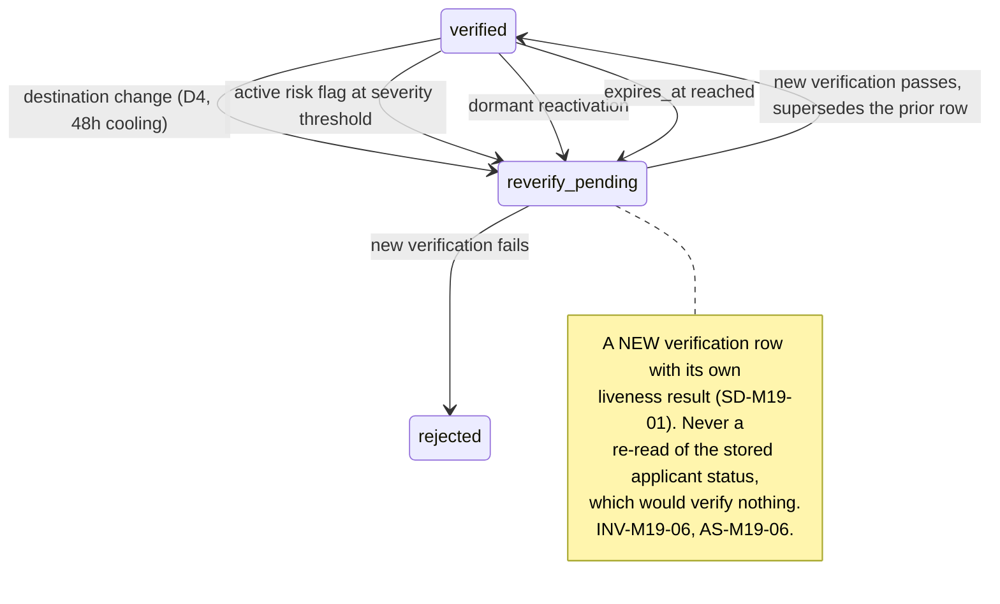
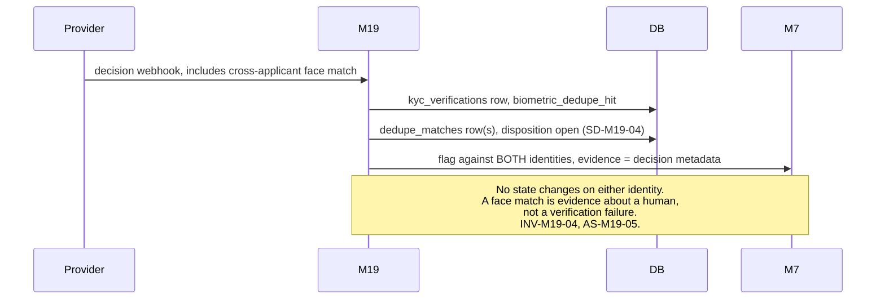
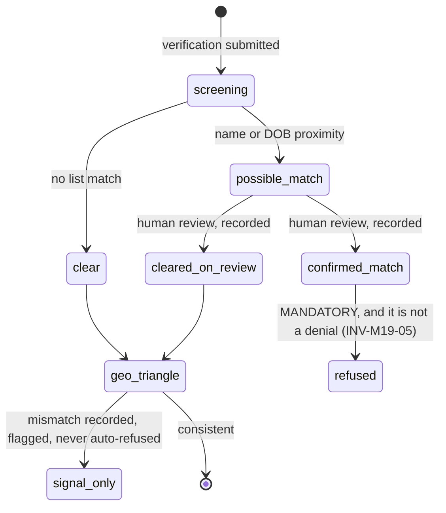

# M19: KYC and Identity Verification

Constitution section §4-ADDENDUM's M19 specification, points (a) through (g), section 10's open placement decision, Appendix D2's data-minimization rules, Appendix A items 6 and 7, and Appendix B5's ten-section template. **Money path under [ADR-003](../DECISIONS.md)'s strict regime**, because verification is a gate on funding and on every external withdrawal.

The constitution's own justification is the sentence to hold onto: **Merit's zero-denial policy means fraud must be caught before anyone is in the money, and identity is the chokepoint.** Every other module in the corpus is arranged so that an eligible request is paid mechanically. That arrangement is only survivable if the people holding accounts are who they say they are and are not each other, and this module is the only place that is established.

One sentence governs it: **verification is a gate Merit places, a corpus Merit contributes to, and a set of documents Merit never holds, and the three are in tension with each other in ways the placement decision decides.**

**Identifier conventions:** `INV-M19-nn` invariants, `SD-M19-nn` schema deltas, `PL-M19-nn` placements, `FM-M19-nn` failure modes, `AS-M19-nn` adversarial scenarios, `OQ-M19-nn` open questions, `DEP-M19-nn` dependencies.

---

## 1. Purpose and invariants

### 1.1 What this module is

A dedicated provider integration (Sumsub, Veriff, or Persona class, roughly $1.50 to $2 per verification including document, liveness and face, and device signals), the placement configuration that decides when it fires, and the signals it produces for [M7](M07-risk-abuse.md).

Six capabilities, mapping to the constitution's (a) through (g):

| Constitution point | Capability | Where |
|---|---|---|
| (a) | Placement as config, never a hardcode; Direct always verifies at purchase | Section 1.2, INV-M19-01 |
| (b) | Provider webhook lifecycle wired into the account state machine | Section 3.1, already approved in [STATE_MACHINES](../architecture/STATE_MACHINES.md) |
| (c) | Biometric dedupe as the fleet-killer, feeding the identity graph | Section 3.3, AS-M19-01, AS-M19-05 |
| (d) | AML and sanctions screening, plus the geo-consistency triangle | Section 3.4, AS-M19-03, AS-M19-04 |
| (e) | Re-verification triggers | Section 3.2, AS-M19-06 |
| (f) | Data minimization: status and refs only | INV-M19-07, AS-M19-07 |
| (g) | Friction telemetry per placement | Section 9, AS-M19-08 |

### 1.2 The placement decision, implemented as configuration

Constitution section 10 leaves this open and states the tradeoff in detail. This module implements **all three points as a config value on the plan** (`kyc.placement` in the approved plan config schema), so the decision can move without a rewrite.

| ID | Placement | When it fires | Cost | Constitution's assessment |
|---|---|---|---|---|
| PL-M19-01 | `pre_eval` | At checkout, before purchase completes | **~$1.50 to $2 on 100 percent of buyers**, and friction on a $79 to $99 impulse purchase | Maximum deterrence, maximum friction; no major competitor gates purchase |
| PL-M19-02 | `pre_funded` | At evaluation pass, before the funded account exists | **~15 percent of buyers**, an 85 percent cost saving; friction lands on people already invested | "The likely sweet spot" |
| PL-M19-03 | `direct_purchase` | At purchase, always, on Direct and any instant-funded plan | 100 percent of Direct buyers | **Not configurable.** Funding is immediate, so there is no later moment |
| — | payout-only | — | — | **Rejected by the constitution**: too late under a zero-denial policy |

**Superseded by [ADR-021](../DECISIONS.md): placement is a composite trigger set, not a single point.** The three rows above remain the vocabulary and the cost model, but the configuration is now a **set of trigger events** and verification fires at whichever is reached **first**. AS-M19-01 is the reason: placement also decides how much of the population enters the biometric dedupe corpus, and the corpus is the fleet-killer.

### 1.2.1 The composite trigger set (ADR-021)

| Trigger | Fires when | Population it reaches |
|---|---|---|
| `first_purchase` | Any first purchase | 100 percent of buyers. The old `pre_eval` behavior, now one option rather than the only early one |
| `second_distinct_account_purchase` | A purchase creating a **second concurrent** account | **The fleet-operator trigger.** Small, and precisely aimed |
| `second_purchase_any` | Any second purchase, **including resets** | Larger and cheaper, but see the reset caveat below |
| `eval_pass` / `pre_funded` | Evaluation passed, before the funded account exists | The constitution's "likely sweet spot", roughly 15 percent of buyers |
| `payout_request` | A payout is requested | **Invalid as a sole trigger.** Retained only as a backstop for when an earlier trigger somehow did not fire |

**Direct and any instant-funded plan always verify at purchase.** Not configurable, because funding is immediate and there is no later moment.

**Why the composite answers AS-M19-01 better than either single point did.** `pre_funded` leaves the fleet operator outside the corpus *precisely because fleet operators mostly do not pass evaluations*. They buy many accounts and farm the ones that happen to run. **A serial buyer of distinct concurrent accounts is exactly the population `pre_funded` misses**, and `second_distinct_account_purchase` captures their faces early at a cost paid only by people who have already bought twice. That is a better answer than lineup-wide `pre_eval` friction on a $79 impulse purchase.

**`payout_request` is invalid alone and the reason is worth stating once.** Verification first demanded at payout time is the [zero-denial policy](../GLOSSARY.md) meeting a wall: the trader has earned the money, the gate is new to them, and Merit's brand promise is that approval is mechanical. It is the industry's worst-reviewed practice and it is the one placement the constitution already rejected.

**Two caveats recorded in the config's own documentation, because both are easy to miss:**
- **Resets inflate `second_purchase_any`.** A trader who resets once becomes a second purchaser under that trigger without ever holding a second account, which is a different population entirely. Choosing it buys coverage and simultaneously buys friction on Merit's most loyal repeat customers.
- **Precedent exists.** Topstep verifies before the second purchase, so the composite sits inside published industry practice rather than ahead of it.

**The founder is weighing `{pre_funded always}` against `{second_distinct_account + pre_funded}`, and the final trigger set is decided at FREEZE** on beta funnel data. Both are the same code and differ only in a config array, which is the whole reason this was built as a set.

**Required telemetry, per ADR-021's conditions:** per-trigger funnel instrumentation (SD-M19-03 widens to record **which trigger fired**, not only the placement), **corpus-coverage as a reported number with a configured floor**, and a **pre-agreed per-plan escalation path** so the beta escalates specific plan and size combinations rather than negotiating a lineup-wide switch under pressure.

**The provider remains undecided, and one property is non-negotiable regardless:** the provider adapter is **vendor-agnostic**, and the selected provider is **named in the privacy policy at selection time**, which makes provider choice a disclosure event and not only a procurement one.

### 1.3 What this module is not

| Not M19 | Whose job | Why the boundary is here |
|---|---|---|
| Holding documents or biometrics | the provider | Merit stores status, `provider_applicant_id`, and match signals. Never a document, an image, or a template ([DATA_MODEL](../architecture/DATA_MODEL.md), [VG-10](../../research/VIBE_FAILURE_POSTMORTEMS.md), INV-M19-07) |
| Deciding enforcement | [M7](M07-risk-abuse.md) | A dedupe hit raises a flag against **both** identities and changes no state by itself ([STATE_MACHINES](../architecture/STATE_MACHINES.md) already says so). AS-M19-05 |
| Name matching at payout | [M5](M05-payout-system.md) | M19 supplies the verified name; M5 scores the match (its SD-M5-02, AS-M5-02) |
| Geo-blocking | [M3](M03-billing-checkout.md) at checkout, [M9](M09-marketing-site.md) as disclosure | M19 checks **consistency** across three countries, which is a different question from whether a jurisdiction is restricted |
| Entity resolution generally | [M7](M07-risk-abuse.md) | M19 contributes the single strongest edge to the graph and does not own it |

### 1.4 Invariants

| ID | Invariant | Enforcement |
|---|---|---|
| INV-M19-01 | Placement is read from the account's **pinned plan version** at the moment the gate evaluates, and is never hardcoded | `kyc.placement` in the approved plan config. Recorded on the verification row (`placement`) so telemetry can attribute outcomes to the config that produced them |
| INV-M19-02 | **Direct and any instant-funded plan verify at purchase**, and no configuration can move that | Publish-time validation (a new CV rule): a plan with no evaluation phase and `placement != direct_purchase` fails to publish. Funding is immediate, so there is no later gate to move to |
| INV-M19-03 | Funded trading is blocked until `verified`, and under `pre_eval` or `direct_purchase` so is the purchase | [STATE_MACHINES](../architecture/STATE_MACHINES.md) G-ELIGIBLE already requires KYC `verified`, and provisioning inherits the same gate |
| INV-M19-04 | A biometric dedupe hit **raises a flag against both identities and changes no state** | [STATE_MACHINES](../architecture/STATE_MACHINES.md) section on the KYC machine, as approved. A face match is evidence about a human, not a verification failure (AS-M19-05) |
| INV-M19-05 | **A sanctions match is the one place in Merit where a refusal is mandatory**, and it is not a denial in the zero-denial sense | Section 3.4, AS-M19-04. The distinction is legal rather than semantic and it is written down here so it is never argued about under pressure |
| INV-M19-06 | Re-verification is a **new verification**, never a re-read of a stored result | SD-M19-01. A "re-verification" that returns the cached applicant status verifies nothing and is the shape ATO controls usually fail in (AS-M19-06) |
| INV-M19-07 | No document, image, biometric template, or document number is stored, logged, cached, or transmitted through Merit's systems | Appendix D2, [SECURITY](../architecture/SECURITY.md) C-13, `raw_result` restricted to decision metadata. The client goes to the provider's hosted flow ([API_CONTRACT](../architecture/API_CONTRACT.md)) and Merit never proxies |
| INV-M19-08 | Provider unavailability **never blocks a payout for an already-verified identity** | AS-M19-02. Verification is a state Merit holds; the provider's availability must not become a payout dependency |
| INV-M19-09 | Every rejection tells the trader what to do next, and **never states the provider's internal reason verbatim** | [EVENTS section 11](../architecture/EVENTS.md)'s existing guard on `kyc.rejected`, and the two-tier evidence discipline |
| INV-M19-10 | Geo-consistency produces a **signal, never an automatic refusal** | AS-M19-03. Travelers, expatriates, migrants, and dual nationals are the majority of triangle mismatches, and a hard rule here is a fairness failure aimed at the same population [M5](M05-payout-system.md) AS-M5-02 identifies |
| INV-M19-11 | Every verification's **placement, cost, and funnel position are recorded** at the time it happens | Constitution (g). The section 10 decision is to be settled by data, and data not captured at the time cannot be reconstructed |
| INV-M19-12 | Enforcement resting on a dedupe hit carries evidence Merit can produce **independently of the provider relationship** | AS-M19-07. Minimization is right and it creates an evidence dependency that must be handled deliberately |

---

## 2. Entities and schema deltas

M19 consumes the approved `kyc_verifications` ([DATA_MODEL section 3](../architecture/DATA_MODEL.md)), which already carries `placement`, the geo triangle, `biometric_dedupe_hit`, and `dedupe_matched_identity_id`. Four deltas.

| ID | Table | Change | Why it is not optional |
|---|---|---|---|
| SD-M19-01 | `kyc_verifications` | add `verification_purpose text not null check in ('initial','reverify_destination','reverify_flag','reverify_dormant','reverify_expiry')`, `supersedes uuid null self-fk`, `liveness_passed boolean null`, `liveness_method text null` | INV-M19-06. A re-verification is a **new row**, linked to the one it supersedes, or the system cannot distinguish "we checked again today" from "we looked at what we already had". `liveness_method` is recorded because liveness techniques and their defeat rates move quickly, and an enforcement decided on a 2027 liveness check needs to know which technique produced it (AS-M19-06) |
| SD-M19-02 | new `sanctions_screenings` | `id`, `identity_id`, `provider`, `list_refs text[]`, `match_strength`, `status check in ('clear','possible_match','confirmed_match','cleared_on_review')`, `reviewed_by null`, `reviewed_at null`, `review_note null`, `screened_at` | INV-M19-05, AS-M19-04. A sanctions hit is the one outcome Merit **must** act on and the one most likely to be a name collision, so it needs its own object with a review trail. Folding it into `kyc_verifications.rejection_reason` would put a legally mandatory refusal in the same field as a blurry-photo rejection |
| SD-M19-03 | new `kyc_funnel_events` | `id`, `identity_id`, `placement`, `plan_code`, `step check in ('gate_reached','session_created','provider_opened','submitted','decided','abandoned')`, `occurred_at`, `attempt_number`, `cost_cents null` | Constitution (g) and INV-M19-11. Drop-off per placement cannot be reconstructed from `kyc_verifications`, because the traders who matter most are the ones who never created a verification row at all. The abandonment is the measurement (AS-M19-08) |
| SD-M19-04 | new `dedupe_matches` | `id`, `identity_a`, `identity_b`, `match_strength`, `provider_ref`, `observed_at`, `disposition check in ('open','confirmed_same_person','distinct_persons','inconclusive')`, `disposition_note null`, `evidence_snapshot jsonb` | INV-M19-04 and INV-M19-12. A match is a **relationship between two identities**, not a property of one, and the approved single-column `dedupe_matched_identity_id` cannot express a face matching three identities. `evidence_snapshot` holds the provider's decision metadata (scores, method, timestamps, never images) so an enforcement survives the provider relationship ending (AS-M19-07) |

---

## 3. State machines

### 3.1 The verification lifecycle, as approved

The machine in [STATE_MACHINES](../architecture/STATE_MACHINES.md) is approved and not redrawn: `kyc_required → pending → verified | rejected`, with `expired` from `verified`. Three things this plan adds.

**The gate placement is evaluated, not assumed.** `G-PLACEMENT-REACHED` fires at checkout under `pre_eval` and `direct_purchase`, and at `phase.passed` under `pre_funded`. The placement comes from the account's pinned plan version (INV-M19-01), which means **a trader who bought under one placement keeps it** even if the config later changes, exactly as they keep their pinned rules (B4 #12). That property is not decorative: without it, a config change would retroactively require verification from people who bought without it, which is a rule change applied backwards.

**Rejection is not terminal.** A rejected verification can be retried, because the overwhelming majority of rejections are document quality, lighting, and expired identification rather than fraud. The retry count is bounded and a trader who exhausts it reaches a human, never a wall (INV-M19-09).

**`expired` is a real state with a real trigger.** `expires_at` drives it, and reaching it does not close an account; it blocks the next gated action and prompts re-verification, so an expiry is a task rather than an enforcement.

### 3.2 Re-verification, which is a new check every time

### 3.3 Biometric dedupe

**Why the flag lands on both.** A match says two applications share a face. It does not say which identity is legitimate, and in the family-KYC case ([dossier item 6](../../research/ADVERSARY_DOSSIER.md)) both may be. Flagging one and not the other would encode an assumption the data does not support.

### 3.4 Screening and the geo triangle

**The one place Merit must be able to refuse, stated precisely.** [M05](M05-payout-system.md) INV-M5-01 removes the denial path from payouts and the absence of a `denied` status is the control. A confirmed sanctions match is a different thing in kind: it is a **legal prohibition on transacting with a person**, not a judgment about their trading. Merit does not deny their payout because they failed a gate; Merit is prohibited from the relationship. The distinction is recorded here so that nobody, under pressure, either treats a sanctions match as negotiable or treats it as precedent for a general refusal power. It applies to the relationship, not to a request, and it is the only exception in the corpus.

---

## 4. API endpoints touched

| Endpoint | M19's role | Notes |
|---|---|---|
| `POST /kyc/session` | Owns | Approved. Returns the provider's hosted URL. **Merit never proxies documents** (INV-M19-07) |
| `GET /kyc/status` | Owns | Approved. State, placement, `verified_at`, `expires_at`, and `action_required` |
| `POST /webhooks/kyc/:provider` **NEW** | Owns | Signature, timestamp, nonce, replay window ([SECURITY](../architecture/SECURITY.md) C-06). Enqueues; does no business work in the request |
| `POST /kyc/reverify` **NEW** | Owns | Creates a **new** verification with a `verification_purpose` (SD-M19-01) |
| `GET /admin/identities/:identityId/kyc` **NEW** | Owns | Verification history, dedupe matches with dispositions, screening trail. Admin origin, audited |
| `POST /admin/dedupe-matches/:id/disposition` **NEW** | Owns | Confirm same person, distinct persons, or inconclusive; reason required; writes `admin_actions` |
| `POST /admin/sanctions/:id/review` **NEW** | Owns | `cleared_on_review` or `confirmed_match`, reason required. **Dual control on `confirmed_match`**, because it is the only irreversible refusal in the system |
| `GET /admin/kyc/funnel` **NEW** | Owns | Constitution (g)'s telemetry, by placement, plan, and step |

---

## 5. Events emitted and consumed

| Event | When | Notes |
|---|---|---|
| `kyc.required`, `kyc.pending`, `kyc.verified`, `kyc.rejected`, `kyc.expired` | lifecycle | Already in the approved [EVENTS](../architecture/EVENTS.md) catalogue. `kyc.rejected`'s guard, never stating the provider's internal reason verbatim, is already recorded there |
| `kyc.dedupe_hit` | provider reports a cross-applicant match | Already approved. M19 adds `match_strength` and the `dedupe_match_id`. Consumers: RISK (both identities), FEED, EVID |
| `kyc.reverification_required` **NEW** | any trigger in section 3.2 | `{ identity_id, purpose, deadline }`. Consumers: NOTIF, FEED |
| `kyc.sanctions_possible_match` **NEW** | screening proximity | `{ screening_id, match_strength }`. **No name in the payload.** Consumers: ALERT, EVID |
| `kyc.sanctions_confirmed` **NEW** | human review confirms | `{ screening_id, reviewed_by }`. **Pages.** Consumers: ALERT, EVID, and it triggers the legal runbook rather than an automated action |
| `kyc.geo_inconsistent` **NEW** | triangle mismatch | `{ identity_id, document_country, ip_country, payment_country }`. Signal only (INV-M19-10). Consumers: RISK, FEED |
| `kyc.funnel_step` **NEW** | each step in SD-M19-03 | `{ identity_id, placement, plan_code, step, attempt_number }`. Consumers: BI. High volume, low individual value, and it is the only way to answer the section 10 question |
| `kyc.provider_degraded` **NEW** | provider health check fails | `{ provider, error_class }`. Consumers: ALERT, FEED. AS-M19-02 |

**Consumed:** `purchase.charged` (PL-M19-01 and PL-M19-03 gates), `phase.passed` (PL-M19-02), `payout.destination_changed`, `flag.status_changed`, `account.reactivated`, and `day.closed` (expiry sweep).

---

## 6. Failure modes

| ID | Failure | Blast radius | Detection | Recovery |
|---|---|---|---|---|
| FM-M19-01 | Provider outage | Under `pre_funded`, passers cannot be verified and cannot be funded; under `pre_eval`, checkout stops | Provider health check, `kyc.provider_degraded`, session-creation failure rate | **Already-verified identities are unaffected, including their payouts** (INV-M19-08). New verifications queue with a trader-facing honest status. AS-M19-02 |
| FM-M19-02 | Dedupe false match | A legitimate trader is flagged as somebody else, and under a fleet narrative that is a serious accusation | `match_strength` recorded, disposition trail (SD-M19-04), false-match rate tracked | Flag only, no state change (INV-M19-04). Human disposition with a recorded reason. AS-M19-05 |
| FM-M19-03 | Sanctions false positive on a common name | A legitimate person is refused a relationship, which is the most damaging error available | `match_strength`, mandatory human review before `confirmed_match` | Review with dual control on confirmation, recorded either way. AS-M19-04 |
| FM-M19-04 | Geo triangle fires on travelers and expatriates | A fairness failure aimed at exactly the population [M5](M05-payout-system.md) AS-M5-02 identifies | Mismatch rate by document country, monitored for disparate impact | Signal only (INV-M19-10). AS-M19-03 |
| FM-M19-05 | Re-verification re-reads a cached result | The ATO control does nothing while appearing to work | `verification_purpose` and `supersedes` require a new row (SD-M19-01) | Structurally prevented. AS-M19-06 |
| FM-M19-06 | Documents reach Merit's systems | The exact breach [VG-10](../../research/VIBE_FAILURE_POSTMORTEMS.md) and D2 exist to prevent | `raw_result` schema allowlist, plus a payload scanner in CI and a canary | Hosted flow only, Merit never proxies (INV-M19-07). AS-M19-07 |
| FM-M19-07 | Provider relationship ends and evidence goes with it | Past enforcements become unsupportable | `evidence_snapshot` on `dedupe_matches` (SD-M19-04) | INV-M19-12. AS-M19-07 |
| FM-M19-08 | Placement change applied retroactively | Traders who bought without a gate are gated after the fact, which is a rule change applied backwards | Placement read from the pinned plan version (INV-M19-01) | Structurally prevented, same mechanism as B4 #12 |
| FM-M19-09 | Funnel telemetry not captured at the time | The section 10 decision cannot be settled by data and gets settled by opinion | `kyc_funnel_events` written at each step (SD-M19-03) | Capture is the recovery; nothing reconstructs an abandonment. AS-M19-08 |

---

## 7. Adversarial scenarios

**Eight listed, eight novel.**

### AS-M19-01: The placement decision quietly sets the size of the fleet-killer (NOVEL, and it amends the constitution's own tradeoff)

**Attack.** Constitution section 10 prices the placement tradeoff on **cost and conversion**: pre-eval costs $1.50 to $2 on 100 percent of buyers and suppresses conversion on an impulse purchase, while pre-funded verifies only about 15 percent of buyers for an 85 percent saving, with friction landing on people already invested. That analysis is correct and it omits a variable that matters more than either, and the section itself gestures at it without following it through: it says of pre-funded that "fleets are caught by biometric dedupe before any liability exists".

**Follow that through.** Biometric dedupe is a **cross-applicant** face match. Its power is a function of how much of the population is in the corpus. Under `pre_funded`, **85 percent of buyers never enter it.**

**What an operator does with that, and the arithmetic is the argument.** [Dossier item 6](../../research/ADVERSARY_DOSSIER.md) describes one operator running 20 to 30 accounts under different names. Suppose they buy 30 evaluations. At a realistic pass rate of roughly 15 percent, 4 or 5 of those accounts reach the funded gate and are verified. **The other 25 never enter the dedupe corpus at all.** The operator learns which of their synthetic identities pass verification at a cost of four checks, and Merit never sees the other 25 faces. Worse, the operator can **iterate**: buy in batches, discover which identity documents survive, and reuse the winners. Pre-eval would have put all 30 faces into the corpus on day one and matched them against each other immediately, before a single evaluation was traded.

**The honest counter-argument, stated because it is strong.** Under pre-funded, the operator still cannot get **funded** without verification, so no liability exists until they pass, which is what the constitution says. That is true and it is a smaller claim than it appears: the operator has still bought 30 evaluations of reconnaissance, has learned Merit's document tolerances, and has 4 or 5 funded accounts whose faces match each other and which are caught **only if the dedupe fires across that small set**. And the fee revenue from 30 evaluations is not a consolation, because the constitution is explicit that this business dies from liability rather than from foregone fees.

**Counter, and the recommendation is not simply "switch to pre-eval".**
1. **The finding is recorded and priced**, because the tradeoff as written omits it. Placement is not only a cost-versus-conversion choice; it is a **choice about the size of the corpus that the constitution calls the fleet-killer** (OQ-M19-01).
2. **Beta launches `pre_funded` as the constitution directs**, and the telemetry per constitution (g) is extended to capture the corpus-coverage consequence: what share of purchasing identities are ever verified, and how many dedupe matches are found per 1,000 verifications at that coverage.
3. **A cheaper partial corpus is available and is the real proposal.** Device and payment fingerprinting already run at purchase for 100 percent of buyers ([M7](M07-risk-abuse.md) D-08, the identity graph). Those are weaker than a face match and they are not zero, and the correct reading is that under `pre_funded` **the graph carries the whole first line of defense** and should be resourced accordingly rather than treated as corroboration for a face match that will never be taken.
4. **A targeted escalation to `pre_eval` is possible without a full switch**, because placement is per plan and the config is already per plan version: raise verification to purchase on the **plan and size combinations that fleets actually use**, which the beta will identify. This preserves conversion on the impulse-purchase entry plan while closing the corpus gap where it matters.
5. **[M17](M17-offers-engine.md) AS-M17-02's free-trial finding is the same finding in a sharper form**, and its counter (KYC before provisioning on any zero-price account) is the precedent for point 4. EC-125, GS-212.

### AS-M19-02: The verification provider becomes a payout dependency (NOVEL)

**Attack.** M19 sits upstream of everything: provisioning under two placements, funded trading under all three, and [M20](M20-wallet.md)'s external withdrawal leg. A provider outage therefore has a blast radius that looks, from the outside, exactly like the failure constitution 0 names as fatal. The dangerous version is not the outage itself but the **naive implementation of the gate**: if the payout path checks KYC by calling the provider, or by requiring a fresh check, then a provider outage stops payouts for identities that were verified months ago.

**Why this is easy to build by accident.** "Verify KYC is current before paying" is a sensible-sounding sentence, and one reading of it is a provider call. Under a re-verification regime (section 3.2) it is even more tempting, because there is already a code path that talks to the provider on a sensitive action.

**And the second-order version.** Even if payouts are safe, a multi-day outage under `pre_funded` means passers cannot be funded. That is a queue of people who did the hard part and are waiting, which is a support and trust problem of its own, and it is the moment somebody will suggest "let them trade and verify later", which would put an unverified trader on a funded account.

**Counter.**
1. **Verification is a state Merit holds, not a question Merit asks** (INV-M19-08). G-ELIGIBLE reads `kyc_verifications.state = verified` from Merit's own database, exactly as the approved [STATE_MACHINES](../architecture/STATE_MACHINES.md) specifies. No payout path calls the provider, ever.
2. **A re-verification trigger queues a new verification and does not revoke the existing one.** An identity stays `verified` while a re-check is pending, with the **gated action** (a destination change) blocked rather than the identity's whole status downgraded. That keeps the ATO control intact while keeping ordinary payouts flowing.
3. **Provisioning queues honestly.** Passers wait in a visible state with a trader-facing explanation and an ETA, and constitution section 7's over-communicate doctrine applies: the comms template is pre-written, names the dependency, and gives a next-update time rather than an ETA that slips.
4. **"Trade now, verify later" is refused in advance, in writing**, because it is the exact suggestion an outage produces and it converts a bounded delay into an unverified funded account. Recorded here so the decision is not made at 2am.
5. **A second provider is a post-v1 item, not a launch requirement** (OQ-M19-04), because two integrations double the surface holding the most sensitive flow in the estate and the outage is bounded by points 1 through 3. EC-126, GS-213.

### AS-M19-03: The geo triangle punishes the wrong people (NOVEL)

**Attack.** Constitution (d) requires geo-consistency checks across the IP, document, and payment country triangle. A mismatch is a real fraud signal: [dossier item 6](../../research/ADVERSARY_DOSSIER.md) names VPNs and synthetic identities, and [dossier item 3](../../research/ADVERSARY_DOSSIER.md) names login geography versus KYC mismatch as a paid-passing-service signal. It is also, and much more often, the ordinary condition of a large fraction of legitimate customers: an expatriate with a home-country passport and a local card, a migrant worker, a dual national, a student abroad, anybody travelling, and anybody whose bank issues cards from a different country from where they live.

**Why a hard rule here is worse than it looks.** Under a zero-denial brand, refusing or freezing on a triangle mismatch produces the same failure [M05](M05-payout-system.md) AS-M5-02 identifies for name matching, on the **same population**: people with cross-border lives and non-Anglophone documents. The two controls compound, so the trader whose name transliterates inconsistently is disproportionately the same trader whose passport and card disagree. Merit would have built two independent controls that fail on the same people twice.

**Counter.**
1. **Signal, never automatic refusal** (INV-M19-10). The mismatch is recorded, flagged, and joins the graph. It contributes to a picture; it does not make a decision.
2. **The signal is scored, not boolean**, and the pairs matter differently: document-versus-payment mismatch is weaker than IP-versus-both, and a stable long-term IP country that differs from the document is close to meaningless on its own.
3. **Disparate-impact monitoring is a named metric**: mismatch rate by document country, and the downstream flag and enforcement rate for mismatched identities against everyone else. A control nobody measures for skew is a control that will have it.
4. **Restricted-jurisdiction enforcement is a separate mechanism** ([M3](M03-billing-checkout.md), `geo_restrictions`). Conflating "this person's countries disagree" with "this country is restricted" would let a fraud heuristic quietly become a jurisdiction policy.
5. **The trader-facing consequence of a mismatch alone is nothing.** No message, no extra step. If the composite picture eventually justifies an action, that action comes from [M7](M07-risk-abuse.md) with its own evidence. EC-127, GS-214.

### AS-M19-04: The sanctions hit, which is the one refusal Merit must be able to make (NOVEL)

**Attack.** Two failures sit here and they point in opposite directions, which is why this needs to be settled in advance rather than in the moment.

**The first: treating a sanctions match like any other gate.** [M05](M05-payout-system.md) INV-M5-01 says there is no code path that denies an eligible request, and the corpus is proud of that. Somebody will, correctly, notice that a confirmed sanctions match must nonetheless stop the relationship, and if that has not been thought about in advance the resolution happens under pressure, quickly, and probably by adding a general-purpose refusal capability, which is the thing the entire zero-denial architecture exists to not have.

**The second: treating a possible match as a confirmed one.** Sanctions screening on name and date of birth produces false positives at a rate that surprises people, especially for common names and for transliterated names, which is the same fairness axis as AS-M19-03 and [M05](M05-payout-system.md) AS-M5-02 for the third time. Auto-refusing on a possible match means refusing a relationship to a legitimate person on a name collision, which is among the most damaging errors available and is very hard to undo reputationally.

**Counter, and the distinction is the deliverable.**
1. **A confirmed sanctions match is a legal prohibition on the relationship, not a denial of a request** (INV-M19-05). Merit is not judging their trading; Merit is prohibited from transacting. It is scoped to the relationship, it is the **only** exception in the corpus, and it is written down here precisely so it is never cited as precedent for a general refusal power.
2. **Possible matches never auto-refuse.** They enter a review queue with `match_strength` recorded, and the disposition, either way, is recorded with a reviewer and a reason (SD-M19-02).
3. **Confirmation is dual controlled** (section 4), on the same footing as [ADR-010](../DECISIONS.md)'s set, because it is the single irreversible refusal in the system.
4. **`kyc.sanctions_confirmed` triggers a legal runbook, not an automated action.** Freezing funds, reporting obligations, and what a trader may be told are legal questions with jurisdiction-specific answers, and a confirmed match is rare enough that a human process is affordable and appropriate. A counsel item is filed in [legal/](../legal/README.md).
5. **The screening event payload carries no name** (section 5), because a sanctions-screening alert channel that carries names is a PII channel with a wide audience. EC-128, GS-215.

### AS-M19-05: The fleet-killer is also a false-accusation engine (NOVEL)

**Attack.** Biometric dedupe is the constitution's named counter to one-face-many-names fleets, and it is genuinely the strongest one available. Face matching also produces false matches: on siblings, on identical twins, on poor-quality captures, and at rates that vary by demographic group in ways that are documented and are not symmetric. Merit will therefore, at some volume, be told that two unrelated legitimate traders are the same person.

**What happens next is the problem, and it is a process gap rather than a technical one.** The corpus has a clear posture for detection: flags go to a queue, a human decides, enforcement carries an evidence pack, and there is never an automatic action ([M7](M07-risk-abuse.md)). What it does not have is guidance for the specific case where the evidence is a **biometric assertion Merit cannot inspect**, about **two people who may be strangers to each other**, where confirming the match means telling somebody they are running a fleet and denying it means overriding the firm's strongest control on the say-so of the accused.

**And the disclosure trap inside it.** Telling trader A that their face matched trader B discloses B's existence and their participation to A. Telling A nothing means an unexplained restriction, which is the anti-pattern [TOP10_FIRMS](../../research/TOP10_FIRMS.md) documents and constitution M5 forbids.

**Counter.**
1. **A hit changes no state** (INV-M19-04, already in the approved [STATE_MACHINES](../architecture/STATE_MACHINES.md)). It is evidence about a human, not a verification failure, and both identities remain fully operational while it is open.
2. **A match is a relationship with a disposition** (SD-M19-04): `open`, `confirmed_same_person`, `distinct_persons`, or `inconclusive`, each recorded with a reason. **`inconclusive` is a permitted and expected outcome**, and it exists so that a reviewer is never forced to choose between two wrong answers.
3. **A dedupe hit alone never enforces.** It is a strong prior that must be **corroborated by conduct**: shared devices, shared payment fingerprints, correlated trading ([M7](M07-risk-abuse.md) D-01 to D-03), or the graph priors from D-12. This is the same standard the batch 1 gate applied to copy trading, where the evidence is the conduct rather than the statistical inference.
4. **Neither trader is told about the other, ever.** If enforcement follows, its stated grounds are the corroborating conduct and the ToS clause, both of which concern the trader's own account. A control that cannot be explained without disclosing a third party is a control that must rest on something else.
5. **The false-match rate is a tracked metric with a review**, in the same spirit as [M05](M05-payout-system.md) AS-M5-02's false-positive tracking on name matching, and it is broken down enough to notice a demographic skew. EC-129, GS-216.

### AS-M19-06: The re-verification that verifies nothing (NOVEL)

**Attack.** Appendix D4 makes a payout destination change trigger 48 hour cooling **and re-verification**, and that pairing is the primary control against the account-takeover cash-out. The implementation that fails is easy and looks correct: on a destination change, call the provider with the stored `provider_applicant_id`, receive "this applicant is verified", and proceed. Nothing has been verified. The stored status was true yesterday and says nothing about who is holding the session today, which is the only question that matters.

**And the version that is genuinely hard.** Even a real re-check, if it is document-only, proves possession of a document image that an attacker who has compromised an account may well have. The control has to be a **liveness** check tied to the moment, and liveness is a moving target: injection attacks against camera streams and synthetic face generation are both live threat classes, and a technique that is adequate in 2026 may not be in 2028. [SECURITY_LANDSCAPE](../../research/SECURITY_LANDSCAPE.md)'s finding that credential stuffing against trader dashboards is the most documented attack in this sector is the reason the whole chain matters: the session is the cheap part to compromise.

**Counter.**
1. **Re-verification is a new row with its own liveness result** (SD-M19-01, INV-M19-06). `supersedes` links it to the prior verification, and `verification_purpose` records why. Reading a cached status cannot satisfy the trigger, because the trigger requires a row that does not exist yet.
2. **`liveness_method` is recorded on every verification** (SD-M19-01), so an enforcement or a dispute decided years later knows which technique produced the evidence. Recording the method is what makes a future re-evaluation of that evidence possible rather than archaeological.
3. **The gated action is blocked, not the identity** (AS-M19-02's counter 2). A pending re-verification stops the destination change and leaves ordinary payouts to the existing destination flowing, which keeps the control tight and its collateral cost near zero.
4. **The 48 hour cooling runs regardless of the re-verification result**, so a successful re-verification does not accelerate the change. Two independent controls, neither able to short-circuit the other.
5. **Both the old and new contact are notified** ([M16](M16-notification-center.md) INV-M16-03 and AS-M16-02), which is the control that survives even if the liveness check is defeated. Defence in depth here is not decoration: it is the assumption that liveness will eventually be beaten. EC-130, GS-217.

### AS-M19-07: Minimization creates an evidence dependency on a third party (NOVEL)

**Attack.** Appendix D2 and [VG-10](../../research/VIBE_FAILURE_POSTMORTEMS.md) are emphatic and correct: documents and biometrics never touch Merit's storage, and the approved `kyc_verifications` says so in its own header. The consequence nobody has traced is that **the evidence for Merit's strongest fraud finding lives entirely at the provider.**

**Three ways that becomes a problem, none requiring anybody to behave badly.** The provider's own retention policy expires the applicant record while Merit's `kyc_verifications` retention is "forever" for AML reasons, so Merit holds a conclusion whose basis has been deleted. Merit changes providers, and every historical dedupe match becomes an assertion referencing an applicant id at a company Merit no longer has a contract with. Or a trader disputes an enforcement two years later, in a forum with a discovery process, and Merit's evidence pack contains a boolean.

**Why this is specifically dangerous for Merit.** The batch 1 gate ruled evidence packs are two tier and that the internal tier carries the detector detail, and [M07](M07-risk-abuse.md)'s entire enforcement posture rests on producing court-grade packs. An enforcement grounded in a dedupe hit, with no retrievable basis, is the weakest link in that posture and it sits under the strongest-sounding claim.

**Counter, and it threads the minimization requirement rather than weakening it.**
1. **`evidence_snapshot` on `dedupe_matches`** (SD-M19-04) captures the provider's **decision metadata at the time**: match score, method identifier, model or technique version, provider decision id, and timestamps. **No images, no templates, no document data.** That is entirely compatible with D2, because a score and a method are not biometric data, and it is what makes the finding auditable later.
2. **Enforcement rests on corroborating conduct** (AS-M19-05's counter 3), so the pack's spine is fills, marks, devices, and payments, all of which Merit holds forever, with the dedupe hit as supporting rather than load-bearing evidence.
3. **The provider contract carries a retention and export commitment** aligned with Merit's AML retention, and a provider change includes an export of decision metadata for historical matches. This is a procurement requirement, not an engineering one, and it belongs in the contract before the first verification rather than after the first dispute.
4. **A payload scanner in CI plus a canary** (FM-M19-06) asserts that nothing document-shaped ever appears in `raw_result` or in logs, because the counter to this scenario adds a field and the risk of a field is that it grows. EC-131, GS-218.

### AS-M19-08: The funnel telemetry that cannot answer the question it was built for (NOVEL)

**Attack.** Constitution (g) requires measuring drop-off at the KYC step per placement, so the section 10 decision is "settled by data within the beta". The naive implementation measures drop-off under `pre_funded`, finds it low, and concludes that friction is not a problem. That conclusion does not follow, for a reason that is structural rather than statistical: **under `pre_funded` the population reaching the gate has already paid and already passed an evaluation**, so its abandonment rate says nothing about what an unpaid, un-invested buyer would do at checkout. The measurement describes the wrong people.

**The tempting fix is worse.** Running placements as an A/B test across buyers means two populations with genuinely different fraud exposure and genuinely different verification costs, assigned at random. That is [M17](M17-offers-engine.md) AS-M17-07's rule-experiment problem in a new place: the arms differ in something material about the product, and one arm is more exposed to fleets than the other. And unlike a price test, the harm from the weaker arm is not distributed to the participants; it accrues to Merit, later, as liability.

**And the measurement that is actually needed is not drop-off at all.** The section 10 tradeoff is cost and conversion against **fraud caught**. Drop-off is one input. The other, which the constitution names as "revisit pre-eval only if funded-stage fraud volume justifies it", requires measuring fraud that reached the funded stage, and AS-M19-01 shows the corpus-coverage effect that determines how much of it is visible at all.

**Counter.**
1. **`kyc_funnel_events` records every step including abandonment** (SD-M19-03), keyed by placement and plan, because abandonment leaves no `kyc_verifications` row and is therefore invisible unless it is captured deliberately.
2. **Per-plan placement is the honest experiment.** Placement is per plan version, and Direct already runs `direct_purchase` while the others run `pre_funded`. **That is a real, non-random comparison already in production**: Direct buyers verify at purchase and the others do not, so Merit gets a genuine read on checkout-time verification drop-off from a population that chose that plan, without assigning anybody at random to a weaker fraud posture.
3. **The decision metric is stated in advance**, before the data arrives, on the same precommitment logic as [M12](M12-transparency-platform.md) INV-M12-07: funded-stage fraud incidents per 1,000 funded accounts, dedupe matches per 1,000 verifications, and verification cost per funded account, alongside drop-off. Choosing the metric after seeing the numbers is how a tradeoff gets resolved by whichever chart is most flattering.
4. **AS-M19-01's corpus-coverage measure joins the set**, because it is the variable the original tradeoff omitted and no amount of drop-off data substitutes for it.
5. **The beta's answer may be "insufficient data", and that is an acceptable outcome.** A beta of 50 to 100 traders will produce very few fraud incidents, which is good news and is also a small sample; concluding "no fraud, keep pre-funded" from it would be [M12](M12-transparency-platform.md) AS-M12-07's sample-floor error made in private. GS-219.

---

## 7.9 Verification UX: a milestone, never an accusation

Ruled at the batch 2 gate and binding on this module, [M04](M04-trader-portal.md), and [M16](M16-notification-center.md). It exists because [AS-M19-05](#as-m19-05-the-fleet-killer-is-also-a-false-accusation-engine-novel) establishes that the fleet-killer is also a false-accusation engine, and the **framing is the mitigation that costs nothing**.

**The governing rule: verification is framed as a milestone the trader has reached, never as a suspicion Merit is acting on.**

| Requirement | What it means concretely |
|---|---|
| **Congratulations, then verify** | At the `pre_funded` trigger the message leads with the achievement: "**You passed. One quick step to activate your funded account, about 2 minutes.**" The gate is the consequence of winning, not a checkpoint before being trusted |
| **The second-account trigger is framed as unlocking** | "Verify once to unlock multiple accounts", because that is literally what it does |
| **A positive why-statement** | Every prompt says why in the trader's interest (protecting their account and their payouts), never in Merit's (fraud) |
| **A stated time expectation** | "About 2 minutes." An unbounded task is abandoned; a bounded one is completed |
| **Save and resume** | A trader who drops out mid-flow returns to where they were. GS-206 |
| **Embedded provider flow** | The provider's flow is embedded, never a redirect to an unfamiliar domain that reads as a phishing attempt |
| **Pre-disclosure on plan pages** | The requirement appears on the plan page **before purchase**, so it is never a surprise discovered after payment. Binding on [M09](M09-marketing-site.md) |
| **Zero fraud or suspicion language, user-facing** | No "fraud", "suspicious", "risk", "flagged", "review" in any trader-facing verification string. Those words belong in the internal tier and nowhere else |
| **A support-assisted failure path** | A failed verification routes to a human. **The words "decisions are final" may not appear**, because they are false (a human can reverse it) and because they are what a trader screenshots |
| **A permanent Verified badge** | The status is a thing the trader keeps and can see, not a gate they passed once and cannot confirm |
| **One contextual prompt plus a persistent dashboard card** | One prompt at the trigger moment, then a card that waits. Repeated prompting reads as accusation regardless of wording |

**Why this is in a risk module rather than a design document.** Every item above is a decision about what the *detection system* is allowed to say out loud, and the failure it prevents is not an aesthetic one: it is a legitimate trader, correctly flagged for review by a soft link, who reads "your account is under review for fraud" and posts the screenshot. [ADR-022](../DECISIONS.md)'s soft-link review queue makes that population larger, not smaller, which is exactly why the language rule tightens as the graph gets better.

## 8. Test plan

### 8.1 Suites

| Suite | Prefix | Count | Runs | Blocks |
|---|---|---|---|---|
| Placement gating: all three placements, pinned-version behavior, Direct's non-configurability | `M19-P-nn` | 12 | every commit | merge |
| Lifecycle and webhook idempotency, replay, out-of-order | `M19-W-nn` | 10 | every commit | merge |
| Re-verification: new row required, cached status refused, gated-action scoping | `M19-R-nn` | 9 | every commit | merge |
| Dedupe: relationship modelling, both-identity flagging, no state change, disposition trail | `M19-D-nn` | 10 | every commit | merge |
| Sanctions: possible versus confirmed, dual control, no name in events | `M19-S-nn` | 8 | every commit | merge |
| Geo triangle: signal only, scoring, no auto-refusal | `M19-G-nn` | 6 | every commit | merge |
| Minimization negatives (no document data in storage, logs, or events) | `M19-M-nn` | 8 | every commit | merge |
| Provider-outage behavior, including payouts for verified identities | `M19-O-nn` | 6 | every commit | merge |
| Funnel telemetry completeness, including abandonment | `M19-F-nn` | 5 | every commit | merge |
| Negative authz (D5) | `M19-N-nn` | 6 | every commit | merge |
| Document-payload canary | `M19-K-01` | 1 | nightly and in production | page |
| Golden fixtures | `GS-nnn` | 10 owned (GS-212 to GS-221) | every commit | merge |

### 8.2 Named scenarios owned by this module

| ID | Scenario | Pins |
|---|---|---|
| GS-212 | Thirty purchases under `pre_funded`, four passing | Twenty-six identities never enter the dedupe corpus; corpus-coverage telemetry records it. AS-M19-01 |
| GS-213 | Provider outage during a payout wave | Verified identities pay normally; no payout path calls the provider; new verifications queue with honest status. AS-M19-02 |
| GS-214 | Geo triangle mismatch on an expatriate profile | Signal recorded and scored, **no refusal, no trader-facing message, no extra step**. AS-M19-03 |
| GS-215 | Sanctions possible match on a common name | No auto-refusal; review queue; confirmation requires dual control; the event payload carries no name. AS-M19-04 |
| GS-216 | Dedupe match between two unrelated legitimate traders | No state change on either; disposition recorded; `inconclusive` is available; neither trader is told about the other. AS-M19-05 |
| GS-217 | Destination change with a stored verified status | The cached status does **not** satisfy the trigger; a new verification with a liveness result is required; cooling runs regardless; both contacts are notified. AS-M19-06 |
| GS-218 | Enforcement pack built on a dedupe hit after a provider change | `evidence_snapshot` supplies score, method, and version; the pack's spine is corroborating conduct. AS-M19-07 |
| GS-219 | Funnel query for drop-off by placement | Abandonment events are present for identities with no verification row; the Direct-versus-others comparison is available. AS-M19-08 |
| GS-220 | A plan with no evaluation phase published with `placement != direct_purchase` | Publish validation **fails**. INV-M19-02 |
| GS-221 | Placement config changes after purchase | The account keeps its pinned placement; no retroactive gate appears. INV-M19-01, pairs with GS-041 |

### 8.3 Coverage rule

**Every path that could carry document data has a negative test asserting it does not**, covering storage, logs, events, error payloads, and support surfaces. Minimization is the module's only irreversible property: a leaked score can be lived with, and a leaked passport image cannot.

---

## 9. Observability

### 9.1 Metrics

| Metric | Why it matters |
|---|---|
| **Corpus coverage**: share of purchasing identities ever verified, by placement | AS-M19-01. The variable the constitution's tradeoff omitted, and the one that determines the fleet-killer's power |
| Dedupe matches per 1,000 verifications, and confirmed-versus-distinct disposition split | The fleet-killer's actual yield, and its false-match rate in the same number |
| Verification cost per funded account, and total monthly | The cost half of the section 10 tradeoff, measured rather than estimated |
| Drop-off by step and placement, with attempt number | Constitution (g). Attempt number matters: a trader who retries twice and succeeds is a different story from one who leaves |
| Time to verified, p50 and p95, by placement | The friction traders actually feel, which is latency more than steps |
| Geo mismatch rate by document country, and downstream flag rate for mismatched identities | AS-M19-03's disparate-impact check |
| Sanctions possible-match rate and confirmed rate | AS-M19-04. A high possible rate with a near-zero confirmed rate means the screening threshold is generating work rather than signal |
| Re-verification volume by purpose, and liveness pass rate by method | AS-M19-06. A falling liveness pass rate on a method is either an attack or a degraded technique, and both need looking at |
| Provider health, session-creation failure rate, and webhook lag | FM-M19-01 |
| Funded-stage fraud incidents per 1,000 funded accounts | AS-M19-08's decision metric, stated in advance |

### 9.2 Alerts

| Alert | Threshold | Severity |
|---|---|---|
| Document-shaped payload detected in storage, logs, or an event | any | **page**. The one irreversible failure in the module |
| Sanctions confirmed match | any | **page**, and it opens the legal runbook |
| Provider unavailable | sustained beyond the health window | **page** |
| A payout path observed calling the provider | any | **page**. INV-M19-08 regressed |
| Re-verification satisfied without a new row | any | **page** |
| Dedupe false-match rate above baseline | sustained | warn, with a threshold review |
| Geo mismatch rate skew by document country | beyond tolerance | warn, and it is a fairness review item |
| Corpus coverage below the configured floor | any | warn, and it is an OQ-M19-01 input |

### 9.3 Dashboard

M19 owns the funnel dashboard the section 10 decision will be settled from: coverage, drop-off, cost, dedupe yield, and funded-stage fraud. **If only one number could be shown it would be corpus coverage**, because it is the variable AS-M19-01 shows determines whether the fleet-killer is a control or a slogan.

---

## 10. Open questions for the founder

**OQ-M19-01. RESOLVED at the batch 2 gate by [ADR-021](../DECISIONS.md): yes, and the answer is a composite trigger set rather than a different single point.** The corpus-coverage telemetry and the pre-agreed per-plan escalation are both adopted as proposed. Section 1.2.1 carries the implementation. The original question is preserved below.

**OQ-M19-01 (as asked). Does AS-M19-01's finding change the placement recommendation?** The constitution's tradeoff prices cost and conversion and omits corpus coverage, and AS-M19-01 shows `pre_funded` puts roughly 85 percent of buyers outside the dedupe corpus, which is the control the same section calls the fleet-killer. Proposed: **launch `pre_funded` as directed, add corpus coverage to the telemetry, and pre-agree the escalation** as a per-plan move to `pre_eval` on the plan and size combinations the beta shows fleets using, rather than as a lineup-wide switch. This is a genuine amendment to a constitution section and it needs a ruling rather than an assumption.

**OQ-M19-02. Is the sanctions carve-out from zero denial acceptable as stated?** INV-M19-05 makes a confirmed sanctions match the only mandatory refusal in the corpus, scoped to the relationship rather than to a request. Proposed: **accept as written**, with the counsel item filed, and with the scoping language preserved verbatim wherever it is repeated, because the risk is not the carve-out but its later use as precedent.

**OQ-M19-03. What is the retry limit before a rejected verification reaches a human?** Most rejections are document quality rather than fraud, and a hard wall on attempt three would turn a photography problem into a lost customer. Proposed: **three automated attempts, then a human-assisted path**, never a permanent refusal, on the same reasoning as the zero-denial posture: a trader who cannot photograph a passport is not a fraudster.

**OQ-M19-04. One provider or two?** A second provider removes AS-M19-02's single point of failure and doubles the integration surface holding the most sensitive flow in the estate, and it also splits the dedupe corpus in two, which directly weakens the control AS-M19-01 is about. Proposed: **one provider at launch.** The corpus-splitting argument is the decisive one and it is not obvious, so it is recorded here: two providers means neither one sees all the faces.

**OQ-M19-05. What is the verification expiry period?** `expires_at` exists in the approved model with no value. Proposed: **24 months**, with re-verification prompted rather than enforced until the next gated action, so an expiry is a task rather than a lockout. The number is a compliance judgment and should be confirmed with counsel alongside the AML retention question.

---

### Dependencies on other modules

| ID | Dependency | Owner | Consequence if unmet |
|---|---|---|---|
| DEP-M19-01 | `kyc.placement` stays in the plan config and is pinned per account | M1, M3 | INV-M19-01 fails and a config change gates people retroactively |
| DEP-M19-02 | G-ELIGIBLE reads KYC state from Merit's database, never from the provider | M1, M5 | AS-M19-02's payout dependency becomes real, and a vendor outage becomes the failure constitution 0 calls fatal |
| DEP-M19-03 | M7 accepts dedupe matches and geo signals as graph inputs and owns enforcement | M7 | The fleet-killer produces findings nobody can act on, and AS-M19-05's corroboration requirement has no home |
| DEP-M19-04 | M5 consumes the verified name for destination matching | M5 | [M05](M05-payout-system.md) DEP-M5-03 fails and payout time becomes the first identity check, which constitution M5 forbids |
| DEP-M19-05 | M16 notifies both old and new contacts on a destination change | M16 | AS-M19-06's defence in depth collapses to a single liveness check |
| DEP-M19-06 | M20's external withdrawal leg requires `verified` and honors the re-verification scoping | M20 | Either the wallet's external leg is unverified, or a pending re-check blocks ordinary withdrawals |
| DEP-M19-07 | The provider contract carries retention and export commitments aligned with Merit's AML retention | founder, procurement | AS-M19-07: enforcement evidence expires or leaves with the vendor |
| DEP-M19-08 | Counsel rules on the sanctions runbook and the expiry period | founder, legal | The one mandatory refusal in the corpus has no operating procedure behind it |
