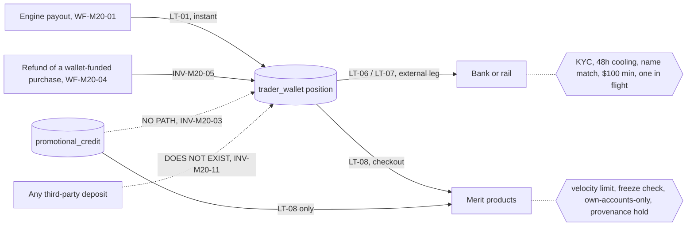
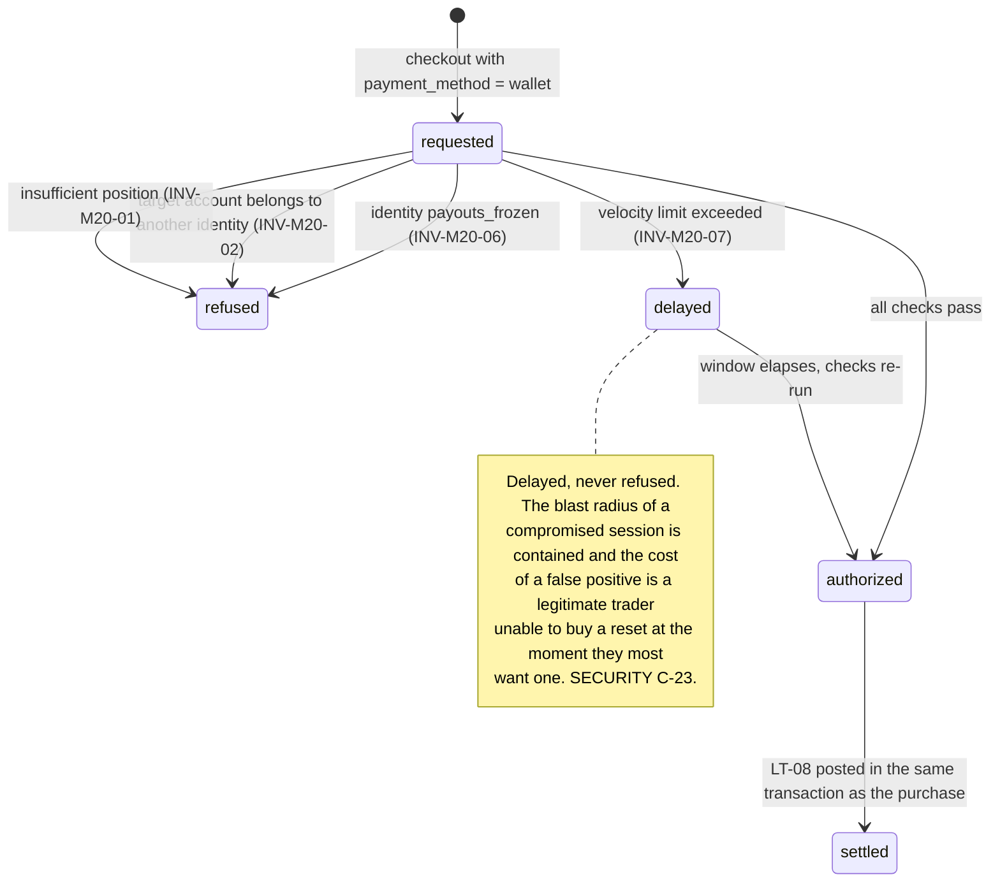
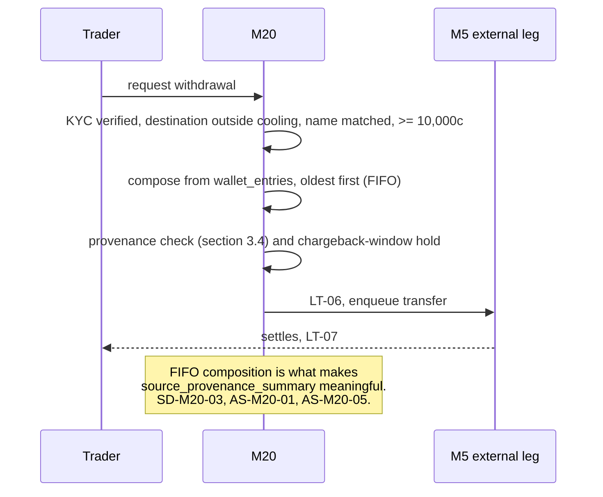
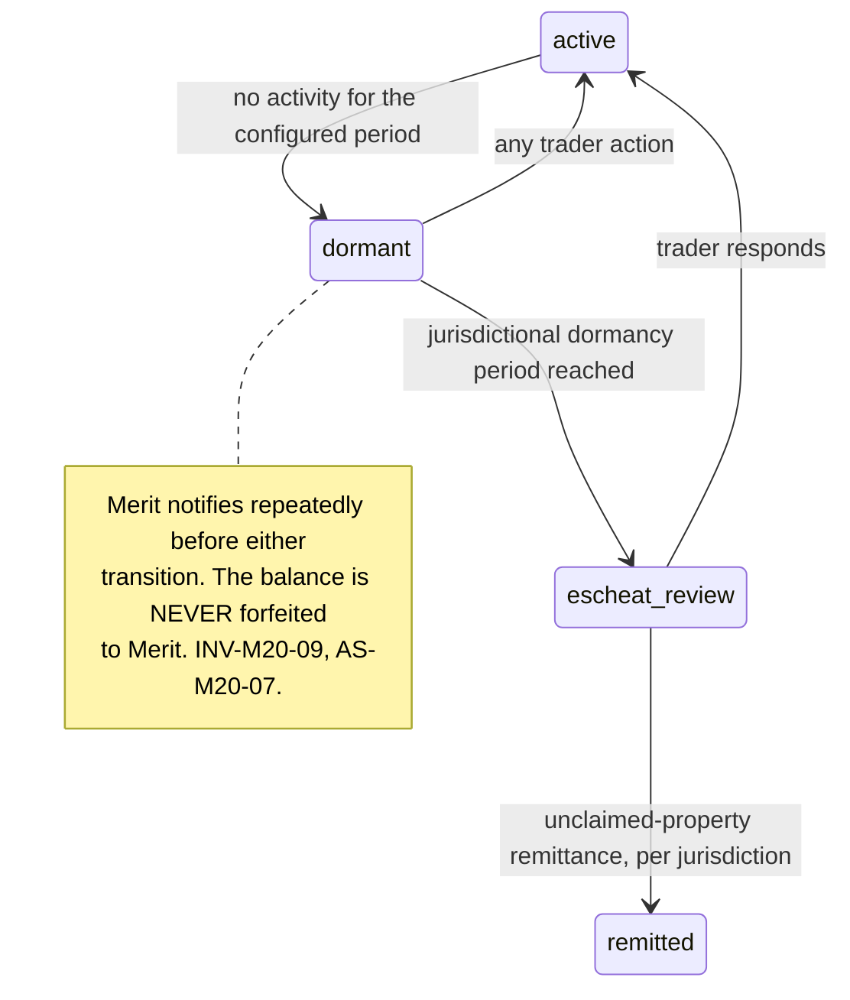

# M20: Merit Wallet

[ADR-019](../DECISIONS.md), Appendix B5's ten-section template, Appendix D4's payout-path hardening, and [SECURITY section 4.7](../architecture/SECURITY.md)'s wallet account-takeover blast-radius analysis. **Money path under [ADR-003](../DECISIONS.md)'s strict regime**, and the newest crown jewel in the estate.

[M05](M05-payout-system.md) owns both payout legs and this plan does not restate them. **M20 owns the wallet as an object**: what a balance is, what may enter it, what may leave it and by which route, and the fraud surface that exists only because one balance is simultaneously spendable inside Merit and withdrawable outside it.

One sentence governs this module: **the wallet has two exits, and every scenario in this plan is somebody using the exit that was not built for them.**

Cash leaves through the external leg, which carries KYC, destination cooling, name matching, and a minimum. Value leaves through checkout, which carries almost none of that because it was designed for a card. The gap between those two doors is this module's entire threat model, and the three fraud classes the founder named all live in it.

**Identifier conventions:** `INV-M20-nn` invariants, `SD-M20-nn` schema deltas, `WF-M20-nn` wallet flows, `FM-M20-nn` failure modes, `AS-M20-nn` adversarial scenarios, `OQ-M20-nn` open questions, `DEP-M20-nn` dependencies.

---

## 1. Purpose and invariants

### 1.1 What this module is

The `trader_wallet` ledger position per identity ([M05](M05-payout-system.md) SD-M5-07), the flows into and out of it, and the controls on each.

| ID | Flow | Direction | Owner of the mechanism | Control surface |
|---|---|---|---|---|
| WF-M20-01 | **Payout credit** (internal leg) | In | [M05](M05-payout-system.md), LT-01 | The engine's gates. Instant, irrevocable, atomic |
| WF-M20-02 | **External withdrawal** | Out, as cash | [M05](M05-payout-system.md), LT-06 and LT-07 | KYC verified, 48h destination cooling, name match, $100 minimum, one in flight |
| WF-M20-03 | **Checkout spend** | Out, as product | [M03](M03-billing-checkout.md), LT-08 | Velocity limit (C-23), and **this plan adds three more** |
| WF-M20-04 | **Refund credit** | In | [M03](M03-billing-checkout.md) | **Only for wallet-funded purchases** (INV-M20-05, AS-M20-03) |
| WF-M20-05 | **Correction** | Either | Admin, dual controlled | Compensating ledger entries only, never an update |

**`promotional_credit` is not in that table and that is the point.** It is a separate ledger class ([ADR-019](../DECISIONS.md), [M14](M14-loyalty-retention.md) INV-M14-10, [M17](M17-offers-engine.md) INV-M17-08) with no path to `trader_wallet` and no path to a withdrawal. Section 3.4 and AS-M20-01 explain why that separation, on its own, is not sufficient.

### 1.2 What a wallet balance is, stated precisely

[M05](M05-payout-system.md) INV-M5-14 already establishes the three limits: no interest, not transferable to another identity, never negative. This plan adds what it **is**, because the definition drives everything downstream.

**A wallet balance is money the trader has already earned, which has already cleared every gate, which Merit owes them unconditionally, and which they may take as cash or spend on Merit's products.** It is the most certain liability on the book ([M05](M05-payout-system.md) INV-M5-15), and it is the only balance in the system with two exits.

### 1.3 What this module is not

| Not M20 | Whose job | Why the boundary is here |
|---|---|---|
| The payout legs | [M05](M05-payout-system.md) | M5 owns the request pipeline, both settlements, the freeze path, and the transfer machinery. M20 owns the balance they move |
| Checkout | [M3](M03-billing-checkout.md) | M3 charges. M20 supplies the payment method and the constraints on using it |
| Promotional credit | [M17](M17-offers-engine.md) | Adjacent, separate, and constantly confused. Both appear at checkout and only one is money |
| Reserve and liability reporting | [M6](M06-admin-ops-console.md) | Wallet balances enter Open Liability and the RCR there ([M05](M05-payout-system.md) INV-M5-15) |
| Verification | [M19](M19-kyc-identity.md) | The external leg's gate is M19's state, read from Merit's database ([M19](M19-kyc-identity.md) INV-M19-08) |

### 1.4 Invariants

| ID | Invariant | Enforcement |
|---|---|---|
| INV-M20-01 | A wallet balance is **never negative**, and every debit is checked against the live position inside the same transaction | Ledger constraint plus a per-identity advisory lock. [M05](M05-payout-system.md) INV-M5-14 |
| INV-M20-02 | Wallet value may be spent **only on products for the spending identity's own accounts** | AS-M20-06. A wallet that can fund another identity's purchase is a transfer instrument with a checkout in front of it, which INV-M5-14 forbids |
| INV-M20-03 | **Promotional credit can never become wallet balance, and no chain of transactions may convert it into one** | AS-M20-01. The ledger separation blocks the direct route; the **provenance rule** in section 3.4 blocks the route through a funded account |
| INV-M20-04 | Every debit records its **cause and reference**, and every credit records its **provenance class** | SD-M20-01. A balance whose components are indistinguishable cannot be governed by any of the rules below |
| INV-M20-05 | A refund is returned to the **payment method that funded the purchase**, always. A card purchase never refunds to the wallet | AS-M20-03. Crossing rails converts card money into withdrawable cash and bypasses the card network's own protections |
| INV-M20-06 | A **payouts-frozen** identity cannot spend wallet value either | AS-M20-02. A freeze that stops the cash door and leaves the product door open is not a freeze |
| INV-M20-07 | Wallet spend carries a per-identity velocity limit, with excess **delayed rather than refused** | [SECURITY](../architecture/SECURITY.md) C-23, [M05](M05-payout-system.md) OQ-M5-06 |
| INV-M20-08 | Wallet balances are **segregated in reporting and in fact**, and the float is never treated as working capital | AS-M20-08. [ADR-019](../DECISIONS.md) says liquidity improves and liability does not, and this is the invariant that keeps the second half true |
| INV-M20-09 | A wallet balance is **payable on demand forever**, and dormancy never forfeits it | AS-M20-07. A forfeiture clause on money already earned is the single most brand-destroying term available to this firm |
| INV-M20-10 | Every wallet position reconciles: sum of credits minus sum of debits equals the ledger position, per identity, nightly | Extends [M05](M05-payout-system.md) INV-M5-04's zero-sum discipline to a per-identity assertion, because the wallet is where a per-identity error would hide |
| INV-M20-11 | The wallet is **not an account a third party can pay into**. There is no deposit, no top-up, and no funding from outside | AS-M20-04. The moment Merit accepts inbound money into a spendable, withdrawable balance, it is operating something quite different from what [ADR-019](../DECISIONS.md) approved |

---

## 2. Entities and schema deltas

M20 consumes [M05](M05-payout-system.md)'s approved SD-M5-06 (`wallet_withdrawals`) and SD-M5-07 (the `trader_wallet` ledger class), [M03](M03-billing-checkout.md)'s SD-M3-06 (wallet payment method), and LT-01, LT-06, LT-07, LT-08. Four deltas.

| ID | Table | Change | Why it is not optional |
|---|---|---|---|
| SD-M20-01 | new `wallet_entries` | `id`, `identity_id`, `direction`, `amount_cents`, `provenance check in ('payout','refund_wallet_funded','correction')`, `cause`, `reference_id`, `ledger_transaction_id`, `balance_after_cents`, `occurred_at` | INV-M20-04 and INV-M20-03. The ledger records the money and this records **what kind of money it is**. Without provenance, every rule in section 3.4 is unenforceable, because the system cannot tell a payout credit from a refund credit once both are in the same integer |
| SD-M20-02 | new `wallet_spend_limits` | `identity_id`, `daily_cents`, `rolling_7d_cents`, `reason`, `set_by`, `effective_from` | INV-M20-07 and [SECURITY](../architecture/SECURITY.md) C-23. Per identity rather than global, because the limit that matters is on the compromised session and a global limit either throttles legitimate traders or is set so high it does nothing |
| SD-M20-03 | `wallet_withdrawals` (extends [M05](M05-payout-system.md) SD-M5-06) | add `source_provenance_summary jsonb`, `earliest_credit_at` | AS-M20-01 and AS-M20-05. A withdrawal needs to know **what it is made of** and **how long that value has been in the wallet**, or the provenance rule and the chargeback-window hold have nothing to evaluate against |
| SD-M20-04 | new `wallet_dormancy` | `identity_id`, `last_activity_at`, `notified_at[]`, `state check in ('active','dormant','escheat_review')`, `jurisdiction_hint` | INV-M20-09 and AS-M20-07. Unclaimed-property obligations are jurisdictional and real, and the alternative to a state machine is discovering the obligation during an audit |

---

## 3. State machines

### 3.1 The two exits, drawn together

**The diagram is the plan.** The external door has four controls that took a whole module to build. The internal door had one, because it was designed as a payment method rather than as an exit. Sections 3.2 through 3.4 add the other three.

### 3.2 Spend authorization

### 3.3 External withdrawal, and what it is made of

### 3.4 The provenance rule, which is this module's central control

Wallet value is fungible in the ledger and **is not fungible in policy**. Three rules follow from `provenance` (SD-M20-01), and they are stated together because each one alone is defeated by a chain that uses the other two.

| Rule | Statement | Defeats |
|---|---|---|
| **P-1, no laundering through a product** | Value withdrawn is composed FIFO, and a withdrawal whose composition includes payout credits from accounts **purchased with promotional credit** is held for review rather than settled automatically | AS-M20-01, credit-to-cash conversion through a funded account |
| **P-2, rails do not cross** | A refund credits the wallet **only** when the refunded purchase was wallet funded (INV-M20-05) | AS-M20-03, card-to-cash arbitrage |
| **P-3, cash waits for the card to settle** | Payout credits from an account whose funding purchase is still inside the chargeback window are withdrawable only after that window closes | AS-M20-05, the funded account paid for by a payment that comes back |

**P-1 needs its own sentence, because it is the only rule here that is a hold rather than a block.** Promotional credit legitimately buys evaluations, and an honest trader who wins one has earned the payout. The rule does not confiscate it; it routes the withdrawal to review, once, on the first withdrawal containing such value, so that a genuine winner is paid after a look and a farm is visible before cash leaves. **Spending that value inside Merit is unaffected**, which keeps the honest case frictionless in the place traders actually feel it.

### 3.5 Dormancy

---

## 4. API endpoints touched

| Endpoint | M20's role | Notes |
|---|---|---|
| `GET /wallet` | Shares with [M5](M05-payout-system.md) | Approved in [M05](M05-payout-system.md) section 4. Balance, the two directions, and the honest statement of what a balance is. M20 adds **withdrawable-now versus held**, with the reason for any hold (P-1, P-3) |
| `POST /wallet/withdrawals` | Shares with [M5](M05-payout-system.md) | [M05](M05-payout-system.md) owns the external leg. M20 adds FIFO composition, `source_provenance_summary`, and the provenance evaluation |
| `POST /checkout` | Consumes | [M3](M03-billing-checkout.md)'s, with `payment_method = wallet`. M20 supplies section 3.2's authorization |
| `GET /wallet/entries` **NEW** | Owns | The itemized ledger with provenance and running balance. Session scoped, cursor paginated |
| `POST /admin/wallet/:identityId/correct` **NEW** | Owns | Compensating entries only, **dual controlled**, reason required. There is no update path and no delete path |
| `POST /admin/wallet/:identityId/spend-limit` **NEW** | Owns | SD-M20-02. Reason required, audited |
| `GET /admin/wallet/reconciliation` **NEW** | Owns | INV-M20-10's per-identity assertion, and the float position for [M6](M06-admin-ops-console.md) |

---

## 5. Events emitted and consumed

[M05](M05-payout-system.md) already defines `wallet.credited`, `wallet.debited`, and the `wallet.withdrawal_*` family. M20 adds six.

| Event | When | Notes |
|---|---|---|
| `wallet.spend_delayed` **NEW** | velocity limit exceeded | `{ identity_id, amount_cents, limit_kind, retry_at }`. Consumers: RISK, NOTIF, FEED. A burst of these on one identity is the ATO signature |
| `wallet.spend_refused` **NEW** | frozen, cross-identity, or insufficient | `{ identity_id, reason }`. Consumers: RISK, FEED. **A cross-identity attempt is high severity**, because there is no legitimate reason to make one (AS-M20-06) |
| `wallet.withdrawal_held` **NEW** | P-1 or P-3 | `{ withdrawal_id, rule, provenance_summary, expected_release }`. Consumers: ALERT, NOTIF, FEED. The trader is told which rule and when it clears |
| `wallet.provenance_anomaly` **NEW** | a composition pattern matches a farming or laundering signature | `{ identity_id, pattern, window }`. Consumers: ALERT, RISK, EVID |
| `wallet.reconciliation_failed` **NEW** | INV-M20-10's nightly per-identity assertion fails | `{ identity_id, expected, actual }`. **Pages**, and it is an [ADR-016](../DECISIONS.md) scoped-halt input |
| `wallet.dormancy_changed` **NEW** | section 3.5 transitions | `{ identity_id, state }`. Consumers: NOTIF, FEED, and the legal calendar |

**Consumed:** `payout.approved` and the internal-leg settlement, `purchase.charged_back` and `purchase.refunded`, `flag.status_changed` and `identity.payouts_frozen`, `kyc.verified` and `kyc.expired`, and `offer.redeemed` (to record that an account was bought with promotional credit, which is P-1's input).

---

## 6. Failure modes

| ID | Failure | Blast radius | Detection | Recovery |
|---|---|---|---|---|
| FM-M20-01 | Concurrent debits overdraw a balance | Merit pays out money that was already spent | Position check inside the transaction, per-identity advisory lock | INV-M20-01. Structurally prevented, and asserted by a concurrency test rather than assumed |
| FM-M20-02 | Promotional credit reaches cash through a funded account | A marketing instrument becomes withdrawable money at scale | Provenance composition (SD-M20-01), P-1 | Hold for review on first such withdrawal. AS-M20-01 |
| FM-M20-03 | A frozen identity spends the balance the freeze was about | The freeze protected the cash door and left the product door open | Freeze checked at spend authorization (INV-M20-06) | AS-M20-02 |
| FM-M20-04 | A card purchase refunds to the wallet | Card money becomes withdrawable cash, bypassing the card network's protections | Refund routing asserted by the funding method (INV-M20-05) | AS-M20-03 |
| FM-M20-05 | A wallet-funded account pays out, then the funding card charges back | Cash left on a payment that came back | `earliest_credit_at` and the funding purchase's window (SD-M20-03), P-3 | Hold until the window closes. AS-M20-05 |
| FM-M20-06 | A compromised session spends the balance | Real loss to a real victim, contained inside Merit's books | Velocity limits, spend pattern, `wallet.spend_delayed` bursts | Delay rather than refuse (C-23); reversal is a ledger entry. [SECURITY](../architecture/SECURITY.md) §4.7 |
| FM-M20-07 | Wallet value funds another identity's account | The wallet is a transfer instrument, which INV-M5-14 forbids | Target-account ownership check (INV-M20-02) | Refuse and flag at high severity. AS-M20-06 |
| FM-M20-08 | Dormant balance forfeited or quietly retained | Either a brand catastrophe or an unclaimed-property violation | Dormancy state machine (SD-M20-04) | Never forfeit (INV-M20-09); remit per jurisdiction. AS-M20-07 |
| FM-M20-09 | Float treated as working capital | The firm spends money it owes, and the RCR stops meaning anything | Segregation, reconciliation, and float reported separately (INV-M20-08) | AS-M20-08 |
| FM-M20-10 | Per-identity position diverges from the ledger | A wallet-shaped hole, invisible in a global sum that still balances | Nightly per-identity assertion (INV-M20-10) | `wallet.reconciliation_failed` pages and scopes a halt per [ADR-016](../DECISIONS.md) |

---

## 7. Adversarial scenarios

**Eight listed, eight novel.** The first three are the classes the founder named.

### AS-M20-01: Bonus-credit farming, or promotional credit laundered into cash through a funded account (NOVEL)

**Attack.** [ADR-019](../DECISIONS.md) and [M14](M14-loyalty-retention.md) INV-M14-10 separate `promotional_credit` from `trader_wallet` with no path between them, and [M17](M17-offers-engine.md) INV-M17-08 asserts it again. That closes the **direct** route and leaves the product open as an indirect one:

1. Accumulate promotional credit through whatever mechanic issues it: a campaign, a loyalty grant, a reset promotion.
2. Spend the credit on an evaluation. Credit is spendable at checkout, which is the entire point of it.
3. Pass the evaluation, or buy Direct, which funds immediately.
4. Take a payout. It credits the **wallet**, which is real money.
5. Withdraw to a bank.

**Promotional credit has become cash**, through five entirely legitimate steps, and every ledger entry along the way is correct. The separation of ledger classes was necessary and is not sufficient, because the product itself is the converter.

**The economics, which decide whether this is a nuisance or a hole.** The conversion is not free: the operator must pass an evaluation, which most attempts do not. At a 15 percent pass rate the expected conversion is poor for a lone trader. It is entirely different for someone farming credit at volume, and it is **excellent for a hedged pair**, because a hedge converts a probabilistic pass into a near-certain one. A ring that can reliably pass evaluations has, in effect, a machine that turns promotional credit into withdrawable cash at a high conversion rate, and the promotional budget becomes an extraction surface nobody modelled. Layer [M14](M14-loyalty-retention.md) AS-M14-02's observation on top, that a hedged pair earns loyalty streaks by construction, and the credit supply feeding this machine is itself partly automated.

**Counter, and it is a hold rather than a block, because most of this population is honest.**
1. **Provenance on every entry** (SD-M20-01, INV-M20-04), and provenance on the **funding purchase** of every account, recorded from `offer.redeemed`.
2. **P-1** (section 3.4): a withdrawal composed FIFO whose contents include payout credits from accounts purchased with promotional credit is **held for review on first occurrence**, not confiscated. A genuine winner is paid after a look; a farm is visible before cash leaves.
3. **Spending that value inside Merit is unaffected.** The honest trader who won on a promotional evaluation and buys another one feels nothing, which is where the friction would have cost most.
4. **`wallet.provenance_anomaly` watches the pattern rather than the instance**: many accounts funded by credit, under linked identities, converting at rates far above the population. That is a [M7](M07-risk-abuse.md) input and it composes with D-02 and D-03.
5. **The promotional budget is capped per identity and per resolved entity**, which is [M17](M17-offers-engine.md)'s issuance discipline, and it is the upstream control that makes this bounded regardless of the conversion rate.
6. **The residual is stated:** a genuinely skilled trader who wins on a promotional evaluation converts credit to cash, legitimately, and should. This scenario bounds and observes that; it does not prevent it, and preventing it would mean promotions that cannot be won with. EC-132, GS-222.

### AS-M20-02: Spend-back, or laundering flagged funds through the product door (NOVEL)

**Attack.** [M05](M05-payout-system.md)'s freeze path and Appendix D4's destination controls all guard the **external** leg. The wallet has a second exit that none of them touch. An identity whose withdrawals are frozen, whose destination is inside its 48 hour cooling window, or whose KYC has expired simply **spends** the balance at checkout.

**Why the value does not merely sit there.** Spending converts a frozen balance into **accounts**, and accounts produce payouts, which credit the wallet again, in a position that may by then be unfrozen, on an account with no freeze of its own. [SECURITY section 4.7](../architecture/SECURITY.md) reasons that internal spend is the contained failure mode because it "never leaves Merit's books and is fully reversible by ledger entry", which is true of the spend and **not true of what the spend buys**. A frozen $5,000 becomes five evaluations, which become funded accounts, which become fresh unfrozen wallet credits. The freeze bought a delay and a change of clothes.

**And the ATO version.** [SECURITY section 4.7](../architecture/SECURITY.md) also reasons that external theft stays slow and detectable while internal spend is contained. An attacker who cannot withdraw can still convert the victim's balance into accounts, and if those accounts can be traded and paid out, the containment claim weakens considerably. AS-M20-06 closes the worst version of this and the general one remains.

**Counter.**
1. **A payouts-frozen identity cannot spend either** (INV-M20-06). The freeze covers both exits, because a freeze that covers one is not a freeze. This is the module's most important single line.
2. **The same applies to every context gate that blocks the external leg**: expired KYC, `recon_blocked`, and an active restriction all block spend as well as withdrawal. The rule is that the wallet's two doors share their context gates even though they differ in their mechanical ones.
3. **The velocity limit is a rate control and not a freeze substitute** (INV-M20-07). Conflating them would leave a frozen identity able to drain slowly, which is the same attack with patience.
4. **Accounts purchased while an identity was under any hold are marked**, and their eventual payouts carry that provenance into P-1's review path, so the laundering chain does not launder the provenance along with the value. EC-133, GS-223.

### AS-M20-03: Refund-to-wallet arbitrage (NOVEL)

**Attack.** Refunding to the wallet is an obviously good product decision: it is instant, it avoids card-network delay, and traders like it. It also builds a **rail crossing**, and the rail crossing is the attack. Buy an evaluation with a card. Request a refund inside [M3](M03-billing-checkout.md)'s window (pre-first-trade). Receive the refund as **wallet balance**. Withdraw it to a bank.

**What has happened.** Card money has become bank money, through Merit, with none of the card network's protections and none of the checks a payment processor applies to a cash-out. For a stolen card this is a clean extraction path that leaves Merit holding the eventual chargeback, and it is materially more attractive than the existing stolen-card pattern in [dossier item 7](../../research/ADVERSARY_DOSSIER.md), because that one has to pass an evaluation first and this one does not. It is also, in substance, unlicensed money movement, which is a compliance exposure quite apart from the loss.

**And the version that is not fraud at all and is still bad.** A legitimate trader refunds to the wallet and withdraws, and Merit has processed a card payment and a bank payout with no product delivered. That pattern is exactly what a processor's risk team looks for, and [M3](M03-billing-checkout.md)'s MID health is a named business risk with a 0.65 percent chargeback threshold behind it.

**Counter, and it is absolute rather than graduated.**
1. **A refund returns to the payment method that funded the purchase, always** (INV-M20-05, P-2). A card purchase refunds to the card. A wallet-funded purchase refunds to the wallet. **The rails never cross**, in either direction.
2. **This is asserted by test on every refund path**, including partial refunds, chargeback reversals, and admin-initiated corrections, because the exception will be requested for a sympathetic support case and the answer needs to already exist.
3. **The convenience argument is answered honestly**: refunds are rare (the window is pre-first-trade only) and the delay is the card network's. Trading a rare inconvenience for a laundering path is not a close call.
4. **`wallet.provenance_anomaly` covers the residual**: an identity whose purchase-and-refund rate is far above the population is a signal regardless of where the refund went. EC-134, GS-224.

### AS-M20-04: The wallet becomes a deposit account by accretion (NOVEL)

**Attack.** Nobody proposes operating a payment institution. What gets proposed, in order, each reasonable: let traders **top up** the wallet so they can buy faster; let a trader's **employer or backer** fund it; let a wallet balance be **sent to another trader** as a gift or a split; pay a small **return** on idle balances to encourage traders to leave money in. [ADR-019](../DECISIONS.md) already rejected interest and peer-to-peer transfer "outright, see the legal note", and it did not reject top-ups, because nobody had proposed them yet.

**Why the line matters so much.** A balance that only ever receives money the customer already earned, and only ever pays it back or spends it on the issuer's own products, is a **payable**. A balance that accepts inbound funds from the customer or a third party, holds them, and pays them out, is stored value, and depending on the jurisdiction that is money transmission or e-money, with licensing, safeguarding, and reporting obligations that no document in this corpus contemplates. **Merit's whole compliance posture assumes the first thing.** And a top-up feature would arrive as a checkout convenience with an engineering ticket, not as a regulatory decision, which is exactly how firms end up operating unlicensed.

**Counter.**
1. **No deposit, no top-up, no third-party funding, ever** (INV-M20-11). There is no endpoint, no payment method, and no admin path. This is the module's hardest boundary and it is enforced by the absence of a mechanism.
2. **The only credits are WF-M20-01 payouts, WF-M20-04 refunds of wallet-funded purchases, and WF-M20-05 corrections** (section 1.1). That list is closed, is asserted by the `provenance` check constraint, and adding a value to it is a schema change that surfaces in a money-path migration review.
3. **No interest and no peer-to-peer**, per [ADR-019](../DECISIONS.md), unchanged, and now with the reason recorded in the same place as the rest of the boundary.
4. **A counsel item is filed in [legal/](../legal/README.md)** confirming that a payable of this shape is not a regulated stored-value product in Merit's operating jurisdictions, before launch rather than after. [ADR-019](../DECISIONS.md) already flagged a wallet counsel-review item; this scenario states precisely which question it must answer. EC-135, GS-225.

### AS-M20-05: The payout funded by a payment that came back (NOVEL)

**Attack.** B4 #10 pins the chargeback that lands after a settled payout: the identity nets negative, the account closes, and the ledger shows the firm's loss honestly. The wallet adds a **timing** dimension that pin does not cover. A trader buys with a stolen card, passes quickly, takes a payout to the wallet, and withdraws to a bank. Weeks later the chargeback lands. Merit has already sent real cash out of the building on an account funded by a payment that was reversed, and B4 #10's honest accounting records a loss rather than preventing one.

**Why the wallet makes this sharper rather than softer.** Under the pre-wallet design the whole cycle ran on the external rail's timing: request, approve, transfer, settle, which took days and made the fast version harder. [ADR-019](../DECISIONS.md) deliberately compressed the cycle: Merit Rapid is a 3 trading day cycle and the wallet credit is instant. The improvement is real and it also compresses the attacker's cycle by exactly the same amount, and the attacker's cycle is the one racing the chargeback window.

**The arithmetic.** A Direct plan funds immediately, so no evaluation is needed at all. A $99 purchase on a stolen card, on a plan whose first payout can arrive within days, against a chargeback window measured in weeks or months, is a very favourable trade for the attacker. It is also, at volume, a MID health event: [M3](M03-billing-checkout.md)'s 0.65 percent threshold is the processor relationship, and this pattern damages it while extracting cash.

**Counter.**
1. **P-3** (section 3.4): payout credits from an account whose **funding purchase is still inside the chargeback window** are spendable inside Merit but not withdrawable until that window closes. `earliest_credit_at` and the funding purchase's status make this computable (SD-M20-03).
2. **The honest cost is stated:** this delays cash for legitimate fast winners on newly purchased accounts, which is a real product cost on exactly the plan ([Direct](../GLOSSARY.md#direct-instant-funded)) whose selling point is speed. It is bounded, it is disclosed at purchase, and the trader can still **spend** the value immediately, so the promise that they were paid remains true and only the bank leg waits.
3. **The window is the card network's, not one Merit invents**, and it is shortened by the strongest available signal: a purchase whose payment has aged past the practical dispute rate for its method releases early. This is a configuration value informed by real chargeback timing rather than a fixed maximum.
4. **[M19](M19-kyc-identity.md)'s placement interacts here directly.** Under `direct_purchase`, which INV-M19-02 makes mandatory for Direct, the buyer is verified at purchase, which is the strongest single mitigation available for this scenario and is already required for independent reasons.
5. **AVS and CVV strictness, velocity per BIN, and [M7](M07-risk-abuse.md) D-08** remain the upstream controls ([dossier item 7](../../research/ADVERSARY_DOSSIER.md)). P-3 is the last line, not the first. EC-136, GS-226.

### AS-M20-06: The wallet as a transfer instrument with a checkout in front of it (NOVEL)

**Attack.** [M05](M05-payout-system.md) INV-M5-14 forbids transferring a wallet balance to another identity, and that is enforced by there being no transfer endpoint. Checkout is a transfer endpoint that nobody labelled as one. If wallet value can pay for a purchase whose resulting account belongs to a different identity, then A can fund B, and the wallet is transferable through the product.

**Three uses, and the third is the one that makes it urgent.**
- **A ring pools value.** Members' wallets fund a designated operator's accounts, which is [dossier item 6](../../research/ADVERSARY_DOSSIER.md)'s fleet economics with the funding problem solved.
- **A paid-passing service gets paid in wallet value**, which is untraceable through the card rails and invisible to [M8](M08-affiliate-system.md)'s attribution ([dossier item 3](../../research/ADVERSARY_DOSSIER.md)).
- **An account takeover becomes profitable without ever touching the external leg.** [SECURITY section 4.7](../architecture/SECURITY.md)'s containment argument rests on internal spend staying inside Merit's books and being reversible. If the attacker can spend the victim's balance on **their own** accounts, the value has moved to an identity Merit does not control, and reversing the ledger entry does not bring it back once those accounts have traded. This is the single largest hole the wallet could have, and it exists entirely in the gap between "spend" and "transfer".

**Counter.**
1. **Wallet value may only buy products for the spending identity's own accounts** (INV-M20-02). The target account's ownership is resolved server side and compared to the paying identity, in the same transaction as the debit.
2. **A cross-identity spend attempt is a high-severity flag, not a validation error** (`wallet.spend_refused`), because there is no legitimate reason to make one. A trader cannot construct this request by accident through the UI, so an attempt is evidence.
3. **Gifting is not a feature and will be requested.** The answer is recorded in advance: a gift is a transfer, a transfer is prohibited by INV-M5-14, and the reason is legal as well as anti-abuse ([ADR-019](../DECISIONS.md)'s rejection of peer-to-peer, AS-M20-04).
4. **This tightens [SECURITY section 4.7](../architecture/SECURITY.md)'s containment claim into something true**: internal spend is contained **because** it can only ever buy the victim's own products, which are recoverable by ledger entry and by closing the accounts. Without INV-M20-02 the containment claim was aspirational. EC-137, GS-227.

### AS-M20-07: The dormant balance nobody may keep (NOVEL)

**Attack.** No attacker. A trader breaches, gets discouraged, and stops logging in with $420 in their wallet. Multiply by an attrition rate over years. Merit is holding money it owes to people who have stopped asking for it, and three responses are available, two of which are wrong.

**Expiring it is the worst option available to this firm specifically.** A forfeiture clause on money the trader already earned, already cleared every gate for, and which Merit's own product describes as "already yours" ([M04](M04-trader-portal.md) SC-M4-10) would be the single most brand-destroying term Merit could write. It would appear in every review, it would be quoted next to the transparency page, and it would be indistinguishable from the payout-denial behaviour the firm defines itself against.

**Holding it forever is also wrong**, and this is the part that gets missed: unclaimed-property law in most US states, and equivalents elsewhere, requires holders of abandoned property to attempt contact and then **remit to the state** after a dormancy period. It is a real, audited obligation with penalties, it applies to exactly this kind of payable, and it is jurisdictional, so the answer depends on the trader's address.

**Counter.**
1. **Never forfeited to Merit** (INV-M20-09). The balance is payable on demand forever, and there is no expiry mechanism to misuse.
2. **A dormancy state machine with escalating contact** (section 3.5, SD-M20-04), starting well before any jurisdictional deadline, using [M16](M16-notification-center.md)'s security-class channels including prior contacts, because a dormant trader is by definition one whose current contact may be stale.
3. **Escheatment is a legal calendar item with a jurisdiction hint recorded**, so the obligation is tracked per trader rather than discovered in an audit. A counsel item is filed in [legal/](../legal/README.md).
4. **The dormancy policy is published** in plain words: Merit never takes a wallet balance, contacts the trader repeatedly, and where the law requires it, remits to the state, where the trader can still claim it. That is a genuinely good story and it costs nothing to tell.
5. **The float is reported separately** (INV-M20-08), because dormant balances are the most stable part of it and therefore the most tempting to treat as capital. EC-138, GS-228.

### AS-M20-08: The float that stops looking like a liability (NOVEL)

**Attack.** The adversary is the firm's own balance sheet. [ADR-019](../DECISIONS.md) is explicit that the wallet improves **liquidity** while leaving **liability** unchanged, and that wallet balances join Open Liability and the reserve coverage ratio. As the wallet grows, a large, stable, non-interest-bearing pool of cash sits in Merit's accounts, and every quarter it does not move. The pressure is not a decision to misappropriate it; it is a slow reframing, in which the float becomes "our cash position", then working capital, then the thing that funds a marketing push in a slow month.

**Why it is fatal rather than merely aggressive.** The RCR is the control that pauses sales ([M05](M05-payout-system.md) INV-M5-12, FM-M5-06) and it is computed as reserve over `CVaR99 at rho = 0.30`. If wallet balances are counted as reserve **and** owed as liability, the ratio flatters itself with the same money on both sides, and the breaker stops meaning anything at exactly the moment it matters: a wave of withdrawals is simultaneously the event that draws down the float and the event the reserve exists for. The [batch 1 gate's conservatism ruling](../DECISIONS.md) put operational conservatism in the RCR breaker at 1.0, and this is the mechanism by which that number quietly becomes fictional.

**Counter.**
1. **Segregation in fact and in reporting** (INV-M20-08). Wallet balances are held in the payout wallet's segregated position, are reported as a distinct line, and are **never** counted toward reserve. [M06](M06-admin-ops-console.md)'s liability dashboard shows float and reserve as separate figures with the RCR computed from reserve alone.
2. **The reserve is measured against a live rail balance** ([M05](M05-payout-system.md) SD-M5-03, INV-M5-11), which is what stops a ratio computed from Merit's own ledger from agreeing with itself.
3. **The float's own coverage is reported**: what proportion of wallet balances could be withdrawn today if every eligible trader asked. That is a different question from the RCR and it is the one a float creates.
4. **`wallet.reconciliation_failed` and the nightly per-identity assertion** (INV-M20-10) keep the float's composition honest, because a float whose per-identity sum diverges from the ledger is a shortfall that a global zero-sum check would not see.
5. **This is recorded as a governance item rather than an engineering one**, because the failure is a decision made over months by people who each believed they were being reasonable, and the only real control is that the number is published internally every month with the same words on it. GS-229.

---

## 8. Test plan

### 8.1 Suites

| Suite | Prefix | Count | Runs | Blocks |
|---|---|---|---|---|
| Balance integrity: never negative, concurrent debits, advisory locking | `M20-B-nn` | 10 | every commit | merge |
| Provenance: FIFO composition, P-1, P-2, P-3 | `M20-P-nn` | 14 | every commit | merge |
| Spend authorization: freeze, ownership, velocity, insufficient | `M20-S-nn` | 12 | every commit | merge |
| Refund routing (negative: card never refunds to wallet, on every refund path) | `M20-R-nn` | 9 | every commit | merge |
| Credit-source closure (negative: no deposit, top-up, or third-party funding path exists) | `M20-C-nn` | 7 | every commit | merge |
| Ledger integration: LT-01, LT-06, LT-07, LT-08 zero-sum and class separation | `M20-L-nn` | 9 | every commit | merge |
| Dormancy state machine and notification escalation | `M20-D-nn` | 6 | every commit | merge |
| Segregation and float reporting (negative: float never enters RCR) | `M20-F-nn` | 5 | every commit | merge |
| Per-identity reconciliation | `M20-X-01` | 1 | nightly | page |
| Concurrency: simultaneous withdrawal and spend against one balance | `M20-K-01` | 1 | every commit | merge |
| Golden fixtures | `GS-nnn` | 10 owned (GS-222 to GS-231) | every commit | merge |

### 8.2 Named scenarios owned by this module

| ID | Scenario | Pins |
|---|---|---|
| GS-222 | Promotional credit buys an evaluation that passes and pays out | The payout credits the wallet normally; the **first withdrawal containing that value is held for review**, not confiscated; spending it inside Merit is unaffected. AS-M20-01 |
| GS-223 | A payouts-frozen identity attempts a wallet-funded purchase | **Refused.** The freeze covers both exits, and expired KYC, `recon_blocked`, and restriction do the same. AS-M20-02 |
| GS-224 | A card-funded purchase is refunded | Refund returns **to the card**, on every refund path including partial and admin-initiated. A wallet-funded purchase refunds to the wallet. AS-M20-03 |
| GS-225 | Every conceivable inbound funding attempt | No deposit, top-up, or third-party funding path exists; the `provenance` constraint rejects any other credit class. AS-M20-04 |
| GS-226 | Direct purchase, fast payout, then the funding card charges back | The withdrawal was **held** until the chargeback window closed; the value was spendable inside Merit throughout. AS-M20-05, extends GS-039 |
| GS-227 | Wallet spend targeting an account owned by another identity | **Refused and flagged at high severity**, resolved server side in the debit transaction. AS-M20-06 |
| GS-228 | A balance reaches the jurisdictional dormancy period | Escalating contact through security-class channels including prior contacts; **never forfeited**; remitted per jurisdiction. AS-M20-07 |
| GS-229 | Reserve coverage computed while wallet float is large | Float is excluded from reserve, reported separately, and the RCR is computed from reserve alone against a live rail balance. AS-M20-08 |
| GS-230 | Simultaneous withdrawal and checkout spend against one balance | Exactly one succeeds where the balance covers only one; the position never goes negative. INV-M20-01, FM-M20-01 |
| GS-231 | Per-identity reconciliation with a global ledger that still balances | The per-identity assertion **fails and pages** even though the global sum is zero. INV-M20-10, [ADR-016](../DECISIONS.md) |

### 8.3 Coverage rule

**Every path that credits or debits a wallet position has a property test asserting the position never goes negative and the ledger transaction sums to zero, and every credit path is enumerated against the closed `provenance` list.** The module's characteristic failure is a new way in or out that nobody classified, so the enumeration is the test.

---

## 9. Observability

### 9.1 Metrics

| Metric | Why it matters |
|---|---|
| Total wallet float, and its distribution across identities | INV-M20-08. The concentration matters as much as the total, because a few large balances are a different liquidity profile from many small ones |
| Withdrawal rate: share of credited value withdrawn within 7, 30, and 90 days | The behavioural assumption [ADR-019](../DECISIONS.md)'s liquidity claim rests on, measured rather than assumed |
| Spend rate: share of credited value spent at checkout | The other half, and the input to whether the wallet is a payout mechanism or a closed-loop currency |
| Withdrawals held by rule (P-1, P-3), count and median duration | AS-M20-01 and AS-M20-05. A rising median is a bounded control becoming an unbounded one, which is [M05](M05-payout-system.md) AS-M5-04's pattern |
| `wallet.spend_delayed` bursts per identity | The account-takeover signature, and the tuning input for C-23's limits |
| Cross-identity spend attempts | Should be zero. Any occurrence is evidence, not noise |
| Purchase-and-refund rate per identity | AS-M20-03's residual, independent of where the refund went |
| Per-identity reconciliation failures | Zero, always. INV-M20-10 |
| Dormant balance total and count by dormancy stage | AS-M20-07's legal exposure, and the least-liquid part of the float |
| Float coverage: proportion withdrawable today if every eligible trader asked | AS-M20-08's question, which the RCR does not answer |

### 9.2 Alerts

| Alert | Threshold | Severity |
|---|---|---|
| Wallet position negative | any | **page**. INV-M20-01 regressed |
| Per-identity reconciliation failure | any | **page**, and it scopes a halt per [ADR-016](../DECISIONS.md) |
| Cross-identity spend attempt | any | **page** to risk |
| Refund routed to a wallet from a non-wallet-funded purchase | any | **page**. The rails crossed |
| A credit posted with a provenance outside the closed list | any | **page**. A new way in exists |
| Held withdrawal older than its expected release | any | **page**. A hold is becoming a freeze |
| Spend delayed burst on one identity | above threshold | **page** to risk. Likely account takeover |
| Float counted toward reserve in any computed RCR | any | **page**. AS-M20-08's mechanism |

### 9.3 Dashboard

M20 supplies the float panel on [M6](M06-admin-ops-console.md): total float, its concentration, withdrawal and spend rates, holds by rule, and dormancy stages, **with reserve and float rendered as visibly separate figures**. **If only one number could be shown it would be float coverage**, because it is the only number that answers what happens if the wallet's convenience is tested all at once.

---

## 10. Open questions for the founder

**OQ-M20-01. Is P-1's hold-for-review the right treatment of promotional-credit-derived winnings?** AS-M20-01 shows the ledger separation is necessary and not sufficient, and that a ring able to pass evaluations reliably converts promotional credit to cash at a high rate. The alternatives are worse: blocking the withdrawal punishes honest winners, and doing nothing makes the promotional budget an extraction surface. Proposed: **hold on first occurrence, review once, release**, with the pattern watched at the cohort level. The founder should confirm they are willing to have a small number of legitimate withdrawals reviewed, because that is the cost.

**OQ-M20-02. How long is P-3's chargeback-window hold, and is the product cost acceptable on Direct?** AS-M20-05's counter delays the bank leg for fast winners on newly purchased accounts, which lands hardest on the plan whose selling point is speed. Proposed: **hold until the funding purchase ages past the configured dispute-risk window**, informed by real chargeback timing rather than a fixed maximum, with the value spendable inside Merit throughout and the hold disclosed at purchase. The disclosure is the part that makes it survivable.

**OQ-M20-03. RULED at the batch 2 gate: proceed on the payable-balance framing, with a named invariant.** **`INV-WALLET-NO-DEPOSITS`: wallet funds originate only from payouts, promotional credit, and refunds. No external loading, ever, without a new ADR and counsel sign-off.** The closed credit list **excludes deposits explicitly** rather than merely omitting them, because an omission is a gap someone eventually fills and an exclusion is a decision someone has to reverse in writing. Counsel confirmation is **counsel packet item 2** and is still wanted before launch; the framing proceeds meanwhile. The original question is preserved below.

**OQ-M20-03 (as asked). Counsel confirmation that the wallet is a payable and not a regulated stored-value product.** [ADR-019](../DECISIONS.md) flagged a wallet counsel item and AS-M20-04 states the precise question: does a balance that receives only earned funds and refunds of its own spend, pays no interest, permits no transfer, accepts no deposit, and is payable on demand, avoid money-transmission or e-money characterization in Merit's operating jurisdictions? **This should be answered before launch**, because the answer may add a condition rather than a prohibition, and conditions are cheap in advance.

**OQ-M20-04. RULED: dormancy tracking and the 12-month notice schedule are designed now, in v1.** Retrofitting a notice schedule onto balances that have already gone quiet means reconstructing when they went quiet, which is the kind of archaeology that produces a compliance answer nobody can defend. **Escheatment state-mapping is counsel packet item 3**: trigger dates vary by jurisdiction and the mapping belongs on a calendar. The published policy stating Merit never keeps a balance stands. The original question is preserved below.

**OQ-M20-04 (as asked). What is the dormancy policy, and has escheatment been mapped?** AS-M20-07 establishes that forfeiture is unacceptable and indefinite holding is non-compliant. Proposed: **contact escalation starting at 12 months of inactivity, escheatment tracked per jurisdiction, published policy stating Merit never keeps a balance.** The mapping is a legal task and the trigger dates vary by state, so it needs to be on the calendar rather than in someone's memory.

**OQ-M20-05. Should wallet spend on evaluations be encouraged at all?** There is a strategic question underneath this module that nobody has asked: a wallet that traders spend back into evaluations is a closed-loop currency with excellent unit economics and a slightly uncomfortable story, because the firm's revenue then partly comes from recycling its own payouts. Merit's transparency position may be better served by making withdrawal the obvious default and spend the convenience, rather than the reverse. Proposed: **no discount, no incentive, and no nudge toward wallet spend**, ever, and the withdrawal path is at least as prominent as the spend path in [M04](M04-trader-portal.md) SC-M4-10. Recommendation is to record this as a design principle now, because the incentive to erode it will arrive with the first slow month.

---

### Dependencies on other modules

| ID | Dependency | Owner | Consequence if unmet |
|---|---|---|---|
| DEP-M20-01 | M5 owns both payout legs, the freeze path, and the transfer machinery, and exposes freeze state at spend time | M5 | INV-M20-06 cannot evaluate and AS-M20-02's product door stays open |
| DEP-M20-02 | M3 resolves target-account ownership server side and posts LT-08 in the purchase transaction | M3 | INV-M20-02 fails, and the wallet becomes a transfer instrument (AS-M20-06) |
| DEP-M20-03 | M3 records the funding method and the chargeback-window state of every purchase | M3 | P-2 and P-3 have no input, and two of the three founder-named fraud classes are unaddressable |
| DEP-M20-04 | M17 records that an account was purchased with promotional credit, via `offer.redeemed` | M17 | P-1 has no provenance to compose against |
| DEP-M20-05 | M19's verified state is readable from Merit's database at withdrawal time | M19 | Either the external leg is unverified or a provider outage blocks payouts ([M19](M19-kyc-identity.md) INV-M19-08) |
| DEP-M20-06 | M6 renders float and reserve as separate figures and computes the RCR from reserve alone | M6 | AS-M20-08's mechanism operates, and the breaker at 1.0 becomes fictional |
| DEP-M20-07 | M7 accepts cross-identity spend attempts, spend-delay bursts, and provenance anomalies as detector inputs | M7 | The wallet's fraud signals are alerts nobody correlates |
| DEP-M20-08 | M16 delivers dormancy contact through security-class channels including prior contacts | M16 | A dormant trader is contacted at an address they no longer read, which is the definition of the problem |
| DEP-M20-09 | Counsel answers OQ-M20-03 and maps escheatment before launch | founder, legal | The two questions in this module that engineering cannot answer stay open past the point where answering them is cheap |
