# M21: Plan Designer and Simulation Console

[ADR-071](../decisions/ADR-071.md), which admits this module, [FOLD-05](FOLD-05-plan-config-and-designer.md) section 6, which specifies it, and Appendix B5's ten-section template. **`M21` is the first module proposed after FREEZE**, so its scope is the six requirements `ADR-071` admitted it subject to and nothing wider.

**Non-money under [ADR-003](../decisions/ADR-003.md), and requirement (f) is the reason.** A designer that could touch a live account would be a plan-parameter mutation reaching accounts sold under a different version, which is the retroactive-change hole the immutable published version exists to close. **One seam is money-adjacent and is called out rather than absorbed:** `SD-M21-02` puts two columns on `plan_versions`, which is the rule contract itself, so **the migration is `E2` and strict `ADR-003` even though the console is not**.

One sentence governs this module: **every number this console shows was computed by something else, and the console's job is to say by what.**

That sentence draws the only line that matters here. The engine decides gates, [`validate.ts`](../../packages/rules-engine/src/plan/validate.ts) decides publishability, the harness produces the projections, and the calibration source produces the harness's inputs. **M21 renders those four things and holds no opinion of its own.** A console that computes any of them a second time is a second rulebook with a chart on it, which is the drift [ADR-034](../decisions/ADR-034.md) exists to end.

**Identifier conventions:** `INV-M21-nn` invariants, `SD-M21-nn` schema deltas, `SF-M21-nn` surfaces, `FM-M21-nn` failure modes, `AS-M21-nn` adversarial scenarios, `OQ-M21-nn` open questions, `DEP-M21-nn` dependencies.

---

## 1. Purpose and invariants

### 1.1 What this module is

**A console in which a plan is designed against its projected economics, published under dual control, and traceable afterwards to what the decision was based on.** [ADR-071](../decisions/ADR-071.md) section 1 states the intent it is admitted for: the parameters that decide Merit's liability, its margin and its pass rates are currently chosen in a spreadsheet that nothing versions, nothing validates and no gate can read.

| Requirement | Surface | Delivered by |
|---|---|---|
| **(a) Parameter form** over every `plan_version` field, with the publish-time checks rendered live | `SF-M21-01` | Section 3.1 |
| **(b) Simulation preview** on demand, with the calibration source and sample size on the result | `SF-M21-02` | Section 3.2, and `DEP-M21-01` |
| **(c) Comparison**, a draft against any published version and against modelled competitor configs | `SF-M21-03` | Section 3.3 |
| **(d) Sensitivity sweep** over one parameter, so the binding constraint is visible | `SF-M21-04` | Section 3.4, and `DEP-M21-01` |
| **(e) Draft, review, publish**, dual controlled, diffed, new sales only | `SF-M21-05` | Section 3.5 |
| **(f) Never mutates live accounts** | not a surface | `INV-M21-01`, `INV-M21-02`, `GS-312` |

**(f) is not a surface and that is deliberate.** It is a property of every other surface, enforced by grants and by two triggers that already exist, and a plan that gave it a screen would be describing a control as a feature.

### 1.2 What this module is not

| Not M21 | Whose job | Why the boundary is here |
|---|---|---|
| Deciding a gate, a breach, an eligibility or a payout amount | [M01](M01-rules-engine.md), the engine | [SIMULATION_HARNESS section 4](../testing/SIMULATION_HARNESS.md)'s port rule, inherited verbatim as `INV-M21-09`. A console that decides one has become a second engine and the preview then tests that two things written by the same author agree |
| Re-implementing the publish validations | [`validate.ts`](../../packages/rules-engine/src/plan/validate.ts) | `ADR-071` requirement (a): displayed as it will fire, never re-implemented. `INV-M21-03` |
| Building the Monte Carlo harness | `packages/`, [FOLD-05](FOLD-05-plan-config-and-designer.md) session `P7` | `DEP-M21-01`. `ADR-071` section 5 is explicit that the harness is a dependency and not a second module admitted by implication |
| Owning the calibration source | [`research/calibration/`](../../research/calibration/README.md) | `mc_lifecycle.py` and the workbook are the source of record. M21 **cites** a calibration; it never becomes one |
| Pricing an offer, or discounting a plan | [M17](M17-offers-engine.md) | M17's `INV-M17-01`: an offer prices a plan version and never edits one. M21 is the other side of that line and owns the version |
| Taking payment at the published price | [M03](M03-billing-checkout.md) | M21 publishes the price. M03 charges it |
| Rendering the plan to the public | [M09](M09-marketing-site.md) | M09 renders whatever the config says. M21 decides what it says |
| Publishing a statistic about realized outcomes | [M12](M12-transparency-platform.md) | M12 publishes measured history. M21 shows projections, and the two must never be quoted as one kind of number (`FM-M21-07`) |
| The dual-control machine | [M06](M06-admin-ops-console.md) section 3.4 | `SD-M6-05` `dual_control_approvals` exists and binds a payload hash. M21 uses it and does not build a second one (`INV-M21-06`) |

### 1.3 The four states the form has to render, because they behave differently

**The parameter set is not a flat list and a form that treats it as one is wrong in a specific way.** The [plan-config completeness audit](../reviews/2026-08-20-plan-config-audit.md) enumerated it: **47 parameters, 3 first-class, 11 materialized, 29 versioned-unconstrained, 4 absent.**

| State | Count | What the form does with it |
|---|---|---|
| **FIRST-CLASS** | 3 | Edited directly. `size_cents`, `price_cents`, `reset_price_cents`, each a `bigint` column with a `CHECK` ([`0004_catalog.sql`](../../packages/db/migrations/0004_catalog.sql)) |
| **MATERIALIZED** | 11 | **The ratio or flag is edited; the cents value is shown derived and is never editable.** `INV-M21-08` |
| **VERSIONED-UNCONSTRAINED** | 29 | Edited directly into `plan_versions.rules`, validated by `validate.ts` and by nothing else |
| **ABSENT** | 4 | **Not renderable until `0044` exists.** Contract limits, the marketed size label, the fee-back credit rule and the ladder unlock rule are [ADR-070](../decisions/ADR-070.md)'s, and this plan does not draw fields for them |

**The materialized state is why requirement (a) needs a reading rather than a transcription.** "A parameter form over every `plan_version` field" is 43 parameters today, not 47, and 11 of the 43 have two representations of which exactly one may be typed into. A form offering both is a form in which a founder can make `phase_funded.buffer_bp` and `buffer_cents` disagree, and the `CV-07` that catches it fires at publish rather than at the keystroke.

### 1.4 Invariants

| ID | Invariant | Enforcement |
|---|---|---|
| INV-M21-01 | **Publishing creates a new version and changes no existing account.** No account's `plan_version_id` moves, on any version, ever | `accounts_plan_version_pinned` ([`0027_triggers_invariants.sql`](../../packages/db/migrations/0027_triggers_invariants.sql)) and the published-row immutability guard as widened by [`0028`](../../packages/db/migrations/0028_supersede_plan_version_immutability.sql). Structural, not procedural. `GS-312` |
| INV-M21-02 | **Simulation is read-only compute.** The designer's simulation reads hold no write grant on any account, ledger, engine-verdict or `plan_*` table, and run against the read path with a statement-timeout cap | [M13](M13-trader-analytics-journal.md) `INV-M13-06`'s arrangement, reused rather than reinvented. `AS-M21-04` |
| INV-M21-03 | **Every validation finding displayed is a value `validatePlan` returned.** A finding this console can render that `validatePlan` cannot return does not exist | `ADR-071` requirement (a). The console reads `ValidationResult.errors`, `.materialization` and `.diffs` and formats them. `FM-M21-01` |
| INV-M21-04 | **A simulation result without a calibration identity and a sample size cannot be rendered.** Absent provenance is an error state, never a blank field | `GS-313`. The field is absent rather than zero, on [HO-07](../testing/SIMULATION_HARNESS.md)'s own rule that a zero reads as a measurement |
| INV-M21-05 | **A published version resolves to the simulation it was decided on, or records in writing that none was run.** Exactly one of the two, never neither | `SD-M21-02`'s constraint. `GS-315`, `AS-M21-01` |
| INV-M21-06 | **Publish is dual controlled on the existing machine**, binding the same payload hash the second owner approved | [ADR-010](../decisions/ADR-010.md), [M06](M06-admin-ops-console.md) `SD-M6-05`. `GS-314` |
| INV-M21-07 | **A new published version applies to new sales only.** Retirement stops sales and touches no live account | [`0004_catalog.sql`](../../packages/db/migrations/0004_catalog.sql): *"Retirement stops NEW SALES and never touches live accounts. That distinction is the whole of the retroactive-change protection."* |
| INV-M21-08 | **A materialized value is displayed and never edited.** Its declaration in `rules` is the only editable representation | Section 1.3. Eleven parameters. The publish path materializes; the form does not |
| INV-M21-09 | **The simulation contains no line that decides a gate, a breach, an eligibility or a payout amount.** It generates balances and fills and reads outcomes | [SIMULATION_HARNESS section 4](../testing/SIMULATION_HARNESS.md), stated there as *"the one rule that makes it valid"*. Also [`simulator/types.ts`](../../packages/rithmic/src/simulator/types.ts), which already cites it |
| INV-M21-10 | **The console holds no plan parameter literal, including as a form default.** An empty draft is empty | [`0004_catalog.sql`](../../packages/db/migrations/0004_catalog.sql): *"There is no plan parameter anywhere in application code."* A prefilled form has made a launch candidate a constant in the one place nobody looks for plan configuration, which is [`simulator/population.ts`](../../packages/rithmic/src/simulator/population.ts)'s stated reason for drawing every number from its seed |
| INV-M21-11 | **No figure derived from a draft is displayed without its validation state beside it** | [ADR-070](../decisions/ADR-070.md) section 1 rules that the blob's shape is unconstrained and only its publication is constrained, so *"a draft row may hold anything"*. A projection computed over an invalid draft is a number about nothing |
| INV-M21-12 | **Every input to a displayed number carries an as-of.** The calibration its digest and sample size, a competitor model its observation date, a published version its `published_at` | `SD-M21-01`, `SD-M21-03`. `AS-M21-01` generalized: the failure is not staleness, it is staleness that is invisible at the moment of the decision |

**`INV-M21-12` is the module's central control and the other eleven are boundaries.** Requirements (b), (c) and (d) each put a number on a screen next to a decision, and each number is only as good as an input the reader cannot see. Binding the as-of to the result rather than to a process is the one answer that survives a reader who does not look.

---

## 2. Entities and schema deltas

M21 consumes `plans`, `plan_versions` and `plan_version_sizes` as approved in [`0004_catalog`](../../packages/db/migrations/0004_catalog.sql), and [M06](M06-admin-ops-console.md)'s `dual_control_approvals` and `admin_actions` as approved. **Three deltas, and the first two spend a reservation that was explicitly contingent on this plan.**

| ID | Table | Change | Why it is not optional |
|---|---|---|---|
| SD-M21-01 | new `simulation_runs` | `id`, `plan_version_id null`, `rules_digest`, `sizes_digest`, `calibration_id`, `calibration_digest`, `calibration_observed_at`, `harness_version`, `engine_version`, `seed`, `sample_size int`, `sweep_id null`, `swept_parameter null`, `swept_value_bp null`, `status check in ('queued','running','complete','failed')`, `outputs jsonb`, `requested_by`, `started_at`, `completed_at null` | `INV-M21-04` and `INV-M21-05`. **A console that stores nothing cannot tell you what a decision was based on**, and the whole reason for moving this decision inside the system was that the spreadsheet left no record. `rules_digest` and `sizes_digest` rather than a `plan_version_id` alone, because the run is over a **draft**, and a draft is mutable: a run pointing at a row that has since been edited has recorded the wrong thing. `seed` is not decoration, it is what makes a run re-runnable, and [SIMULATION_HARNESS section 7.2](../testing/SIMULATION_HARNESS.md) already rules that *"a harness whose failures are not reproducible is a harness whose failures get attributed to noise"* |
| SD-M21-02 | `plan_versions` | add `decided_on_simulation_run_id uuid null references simulation_runs(id)`, `simulation_waiver_reason text null`, plus `CHECK (status <> 'published' OR num_nonnulls(decided_on_simulation_run_id, simulation_waiver_reason) = 1)` | `INV-M21-05`, `GS-315`. **The run is where the number is produced and the publish record is where the consequence lands**, and `ADR-071` section 4 rules that tracing has to reach the second. The `CHECK` is what makes "no simulation was run" a **recorded decision** rather than an absence indistinguishable from a lost link. Both columns are written in the same `UPDATE` that sets `status = 'published'`, which is the one transition [`0028`](../../packages/db/migrations/0028_supersede_plan_version_immutability.sql) permits |
| SD-M21-03 | new `competitor_plan_models` | `id`, `firm`, `plan_label`, `structure`, `rules jsonb`, `price_cents`, `observed_on date`, `source_ref`, `entered_by`, `superseded_by null` | `INV-M21-12` for requirement (c). [TOP10_FIRMS](../../research/TOP10_FIRMS.md) states the reason in its own preamble: *"All rule figures carry the caveat that firms change rules frequently; each one-pager notes its source date."* **A side-by-side against an undated competitor config is `AS-M21-01` in a second costume**, and the fix is the same one: bind the as-of to the row. `superseded_by` rather than an update, so a comparison run last quarter still resolves to what it actually compared against |

### 2.1 `0045` is spent, and this is the sentence that spends it

**[ALLOCATION](../decisions/ALLOCATION.md) reserved `0045_simulation_runs.sql` CONTINGENT on this plan naming a persisted run.** It does. `SD-M21-01` and `SD-M21-02` are that migration.

**The argument is `ADR-071` section 4's and it is not repeated here so much as met.** `AS-M21-02` and `AS-M21-03` are answered by showing the sample size and showing the diff, and both remain defeatable by a reader who does not look. `AS-M21-01` is not defeatable by attention, because the staleness is invisible at the moment of the decision: stale numbers are exactly as plausible as fresh ones. **The only remedy that survives an inattentive reader is a record, and a record is a table.**

**`SD-M21-03` claims no migration number and none is claimed for it here.** It is not `M21`'s simulation-run record and folding it into `0045` would stretch a reservation whose text names something else. **A delta identifier is claimed by its manifest row and a migration number is claimed in [ALLOCATION](../decisions/ALLOCATION.md)**, which is a file this session does not own; `OQ-M21-06` carries it.

---

## 3. Surfaces

### 3.1 `SF-M21-01`: the parameter form

**Three panes, and the middle one is the module's whole claim about itself.**

| Pane | Contents | Rule |
|---|---|---|
| **The form** | The 43 editable parameters of section 1.3, grouped as `plan_versions.rules` declares them: `phase_eval`, `phase_funded`, and the per-size rows | No defaults, no placeholder values, no "same as Core EOD" seed (`INV-M21-10`) |
| **The derived column** | The 11 materialized cents values, computed exactly as the publish path computes them, shown beside the ratio that produced them and not editable | `INV-M21-08`. It is the arithmetic that turns `buffer_bp` into `buffer_cents` per size, shown before publish rather than discovered after |
| **The findings panel** | Everything `validatePlan` returned, live, as the founder types | `INV-M21-03` |

**The findings panel renders three lists and it must keep them three.** [`validate.ts`](../../packages/rules-engine/src/plan/validate.ts) returns `errors` (the nineteen `CV-nn`), `materialization` (the `MZ-` findings), and `diffs` (the publish diff), and its own contract is that **`ok` is false when anything blocking was found, which is the `CV` rules and the materialization findings and never the publish diff**.

| List | Blocks publish | How it renders |
|---|---|---|
| `CV-01` to `CV-19` violations | **Yes** | With the `size_cents` the violation was found on, or version level when `null`. **Every violation, never the first**, which is `validate.ts`'s own stated behavior and the reason a config with three defects does not take three publish attempts to discover |
| Materialization findings | **Yes** | The ratio and the column that disagree, named as a pair |
| `PW-01` to `PW-04` | **No** | At the severity `validate.ts` assigned. `info` reads "note it"; `warning` reads "confirm it is not published as a protection" ([M01](M01-rules-engine.md) section 2.4) |

**The severity model is displayed and never restated, and `PW-02` is why that matters.** It is two messages rather than one because a tie and a shortfall mean genuinely different things: `PW-02a` is `info` and fires on Core EOD and Direct, where the cadence gap and the win-day gate co-bind at 5 trading days and either one moving changes the plan's cadence; `PW-02b` is `warning` and fires on Merit Rapid, where the gap is dominated and can never bind ([EC-049](../edge-cases/EC-049.md)). **A console that flattened them would produce three identical-looking warnings on every publish, two of them false positives**, which is [M06](M06-admin-ops-console.md) `AS-M6-02`'s credibility failure arriving at a publish gate.

**And the panel carries one line of copy that is a rule rather than a hint**, next to any `warning`: a dominated gate may be published and **may not be described as a constraint**. That is [M01](M01-rules-engine.md)'s marketing rule, shown at the moment the person who will write the copy is looking at the number.

### 3.2 `SF-M21-02`: the simulation preview

**Requirement (b) names eight outputs and the finding of this plan is that five of them already have identifiers.** They are not a new metric set. They are [SIMULATION_HARNESS](../testing/SIMULATION_HARNESS.md)'s calibration bands, evaluated against a candidate configuration instead of against the live one.

| Requirement (b) output | Identifier today | Figure of record |
|---|---|---|
| Projected eval pass rate | **`RE-S-01`** | Band 12 to 20 percent, central estimate 14.7 percent |
| Funded to payout rate | **`RE-S-02`** | Band 40 to 55 percent. Measured 33.46 / 48.11 / 12.07 percent per plan at the corpus configuration |
| Average payouts per payer | **`RE-S-03`** | Band 1.8 to 2.4. Measured 1.54 / 2.13 / 1.30 |
| Per-day extraction ceiling | **`RE-S-05`** | Merit Rapid 30,000c, Core EOD and Direct 27,000c. **A divergence here is a harness bug rather than an open question** |
| Lifetime liability bound | **`RE-S-06`** | `max_payouts * cap`, asserted hard rather than banded. See `OQ-M21-02`, because the recorded figure and the frozen ladder disagree on Direct |
| Liability per funded account | **none** | The payout-side twin of `RE-S-04`'s firm dollars per funded account, which is measured at $690.44 / $904.07 / $207.33 |
| Contribution per buyer | **none** | Derivable from `RE-S-04` and the entered price |
| Margin at the entered price | **none** | `mc_lifecycle.py` produces a contribution margin per plan (+0.25 / 16.9 / 39.2 percent); at an **entered** price it is a recompute rather than a lookup |

**The three with no identifier are new presentations of existing outputs and not new model outputs**, which is why they are named here as owed additions to [SIMULATION_HARNESS](../testing/SIMULATION_HARNESS.md)'s `HO-nn` output contract rather than given `HO` numbers in this document. **Claiming an identifier in a registry this session does not own is the failure [M06](M06-admin-ops-console.md) declined to make with the missing restore event**, and the discipline is the same here. `OQ-M21-03`.

**Every result carries its provenance and the provenance is not a footer.** `INV-M21-04` and `GS-313`: the calibration identity, its digest, its observation date, the sample size, the seed and the harness version sit **on the result**, in the same visual object as the number. A projection whose calibration is one click away is a projection nobody checked.

**The preview is on demand and it is a job, not a request.** [SIMULATION_HARNESS section 7.2](../testing/SIMULATION_HARNESS.md) rules that a 10,000-trader Monte Carlo is not a pull-request-latency operation; it is not a page-load-latency operation either. The form enqueues a run against the current digests, the row goes `queued` then `running` then `complete`, and the surface shows the last completed run **with its digests compared against the draft as it stands now**. A result whose `rules_digest` no longer matches the form renders as stale, by construction rather than by a timer.

### 3.3 `SF-M21-03`: comparison

**Three columns, and the third is the one that needs a table behind it.**

| Column | Source | As-of shown |
|---|---|---|
| **The draft** | The form as it stands, with its validation state (`INV-M21-11`) | The draft's `updated_at` and the run's digests |
| **Any published version** | `plan_versions` where `status = 'published'`, including retired ones | `published_at`, and `retired_at` where set |
| **A modelled competitor config** | `competitor_plan_models` (`SD-M21-03`) | **`observed_on`, always** |

**The competitor column is modelled, never quoted, and the distinction is a disclosure one.** [`mc_lifecycle.py`](../../research/calibration/mc_lifecycle.py) already carries 26 competitor plan configurations beside the three Merit ones, which is the seed set; [TOP10_FIRMS](../../research/TOP10_FIRMS.md) is the provenance for each. **What the console compares is Merit's model of a competitor's rules, run through Merit's harness**, and the label says so. A side-by-side that reads as a statement of fact about another firm's economics is a claim Merit cannot support and would not want to have published.

**Comparison against a retired version is deliberate and is the second reason this surface exists.** A trader's account is pinned to the version it was sold under, forever, and a founder answering "why does this account behave differently" is answering it out of a version that is no longer on sale. The comparison surface is where that question gets answered from the record instead of from memory.

### 3.4 `SF-M21-04`: the sensitivity sweep

**One parameter varied, three curves, and the point is which curve crosses.** Requirement (d) names the sweepable set: drawdown, consistency, win days, cap, price. **The output is pass rate, liability and margin against the swept value, so the binding constraint is visible.**

| Property | Rule | Why |
|---|---|---|
| **The arms are runs** | Each swept value is a `simulation_runs` row sharing a `sweep_id`, carrying `swept_parameter` and `swept_value_bp` | One provenance mechanism, not two. A sweep is N runs and its arms are individually traceable |
| **Separation is asserted, not eyeballed** | The surface reports whether the sample size separates adjacent arms, and refuses to draw a trend it cannot support | `AS-M21-02`. This is the sweep's whole failure mode |
| **The binding constraint is labelled** | At each swept value the surface names which of the three curves is the limiting one, and marks where that changes hands | `GS-316`: *"a sweep that never changes which constraint binds is a sweep over the wrong range"* |
| **The range is chosen by the founder and recorded** | The swept range is part of the sweep record | A range that excludes the crossover point produces a confident straight line, which is the most persuasive wrong answer this surface can give |

**The harness already sweeps and the shape is not being invented here.** [`mc_lifecycle.py`](../../research/calibration/mc_lifecycle.py) carries a funded-phase sweep facility over the drawdown type and the funded levers, and [HO-08](../testing/SIMULATION_HARNESS.md) is the sensitivity sweep over `PP-01`, `PP-07` and `max_payouts` in the output contract. **Requirement (d) is `HO-08` given a surface and a wider parameter set**, which is a smaller thing than a new capability.

**One warning is carried forward from the calibration run and it belongs on this surface.** [SIMULATION_HARNESS section 9.3](../testing/SIMULATION_HARNESS.md) found that **the ladder does not bind the average account**: mean payouts per payer are 1.54, 2.13 and 1.30, so ladders of 8 and 5 return identical figures to every decimal place on Core EOD and Direct. **A sweep over `max_payouts` will therefore show a flat line, and a flat line here means "no effect on the mean", not "no effect".** The ladder's entire value is tail protection. The surface must say so at the point where a reader would otherwise conclude the ladder is free in both directions.

### 3.5 `SF-M21-05`: draft, review, publish

```mermaid
stateDiagram-v2
    [*] --> draft: a version row is created, rules and sizes unconstrained
    draft --> draft: edited, validated live, simulated on demand
    draft --> in_review: validation clean, a diff against current is rendered
    in_review --> draft: the diff is rejected, or a finding is acted on
    in_review --> pending_approval: owner A requests publish, payload hashed
    pending_approval --> published: owner B approves the SAME hash within 24h
    pending_approval --> in_review: window expires, or the requester withdraws
    published --> retired: sales stop; no live account is touched
    retired --> [*]
    note right of published
      The same UPDATE writes status, published_at,
      and SD-M21-02's decided_on_simulation_run_id
      or its waiver reason. It is the one transition
      0028 permits on this row, so the provenance
      cannot arrive in a second write that never came.
    end note
```

**`draft` and `retired` are the schema's; `in_review` and `pending_approval` are this console's, and they are not new statuses.** `plan_version_status` carries `draft`, `published` and `retired` ([`0004_catalog`](../../packages/db/migrations/0004_catalog.sql)) and this plan adds no enum member. Review and approval live where [M06](M06-admin-ops-console.md) already put them: a `dual_control_approvals` row against the payload hash, in state `pending` or `approved`. **A console that invented two plan-version statuses would be widening the rule contract's own state machine to hold a workflow**, and [STATE_MACHINES](../architecture/STATE_MACHINES.md) is where that would have to be argued.

**The diff before publish is a diff of three things and not of one.** The `rules` blob, the per-size rows including the materialized values, and the `copy_blocks`. [`0004_catalog`](../../packages/db/migrations/0004_catalog.sql) is explicit that *"a version cannot be published with copy that describes a different number"*, so a diff that showed the parameters and not the copy would let `AS-M21-03` through the door it is actually most likely to use.

**Dual control is required on this publish path unconditionally, and that is wider than [ADR-010](../decisions/ADR-010.md)'s sensitive set on purpose.** ADR-010 names cap, split and cadence gap. **A console whose whole purpose is to make plan changes easy is a console in which the diff between a sensitive change and an ordinary one is one keystroke**, and asking it to classify its own payload is asking the control to be optional. `INV-M21-06` requires the second approval on every publish, and the cost is one approval on a copy-only change.

---

## 4. API endpoints touched

| Endpoint | M21's role | Notes |
|---|---|---|
| `POST /admin/plans/:planId/versions` | Consumes | [API_CONTRACT section 8](../architecture/API_CONTRACT.md)'s, unchanged. It already returns `computed_sizes`, which is what lets the form show the derived column on a draft without persisting anything |
| `POST /admin/plans/versions/:versionId/publish` | Consumes, with two new body fields | Gains `decided_on_simulation_run_id` or `simulation_waiver_reason` (`SD-M21-02`). Dual control is resolved against `dual_control_approvals` by payload hash, server side, exactly as [M06](M06-admin-ops-console.md) records |
| `POST /admin/plans/versions/:versionId/validate` **NEW** | Owns | Returns `validatePlan`'s `ValidationResult` verbatim over a candidate `rules` and size set. **Verbatim is the contract**: the endpoint reshapes nothing, so a console that renders a finding the engine did not return is a console that invented it |
| `POST /admin/simulations` **NEW** | Owns | Enqueues a run or a sweep against digests. Returns the run id. Rate limited, and capped in concurrency by `INV-M21-02` |
| `GET /admin/simulations/:runId` **NEW** | Owns | The run with its outputs and its full provenance block. Never returns outputs without provenance (`INV-M21-04`) |
| `GET /admin/plans/versions/:versionId/diff?against=` **NEW** | Owns | The three-way diff of section 3.5. Also serves the comparison surface |
| `GET /admin/competitor-models` and `POST /admin/competitor-models` **NEW** | Owns | `SD-M21-03`. A write requires `observed_on` and `source_ref`; there is no path that stores a competitor model without them |

**Five new endpoints are named and none is registered.** [API_CONTRACT section 12](../architecture/API_CONTRACT.md)'s negative-authorization matrix is what `CI-06k` reads, and every row there declares a required factor; a sensitive action declaring a single factor fails the gate. **Registering these rows is owed and is not done here**, because API_CONTRACT is outside this session's fence and a row written into it from a plan is a claim in a document this plan does not own. `DEP-M21-07` carries it, and the publish endpoint is the one that will need the non-single factor.

---

## 5. Events emitted and consumed

| Event | When | Notes |
|---|---|---|
| `plan_version.published` | publish | **Exists**, with payload `{ plan_id, plan_version_id, version, sizes[] }` ([EVENTS](../architecture/EVENTS.md)). `AS-M21-01`'s remedy wants the calibration reference on it, and **adding a field is an amendment to a frozen registry**: named here, claimed nowhere. `OQ-M21-04` |
| `plan_version.retired` | retirement | Exists, unchanged |
| `simulation.requested` **NEW** | a run or sweep is enqueued | `{ run_id, sweep_id?, requested_by, rules_digest, calibration_id, sample_size }`. Consumers: FEED, and ALERT on queue depth |
| `simulation.completed` **NEW** | a run finishes | `{ run_id, status, sample_size, calibration_id, calibration_digest, duration_ms }`. Consumers: FEED, BI |
| `plan_draft.published_without_simulation` **NEW** | publish with a waiver | `{ plan_version_id, reason, published_by, approved_by }`. **Consumers: ALERT, FEED.** A waiver is a legitimate decision and an unmonitored one is how the record quietly becomes optional |
| `dual_control.requested` / `.approved` / `.expired` | publish approval | [M06](M06-admin-ops-console.md)'s, unchanged. M21 emits no second lifecycle |
| `admin.action_recorded` | every mutation | M06's, unchanged. Every draft edit, publish and competitor-model write is an `admin_actions` row |

**Consumed:** `plan_version.published`, so the console can show which version is current without querying for it, and nothing else. **M21 reacts to no trader-side event at all**, which is `INV-M21-01` visible in the event topology: a module that consumed `breach.detected` would have a reason to look at an account.

---

## 6. Failure modes

| ID | Failure | Blast radius | Detection | Recovery |
|---|---|---|---|---|
| FM-M21-01 | The console re-implements a validation and drifts from `validate.ts` | A publish that the console said was clean and the engine refuses, or worse, the reverse | The oracle test of section 8.1: the rendered finding set is compared against `validatePlan`'s return over the same input | Structurally prevented by `INV-M21-03` and the verbatim endpoint contract |
| FM-M21-02 | A simulation result is rendered without its calibration provenance | `AS-M21-01` becomes available again, and the control that justifies `0045` is bypassed at the display layer | Provenance is a required field of the response shape, not a nullable one | `INV-M21-04`. A result with no provenance is an error render |
| FM-M21-03 | A publish lands with no link to the simulation it was decided on | The publish record cannot be traced, which is the amnesia the module was admitted to end | `SD-M21-02`'s `CHECK`, at the database | Structurally prevented. Publishing without a run requires a **written** waiver, which alerts |
| FM-M21-04 | Simulation compute contends with the payout path | The most trust-sensitive action in the product gets slow because someone opened a chart | Query time and connection saturation by role, [M13](M13-trader-analytics-journal.md) `FM-M13-05`'s detection reused | `INV-M21-02`: read path, statement timeout, bounded concurrency. `AS-M21-04` |
| FM-M21-05 | A sweep is read as signal at a sample size that cannot separate its arms | A plan parameter moved on noise, and the record shows a chart supporting it | The separation check of section 3.4, reported on the sweep | The surface refuses to draw the trend and says why. `AS-M21-02` |
| FM-M21-06 | A draft is published without the diff being read | A parameter nobody intended to touch is now the rule contract for every account sold from this moment | The diff is a required step and the payload hash binds what was approved to what publishes | `AS-M21-03`. Bounded rather than prevented: a second reader is the control, and `INV-M21-06` is what makes there be one |
| FM-M21-07 | A projected figure is quoted as a measured one | A number Merit modelled appears where [M12](M12-transparency-platform.md) publishes numbers Merit measured | Projections are labelled at the source and carry a calibration; measured statistics carry a method page | Never render a projection in a surface [M12](M12-transparency-platform.md) owns, and never let a projection leave the console without its provenance block |
| FM-M21-08 | A form default seeds a parameter nobody chose | A plan parameter has become a constant in application code, which the schema's own comment forbids | Grep the console for plan-parameter literals, on [P1](P1-monorepo-scaffold.md)'s three-tier arrangement for forbidding one a home in code | `INV-M21-10` |
| FM-M21-09 | A materialized cents value is edited directly and disagrees with its ratio | `CV-07`, `CV-11`, `CV-12` or `SD-10`'s completeness check fires at publish, after the reasoning is gone | The form has no editable control for a materialized value | `INV-M21-08`. Structurally prevented at the surface, and caught at publish regardless |
| FM-M21-10 | A competitor model is compared without its observation date | A competitive decision made against a rule set the other firm changed months ago | `observed_on` is `NOT NULL` and is rendered on the column | `INV-M21-12`, `SD-M21-03` |

---

## 7. Adversarial scenarios

**Four, as `ADR-071` section 4 names them. One has a structural answer and three do not, and the plan says which is which rather than treating them alike.**

### AS-M21-01: the published config whose simulation ran against stale calibration (NOVEL)

**Attack.** There is no adversary. The founder opens the console, enters a configuration, runs the preview, reads a pass rate of 15 percent and a margin of 17 percent, finds them reasonable, and publishes. The numbers were produced against a calibration whose parameters no longer describe the business. **Nothing looked wrong, because nothing was wrong on the screen.**

**This is not hypothetical on the day M21 ships, and that is the part worth stating plainly.** [SIMULATION_HARNESS section 9.4](../testing/SIMULATION_HARNESS.md) records that the committed calibration engine **is stale in four places**: the plan name, Merit Rapid's win days, the funded minimum days on two plans, and the ladder counts. [STATE](../STATE.md)'s surviving-items list carries the re-run as item 5, owner "claude, build phase", blocking the CI calibration bands. **The corpus's own calibration of record is known-stale right now**, so a console built without this control would ship into exactly the condition the scenario describes.

**Why attention does not fix it.** `AS-M21-02` and `AS-M21-03` are both defeated by a careful reader: the sample size is on the screen, the diff is on the screen. **Staleness has no tell.** A projection from a six-month-old calibration is formatted identically to one from this morning, and the reader has no way to notice the thing they were not shown.

**Counter, and it is structural.**

1. **Bind the calibration identity, its digest, its observation date and the sample size into the run** (`SD-M21-01`), so the result is inseparable from what produced it.
2. **Carry the run onto the publish record** (`SD-M21-02`), because the run is where the number is produced and the publish is where the consequence lands.
3. **Make the absence a written decision** rather than a null, via the `CHECK`. "No simulation was run" is a defensible choice; an unrecorded one is not.
4. **Render staleness as a comparison rather than as a timer.** The result shows its calibration's `observed_on` against the calibration currently of record, so "stale" is a fact the reader is shown rather than a threshold somebody configured.

**What this deliberately does not do is block the publish.** A freshness check that refuses to publish is a check that gets waived under pressure, and the waiver is where the record disappears. **The control is the record, not the refusal**, and `GS-315` pins exactly that: a config published against stale calibration, whose publish record still resolves to the calibration used.

### AS-M21-02: the sweep too small to separate its arms (NOVEL)

**Attack.** A sensitivity sweep over price is run at a sample size that produces a plausible-looking downward slope in pass rate. The slope is sampling noise. A price moves on it.

**Why this surface is unusually good at producing it.** A chart of five points is more persuasive than a table of five numbers with confidence intervals, and a sweep whose arms differ by a small parameter step produces differences that are small by construction. **The sweep's own design pushes the arms together**, which is the opposite of the situation the eye is good at judging.

**Counter.**
1. **Report separation, per adjacent pair**, and refuse to draw a trend line the sample cannot support (section 3.4).
2. **Put the sample size on the result** (`INV-M21-04`), which is the same control as `AS-M21-01`'s and not a second one.
3. **Record the swept range** so a later reader can see what was excluded.
4. **Defeatable by a reader who does not look, and the plan says so.** This is a display control. It is not structural and it is not claimed to be.

### AS-M21-03: the draft published without the diff being read (NOVEL)

**Attack.** A parameter is changed while another was being edited, the diff is skimmed, and a plan version is published carrying a change nobody intended. **The published version is immutable**, so the correction is a further version, and every account sold in between keeps the unintended rules forever.

**The severity is asymmetric and that is what makes it worth the second approval.** Every other error in this console is recoverable by editing a draft. This one is recoverable only by publishing again, and never for the accounts already sold.

**Counter.**
1. **The diff is three-way and includes `copy_blocks`** (section 3.5), because the copy is where an unintended change is most likely to be invisible and most likely to be a disclosure problem.
2. **The payload hash binds what was approved to what publishes** ([M06](M06-admin-ops-console.md) section 3.4), so approving one change and applying another is impossible rather than discouraged.
3. **Dual control on every publish** (`INV-M21-06`), which is the only mechanism here that puts a second pair of eyes on the diff.
4. **Also defeatable by inattention**, and honestly so: two people can both skim. The second approval reduces the probability; it does not change the class.

### AS-M21-04: the simulation that reaches the production database (NOVEL)

**Attack.** A preview or a sweep is run at a realistic sample size against the live database. A 10,000-trader run produces on the order of a million marks ([SIMULATION_HARNESS section 4](../testing/SIMULATION_HARNESS.md)), and the payout request path, the nightly batch, or the trader portal degrades while it runs.

**Two distinct hazards, and only one of them is load.**
- **Contention.** The console is the surface most likely to be used at length, iteratively, during exactly the hours the batch and the payout path are busy.
- **Persistence.** A harness that writes its marks anywhere durable is a harness that eventually corrupts a real number, which is why SIMULATION_HARNESS already rules that output goes to `test-results/` and *"never to the production database"*.

**Counter.**
1. **Read path only, with a statement timeout and a bounded connection count** (`INV-M21-02`), which is [M13](M13-trader-analytics-journal.md) `INV-M13-06`'s arrangement and needs no new infrastructure: the replica exists.
2. **No write grant on any account, ledger or engine-verdict table.** The designer's role cannot write a `daily_mark` even in error.
3. **Simulation output is `simulation_runs.outputs`, an aggregate**, and never per-account rows. The million marks live and die inside the run.
4. **Concurrency is capped and the queue is observable**, so the failure mode is a slow console rather than a slow payout.

**One inherited detail is worth naming because it points the other way.** The application role and the analytics role are already separated, and [`0026_roles_and_grants.sql`](../../packages/db/migrations/0026_roles_and_grants.sql) revokes **all** access to `plans`, `plan_versions` and `plan_version_sizes` from `merit_analytics`, on M13's finding that *"a second rulebook appears when someone with a SQL prompt and a deadline reimplements an eligibility rule against the config"*. **So the designer cannot simply run as the analytics role**: it needs the config and the analytics role is deliberately denied it. `OQ-M21-05` carries the role question rather than assuming an existing role fits.

---

## 8. Test plan

### 8.1 Suites

| Suite | Prefix | Count | Runs | Blocks |
|---|---|---|---|---|
| Validation passthrough: rendered findings equal `validatePlan`'s return, over generated configs | `M21-V-nn` | 10 | every commit | merge |
| Provenance completeness: no result, export or publish record without its as-of block | `M21-P-nn` | 8 | every commit | merge |
| Publish workflow: dual control, payload hash binding, expiry, withdrawal | `M21-W-nn` | 9 | every commit | merge |
| Live-account negatives: no write grant, no `plan_version_id` movement, no ledger reachability | `M21-N-nn` | 7 | every commit | merge |
| Materialization: derived values shown, never editable, agreeing with the publish path | `M21-M-nn` | 6 | every commit | merge |
| Sweep separation and binding-constraint labelling | `M21-S-nn` | 6 | every commit | merge |
| Diff completeness across `rules`, sizes and `copy_blocks` | `M21-D-nn` | 5 | every commit | merge |
| Load isolation: statement timeout, concurrency cap, no durable per-account write | `M21-L-nn` | 4 | nightly | nightly page |
| Golden fixtures | `GS-nnn` | 5 owned (GS-312 to GS-316) | every commit | merge |

**`M21-V-nn` is the suite that keeps this module honest and it has a specific shape.** It is a **differential** test, not a snapshot: a generated `rules` and size pair is passed to `validatePlan` and to the console's render path, and the two finding sets are compared as sets, including severities and the `sizeCents` each violation carries. **A snapshot test would pin what the console renders today and would be green through exactly the drift `INV-M21-03` exists to prevent.** The arrangement is the one [`validate.ts`](../../packages/rules-engine/src/plan/validate.ts) already uses against its own oracle, for the reason its header states: *"If one module did both, the counterfactual would prove only that the code agrees with itself."*

### 8.2 Named scenarios owned by this module

| ID | Scenario | Pins |
|---|---|---|
| GS-312 | A new plan version is published from the console | **No live account changes, on any version.** Every account keeps the version it was sold under, asserted against the pinning trigger rather than by inspection |
| GS-313 | A simulation is run and its result displayed | **The calibration source and sample size appear on the result.** A projection without its calibration is a number with no provenance |
| GS-314 | One owner publishes and a second has not approved | **Blocked until a second owner approves the same payload hash**, on [M06](M06-admin-ops-console.md) section 3.4's existing machine and [ADR-010](../decisions/ADR-010.md)'s footing |
| GS-315 | A config is published against calibration that was already stale | The publish record **still resolves to the calibration used**. The control is provenance carried onto the publish, not a freshness check that can be skipped. `AS-M21-01` |
| GS-316 | A sensitivity sweep runs over price | The **binding constraint changes hands** within the swept range and the chart shows it. A sweep that never changes which constraint binds is a sweep over the wrong range |

**`GS-312` to `GS-316` are registered and are not renumbered here.** They sit in [golden-scenarios section 38](../testing/golden-scenarios/38-gs-305-to-gs-316-plan-config-and-the-designer.md) with `GS-305` to `GS-311`, which are [ADR-070](../decisions/ADR-070.md)'s.

**One reconciliation is owed and is not made here.** The [ownership index](../testing/golden-scenarios/33-ownership-index-and-coverage-reconciliation.md) currently partitions `GS-312` to `GS-316` to **M6**, which was correct when the console was a possible M06 feature and is not correct now that `ADR-071` has admitted a module. `ADR-071`'s own consequences say *"the ownership index gains a partition"*. **This plan claims the five and does not edit the index**, which is outside its fence; `OQ-M21-07` carries it.

### 8.3 Coverage rule

**Every path by which a number reaches a screen is tested for its provenance, and the test asserts the provenance rather than the number.** The module's characteristic failure is not a wrong figure, it is a right-looking figure whose input nobody could see, and only a test that asserts on the as-of block finds those. **A test that checks a pass rate is 14.7 percent is a test that will be deleted the first time the calibration is re-run**, which is scheduled.

---

## 9. Observability

### 9.1 Metrics

| Metric | Why it matters |
|---|---|
| Publishes with a waiver, as a share of all publishes | Should be near zero. Each one is a plan priced without a projection, by a recorded decision |
| Age of the calibration behind each publish, at publish time | `AS-M21-01` measured rather than asserted. A rising median is the scenario arriving slowly |
| Simulation queue depth and run duration, by sample size | `AS-M21-04`'s early warning, and the input to whether the concurrency cap is set correctly |
| Draft edits per published version | A proxy for whether the console is being used to explore or to transcribe a decision already made elsewhere, which is the outcome that would make the module pointless |
| Sweeps refused for insufficient separation | `AS-M21-02` firing. Non-zero is the control working, not a defect |
| Time from first draft edit to publish | The loop this module was admitted to shorten. If it does not fall, the intent in `ADR-071` section 1 was not delivered |
| Validation findings at publish, by severity and by `CV`/`PW` id | Which checks actually bind in practice, and the input to whether a `PW` message is worded usefully |
| Competitor models older than their refresh cadence | [TOP10_FIRMS](../../research/TOP10_FIRMS.md) refreshes monthly through launch; a comparison surface reading a stale model is `FM-M21-10` |

### 9.2 Alerts

| Alert | Threshold | Severity |
|---|---|---|
| A publish attempted with a single approver | any | **page**. `INV-M21-06` |
| A write attempted by the designer role against an account, ledger or engine-verdict table | any | **page** |
| A publish landing with neither a run nor a waiver | any | **page**. The `CHECK` should make this impossible, so it firing means the constraint is gone |
| A simulation result rendered with an incomplete provenance block | any | **page**. `INV-M21-04` |
| A published version whose `decided_on_simulation_run_id` does not resolve | any | **page**. The trace has broken, which is the whole of `0045`'s value |
| Simulation statement timeout or concurrency cap reached | configured | **page**. `AS-M21-04` in progress |
| A publish waiver recorded | any | **digest**, not page. It is a legitimate decision and paging on it teaches people to avoid recording it |

**The last row is the one to argue with rather than to accept quietly.** Paging on a waiver would make the honest path the noisy one, and the failure this module exists to end is a decision leaving no record. **Make the recorded exception cheap and the unrecorded one impossible**, which is `SD-M21-02`'s `CHECK` doing the second half.

### 9.3 Dashboard

M21 supplies a panel on [M6](M06-admin-ops-console.md): current published version per plan with its calibration age, drafts in flight, pending dual-control approvals, simulation queue depth, and waiver count this quarter. **If only one number could be shown it would be the calibration age behind the currently published versions**, because it is the only one that reports a condition nobody can see from the plan pages themselves.

---

## 10. Open questions for the founder

**OQ-M21-01. Does the console ship before the harness, as a versioned editor?** `DEP-M21-01`'s degradation column says requirements (a), (c) and (e) stand without it and (b) and (d) do not exist. Proposed: **yes, and say so on the surface.** A parameter form with live validation, a three-way diff and dual-controlled publish is already a strictly better instrument than the current migration-plus-deploy loop, and shipping it first means the harness arrives into a console that already has a place to put its outputs. **The condition is that the simulation panes are absent rather than empty**, because an empty chart reads as "no effect" exactly the way `HO-07`'s zero would.

**OQ-M21-02. Which lifetime bound is correct for Direct, and what fixes the two that disagree?** [`RE-S-06`](../testing/SIMULATION_HARNESS.md) records the lifetime extraction bound as *"750,000c gross and 675,000c to the trader on Core EOD and Direct"*, and [ADR-024](../decisions/ADR-024.md)'s own table carries Direct at ladder **5**. But [ADR-024](../decisions/ADR-024.md)'s prose says *"Direct was set to 4 at the FREEZE gate"*, [`0004_catalog.sql`](../../packages/db/migrations/0004_catalog.sql) records the frozen values as *"5 / 5 / 4"*, and [STATE](../STATE.md) records **"$5,400 Direct"**. **At a 150,000c cap and a 9000bp split, a ladder of 4 is 600,000c gross and 540,000c to the trader**, which is STATE's figure and not RE-S-06's. Proposed: **the frozen 5 / 5 / 4 and STATE's $5,400 are correct, and `RE-S-06` and ADR-024's table row are both stale against ADR-024's own later ruling.** This is not an M21 question except that requirement (b) puts this exact number on a screen, and **a console that recomputes the bound from the config would have shown the disagreement the day it appeared**. It needs an ADR to correct two approved documents; this plan reports it and fixes nothing.

**OQ-M21-03. Do the three unidentified outputs of section 3.2 join the `HO-nn` contract?** Liability per funded account, contribution per buyer and margin at the entered price have no identifier, while the other five requirement (b) outputs are `RE-S-01`, `02`, `03`, `05` and `06`. Proposed: **yes, as `HO-09` to `HO-11` in [SIMULATION_HARNESS](../testing/SIMULATION_HARNESS.md)'s section 7.1**, added by whichever session builds the harness rather than claimed here. The alternative, M21 defining its own output vocabulary, produces two names for one number within a quarter.

**OQ-M21-04. Does `plan_version.published` carry the calibration reference?** `SD-M21-02` puts it on the row, so a consumer can resolve it; putting it on the event as well means a consumer does not have to. Proposed: **yes, as an added field on the existing payload**, which is an amendment to [EVENTS](../architecture/EVENTS.md) and therefore an ADR rather than a commit. The argument for it is `M12`: a transparency surface that publishes a plan change should be able to say what it was decided against without querying the config it is deliberately kept away from.

**OQ-M21-05. Which database role does the designer run as?** It needs `plan_*` read and write, which the analytics role is deliberately **denied** ([`0026_roles_and_grants.sql`](../../packages/db/migrations/0026_roles_and_grants.sql)), and it needs a read path bounded enough to satisfy `INV-M21-02`, which the application role is not. Proposed: **a fourth role, `merit_designer`**, with `plan_*` read and write, `SELECT` on the simulation input surface, a statement timeout, a connection cap, and **no grant of any kind toward accounts, ledgers or `rule_states`**. The alternative, reusing `merit_app`, makes `INV-M21-02` a convention.

**OQ-M21-06. What migration number does `SD-M21-03` take?** `0045` is spent on the simulation run and the publish-record columns. The competitor-model table is a separate concern and taking `0045` for it would stretch a reservation whose text names something else. Proposed: **the next free number, claimed in [ALLOCATION](../decisions/ALLOCATION.md) by whichever session writes it**, and not claimed here.

**OQ-M21-07. Does the ownership index move `GS-312` to `GS-316` from M6 to M21?** `ADR-071`'s consequences say the index gains a partition and the [index](../testing/golden-scenarios/33-ownership-index-and-coverage-reconciliation.md) still lists the five under M6 at a count of 30. Proposed: **move them, and reduce M6's count to 25**, in the session that next touches that file. Leaving them is a partition that disagrees with the ruling that created the module.

---

### Dependencies on other modules

| ID | Dependency | Owner | Consequence if unmet |
|---|---|---|---|
| DEP-M21-01 | **A Monte Carlo harness: a trial loop and an aggregator over [`packages/rithmic/src/simulator`](../../packages/rithmic/src/simulator/session.ts)'s day model**, producing the `RE-S-nn` and `HO-nn` outputs against a candidate configuration | **Its own session, [FOLD-05](FOLD-05-plan-config-and-designer.md) `P7`.** Delivered in `packages/`, not a module | **Requirements (b) and (d) do not exist.** The parameter form, the comparison and the publish workflow stand, so the module degrades to a versioned editor rather than failing. `OQ-M21-01` |
| DEP-M21-02 | `validatePlan` remains the single publish-validation implementation and its `ValidationResult` remains the wire shape | [M01](M01-rules-engine.md) | `INV-M21-03` becomes advisory and the console grows a second rulebook, which is the one failure `ADR-071` admitted this module subject to avoiding |
| DEP-M21-03 | [M06](M06-admin-ops-console.md)'s `dual_control_approvals` accepts a plan-version publish subject and binds a payload hash | [M06](M06-admin-ops-console.md) | `INV-M21-06` needs a second machine, and two dual-control implementations is one control |
| DEP-M21-04 | A bounded read path: replica or a capped role, carrying the tables the simulation reads | INFRA, [M13](M13-trader-analytics-journal.md) | `INV-M21-02` has nowhere to run and `AS-M21-04` is live from the first sweep |
| DEP-M21-05 | The calibration source of record stays current, and its re-run at the corpus configuration lands | [STATE](../STATE.md) surviving item 5, claude, build phase | **Every projection is produced against a calibration known stale in four places**, which is `AS-M21-01` as the shipping condition rather than as a scenario |
| DEP-M21-06 | `0044` lands, so the four absent parameters become fields | [ADR-070](../decisions/ADR-070.md), [FOLD-05](FOLD-05-plan-config-and-designer.md) `P5` | Requirement (a)'s "every field" is 43 of 47 and the form is incomplete by exactly the four gaps the audit found |
| DEP-M21-07 | The five new endpoints are registered in [API_CONTRACT section 12](../architecture/API_CONTRACT.md) with a required factor each | The session that amends API_CONTRACT | `CI-06k` cannot see them, and the publish endpoint's authority is undeclared, which is the state `ADR-039` amendment 4 exists to end |
| DEP-M21-08 | The trading calendar is the real one when the harness runs | [P1](P1-monorepo-scaffold.md), the `TradingCalendar` work | [SIMULATION_HARNESS section 4](../testing/SIMULATION_HARNESS.md): a synthetic calendar of 252 identical days silently removes the most calendar-sensitive rules from the run, and the projection would be confidently wrong about exactly the gates a founder is sweeping |

---

### Findings this plan produced and did not fix

**Three, each checked against the primary source rather than recalled, and none of them inside this session's fence.**

| # | Finding | Where it is carried |
|---|---|---|
| **F-1** | **`RE-S-06` and ADR-024's table put Direct's lifetime bound at 675,000c on a ladder of 5**, while ADR-024's prose, `0004_catalog`'s frozen values and STATE all say the ladder is 4 and the figure is 540,000c | `OQ-M21-02` |
| **F-2** | **The [calibration README](../../research/calibration/README.md) still records `mc_lifecycle.py` as "NOT YET COMMITTED"**, and [INDEX](../INDEX.md)'s workbook row still reads "still outstanding". The file is committed, was run at the FREEZE gate, and [STATE](../STATE.md) says so. **The INDEX cell is inside this session's fence and is corrected; the calibration README is not** | The INDEX row, and the session log |
| **F-3** | **`GS-312` to `GS-316` are partitioned to M6 in the ownership index** while `ADR-071` admits them against `M21` | `OQ-M21-07` |

**F-2 is the smallest and it is the one that would have misled this session.** A plan written from the README alone would have specified `DEP-M21-01` against a calibration source that does not exist, when the source exists, has been run, and has produced the exact per-plan figures in section 3.2. **The corpus's rule that a claim is checked against the primary source is what turned a wrong dependency into a right one**, and the cost of checking was one directory listing.
